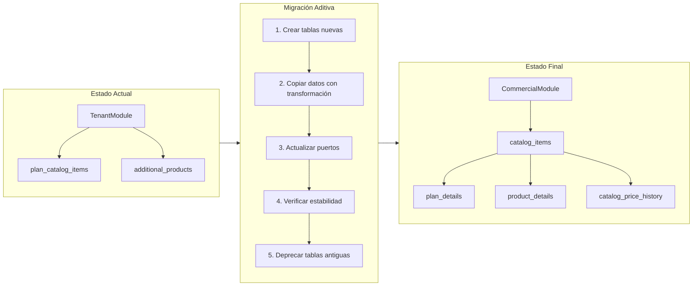

# ADR-028: Extracción del Módulo Comercial como Bounded Context Independiente

---

## Estado

Aprobado por CTO el 2026-04-18.

---

## Contexto

Las entidades `PlanCatalogItem` y `AdditionalProduct` actualmente viven dentro de `TenantModule`, que es el módulo responsable del ciclo de vida del tenant (provisioning de schema, resolución de contexto, dashboard summary). Mezclar la lógica de catálogo comercial con la administración de tenants genera:

1. **Violación de responsabilidad única:** TenantModule gestiona infraestructura multi-tenant Y catálogo de productos, dos dominios distintos.
2. **Sin historial de precios:** Los precios se almacenan como campos simples (`basePrice`, `installationFee`) sin historial inmutable. Cambiar un precio destruye el valor anterior.
3. **Sin pricing por segmento:** Un plan tiene un solo precio, pero los ISPs colombianos cobran diferente a residencial vs PYME vs gobierno.
4. **Sin bundles, promociones ni reglas de compatibilidad:** Funcionalidades necesarias para la operación comercial real del ISP.
5. **Sin clasificación tributaria configurable:** IVA, retención e ICA están hardcodeados o no existen, cuando la regulación colombiana exige tratamiento diferenciado por estrato y tipo de cliente.
6. **CRM ya consume catálogo via puerto:** `PlanCatalogReadPort` en MOD05 fue diseñado para desacoplar; la extracción a módulo propio materializa esta intención.

---

## Decisión

Extraer el dominio comercial a un nuevo Bounded Context `CommercialModule` (MOD06) con las siguientes decisiones técnicas:

### D1: Class Table Inheritance para catálogo unificado

Tabla base `catalog_items` con discriminante `type` (PLAN/PRODUCT/SERVICE) + tablas de extensión `plan_details`, `product_details`, `service_details`. Permite búsqueda unificada y composición en bundles, manteniendo integridad de datos por tipo.

### D2: SCD Tipo 2 para historial de precios

Tabla `catalog_price_history` con `valid_from`, `valid_to`, `is_current`. Nunca UPDATE de precio; siempre INSERT con cierre automático del registro anterior. Unique index parcial `(item_id, segment) WHERE is_current = true` para prevenir race conditions.

### D3: Pricing por segmento de cliente

Cada ítem puede tener N precios vigentes simultáneos, uno por `CustomerSegment` (RESIDENTIAL, SOHO, PYME, CORPORATE, GOVERNMENT, WHOLESALE).

### D4: Clasificación tributaria configurable

Tabla `tax_classifications` + `tax_rules` administrables por UI. El catálogo define **qué impuestos aplican y bajo qué condiciones**; Billing (futuro) calcula montos finales. Las reglas son modificables sin intervención técnica para adaptarse a cambios regulatorios.

### D5: Migración aditiva desde TenantModule

Siguiendo el patrón exitoso de ADR-024 (migración CRM):
1. Crear nuevas tablas en el esquema tenant
2. Migrar datos de `plan_catalog_items` → `catalog_items` + `plan_details` + `catalog_price_history`
3. Migrar datos de `additional_products` → `catalog_items` + `product_details`
4. Actualizar `CommercialCatalogReadPort` para leer de las nuevas tablas
5. Preservar tablas antiguas como fallback (no eliminar inmediatamente)
6. Deprecar y eliminar tablas antiguas en sprint posterior tras confirmar estabilidad

---

## Estrategia de Migración

---

## Cambios de Boundary

| Aspecto | Antes | Después |
|---------|-------|---------|
| Owner de catálogo de planes | TenantModule | CommercialModule |
| Owner de productos adicionales | TenantModule | CommercialModule |
| Historial de precios | No existe | SCD Tipo 2 en CommercialModule |
| Pricing por segmento | No existe | CommercialModule |
| Bundles / Combos | No existe | CommercialModule |
| Promociones | No existe | CommercialModule |
| Reglas de compatibilidad | No existe | CommercialModule |
| Clasificación tributaria | No existe (hardcoded en RF-BIL-09) | CommercialModule (configurable) |
| Puerto de lectura | `PlanCatalogReadPort` (TenantModule) | `CommercialCatalogReadPort` (CommercialModule) |
| CRM consume catálogo | Via adapter en TenantModule | Via nuevo adapter en CommercialModule |
| TenantModule scope | Tenant lifecycle + catálogo + cobertura | Solo tenant lifecycle + cobertura + nodes comerciales |

---

## Consecuencias

### Positivas

1. **Separación de responsabilidades:** TenantModule vuelve a ser solo infraestructura multi-tenant.
2. **Inmutabilidad financiera:** SCD Tipo 2 preserva todo histórico de precios para auditoría y facturación.
3. **Flexibilidad comercial:** Bundles, promociones y pricing por segmento habilitan la operación comercial real del ISP.
4. **Adaptabilidad regulatoria:** Reglas tributarias configurables por UI sin cambios de código ante cambios de normativa.
5. **Extensibilidad:** Catálogo unificado facilita agregar nuevos tipos de ítems en el futuro.
6. **Patrón probado:** Migración aditiva siguiendo el éxito de ADR-024.

### Negativas

1. **Complejidad de migración:** Requiere copiar y transformar datos existentes sin downtime.
2. **Período de transición:** Tablas antiguas coexisten con nuevas hasta deprecación.
3. **Joins adicionales:** CTI requiere JOIN con tabla de extensión para detalle completo (mitigación: índices optimizados).
4. **Más tablas:** 11 tablas nuevas en el schema tenant (mitigación: responsabilidad clara por tabla).

### Riesgos

| Riesgo | Probabilidad | Impacto | Mitigación |
|--------|-------------|---------|------------|
| Migración de datos con pérdida | Baja | Alto | Migración transaccional, backup previo, tablas antiguas preservadas |
| CRM pierde lectura de catálogo durante migración | Baja | Alto | Migración atómica, actualización simultánea del adapter |
| Performance con CTI y SCD joins | Baja | Medio | Índices parciales, materialización de vista si necesario |
| Reglas tributarias mal configuradas | Media | Alto | Seed con reglas base colombianas; validación de coherencia |

---

## Alternativas Consideradas

### A1: Extender entidades actuales en TenantModule (sin extracción)

**Descartada.** Agrega más responsabilidad a TenantModule violando SRP. No resuelve el problema de fondo: TenantModule no debería ser el owner del dominio comercial.

### A2: Single Table Inheritance (todos los tipos en una tabla)

**Descartada.** Genera demasiados NULLs conforme crecen los tipos. La tabla se vuelve difícil de mantener y validar.

### A3: Entidades completamente separadas (sin catálogo unificado)

**Descartada.** Impide bundles mixtos (PLAN + PRODUCTO + SERVICIO) y dificulta búsqueda transversal del catálogo.

### A4: CommercialModule como wrapper sobre tablas actuales (sin migración)

**Considerada pero descartada.** Crea dependencia circular: CommercialModule leería tablas que TenantModule "posee". Viola boundaries del modulith. La migración de datos es preferible.

---

## Notas de Implementación

- `CommercialNode` y `CoverageZone` permanecen en TenantModule — pertenecen al dominio de infraestructura/cobertura, no al comercial.
- El enum `AdditionalProductCategory` en `@iwana/shared` se renombra a `ProductCategory` y se extiende con `NETWORKING` y `CPE`.
- El seed de clasificaciones tributarias debe incluir las 3 clasificaciones base colombianas (IVA_FULL, IVA_EXEMPT, IVA_EXCLUDED) con las reglas por defecto documentadas en RF-BIL-09.
