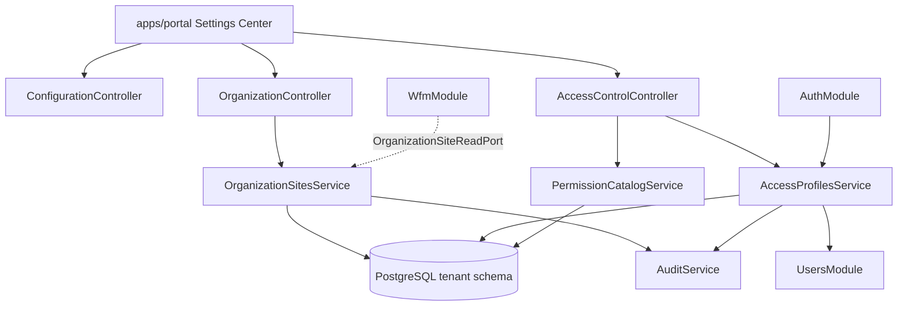

# HLD - MOD00 Configuracion Control Plane

**Version:** 1.0  
**Estado:** Aprobado  
**Fecha:** 2026-05-19  
**Modo activo:** Architect  
**Autor:** AI-EM-ARCH  
**PRD de referencia:** docs/prds/PRD-MOD00-CONFIGURACION-CONTROL-PLANE-v1.0.md  
**ADR aprobado:** docs/adrs/ADR-040-Configuracion-Control-Plane-Organizacion-Acceso.md  
**Plan de ejecucion:** docs/plans/2026-05-19-mod00-configuracion-control-plane.md  
**Prompt de ejecucion:** docs/prompts/PROMPT-MOD00-CONFIGURACION-FASE-01-v1.0.md

---

## 1. Contexto tecnico

MOD00 define Configuracion como control plane federado del tenant. El backend debe seguir siendo un modulith NestJS con boundaries explicitos, multi-tenancy por schema PostgreSQL y comunicacion cross-module por puertos tipados o eventos.

El cambio no busca centralizar todos los datos operativos. Busca crear dos capacidades transversales administradas desde Configuracion:

1. **Organizacion/Sedes:** dato maestro de sedes y ubicaciones operativas.
2. **Usuarios y acceso:** perfiles configurables sobre roles base existentes.

---

## 2. Bounded contexts afectados

| Bounded context | Impacto | Regla |
| --- | --- | --- |
| Configuracion / MOD00 | Principal | Control plane UX, Organizacion/Sedes y perfiles de acceso |
| TenantModule | Upstream | TenantContext, settings globales existentes, perfil empresa legacy |
| UsersModule | Upstream | Owner de `User`, `UserRole`, CRUD de cuentas y MFA por usuario |
| AuthModule | Upstream | JWT, MFA, guards y sesion |
| AuditModule | Transversal | Auditoria de cambios sensibles |
| WfmModule | Consumer | Consume sedes organizacionales para despacho; conserva agenda y Work Orders |
| PartiesModule | Relacionado | Owner de identidad de negocio y roles de tercero |
| Inventory futuro | Consumer | Consumira sedes con capacidad `WAREHOUSE` |
| Billing futuro | Consumer | Consumira sedes con capacidad `COLLECTION_POINT` |
| apps/portal | Principal | UI de Configuracion v2 |

### Boundary explicito

- Configuracion no lee tablas internas de WFM, Inventory, Billing, Commercial o Assurance.
- WFM no lee tablas de Organizacion directamente; usa puerto `OrganizationSiteReadPort` o adapter aprobado.
- Users sigue siendo owner de cuentas; Access Profiles no reemplaza `UserRole`.
- Parties no se mezcla con perfiles de acceso. `PartyRole` representa rol de negocio; `AccessProfile` representa permisos de sistema.

---

## 3. Arquitectura propuesta

### Roadmap tecnico por fases

| Fase | Backend | Frontend | Database | Integraciones |
| --- | --- | --- | --- | --- |
| Fase 01 | `OrganizationModule`, `AccessControlModule`, contratos REST y puertos | Secciones `Organizacion` y `Usuarios y acceso` en settings | Tablas tenant para sedes, capacidades, horarios, perfiles y permisos | Puerto preparado para WFM, sin migrar Work Orders |
| Fase 02 | Adapter WFM -> `OrganizationSiteReadPort`, compatibilidad `operatingSiteId`/`organizationSiteId` | Reubicar Operacion de campo dentro del centro de settings | Mapping o columna aprobada para relacion WFM legacy | WFM consume sedes por puerto, no por tabla directa |
| Fase 03 | APIs federadas de settings por modulo owner | Navegacion de settings por modulo con estados reales/no disponibles | Solo cambios del modulo owner correspondiente | Commercial, Inventory y Billing exponen configuracion por contrato |
| Fase 04 | `PermissionsGuard` granular en endpoints seleccionados y auditoria reforzada | Matriz avanzada de permisos y evidencia de cambios | Indices/cache si el volumen lo exige | Invalidacion de permisos y observabilidad operacional |

La Fase 01 no debe implementar funcionalidades de Fase 02-04 salvo interfaces preparatorias explicitamente listadas en este HLD.

### Artefactos de ejecucion por fase

| Fase | Plan | Prompt | Checklist |
| --- | --- | --- | --- |
| Fase 01 | `docs/plans/2026-05-19-mod00-configuracion-control-plane.md` | `docs/prompts/PROMPT-MOD00-CONFIGURACION-FASE-01-v1.0.md` | `docs/quality/CHECKLIST-MOD00-CONFIGURACION-FASE-01-v1.0.md` |
| Fase 02 | `docs/plans/2026-05-19-mod00-configuracion-fase-02-wfm-integration.md` | `docs/prompts/PROMPT-MOD00-CONFIGURACION-FASE-02-v1.0.md` | `docs/quality/CHECKLIST-MOD00-CONFIGURACION-FASE-02-v1.0.md` |
| Fase 03 | `docs/plans/2026-05-19-mod00-configuracion-fase-03-settings-federados.md` | `docs/prompts/PROMPT-MOD00-CONFIGURACION-FASE-03-v1.0.md` | `docs/quality/CHECKLIST-MOD00-CONFIGURACION-FASE-03-v1.0.md` |
| Fase 04 | `docs/plans/2026-05-19-mod00-configuracion-fase-04-gobierno-avanzado.md` | `docs/prompts/PROMPT-MOD00-CONFIGURACION-FASE-04-v1.0.md` | `docs/quality/CHECKLIST-MOD00-CONFIGURACION-FASE-04-v1.0.md` |



### Modulos backend sugeridos

La implementacion puede hacerse como subcarpetas dentro de `apps/api/src/modules/configuration/` o como modulos Nest separados registrados en `AppModule`. La recomendacion es crear modulos separados para boundaries internos claros:

```text
apps/api/src/modules/configuration/
  configuration.module.ts
  configuration.controller.ts
  ports/

apps/api/src/modules/organization/
  organization.module.ts
  organization.controller.ts
  services/
    organization-sites.service.ts
    organization-site-hours.service.ts
    organization-site-assignments.service.ts
  ports/
    organization-site-read.port.ts
    organization-site-read.adapter.ts
  dto/
  schemas/
  tests/

apps/api/src/modules/access-control/
  access-control.module.ts
  access-control.controller.ts
  services/
    permission-catalog.service.ts
    access-profiles.service.ts
    user-access-profiles.service.ts
  guards/
    permissions.guard.ts
  decorators/
    permissions.decorator.ts
  dto/
  schemas/
  tests/
```

Si el CTO prefiere mantener menos modulos Nest, se puede agrupar bajo `ConfigurationModule`, pero los servicios y puertos deben conservar boundaries internos.

---

## 4. Modelo de datos

Todas las tablas viven en schema tenant y se resuelven por `SET LOCAL search_path`. No se declaran schemas fijos en entidades tenant.

### 4.1 Organizacion/Sedes

#### `organization_sites`

| Campo | Tipo | Regla |
| --- | --- | --- |
| `id` | uuid PK | `gen_random_uuid()` |
| `tenant_id` | uuid | Referencia logica a tenant |
| `name` | varchar(160) | Requerido |
| `code` | varchar(40) | Unico por tenant activo |
| `site_type` | enum/varchar | `OFFICE`, `WAREHOUSE`, `TECH_BASE`, `CUSTOMER_SERVICE`, `COLLECTION_POINT`, `NOC`, `MIXED` |
| `address` | varchar(240) nullable | Sin PII de clientes |
| `municipality` | varchar(120) nullable | Colombia u otros paises |
| `department` | varchar(120) nullable | Departamento/estado |
| `country` | varchar(2) | ISO-3166, default `CO` |
| `latitude` | numeric(10,7) nullable | Validar rango |
| `longitude` | numeric(10,7) nullable | Validar rango |
| `is_primary` | boolean | Maximo una primaria por tenant activo |
| `is_active` | boolean | Default true |
| `created_at` / `updated_at` / `deleted_at` | timestamptz | Auditoria tecnica |

#### `organization_site_capabilities`

| Campo | Tipo | Regla |
| --- | --- | --- |
| `id` | uuid PK | Identificador |
| `tenant_id` | uuid | Tenant lógico |
| `site_id` | uuid | FK tenant-local a `organization_sites.id` |
| `capability` | varchar | `CUSTOMER_SERVICE`, `TECH_DISPATCH`, `WAREHOUSE`, `COLLECTION_POINT`, `ADMIN_OFFICE`, `NOC`, `SALES_OFFICE` |
| `is_enabled` | boolean | Default true |

Unique activo: `(tenant_id, site_id, capability)`.

#### `organization_site_business_hours`

| Campo | Tipo | Regla |
| --- | --- | --- |
| `id` | uuid PK | Identificador |
| `tenant_id` | uuid | Tenant lógico |
| `site_id` | uuid | FK tenant-local |
| `weekday` | enum/varchar | `MONDAY` a `SUNDAY` |
| `opens_at` | time nullable | Requerido si abierto |
| `closes_at` | time nullable | Requerido si abierto |
| `is_open` | boolean | Default true |

Unique activo: `(tenant_id, site_id, weekday)`.

#### `organization_site_assignments`

| Campo | Tipo | Regla |
| --- | --- | --- |
| `id` | uuid PK | Identificador |
| `tenant_id` | uuid | Tenant lógico |
| `site_id` | uuid | FK tenant-local |
| `user_id` | uuid | Referencia logica a `users.id` |
| `assignment_type` | varchar | `HOME_SITE`, `WORKS_AT`, `INVENTORY_CUSTODIAN`, `CASHIER`, `SUPERVISOR` |
| `valid_from` | date | Default current date |
| `valid_to` | date nullable | Fin de vigencia opcional |
| `is_active` | boolean | Default true |

#### `organization_site_responsibilities`

| Campo | Tipo | Regla |
| --- | --- | --- |
| `id` | uuid PK | Identificador |
| `tenant_id` | uuid | Tenant lógico |
| `site_id` | uuid | FK tenant-local |
| `responsibility` | varchar | `ADMINISTRATIVE`, `INVENTORY`, `COLLECTION`, `FIELD_OPERATIONS`, `CUSTOMER_SERVICE` |
| `user_id` | uuid | Responsable actual |
| `valid_from` / `valid_to` | date | Historial basico |

### 4.2 Access Control

#### `access_permission_catalog`

| Campo | Tipo | Regla |
| --- | --- | --- |
| `id` | uuid PK | Identificador |
| `permission_key` | varchar(120) | Unico por tenant o seed global tenant-local |
| `module_key` | varchar(60) | `settings`, `organization`, `users`, `wfm`, etc. |
| `action` | varchar(60) | `read`, `manage`, `execute`, `approve`, etc. |
| `description` | varchar(240) | Texto UI en espanol |
| `is_system` | boolean | Permisos seed no eliminables |
| `is_active` | boolean | Default true |

#### `access_profiles`

| Campo | Tipo | Regla |
| --- | --- | --- |
| `id` | uuid PK | Identificador |
| `tenant_id` | uuid | Tenant lógico |
| `name` | varchar(120) | Unico por tenant activo |
| `description` | text nullable | Descripcion opcional |
| `base_role_constraint` | varchar nullable | Limita asignacion a `UserRole` especifico |
| `scope_site_id` | uuid nullable | Perfil acotado a sede |
| `is_system` | boolean | Perfiles seed no eliminables |
| `is_active` | boolean | Default true |
| `created_at` / `updated_at` / `deleted_at` | timestamptz | Auditoria tecnica |

#### `access_profile_permissions`

| Campo | Tipo | Regla |
| --- | --- | --- |
| `id` | uuid PK | Identificador |
| `tenant_id` | uuid | Tenant lógico |
| `profile_id` | uuid | FK tenant-local |
| `permission_key` | varchar(120) | Referencia estable al catalogo |

#### `user_access_profiles`

| Campo | Tipo | Regla |
| --- | --- | --- |
| `id` | uuid PK | Identificador |
| `tenant_id` | uuid | Tenant lógico |
| `user_id` | uuid | Referencia logica a `users.id` |
| `profile_id` | uuid | FK tenant-local |
| `valid_from` | date | Default current date |
| `valid_to` | date nullable | Fin de vigencia opcional |
| `is_active` | boolean | Default true |

---

## 5. Contratos REST

Base path recomendado: `/api/v1/configuration` para shell y `/api/v1/organization`, `/api/v1/access-control` para capacidades transversales.

### 5.1 Organizacion

| Metodo | Ruta | Uso | Roles base |
| --- | --- | --- | --- |
| GET | `/organization/sites` | Listar sedes | ADMIN, NOC, SUPPORT, ACCOUNTANT, HR |
| POST | `/organization/sites` | Crear sede | ADMIN |
| GET | `/organization/sites/:id` | Detalle sede | ADMIN, NOC, SUPPORT, ACCOUNTANT, HR |
| PATCH | `/organization/sites/:id` | Editar sede | ADMIN |
| DELETE | `/organization/sites/:id` | Soft-delete sede | ADMIN |
| PUT | `/organization/sites/:id/capabilities` | Reemplazar capacidades | ADMIN |
| PUT | `/organization/sites/:id/business-hours` | Reemplazar horario semanal | ADMIN |
| PUT | `/organization/sites/:id/assignments` | Reemplazar asignaciones activas | ADMIN |
| PUT | `/organization/sites/:id/responsibilities` | Reemplazar responsables activos | ADMIN |

### 5.2 Access Control

| Metodo | Ruta | Uso | Roles base |
| --- | --- | --- | --- |
| GET | `/access-control/permissions` | Catalogo de permisos | ADMIN |
| GET | `/access-control/profiles` | Listar perfiles | ADMIN |
| POST | `/access-control/profiles` | Crear perfil | ADMIN |
| PATCH | `/access-control/profiles/:id` | Editar perfil | ADMIN |
| DELETE | `/access-control/profiles/:id` | Soft-delete perfil no sistema | ADMIN |
| PUT | `/access-control/profiles/:id/permissions` | Reemplazar permisos | ADMIN |
| PUT | `/access-control/users/:userId/profiles` | Asignar perfiles a usuario | ADMIN |

### 5.3 Puertos

```ts
export interface OrganizationSiteSummary {
  id: string;
  name: string;
  code: string;
  capabilities: string[];
  isActive: boolean;
}

export abstract class OrganizationSiteReadPort {
  abstract listByCapability(input: {
    tenantId: string;
    capability: string;
  }): Promise<OrganizationSiteSummary[]>;
}
```

WFM debe consumir `OrganizationSiteReadPort` para sedes con `TECH_DISPATCH`.

---

## 6. Seguridad y autorizacion

### 6.1 Pipeline

1. `JwtAuthGuard` valida sesion.
2. `TenantMiddleware` resuelve tenant y schema.
3. `RolesGuard` valida `UserRole` base.
4. `PermissionsGuard` futuro valida permisos granulares cuando el endpoint lo declare.
5. DTO/Zod valida payload externo.
6. Servicio valida invariantes de negocio.
7. Audit registra mutaciones.

### 6.2 Permisos seed iniciales

| Permiso | Uso |
| --- | --- |
| `settings.read` | Ver Configuracion |
| `settings.manage` | Administrar configuracion general |
| `organization.sites.read` | Ver sedes |
| `organization.sites.manage` | Gestionar sedes |
| `organization.hours.manage` | Gestionar horarios institucionales |
| `organization.assignments.manage` | Gestionar asignaciones/responsables |
| `users.read` | Ver usuarios |
| `users.manage` | Gestionar usuarios |
| `access.profiles.read` | Ver perfiles |
| `access.profiles.manage` | Gestionar perfiles |
| `wfm.schedule.read` | Ver agenda WFM |
| `wfm.schedule.manage` | Gestionar agenda WFM |
| `wfm.work_orders.execute` | Ejecutar Work Orders |
| `inventory.stock.read` | Ver inventario futuro |
| `billing.payments.register` | Registrar recaudo futuro |

### 6.3 Reglas criticas

- Un perfil no puede conceder permisos incompatibles con el rol base permitido.
- `ADMIN` mantiene capacidad de recuperacion administrativa, pero no debe poder eliminar el ultimo perfil/admin efectivo sin proteccion anti-lockout.
- `SYSTEM_ADMIN` e `IWANA_SUPPORT` siguen siendo roles de plataforma y no se asignan desde portal.

---

## 7. Frontend portal

### Rutas recomendadas

```text
apps/portal/src/app/dashboard/settings/page.tsx
apps/portal/src/app/dashboard/settings/organization/page.tsx
apps/portal/src/app/dashboard/settings/organization/sites/page.tsx
apps/portal/src/app/dashboard/settings/organization/sites/[id]/page.tsx
apps/portal/src/app/dashboard/settings/access/page.tsx
apps/portal/src/app/dashboard/settings/access/profiles/page.tsx
```

### Componentes recomendados

```text
apps/portal/src/components/settings/
  SettingsShell.tsx
  SettingsSectionCard.tsx
  settings-navigation.ts

apps/portal/src/components/organization/
  OrganizationSitesClient.tsx
  OrganizationSitesTable.tsx
  OrganizationSiteFormDialog.tsx
  OrganizationSiteDetail.tsx
  OrganizationSiteCapabilities.tsx
  OrganizationSiteHoursEditor.tsx
  OrganizationSiteAssignments.tsx

apps/portal/src/components/access-control/
  AccessProfilesClient.tsx
  AccessProfilesTable.tsx
  AccessProfileFormDialog.tsx
  PermissionMatrix.tsx
  UserProfileAssignments.tsx
```

### UI rules

- Textos visibles en espanol y sentence case.
- Tablas con `align-middle` por defecto.
- Formularios con Zod/react-hook-form si el patron local lo permite.
- No renderizar enums crudos; mapear a labels de negocio.
- No ocultar errores de autorizacion como si fueran estados vacios.

---

## 8. Migracion desde WFM

### Fase transitoria

1. Mantener tablas WFM existentes.
2. Crear tablas Organizacion/Sedes.
3. Crear seed o backfill desde `wfm_operating_sites` hacia `organization_sites` con capacidad `TECH_DISPATCH`.
4. Guardar mapping temporal `wfm_operating_site_id -> organization_site_id` en tabla de migracion o campo nullable si se aprueba.
5. Ajustar WFM para aceptar `organizationSiteId` sin romper `operatingSiteId` legacy.
6. Deprecar escritura de nuevas sedes desde WFM cuando Organizacion este estable.

### Regla de no perdida

Ninguna agenda, visit request o Work Order historica debe quedar sin referencia legible. Si se elimina una sede organizacional, WFM conserva snapshots o referencias legacy necesarias para auditoria operacional.

---

## 9. Testing

### Backend

- Unit: validaciones de sedes, capacidades, horarios y perfiles.
- Unit: incompatibilidad entre rol base y permisos.
- HTTP: RBAC para crear/editar/eliminar sedes y perfiles.
- Integration: aislamiento tenant de sedes/perfiles.
- Migration: up/down de tablas nuevas.

### Frontend

- Jest: helpers de labels, permission matrix y normalizacion de horarios.
- Component tests: tablas y dialogs principales.
- Playwright: ADMIN crea sede, configura horario, crea perfil y asigna a usuario.

### Comandos esperados

```bash
pnpm --filter @iwana/api test -- organization access-control
pnpm --filter @iwana/api typecheck
pnpm --filter @iwana/portal test -- settings organization access-control
pnpm --filter @iwana/portal typecheck
pnpm test:e2e:portal --grep "Configuracion"
```

---

## 10. Riesgos tecnicos

| Riesgo | Impacto | Mitigacion |
| --- | --- | --- |
| Circularidad entre Users y Access Control | Alto | Access referencia userId logico; Users no importa servicios internos de Access |
| Romper WFM existente | Alto | Migracion aditiva; compatibilidad `operatingSiteId` durante transicion |
| Permisos inconsistentes en cache | Medio | TTL corto e invalidacion al mutar perfiles; no cache en primera fase si no hace falta |
| Sobrecargar settings UI | Medio | Subrutas y componentes dedicados |
| Confusion entre PartyRole y AccessProfile | Alto | Naming y docs: rol de tercero vs perfil de acceso |
