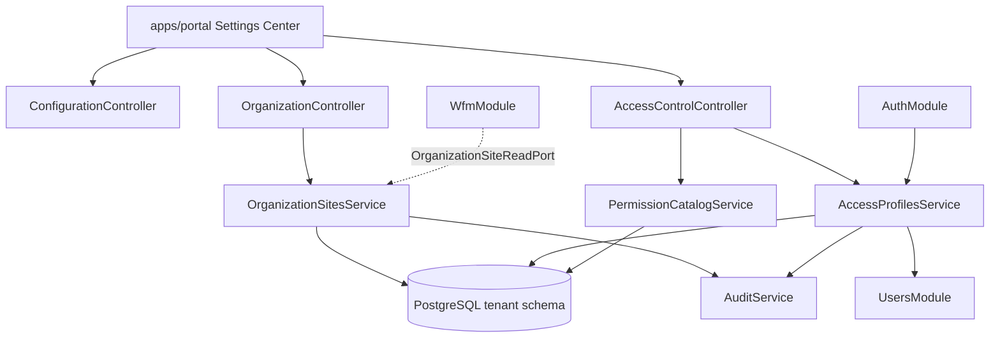

# HLD - MOD00 Configuracion Control Plane

**Version:** 1.7
**Estado:** Aprobado  
**Fecha:** 2026-08-28
**Modo activo:** Architect  
**Autor:** AI-EM-ARCH  
**PRD de referencia:** docs/prds/PRD-MOD00-CONFIGURACION-CONTROL-PLANE-v1.0.md  
**ADR aprobado:** docs/adrs/ADR-040-Configuracion-Control-Plane-Organizacion-Acceso.md  
**ADR aprobado:** ADR-083 — docs/adrs/ADR-083-Convergencia-RBAC-Granular-Modulos-Operativos.md (aprobado por el CTO el 2026-08-28); gobierna el addendum §6.6  
**Plan de ejecucion:** docs/plans/2026-05-19-mod00-configuracion-control-plane.md  
**Prompt de ejecucion:** docs/prompts/PROMPT-MOD00-CONFIGURACION-FASE-01-v1.0.md

---

## 1. Contexto tecnico

MOD00 define Configuracion como control plane federado del tenant. El backend debe seguir siendo un modulith NestJS con boundaries explicitos, multi-tenancy por schema PostgreSQL y comunicacion cross-module por puertos tipados o eventos.

El cambio no busca centralizar todos los datos operativos. Busca crear dos capacidades transversales administradas desde Configuracion:

1. **Organizacion/Sedes:** dato maestro de sedes y ubicaciones operativas.
2. **Usuarios y acceso:** roles de empresa configurables sobre categorias base existentes.

---

## 2. Bounded contexts afectados

| Bounded context       | Impacto     | Regla                                                                       |
| --------------------- | ----------- | --------------------------------------------------------------------------- |
| Configuracion / MOD00 | Principal   | Control plane UX, Organizacion/Sedes y perfiles de acceso                   |
| TenantModule          | Upstream    | TenantContext, settings globales existentes, perfil empresa legacy          |
| UsersModule           | Upstream    | Owner de `User`, `UserRole`, CRUD de cuentas y MFA por usuario              |
| AuthModule            | Upstream    | JWT, MFA, guards y sesion                                                   |
| AuditModule           | Transversal | Auditoria de cambios sensibles                                              |
| WfmModule             | Consumer    | Consume sedes organizacionales para despacho; conserva agenda y Work Orders |
| PartiesModule         | Relacionado | Owner de identidad de negocio y roles de tercero                            |
| Inventory futuro      | Consumer    | Consumira sedes con capacidad `WAREHOUSE`                                   |
| Billing futuro        | Consumer    | Consumira sedes con capacidad `COLLECTION_POINT`                            |
| NMS futuro            | Consumer    | Consumira nodos tecnicos propios y referenciara sedes sin absorber su owner |
| apps/portal           | Principal   | UI de Configuracion v2                                                      |

### Boundary explicito

- Configuracion no lee tablas internas de WFM, Inventory, Billing, Commercial o Assurance.
- WFM no lee tablas de Organizacion directamente; usa puerto `OrganizationSiteReadPort` o adapter aprobado.
- Users sigue siendo owner de cuentas; `AccessProfile` no reemplaza `UserRole`.
- Parties no se mezcla con perfiles de acceso. `PartyRole` representa rol de negocio; `AccessProfile` representa permisos de sistema.

### Addendum 2026-05-25 - terminologia operativa visible

Se fija una separacion obligatoria entre termino tecnico y termino visible para producto:

| Capa | Termino tecnico | Termino visible recomendado | Owner |
| --- | --- | --- | --- |
| Identidad estructural | `UserRole` | Categoria base | Users/Auth |
| Agrupador configurable de permisos | `AccessProfile` | Rol de empresa | MOD00 Access Control |
| Preset inicial | `AccessProfile.isSystem = true` | Plantilla inicial | MOD00 Access Control |
| Accion autorizable | `AccessPermissionKey` | Permiso | Catalogo versionado |

Reglas derivadas:

1. El portal no debe exponer `AccessProfile` como "perfil configurable" cuando el contexto sea operacion administrativa del tenant.
2. El portal no debe llamar "rol base" a una plantilla inicial de acceso porque ese termino ya corresponde al `UserRole` tecnico.
3. La pantalla `/dashboard/settings/access` debe comportarse como CRUD y gobierno de roles de empresa; la pantalla `/dashboard/users` debe consumir dichos roles para asignacion operativa.
4. La compatibilidad se sigue resolviendo por `baseRoleConstraint === user.role`; el cambio es semantico y de UX, no de modelo core.

---

## 3. Arquitectura propuesta

### Roadmap tecnico por fases

| Fase    | Backend                                                                                          | Frontend                                                            | Database                                                             | Integraciones                                                      |
| ------- | ------------------------------------------------------------------------------------------------ | ------------------------------------------------------------------- | -------------------------------------------------------------------- | ------------------------------------------------------------------ |
| Fase 01 | `OrganizationModule`, `AccessControlModule`, contratos REST y puertos                            | Secciones `Organizacion` y `Usuarios y acceso` en settings          | Tablas tenant para sedes, capacidades, horarios, perfiles y permisos | Puerto preparado para WFM, sin migrar Work Orders                  |
| Fase 02 | Adapter WFM -> `OrganizationSiteReadPort`, compatibilidad `operatingSiteId`/`organizationSiteId` | Reubicar Operacion de campo dentro del centro de settings           | Mapping o columna aprobada para relacion WFM legacy                  | WFM consume sedes por puerto, no por tabla directa                 |
| Fase 03 | APIs federadas de settings por modulo owner                                                      | Navegacion de settings por modulo con estados reales/no disponibles | Solo cambios del modulo owner correspondiente                        | Commercial, Inventory y Billing exponen configuracion por contrato |
| Fase 04 | `PermissionsGuard` granular en endpoints seleccionados y auditoria reforzada                     | Matriz avanzada de permisos y evidencia de cambios                  | Indices/cache si el volumen lo exige                                 | Invalidacion de permisos y observabilidad operacional              |

La Fase 01 no debe implementar funcionalidades de Fase 02-04 salvo interfaces preparatorias explicitamente listadas en este HLD.

### Artefactos de ejecucion por fase

| Fase    | Plan                                                                      | Prompt                                                    | Checklist                                                    |
| ------- | ------------------------------------------------------------------------- | --------------------------------------------------------- | ------------------------------------------------------------ |
| Fase 01 | `docs/plans/2026-05-19-mod00-configuracion-control-plane.md`              | `docs/prompts/PROMPT-MOD00-CONFIGURACION-FASE-01-v1.0.md` | `docs/quality/CHECKLIST-MOD00-CONFIGURACION-FASE-01-v1.0.md` |
| Fase 02 | `docs/plans/2026-05-19-mod00-configuracion-fase-02-wfm-integration.md`    | `docs/prompts/PROMPT-MOD00-CONFIGURACION-FASE-02-v1.0.md` | `docs/quality/CHECKLIST-MOD00-CONFIGURACION-FASE-02-v1.0.md` |
| Fase 03 | `docs/plans/2026-05-19-mod00-configuracion-fase-03-settings-federados.md` | `docs/prompts/PROMPT-MOD00-CONFIGURACION-FASE-03-v1.0.md` | `docs/quality/CHECKLIST-MOD00-CONFIGURACION-FASE-03-v1.0.md` |
| Fase 04 | `docs/plans/2026-05-19-mod00-configuracion-fase-04-gobierno-avanzado.md`  | `docs/prompts/PROMPT-MOD00-CONFIGURACION-FASE-04-v1.0.md` | `docs/quality/CHECKLIST-MOD00-CONFIGURACION-FASE-04-v1.0.md` |



### Modulos backend sugeridos

La implementacion puede hacerse como subcarpetas dentro de `apps/api/src/modules/configuration/` o como modulos Nest separados registrados en `AppModule`. La recomendacion es crear modulos separados para boundaries internos claros:

```text
apps/api/src/modules/configuration/
  configuration.module.ts
  configuration.controller.ts
  ports/

apps/api/src/modules/organization/
  organization.module.ts
  organization.controller.ts
  services/
    organization-sites.service.ts
    organization-site-hours.service.ts
    organization-site-assignments.service.ts
  ports/
    organization-site-read.port.ts
    organization-site-read.adapter.ts
  dto/
  schemas/
  tests/

apps/api/src/modules/access-control/
  access-control.module.ts
  access-control.controller.ts
  services/
    permission-catalog.service.ts
    access-profiles.service.ts
    user-access-profiles.service.ts
  guards/
    permissions.guard.ts
  decorators/
    permissions.decorator.ts
  dto/
  schemas/
  tests/
```

Si el CTO prefiere mantener menos modulos Nest, se puede agrupar bajo `ConfigurationModule`, pero los servicios y puertos deben conservar boundaries internos.

---

## 4. Modelo de datos

Todas las tablas viven en schema tenant y se resuelven por `SET LOCAL search_path`. No se declaran schemas fijos en entidades tenant.

### 4.1 Organizacion/Sedes

#### `organization_sites`

| Campo                                      | Tipo                   | Regla                                                                                      |
| ------------------------------------------ | ---------------------- | ------------------------------------------------------------------------------------------ |
| `id`                                       | uuid PK                | `gen_random_uuid()`                                                                        |
| `tenant_id`                                | uuid                   | Referencia logica a tenant                                                                 |
| `name`                                     | varchar(160)           | Requerido                                                                                  |
| `code`                                     | varchar(40)            | Unico por tenant activo                                                                    |
| `site_type`                                | enum/varchar           | `OFFICE`, `WAREHOUSE`, `TECH_BASE`, `CUSTOMER_SERVICE`, `COLLECTION_POINT`, `NOC`, `MIXED` |
| `address`                                  | varchar(240) nullable  | Sin PII de clientes                                                                        |
| `municipality`                             | varchar(120) nullable  | Colombia u otros paises                                                                    |
| `department`                               | varchar(120) nullable  | Departamento/estado                                                                        |
| `country`                                  | varchar(2)             | ISO-3166, default `CO`                                                                     |
| `latitude`                                 | numeric(10,7) nullable | Validar rango                                                                              |
| `longitude`                                | numeric(10,7) nullable | Validar rango                                                                              |
| `is_primary`                               | boolean                | Maximo una primaria por tenant activo                                                      |
| `is_active`                                | boolean                | Default true                                                                               |
| `created_at` / `updated_at` / `deleted_at` | timestamptz            | Auditoria tecnica                                                                          |

#### `organization_site_capabilities`

| Campo        | Tipo    | Regla                                                                                                       |
| ------------ | ------- | ----------------------------------------------------------------------------------------------------------- |
| `id`         | uuid PK | Identificador                                                                                               |
| `tenant_id`  | uuid    | Tenant lógico                                                                                               |
| `site_id`    | uuid    | FK tenant-local a `organization_sites.id`                                                                   |
| `capability` | varchar | `CUSTOMER_SERVICE`, `TECH_DISPATCH`, `WAREHOUSE`, `COLLECTION_POINT`, `ADMIN_OFFICE`, `NOC`, `SALES_OFFICE` |
| `is_enabled` | boolean | Default true                                                                                                |

Unique activo: `(tenant_id, site_id, capability)`.

#### Addendum propuesto 2026-05-23 - boundary con NMS y enriquecimiento de sede

El refinamiento documentado en `docs/adrs/ADR-044-Separacion-OrganizationSite-NmsNode.md` agrega estas reglas objetivo sin romper el modelo base aprobado de MOD00:

1. `OrganizationSite` sigue siendo el maestro fisico y administrativo del tenant.
2. `OrganizationSiteType` no incorpora `NODE` como tipo principal.
3. El siguiente refinamiento de MOD00 debe agregar contacto operativo local del sitio con `contact_name` y `contact_phone`.
4. Las coordenadas y el contacto del sitio se tratan como dato maestro de sede, no como atributo exclusivo de NMS.
5. El futuro modulo NMS tendra entidad propia `nms_nodes` y relacion 1:N desde `organization_sites`.

Modelo conceptual objetivo de NMS:

| Campo                  | Tipo             | Regla                                                                  |
| ---------------------- | ---------------- | ---------------------------------------------------------------------- |
| `id`                   | uuid PK          | Identificador tecnico del nodo                                         |
| `tenant_id`            | uuid             | Tenant logico                                                          |
| `organization_site_id` | uuid nullable    | FK tenant-local a `organization_sites.id`; nullable solo por migracion |
| `technical_code`       | varchar          | Codigo tecnico estable del nodo                                        |
| `name`                 | varchar          | Nombre visible del nodo                                                |
| `role`                 | varchar          | Rol tecnico del nodo dentro de NMS                                     |
| `vendor`               | varchar nullable | Fabricante o familia tecnica                                           |
| `is_active`            | boolean          | Estado operativo                                                       |

`CommercialNode` de TenantModule permanece como concepto legacy de cobertura/comercial y no se promociona a sustituto de `OrganizationSite` ni de `NmsNode`.

#### `organization_site_business_hours`

| Campo       | Tipo          | Regla                |
| ----------- | ------------- | -------------------- |
| `id`        | uuid PK       | Identificador        |
| `tenant_id` | uuid          | Tenant lógico        |
| `site_id`   | uuid          | FK tenant-local      |
| `weekday`   | enum/varchar  | `MONDAY` a `SUNDAY`  |
| `opens_at`  | time nullable | Requerido si abierto |
| `closes_at` | time nullable | Requerido si abierto |
| `is_open`   | boolean       | Default true         |

Unique activo: `(tenant_id, site_id, weekday)`.

#### `organization_site_assignments`

| Campo             | Tipo          | Regla                                                                   |
| ----------------- | ------------- | ----------------------------------------------------------------------- |
| `id`              | uuid PK       | Identificador                                                           |
| `tenant_id`       | uuid          | Tenant lógico                                                           |
| `site_id`         | uuid          | FK tenant-local                                                         |
| `user_id`         | uuid          | Referencia logica a `users.id`                                          |
| `assignment_type` | varchar       | `HOME_SITE`, `WORKS_AT`, `INVENTORY_CUSTODIAN`, `CASHIER`, `SUPERVISOR` |
| `valid_from`      | date          | Default current date                                                    |
| `valid_to`        | date nullable | Fin de vigencia opcional                                                |
| `is_active`       | boolean       | Default true                                                            |

#### `organization_site_responsibilities`

| Campo                     | Tipo    | Regla                                                                               |
| ------------------------- | ------- | ----------------------------------------------------------------------------------- |
| `id`                      | uuid PK | Identificador                                                                       |
| `tenant_id`               | uuid    | Tenant lógico                                                                       |
| `site_id`                 | uuid    | FK tenant-local                                                                     |
| `responsibility`          | varchar | `ADMINISTRATIVE`, `INVENTORY`, `COLLECTION`, `FIELD_OPERATIONS`, `CUSTOMER_SERVICE` |
| `user_id`                 | uuid    | Responsable actual                                                                  |
| `valid_from` / `valid_to` | date    | Historial basico                                                                    |

### 4.2 Access Control

Decision adicional de exposicion:

- `access_profiles` persiste el concepto tecnico de `AccessProfile`, pero hacia portal se documenta y renderiza como **rol de empresa**.
- `user_access_profiles` representa la asignacion de roles de empresa a usuarios del tenant.
- Los registros `is_system = true` se usan como plantillas iniciales duplicables o asignables segun la estrategia UX aprobada.

#### `access_permission_catalog`

| Campo            | Tipo         | Regla                                            |
| ---------------- | ------------ | ------------------------------------------------ |
| `id`             | uuid PK      | Identificador                                    |
| `permission_key` | varchar(120) | Unico por tenant o seed global tenant-local      |
| `module_key`     | varchar(60)  | `settings`, `organization`, `users`, `wfm`, etc. |
| `action`         | varchar(60)  | `read`, `manage`, `execute`, `approve`, etc.     |
| `description`    | varchar(240) | Texto UI en espanol                              |
| `is_system`      | boolean      | Permisos seed no eliminables                     |
| `is_active`      | boolean      | Default true                                     |

#### `access_profiles`

| Campo                                      | Tipo             | Regla                                     |
| ------------------------------------------ | ---------------- | ----------------------------------------- |
| `id`                                       | uuid PK          | Identificador                             |
| `tenant_id`                                | uuid             | Tenant lógico                             |
| `name`                                     | varchar(120)     | Unico por tenant activo                   |
| `description`                              | text nullable    | Descripcion opcional                      |
| `base_role_constraint`                     | varchar nullable | Limita asignacion a `UserRole` especifico |
| `scope_site_id`                            | uuid nullable    | Rol de empresa acotado a sede             |
| `is_system`                                | boolean          | Plantilla inicial no eliminable           |
| `is_active`                                | boolean          | Default true                              |
| `created_at` / `updated_at` / `deleted_at` | timestamptz      | Auditoria tecnica                         |

#### `access_profile_permissions`

| Campo            | Tipo         | Regla                          |
| ---------------- | ------------ | ------------------------------ |
| `id`             | uuid PK      | Identificador                  |
| `tenant_id`      | uuid         | Tenant lógico                  |
| `profile_id`     | uuid         | FK tenant-local                |
| `permission_key` | varchar(120) | Referencia estable al catalogo |

#### `user_access_profiles`

| Campo        | Tipo          | Regla                          |
| ------------ | ------------- | ------------------------------ |
| `id`         | uuid PK       | Identificador                  |
| `tenant_id`  | uuid          | Tenant lógico                  |
| `user_id`    | uuid          | Referencia logica a `users.id` |
| `profile_id` | uuid          | FK tenant-local                |
| `valid_from` | date          | Default current date           |
| `valid_to`   | date nullable | Fin de vigencia opcional       |
| `is_active`  | boolean       | Default true                   |

### Addendum 2026-05-25 - flujo tecnico recomendado

1. `UsersController` y portal Users mantienen el owner del CRUD de cuenta, categoria base, estado, MFA y credenciales.
2. `AccessControlController` mantiene el owner del catalogo de permisos, CRUD de roles de empresa y plantillas iniciales.
3. El flujo de alta/edicion de usuario debe consultar roles de empresa compatibles con la categoria base seleccionada y persistir la asignacion usando el contrato de Access Control.
4. El calculo de permisos efectivos permanece en `EffectivePermissionsService` combinando baseline por categoria base y permisos agregados desde roles de empresa compatibles.
5. No se habilita creacion dinamica de nuevos `UserRole`; cualquier necesidad fuera del enum vigente requiere ADR y aprobacion CTO.

---

## 5. Contratos REST

Base path recomendado: `/api/v1/configuration` para shell y `/api/v1/organization`, `/api/v1/access-control` para capacidades transversales.

### 5.1 Organizacion

| Metodo | Ruta                                       | Uso                             | Roles base                          |
| ------ | ------------------------------------------ | ------------------------------- | ----------------------------------- |
| GET    | `/organization/sites`                      | Listar sedes                    | ADMIN, NOC, SUPPORT, ACCOUNTANT, HR |
| POST   | `/organization/sites`                      | Crear sede                      | ADMIN                               |
| GET    | `/organization/sites/:id`                  | Detalle sede                    | ADMIN, NOC, SUPPORT, ACCOUNTANT, HR |
| PATCH  | `/organization/sites/:id`                  | Editar sede                     | ADMIN                               |
| DELETE | `/organization/sites/:id`                  | Soft-delete sede                | ADMIN                               |
| PUT    | `/organization/sites/:id/business-hours`   | Reemplazar horario semanal      | ADMIN                               |
| PUT    | `/organization/sites/:id/assignments`      | Reemplazar asignaciones activas | ADMIN                               |
| PUT    | `/organization/sites/:id/responsibilities` | Reemplazar responsables activos | ADMIN                               |

### 5.2 Access Control

| Metodo | Ruta                                       | Uso                           | Roles base |
| ------ | ------------------------------------------ | ----------------------------- | ---------- |
| GET    | `/access-control/permissions`              | Catalogo de permisos          | ADMIN      |
| GET    | `/access-control/profiles`                 | Listar perfiles               | ADMIN      |
| POST   | `/access-control/profiles`                 | Crear perfil                  | ADMIN      |
| PATCH  | `/access-control/profiles/:id`             | Editar perfil                 | ADMIN      |
| DELETE | `/access-control/profiles/:id`             | Soft-delete perfil no sistema | ADMIN      |
| PUT    | `/access-control/profiles/:id/permissions` | Reemplazar permisos           | ADMIN      |
| PUT    | `/access-control/users/:userId/profiles`   | Asignar perfiles a usuario    | ADMIN      |

La politica MFA global del tenant se expone de forma visible dentro de `/dashboard/settings/access` como subseccion `Politicas de autenticacion`, reutilizando el contrato self-service vigente de Tenant/Auth para `mfa_required_all`. La ruta `/dashboard/settings/security` queda como redireccion legacy y no debe publicarse en el registry federado.

### 5.3 Puertos

```ts
export interface OrganizationSiteSummary {
  id: string;
  name: string;
  code: string;
  capabilities: string[];
  isActive: boolean;
}

export abstract class OrganizationSiteReadPort {
  abstract listByCapability(input: {
    tenantId: string;
    capability: string;
  }): Promise<OrganizationSiteSummary[]>;
}
```

WFM debe consumir `OrganizationSiteReadPort` para sedes con `TECH_DISPATCH`.

---

## 6. Seguridad y autorizacion

### 6.1 Pipeline

1. `JwtAuthGuard` valida sesion.
2. `TenantMiddleware` resuelve tenant y schema.
3. `RolesGuard` valida `UserRole` base.
4. `PermissionsGuard` valida permisos granulares cuando el endpoint lo declare.
5. DTO/Zod valida payload externo.
6. Servicio valida invariantes de negocio.
7. Audit registra mutaciones.

Lectura obligatoria del pipeline:

- `RolesGuard` sigue siendo la barrera primaria para gobierno del tenant.
- Los permisos granulares refinan acciones dentro del rol base permitido.
- Un perfil configurable no eleva a un usuario fuera de `UserRole.ADMIN` hacia capacidades de gobierno administrativo del tenant.

### 6.2 Catalogo seed versionado `MOD00_ACCESS_V1`

El catalogo se siembra de forma idempotente por tenant. Las claves son estables: no se renombran; si una clave cambia de significado se depreca y se crea una nueva. `ASSIGNABLE` significa que puede incluirse en perfiles de Fase 01. `RESERVED` significa visible solo como ruta futura, no asignable ni ejecutable por permisos granulares en esta fase.

Nota v1.7: esta tabla refleja el catalogo V1 sembrado en Fase 01 y queda historica (ya no incluye las claves `operations.*` ni `access.assignments.manage` incorporadas despues de Fase 01). El catalogo vigente es `MOD00_ACCESS_V2` y su evolucion viven en §6.6.

| Permiso                           | Modulo       | Estado Fase 01 | Uso                                                              |
| --------------------------------- | ------------ | -------------- | ---------------------------------------------------------------- |
| `settings.read`                   | settings     | ASSIGNABLE     | Ver centro de Configuracion                                      |
| `settings.manage`                 | settings     | ASSIGNABLE     | Administrar configuracion general de MOD00                       |
| `organization.sites.read`         | organization | ASSIGNABLE     | Ver sedes organizacionales                                       |
| `organization.sites.manage`       | organization | ASSIGNABLE     | Crear, editar, activar/desactivar y eliminar sedes               |
| `organization.hours.manage`       | organization | ASSIGNABLE     | Gestionar horarios institucionales de sedes                      |
| `organization.assignments.manage` | organization | ASSIGNABLE     | Gestionar asignaciones y responsables de sedes                   |
| `users.read`                      | users        | ASSIGNABLE     | Ver usuarios internos del tenant                                 |
| `users.manage`                    | users        | ASSIGNABLE     | Gestionar usuarios internos desde el contrato aprobado de Users  |
| `access.permissions.read`         | access       | ASSIGNABLE     | Ver catalogo de permisos y matriz disponible                     |
| `access.profiles.read`            | access       | ASSIGNABLE     | Ver perfiles configurables                                       |
| `access.profiles.manage`          | access       | ASSIGNABLE     | Crear, editar y desactivar perfiles                              |
| `wfm.schedule.read`               | wfm          | ASSIGNABLE     | Ver agenda WFM cuando el modulo exponga guard granular           |
| `wfm.schedule.manage`             | wfm          | ASSIGNABLE     | Gestionar agenda WFM cuando el modulo exponga guard granular     |
| `wfm.work_orders.execute`         | wfm          | ASSIGNABLE     | Ejecutar Work Orders asignadas cuando WFM exponga guard granular |
| `crm.customers.read`              | crm          | RESERVED       | Ver expedientes CRM en fase futura                               |
| `crm.customers.manage`            | crm          | RESERVED       | Gestionar expedientes CRM en fase futura                         |
| `commercial.catalog.read`         | commercial   | RESERVED       | Ver catalogo comercial en fase futura                            |
| `commercial.catalog.manage`       | commercial   | RESERVED       | Gestionar catalogo comercial en fase futura                      |
| `assurance.tickets.read`          | assurance    | RESERVED       | Ver tickets/PQR en fase futura                                   |
| `assurance.tickets.manage`        | assurance    | RESERVED       | Gestionar tickets/PQR en fase futura                             |
| `inventory.stock.read`            | inventory    | RESERVED       | Ver inventario futuro                                            |
| `inventory.stock.manage`          | inventory    | RESERVED       | Gestionar inventario futuro                                      |
| `billing.payments.read`           | billing      | RESERVED       | Ver recaudos futuros                                             |
| `billing.payments.register`       | billing      | RESERVED       | Registrar recaudo futuro                                         |
| `billing.invoices.read`           | billing      | RESERVED       | Ver facturas futuras                                             |
| `billing.invoices.manage`         | billing      | RESERVED       | Gestionar facturacion futura                                     |

### 6.3 Matriz de compatibilidad `UserRole` -> permisos asignables

Nota operativa: en la implementacion analizada, `access.profiles.manage` todavia cubre temporalmente la asignacion de perfiles a usuarios. El refinamiento aprobado separa esa operacion en un permiso dedicado sin relajar `UserRole.ADMIN` como prerrequisito.

La validacion se aplica en dos momentos: al guardar permisos de un perfil contra `baseRoleConstraint` y al asignar el perfil a un usuario contra el `UserRole` real del usuario. En Fase 01, `baseRoleConstraint` es obligatorio para perfiles creados por el tenant aunque la columna pueda permanecer nullable para compatibilidad futura.

| `UserRole` base | Permisos asignables en Fase 01                                                                              | Regla                                                                                     |
| --------------- | ----------------------------------------------------------------------------------------------------------- | ----------------------------------------------------------------------------------------- |
| `ADMIN`         | Todos los permisos `ASSIGNABLE` de `MOD00_ACCESS_V1`                                                        | Rol de administracion tenant; mantiene recuperacion operativa con proteccion anti-lockout |
| `NOC`           | `settings.read`, `organization.sites.read`, `wfm.schedule.read`                                             | Lectura operativa; no muta sedes, perfiles ni usuarios                                    |
| `SUPPORT`       | `settings.read`, `organization.sites.read`, `users.read`, `wfm.schedule.read`                               | Soporte consulta contexto; no administra acceso                                           |
| `SALES`         | `settings.read`, `organization.sites.read`                                                                  | Acceso base hasta que CRM/Commercial activen permisos propios                             |
| `TECHNICIAN`    | `settings.read`, `organization.sites.read`, `wfm.schedule.read`, `wfm.work_orders.execute`                  | Ejecucion de campo; no gestiona agenda ni sedes                                           |
| `ACCOUNTANT`    | `settings.read`, `organization.sites.read`                                                                  | Recaudo/Billing quedan reservados hasta modulo owner                                      |
| `HR`            | `settings.read`, `organization.sites.read`, `users.read`                                                    | RRHH futuro no administra asignaciones de sede en Fase 01                                 |
| `AUDITOR`       | `settings.read`, `organization.sites.read`, `users.read`, `access.permissions.read`, `access.profiles.read` | Solo lectura para revision y control                                                      |
| `CONTRACTOR`    | `settings.read`, `organization.sites.read`, `wfm.schedule.read`, `wfm.work_orders.execute`                  | Contratista operativo; solo ejecucion asignada                                            |
| `SUBSCRIBER`    | Ninguno                                                                                                     | Fuera de perfiles administrativos MOD00                                                   |
| `PARTNER`       | Ninguno                                                                                                     | Fuera de perfiles administrativos MOD00                                                   |
| `INVESTOR`      | Ninguno                                                                                                     | Fuera de perfiles administrativos MOD00                                                   |
| `SYSTEM_ADMIN`  | No asignable desde portal tenant                                                                            | Rol de plataforma, fuera de Access Profiles tenant                                        |
| `IWANA_SUPPORT` | No asignable desde portal tenant                                                                            | Rol de plataforma, fuera de Access Profiles tenant                                        |

Errores obligatorios:

- Permiso no existente en catalogo activo: `400 UNKNOWN_PERMISSION`.
- Permiso `RESERVED`: `400 PERMISSION_NOT_ASSIGNABLE_IN_PHASE`.
- Permiso incompatible con `baseRoleConstraint`: `400 PERMISSION_ROLE_INCOMPATIBLE`.
- Perfil asignado a usuario con rol distinto a `baseRoleConstraint`: `400 PROFILE_ROLE_INCOMPATIBLE`.
- Intento de asignar perfiles a roles de plataforma desde portal tenant: `403 PLATFORM_ROLE_NOT_TENANT_ASSIGNABLE`.

### 6.4 Reglas criticas

- Un perfil no puede conceder permisos incompatibles con el rol base permitido.
- `ADMIN` mantiene capacidad de recuperacion administrativa, pero no debe poder eliminar el ultimo perfil/admin efectivo sin proteccion anti-lockout.
- `SYSTEM_ADMIN` e `IWANA_SUPPORT` siguen siendo roles de plataforma y no se asignan desde portal.

### 6.5 Refinamientos obligatorios post-ejecucion

El analisis de la ejecucion implementada deja aprobados los siguientes refinamientos sin cambiar el boundary de MOD00:

1. Los endpoints sensibles de Users para gobierno del tenant deben endurecerse con `users.manage` ademas del rol base cuando el hardening se implemente.
2. `PUT /access-control/users/:userId/profiles` debe migrar desde el uso compartido de `access.profiles.manage` hacia un permiso dedicado de asignacion de acceso, manteniendo `UserRole.ADMIN` como prerrequisito.
3. `scope_site_id` debe dejar de ser metadata persistida solamente y pasar a formar parte del enforcement real de permisos efectivos o policies de recurso.
4. El shell federado de settings debe consumir `requiredPermissions` o devolver estados no operables explicitos para evitar navegacion hacia rutas que luego terminan en `403`.
5. El contrato `DELETE /organization/sites/:id` debe cerrarse en API, pruebas y portal para alinear implementacion con HLD aprobado.
6. La superficie de `Sedes registradas` debe consolidarse como una tabla compacta unica con acciones por fila, sin panel persistente de detalle, reservando el detalle operativo profundo para modulos consumidores posteriores.

### 6.6 Addendum de convergencia RBAC 2026-08-28 — catalogo `MOD00_ACCESS_V2` y cableado de modulos operativos

Gobernado por ADR-083 (aprobado por el CTO el 2026-08-28): docs/adrs/ADR-083-Convergencia-RBAC-Granular-Modulos-Operativos.md. Detalle tecnico del addendum §4.3.4 del PRD v1.7. La regla de §6.2 se conserva: las claves son estables; `crm.customers.*` se depreca (filas `isActive = false`, miembros enum `@deprecated`) y se crean claves nuevas por recurso real.

**Enum y catalogo (`@iwana/shared` + `access-control.constants.ts`):**

- `AccessPermissionKey` agrega 8 miembros: `CRM_SUBSCRIBERS_READ/MANAGE`, `CRM_EXPEDIENTES_READ/MANAGE`, `INVENTORY_PURCHASING_READ/MANAGE`; `CRM_CUSTOMERS_READ/MANAGE` quedan `@deprecated`.
- `AccessPermissionCatalogVersion` agrega `MOD00_ACCESS_V2`.
- El seed autocurativo por tenant promueve las 6 claves existentes (availability `ASSIGNABLE`, `catalogVersion` V2, descripcion visible sin "en fase futura"), siembra las 8 nuevas como `ASSIGNABLE` V2 y marca inactivas las 2 deprecadas. La matriz `ROLE_ASSIGNABLE_PERMISSION_MATRIX` y las plantillas se actualizan a la tabla del PRD §4.3.4.
- Migracion tenant numerada consecutiva, idempotente y reversible: up siembra catalogo V2, crea plantillas system "Acceso estandar {Categoria}" (una por categoria con perfiles, `baseRoleConstraint` = categoria) y asigna la estandar a cada usuario activo no-ADMIN sin perfiles activos. Down: elimina solo las asignaciones creadas por esta migracion, desactiva plantillas estandar y revierte filas V2. Mecanismo de reserva si G1 rechaza la asignacion masiva: fallback runtime documentado en ADR-083 D4 (no preferido).

**Cableado por controller (doble guard `JwtAuthGuard -> RolesGuard -> PermissionsGuard`):**

| Controller | Lectura (`@Permissions`) | Escritura (`@Permissions`) | Cambios de `@Roles` |
| --- | --- | --- | --- |
| `crm/subscribers/subscribers.controller.ts` | `crm.subscribers.read` | `crm.subscribers.manage` | GET de lista/detalle: + `TECHNICIAN`, + `AUDITOR` |
| `crm/expedientes` + `opportunities`, `prospects`, `potentials`, `quotes`, `contacts`, `contracts`, `reviews`, `habeas-data` | `crm.expedientes.read` | `crm.expedientes.manage` | GET: + `AUDITOR` |
| `crm/subscribers/subscriber-tax.controller.ts` | no cableado este ciclo | no cableado este ciclo | — |
| `assurance/assurance.controller.ts` | `assurance.tickets.read` | `assurance.tickets.manage` | GET: + `AUDITOR` |
| `inventory/inventory.controller.ts` | `inventory.stock.read` | `inventory.stock.manage` | GET: + `TECHNICIAN`, + `AUDITOR` |
| `inventory/purchasing.controller.ts` | `inventory.purchasing.read` | `inventory.purchasing.manage` | GET: + `AUDITOR` |
| `commercial/controllers/*` (catalog, bundle, promotion, compatibility, picker-search, dashboard) | `commercial.catalog.read` | `commercial.catalog.manage` | GET: + `AUDITOR` |

Reglas del cableado:

1. La ampliacion de `@Roles` aplica solo a endpoints de lectura con permiso granular — ADR-083 D2; los subconjuntos actuales de commercial (offers sin NOC, prices sin SUPPORT/NOC, compat sin ACCOUNTANT/NOC) se conservan via `@Roles`: el permiso unico no amplia lo que `@Roles` restringe.
2. Los 2 endpoints de expedientes que hoy incluyen `TECHNICIAN` (trabajo asignado) y todo endpoint de datos tributarios permanecen `@Roles`-only.
3. `billing.*` permanece RESERVED: no existe modulo backend.

**Cache de permisos efectivos:**

- `EffectivePermissionsService` agrega cache Redis clave `access:perms:{tenantId}:{userId}` (set de claves), TTL <= 60 s, miss -> calculo contra BD y write-through.
- Invalidacion activa (`DEL`) en los mismos puntos que hoy auditan mutaciones: crear/editar/borrar perfil, reemplazo de permisos y asignacion de perfiles a usuario (`access-control.service.ts`).
- La BD es fuente de verdad; fallo de Redis degrada a calculo directo, nunca a denegacion ni concesion.
- Tokens de plataforma siguen pasando directo (sin cache).

**Frontend (Fase 3, contrato con spec UX a emitir):**

- Condicion dura de despliegue (G1, AI-PROD-UX 2026-08-28): el gating de navegacion se activa por tenant solo despues de que la migracion del corte (plantillas estandar + asignacion D4) haya corrido en ese tenant (flag o despliegue posterior). Activarlo antes dejaria la nav vacia para todo no-ADMIN sin perfiles.
- Contexto compartido `usePermissions()` sobre `GET /access-control/me/effective-permissions`, alojado en el layout del dashboard (no dentro de Sidebar) para servir tambien a los gates de pagina; el Sidebar reemplaza `allowedRoles` estaticos por `requiredPermissions` (patron del hub de Configuracion); gates de pagina en Suscriptores, Oportunidades, Mesa de ayuda, Inventario (con Compras como gate de pestaña interna), Comercial y Programacion (aclaracion v1.7 por spec UX congelada 2026-08-28).
- La pantalla `/dashboard/settings/access` presenta una sola seccion de sugeridos con una card por tipo de usuario (6 actuales -> 9, se suman SALES, ACCOUNTANT y HR), y la UI de usuarios advierte que cambiar la categoria base descarta perfiles incompatibles al guardar.
- Prohibido ampliar permisos de backend desde la capa de presentacion (HLD-DE-06, HLD-MOD02-DASHBOARD-EMPRESA v2.0).

**Testing:**

- Invariantes de catalogo V2: claves usadas en `@Permissions` ⊆ catalogo activo; matriz ⊆ ASSIGNABLE; plantillas estandar ⊆ matriz de su categoria; claves deprecadas ausentes de matriz y plantillas.
- HTTP por modulo cableado: matriz rol × permiso (200/403) incluyendo las tres ampliaciones †.
- Seed/migracion: usuarios activos sin perfiles quedan cubiertos por estandar; idempotencia y down.
- E2E piloto: tecnico con perfil "Ver Suscriptores" ve el menu y consulta; sin el permiso, no.
- Adicionales G1: cambio de `UserRole` de un usuario deja de aportar perfiles incompatibles y invalida cache; invalidacion por abanico en mutaciones de perfil multi-usuario; fallo de Redis degrada a calculo BD sin denegar; tenant recien provisionado recibe catalogo V2 y plantillas estandar por la cadena de migraciones; tests negativos D7 (subscriber-tax y expedientes-TECHNICIAN sin cablear); invariante "todo handler con `@Permissions` declara tambien `@Roles`".

### 6.6.1 Firmas G1 (2026-08-28)

Productor del artefacto: AI-EM-ARCH. Firmas independientes con lectura de codigo real; condiciones incorporadas a este addendum.

| Revisor | Veredicto | Alcance | Condiciones (incorporadas) |
| --- | --- | --- | --- |
| AI-SR-FULL | GO CON CONDICIONES | Factibilidad backend | (1) Canon de plantillas: el seed autocurativo (`ensureSystemRoleTemplatesSeeded`) no debe renombrar/sobrescribir las plantillas estandar V2 en drift-repair; canon de 9 categorias; SUBSCRIBER/PARTNER/INVESTOR sin plantilla. (2) Deprecacion canonica de `crm.customers.*` expresable en el seed (`isActive: false` o claves fuera del array) y `listPermissions` pasa a `MOD00_ACCESS_V2`; el seed absorbe promociones y metadatos. (3) Invalidacion de cache por abanico a usuarios con asignacion activa del perfil mutado, invalidacion tambien en cambio de `role`/`status` desde Users via puerto de `AccessControlModule`, y degrade a calculo BD ante fallo de Redis (nunca denegar), con tests dedicados. Asignacion masiva set-based (INSERT...SELECT por plantilla). |
| AI-PROD-UX | GO CON CONDICIONES | Viabilidad UX | (1) Condicion dura de orden de despliegue: nav gating solo tras migracion del corte por tenant. (2) Gramatica de nav a congelar en spec: ocultar lo no efectivo (MVP) o 3 bandas ocultar/disabled/enlazar con `compatibilityMatrix`. (3) Estados de carga/error de nav sin bloquear navegacion; degrade presentacional al comportamiento estatico. (4) Una sola seccion de 9 sugeridos ordenada por tipo de usuario; extension de `SYSTEM_TEMPLATE_PROFILE_NAMES` (SALES, ACCOUNTANT, HR); vocabulario humano en UI. (5) Montaje del panel de accesos efectivos en el side peek de edicion de usuario (distincion de origen por cross-reference `isSystem`, sin cambio de contrato backend). (6) Advertencia de invalidacion de perfiles al cambiar categoria base, solo en edicion. |

Contrato de la spec UX de Fase 3 (autor AI-PROD-UX, a congelar antes de implementar frontend): modelo de nav y mapeo modulo->permisos; gates de pagina con 3 estados y deep-links; access con 9 sugeridos y regeneracion de snapshots E2E; users con panel de accesos efectivos y advertencia de categoria; matrices de estado transversales, WCAG 2.2 AA con tokens reales y vocabulario de la spec prevalente.


---

## 7. Frontend portal

### Rutas recomendadas

```text
apps/portal/src/app/dashboard/settings/page.tsx
apps/portal/src/app/dashboard/settings/organization/page.tsx
apps/portal/src/app/dashboard/settings/organization/sites/page.tsx
apps/portal/src/app/dashboard/settings/organization/sites/[id]/page.tsx
apps/portal/src/app/dashboard/settings/access/page.tsx
apps/portal/src/app/dashboard/settings/access/profiles/page.tsx
```

Ruta legacy permitida solo para transicion:

```text
apps/portal/src/app/dashboard/settings/security/page.tsx -> redirect('/dashboard/settings/access#politicas-de-autenticacion')
```

### Componentes recomendados

```text
apps/portal/src/components/settings/
  SettingsShell.tsx
  SettingsSectionCard.tsx

apps/portal/src/components/organization/
  OrganizationSitesClient.tsx
  OrganizationSitesTable.tsx
  OrganizationSitesPanel.tsx
  OrganizationSiteFormDialog.tsx
  OrganizationSiteServicesTab.tsx
  OrganizationSiteHoursEditor.tsx
  OrganizationSiteAssignments.tsx

apps/portal/src/components/access-control/
  AccessProfilesClient.tsx
  AccessProfilesTable.tsx
  AccessProfileFormDialog.tsx
  PermissionMatrix.tsx
  UserProfileAssignments.tsx
```

La vista principal de `Organizacion/Sedes` debe resolverse como una sola superficie administrativa: tabla compacta, resumen de servicios y acciones por fila. No se recomienda un panel persistente `OrganizationSiteDetail.tsx`; el detalle editable vive dentro del dialog de sede y el detalle operativo pertenece a modulos posteriores.

La vista `Usuarios y acceso` actua tambien como owner visible de la politica MFA global del tenant. `Mi perfil` conserva seguridad personal y `/dashboard/settings/security` no debe reaparecer como seccion independiente del shell.

### UI rules

- Textos visibles en espanol y sentence case.
- Tablas con `align-middle` por defecto.
- Formularios con Zod/react-hook-form si el patron local lo permite.
- No renderizar enums crudos; mapear a labels de negocio.
- No ocultar errores de autorizacion como si fueran estados vacios.

---

## 8. Migracion desde WFM

### Fase transitoria

1. Mantener tablas WFM existentes.
2. Crear tablas Organizacion/Sedes.
3. Crear seed o backfill desde `wfm_operating_sites` hacia `organization_sites` con capacidad `TECH_DISPATCH`.
4. Guardar mapping temporal `wfm_operating_site_id -> organization_site_id` en tabla de migracion o campo nullable si se aprueba.
5. Ajustar WFM para aceptar `organizationSiteId` sin romper `operatingSiteId` legacy.
6. Deprecar escritura de nuevas sedes desde WFM cuando Organizacion este estable.

### Regla de no perdida

Ninguna agenda, visit request o Work Order historica debe quedar sin referencia legible. Si se elimina una sede organizacional, WFM conserva snapshots o referencias legacy necesarias para auditoria operacional.

---

## 9. Testing

### Backend

- Unit: validaciones de sedes, capacidades, horarios y perfiles.
- Unit: incompatibilidad entre rol base y permisos.
- HTTP: RBAC para crear/editar/eliminar sedes y perfiles.
- Integration: aislamiento tenant de sedes/perfiles.
- Migration: up/down de tablas nuevas.

### Frontend

- Jest: helpers de labels, permission matrix y normalizacion de horarios.
- Component tests: tablas y dialogs principales.
- Playwright: ADMIN crea sede, configura horario, crea perfil y asigna a usuario.

### Comandos esperados

```bash
pnpm --filter @iwana/api test -- organization access-control
pnpm --filter @iwana/api typecheck
pnpm --filter @iwana/portal test -- settings organization access-control
pnpm --filter @iwana/portal typecheck
pnpm test:e2e:portal --grep "Configuracion"
```

---

## 10. Riesgos tecnicos

| Riesgo                                    | Impacto | Mitigacion                                                                            |
| ----------------------------------------- | ------- | ------------------------------------------------------------------------------------- |
| Circularidad entre Users y Access Control | Alto    | Access referencia userId logico; Users no importa servicios internos de Access        |
| Romper WFM existente                      | Alto    | Migracion aditiva; compatibilidad `operatingSiteId` durante transicion                |
| Permisos inconsistentes en cache          | Medio   | TTL corto e invalidacion al mutar perfiles; no cache en primera fase si no hace falta |
| Sobrecargar settings UI                   | Medio   | Subrutas y componentes dedicados                                                      |
| Confusion entre PartyRole y AccessProfile | Alto    | Naming y docs: rol de tercero vs perfil de acceso                                     |
