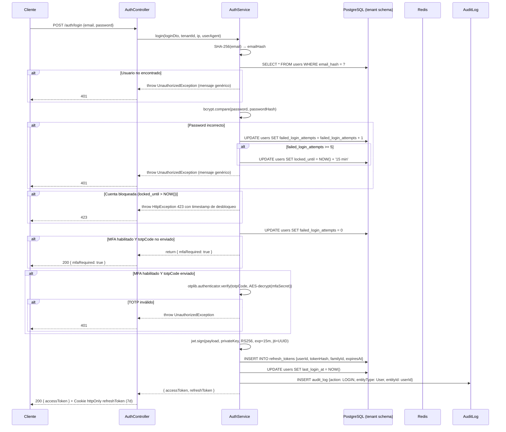
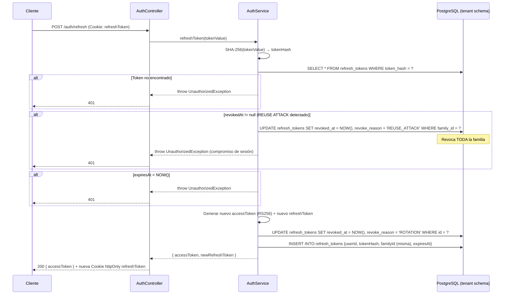
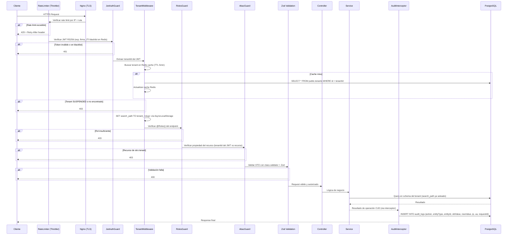

# HLD — Módulo 1: Auth + Tenant + Audit

## Arquitectura de Alto Nivel — iWana neXt Platform

**Versión:** 1.0
**Fecha:** 2026-03-08
**Estado:** APROBADO
**Autor:** AI-ARCH (Architect Software)
**Orquestado por:** AI-EM (Engineering Manager)
**PRD de referencia:** docs/prds/PRD-MOD01-DEFINICION-v1.1.md
**PRD detallado:** docs/prds/PRD-MOD01-Auth-Tenant-Audit-v1.0.md
**Stack tecnológico:** docs/prds/Stack_Tecnologico.md
**Política de ejecución:** docs/adrs/ADR-022-Politica-Ejecucion-Modular-Por-Fases.md
**Sprint plan:** docs/sprints/PLAN-MOD01-SPRINT-01-v1.0.md

---

## 1. Visión General del Módulo

### Responsabilidades por paquete

**@iwana/auth**

- Autenticación JWT RS256 con access token (15 min) y refresh token rotation (7 días, cookie httpOnly)
- MFA TOTP: setup (QR code + secret), verify (activación), disable (requiere password + código actual)
- Detección de reuse attack: refresh token ya rotado → revoca familia completa
- Bloqueo por intentos fallidos: 5 intentos → lockout 15 min
- Recuperación y cambio de contraseña
- JTI blacklist en Redis para revocación inmediata de access tokens (logout)

**@iwana/tenant**

- CRUD completo de tenants (solo SYSTEM_ADMIN)
- Aprovisionamiento automático de schemas PostgreSQL al crear tenant (BullMQ worker + DDL programático)
- Seed inicial por tenant: ADMIN con password temporal + config base + catálogo de documentos CO
- Schema routing middleware: cada request usa su schema exclusivo vía AsyncLocalStorage
- Cache de tenant en Redis (TTL 5 min) para evitar queries repetidas a public.tenants

**@iwana/audit**

- Interceptor global append-only: registra TODA operación CUD sin intervención del código de negocio
- API de consulta con filtros (entityType, userId, action, rango de fechas) y paginación cursor-based
- RLS en PostgreSQL: previene DELETE y UPDATE directos en audit_logs
- Retención mínima 7 años (Ley 1581/2012 + CRC)

### Boundaries

**IN — Lo que construimos:**

- @iwana/auth: Autenticación JWT RS256, MFA TOTP, gestión de sesiones con refresh token rotation y detección de reuse attack, recuperación de contraseña, pipeline de seguridad completo
- @iwana/tenant: CRUD de tenants, aprovisionamiento automático de schemas PostgreSQL, seed inicial, schema routing middleware
- @iwana/audit: Interceptor global append-only, API de consulta de audit logs con paginación cursor-based, RLS
- Guards y decoradores compartidos: `JwtAuthGuard`, `RolesGuard`, `AbacGuard`, `@CurrentUser()`, `@Roles()`, `@Public()`, `@TenantId()`
- Frontend: página de login, flujo de MFA setup/verify, pantalla de cambio de password obligatorio

**OUT — Lo que NO está:**

- Perfil detallado de suscriptor (contrato, estrato, IVA) → @iwana/crm (Módulo 2)
- Perfil detallado de empleado (nómina, departamento) → @iwana/hcm (Fase 3)
- Notificaciones de bienvenida via WhatsApp → @iwana/omnichannel (Fase 2)
- Portal público (landing comercial) → proyecto externo separado
- RBAC de módulos futuros (NMS, Billing) → cada módulo declara sus propias rutas y roles

### Dependencias upstream y downstream

- **Upstream:** Ninguna. Este es el módulo fundacional — no depende de ningún otro módulo de iWana neXt.
- **Downstream (todos consumen este módulo):** @iwana/crm, @iwana/billing, @iwana/nms, @iwana/provisioning, @iwana/omnichannel, @iwana/hcm y los 14 módulos restantes del roadmap.

---

## 2. Arquitectura Interna del Módulo

### Estructura de carpetas

```
apps/api/src/modules/
├── auth/
│   ├── auth.module.ts
│   ├── auth.controller.ts
│   ├── auth.service.ts
│   ├── strategies/
│   │   └── jwt.strategy.ts
│   ├── guards/
│   │   ├── jwt-auth.guard.ts
│   │   ├── roles.guard.ts
│   │   └── abac.guard.ts
│   ├── decorators/
│   │   ├── current-user.decorator.ts
│   │   ├── roles.decorator.ts
│   │   ├── public.decorator.ts
│   │   └── tenant-id.decorator.ts
│   ├── dto/
│   │   ├── login.dto.ts
│   │   ├── refresh-token.dto.ts
│   │   ├── mfa-setup.dto.ts
│   │   ├── mfa-verify.dto.ts
│   │   ├── forgot-password.dto.ts
│   │   ├── reset-password.dto.ts
│   │   └── change-password.dto.ts
│   └── interfaces/
│       ├── jwt-payload.interface.ts
│       └── auth-response.interface.ts
├── tenant/
│   ├── tenant.module.ts
│   ├── tenant.controller.ts
│   ├── tenant.service.ts
│   ├── tenant-provisioning.service.ts
│   ├── tenant-seed.service.ts
│   ├── tenant.middleware.ts
│   ├── dto/
│   │   ├── create-tenant.dto.ts
│   │   ├── update-tenant.dto.ts
│   │   └── tenant-response.dto.ts
│   └── interfaces/
│       └── tenant-context.interface.ts
├── audit/
│   ├── audit.module.ts
│   ├── audit.controller.ts
│   ├── audit.service.ts
│   ├── audit.interceptor.ts
│   ├── decorators/
│   │   └── skip-old-value.decorator.ts
│   ├── dto/
│   │   └── query-audit-logs.dto.ts
│   └── interfaces/
│       └── audit-entry.interface.ts
└── users/
    ├── users.module.ts
    ├── users.controller.ts
    ├── users.service.ts
    └── dto/
        ├── create-user.dto.ts
        ├── update-user.dto.ts
        └── user-response.dto.ts

packages/database/src/
├── entities/
│   ├── tenant.entity.ts
│   ├── platform-user.entity.ts
│   ├── platform-audit-log.entity.ts
│   ├── user.entity.ts
│   ├── refresh-token.entity.ts
│   └── audit-log.entity.ts
├── migrations/
│   └── public/
│       └── 001_create_public_schema.ts
├── templates/
│   └── tenant_template.sql
└── seeds/
    └── tenant-seed.ts

packages/shared/src/
├── enums/
│   ├── user-role.enum.ts
│   ├── user-status.enum.ts
│   ├── tenant-status.enum.ts
│   └── audit-action.enum.ts
├── dto/
│   └── pagination.dto.ts
└── interfaces/
    └── api-response.interface.ts
```

### Capas de la arquitectura

```
Controller (validación + routing)
    → Service (lógica de negocio)
        → Repository (TypeORM)
            → Entity (modelo)
```

### Guards y pipeline de seguridad por request

```
Rate Limiter → TLS (Nginx) → JwtAuthGuard → TenantMiddleware → RolesGuard → AbacGuard → Zod validation → Business Logic → AuditInterceptor
```

---

## 3. Modelo de Datos Definitivo

### Schema público (`public`)

**Tenant**

```typescript
@Entity({ schema: 'public', name: 'tenants' })
export class Tenant {
  @PrimaryGeneratedColumn('uuid')
  id: string;

  @Column({ length: 255 })
  name: string;

  @Column({ unique: true, length: 63 })
  slug: string; // inmutable post-creación

  @Column({ unique: true, length: 63, name: 'schema_name' })
  schemaName: string;

  @Column({ type: 'enum', enum: TenantStatus, default: TenantStatus.PROVISIONING })
  status: TenantStatus;

  @Column({ type: 'jsonb', default: {} })
  settings: Record<string, unknown>; // timezone, currency, features

  @Column({ name: 'contact_email', length: 255 })
  contactEmail: string;

  @Column({ name: 'max_subscribers', default: 0 })
  maxSubscribers: number;

  @CreateDateColumn({ name: 'created_at' })
  createdAt: Date;

  @UpdateDateColumn({ name: 'updated_at' })
  updatedAt: Date;

  @Index(['slug'])
  @Index(['schemaName'])
}
```

**PlatformUser**

```typescript
@Entity({ schema: 'public', name: 'platform_users' })
export class PlatformUser {
  @PrimaryGeneratedColumn('uuid')
  id: string;

  @Column({ length: 512 }) // AES-256-GCM cifrado
  email: string;

  @Column({ unique: true, name: 'email_hash', length: 64 }) // SHA-256
  emailHash: string;

  @Column({ name: 'password_hash', length: 60 }) // bcrypt 12 rounds — NO cifrar con AES-256
  passwordHash: string;

  @Column({ type: 'enum', enum: PlatformRole })
  role: PlatformRole; // SYSTEM_ADMIN | IWANA_SUPPORT

  @Column({ type: 'enum', enum: UserStatus, default: UserStatus.ACTIVE })
  status: UserStatus;

  @Column({ name: 'mfa_enabled', default: true })
  mfaEnabled: boolean; // siempre true para PlatformUser

  @Column({ name: 'mfa_secret', length: 512, nullable: true }) // AES-256-GCM cifrado
  mfaSecret: string | null;

  @Column({ name: 'last_login_at', type: 'timestamptz', nullable: true })
  lastLoginAt: Date | null;

  @CreateDateColumn({ name: 'created_at' })
  createdAt: Date;

  @UpdateDateColumn({ name: 'updated_at' })
  updatedAt: Date;

  @DeleteDateColumn({ name: 'deleted_at' })
  deletedAt: Date | null;

  @Index(['emailHash'])
}
```

**PlatformAuditLog**

```typescript
@Entity({ schema: 'public', name: 'platform_audit_logs' })
export class PlatformAuditLog {
  @PrimaryGeneratedColumn('uuid')
  id: string;

  @Column({ name: 'user_id', nullable: true })
  userId: string | null;

  @Column({ length: 100 })
  action: string;

  @Column({ name: 'entity_type', length: 100 })
  entityType: string;

  @Column({ name: 'entity_id', length: 100 })
  entityId: string;

  @Column({ name: 'old_value', type: 'jsonb', nullable: true })
  oldValue: Record<string, unknown> | null;

  @Column({ name: 'new_value', type: 'jsonb', nullable: true })
  newValue: Record<string, unknown> | null;

  @Column({ name: 'ip_address', length: 45, nullable: true })
  ipAddress: string | null;

  @Column({ name: 'user_agent', length: 512, nullable: true })
  userAgent: string | null;

  @Column({ name: 'request_id', length: 100, nullable: true })
  requestId: string | null;

  @CreateDateColumn({ name: 'created_at' })
  createdAt: Date;

  // SIN updatedAt — SIN deletedAt — append-only absoluto

  @Index(['userId', 'createdAt'])
  @Index(['action', 'createdAt'])
}
```

### Schema por tenant (`tenant_<slug>`)

**User**

```typescript
@Entity({ name: 'users' }) // schema dinámico vía AsyncLocalStorage
export class User {
  @PrimaryGeneratedColumn('uuid')
  id: string;

  @Column({ length: 512 }) // AES-256-GCM cifrado
  email: string;

  @Column({ unique: true, name: 'email_hash', length: 64 }) // SHA-256
  emailHash: string;

  @Column({ name: 'password_hash', length: 60 }) // bcrypt 12 rounds — NO cifrar con AES-256
  passwordHash: string;

  @Column({ type: 'enum', enum: UserRole })
  role: UserRole; // 14 roles definidos en shared/enums/user-role.enum.ts

  @Column({ type: 'enum', enum: UserStatus, default: UserStatus.PENDING_VERIFICATION })
  status: UserStatus;

  @Column({ name: 'tenant_id' }) // FK lógica a public.tenants
  tenantId: string;

  @Column({ name: 'mfa_enabled', default: false })
  mfaEnabled: boolean;

  @Column({ name: 'mfa_secret', length: 512, nullable: true }) // AES-256-GCM cifrado
  mfaSecret: string | null;

  @Column({ name: 'password_reset_required', default: false })
  passwordResetRequired: boolean;

  @Column({ name: 'password_reset_token', length: 512, nullable: true })
  passwordResetToken: string | null;

  @Column({ name: 'password_reset_expires_at', type: 'timestamptz', nullable: true })
  passwordResetExpiresAt: Date | null;

  @Column({ name: 'failed_login_attempts', default: 0 })
  failedLoginAttempts: number;

  @Column({ name: 'locked_until', type: 'timestamptz', nullable: true })
  lockedUntil: Date | null;

  @Column({ name: 'last_login_at', type: 'timestamptz', nullable: true })
  lastLoginAt: Date | null;

  @Column({ name: 'email_verified', default: false })
  emailVerified: boolean;

  @Column({ name: 'email_verification_token', length: 512, nullable: true })
  emailVerificationToken: string | null;

  @CreateDateColumn({ name: 'created_at' })
  createdAt: Date;

  @UpdateDateColumn({ name: 'updated_at' })
  updatedAt: Date;

  @DeleteDateColumn({ name: 'deleted_at' })
  deletedAt: Date | null;

  @Index(['emailHash'])
  @Index(['tenantId', 'role'])
  @Index(['tenantId', 'status'])
}
```

**RefreshToken**

```typescript
@Entity({ name: 'refresh_tokens' })
export class RefreshToken {
  @PrimaryGeneratedColumn('uuid')
  id: string;

  @Column({ name: 'user_id' })
  userId: string;

  @Column({ name: 'token_hash', unique: true, length: 64 }) // SHA-256
  tokenHash: string;

  @Column({ name: 'family_id' }) // UUID agrupador de sesión para reuse attack detection
  familyId: string;

  @Column({ name: 'expires_at', type: 'timestamptz' })
  expiresAt: Date;

  @Column({ name: 'revoked_at', type: 'timestamptz', nullable: true })
  revokedAt: Date | null; // null = vigente

  @Column({ name: 'revoke_reason', length: 50, nullable: true })
  revokeReason: string | null; // enum: LOGOUT | ROTATION | REUSE_ATTACK | PASSWORD_CHANGE | ADMIN

  @Column({ name: 'ip_address', length: 45, nullable: true })
  ipAddress: string | null;

  @Column({ name: 'user_agent', length: 512, nullable: true })
  userAgent: string | null;

  @CreateDateColumn({ name: 'created_at' })
  createdAt: Date;

  @Index(['tokenHash'])
  @Index(['familyId'])
  @Index(['userId', 'revokedAt'])
}
```

**AuditLog**

```typescript
@Entity({ name: 'audit_logs' })
export class AuditLog {
  @PrimaryGeneratedColumn('uuid')
  id: string;

  @Column({ name: 'tenant_id' })
  tenantId: string;

  @Column({ name: 'user_id', nullable: true }) // nullable para jobs del sistema
  userId: string | null;

  @Column({ type: 'enum', enum: AuditAction })
  action: AuditAction;

  @Column({ name: 'entity_type', length: 100 })
  entityType: string;

  @Column({ name: 'entity_id', length: 100 })
  entityId: string;

  @Column({ name: 'old_value', type: 'jsonb', nullable: true })
  oldValue: Record<string, unknown> | null;

  @Column({ name: 'new_value', type: 'jsonb', nullable: true })
  newValue: Record<string, unknown> | null;

  @Column({ name: 'ip_address', length: 45, nullable: true })
  ipAddress: string | null;

  @Column({ name: 'user_agent', length: 512, nullable: true })
  userAgent: string | null;

  @Column({ name: 'request_id', length: 100, nullable: true })
  requestId: string | null;

  @CreateDateColumn({ name: 'created_at' })
  createdAt: Date;

  // SIN updatedAt — SIN deletedAt — append-only absoluto
  // RLS Policy: DENY DELETE, DENY UPDATE para todos los roles

  @Index(['tenantId', 'createdAt'])
  @Index(['entityType', 'entityId'])
  @Index(['userId', 'createdAt'])
  @Index(['action', 'tenantId'])
}
```

### Decisiones criticas del modelo

- `passwordHash` NO se cifra con AES-256 (bcrypt ya es un hash one-way seguro; cifrar un hash es redundante y complica la verificación sin agregar seguridad).
- Solo `email` y `mfaSecret` se cifran con AES-256-GCM con IV único por registro.
- Búsquedas de email siempre por `emailHash` (SHA-256 — índice eficiente).
- Schema routing vía `SET search_path TO 'tenant_<slug>'` por request, propagado con AsyncLocalStorage.
- TypeORM DataSource con seteo dinámico de schema vía AsyncLocalStorage.

### Estrategia de migración

- **Schema público:** Migraciones TypeORM versionadas en `packages/database/src/migrations/public/`.
- **Schema tenant:** DDL programático vía `tenant_template.sql` ejecutado por `TenantProvisioningService` (BullMQ worker). NO se usan migraciones TypeORM para schemas de tenant.
- `tenant_template.sql` contiene: `CREATE TABLE` + índices + RLS policies para `users`, `refresh_tokens`, `audit_logs`.

### Seeds por tenant

- Usuario ADMIN con password temporal (bcrypt hash de UUID aleatorio, 24h expiry, `passwordResetRequired=true`).
- Configuración base: `{ timezone: 'America/Bogota', currency: 'COP' }`.
- Catálogo de documentos CO: tipos de identificación, departamentos, estratos.

---

## 4. Contratos de API (OpenAPI 3.1)

### Estándar de respuestas

- **Éxito:** `{ data: T, meta?: { cursor?: string, total?: number } }`
- **Error:** RFC 7807 `{ type: string, title: string, status: number, detail: string, instance: string }`
- **Paginación:** cursor-based `?cursor=<uuid>&limit=50`
- **Versión URI:** `/api/v1/`
- **Headers requeridos:** `Authorization: Bearer <token>` o `Cookie: refreshToken=<token>` según endpoint

### 1. POST /api/v1/auth/login

- **Acceso:** Público — Rate limiting: 10 req/min por IP
- **Request body:**

```typescript
class LoginDto {
  @IsEmail()
  @MaxLength(255)
  email: string;
  @IsString()
  @MinLength(10)
  @MaxLength(128)
  password: string;
  @IsString()
  @IsOptional()
  @Length(6, 6)
  totpCode?: string;
}
```

- **Response 200:**

```typescript
{ data: { accessToken: string, mfaRequired?: boolean } }
// Cookie httpOnly: refreshToken (7d, Secure, SameSite=Strict)
```

- **Códigos:** 200, 400, 401, 423 (cuenta bloqueada), 429

### 2. POST /api/v1/auth/refresh

- **Acceso:** Público — Cookie refresh token requerida — Rate limiting: 30 req/min por usuario
- **Request:** Cookie `refreshToken`
- **Response 200:** `{ data: { accessToken: string } }` + nueva cookie `refreshToken`
- **Códigos:** 200, 401

### 3. POST /api/v1/auth/logout

- **Acceso:** Autenticado — `Authorization: Bearer <token>`
- **Response 200:** `{ data: { message: string } }`
- **Acción:** JTI blacklist en Redis (TTL = remaining exp) + revoca refresh token
- **Códigos:** 200, 401

### 4. POST /api/v1/auth/mfa/setup

- **Acceso:** Autenticado
- **Response 200:** `{ data: { qrCodeBase64: string, otpauthUri: string } }`
- **Códigos:** 200, 401

### 5. POST /api/v1/auth/mfa/verify

- **Acceso:** Autenticado
- **Request body:**

```typescript
class MfaVerifyDto {
  @IsString()
  @Length(6, 6)
  totpCode: string;
}
```

- **Response 200:** `{ data: { mfaEnabled: boolean } }`
- **Códigos:** 200, 400, 401

### 6. POST /api/v1/auth/mfa/disable

- **Acceso:** Autenticado
- **Request body:**

```typescript
class MfaSetupDto {
  @IsString()
  @MinLength(10)
  password: string;
  @IsString()
  @Length(6, 6)
  totpCode: string;
}
```

- **Response 200:** `{ data: { mfaEnabled: boolean } }`
- **Códigos:** 200, 400, 401

### 7. GET /api/v1/auth/me

- **Acceso:** Autenticado
- **Response 200:** `{ data: UserResponseDto }`
- **Códigos:** 200, 401

### 8. POST /api/v1/auth/forgot-password

- **Acceso:** Público — Respuesta siempre 200 (no revelar si email existe)
- **Request body:**

```typescript
class ForgotPasswordDto {
  @IsEmail()
  @MaxLength(255)
  email: string;
}
```

- **Response 200:** `{ data: { message: string } }`
- **Códigos:** 200

### 9. POST /api/v1/auth/reset-password

- **Acceso:** Público (token en body)
- **Request body:**

```typescript
class ResetPasswordDto {
  @IsString()
  @IsNotEmpty()
  token: string;
  @IsString()
  @MinLength(10)
  @MaxLength(128)
  newPassword: string;
}
```

- **Response 200:** `{ data: { message: string } }`
- **Códigos:** 200, 400, 401

### 10. POST /api/v1/auth/change-password

- **Acceso:** Autenticado
- **Request body:**

```typescript
class ChangePasswordDto {
  @IsString()
  @MinLength(10)
  currentPassword: string;
  @IsString()
  @MinLength(10)
  @MaxLength(128)
  newPassword: string;
}
```

- **Response 200:** `{ data: { message: string } }`
- **Acción:** Invalida todos los refresh tokens del usuario
- **Códigos:** 200, 400, 401

### 11. GET /api/v1/users

- **Acceso:** Roles: ADMIN, SYSTEM_ADMIN
- **Query params:** `?cursor=<uuid>&limit=50&status=ACTIVE&role=SUPPORT`
- **Response 200:** `{ data: UserResponseDto[], meta: { cursor?: string, total: number } }`
- **Códigos:** 200, 401, 403

### 12. POST /api/v1/users

- **Acceso:** Roles: ADMIN — Headers: `Idempotency-Key`
- **Request body:**

```typescript
class CreateUserDto {
  @IsEmail()
  @MaxLength(255)
  email: string;
  @IsEnum(UserRole)
  role: UserRole;
  @IsString()
  @IsOptional()
  @MinLength(10)
  password?: string; // Si omitido, se genera temporal con passwordResetRequired=true
}
```

- **Response 201:** `{ data: UserResponseDto }`
- **Acción:** AuditLog CREATE
- **Códigos:** 201, 400, 401, 403, 409 (email duplicado en tenant)

### 13. GET /api/v1/users/:id

- **Acceso:** ADMIN o propio usuario
- **Response 200:** `{ data: UserResponseDto }`
- **Códigos:** 200, 401, 403, 404

### 14. PATCH /api/v1/users/:id

- **Acceso:** ADMIN (cualquier campo) o propio (campos limitados) — Headers: `Idempotency-Key`
- **Request body:**

```typescript
class UpdateUserDto {
  @IsEnum(UserStatus)
  @IsOptional()
  status?: UserStatus;
  @IsEnum(UserRole)
  @IsOptional()
  role?: UserRole;
}
```

- **Response 200:** `{ data: UserResponseDto }`
- **Acción:** AuditLog UPDATE con oldValue y newValue
- **Códigos:** 200, 400, 401, 403, 404

### 15. DELETE /api/v1/users/:id

- **Acceso:** Roles: ADMIN — Soft delete (setea deletedAt)
- **Response 200:** `{ data: { message: string } }`
- **Acción:** AuditLog DELETE
- **Restricted:** ADMIN no puede eliminar a otro ADMIN del mismo tenant (RF-RBAC-04)
- **Códigos:** 200, 401, 403, 404

### 16. GET /api/v1/tenants

- **Acceso:** Roles: SYSTEM_ADMIN
- **Query params:** `?cursor=<uuid>&limit=50&status=ACTIVE`
- **Response 200:** `{ data: TenantResponseDto[], meta: { cursor?: string, total: number } }`
- **Códigos:** 200, 401, 403

### 17. POST /api/v1/tenants (createWithProvisioning)

- **Acceso:** Roles: SYSTEM_ADMIN — Headers: `Idempotency-Key`
- **Request body:**

```typescript
class CreateTenantDto {
  @IsString()
  @MinLength(2)
  @MaxLength(255)
  name: string;
  @IsString()
  @Matches(/^[a-z0-9-]{2,63}$/)
  slug: string; // inmutable post-creación
  @IsEmail()
  adminEmail: string;
  @IsInt()
  @IsOptional()
  @Min(0)
  maxSubscribers?: number;
}
```

- **Response 201:** `{ data: TenantResponseDto }` con `status: PROVISIONING`
- **Acción:** Encola job en BullMQ → worker crea schema + seed → ACTIVE
- **Códigos:** 201, 400, 401, 403, 409 (slug duplicado)

### 18. GET /api/v1/tenants/:id

- **Acceso:** Roles: SYSTEM_ADMIN
- **Response 200:** `{ data: TenantResponseDto }`
- **Códigos:** 200, 401, 403, 404

### 19. PATCH /api/v1/tenants/:id

- **Acceso:** Roles: SYSTEM_ADMIN — Headers: `Idempotency-Key`
- **Request body:**

```typescript
class UpdateTenantDto {
  @IsString()
  @IsOptional()
  @MinLength(2)
  name?: string;
  @IsObject()
  @IsOptional()
  settings?: Record<string, unknown>;
  @IsInt()
  @IsOptional()
  @Min(0)
  maxSubscribers?: number;
}
```

- **Response 200:** `{ data: TenantResponseDto }`
- **Acción:** AuditLog UPDATE — slug NO es modificable
- **Códigos:** 200, 400, 401, 403, 404

### 20. PATCH /api/v1/tenants/:id/suspend

- **Acceso:** Roles: SYSTEM_ADMIN
- **Response 200:** `{ data: TenantResponseDto }` con `status: SUSPENDED`
- **Acción:** TenantMiddleware bloqueará acceso con HTTP 403
- **Códigos:** 200, 401, 403, 404

### 21. PATCH /api/v1/tenants/:id/activate

- **Acceso:** Roles: SYSTEM_ADMIN
- **Response 200:** `{ data: TenantResponseDto }` con `status: ACTIVE`
- **Códigos:** 200, 401, 403, 404

### 22. POST /api/v1/tenants/:id/regenerate-admin-credentials

- **Acceso:** Roles: SYSTEM_ADMIN — Headers: `Idempotency-Key`
- **Response 200:** `{ data: { message: string } }`
- **Acción:** Genera nuevo password temporal para el ADMIN del tenant, `passwordResetRequired=true`, expiry 24h
- **Códigos:** 200, 401, 403, 404

### 23. GET /api/v1/audit-logs

- **Acceso:** Roles: AUDITOR, ADMIN, SYSTEM_ADMIN
- **Query params:** `?cursor=<uuid>&limit=50&entityType=User&userId=<uuid>&action=UPDATE&from=2026-01-01&to=2026-03-08`
- **Response 200:** `{ data: AuditLogResponseDto[], nextCursor: string | null, total: number }`
- **Códigos:** 200, 401, 403

### 24. GET /health

- **Acceso:** Público
- **Response 200:** `{ status: 'ok', db: 'connected', redis: 'connected', version: string }`
- **Códigos:** 200, 503

---

## 5. Diagramas de Secuencia

### Flujo 1: Login con MFA



### Flujo 2: Refresh Token con Reuse Attack Detection



### Flujo 3: Creación de Tenant + Schema + Seed

```mermaid
sequenceDiagram
    participant SA as SYSTEM_ADMIN
    participant CTRL as TenantController
    participant SVC as TenantService
    participant DB as PostgreSQL (public schema)
    participant Q as BullMQ
    participant W as TenantProvisioningWorker
    participant SEED as TenantSeedService

    SA->>CTRL: POST /api/v1/tenants {name, slug, adminEmail}
    CTRL->>SVC: createWithProvisioning(createTenantDto)
    SVC->>DB: INSERT INTO public.tenants {name, slug, schemaName, status: PROVISIONING}
    SVC->>Q: BullMQ.add('tenant-provisioning', { tenantId })
    SVC-->>CTRL: tenant (status: PROVISIONING)
    CTRL-->>SA: 201 { data: { id, slug, status: PROVISIONING } }

    Q->>W: processTenantProvisioning({ tenantId })
    W->>DB: SELECT * FROM public.tenants WHERE id = ?
    W->>DB: CREATE SCHEMA IF NOT EXISTS tenant_<slug>
    W->>DB: SET search_path TO tenant_<slug>; [ejecutar tenant_template.sql]
    note over DB: CREATE TABLE users, refresh_tokens, audit_logs + indices + RLS
    W->>SEED: seedTenant(tenant)
    SEED->>DB: INSERT INTO users {role: ADMIN, passwordResetRequired: true, password temporario con 24h expiry}
    SEED->>DB: INSERT INTO users settings base (timezone, currency, catálogo CO)
    W->>DB: UPDATE public.tenants SET status = ACTIVE WHERE id = ?
    note over W: (opcional) Enviar email con credenciales temporales al adminEmail
```

### Flujo 4: Pipeline de Seguridad por Request



---

## 6. Decisiones de Diseño

### ADRs vigentes aplicados

| ADR     | Decisión                                                                                            |
| ------- | --------------------------------------------------------------------------------------------------- |
| ADR-001 | Modulith NestJS: todos los módulos en el mismo proceso, comunicación via DI/EventEmitter2           |
| ADR-002 | Multi-tenant por schema PostgreSQL: aislamiento físico por schema, no por base de datos separada    |
| ADR-003 | EventEmitter2 sync + BullMQ async: eventos síncronos en el mismo request, jobs asíncronos en worker |
| ADR-004 | Soft delete + Audit Log universal: nunca borrar datos de negocio, conservar historial completo      |
| ADR-012 | i18n es-CO: mensajes de error en español colombiano, timezone America/Bogota, moneda COP            |
| ADR-017 | Schema provisioning por DDL programático: NO migraciones TypeORM para schemas de tenant             |
| ADR-018 | Roles de plataforma en schema público: SYSTEM_ADMIN e IWANA_SUPPORT viven en public.platform_users  |
| ADR-019 | JWT RS256 con refresh token rotation + familyId para reuse attack detection                         |
| ADR-020 | Seed inicial por tenant: ADMIN con password temporal + config base + catálogo CO                    |
| ADR-022 | Política de ejecución modular por fases: ningún módulo N+1 inicia sin cerrar N                      |

### Decisiones adicionales (no requieren nuevos ADRs — aclaraciones de implementación)

1. **passwordHash NO se cifra con AES-256:** bcrypt es un hash one-way seguro por diseño. Cifrar el resultado de bcrypt con AES-256 no agrega seguridad (no es PII recuperable — es un hash irreversible) y complica la verificación de password. Solo `email` y `mfaSecret` son PII que requieren AES-256-GCM con IV único.

2. **AsyncLocalStorage para tenant context:** Alternativa evaluada: `cls-hooked`. Descartada por deprecación y problemas con Node 18+. `AsyncLocalStorage` del módulo nativo `async_hooks` es la solución oficial y estable en Node 24 LTS.

3. **pgBouncer en modo transaction pooling:** Cada transacción puede obtener una conexión diferente del pool. La propagación de `SET search_path` se fuerza en cada request vía AsyncLocalStorage — no se confía en el estado de la conexión del pool.

---

## 7. Guía de Implementación

### Orden secuencial (alineado con docs/sprints/PLAN-MOD01-SPRINT-01-v1.0.md)

| Semana              | Tarea principal                                                                                    |
| ------------------- | -------------------------------------------------------------------------------------------------- |
| Semana 0 — Scaffold | Monorepo Turborepo + Docker dev + CI GitHub Actions + design tokens iWana                          |
| Semana 1            | DB entities + migrations public schema + TenantMiddleware + TenantService CRUD + AsyncLocalStorage |
| Semana 2            | JWT RS256 + AuthService completo + MFA TOTP + Guards (JwtAuth, Roles, ABAC) + BullMQ worker        |
| Semana 3–4          | AuditInterceptor + Frontend (login, MFA, change-password) + QA + calidad (85% cobertura)           |

### Dependencias npm — Stack latest verificado (Context7 MCP — 2026-03-08)

| Paquete      | Versión     | Notas                                        |
| ------------ | ----------- | -------------------------------------------- |
| Node.js      | 24.13.1 LTS |                                              |
| pnpm         | 10.30.3     | via Corepack                                 |
| TypeScript   | 5.9         |                                              |
| NestJS       | 11.1.14     |                                              |
| TypeORM      | 0.3.28      |                                              |
| BullMQ       | 5.70.x      |                                              |
| Next.js      | 16.1.6      | `cacheComponents` en config                  |
| React        | 19.2        |                                              |
| Tailwind CSS | 4.x         | CSS-first, sin `tailwind.config.js`          |
| Zod          | 4.x         | `z.email()` en lugar de `z.string().email()` |
| otplib       | 13.3.0      |                                              |
| bcrypt       | 6.0.0       |                                              |
| PostgreSQL   | 16          |                                              |
| Redis        | 8.x         |                                              |

> Stack verificado via Context7 MCP con documentación oficial. El stack más actualizado se usa desde el día 1. Tailwind 4 rompe compatibilidad con `tailwind.config.js` — configuración migrada a `@theme {}` en CSS.

### Variables de entorno (.env.example completo)

```dotenv
# Runtime
NODE_ENV=development
PORT=3000

# Base de datos
DATABASE_HOST=localhost
DATABASE_PORT=5432
DATABASE_USERNAME=iwana
DATABASE_PASSWORD=changeme
DATABASE_NAME=iwana_next

# Redis
REDIS_HOST=localhost
REDIS_PORT=6379

# JWT (RS256 — llaves 2048-bit generadas con openssl)
JWT_PRIVATE_KEY_PATH=./secrets/jwt-private.pem
JWT_PUBLIC_KEY_PATH=./secrets/jwt-public.pem
JWT_ACCESS_EXPIRATION=15m
JWT_REFRESH_EXPIRATION=7d

# Cifrado AES-256-GCM para PII (email, mfaSecret)
ENCRYPTION_KEY=<openssl rand -hex 32>

# Rate Limiting
THROTTLE_TTL=60000
THROTTLE_LIMIT=100

# BullMQ
BULL_REDIS_HOST=localhost
BULL_REDIS_PORT=6379

# Email (Mailtrap en desarrollo)
SMTP_HOST=smtp.mailtrap.io
SMTP_PORT=2525
SMTP_USER=changeme
SMTP_PASS=changeme

# App URLs
APP_URL=http://localhost:3000
PORTAL_URL=http://localhost:3001
```

### Anti-patterns a evitar

- NUNCA acceder a tablas de otro módulo directamente desde otro módulo (boundaries del modulith).
- NUNCA importar circularmente entre @iwana/auth, @iwana/tenant, @iwana/audit.
- NUNCA almacenar refresh token en plaintext en DB (siempre SHA-256 hash).
- NUNCA usar HS256 para JWT (solo RS256 con llaves asimétricas ≥ 2048 bits).
- NUNCA confiar en el `tenantId` del body del request (siempre extraer del JWT verificado).
- NUNCA loggear PII en texto plano (email, password, tokens JWT, mfaSecret) — verificar con grep en logs.

---

## 8. Criterios de Aceptación Verificables

Referencia también en docs/prds/PRD-MOD01-DEFINICION-v1.1.md — Sección 8.

### Autenticación (CA-M01-001 a CA-M01-013)

| ID         | Criterio                                                                                                                 | RF ref                 |
| ---------- | ------------------------------------------------------------------------------------------------------------------------ | ---------------------- |
| CA-M01-001 | Login con credenciales válidas retorna access token en body + refresh token en cookie httpOnly                           | RF-AUTH-01, RF-AUTH-05 |
| CA-M01-002 | Login con email inexistente retorna 401 con mensaje genérico (no revelar si email existe)                                | RF-AUTH-01             |
| CA-M01-003 | Login con password incorrecto retorna 401 con mismo mensaje que CA-M01-002                                               | RF-AUTH-01             |
| CA-M01-004 | MFA setup genera QR code con URI otpauth y retorna base64 del QR                                                         | RF-AUTH-03             |
| CA-M01-005 | MFA verify con TOTP válido activa `mfaEnabled=true` para el usuario                                                      | RF-AUTH-03             |
| CA-M01-006 | MFA verify con TOTP inválido retorna 401                                                                                 | RF-AUTH-03             |
| CA-M01-007 | Request 11 en 1 minuto al endpoint /auth/login retorna 429 con header `Retry-After`                                      | RF-AUTH-10             |
| CA-M01-008 | Cuenta bloqueada tras 5 intentos fallidos consecutivos: `failedLoginAttempts=5` → `lockedUntil=NOW()+15min`              | RF-AUTH-02             |
| CA-M01-009 | Login en cuenta bloqueada retorna 423 con timestamp de desbloqueo                                                        | RF-AUTH-02             |
| CA-M01-010 | Refresh retorna nuevo access token + nueva cookie refresh + revoca el anterior                                           | RF-AUTH-05             |
| CA-M01-011 | Uso de refresh token ya rotado revoca toda la familia (`UPDATE refresh_tokens SET revokedAt = NOW() WHERE familyId = X`) | RF-AUTH-06             |
| CA-M01-012 | Refresh con token expirado retorna 401                                                                                   | RF-AUTH-05             |
| CA-M01-013 | Logout invalida access token vía JTI blacklist en Redis (TTL = remaining exp) + revoca refresh token                     | RF-AUTH-11             |

### Multi-tenant (CA-M01-020 a CA-M01-022)

| ID         | Criterio                                                                                                                                                         | RF ref    |
| ---------- | ---------------------------------------------------------------------------------------------------------------------------------------------------------------- | --------- |
| CA-M01-020 | Usuario autenticado de Tenant A solo ve datos de su schema. Query idéntica desde Tenant B retorna datos diferentes (aislamiento verificado con 2 tenants reales) | RF-TNT-03 |
| CA-M01-021 | Request con tenantId inexistente o inválido en JWT retorna 403                                                                                                   | RF-TNT-03 |
| CA-M01-022 | Request a tenant con `status: SUSPENDED` retorna 403 con mensaje explicativo                                                                                     | RF-TNT-05 |

### RBAC (CA-M01-030 a CA-M01-033)

| ID         | Criterio                                                                                                        | RF ref     |
| ---------- | --------------------------------------------------------------------------------------------------------------- | ---------- |
| CA-M01-030 | Endpoint protegido con `@Roles(ADMIN)` retorna 403 cuando el usuario tiene rol SUPPORT                          | RF-RBAC-01 |
| CA-M01-031 | Request de usuario de Tenant A intentando acceder a recurso de Tenant B (vía ID) retorna 403 por ABAC guard     | RF-RBAC-02 |
| CA-M01-032 | SUBSCRIBER solo puede ver/modificar su propio perfil (`/users/:ownId`). Request a `/users/:otherId` retorna 403 | RF-RBAC-03 |
| CA-M01-033 | ADMIN no puede ejecutar PATCH ni DELETE sobre otro usuario con `role=ADMIN` del mismo tenant                    | RF-RBAC-04 |

### Gestión de Tenants (CA-M01-040 a CA-M01-042)

| ID         | Criterio                                                                                                                     | RF ref               |
| ---------- | ---------------------------------------------------------------------------------------------------------------------------- | -------------------- |
| CA-M01-040 | POST /tenants crea registro en `public.tenants` con `status=PROVISIONING` y encola job en BullMQ                             | RF-TNT-01, RF-TNT-02 |
| CA-M01-041 | Worker de provisioning crea schema PostgreSQL + ejecuta `tenant_template.sql` exitosamente. Schema visible con `\dn` en psql | RF-TNT-02            |
| CA-M01-042 | Seed crea usuario ADMIN con `passwordResetRequired=true`, password temporal con expiración 24h                               | RF-TNT-04            |

### Audit Log (CA-M01-050 a CA-M01-053)

| ID         | Criterio                                                                                                        | RF ref    |
| ---------- | --------------------------------------------------------------------------------------------------------------- | --------- |
| CA-M01-050 | POST /users (CREATE) genera registro en `audit_logs` con `action=CREATE`, `newValue=JSON` del usuario creado    | RF-AUD-01 |
| CA-M01-051 | PATCH /users/:id (UPDATE) genera registro en `audit_logs` con `oldValue=estado previo`, `newValue=estado nuevo` | RF-AUD-02 |
| CA-M01-052 | No existe endpoint DELETE ni UPDATE para /audit-logs. Request DELETE retorna 405                                | RF-AUD-04 |
| CA-M01-053 | `DELETE FROM audit_logs` ejecutado directamente en PostgreSQL falla por RLS policy                              | RF-AUD-04 |

### Seguridad y Cifrado (CA-M01-060 a CA-M01-063)

| ID         | Criterio                                                                                                                                            | RF ref      |
| ---------- | --------------------------------------------------------------------------------------------------------------------------------------------------- | ----------- |
| CA-M01-060 | `SELECT email FROM users` en psql retorna valor cifrado (no legible como email)                                                                     | Cifrado PII |
| CA-M01-061 | `SELECT mfa_secret FROM users` en psql retorna valor cifrado (no legible como base32)                                                               | Cifrado PII |
| CA-M01-062 | grep en logs de aplicación durante tests: 0 ocurrencias de passwords, tokens JWT, mfaSecret en texto plano                                          | OWASP       |
| CA-M01-063 | Todas las respuestas HTTP incluyen: `X-Content-Type-Options`, `X-Frame-Options`, `Strict-Transport-Security`, `Content-Security-Policy` (Helmet.js) | OWASP ASVS  |

---

## 9. Definition of Done del Módulo 1

El Módulo 1 solo se considera cerrado cuando el 100% de esta checklist está verificado y existe validación en producción. El EM puede planificar el siguiente módulo únicamente cuando haya cierre productivo o una repriorización formal aprobada (ADR-022).

### Funcionalidad (verificada por Sr. Dev QA)

- [ ] CA-M01-001 a CA-M01-063: todos pasan en staging
- [ ] Flujo completo de primer login de Admin de tenant nuevo: email → password temporal → cambio obligatorio → setup MFA → acceso a dashboard
- [ ] Aprovisionamiento de tenant: `POST /api/v1/tenants` → schema PostgreSQL creado → seed mínimo primer admin → email admin → `status: ACTIVE`
- [ ] Aislamiento multi-tenant: test explícito con 2 tenants, usuario del tenant A no ve datos del tenant B
- [ ] Audit log: 100% de operaciones CUD registradas en tests de integración
- [ ] Job de purga de refresh_tokens expirados funcional en worker

### Calidad de Código (verificada por Architect Software)

- [ ] Cobertura tests ≥ 85% en AuthService, TenantService, AuditService (Jest)
- [ ] 0 errores TypeScript strict mode
- [ ] 0 errores ESLint
- [ ] 0 imports circulares (verificado con `madge --circular`)
- [ ] Code review del Architect Software aprobado y firmado

### Seguridad (verificada por Sr. Dev QA + Architect)

- [ ] 0 credenciales hardcodeadas (scan con `truffleHog` o `detect-secrets`)
- [ ] OWASP ASVS Level 2 checklist completado
- [ ] Rate limiting verificado con test de carga básico (100 req/min → 429 en la 101)
- [ ] Campos PII cifrados verificados con inspección directa en DB
- [ ] Headers HTTP de seguridad presentes en todas las respuestas
- [ ] Logs de aplicación NO contienen passwords, tokens ni secrets (grep en logs de test)

### Documentación (generada por EM)

- [ ] Swagger UI funcional en `/api/docs` con todos los endpoints del módulo
- [ ] ADR-017, ADR-018, ADR-019, ADR-020 archivados en `docs/adrs/`
- [ ] ADR-022 referenciado y aplicado en la ejecución del módulo
- [ ] `.env.example` completo y documentado
- [ ] Runbook de aprovisionamiento de tenant en `docs/runbooks/`
- [ ] Prompt(s) de ejecución por fase archivados en `docs/prompts/`
- [ ] Informe(s) de fase archivados en `docs/informes/`
- [ ] Informe de cierre del módulo archivado en `docs/informes/`
- [ ] Checklist de salida a producción archivado en `docs/quality/`
- [ ] PRD actualizado si surgieron cambios durante implementación

### Operacional (verificada por Sr. Dev Fullstack)

- [ ] `docker compose up` levanta todo el stack en server limpio (sin errores)
- [ ] Migrations corren automáticamente al iniciar
- [ ] Health check `/health` responde con estado de DB y Redis
- [ ] Logs en JSON estructurado visibles en stdout
- [ ] Job de purga de tokens configurado en BullMQ (repeatable, cada 24h)
- [ ] Deploy a producción ejecutado y validado con smoke tests del módulo
- [ ] Flujo funcional real del módulo validado en producción (login, MFA, tenant provisioning, audit log)

### Bloqueo y continuidad

- [ ] Si el módulo encontró un bloqueo técnico, existe documento formal con causa, impacto, opciones y decisión de continuidad
- [ ] Si se movió prioridad a otro módulo, la repriorización quedó aprobada y archivada

---

## 10. Matriz Documental por Fase

| Fase       | Artefacto                            | Responsable    | Carpeta        | Gate         |
| ---------- | ------------------------------------ | -------------- | -------------- | ------------ |
| Definición | PRD-MOD01-DEFINICION-v1.1.md         | AI-ARCH        | docs/prds/     | Aprobado     |
| Definición | PRD-MOD01-Auth-Tenant-Audit-v1.0.md  | AI-ARCH        | docs/prds/     | Aprobado     |
| Definición | HLD-MOD01-ARQUITECTURA-v1.0.md       | AI-ARCH        | docs/hlds/     | Aprobado     |
| Definición | ADR-017 a ADR-022                    | AI-ARCH        | docs/adrs/     | Aprobados    |
| Scaffold   | PROMPT-MOD01-SCAFFOLD-v1.0.md        | AI-EM          | docs/prompts/  | Generado     |
| Scaffold   | INFORME-MOD01-SCAFFOLD-v1.0.md       | Sr. Dev + EM   | docs/informes/ | Completado   |
| Sprint 1   | PROMPT-MOD01-SPRINT01-v1.0.md        | AI-EM          | docs/prompts/  | Generado     |
| Sprint 1   | INFORME-MOD01-SPRINT01-v1.0.md       | Sr. Dev + EM   | docs/informes/ | Completado   |
| Cierre     | INFORME-MOD01-CIERRE-v1.0.md         | EM             | docs/informes/ | Aprobado CTO |
| Cierre     | CHECKLIST-SALIDA-PRODUCCION-MOD01.md | QA + Architect | docs/quality/  | 100% verde   |

---

_HLD generado por: AI-ARCH (Architect Software) — iWana neXt Platform_
_Orquestado por: AI-EM (Engineering Manager)_
_Basado en: PRD-MOD01-DEFINICION-v1.1.md, PRD-MOD01-Auth-Tenant-Audit-v1.0.md, Stack_Tecnologico.md, ADR-022_
_Fecha: 2026-03-08 | Framework de Gobernanza Multi-IA v2.0_
