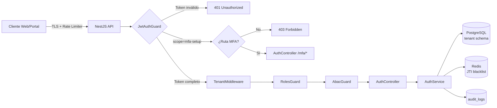
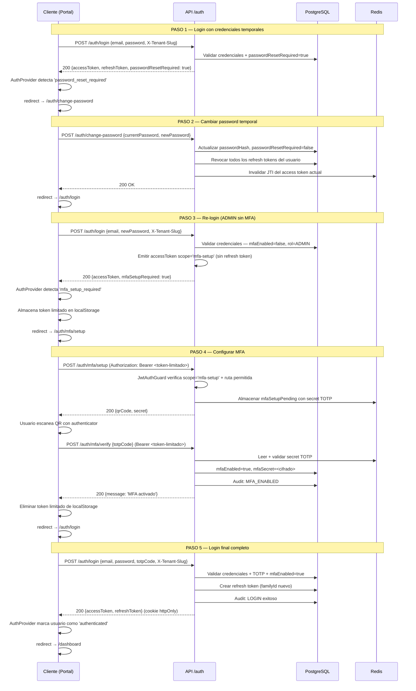
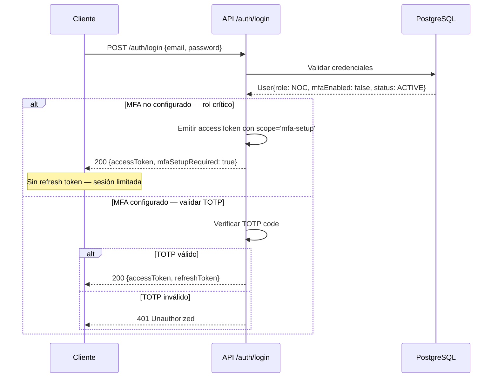
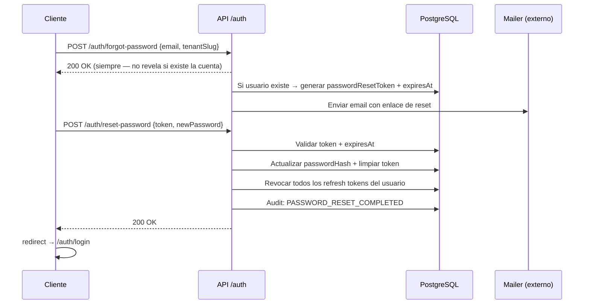

# HLD — Módulo 2: Auth Empresarial de Tenant Activo

## Arquitectura de Alto Nivel — iWana neXt Platform

**Versión:** 1.0
**Fecha:** 2026-03-16
**Estado:** APROBADO
**Autor:** AI-ARCH (Architect Software)
**Orquestado por:** AI-EM (Engineering Manager)
**PRD de referencia:** docs/prds/PRD-MOD02-DEFINICION-v1.0.md (v1.1)
**HLD heredado:** docs/hlds/HLD-MOD01-ARQUITECTURA-v1.0.md
**Stack tecnológico:** docs/prds/Stack_Tecnologico.md
**Política de ejecución:** docs/adrs/ADR-022-Politica-Ejecucion-Modular-Por-Fases.md

---

## 1. Visión General del Módulo

### Naturaleza del módulo

MOD02 es una **separación documental**, no de código. Los mismos módulos NestJS de MOD01 (`AuthModule`, `AuditModule`, `TenantModule`) forman la base técnica. MOD02 completa el conjunto de capacidades operativas para empresas ya creadas, hardening puntual de brechas funcionales y el flujo completo de primer acceso del ADMIN.

### Boundary explícito: MOD01 vs MOD02

| Capacidad | MOD01 (fundacional) | MOD02 (operativo) |
|---|---|---|
| Infraestructura JWT RS256 + refresh rotation | ✅ Implementado | Heredado |
| MFA TOTP setup/verify/disable | ✅ Implementado | Heredado |
| TenantMiddleware + AsyncLocalStorage | ✅ Implementado | Heredado |
| Guards (JwtAuthGuard, RolesGuard, AbacGuard) | ✅ Implementados | JwtAuthGuard extendido |
| Entidades TypeORM (User, RefreshToken, AuditLog) | ✅ Implementadas | Heredadas |
| AuditInterceptor global (CUD) | ✅ Implementado | Heredado |
| Token scope `mfa-setup` para roles críticos sin MFA | ❌ Brecha | **Nuevo MOD02** |
| Audit events: REFRESH, EMAIL_VERIFIED, PASSWORD_RESET_COMPLETED, ACCOUNT_LOCKED | ❌ Incompleto | **Nuevo MOD02** |
| Página `/auth/mfa/setup` en portal | ❌ No existía | **Nuevo MOD02** |
| Flujo E2E completo primer acceso ADMIN | ❌ No cubierto | **Nuevo MOD02** |

---

## 2. Arquitectura de Auth Empresarial

### 2.1 Pipeline de request autenticado



### 2.2 Nuevo: Scope Check en JwtAuthGuard

El JwtAuthGuard verifica el campo `scope` del payload JWT:

- Si `scope === 'mfa-setup'`: solo permite `POST /auth/mfa/setup` y `POST /auth/mfa/verify`. Cualquier otra ruta → HTTP 403.
- Si `scope` ausente o diferente: flujo normal (TenantMiddleware → RolesGuard → AbacGuard).

---

## 3. Flujos de Secuencia Críticos

### 3.1 Flujo de Primer Acceso ADMIN (nuevo en MOD02)



### 3.2 Flujo MFA Enforcement por Rol Crítico



### 3.3 Flujo de Recuperación de Contraseña



---

## 4. Mapa Completo de Audit Events

### 4.1 Eventos existentes (MOD01)

| AuditAction | Evento | Emitido en |
|---|---|---|
| `LOGIN` | Login exitoso | `login()` |
| `LOGIN_FAILED` | Intento fallido | `registerFailedAttempt()` |
| `LOGOUT` | Cierre de sesión | `logout()` |
| `MFA_ENABLED` | MFA activado | `verifyMfa()` |
| `MFA_DISABLED` | MFA desactivado | `disableMfa()` |
| `PASSWORD_CHANGED` | Cambio de password autenticado | `changePassword()` |
| `MFA_SETUP_INITIATED` | Inicio de setup MFA | `setupMfa()` |

### 4.2 Eventos nuevos en MOD02

| AuditAction | Evento | Emitido en | Brecha resuelta |
|---|---|---|---|
| `REFRESH` | Rotación de sesión exitosa | `refreshTokens()` | RF-AUD-02 |
| `EMAIL_VERIFIED` | Email verificado | `verifyEmail()` (reemplaza UPDATE) | RF-AUD-02 semántica |
| `PASSWORD_RESET_COMPLETED` | Reset de password completado | `resetPassword()` | RF-AUD-02 |
| `ACCOUNT_LOCKED` | Cuenta bloqueada por intentos | `registerFailedAttempt()` en 5to intento | RF-AUD-02 |

---

## 5. Contratos OpenAPI — Refinados

### 5.1 Endpoints core MOD02

| Método | Ruta | Auth | Descripción |
|---|---|---|---|
| `POST` | `/api/v1/auth/login` | Pública (X-Tenant-Slug) | Login. Retorna tokens completos o `mfaSetupRequired: true` |
| `POST` | `/api/v1/auth/refresh` | Cookie httpOnly | Rotación de refresh token |
| `POST` | `/api/v1/auth/logout` | JWT Bearer | Revocación de sesión |
| `GET` | `/api/v1/auth/me` | JWT Bearer | Perfil del usuario autenticado |
| `POST` | `/api/v1/auth/mfa/setup` | JWT Bearer (scope: mfa-setup o completo) | Generar QR + secret TOTP |
| `POST` | `/api/v1/auth/mfa/verify` | JWT Bearer (scope: mfa-setup o completo) | Activar MFA con TOTP |
| `POST` | `/api/v1/auth/mfa/disable` | JWT Bearer (completo) | Desactivar MFA |
| `POST` | `/api/v1/auth/forgot-password` | Pública | Solicitud de reset (siempre 200) |
| `POST` | `/api/v1/auth/reset-password` | Pública (token en body) | Ejecutar reset de password |
| `POST` | `/api/v1/auth/change-password` | JWT Bearer | Cambiar password autenticado |
| `POST` | `/api/v1/auth/email/verify` | Pública (token en body) | Verificar email |
| `POST` | `/api/v1/auth/email/resend-verification` | JWT Bearer | Reenviar verificación |

### 5.2 Respuesta de login extendida (nueva)

```typescript
// Cuando el usuario es ADMIN/NOC/ACCOUNTANT sin MFA configurado:
{
  accessToken: string,       // scope: 'mfa-setup' — limitado a /mfa/setup y /mfa/verify
  mfaSetupRequired: true,
  refreshToken: ''           // vacío — no se emite refresh token
}

// Cuando se requiere TOTP (MFA configurado pero no enviado en este login):
{
  mfaRequired: true          // señal para que el frontend pida el código TOTP
}

// Login exitoso completo:
{
  accessToken: string,       // scope ausente — token completo
  user: { id, email, role, tenantId, mfaEnabled }
  // refreshToken viaja en cookie httpOnly
}
```

---

## 6. Arquitectura Frontend MOD02

### 6.1 Páginas del Portal (apps/portal)

| Ruta | Estado | Cambio MOD02 |
|---|---|---|
| `/auth/login` | ✅ Existe | Extender LoginForm para manejar `mfa_setup_required` |
| `/auth/mfa/verify` | ✅ Existe | Sin cambios |
| `/auth/change-password` | ✅ Existe | Sin cambios |
| `/auth/forgot-password` | ✅ Existe | Sin cambios |
| `/auth/reset-password` | ✅ Existe | Sin cambios |
| `/auth/mfa/setup` | ❌ No existe | **Crear nuevo — flujo primer acceso ADMIN** |

### 6.2 Flujo AuthProvider extendido

```typescript
// Nuevos estados posibles del resultado de login():
type LoginResult =
  | 'authenticated'           // flujo normal completo
  | 'mfa_required'            // tiene MFA, no envió TOTP
  | 'password_reset_required' // primer acceso con password temporal
  | 'mfa_setup_required'      // nuevo MOD02: rol crítico sin MFA configurado
```

### 6.3 Almacenamiento del token limitado

- Clave localStorage: `iwana.portal.mfa-setup-token`
- Solo existe durante el flujo de MFA setup.
- Se elimina inmediatamente después de activar MFA exitosamente.
- El `AuthProvider` NO lo considera como sesión autenticada — `user` permanece `null`.

---

## 7. Decisiones de Arquitectura

### DA-MOD02-01: Token de alcance limitado para MFA setup

**Contexto:** Los endpoints `/auth/mfa/setup` y `/auth/mfa/verify` son protegidos (requieren JWT). Sin token no se puede llamar a estos endpoints. El usuario llega al flujo de MFA setup con credenciales válidas pero sin MFA configurado.

**Decisión:** Emitir un access token RS256 con `scope: 'mfa-setup'` en el payload cuando el rol requiere MFA pero `mfaEnabled === false`. Este token:
- Se firma con la misma clave RS256 (misma infraestructura).
- Incluye `sub`, `tenantId`, `schemaName`, `role`, `jti` y `scope: 'mfa-setup'`.
- Expira en 15 minutos (igual que el access token normal).
- NO incluye refresh token.
- El JwtAuthGuard verifica el scope y restringe las rutas accesibles.

**Alternativas descartadas:**
- Endpoints MFA públicos: aumenta superficie de ataque, permite ataques de setup sin autenticación.
- Flujo sin token (OTP por email): requiere infraestructura de mailer lista en este sprint.

**Consecuencia:** El JwtAuthGuard se extiende con lógica de scope routing. El frontend almacena el token temporalmente con clave diferente (`mfa-setup-token`) para no confundir con el access token de sesión normal.

### DA-MOD02-02: Separación documental sin ruptura de bounded context

**Decisión:** MOD02 no crea nuevos módulos NestJS ni nuevas entidades TypeORM. Opera sobre la misma base de código de MOD01 con extensiones puntuales. Los cambios son: nuevos enum values en `AuditAction`, extensión de `signAccessToken`, extensión de `JwtAuthGuard`, nueva página en portal.

---

## 8. Consideraciones de Seguridad

| Control | Implementación |
|---|---|
| Token scope granular | `scope: 'mfa-setup'` rechazado fuera de rutas MFA |
| Sin refresh token en flujo MFA setup | Previene sesión persistente con token limitado |
| Eliminación del token limitado post-setup | Evita reutilización después de activar MFA |
| Audit trail completo | REFRESH, EMAIL_VERIFIED, PASSWORD_RESET_COMPLETED, ACCOUNT_LOCKED |
| Respuesta genérica en forgot-password | No revela existencia de cuenta (OWASP) |
| Rate limiting en endpoints de auth | Heredado de MOD01 |
| Logs sin PII ni tokens | Política global — no exentos en MOD02 |

---

## 9. Plan de Testing

### 9.1 Cobertura objetivo

- Backend (auth.service.ts): >= 85% lines/functions, >= 80% branches.
- Frontend (portal pages + AuthProvider): compilación exitosa.

### 9.2 Tests nuevos requeridos

**Unitarios (auth.service.spec.ts):**
- `login()` ADMIN sin MFA → retorna `mfaSetupRequired: true` + token con scope
- `login()` SUPPORT sin MFA → login normal (no es rol crítico)
- `refreshTokens()` → emite audit REFRESH
- `resetPassword()` → emite audit PASSWORD_RESET_COMPLETED
- `registerFailedAttempt()` 5to intento → emite audit ACCOUNT_LOCKED
- `verifyEmail()` → emite audit EMAIL_VERIFIED (no UPDATE genérico)

**E2E Playwright (portal):**
- `portal-admin-first-access.spec.ts` — flujo completo 5 pasos
- `portal-password-recovery.spec.ts` — forgot-password → reset → login

---

## 10. Trazabilidad

| Artefacto | Referencia |
|---|---|
| PRD-MOD02 | docs/prds/PRD-MOD02-DEFINICION-v1.0.md (v1.1) |
| HLD-MOD01 | docs/hlds/HLD-MOD01-ARQUITECTURA-v1.0.md |
| ADR-019 | JWT RS256 + refresh rotation |
| ADR-020 | Seed inicial ADMIN por tenant |
| ADR-023 | shadcn/ui + Radix + Tailwind 4 CSS-first (Referencia TailAdmin para shell de dashboard) |
| _sin ADR_ | Auth híbrida frontend (proxy cookie + AuthProvider) — decisión de implementación, no normada. [ADR-019](../adrs/ADR-019-JWT-RS256-Refresh-Rotation.md) cubre JWT/cookie httpOnly, **no** el patrón `AuthProvider` |
| _sin ADR_ | react-hook-form + zod para formularios — decisión de implementación, no normada. Los ADRs que citan Zod lo hacen para validación backend en boundaries HTTP, no como stack de formularios de frontend |
| Informe de sprint | docs/informes/INFORME-MOD02-SPRINT-01-v1.0.md |
