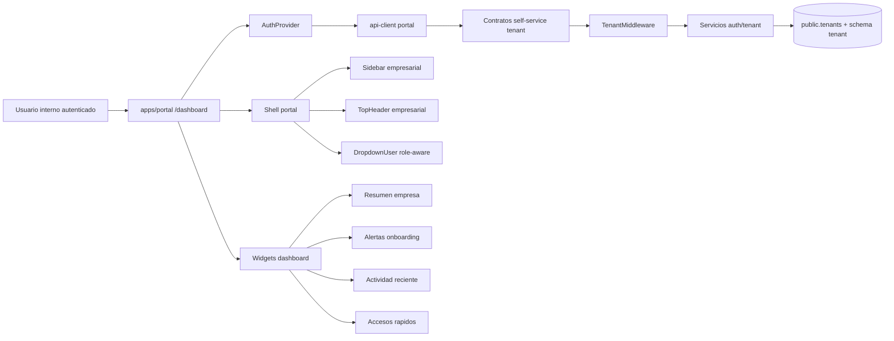

# HLD — MOD02 Dashboard Empresa

## Arquitectura de Alto Nivel — Superficie Empresarial Tenant-Aware

**Versión:** 1.0
**Fecha:** 2026-03-17
**Estado:** Superado — sucedido por [`HLD-MOD02-DASHBOARD-EMPRESA-v2.0.md`](HLD-MOD02-DASHBOARD-EMPRESA-v2.0.md) el 2026-08-04
**Modo activo:** Architect
**Autor:** AI-EM-ARCH

> **Nota de sucesión (2026-08-04).** Este HLD no falló: **caducó**. Describía un portal de dos rutas (§4.1) y diseñó el home como ficha de estado de la cuenta porque en marzo de 2026 no existía otra fuente de datos en el portal. Cinco meses después hay 25 páginas bajo `/dashboard` y seis contratos de resumen publicados. La [auditoría multiagente del 2026-08-04](../informes/INFORME-MOD02-DASHBOARD-PORTAL-AUDITORIA-UIUX-v1.0.md) midió el efecto de esa distancia y el CTO autorizó la reapertura en etapa 1. **Se conserva como referencia histórica; no confiere autoridad normativa.** Su §5.2 sigue siendo lectura útil: ya especificaba «Resumen empresa: Sí» para NOC, ACCOUNTANT y SUPPORT, y la implementación acabó siendo más restrictiva que su propia especificación.
**PRD de referencia:** docs/prds/PRD-MOD02-DASHBOARD-EMPRESA-v1.0.md
**PRD funcional base:** docs/prds/PRD-MOD02-DEFINICION-v1.0.md
**HLDs relacionados:** docs/hlds/HLD-MOD02-ARQUITECTURA-v1.0.md, docs/hlds/HLD-MOD02-FRONTEND-v1.0.md
**Informe relacionado:** docs/informes/INFORME-MOD02-DASHBOARD-EMPRESA-v1.0.md
**ADRs aplicables:** ADR-018, ADR-019, ADR-022, ADR-023

---

## 1. Visión General

### Propósito del HLD

Este HLD aterriza cómo debe implementarse el dashboard empresarial definido en el PRD de MOD02 dentro del stack real del repositorio.

No se está diseñando un portal nuevo desde cero. Se está corrigiendo una superficie ya existente para que el flujo tenant-aware de `apps/portal` desemboque en una consola empresarial consistente con la empresa autenticada y no en un dashboard de suscriptor.

### Estado actual observado

En el estado actual del repo:

- `apps/portal/src/app/dashboard/page.tsx` muestra tarjetas de plan, facturación y soporte con copy de suscriptor.
- `apps/portal/src/components/auth/LoginForm.tsx` y `apps/portal/src/components/auth/AuthProvider.tsx` ya redirigen usuarios internos del tenant hacia `/dashboard`.
- `apps/portal/src/components/layout/Sidebar.tsx` y `DropdownUser.tsx` enlazan rutas como `/settings`, `/profile`, `/support`, `/services` y `/billing`, pero en `apps/portal/src/app` hoy solo existe la ruta protegida `/dashboard` y las rutas de auth.
- `apps/api/src/modules/tenant/tenant.controller.ts` expone endpoints globales de plataforma por `id`, no contratos self-service del tenant autenticado.
- `apps/api/src/modules/audit/audit.controller.ts` ya expone consulta audit del tenant, pero solo para `ADMIN` del tenant y `SYSTEM_ADMIN` de plataforma.

### Decisión arquitectónica

El dashboard empresarial se implementa sobre `apps/portal` como superficie protegida principal del tenant interno.

Decisiones obligatorias:

- `apps/web` permanece como consola de plataforma.
- `apps/portal` pasa a representar la consola empresarial tenant-aware.
- La ruta `/dashboard` se conserva para no romper el flujo de autenticación ya implementado.
- Los datos del dashboard deben resolverse mediante contratos self-service del tenant, no con endpoints globales de administración.

---

## 2. Boundaries y Componentes Principales

### 2.1 Boundaries funcionales

| Superficie | Responsabilidad | Estado actual | Relación con este HLD |
| --- | --- | --- | --- |
| apps/portal | Superficie tenant-aware post-login | Existe, pero con contenido de suscriptor | Superficie principal a corregir |
| apps/web | Consola de plataforma y gestión global de tenants | Existe y funcional | Fuera de alcance operativo |
| apps/api TenantController | Gestión global de tenants por plataforma | Existe | No reutilizable directamente desde portal |
| apps/api AuditController | Consulta del audit log del tenant | Existe | Reutilizable parcialmente para actividad reciente |
| AuthModule / TenantMiddleware | Resolución de sesión y tenant | Existe | Base obligatoria del dashboard |

### 2.2 Componentes principales del dashboard objetivo



### 2.3 Piezas obligatorias

- `DashboardPage` empresarial en `apps/portal/src/app/dashboard/page.tsx`.
- Componente contenedor `DashboardClient` o equivalente para carga de datos y render role-aware.
- Extensión del `api-client` del portal con contratos self-service del tenant.
- Shell ajustado: `Sidebar`, `TopHeader`, `DropdownUser` y acciones rápidas sin rutas rotas.
- Reglas de visibilidad por rol sobre widgets y accesos.

---

## 3. Arquitectura de Datos y Contratos

### 3.1 Principio de consumo

El dashboard empresarial no puede depender de `GET /api/v1/tenants/:id` ni de `GET /api/v1/tenants/:id/settings` porque esos contratos están definidos para administración de plataforma.

La arquitectura correcta es una superficie self-service del tenant autenticado.

### 3.2 Contratos mínimos requeridos

| Contrato | Propósito | Estado actual |
| --- | --- | --- |
| `GET /api/v1/auth/me` | Perfil de sesión autenticada y rol | Existe |
| `GET /api/v1/tenants/me` | Datos base del tenant autenticado | No existe |
| `GET /api/v1/tenants/me/settings` | Configuración operativa del tenant autenticado | No existe |
| `GET /api/v1/dashboard/summary` | Agregados iniciales del dashboard | No existe |
| `GET /api/v1/audit-logs?limit=n` o endpoint equivalente recent | Actividad reciente del tenant | Existe parcialmente |

### 3.3 Diseño recomendado de lectura

Se recomienda una capa de lectura simple para el dashboard con dos alternativas válidas:

1. Extender `TenantModule` con endpoints self-service `me` y `me/settings`.
2. Crear una superficie de consulta liviana para dashboard sin introducir un bounded context nuevo.

Regla:

- Si se crea un endpoint `dashboard/summary`, debe seguir siendo una query facade sobre datos del propio tenant y no un módulo independiente con ownership separado.

### 3.4 Modelo de datos mínimo expuesto al frontend

El frontend necesita un payload equivalente a:

```ts
interface TenantDashboardSummary {
  tenant: {
    id: string;
    name: string;
    slug: string;
    status: 'ACTIVE' | 'SUSPENDED' | 'PROVISIONING' | 'PROVISIONING_FAILED';
    timezone?: string;
    currency?: string;
    language?: string;
    country?: string;
  };
  metrics: {
    configuredUsers?: number | null;
    mfaCoverage?: number | null;
    pendingAlerts: number;
    auditEventsLast7d?: number | null;
  };
  alerts: Array<{
    id: string;
    severity: 'info' | 'warning' | 'error';
    title: string;
    description: string;
    href?: string;
  }>;
}
```

Los campos opcionales pueden devolverse como `null` si el módulo fuente aún no existe. Lo que no se permite es inventar valores en UI.

---

## 4. Estructura de Rutas, Shell y Navegación

### 4.1 Rutas reales del portal

El portal hoy tiene únicamente:

- `/dashboard`
- rutas `/auth/*`

No existen páginas protegidas para:

- `/settings`
- `/profile`
- `/support`
- `/services`
- `/billing`

### 4.2 Decisión de navegación del MVP

Para evitar rutas rotas, el MVP debe tomar una de estas dos estrategias:

1. Reducir el shell a navegación realmente implementada.
2. Crear páginas placeholder empresariales controladas para rutas expuestas por el shell.

Recomendación para este alcance:

- Mantener `/dashboard`.
- Añadir `/settings` como primera ruta protegida complementaria por ser parte explícita del PRD.
- Remover o deshabilitar temporalmente accesos a `billing`, `services` y `support` si no se construirán en esta fase.
- Mantener `/profile` solo si se implementa una vista mínima coherente con el usuario del tenant; de lo contrario, no debe aparecer como destino navegable.

### 4.3 Menú empresarial propuesto

| Ruta | Estado MVP | Observación |
| --- | --- | --- |
| `/dashboard` | Implementar | Home protegida del tenant |
| `/settings` | Implementar o placeholder controlado | Configuración de empresa |
| `/audit` o equivalente | Placeholder opcional | Solo si se decide exponer actividad ampliada |
| `Usuarios` | Próximamente | No navegable si no existe ruta |
| `Seguridad` | Puede entrar dentro de settings | Evitar duplicación prematura |

---

## 5. Composición por Rol y Reglas de Visibilidad

### 5.1 Principio general

Se usa un solo shell con composición condicional por rol. No se crean dashboards separados por archivo o layout salvo que aparezca una necesidad fuerte posterior.

### 5.2 Matriz de visibilidad MVP

| Widget / bloque | ADMIN | NOC | ACCOUNTANT | SUPPORT |
| --- | --- | --- | --- | --- |
| Resumen empresa | Sí | Sí | Sí | Sí |
| Configuración operativa | Sí | Lectura | Lectura | No |
| Alertas onboarding | Sí | Parcial | Parcial | Parcial |
| Actividad reciente audit | Sí | No en MVP | No en MVP | No en MVP |
| Accesos a settings | Sí | Parcial según permisos | Parcial según permisos | No |

### 5.3 Regla para actividad reciente

Dado que `AuditController` hoy restringe la consulta a `ADMIN` del tenant, en el MVP el bloque de actividad reciente debe tratarse así:

- visible para `ADMIN`,
- oculto o reemplazado por un bloque informativo para roles no autorizados,
- no forzar ampliación de permisos en backend sin decisión explícita.

---

## 6. Seguridad, Tenancy y Observabilidad

### 6.1 Controles obligatorios

| Control | Implementación esperada |
| --- | --- |
| Aislamiento por tenant | Toda consulta pasa por JWT + TenantMiddleware |
| No consumo de endpoints globales | `apps/portal` solo consume contratos self-service |
| Zero-trust PII | Sin PII real ni payloads empresariales sensibles en logs o mocks |
| Validación externa | DTOs y validaciones con Zod en boundaries frontend y DTOs backend |
| Manejo de errores | Estados de carga/error sin fuga de detalles internos |

### 6.2 Persistencia local permitida

- `iwana.portal.access-token`
- `iwana.portal.mfa-setup-token`
- `iwana.portal.tenant-slug`

### 6.3 Persistencia prohibida

- datos completos de tenant en localStorage,
- respuestas completas de auditoría persistidas en cliente,
- secretos, tokens temporales adicionales o estados cross-tenant.

### 6.4 Observabilidad mínima

El dashboard debe registrar:

- fallo de carga de summary,
- fallo de carga de actividad,
- fallback de widgets no disponibles,

sin incluir PII ni contenidos completos del tenant.

---

## 7. Estrategia de Implementación y Testing

### 7.1 Secuencia recomendada

1. Corregir el shell y la semántica del portal.
2. Exponer contratos self-service mínimos del tenant.
3. Implementar `DashboardClient` role-aware.
4. Resolver placeholders o páginas mínimas para rutas expuestas.
5. Cubrir pruebas unitarias, integración y E2E.

### 7.2 Testing esperado

| Nivel | Objetivo | Evidencia esperada |
| --- | --- | --- |
| Unit frontend | Gating por rol y mapeo de estados del dashboard | pruebas de widgets y helpers |
| Unit backend | Contratos self-service y query facade | tests de controller/service |
| Integration | Garantizar que el tenant autenticado solo ve sus datos | tests con tenant context |
| E2E portal | login tenant-aware → dashboard empresa → settings | flujo crítico estable |

### 7.3 Riesgos técnicos

| ID | Riesgo | Impacto | Mitigación |
| --- | --- | --- | --- |
| HLD-DE-01 | Reutilizar endpoints de plataforma desde portal rompe boundary | Alto | Crear contratos self-service |
| HLD-DE-02 | Mantener links a rutas inexistentes genera UX rota | Alto | Deshabilitar o crear placeholders controlados |
| HLD-DE-03 | Activity feed para roles no ADMIN fuerza cambio de permisos no planeado | Medio | Limitar actividad reciente a ADMIN en MVP |
| HLD-DE-04 | Querer mostrar KPIs reales sin fuente consolidada produce números ficticios | Crítico | Permitir `null` y estados no disponibles |

### 7.4 Requiere ADR / Requiere CTO

- **Requiere ADR:** No, mientras el dashboard se mantenga como superficie tenant-aware dentro de MOD02 sin crear un módulo independiente ni romper boundaries aprobados.
- **Requiere CTO:** Sí, si se pretende reabrir el alcance hacia un portal de suscriptor separado dentro del mismo sprint o si se quiere ampliar permisos de auditoría a otros roles sin decisión de seguridad.
