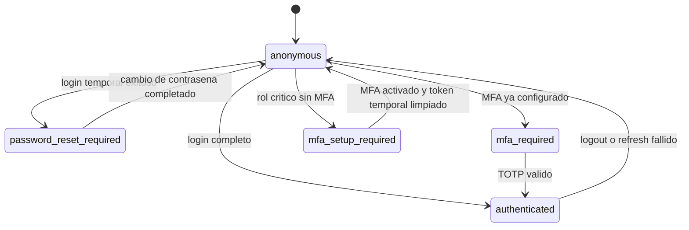
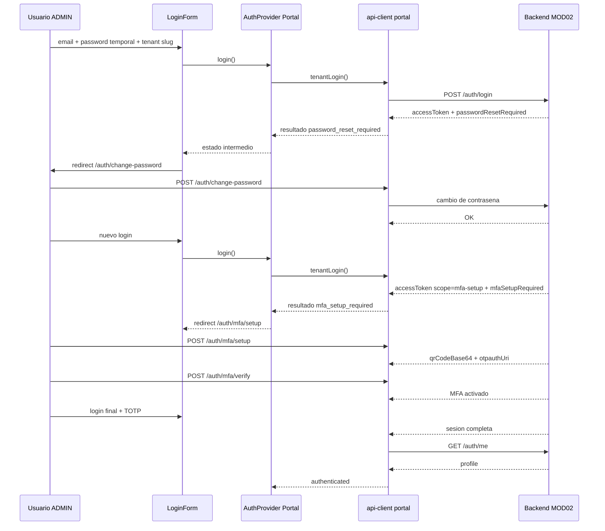

# HLD — Módulo 2 Frontend: Auth Empresarial de Tenant Activo

## Arquitectura de Alto Nivel — Frontend Web de Autenticación

**Versión:** 1.0
**Fecha:** 2026-03-16
**Estado:** En revisión
**Modo activo:** Architect
**Autor:** AI-EM-ARCH (Lead Software Architect Senior)
**PRD de referencia:** docs/prds/PRD-MOD02-FRONTEND-v1.0.md
**PRD funcional base:** docs/prds/PRD-MOD02-DEFINICION-v1.0.md
**HLD backend relacionado:** docs/hlds/HLD-MOD02-ARQUITECTURA-v1.0.md
**Informe relacionado:** docs/informes/INFORME-MOD02-DEFINICION-v1.0.md
**ADRs aplicables:** ADR-019, ADR-022, ADR-023, ADR-025, ADR-026

---

## 1. Visión General

### Propósito del HLD

Este HLD define la arquitectura frontend necesaria para ejecutar MOD02 en el stack real del repositorio, aterrizando rutas, providers, clientes API, flujos de autenticación y restricciones de seguridad para las experiencias web del módulo.

El objetivo no es rediseñar la autenticación del sistema. El objetivo es formalizar cómo se implementa la capa frontend sobre:

- el backend de MOD02 ya endurecido,
- el patrón de AuthProvider aprobado por ADR-023,
- el uso de Next.js App Router,
- los componentes UI disponibles en el monorepo.

### Decisión de superficie frontend

El repositorio muestra hoy dos superficies distintas:

- apps/portal: autenticación tenant-aware, con tenant slug, flujo MFA setup y recuperación de contraseña para usuarios del tenant.
- apps/web: autenticación de plataforma, centrada en /auth/platform/login y usuarios SYSTEM_ADMIN o IWANA_SUPPORT.

**Decisión arquitectónica:** MOD02 frontend se implementa con apps/portal como superficie operativa primaria del auth empresarial tenant-aware. apps/web reutiliza patrones, componentes y contratos donde sea compatible, pero no se considera una superficie tenant-aware equivalente en el estado actual del código.

Esta decisión evita mezclar auth de tenant con auth de plataforma y mantiene consistencia con el boundary ya heredado de MOD01.

---

## 2. Boundaries y Componentes Principales

### 2.1 Boundaries frontend

| Superficie | Responsabilidad | Estado actual | Relación con MOD02 |
| --- | --- | --- | --- |
| apps/portal | Login tenant-aware, MFA verify, MFA setup, change-password, forgot/reset-password | Implementación principal | Core frontend de MOD02 |
| apps/web | Login de plataforma, MFA verify, change-password, forgot-password | Implementación heredada de plataforma | Referencia de patrón, no superficie primaria de tenant |
| packages/ui | Primitivas visuales y formularios reutilizables | Compartido | Soporte visual y accesible |
| packages/shared | Schemas, tipos y contratos compartidos | Compartido | Validación y tipado |

### 2.2 Componentes de arquitectura

```mermaid
flowchart LR
    A[Usuario Portal Tenant] --> B[Route Segment /auth/*]
    B --> C[Page App Router]
    C --> D[Client Form Component]
    D --> E[AuthProvider]
    E --> F[api-client tenant-aware]
    F --> G[/api/v1/auth/*]
    G --> H[Backend MOD02]

    I[Usuario Plataforma] --> J[apps/web /auth/*]
    J --> K[AuthProvider plataforma]
    K --> L[api-client platform-login]
    L --> G
```

### 2.3 Piezas frontend obligatorias

- AuthProvider por app.
- api-client por app, con separación entre sesión completa y estado temporal MFA.
- Formularios client-side con Zod + react-hook-form.
- Route handlers o pages App Router para cada paso del flujo.
- Layouts de auth desacoplados del dashboard protegido.

---

## 3. Arquitectura de Flujos y Estado

### 3.1 Modelo de estados de login

En apps/portal, el frontend debe modelar el login como una máquina de estados explícita:



### 3.2 Reglas de estado

- `authenticated` solo existe después de poblar `user` con `/auth/me`.
- `mfa_required` conserva únicamente el contexto mínimo necesario para completar TOTP.
- `mfa_setup_required` usa token limitado separado y no construye sesión autenticada.
- `password_reset_required` fuerza navegación a la pantalla de cambio antes de acceder a cualquier ruta protegida.

### 3.3 Flujo crítico de primer acceso ADMIN



---

## 4. Estructura de Rutas y Componentes

### 4.1 apps/portal

| Ruta | Componente principal | Tipo | Propósito |
| --- | --- | --- | --- |
| /auth/login | LoginForm | Client | Resolver login tenant-aware |
| /auth/change-password | ChangePasswordPage | Client | Completar cambio obligatorio |
| /auth/forgot-password | ForgotPassword page/form | Client | Solicitar recuperación |
| /auth/reset-password | ResetPassword page/form | Client | Definir nueva contraseña |
| /auth/mfa/verify | MfaVerifyForm | Client | Completar login con TOTP |
| /auth/mfa/setup | MfaSetupForm | Client | Activar MFA con token limitado |

### 4.2 apps/web

| Ruta | Estado | Observación arquitectónica |
| --- | --- | --- |
| /auth/login | Existe | Flujo de plataforma, no tenant-aware |
| /auth/change-password | Existe | Reutilizable como patrón visual y funcional |
| /auth/forgot-password | Existe | Requiere validar si aplica al dominio de plataforma o tenant |
| /auth/mfa/verify | Existe | Orientado a MFA de plataforma |
| /auth/mfa/setup | No existe | Gap actual; no se asume en el scope ejecutable de MOD02 sin decisión adicional |

### 4.3 Decisión de composición

- Las páginas de auth pueden ser minimalistas y server-light, pero los formularios deben ser Client Components.
- El provider de autenticación vive en el layout raíz de cada app.
- La lógica de routing posterior al login se concentra en el formulario + AuthProvider y no en middleware cliente ad hoc.

---

## 5. Seguridad, Tenancy y Persistencia Local

### 5.1 Controles obligatorios

| Control | Implementación |
| --- | --- |
| Separación tenant/plataforma | api-client distinto por app y endpoint de login distinto |
| Token temporal mfa-setup | localStorage separado y limpieza inmediata tras éxito o expiración |
| No autenticación implícita | AuthProvider no debe poblar `user` con token limitado |
| Tenant slug controlado | input explícito o variable permitida, nunca deducción opaca en cliente |
| Manejo de expiración | 401 o 403 relevantes limpian estado local y redirigen a login |

### 5.2 Persistencia permitida

- `iwana.portal.access-token`
- `iwana.portal.mfa-setup-token`
- `iwana.portal.tenant-slug`
- estado temporal en memoria para MFA login pendiente

### 5.3 Persistencia prohibida

- refresh tokens accesibles desde JS
- secretos TOTP persistidos del lado cliente
- objetos user completos fuera del provider sin necesidad operativa
- logs de consola con tokens, correos reales o datos de recuperación

---

## 6. Testing, Riesgos y Plan de Ejecución

### 6.1 Estrategia de testing

| Nivel | Objetivo | Evidencia esperada |
| --- | --- | --- |
| Unit | Validar transición de estados en AuthProvider y formularios críticos | pruebas de login result, MFA y errores |
| E2E | Validar primer acceso ADMIN y recuperación de contraseña | suites Playwright del portal |
| Smoke UI | Confirmar rutas auth visibles y navegación base | ejecución rápida por app |

### 6.2 Riesgos técnicos

| ID | Riesgo | Impacto | Mitigación |
| --- | --- | --- | --- |
| HLD-FE-01 | Sobreextender apps/web para tenant auth rompe el boundary de plataforma | Alto | Mantener surface split explícito |
| HLD-FE-02 | Redirecciones distribuidas entre componentes generan loops | Alto | Centralizar reglas de transición por estado |
| HLD-FE-03 | Reintento de refresh deja UI en estado ambiguo | Medio | Limpiar sesión local cuando refresh falle |
| HLD-FE-04 | MFA setup deja token temporal vivo tras completar flujo | Crítico | Limpieza obligatoria en success, logout y expiración |

### 6.3 Recomendación de ejecución

1. Cerrar apps/portal como implementación canónica de MOD02 frontend.
2. Extraer patrones compartibles a nivel de UI o contratos, no a costa de mezclar dominios de login.
3. Tratar apps/web como superficie aparte salvo decisión formal de ampliar alcance.

### 6.4 Requiere ADR / Requiere CTO

- **Requiere ADR:** No, mientras se mantenga la separación actual entre auth de tenant y auth de plataforma.
- **Requiere CTO:** Sí, si se pretende exigir paridad tenant-aware completa en apps/web dentro de la misma fase.
