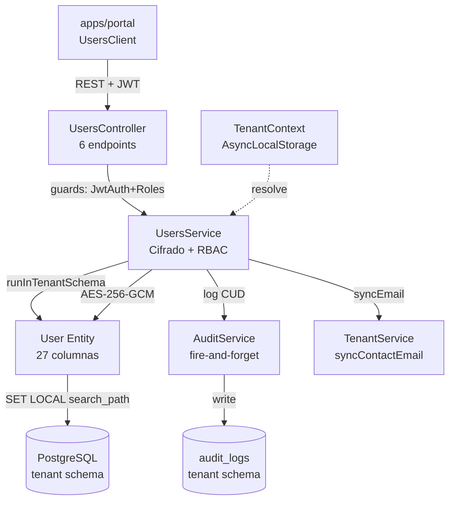
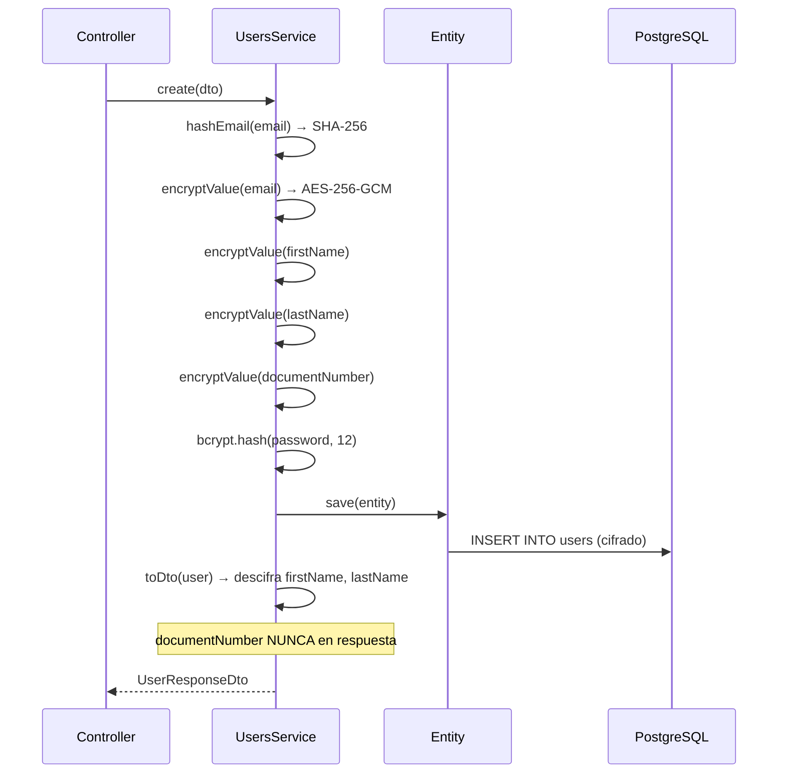

# HLD - MOD04 Usuarios Internos

**Version:** 1.0  
**Estado:** Aprobado  
**Fecha:** 2026-03-23  
**Modo activo:** Architect  
**Autor:** AI-EM-ARCH  
**PRD de referencia:** docs/prds/PRD-MOD04-USUARIOS-INTERNOS-v1.0.md  
**Artefactos relacionados:** docs/prds/PRD-MOD03-CONFIGURACION-EMPRESA-v1.0.md, docs/hlds/HLD-MOD03-CONFIGURACION-EMPRESA-v1.0.md  
**Informe relacionado:** docs/informes/INFORME-MOD04-DEFINICION-v1.0.md  
**ADRs aplicables:** ADR-016, ADR-018, ADR-019, ADR-020, ADR-022

---

## 1. Contexto de negocio

MOD04 formaliza la gestion completa de usuarios internos del tenant. La empresa ya aprovisionada necesita escalar su equipo operativo con roles diferenciados (NOC, soporte, ventas, contabilidad, tecnicos, RRHH), datos personales protegidos bajo Ley 1581 y trazabilidad de cada operacion.

El resultado es un CRUD seguro con cifrado de PII at-rest, RBAC explicito, paginacion por cursor, soft delete, idempotencia y auditoria integrada, consumible desde apps/portal.

---

## 2. Bounded contexts afectados

| Bounded context | Impacto | Regla |
| --- | --- | --- |
| UsersModule | Principal | Ownership del CRUD. Expone endpoints, cifra PII, aplica RBAC |
| AuthModule | Upstream | Provee JWT, guards (JwtAuthGuard, RolesGuard), autenticacion |
| TenantModule | Upstream | Provee TenantContext via AsyncLocalStorage; sincroniza contactEmail |
| AuditModule | Downstream | Registra operaciones CUD fire-and-forget con oldValue/newValue |
| apps/portal | Consumer | Interfaz de gestion de usuarios con tabla, filtros, modales |

### Boundary explicito

- UsersModule es el unico modulo autorizado para CRUD sobre la entidad User.
- AuthModule consume UsersModule para validacion de credenciales pero no expone gestion.
- TenantModule sincroniza contactEmail cuando el admin principal cambia su email de acceso.
- AuditModule registra operaciones de forma fire-and-forget (no bloquea el flujo principal).

---

## 3. Componentes principales

### 3.1 Backend — UsersModule

```
apps/api/src/modules/users/
├── users.module.ts          # Module: imports ConfigModule, TypeORM(User), AuditModule, TenantModule
├── users.controller.ts      # 6 endpoints REST con guards y Swagger
├── users.service.ts         # Logica de negocio, cifrado, auditoria
├── dto/
│   └── user.dto.ts          # CreateUserDto, UpdateUserDto, ChangeUserLoginEmailDto, UserResponseDto
└── users.service.spec.ts    # 28+ test cases
```

### 3.2 Entidad — User

```
packages/database/src/entities/user.entity.ts
```

Tabla `users` en schema del tenant (resuelto via `SET LOCAL search_path`).
27 columnas incluyendo 5 campos cifrados AES-256-GCM, soft delete y 3 indices compuestos.

### 3.3 Frontend — Portal empresarial

```
apps/portal/src/
├── app/dashboard/users/page.tsx           # RSC con metadata
├── components/users/
│   ├── UsersClient.tsx                    # Orquestador estado + CRUD + modales
│   ├── UsersTable.tsx                     # Tabla con filtros, paginacion cursor, badges
│   ├── CreateUserModal.tsx                # Formulario Zod + password temporal copiable
│   ├── EditUserModal.tsx                  # Edicion perfil + cambio email + reset password
│   └── DeleteUserDialog.tsx               # Confirmacion con escritura de email obligatoria
└── lib/api-client.ts                      # usersApi: list, getById, create, update, remove, etc.
```

---

## 4. Diagrama de arquitectura



---

## 5. Flujo de cifrado PII



---

## 6. Matriz de ownership y seguridad

| Operacion | Roles autorizados | Restriccion adicional |
| --- | --- | --- |
| Listar usuarios | ADMIN, SYSTEM_ADMIN | Solo su tenant |
| Crear usuario | ADMIN, SYSTEM_ADMIN | Idempotency-Key obligatorio |
| Ver perfil propio | Cualquier autenticado | sub === id |
| Ver perfil otro | ADMIN, SYSTEM_ADMIN | Solo su tenant |
| Editar perfil propio | Cualquier autenticado | Solo campos de perfil |
| Editar otro | ADMIN, SYSTEM_ADMIN | Puede cambiar status/role |
| Cambiar email acceso | Solo el propio usuario | Requiere password actual |
| Eliminar | ADMIN, SYSTEM_ADMIN | ADMIN no puede eliminar ADMIN (RF-RBAC-04) |
| Auto-eliminacion | — | Siempre prohibida |

---

## 7. Paginacion cursor-based

Implementacion eficiente sin OFFSET:

1. Query: `WHERE id > :cursor ORDER BY id ASC LIMIT :limit+1`
2. Si se obtienen `limit+1` resultados → hay pagina siguiente
3. `nextCursor` = ultimo id retornado (se recorta el extra)
4. `total` = COUNT(*) con mismos filtros
5. Limite maximo: 100, default: 50

---

## 8. Soft delete y restauracion

- TypeORM `@DeleteDateColumn` en columna `deleted_at`.
- DELETE → soft delete (`deletedAt = now()`).
- En CREATE: si existe registro con mismo emailHash y `deletedAt IS NOT NULL`:
  - Restaura el registro (`deletedAt = null`).
  - Reinicializa todos los campos con datos del DTO.
  - Genera nuevo password hash.
  - Retorna el usuario restaurado.

---

## 9. Migraciones de tenant

| Migracion | Descripcion | Idempotente |
| --- | --- | --- |
| 003_add_user_profile_fields | Agrega 7 columnas de perfil a users | Si (IF NOT EXISTS) |
| 004_add_mfa_required_to_users | Agrega mfa_required boolean | Si (IF NOT EXISTS) |

Ambas iteran sobre todos los schemas de tenant activos.

---

## 10. Cobertura de tests

28+ test cases en `users.service.spec.ts` cubriendo:

| Area | Tests | Detalle |
| --- | --- | --- |
| findAll | 3 | Paginacion, cursor, filtros |
| findOne | 2 | Exito, NotFoundException |
| create | 8 | Con/sin password, duplicado, soft-deleted restore, cifrado, mfaRequired |
| update | 5 | Status/rol, ForbiddenException, NotFoundException, cifrado |
| changeLoginEmail | 3 | Sync contactEmail, no sync, password incorrecta |
| remove | 5 | Exito, NotFoundException, auto-eliminacion, RF-RBAC-04, SYSTEM_ADMIN |
| toDto | 5 | Descifrado, omision documentNumber, null, legacy, cifrado invalido |
| decryptValue | 1 | Formato invalido |

Patrones: mocks para runInTenantSchema, TenantContext, AuditService, ConfigService, bcrypt. Sin PII real.

---

## 11. Frontend — Funcionalidades

| Componente | Funcionalidades |
| --- | --- |
| UsersTable | Filtros por status/role, labels localizados es-CO, paginacion cursor ("Cargar mas"), badges de estado, indicador MFA, acciones condicionadas |
| CreateUserModal | Formulario Zod + react-hook-form, roles de tenant (excluye plataforma), password temporal copiable post-creacion, Idempotency-Key auto |
| EditUserModal | Edicion perfil, cambio email (llama changeEmail), reset password, cambio status/role |
| DeleteUserDialog | Confirmacion escribiendo email, proteccion auto-eliminacion, proteccion ADMIN→ADMIN, tooltips explicativos |

Dark mode completo. Formato fecha con `Intl.DateTimeFormat('es-CO')`.

---

## 12. Desalineaciones conocidas

| Issue | Detalle | Impacto |
| --- | --- | --- |
| api-client /users/:id/email vs controller /users/:id/login-email | Frontend envia solo `{ email }`, backend requiere `{ email, currentPassword }` | Error en runtime si se usa sin password |
| api-client /users/:id/password | Endpoint no implementado en controller | 404 en runtime |
| Wrapper doble en findAll | service retorna `{ data, meta }`, controller envuelve en `{ data: ... }` | Frontend recibe `data.data.data` |

Estas desalineaciones estan documentadas para correccion en siguiente iteracion.

---

## 13. Decision de salida

**GO** — UsersModule implementado, testeado (28+ cases), cifrado Ley 1581 aplicado, RBAC funcional, auditoria integrada, portal operativo. Desalineaciones frontend menores documentadas.

---

*Documento reconstruido por AI-EM-ARCH a partir del codigo fuente implementado, como parte de la restauracion de gobernanza documental MOD04.*
