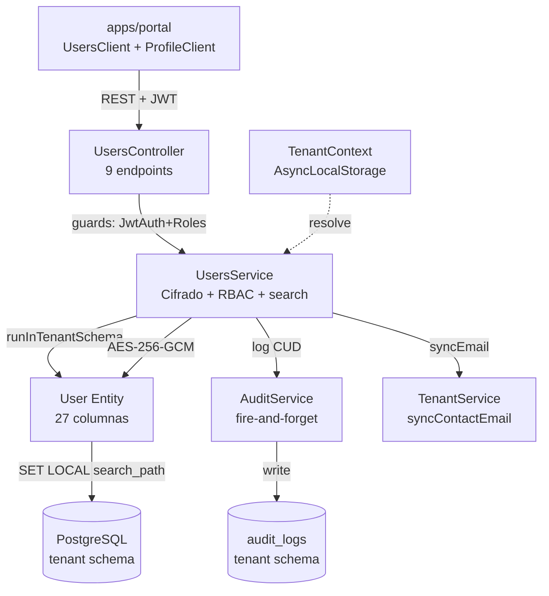
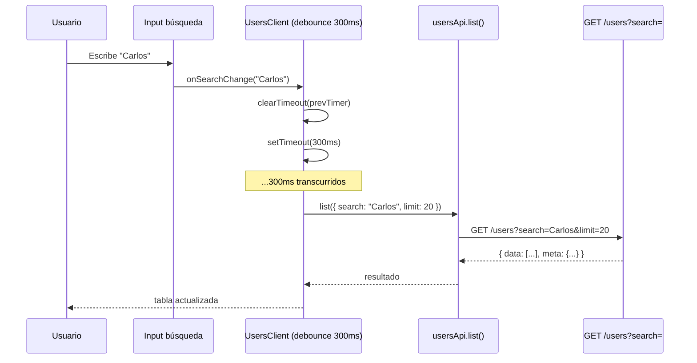
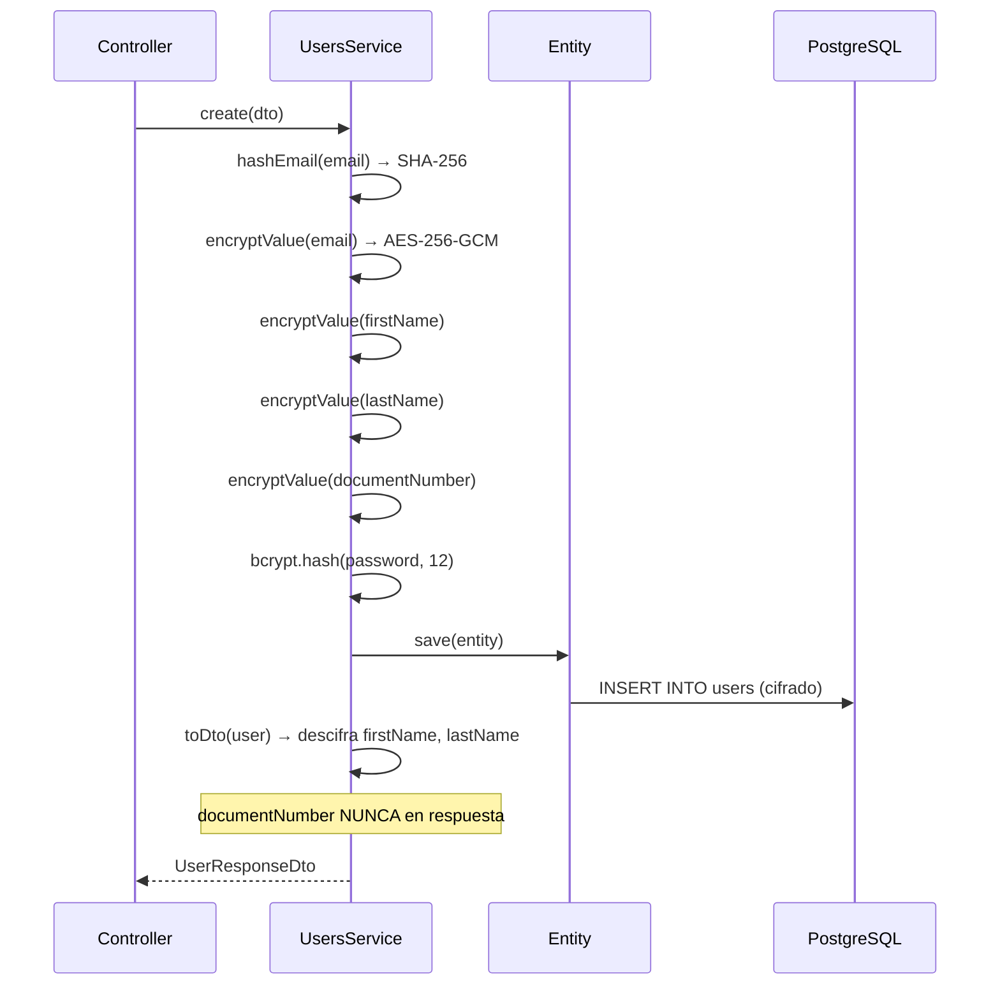

# HLD - MOD04 Usuarios Internos

**Version:** 1.1  
**Estado:** Aprobado — Fase 3 Frontend completada  
**Fecha:** 2026-03-26  
**Modo activo:** Architect  
**Autor:** AI-EM-ARCH  
**PRD de referencia:** docs/prds/PRD-MOD04-USUARIOS-INTERNOS-v1.1.md  
**HLD previo:** docs/hlds/HLD-MOD04-USUARIOS-INTERNOS-v1.0.md  
**Informe relacionado:** docs/informes/INFORME-MOD04-REFACTOR-v1.0.md  
**ADRs aplicables:** ADR-016, ADR-018, ADR-019, ADR-020, ADR-022

---

## Changelog respecto a v1.0

| Sección             | Cambio                                                                                         |
| ------------------- | ---------------------------------------------------------------------------------------------- |
| §3.3 Frontend       | Nuevos componentes y funcionalidades: búsqueda, reset desde tabla, perfil, ResetPasswordDialog |
| §6 Seguridad        | Corregida entrada de tabla: reset password tiene restricción ADMIN→SYSTEM_ADMIN                |
| §10 Tests           | Actualizado con cobertura Fase 2 (96 tests, ~89%) y nuevos E2E Fase 3 (8 casos)                |
| §11 Frontend        | Actualizado con búsqueda debounce, reset password fila, sidebar habilitado                     |
| §12 Desalineaciones | Cerradas las 3 desalineaciones documentadas en v1.0                                            |

---

## 1. Contexto de negocio

MOD04 formaliza la gestión completa de usuarios internos del tenant. La empresa aprovisionada escala su equipo operativo con roles diferenciados (NOC, soporte, ventas, contabilidad, técnicos, RRHH), datos personales protegidos bajo Ley 1581 y trazabilidad de cada operación.

La Fase 3 alinea el portal empresarial con el backend refactorizado en Fases 1 y 2: corrige contratos de API, agrega búsqueda de usuarios en tiempo real con debounce, habilita reinicio de contraseña directamente desde la fila de la tabla, y completa la página de perfil del usuario autenticado.

---

## 2. Bounded contexts afectados

| Bounded context | Impacto    | Regla                                                               |
| --------------- | ---------- | ------------------------------------------------------------------- |
| UsersModule     | Principal  | Ownership del CRUD. Expone endpoints, cifra PII, aplica RBAC        |
| AuthModule      | Upstream   | Provee JWT, guards (JwtAuthGuard, RolesGuard), autenticación        |
| TenantModule    | Upstream   | Provee TenantContext via AsyncLocalStorage; sincroniza contactEmail |
| AuditModule     | Downstream | Registra operaciones CUD fire-and-forget con oldValue/newValue      |
| apps/portal     | Consumer   | Interfaz de gestión con búsqueda, filtros, reset password, perfil   |

### Boundary explícito

- UsersModule es el único módulo autorizado para CRUD sobre la entidad User.
- AuthModule consume UsersModule para validación de credenciales pero no expone gestión.
- TenantModule sincroniza contactEmail cuando el admin principal cambia su email de acceso.
- AuditModule registra operaciones de forma fire-and-forget (no bloquea el flujo principal).

---

## 3. Componentes principales

### 3.1 Backend — UsersModule

```
apps/api/src/modules/users/
├── users.module.ts          # Module: imports ConfigModule, TypeORM(User), AuditModule, TenantModule
├── users.controller.ts      # 7 endpoints REST con guards y Swagger
├── users.service.ts         # Lógica de negocio, cifrado, auditoría
├── dto/
│   └── user.dto.ts          # CreateUserDto, UpdateUserDto, ChangeUserLoginEmailDto, UserResponseDto
└── users.service.spec.ts    # 96 test cases (Fases 1 + 2)
```

**Endpoints REST (Fase 1 — texto plano, sin wrapper doble):**

| Método | Ruta                   | Rol requerido                          |
| ------ | ---------------------- | -------------------------------------- |
| GET    | /users                 | ADMIN, SYSTEM_ADMIN                    |
| POST   | /users                 | ADMIN, SYSTEM_ADMIN                    |
| GET    | /users/me              | Cualquier autenticado                  |
| PATCH  | /users/me              | Cualquier autenticado                  |
| GET    | /users/:id             | ADMIN, SYSTEM_ADMIN                    |
| PATCH  | /users/:id             | ADMIN, SYSTEM_ADMIN                    |
| DELETE | /users/:id             | ADMIN, SYSTEM_ADMIN                    |
| PATCH  | /users/:id/password    | ADMIN, SYSTEM_ADMIN                    |
| PATCH  | /users/:id/login-email | Cualquier autenticado (propio) o ADMIN |

### 3.2 Entidad — User

```
packages/database/src/entities/user.entity.ts
```

Tabla `users` en schema del tenant (resuelto via `SET LOCAL search_path`).  
27 columnas incluyendo 5 campos cifrados AES-256-GCM, soft delete y 3 índices compuestos.

### 3.3 Frontend — Portal empresarial

```
apps/portal/src/
├── app/
│   ├── dashboard/users/page.tsx           # RSC con metadata
│   └── dashboard/profile/page.tsx         # RSC — perfil del usuario autenticado
├── components/
│   ├── users/
│   │   ├── UsersClient.tsx                # Orquestador estado + CRUD + búsqueda debounce + reset password
│   │   ├── UsersTable.tsx                 # Tabla con búsqueda, filtros, paginación cursor, botón reset por fila
│   │   ├── CreateUserModal.tsx            # Formulario Zod + password temporal copiable
│   │   ├── EditUserModal.tsx              # Edición perfil + cambio email + reset password inline
│   │   ├── DeleteUserDialog.tsx           # Confirmación con escritura de email
│   │   └── ResetPasswordDialog.tsx        # Confirmación antes de resetear contraseña desde tabla
│   ├── profile/
│   │   ├── ProfileClient.tsx              # Orquestador de secciones del perfil
│   │   ├── ProfileHeader.tsx              # Avatar, nombre y badge de rol
│   │   ├── PersonalInfoForm.tsx           # Datos personales (react-hook-form + Zod)
│   │   ├── ChangePasswordForm.tsx         # Cambio de contraseña (react-hook-form + Zod)
│   │   └── MfaRequiredToggle.tsx          # Toggle de MFA obligatorio para el tenant
│   └── layout/
│       ├── Sidebar.tsx                    # Ítem "Usuarios" habilitado → /dashboard/users
│       └── DropdownUser.tsx               # Enlace "Mi perfil" → /dashboard/profile
└── lib/api-client.ts                      # usersApi + userApi: contratos corregidos y search
```

**Cambios en `api-client.ts` (Fase 3):**

| Función                | Cambio                                                                                                                                     |
| ---------------------- | ------------------------------------------------------------------------------------------------------------------------------------------ |
| `usersApi.changeEmail` | Path corregido `/users/:id/email` → `/users/:id/login-email`; payload ahora acepta `{ email, currentPassword?, syncCompanyContactEmail? }` |
| `ListUsersParams`      | Nuevo campo `search?: string`                                                                                                              |
| `usersApi.list()`      | Propaga `search` a `?search=` en query string                                                                                              |

---

## 4. Diagrama de arquitectura



---

## 5. Flujo de búsqueda con debounce



---

## 6. Flujo de cifrado PII



---

## 7. Matriz de ownership y seguridad

| Operación                    | Roles autorizados      | Restricción adicional                                       |
| ---------------------------- | ---------------------- | ----------------------------------------------------------- |
| Listar usuarios (con search) | ADMIN, SYSTEM_ADMIN    | Solo su tenant                                              |
| Crear usuario                | ADMIN, SYSTEM_ADMIN    | Idempotency-Key obligatorio                                 |
| Ver perfil propio            | Cualquier autenticado  | sub === id                                                  |
| Ver perfil otro              | ADMIN, SYSTEM_ADMIN    | Solo su tenant                                              |
| Editar perfil propio         | Cualquier autenticado  | Solo campos de perfil                                       |
| Editar otro                  | ADMIN, SYSTEM_ADMIN    | Puede cambiar status/role                                   |
| Cambiar email de acceso      | Propio usuario o ADMIN | Self-service requiere currentPassword; admin puede sin ella |
| Reiniciar contraseña         | ADMIN, SYSTEM_ADMIN    | No puede resetear SYSTEM_ADMIN si el actor es ADMIN         |
| Eliminar                     | ADMIN, SYSTEM_ADMIN    | ADMIN no puede eliminar ADMIN (RF-RBAC-04)                  |
| Auto-eliminación             | —                      | Siempre prohibida                                           |

---

## 8. Paginación cursor-based

Implementación eficiente sin OFFSET:

1. Query: `WHERE id > :cursor ORDER BY id ASC LIMIT :limit+1`
2. Si se obtienen `limit+1` resultados → hay página siguiente
3. `nextCursor` = último id retornado (se recorta el extra)
4. `total` = COUNT(\*) con mismos filtros
5. Límite máximo: 100, default: 50
6. El parámetro `search` se combina con `status` y `role` en los filtros del query

---

## 9. Soft delete y restauración

- TypeORM `@DeleteDateColumn` en columna `deleted_at`.
- DELETE → soft delete (`deletedAt = now()`).
- En CREATE: si existe registro con mismo emailHash y `deletedAt IS NOT NULL`:
  - Restaura el registro (`deletedAt = null`).
  - Reinicializa todos los campos con datos del DTO.
  - Genera nuevo password hash.
  - Retorna el usuario restaurado.

---

## 10. Migraciones de tenant

| Migración                       | Descripción                                                         | Idempotente        |
| ------------------------------- | ------------------------------------------------------------------- | ------------------ |
| 003_add_user_profile_fields     | Agrega 7 columnas de perfil a users                                 | Sí (IF NOT EXISTS) |
| 004_add_mfa_required_to_users   | Agrega mfa_required boolean                                         | Sí (IF NOT EXISTS) |
| 005_convert_user_fields_to_text | Convierte columnas varchar(255) a text; elimina columnas deprecadas | Sí                 |

Las migraciones iteran sobre todos los schemas de tenant activos.

---

## 11. Cobertura de tests

### Backend (Fase 1 + Fase 2)

96 test cases en `users.service.spec.ts` con cobertura ~89%:

| Área             | Tests | Detalle                                                                     |
| ---------------- | ----- | --------------------------------------------------------------------------- |
| findAll          | 7     | Paginación, cursor, filtros, search, sin resultados                         |
| findOne          | 2     | Éxito, NotFoundException                                                    |
| findMe           | 2     | Propio autenticado, no encontrado                                           |
| updateMe         | 4     | Campos de perfil, idempotencia, cifrado                                     |
| create           | 8     | Con/sin password, duplicado, soft-deleted restore, cifrado, mfaRequired     |
| update           | 5     | Status/rol, ForbiddenException, NotFoundException, cifrado                  |
| changeLoginEmail | 4     | Sync contactEmail, no sync, password incorrecta, admin sin password         |
| resetPassword    | 4     | Generación aleatoria, admin-provided, SYSTEM_ADMIN protection, idempotencia |
| remove           | 5     | Éxito, NotFoundException, auto-eliminación, RF-RBAC-04, SYSTEM_ADMIN        |
| toDto            | 5     | Descifrado, omisión documentNumber, null, legacy, cifrado inválido          |
| decryptValue     | 1     | Formato inválido                                                            |

3 corridas consecutivas estables. Sin PII real.

### E2E Playwright (Fase 3) — `e2e/tests/portal-users.spec.ts`

8 casos cubriendo:

| Caso | Descripción                                          |
| ---- | ---------------------------------------------------- |
| 1    | Redirige a login sin sesión activa                   |
| 2    | ADMIN autenticado ve tabla de usuarios               |
| 3    | Input de búsqueda envía ?search= con debounce        |
| 4    | Selector de estado envía ?status=                    |
| 5    | Botón "Nuevo usuario" abre modal de creación         |
| 6    | Botón KeyRound abre diálogo de confirmación de reset |
| 7    | Confirmar reset muestra contraseña temporal          |
| 8    | /dashboard/profile muestra formulario de perfil      |

Todos mockeados con `page.route()`, sin backend levantado, sin PII real.

---

## 12. Frontend — Funcionalidades (estado final Fase 3)

| Componente          | Funcionalidades                                                                                                                                                        |
| ------------------- | ---------------------------------------------------------------------------------------------------------------------------------------------------------------------- |
| UsersTable          | Búsqueda con debounce 300ms, filtros por status/role, labels es-CO, paginación cursor, badges de estado, indicador MFA, botón reset password por fila, limpiar filtros |
| CreateUserModal     | Formulario Zod + react-hook-form, roles tenant (excluye plataforma), password temporal copiable, Idempotency-Key auto                                                  |
| EditUserModal       | Edición perfil, cambio email (ruta /login-email corregida), reset password inline, cambio status/role                                                                  |
| DeleteUserDialog    | Confirmación escribiendo email, protección auto-eliminación, protección ADMIN→ADMIN                                                                                    |
| ResetPasswordDialog | Confirmación antes de resetear desde tabla, información del usuario afectado                                                                                           |
| ProfileClient       | Secciones: datos personales, cambio de contraseña, toggle MFA requerido                                                                                                |
| Sidebar             | Ítem "Usuarios" habilitado con href correcto `/dashboard/users`                                                                                                        |

Dark mode completo. Formato fecha con `Intl.DateTimeFormat('es-CO')`. WCAG 2.2 AA.

---

## 13. Desalineaciones — Estado final

| Issue original (v1.0)                                                     | Estado                                                                    |
| ------------------------------------------------------------------------- | ------------------------------------------------------------------------- |
| api-client `/users/:id/email` vs controller `/users/:id/login-email`      | **Cerrado** — path y payload corregidos en `usersApi.changeEmail`         |
| api-client `/users/:id/password` — endpoint no implementado en controller | **Cerrado** — endpoint `PATCH /users/:id/password` implementado en Fase 1 |
| Wrapper doble en findAll                                                  | **Cerrado** — eliminado en Fase 1 (respuesta plana sin `data.data.data`)  |

Sin desalineaciones conocidas al cierre de Fase 3.

---

## 14. Decisión de salida

**GO** — MOD04 completado en las 3 fases:

- **Fase 1**: refactor backend texto plano, migración 005, nuevos endpoints (resetPassword, getMe, updateMe).
- **Fase 2**: 96 tests verdes, cobertura ~89%, 3 corridas estables.
- **Fase 3**: portal alineado 1:1 con backend — búsqueda, reset desde tabla, perfil, contratos corregidos, sidebar habilitado, 8 casos E2E.

Build `pnpm --filter @iwana/portal build` pasa exit 0. Lint y typecheck limpios.

---

_Documento generado por AI-EM-ARCH como cierre de Fase 3 — MOD04 Usuarios Internos._
