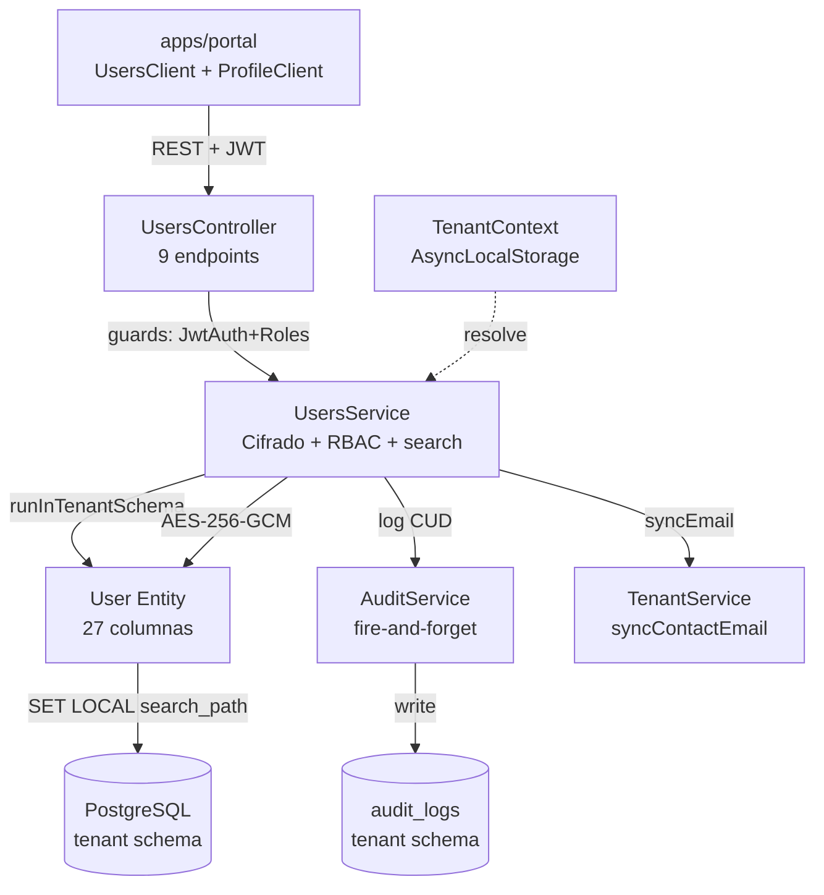
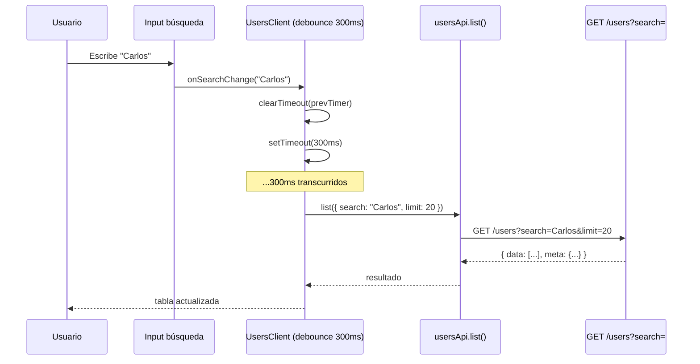
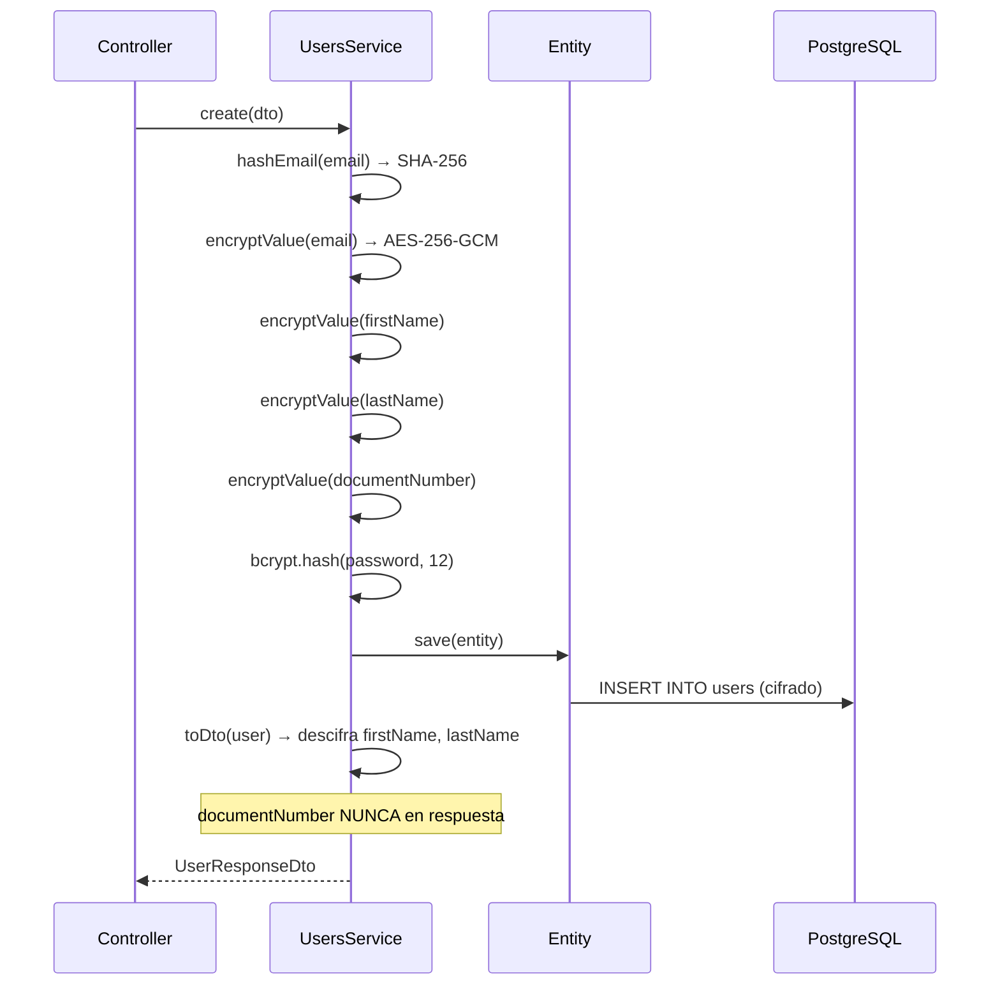

# HLD - MOD04 Usuarios Internos

**Version:** 1.2  
**Estado:** Vigente — Fase 3 completada; **turno de auditoría frontend abierto con deuda registrada**  
**Fecha:** 2026-09-03  
**Modo activo:** Architect  
**Autor:** AI-EM-ARCH  
**PRD de referencia:** docs/prds/PRD-MOD04-USUARIOS-INTERNOS-v1.1.md  
**HLD previo:** docs/hlds/HLD-MOD04-USUARIOS-INTERNOS-v1.1.md  
**Informe relacionado:** docs/informes/INFORME-MOD04-PERFIL-PORTAL-AUDITORIA-v1.0.md  
**ADRs aplicables:** ADR-018, ADR-019, ADR-020, ADR-022, ADR-045

---

## Changelog respecto a v1.1

Origen: [INFORME-MOD04-PERFIL-PORTAL-AUDITORIA-v1.0](../informes/INFORME-MOD04-PERFIL-PORTAL-AUDITORIA-v1.0.md), hallazgo P-16. Este documento describía un componente que ya no existe y declaraba cerrado un estado que no lo estaba.

| Sección | Cambio |
| --- | --- |
| §3.3 Frontend | Retirado `MfaRequiredToggle.tsx` del árbol de componentes: fue eliminado por [ADR-045](../adrs/ADR-045-Consolidacion-Politica-MFA-Global-en-Access.md) (Aprobado, 2026-05-27) y un test de regresión vigente afirma **activamente su ausencia** (`e2e/tests/portal-users.spec.ts:505`) |
| §11 E2E | La nota "todos mockeados con `page.route()`" se completa con la condición que faltaba: un mock que no afirma contrato no es evidencia |
| §12 Funcionalidades | `ProfileClient` deja de listar el "toggle MFA requerido" |
| §13 Desalineaciones | Reabierta: la declaración "sin desalineaciones conocidas" no resistió el turno de auditoría frontend |
| §14 Decisión de salida | Acotada a lo que realmente cubría (las 3 fases de construcción), y separada del cierre del módulo, que sigue **NO-GO** |
| §15 (nueva) | Criterios de aceptación del perfil, que el documento nunca declaró formalmente pese a exigirlos en §7 |
| Cabecera | `ADR-016` retirado de "ADRs aplicables": es el cierre de MOD01 y la regla de completitud vive en ADR-022. Añadido ADR-045, que sí gobierna este módulo |

---

## Changelog respecto a v1.0

| Sección             | Cambio                                                                                         |
| ------------------- | ---------------------------------------------------------------------------------------------- |
| §3.3 Frontend       | Nuevos componentes y funcionalidades: búsqueda, reset desde tabla, perfil, ResetPasswordDialog |
| §6 Seguridad        | Corregida entrada de tabla: reset password tiene restricción ADMIN→SYSTEM_ADMIN                |
| §10 Tests           | Actualizado con cobertura Fase 2 (96 tests, ~89%) y nuevos E2E Fase 3 (8 casos)                |
| §11 Frontend        | Actualizado con búsqueda debounce, reset password fila, sidebar habilitado                     |
| §12 Desalineaciones | Cerradas las 3 desalineaciones documentadas en v1.0                                            |

---

## 1. Contexto de negocio

MOD04 formaliza la gestión completa de usuarios internos del tenant. La empresa aprovisionada escala su equipo operativo con roles diferenciados (NOC, soporte, ventas, contabilidad, técnicos, RRHH), datos personales protegidos bajo Ley 1581 y trazabilidad de cada operación.

La Fase 3 alinea el portal empresarial con el backend refactorizado en Fases 1 y 2: corrige contratos de API, agrega búsqueda de usuarios en tiempo real con debounce, habilita reinicio de contraseña directamente desde la fila de la tabla, y completa la página de perfil del usuario autenticado.

---

## 2. Bounded contexts afectados

| Bounded context | Impacto    | Regla                                                               |
| --------------- | ---------- | ------------------------------------------------------------------- |
| UsersModule     | Principal  | Ownership del CRUD. Expone endpoints, cifra PII, aplica RBAC        |
| AuthModule      | Upstream   | Provee JWT, guards (JwtAuthGuard, RolesGuard), autenticación        |
| TenantModule    | Upstream   | Provee TenantContext via AsyncLocalStorage; sincroniza contactEmail |
| AuditModule     | Downstream | Registra operaciones CUD fire-and-forget con oldValue/newValue      |
| apps/portal     | Consumer   | Interfaz de gestión con búsqueda, filtros, reset password, perfil   |

### Boundary explícito

- UsersModule es el único módulo autorizado para CRUD sobre la entidad User.
- AuthModule consume UsersModule para validación de credenciales pero no expone gestión.
- TenantModule sincroniza contactEmail cuando el admin principal cambia su email de acceso.
- AuditModule registra operaciones de forma fire-and-forget (no bloquea el flujo principal).

---

## 3. Componentes principales

### 3.1 Backend — UsersModule

```
apps/api/src/modules/users/
├── users.module.ts          # Module: imports ConfigModule, TypeORM(User), AuditModule, TenantModule
├── users.controller.ts      # 7 endpoints REST con guards y Swagger
├── users.service.ts         # Lógica de negocio, cifrado, auditoría
├── dto/
│   └── user.dto.ts          # CreateUserDto, UpdateUserDto, ChangeUserLoginEmailDto, UserResponseDto
└── users.service.spec.ts    # 96 test cases (Fases 1 + 2)
```

**Endpoints REST (Fase 1 — texto plano, sin wrapper doble):**

| Método | Ruta                   | Rol requerido                          |
| ------ | ---------------------- | -------------------------------------- |
| GET    | /users                 | ADMIN, SYSTEM_ADMIN                    |
| POST   | /users                 | ADMIN, SYSTEM_ADMIN                    |
| GET    | /users/me              | Cualquier autenticado                  |
| PATCH  | /users/me              | Cualquier autenticado                  |
| GET    | /users/:id             | ADMIN, SYSTEM_ADMIN                    |
| PATCH  | /users/:id             | ADMIN, SYSTEM_ADMIN                    |
| DELETE | /users/:id             | ADMIN, SYSTEM_ADMIN                    |
| PATCH  | /users/:id/password    | ADMIN, SYSTEM_ADMIN                    |
| PATCH  | /users/:id/login-email | Cualquier autenticado (propio) o ADMIN |

### 3.2 Entidad — User

```
packages/database/src/entities/user.entity.ts
```

Tabla `users` en schema del tenant (resuelto via `SET LOCAL search_path`).  
27 columnas incluyendo 5 campos cifrados AES-256-GCM, soft delete y 3 índices compuestos.

### 3.3 Frontend — Portal empresarial

```
apps/portal/src/
├── app/
│   ├── dashboard/users/page.tsx           # RSC con metadata
│   └── dashboard/profile/page.tsx         # RSC — perfil del usuario autenticado
├── components/
│   ├── users/
│   │   ├── UsersClient.tsx                # Orquestador estado + CRUD + búsqueda debounce + reset password
│   │   ├── UsersTable.tsx                 # Tabla con búsqueda, filtros, paginación cursor, botón reset por fila
│   │   ├── CreateUserModal.tsx            # Formulario Zod + password temporal copiable
│   │   ├── EditUserModal.tsx              # Edición perfil + cambio email + reset password inline
│   │   ├── DeleteUserDialog.tsx           # Confirmación con escritura de email
│   │   └── ResetPasswordDialog.tsx        # Confirmación antes de resetear contraseña desde tabla
│   ├── profile/
│   │   ├── ProfileClient.tsx              # Orquestador de secciones del perfil
│   │   ├── ProfileHeader.tsx              # Avatar, nombre y badge de rol
│   │   ├── PersonalInfoForm.tsx           # Datos personales (react-hook-form + Zod)
│   │   └── ChangePasswordForm.tsx         # Cambio de contraseña (react-hook-form + Zod)
│   │                                      # (MfaRequiredToggle.tsx eliminado por ADR-045:
│   │                                      #  la política MFA global vive en Access Control)
│   └── layout/
│       ├── Sidebar.tsx                    # Ítem "Usuarios" habilitado → /dashboard/users
│       └── DropdownUser.tsx               # Enlace "Mi perfil" → /dashboard/profile
└── lib/api-client.ts                      # usersApi + userApi: contratos corregidos y search
```

**Cambios en `api-client.ts` (Fase 3):**

| Función                | Cambio                                                                                                                                     |
| ---------------------- | ------------------------------------------------------------------------------------------------------------------------------------------ |
| `usersApi.changeEmail` | Path corregido `/users/:id/email` → `/users/:id/login-email`; payload ahora acepta `{ email, currentPassword?, syncCompanyContactEmail? }` |
| `ListUsersParams`      | Nuevo campo `search?: string`                                                                                                              |
| `usersApi.list()`      | Propaga `search` a `?search=` en query string                                                                                              |

---

## 4. Diagrama de arquitectura



---

## 5. Flujo de búsqueda con debounce



---

## 6. Flujo de cifrado PII



---

## 7. Matriz de ownership y seguridad

| Operación                    | Roles autorizados      | Restricción adicional                                       |
| ---------------------------- | ---------------------- | ----------------------------------------------------------- |
| Listar usuarios (con search) | ADMIN, SYSTEM_ADMIN    | Solo su tenant                                              |
| Crear usuario                | ADMIN, SYSTEM_ADMIN    | Idempotency-Key obligatorio                                 |
| Ver perfil propio            | Cualquier autenticado  | sub === id                                                  |
| Ver perfil otro              | ADMIN, SYSTEM_ADMIN    | Solo su tenant                                              |
| Editar perfil propio         | Cualquier autenticado  | Solo campos de perfil                                       |
| Editar otro                  | ADMIN, SYSTEM_ADMIN    | Puede cambiar status/role                                   |
| Cambiar email de acceso      | Propio usuario o ADMIN | Self-service requiere currentPassword; admin puede sin ella |
| Reiniciar contraseña         | ADMIN, SYSTEM_ADMIN    | No puede resetear SYSTEM_ADMIN si el actor es ADMIN         |
| Eliminar                     | ADMIN, SYSTEM_ADMIN    | ADMIN no puede eliminar ADMIN (RF-RBAC-04)                  |
| Auto-eliminación             | —                      | Siempre prohibida                                           |

---

## 8. Paginación cursor-based

Implementación eficiente sin OFFSET:

1. Query: `WHERE id > :cursor ORDER BY id ASC LIMIT :limit+1`
2. Si se obtienen `limit+1` resultados → hay página siguiente
3. `nextCursor` = último id retornado (se recorta el extra)
4. `total` = COUNT(\*) con mismos filtros
5. Límite máximo: 100, default: 50
6. El parámetro `search` se combina con `status` y `role` en los filtros del query

---

## 9. Soft delete y restauración

- TypeORM `@DeleteDateColumn` en columna `deleted_at`.
- DELETE → soft delete (`deletedAt = now()`).
- En CREATE: si existe registro con mismo emailHash y `deletedAt IS NOT NULL`:
  - Restaura el registro (`deletedAt = null`).
  - Reinicializa todos los campos con datos del DTO.
  - Genera nuevo password hash.
  - Retorna el usuario restaurado.

---

## 10. Migraciones de tenant

| Migración                       | Descripción                                                         | Idempotente        |
| ------------------------------- | ------------------------------------------------------------------- | ------------------ |
| 003_add_user_profile_fields     | Agrega 7 columnas de perfil a users                                 | Sí (IF NOT EXISTS) |
| 004_add_mfa_required_to_users   | Agrega mfa_required boolean                                         | Sí (IF NOT EXISTS) |
| 005_convert_user_fields_to_text | Convierte columnas varchar(255) a text; elimina columnas deprecadas | Sí                 |

Las migraciones iteran sobre todos los schemas de tenant activos.

---

## 11. Cobertura de tests

### Backend (Fase 1 + Fase 2)

96 test cases en `users.service.spec.ts` con cobertura ~89%:

| Área             | Tests | Detalle                                                                     |
| ---------------- | ----- | --------------------------------------------------------------------------- |
| findAll          | 7     | Paginación, cursor, filtros, search, sin resultados                         |
| findOne          | 2     | Éxito, NotFoundException                                                    |
| findMe           | 2     | Propio autenticado, no encontrado                                           |
| updateMe         | 4     | Campos de perfil, idempotencia, cifrado                                     |
| create           | 8     | Con/sin password, duplicado, soft-deleted restore, cifrado, mfaRequired     |
| update           | 5     | Status/rol, ForbiddenException, NotFoundException, cifrado                  |
| changeLoginEmail | 4     | Sync contactEmail, no sync, password incorrecta, admin sin password         |
| resetPassword    | 4     | Generación aleatoria, admin-provided, SYSTEM_ADMIN protection, idempotencia |
| remove           | 5     | Éxito, NotFoundException, auto-eliminación, RF-RBAC-04, SYSTEM_ADMIN        |
| toDto            | 5     | Descifrado, omisión documentNumber, null, legacy, cifrado inválido          |
| decryptValue     | 1     | Formato inválido                                                            |

3 corridas consecutivas estables. Sin PII real.

### E2E Playwright (Fase 3) — `e2e/tests/portal-users.spec.ts`

8 casos cubriendo:

| Caso | Descripción                                          |
| ---- | ---------------------------------------------------- |
| 1    | Redirige a login sin sesión activa                   |
| 2    | ADMIN autenticado ve tabla de usuarios               |
| 3    | Input de búsqueda envía ?search= con debounce        |
| 4    | Selector de estado envía ?status=                    |
| 5    | Botón "Nuevo usuario" abre modal de creación         |
| 6    | Botón KeyRound abre diálogo de confirmación de reset |
| 7    | Confirmar reset muestra contraseña temporal          |
| 8    | /dashboard/profile muestra formulario de perfil      |

Todos mockeados con `page.route()`, sin backend levantado, sin PII real.

> **Corrección v1.2.** Esta nota, tal como estaba redactada, prescribía media práctica. Un `page.route()` que decide **solo por forma de URL** y responde `fulfill` incondicional no es una prueba: es un decorado. El mock de `portal-users.spec.ts:334-341` casa `/\/users\/[^/]+$/` sin tocar `route.request()`, de modo que no distingue `/users/me` de `/users/<uuid>` y **es ciego a la cabecera** — por eso no detectó el defecto P-01, en el que el cliente enviaba el id de usuario como `X-Tenant-Slug`. Un mock de E2E **es el contrato**: afirma cabecera y payload, o rechaza. El idioma correcto ya existe en el repo (`portal-settings-federated-shell.spec.ts:105-114`).

---

## 12. Frontend — Funcionalidades (estado final Fase 3)

| Componente          | Funcionalidades                                                                                                                                                        |
| ------------------- | ---------------------------------------------------------------------------------------------------------------------------------------------------------------------- |
| UsersTable          | Búsqueda con debounce 300ms, filtros por status/role, labels es-CO, paginación cursor, badges de estado, indicador MFA, botón reset password por fila, limpiar filtros |
| CreateUserModal     | Formulario Zod + react-hook-form, roles tenant (excluye plataforma), password temporal copiable, Idempotency-Key auto                                                  |
| EditUserModal       | Edición perfil, cambio email (ruta /login-email corregida), reset password inline, cambio status/role                                                                  |
| DeleteUserDialog    | Confirmación escribiendo email, protección auto-eliminación, protección ADMIN→ADMIN                                                                                    |
| ResetPasswordDialog | Confirmación antes de resetear desde tabla, información del usuario afectado                                                                                           |
| ProfileClient       | Secciones: encabezado de identidad, datos personales, email de acceso y cambio de contraseña. **No** expone política MFA del tenant (ADR-045)                          |
| Sidebar             | Ítem "Usuarios" habilitado con href correcto `/dashboard/users`                                                                                                        |

Dark mode completo. Formato fecha con `Intl.DateTimeFormat('es-CO')`. WCAG 2.2 AA.

---

## 13. Desalineaciones — Estado final

| Issue original (v1.0)                                                     | Estado                                                                    |
| ------------------------------------------------------------------------- | ------------------------------------------------------------------------- |
| api-client `/users/:id/email` vs controller `/users/:id/login-email`      | **Cerrado** — path y payload corregidos en `usersApi.changeEmail`         |
| api-client `/users/:id/password` — endpoint no implementado en controller | **Cerrado** — endpoint `PATCH /users/:id/password` implementado en Fase 1 |
| Wrapper doble en findAll                                                  | **Cerrado** — eliminado en Fase 1 (respuesta plana sin `data.data.data`)  |

~~Sin desalineaciones conocidas al cierre de Fase 3.~~ **Superado en v1.2.** La afirmación descansaba en build, lint y typecheck en verde — ninguno de los cuales puede detectar un argumento mal colocado entre dos parámetros `string`, que es exactamente la forma del defecto P-01.

### 13.1 Desalineaciones abiertas (turno de auditoría frontend, 2026-09-03)

Detalle, evidencia y disposición en el [informe](../informes/INFORME-MOD04-PERFIL-PORTAL-AUDITORIA-v1.0.md) §2.

| ID | Sev. | Desalineación |
| --- | --- | --- |
| P-01 | Alto | `userApi.getMe(user.id)` pasa un UUID donde la firma espera `tenantSlug`; llega como `X-Tenant-Slug`. Dos call sites (`ProfileClient.tsx:39`, `AuthProvider.tsx:90`) |
| P-02 | Alto | El cambio de email de acceso no notifica a la dirección anterior ni re-verifica la nueva |
| P-03 | Alto | El prefijo telefónico por defecto (`'+57'`) incumple el regex E.164 del backend y rompe el guardado del perfil |
| P-04 | Medio | `"test": "jest --passWithNoTests"` convierte los comandos de gate del módulo en compuertas que no pueden fallar |
| P-05 a P-17 | Medio/Bajo | Invalidación de sesión, borrado de campos, auditoría sin valores, live regions, cuota por tenant, duplicación contra el design system, código muerto y política de contraseñas divergente |

---

## 14. Decisión de salida

**GO de construcción (2026-03-26)** — MOD04 completado en sus 3 fases:

- **Fase 1**: refactor backend texto plano, migración 005, nuevos endpoints (resetPassword, getMe, updateMe).
- **Fase 2**: 96 tests verdes, cobertura ~89%, 3 corridas estables.
- **Fase 3**: portal alineado 1:1 con backend — búsqueda, reset desde tabla, perfil, contratos corregidos, sidebar habilitado, 8 casos E2E.

Build `pnpm --filter @iwana/portal build` pasa exit 0. Lint y typecheck limpios.

**Cierre del módulo: REABIERTO — NO-GO (2026-09-03).**

El módulo se declaró cerrado el 2026-07-23 (commit `6895d9b4`), pero ese cierre **no cubrió `components/profile/`** — la segunda de las dos superficies frontend que este mismo HLD declara en §3.3. Verificado: el commit de cierre no toca ni un archivo de esa carpeta.

| Turno | Fecha | Alcance real | Estado |
| --- | --- | --- | --- |
| Backend / datos / migraciones | 2026-07-23 | `apps/api/src/modules/users` | **GO** — vigente |
| UI/UX | 2026-07-23 | `components/users/` únicamente | **GO** — vigente sobre ese alcance |
| Cierre de módulo | 2026-07-23 | commit `6895d9b4` | **Superado** — emitido sobre alcance incompleto |
| Perfil propio (`components/profile/`) | 2026-09-03 | esta auditoría | **NO-GO** — 3 Altos y 7 Medios; cobertura no verificable |

**Lección de alcance, para que no se repita:** "users" y "profile" nombran superficies distintas del mismo módulo. Un turno titulado "frontend/UX de Usuarios" cubrió una y no la otra, y nadie lo notó porque el título parecía exhaustivo. **Todo turno de auditoría debe declarar su alcance por rutas concretas**, no por nombre de módulo, y el informe de cierre debe enumerar las superficies del HLD y marcar cuáles cubrió cada turno.

Condiciones para reemitir el cierre y prompts de remediación: informe §5 y §6.

---

## 15. Criterios de aceptación del perfil propio

El documento exigía estos invariantes en §7 pero nunca los declaró como criterios verificables, así que **7 de los 8 llegaron a producción sin un test que los respalde**. Se formalizan aquí para que la fase de pruebas los trace uno a uno. (Corrección 2026-09-04: el texto decía "6 de los 7" pero la tabla lista 8 criterios — CA-P08 se añadió en v1.2 con la ola de política única de contraseñas.)

| ID | Criterio | Verificación |
| --- | --- | --- |
| CA-P01 | El perfil propio se resuelve por el `sub` del JWT; el cliente **no** transporta identidad de usuario ni de tenant en la llamada | Unit: `getMe` invocado sin argumentos |
| CA-P02 | Un usuario sin teléfono registrado puede guardar cambios en cualquier otro campo | Unit: el DTO no incluye `phone` cuando el campo quedó vacío |
| CA-P03 | El teléfono se valida en cliente con el mismo patrón E.164 que aplica el servidor | Unit: tabla de vectores válidos e inválidos |
| CA-P04 | Un campo opcional con valor previo se puede vaciar: `undefined` = no tocar, `null` = borrar, `''` no se envía | Unit + integración |
| CA-P05 | Tras guardar, el formulario re-basa sus valores y el botón vuelve a estado no sucio | Unit |
| CA-P06 | El resultado de guardar se anuncia a tecnología asistiva (SC 4.1.3), con la región viva montada desde el primer render | Unit con `jest-axe` + inspección de `aria-live` |
| CA-P07 | El cambio de email de acceso exige contraseña actual y notifica a la dirección anterior | Integración backend |
| CA-P08 | Las dos entradas del portal al cambio de contraseña aplican **la misma** política | Unit: tabla de vectores compartida entre ambos formularios |

---

_v1.0–v1.1 generado por AI-EM-ARCH como cierre de Fase 3. v1.2 emitida por AI-EM-ARCH el 2026-09-03 tras el turno de auditoría frontend, para que el documento deje de describir un componente eliminado y de declarar cerrado lo que no lo está._
