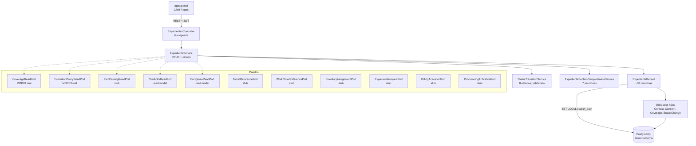
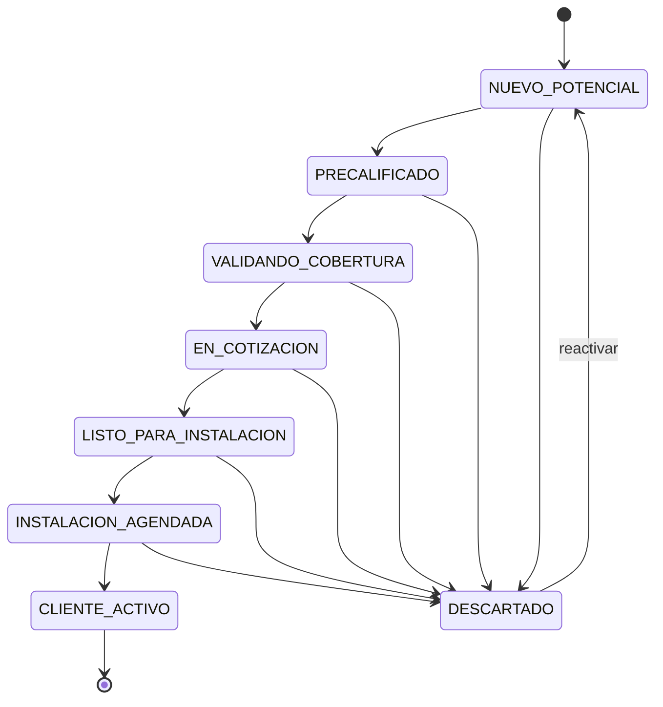

# HLD - MOD05 CRM Arquitectura

**Version:** 2.2  
**Estado:** Aprobado  
**Fecha:** 2026-09-04  
**Historial:** v2.2 (2026-09-04) corrige el ciclo de vida del subscriber contra ADR-027 y promueve los puertos de inventario y ticketing de stub a lectura real, conforme a PRD Fase 04 §9.5 y §7.3.  
**Modo activo:** Architect  
**Autor:** AI-EM-ARCH  
**PRD de referencia:** docs/prds/PRD-MOD05-CRM-DEFINICION-v2.0.md  
**PRD complementario:** docs/prds/PRD-MOD05-CRM-GESTION-COMERCIAL-OPERATIVA-v1.0.md  
**ADR relacionado:** docs/adrs/ADR-024-Migracion-CRM-Expediente-Unico.md  
**Informe relacionado:** docs/informes/INFORME-MOD05-DEFINICION-v1.0.md  
**ADRs aplicables:** ADR-016, ADR-018, ADR-019, ADR-022, ADR-024, ADR-026

---

## 1. Contexto de negocio

MOD05 implementa el CRM del ISP como bounded context propio (`CrmModule`). La arquitectura vigente usa el modelo Expediente Unico Progresivo: un registro maestro (`ExpedienteRecord`) con 8 secciones de captura progresiva, 8 estados de pipeline, completitud general por 7 secciones oficiales y consentimiento triple Ley 1581.

> **Nota correctiva 2026-05-05:** este HLD se alinea con `docs/adrs/ADR-026-Pipeline-CRM-8-Estados.md` y `docs/specs/2026-05-05-crm-pipeline-completeness-read-model-design.md`. El calculo de completitud por 4 dimensiones queda deprecado como fuente primaria de negocio y se reemplaza por una fuente de verdad basada en 7 secciones oficiales y readiness de instalacion.

El diseño reemplaza el modelo dual PotentialLead/ProspectCase de Sprint 01 (ver ADR-024) con una migracion aditiva que preserva datos existentes.

---

## 2. Bounded contexts afectados

| Bounded context | Impacto    | Regla                                                                     |
| --------------- | ---------- | ------------------------------------------------------------------------- |
| CrmModule       | Principal  | Ownership del expediente unico, pipeline y entidades hijas                |
| TenantModule    | Upstream   | Provee TenantContext, schema resolution, cobertura y catalogo via puertos |
| AuthModule      | Upstream   | JWT, guards (JwtAuthGuard, RolesGuard)                                    |
| AuditModule     | Referencia | StatusChange entity registra transiciones directamente                    |
| apps/portal     | Consumer   | Interfaz de gestion de expedientes, pipeline, timeline                    |

### Boundary explicito

- CrmModule no accede a tablas de otros modulos directamente.
- Consume cobertura y catalogo de MOD03 via puertos tipados (ICoverageReadPort, IPlanCatalogReadPort).
- Resuelve actores y lecturas de cotizacion via `CrmActorReadPort` y `CrmQuoteReadPort`, sin consultas directas cross-module desde los servicios del expediente.
- Facturacion y provisioning → puertos con stubs hasta implementacion real.
- Inventario (MOD12) y ticketing (MOD10) → **puertos de lectura reales** desde PRD Fase 04 §7.3: el CRM consulta comodatos y tickets del suscriptor por interfaz tipada, sin leer sus tablas (ADR-048, ADR-038).
- Subscriber se crea al alcanzar `LISTO_PARA_INSTALACION` (estado `PROSPECT`) y se activa al alcanzar `CLIENTE_ACTIVO` (estado `ACTIVE`); no comparte ciclo de vida con expediente. Conversion two-stage idempotente segun ADR-027 (Aprobado).
  > **Correccion 2026-09-04 (PRD Fase 04 §9.5).** Este punto afirmaba que el subscriber se creaba *solo* al alcanzar `CLIENTE_ACTIVO`, contradiciendo a ADR-027 (Aprobado) y a la implementacion real desde la Fase 03. El HLD era entregable obligatorio de aquella fase y no se actualizo.

---

## 3. Estructura del modulo

```
apps/api/src/modules/crm/
├── crm.module.ts                        # Module: imports + providers puertos + exports
├── enums/                               # QuoteStatus, ContractStatus, OpportunityStage, etc.
├── pipes/
│   └── zod-body-validation.pipe.ts      # ZodBodyValidationPipe generico
├── ports/
│   ├── coverage-read.port.ts            # ICoverageReadPort
│   ├── execution-policy-read.port.ts    # IExecutionPolicyReadPort
│   ├── plan-catalog-read.port.ts        # IPlanCatalogReadPort
│   ├── ticket-reference.port.ts         # ITicketReferencePort
│   ├── work-order-reference.port.ts     # IWorkOrderReferencePort
│   ├── inventory-assignment.port.ts     # IInventoryAssignmentPort
│   ├── expansion-request.port.ts        # IExpansionRequestPort
│   ├── billing-activation.port.ts       # IBillingActivationPort
│   └── provisioning-activation.port.ts  # IProvisioningActivationPort
├── adapters/
│   └── stub-*.adapter.ts               # Stubs para puertos sin implementacion real
├── schemas/                             # Zod schemas legacy (Sprint 01)
├── expedientes/                         # FLUJO ACTIVO v2.0
│   ├── expedientes.module.ts
│   ├── expedientes.controller.ts        # 8 endpoints REST
│   ├── expedientes.service.ts           # Logica CRUD, cifrado, completitud
│   ├── status-transition.service.ts     # Reglas de transicion, campos minimos
│   ├── completeness-calculator.service.ts  # compatibilidad de calculo persistido
│   ├── expediente-section-completeness.service.ts  # 7 secciones + readiness instalacion
│   ├── dto/
│   │   ├── create-expediente.dto.ts     # CreateExpedienteSchema (Zod)
│   │   ├── update-section.dto.ts        # UpdateSectionBodySchema (Zod)
│   │   └── transition-status.dto.ts     # TransitionStatusSchema (Zod)
│   └── expedientes.controller.spec.ts   # Tests del controller
├── potentials/                          # DEPRECADO (Sprint 01)
├── prospects/                           # DEPRECADO (Sprint 01)
├── reviews/                             # DEPRECADO (Sprint 01)
├── contacts/                            # Subscriber contacts
├── habeas-data/                         # Habeas Data + ARCO
├── opportunities/                       # Opportunities v1 (legacy)
├── quotes/                              # Quotes (dual FK)
└── contracts/                           # Contracts
```

---

## 4. Diagrama de arquitectura



---

## 5. Modelo de datos

### Nota de evolucion v2.1

Sin romper el modelo Expediente Unico Progresivo, se aprueba una extension arquitectonica para consolidar en la UI una sola seccion de lectura llamada `Gestion comercial y operativa`.

La unificacion es visual y funcional, pero no elimina la separacion semantica entre:

1. Origen de la oportunidad.
2. Atribucion comercial.
3. Responsabilidad operativa.
4. Historial comercial.
5. Historial operativo.

### 5.1 ExpedienteRecord (tabla: expediente_records)

~60 columnas organizadas en 8 secciones:

| Seccion                   | Columnas clave                                                                                                                                                                                                                                                                                |
| ------------------------- | --------------------------------------------------------------------------------------------------------------------------------------------------------------------------------------------------------------------------------------------------------------------------------------------- |
| Core                      | id (uuid PK), tenantId, status (enum 8), previousStatus, statusChangedAt, discardReason                                                                                                                                                                                                       |
| §1 Identificacion         | fullName, documentType, documentNumberEncrypted, gender, birthDate, personType, companyName                                                                                                                                                                                                   |
| §2 Contacto               | phonePrimaryEncrypted, phoneSecondaryEncrypted, emailPrimaryEncrypted, emailSecondary, altContactName, altContactPhoneEncrypted, contactPreference, bestContactTime                                                                                                                           |
| §3 Ubicacion              | address, municipality, department, stratum, neighborhood, latitude, longitude, coordinatesSource, coordinatesConfidence, accessReferences, zoneType                                                                                                                                           |
| §4 Gestion comercial base | source (legacy), acquisitionChannel, sourceDetail, interestedPlanId, additionalProductIds, campaign, casePriority, estimatedBudget, commercialNotes                                                                                                                                           |
| §5 Viabilidad tecnica     | coverageResult, availableTechnology, estimatedDistanceM, feasibility, technicalObservations, estimatedEquipment                                                                                                                                                                               |
| §6 Consentimiento         | identityVerified, legalComplianceStatus                                                                                                                                                                                                                                                       |
| §7 Facturacion            | paymentMethod, billingCycle, fiscalName, fiscalDocument, fiscalAddress, rutReference                                                                                                                                                                                                          |
| §8 Instalacion            | installationAddress, availabilityWindow, siteContactName, siteContactPhoneEncrypted, specialAccessNotes, requiredMaterials                                                                                                                                                                    |
| Refs operativas           | currentResponsibleUserId (aprobado conceptual), currentResponsibleAssignedAt (aprobado conceptual), ticketId, workOrderId, inventoryAssignmentRef, expansionRequestId, executionPolicyRef, checklistCompleted, evidenceMode, conformityEvidenceRef, lastRescheduleReason, lastRescheduleNotes |
| Completitud               | completenessCommercial, completenessLegal, completenessTechnical, completenessOperational (smallint, compatibilidad) y resumen de completitud por 7 secciones calculado por servicio                                                                                                         |
| Metadatos                 | createdBy (uuid), createdAt, updatedAt, deletedAt                                                                                                                                                                                                                                             |

**Indices:** idx_expediente_tenant_status, idx_expediente_tenant_created, idx_expediente_tenant_municipality.

**Cifrado AES-256-GCM:** documentNumberEncrypted, phonePrimaryEncrypted, phoneSecondaryEncrypted, emailPrimaryEncrypted, altContactPhoneEncrypted, siteContactPhoneEncrypted.

**Decision v2.1:** `acquisitionChannel` y `sourceDetail` pertenecen al concepto `Origen de la oportunidad`; no deben reutilizarse para representar reasignaciones internas.

### 5.2 ContactAttempt (tabla: contact_attempts)

| Columna         | Tipo        | Notas                             |
| --------------- | ----------- | --------------------------------- |
| id              | uuid PK     | —                                 |
| tenantId        | uuid        | Aislamiento multi-tenant          |
| expedienteId    | uuid FK     | → expediente_records              |
| attemptedAt     | timestamptz | Momento del intento               |
| channel         | varchar(30) | Telefono, email, presencial, etc. |
| result          | varchar(30) | Exitoso, no contesta, buzon, etc. |
| durationMinutes | smallint    | Nullable                          |
| notes           | text        | Nullable                          |
| advisorId       | uuid        | Actor que realizo el intento      |
| createdAt       | timestamptz | —                                 |

### 5.3 ConsentRecord v2 (tabla: consent_records)

| Columna                         | Tipo         | Notas                                                     |
| ------------------------------- | ------------ | --------------------------------------------------------- |
| id                              | uuid PK      | —                                                         |
| tenantId                        | uuid         | —                                                         |
| expedienteId                    | uuid FK      | → expediente_records                                      |
| consentType                     | varchar(30)  | DATA_TREATMENT / COMMERCIAL_CONTACT / OPERATIONAL_CONTACT |
| status                          | varchar(30)  | ACCEPTED / REJECTED / PENDING                             |
| channel                         | varchar(120) | Canal por el que se obtuvo                                |
| obtainedAt                      | timestamptz  | —                                                         |
| ipAddress                       | varchar(64)  | Nullable                                                  |
| legalTextVersion                | text         | Version del texto legal mostrado                          |
| evidenceRef                     | varchar(255) | Referencia de evidencia documental                        |
| createdAt, updatedAt, deletedAt | timestamptz  | —                                                         |

### 5.4 CoverageCheck (tabla: coverage_checks)

| Columna             | Tipo          | Notas                             |
| ------------------- | ------------- | --------------------------------- |
| id                  | uuid PK       | —                                 |
| tenantId            | uuid          | —                                 |
| expedienteId        | uuid FK       | → expediente_records              |
| checkedAt           | timestamptz   | —                                 |
| latitude, longitude | numeric(10,7) | Nullable                          |
| addressUsed         | varchar(255)  | —                                 |
| result              | varchar(30)   | VIABLE / CONDITIONAL / NOT_VIABLE |
| technologyAvailable | varchar(60)   | —                                 |
| distanceM           | integer       | —                                 |
| snapshotJson        | jsonb         | Datos de cobertura al momento     |
| checkedBy           | uuid          | —                                 |
| createdAt           | timestamptz   | —                                 |

### 5.5 StatusChange (tabla: status_changes)

| Columna              | Tipo         | Notas                  |
| -------------------- | ------------ | ---------------------- |
| id                   | uuid PK      | —                      |
| tenantId             | uuid         | —                      |
| expedienteId         | uuid FK      | → expediente_records   |
| fromStatus, toStatus | varchar(30)  | —                      |
| changedAt            | timestamptz  | —                      |
| changedBy            | uuid         | Actor real autenticado |
| reason               | varchar(255) | Nullable               |
| metadataJson         | jsonb        | Datos adicionales      |
| createdAt            | timestamptz  | —                      |

### 5.6 SalesAttribution (tabla: sales_attributions)

Modela el historial comercial del originador y no debe confundirse con la responsabilidad operativa actual del expediente.

| Columna                             | Tipo         | Notas                                        |
| ----------------------------------- | ------------ | -------------------------------------------- |
| id                                  | uuid PK      | —                                            |
| tenantId                            | uuid         | Aislamiento multi-tenant                     |
| expedienteId                        | uuid FK      | → expediente_records                         |
| attributionRole                     | varchar(30)  | ORIGINATOR en la fase actual                 |
| actorId                             | uuid         | Usuario al que se reconoce comercialmente    |
| actorRole                           | varchar(30)  | Rol denormalizado                            |
| actorName                           | varchar(160) | Nombre denormalizado                         |
| acquisitionChannel                  | varchar(30)  | Canal asociado al origen comercial historico |
| notes                               | varchar(500) | Observaciones opcionales                     |
| attributedAt                        | timestamptz  | Fecha de atribucion                          |
| attributedBy                        | uuid         | Actor que registro la atribucion             |
| revokedAt, revokedBy, revokedReason | nullable     | Revocacion/correccion historica              |
| createdAt                           | timestamptz  | —                                            |

### 5.7 OperationalResponsibilityHistory (tabla sugerida)

Extension aprobada para v2.1. Debe modelar traspasos operativos del expediente sin reutilizar `sales_attributions`.

| Columna                   | Tipo                  | Notas                          |
| ------------------------- | --------------------- | ------------------------------ |
| id                        | uuid PK               | —                              |
| tenantId                  | uuid                  | Aislamiento multi-tenant       |
| expedienteId              | uuid FK               | → expediente_records           |
| previousResponsibleUserId | uuid nullable         | Responsable anterior           |
| newResponsibleUserId      | uuid                  | Responsable nuevo              |
| changedBy                 | uuid                  | Actor que realizo el cambio    |
| changedAt                 | timestamptz           | Fecha del traspaso             |
| notes                     | varchar(255) nullable | Observacion operativa opcional |

**Decision v2.1:** historial comercial e historial operativo deben permanecer separados tanto en datos como en UI.

---

## 6. Servicios core

### 6.1 ExpedienteService

| Metodo                                              | Responsabilidad                                                  |
| --------------------------------------------------- | ---------------------------------------------------------------- |
| create(dto, actorId)                                | Crear con captura rapida; estado NUEVO_POTENCIAL; completitud 0% |
| findAll(filters)                                    | Listar con filtros status/municipality/search + paginacion       |
| findById(id)                                        | Detalle con relaciones + completitud calculada                   |
| updateSection(id, section, data, actorId)           | Actualizar seccion, cifrar PII, recalcular completitud           |
| transitionStatus(id, targetStatus, reason, actorId) | Validar transicion, registrar StatusChange, recalcular           |
| reactivate(id, actorId)                             | Restaurar previousStatus desde DESCARTADO                        |
| getTimeline(id)                                     | Retornar changes + activities + metadata                         |

### 6.1.1 Extension v2.1

La arquitectura funcional aprobada requiere soportar adicionalmente:

1. Lectura del `responsable actual`.
2. Reasignacion manual del `responsable actual`.
3. Persistencia del historial operativo.
4. Conservacion de `sales_attributions` como historial comercial del originador.

### 6.2 StatusTransitionService

Valida transiciones por estado objetivo. Cada transicion tiene:

- Lista de campos minimos requeridos.
- Verificacion de existencia de datos en el expediente.
- Errores descriptivos con codigo semantico si falta informacion.

### 6.3 ExpedienteSectionCompletenessService

Calcula completitud sobre 7 secciones oficiales:

1. identificacion;
2. direccion;
3. contacto;
4. viabilidad tecnica;
5. interes del cliente;
6. cumplimiento legal;
7. soportes documentales.

Reglas:

- la completitud general es el promedio uniforme de las 7 secciones;
- `EN_COTIZACION -> LISTO_PARA_INSTALACION` se habilita desde 75%;
- si el expediente esta entre 75% y 99%, el servicio devuelve faltantes estructurados;
- `CLIENTE_ACTIVO` requiere 100% general y checklist.

`CompletenessCalculator` puede mantenerse como wrapper de compatibilidad para campos persistidos, pero deja de ser la fuente primaria de verdad para la decision operativa.

---

## 7. Validacion Zod

| Schema                  | Ubicacion                                | Campos                                              |
| ----------------------- | ---------------------------------------- | --------------------------------------------------- |
| CreateExpedienteSchema  | expedientes/dto/create-expediente.dto.ts | fullName (1-160), acquisitionChannel, sourceDetail? |
| UpdateSectionBodySchema | expedientes/dto/update-section.dto.ts    | data (Record<string, unknown>)                      |
| TransitionStatusSchema  | expedientes/dto/transition-status.dto.ts | targetStatus (nativeEnum), reason? (max 255)        |

Schemas adicionales esperados por la extension v2.1:

| Schema                  | Proposito                                  |
| ----------------------- | ------------------------------------------ |
| AssignResponsibleSchema | Reasignacion manual del responsable actual |
| CorrectOriginatorSchema | Correccion admin del originador comercial  |

Validacion via `ZodBodyValidationPipe` — pipe generico que lanza `BadRequestException` con `{ code: 'VALIDATION_ERROR', details: result.error.flatten() }`.

---

## 8. Puertos de integracion

### 8.1 Puertos con implementacion real

| Puerto                  | Adaptador                        | Modulo proveedor     |
| ----------------------- | -------------------------------- | -------------------- |
| CoverageReadPort        | TenantCoverageReadAdapter        | MOD03 (TenantModule) |
| ExecutionPolicyReadPort | TenantExecutionPolicyReadAdapter | MOD03 (TenantModule) |
| CrmActorReadPort        | CRM actor read adapter           | Auth/Users read model |
| CrmQuoteReadPort        | CRM quote read adapter           | Quotes read model |

### 8.2 Puertos con stub

| Puerto                     | Interfaz                           | Modulo futuro    |
| -------------------------- | ---------------------------------- | ---------------- |
| PlanCatalogReadPort        | getActivePlans(), createSnapshot() | MOD03 Fase 02    |
| TicketReferencePort        | ensureReference(ticketId)          | MOD-Ticketing    |
| WorkOrderReferencePort     | ensureReference(workOrderId)       | MOD-WorkOrders   |
| InventoryAssignmentPort    | registerAssignment(prospectId)     | MOD-Inventory    |
| ExpansionRequestPort       | createRequest(cause, ticketId)     | MOD-Network      |
| BillingActivationPort      | activate(prospectId, activationId) | MOD-Billing      |
| ProvisioningActivationPort | activate(prospectId, activationId) | MOD-Provisioning |

---

## 9. Frontend — Componentes

| Componente        | Archivo                                     | Responsabilidad                                                                                                                                          |
| ----------------- | ------------------------------------------- | -------------------------------------------------------------------------------------------------------------------------------------------------------- |
| CrmOverviewClient | components/crm/CrmOverviewClient.tsx        | Overview: metricas pipeline, resumen por estado, recientes                                                                                               |
| Expedientes list  | app/dashboard/crm/expedientes/page.tsx      | Listado: creacion inline, filtros, tabla con badges y completitud                                                                                        |
| Expediente detail | app/dashboard/crm/expedientes/[id]/page.tsx | Detalle: resumen 3-col, seccion unificada `Gestion comercial y operativa`, guardar por seccion, transicion estado, reactivar, panel lateral con timeline |
| expediente-ui.ts  | components/crm/expedientes/expediente-ui.ts | EXPEDIENTE_STATUS_META (8 labels+variants), formatters, labels de `Origen de la oportunidad`                                                             |
| crmApi            | lib/api-client.ts (lines 1120-1340)         | 8 metodos: createExpediente, listExpedientes, getExpediente, updateSection, transitionStatus, reactivateExpediente, getTimeline, getPipelineSummary      |

### Decision de UX v2.1

La vista detalle debe priorizar esta jerarquia:

1. Responsable actual
2. Interes del cliente
3. Origen de la oportunidad
4. Atribucion comercial
5. Historial comercial
6. Historial operativo

`Responsable actual` y `Originador comercial` no deben presentarse como si fueran el mismo dato.

---

## 10. Flujo de estado



---

## 11. Migraciones

Las migraciones de tenant para CRM se ejecutan en el schema del tenant activo:

- Tabla `expediente_records` con ~60 columnas.
- Tabla `contact_attempts` con FK.
- Tabla `consent_records` v2 con FK.
- Tabla `coverage_checks` con FK.
- Tabla `status_changes` con FK.
- Indices compuestos por tenant+status, tenant+created, tenant+municipality.

Migracion aditiva: las tablas legacy (potential_leads, prospect_cases) se preservan. No se destruyen datos.

---

## 12. Enums

```typescript
enum ExpedienteStatus {
  NUEVO_POTENCIAL,
  PRECALIFICADO,
  VALIDANDO_COBERTURA,
  EN_COTIZACION,
  LISTO_PARA_INSTALACION,
  INSTALACION_AGENDADA,
  CLIENTE_ACTIVO,
  DESCARTADO,
}
```

> Nota: los archivos fuente .ts de enums CRM en packages/shared/src/enums/crm/ no existen en disco. Solo la version compilada en dist/. El index.ts de shared no reexporta enums CRM. Deuda tecnica documentada.

---

## 13. Decision de salida

**GO** — CrmModule con Expediente Unico Progresivo implementado y operativo. Arquitectura definida con puertos para integracion futura, degradacion segura en completitud y consentimiento triple Ley 1581.

---

_Documento reconstruido por AI-EM-ARCH a partir del INFORME-MOD05-DEFINICION-v1.0.md (v2.8) y el codigo fuente implementado, como parte de la restauracion de gobernanza documental MOD05._
