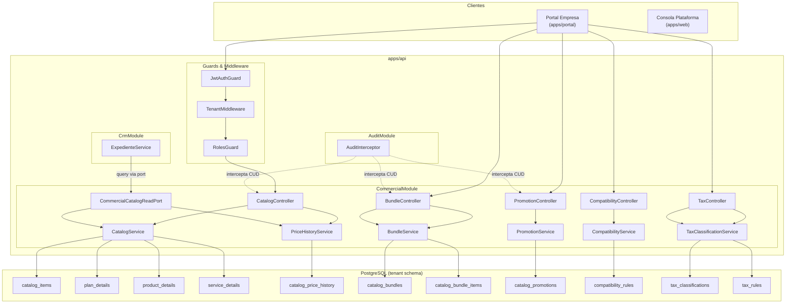
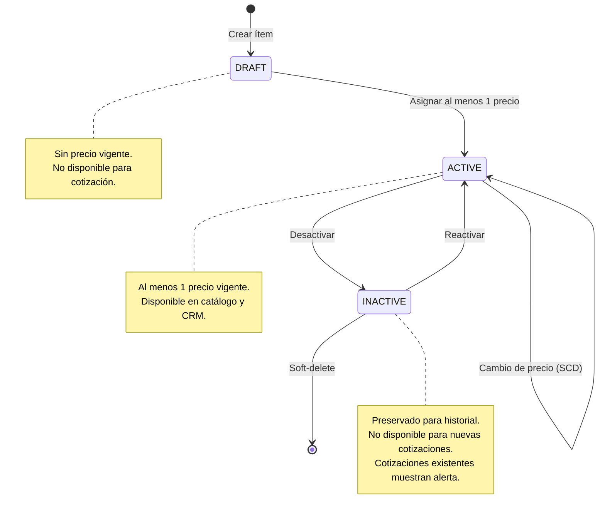

# HLD: Módulo Comercial — Arquitectura v1.0 (MOD06)

---

## 1. Contexto de Negocio

El Módulo Comercial centraliza la oferta de valor del ISP como Bounded Context independiente. Su responsabilidad es gestionar el **qué** se ofrece y **a cuánto**, separado del **dónde** y **cuál** (Inventario) y del **cuánto cobra** (Billing).

**Capacidades core:**

- Catálogo unificado de Planes, Productos y Servicios (Class Table Inheritance)
- Motor de Precios inmutable (SCD Tipo 2) con pricing por segmento de cliente
- Bundles / Combos con descuento dinámico y vigencia temporal
- Promociones temporales con límite de usos y expiración automática
- Reglas de compatibilidad entre ítems (REQUIRES, EXCLUDES, REPLACES)
- Clasificación tributaria configurable (IVA exento/excluido/pleno, retención, ICA)
- Eventos de dominio para integración con CRM y Billing

**Origen:** Extracción de entidades `PlanCatalogItem` y `AdditionalProduct` de TenantModule (ADR-028).

---

## 2. Bounded Contexts Afectados

| Contexto | Rol | Impacto |
|----------|-----|---------|
| **CommercialModule** (nuevo) | Owner | Bounded context principal — CRUD, pricing, bundles, promos, tax |
| **TenantModule** | Upstream (migración) | Pierde ownership de `plan_catalog_items` y `additional_products` |
| **CrmModule** | Downstream (consumidor) | Consume catálogo via `CommercialCatalogReadPort` para cotización y Expediente |
| **AuthModule** | Upstream | JWT + RBAC guards para proteger endpoints |
| **AuditModule** | Transversal | Interceptor global registra todas las operaciones CUD |
| **BillingModule** (futuro) | Downstream | Escuchará `PlanPriceUpdated` para recalcular proyecciones |

---

## 3. Estructura del Módulo

```
apps/api/src/modules/commercial/
├── commercial.module.ts                    # Módulo NestJS principal
│
├── entities/
│   ├── catalog-item.entity.ts              # Tabla base (CTI)
│   ├── plan-detail.entity.ts               # Extensión PLAN
│   ├── product-detail.entity.ts            # Extensión PRODUCT
│   ├── service-detail.entity.ts            # Extensión SERVICE
│   ├── catalog-price-history.entity.ts     # SCD Tipo 2
│   ├── catalog-bundle.entity.ts            # Bundles
│   ├── catalog-bundle-item.entity.ts       # Composición de bundles
│   ├── catalog-promotion.entity.ts         # Promociones temporales
│   ├── compatibility-rule.entity.ts        # Reglas REQUIRES/EXCLUDES/REPLACES
│   ├── tax-classification.entity.ts        # Clasificaciones tributarias
│   └── tax-rule.entity.ts                  # Reglas tributarias configurables
│
├── dto/
│   ├── create-plan.dto.ts                  # Validación Zod: crear plan
│   ├── create-product.dto.ts               # Validación Zod: crear producto
│   ├── create-service.dto.ts               # Validación Zod: crear servicio
│   ├── update-catalog-item.dto.ts          # Actualización parcial de ítem
│   ├── create-price.dto.ts                 # Nuevo precio SCD
│   ├── create-bundle.dto.ts                # Crear bundle con ítems
│   ├── create-promotion.dto.ts             # Crear promoción
│   ├── create-compatibility-rule.dto.ts    # Crear regla
│   ├── create-tax-rule.dto.ts              # Crear regla tributaria
│   ├── catalog-query.dto.ts                # Filtros de búsqueda
│   └── validate-compatibility.dto.ts       # Validar combinación
│
├── services/
│   ├── catalog.service.ts                  # CRUD ítems (Plan/Product/Service)
│   ├── price-history.service.ts            # Motor SCD Tipo 2
│   ├── bundle.service.ts                   # Gestión de combos
│   ├── promotion.service.ts                # Gestión de promociones
│   ├── compatibility.service.ts            # Validación de reglas
│   └── tax-classification.service.ts       # Clasificación y reglas tributarias
│
├── controllers/
│   ├── catalog.controller.ts               # CRUD catálogo + precios
│   ├── bundle.controller.ts                # CRUD bundles
│   ├── promotion.controller.ts             # CRUD promociones
│   ├── compatibility.controller.ts         # Reglas + validación
│   └── tax.controller.ts                   # Clasificaciones + reglas tributarias
│
├── ports/
│   └── commercial-catalog-read.port.ts     # Interfaz tipada para consumidores
│
├── adapters/
│   └── commercial-catalog-read.adapter.ts  # Implementación del puerto
│
└── __tests__/
    ├── catalog.service.spec.ts
    ├── price-history.service.spec.ts
    ├── bundle.service.spec.ts
    ├── promotion.service.spec.ts
    ├── compatibility.service.spec.ts
    └── tax-classification.service.spec.ts
```

---

## 4. Diagrama de Arquitectura



---

## 5. Modelo de Datos Detallado

### 5.1 catalog_items (tabla base — Class Table Inheritance)

```sql
CREATE TABLE catalog_items (
    id UUID PRIMARY KEY DEFAULT gen_random_uuid(),
    tenant_id UUID NOT NULL,
    type VARCHAR(20) NOT NULL CHECK (type IN ('PLAN', 'PRODUCT', 'SERVICE')),
    name VARCHAR(200) NOT NULL,
    description TEXT,
    tax_classification_id UUID REFERENCES tax_classifications(id),
    retention_applicable BOOLEAN NOT NULL DEFAULT false,
    is_active BOOLEAN NOT NULL DEFAULT true,
    created_at TIMESTAMPTZ NOT NULL DEFAULT now(),
    updated_at TIMESTAMPTZ NOT NULL DEFAULT now(),
    deleted_at TIMESTAMPTZ
);

CREATE INDEX idx_catalog_items_tenant_type_active 
    ON catalog_items (tenant_id, type, is_active) WHERE deleted_at IS NULL;
CREATE INDEX idx_catalog_items_tenant_name 
    ON catalog_items (tenant_id, is_active, name) WHERE deleted_at IS NULL;
```

### 5.2 plan_details

```sql
CREATE TABLE plan_details (
    id UUID PRIMARY KEY DEFAULT gen_random_uuid(),
    item_id UUID NOT NULL UNIQUE REFERENCES catalog_items(id) ON DELETE CASCADE,
    download_speed_mbps INTEGER NOT NULL,
    upload_speed_mbps INTEGER NOT NULL,
    technology VARCHAR(100) NOT NULL,
    installation_rule VARCHAR(30) NOT NULL DEFAULT 'ALWAYS'
        CHECK (installation_rule IN ('ALWAYS', 'ON_DEMAND', 'NEVER'))
);
```

### 5.3 product_details

```sql
CREATE TABLE product_details (
    id UUID PRIMARY KEY DEFAULT gen_random_uuid(),
    item_id UUID NOT NULL UNIQUE REFERENCES catalog_items(id) ON DELETE CASCADE,
    is_loan BOOLEAN NOT NULL DEFAULT false,
    requires_inventory BOOLEAN NOT NULL DEFAULT false,
    category VARCHAR(50) NOT NULL
        CHECK (category IN ('ENTERTAINMENT','SECURITY','CONNECTIVITY','BUSINESS','NETWORKING','CPE'))
);
```

### 5.4 service_details

```sql
CREATE TABLE service_details (
    id UUID PRIMARY KEY DEFAULT gen_random_uuid(),
    item_id UUID NOT NULL UNIQUE REFERENCES catalog_items(id) ON DELETE CASCADE,
    charge_type VARCHAR(20) NOT NULL
        CHECK (charge_type IN ('ONE_TIME', 'ON_DEMAND', 'RECURRING'))
);
```

### 5.5 catalog_price_history (SCD Tipo 2)

```sql
CREATE TABLE catalog_price_history (
    id UUID PRIMARY KEY DEFAULT gen_random_uuid(),
    item_id UUID NOT NULL REFERENCES catalog_items(id) ON DELETE CASCADE,
    customer_segment VARCHAR(30) NOT NULL,
    base_price NUMERIC(14,2) NOT NULL,
    installation_fee NUMERIC(14,2) NOT NULL DEFAULT 0,
    valid_from TIMESTAMPTZ NOT NULL DEFAULT now(),
    valid_to TIMESTAMPTZ,
    is_current BOOLEAN NOT NULL DEFAULT true,
    created_by UUID NOT NULL,
    created_at TIMESTAMPTZ NOT NULL DEFAULT now()
);

-- Indice para lookup rápido de precio vigente
CREATE UNIQUE INDEX idx_price_current_unique 
    ON catalog_price_history (item_id, customer_segment) 
    WHERE is_current = true;

-- Indice para historial cronológico
CREATE INDEX idx_price_history_item_from 
    ON catalog_price_history (item_id, valid_from DESC);
```

**Nota crítica:** El `UNIQUE INDEX` parcial garantiza que solo hay **un** precio vigente por (item_id, segment). Esto previene race conditions en escritura concurrente.

### 5.6 catalog_bundles + catalog_bundle_items

```sql
CREATE TABLE catalog_bundles (
    id UUID PRIMARY KEY DEFAULT gen_random_uuid(),
    tenant_id UUID NOT NULL,
    name VARCHAR(200) NOT NULL,
    description TEXT,
    discount_type VARCHAR(20) NOT NULL
        CHECK (discount_type IN ('PERCENTAGE', 'FIXED_AMOUNT')),
    discount_value NUMERIC(14,2) NOT NULL,
    valid_from TIMESTAMPTZ NOT NULL DEFAULT now(),
    valid_to TIMESTAMPTZ,
    is_active BOOLEAN NOT NULL DEFAULT true,
    created_at TIMESTAMPTZ NOT NULL DEFAULT now(),
    updated_at TIMESTAMPTZ NOT NULL DEFAULT now()
);

CREATE TABLE catalog_bundle_items (
    id UUID PRIMARY KEY DEFAULT gen_random_uuid(),
    bundle_id UUID NOT NULL REFERENCES catalog_bundles(id) ON DELETE CASCADE,
    item_id UUID NOT NULL REFERENCES catalog_items(id),
    is_required BOOLEAN NOT NULL DEFAULT true,
    sort_order INTEGER NOT NULL DEFAULT 0,
    UNIQUE (bundle_id, item_id)
);
```

### 5.7 catalog_promotions

```sql
CREATE TABLE catalog_promotions (
    id UUID PRIMARY KEY DEFAULT gen_random_uuid(),
    tenant_id UUID NOT NULL,
    name VARCHAR(200) NOT NULL,
    code VARCHAR(50) NOT NULL,
    description TEXT,
    discount_type VARCHAR(20) NOT NULL
        CHECK (discount_type IN ('PERCENTAGE', 'FIXED_AMOUNT', 'FREE_MONTHS')),
    discount_value NUMERIC(14,2) NOT NULL,
    applies_to VARCHAR(20) NOT NULL
        CHECK (applies_to IN ('ITEM', 'BUNDLE', 'INSTALLATION', 'ALL')),
    target_item_id UUID REFERENCES catalog_items(id),
    target_bundle_id UUID REFERENCES catalog_bundles(id),
    target_segments VARCHAR[],
    max_uses INTEGER,
    current_uses INTEGER NOT NULL DEFAULT 0,
    valid_from TIMESTAMPTZ NOT NULL,
    valid_to TIMESTAMPTZ NOT NULL,
    is_active BOOLEAN NOT NULL DEFAULT true,
    created_by UUID NOT NULL,
    created_at TIMESTAMPTZ NOT NULL DEFAULT now(),
    updated_at TIMESTAMPTZ NOT NULL DEFAULT now(),
    UNIQUE (tenant_id, code)
);
```

### 5.8 compatibility_rules

```sql
CREATE TABLE catalog_compatibility_rules (
    id UUID PRIMARY KEY DEFAULT gen_random_uuid(),
    tenant_id UUID NOT NULL,
    rule_type VARCHAR(20) NOT NULL
        CHECK (rule_type IN ('REQUIRES', 'EXCLUDES', 'REPLACES')),
    source_item_id UUID NOT NULL REFERENCES catalog_items(id),
    target_item_id UUID NOT NULL REFERENCES catalog_items(id),
    description VARCHAR(500),
    is_active BOOLEAN NOT NULL DEFAULT true,
    created_at TIMESTAMPTZ NOT NULL DEFAULT now(),
    CHECK (source_item_id != target_item_id)
);

CREATE INDEX idx_compat_rules_source 
    ON catalog_compatibility_rules (tenant_id, source_item_id, is_active);
```

### 5.9 tax_classifications + tax_rules

```sql
CREATE TABLE tax_classifications (
    id UUID PRIMARY KEY DEFAULT gen_random_uuid(),
    tenant_id UUID NOT NULL,
    code VARCHAR(50) NOT NULL,
    name VARCHAR(150) NOT NULL,
    description TEXT,
    is_active BOOLEAN NOT NULL DEFAULT true,
    created_at TIMESTAMPTZ NOT NULL DEFAULT now(),
    updated_at TIMESTAMPTZ NOT NULL DEFAULT now(),
    UNIQUE (tenant_id, code)
);

CREATE TABLE tax_rules (
    id UUID PRIMARY KEY DEFAULT gen_random_uuid(),
    tenant_id UUID NOT NULL,
    tax_classification_id UUID NOT NULL REFERENCES tax_classifications(id),
    customer_segment VARCHAR(30),
    estrato_min INTEGER,
    estrato_max INTEGER,
    municipality_code VARCHAR(10),
    tax_type VARCHAR(20) NOT NULL CHECK (tax_type IN ('IVA', 'RETENTION', 'ICA')),
    rate_percentage NUMERIC(5,2) NOT NULL,
    is_active BOOLEAN NOT NULL DEFAULT true,
    valid_from TIMESTAMPTZ NOT NULL DEFAULT now(),
    valid_to TIMESTAMPTZ,
    created_by UUID NOT NULL,
    created_at TIMESTAMPTZ NOT NULL DEFAULT now(),
    updated_at TIMESTAMPTZ NOT NULL DEFAULT now()
);

CREATE INDEX idx_tax_rules_lookup 
    ON tax_rules (tenant_id, tax_classification_id, is_active)
    WHERE is_active = true;
```

---

## 6. Servicios Core

| Servicio | Responsabilidad | Métodos principales |
|----------|----------------|---------------------|
| **CatalogService** | CRUD de ítems (Plan/Product/Service) con Class Table Inheritance | `createPlan()`, `createProduct()`, `createService()`, `update()`, `deactivate()`, `findAll()`, `findById()` |
| **PriceHistoryService** | Motor SCD Tipo 2: crear precio, cerrar anterior, consultar vigente | `createPrice()`, `getCurrentPrice()`, `getPriceHistory()`, `closePreviousPrice()` |
| **BundleService** | CRUD bundles, composición, cálculo de precio dinámico | `create()`, `addItem()`, `removeItem()`, `calculatePrice()`, `findActive()` |
| **PromotionService** | CRUD promos, validación vigencia, control de usos | `create()`, `applyPromotion()`, `incrementUse()`, `findActive()`, `checkExpiration()` |
| **CompatibilityService** | CRUD reglas, validación de combinaciones de ítems | `createRule()`, `validateCombination()`, `getSuggestions()` |
| **TaxClassificationService** | CRUD clasificaciones y reglas tributarias configurables | `createClassification()`, `createRule()`, `getApplicableTaxes()`, `getRulesForItem()` |

### 6.1 Lógica crítica: PriceHistoryService.createPrice()

```typescript
// Pseudocódigo — lógica SCD Tipo 2
async createPrice(itemId: string, segment: CustomerSegment, dto: CreatePriceDto): Promise<CatalogPriceHistory> {
  return this.dataSource.transaction(async (manager) => {
    // 1. Cerrar precio anterior (si existe)
    await manager.update(CatalogPriceHistory, 
      { itemId, customerSegment: segment, isCurrent: true },
      { validTo: new Date(), isCurrent: false }
    );

    // 2. Crear nuevo precio vigente
    const newPrice = manager.create(CatalogPriceHistory, {
      itemId,
      customerSegment: segment,
      basePrice: dto.basePrice,
      installationFee: dto.installationFee,
      validFrom: new Date(),
      isCurrent: true,
      createdBy: dto.userId,
    });

    const saved = await manager.save(newPrice);

    // 3. Emitir evento de dominio
    this.eventEmitter.emit('commercial.price.updated', {
      itemId,
      segment,
      oldPrice: /* precio anterior */,
      newPrice: dto.basePrice,
      changedBy: dto.userId,
    });

    return saved;
  });
}
```

### 6.2 Lógica crítica: CompatibilityService.validateCombination()

```typescript
// Pseudocódigo — validación de compatibilidad
async validateCombination(itemIds: string[]): Promise<ValidationResult> {
  const rules = await this.repository.find({
    where: [
      { sourceItemId: In(itemIds), isActive: true },
      { targetItemId: In(itemIds), isActive: true },
    ],
  });

  const errors: CompatibilityError[] = [];
  const suggestions: CompatibilitySuggestion[] = [];

  for (const rule of rules) {
    switch (rule.ruleType) {
      case 'REQUIRES':
        // Si el source está en la lista pero el target no, error
        if (itemIds.includes(rule.sourceItemId) && !itemIds.includes(rule.targetItemId)) {
          errors.push({ type: 'MISSING_REQUIREMENT', rule, message: rule.description });
          suggestions.push({ addItem: rule.targetItemId, reason: rule.description });
        }
        break;
      case 'EXCLUDES':
        // Si ambos están en la lista, error
        if (itemIds.includes(rule.sourceItemId) && itemIds.includes(rule.targetItemId)) {
          errors.push({ type: 'INCOMPATIBLE', rule, message: rule.description });
        }
        break;
      case 'REPLACES':
        // Si ambos están, sugerir quitar el antiguo
        if (itemIds.includes(rule.sourceItemId) && itemIds.includes(rule.targetItemId)) {
          suggestions.push({ removeItem: rule.targetItemId, reason: rule.description });
        }
        break;
    }
  }

  return { valid: errors.length === 0, errors, suggestions };
}
```

---

## 7. Validación Zod (Schemas principales)

```typescript
// CreatePlanSchema
const CreatePlanSchema = z.object({
  name: z.string().min(3).max(200),
  description: z.string().optional(),
  taxClassificationId: z.string().uuid(),
  retentionApplicable: z.boolean().default(false),
  downloadSpeedMbps: z.number().int().positive(),
  uploadSpeedMbps: z.number().int().positive(),
  technology: z.string().min(2).max(100),
  installationRule: z.enum(['ALWAYS', 'ON_DEMAND', 'NEVER']).default('ALWAYS'),
  prices: z.array(z.object({
    customerSegment: z.nativeEnum(CustomerSegment),
    basePrice: z.number().positive(),
    installationFee: z.number().nonnegative().default(0),
  })).min(1),
});

// CreateBundleSchema
const CreateBundleSchema = z.object({
  name: z.string().min(3).max(200),
  description: z.string().optional(),
  discountType: z.enum(['PERCENTAGE', 'FIXED_AMOUNT']),
  discountValue: z.number().positive(),
  validFrom: z.coerce.date(),
  validTo: z.coerce.date().optional(),
  items: z.array(z.object({
    itemId: z.string().uuid(),
    isRequired: z.boolean().default(true),
    sortOrder: z.number().int().nonnegative().default(0),
  })).min(2),
});

// CreatePromotionSchema
const CreatePromotionSchema = z.object({
  name: z.string().min(3).max(200),
  code: z.string().min(3).max(50).regex(/^[A-Z0-9_-]+$/),
  description: z.string().optional(),
  discountType: z.enum(['PERCENTAGE', 'FIXED_AMOUNT', 'FREE_MONTHS']),
  discountValue: z.number().positive(),
  appliesTo: z.enum(['ITEM', 'BUNDLE', 'INSTALLATION', 'ALL']),
  targetItemId: z.string().uuid().optional(),
  targetBundleId: z.string().uuid().optional(),
  targetSegments: z.array(z.nativeEnum(CustomerSegment)).optional(),
  maxUses: z.number().int().positive().optional(),
  validFrom: z.coerce.date(),
  validTo: z.coerce.date(),
});

// CreateTaxRuleSchema
const CreateTaxRuleSchema = z.object({
  taxClassificationId: z.string().uuid(),
  customerSegment: z.nativeEnum(CustomerSegment).optional(),
  estratoMin: z.number().int().min(1).max(6).optional(),
  estratoMax: z.number().int().min(1).max(6).optional(),
  municipalityCode: z.string().max(10).optional(),
  taxType: z.enum(['IVA', 'RETENTION', 'ICA']),
  ratePercentage: z.number().min(0).max(100),
  validFrom: z.coerce.date().default(() => new Date()),
  validTo: z.coerce.date().optional(),
});
```

---

## 8. Puertos de Integración

### 8.1 CommercialCatalogReadPort (reemplaza PlanCatalogReadPort existente)

```typescript
export interface CommercialCatalogReadPort {
  // Planes
  getActivePlans(): Promise<PlanSummary[]>;
  getPlanById(planId: string): Promise<PlanDetail | null>;
  
  // Precio vigente
  getCurrentPrice(itemId: string, segment: CustomerSegment): Promise<PriceSnapshot | null>;
  
  // Catálogo completo
  getCatalogItems(filters: CatalogQueryFilters): Promise<PaginatedResult<CatalogItemSummary>>;
  
  // Bundles
  getActiveBundles(): Promise<BundleSummary[]>;
  getBundlePrice(bundleId: string, segment: CustomerSegment): Promise<BundlePriceCalculation>;
  
  // Promociones
  getActivePromotions(segment?: CustomerSegment): Promise<PromotionSummary[]>;
  
  // Compatibilidad
  validateItemCombination(itemIds: string[]): Promise<CompatibilityValidationResult>;
  
  // Tax
  getApplicableTaxes(itemId: string, segment: CustomerSegment, estrato?: number): Promise<TaxBreakdown[]>;
}
```

### 8.2 Eventos de Dominio

| Evento | Payload | Consumidor esperado |
|--------|---------|---------------------|
| `commercial.price.updated` | `{ itemId, segment, oldPrice, newPrice, changedBy }` | BillingModule (futuro) |
| `commercial.item.deactivated` | `{ itemId, name, deactivatedBy }` | CrmModule (alertar cotizaciones) |
| `commercial.bundle.created` | `{ bundleId, name, itemIds }` | — (log) |
| `commercial.promotion.started` | `{ promotionId, code, validFrom, validTo }` | CrmModule, Portal |
| `commercial.promotion.expired` | `{ promotionId, code, totalUses }` | CrmModule, Portal |
| `commercial.tax-rule.changed` | `{ ruleId, taxType, oldRate, newRate, changedBy }` | AuditModule (compliance log) |

---

## 9. Frontend — Componentes

### 9.1 Páginas principales (apps/portal)

| Ruta | Componente | Responsabilidad |
|------|-----------|-----------------|
| `/catalogo` | `CatalogListPage` | Listado unificado con tabs PLAN/PRODUCT/SERVICE, búsqueda, filtros |
| `/catalogo/planes/nuevo` | `CreatePlanPage` | Formulario de creación de plan con precios por segmento |
| `/catalogo/productos/nuevo` | `CreateProductPage` | Formulario de creación de producto con flag comodato |
| `/catalogo/servicios/nuevo` | `CreateServicePage` | Formulario de creación de servicio adicional |
| `/catalogo/:id` | `CatalogItemDetailPage` | Detalle con tabs: Info, Precios, Historial, Compatibilidad |
| `/catalogo/combos` | `BundleListPage` | Listado de combos con estado y vigencia |
| `/catalogo/combos/nuevo` | `CreateBundlePage` | Formulario con selector de ítems y descuento |
| `/catalogo/promociones` | `PromotionListPage` | Listado con estado, usos, vigencia |
| `/catalogo/promociones/nuevo` | `CreatePromotionPage` | Formulario con scope, segmento y límites |
| `/catalogo/impuestos` | `TaxConfigPage` | Clasificaciones y reglas tributarias |
| `/catalogo/compatibilidad` | `CompatibilityRulesPage` | CRUD de reglas REQUIRES/EXCLUDES/REPLACES |

### 9.2 Componentes reutilizables

| Componente | Función |
|-----------|---------|
| `PriceBySegmentForm` | Input de precios diferenciados por segmento (tabla editable) |
| `PriceHistoryTimeline` | Timeline visual de cambios de precio |
| `BundleItemSelector` | Selector de ítems con drag & drop y flag requerido/opcional |
| `CompatibilityAlert` | Banner de advertencia en cotización CRM |
| `TaxRuleEditor` | Formulario dinámico para reglas tributarias por estrato/municipio |
| `PromotionBadge` | Badge visual en catálogo indicando promoción activa |

---

## 10. Flujo de Estado — Ciclo de Vida del Ítem



---

## 11. Migraciones

### 11.1 Migración principal (nueva)

**Archivo:** `packages/database/src/migrations/tenant/XXX_create_commercial_module.ts`

**Tablas creadas:**
1. `tax_classifications`
2. `tax_rules`
3. `catalog_items`
4. `plan_details`
5. `product_details`
6. `service_details`
7. `catalog_price_history`
8. `catalog_bundles`
9. `catalog_bundle_items`
10. `catalog_promotions`
11. `catalog_compatibility_rules`

**Estrategia:** Aditiva, no destructiva. Las tablas antiguas (`plan_catalog_items`, `additional_products`) se preservan durante la migración.

### 11.2 Migración de datos (separada)

**Archivo:** `packages/database/src/migrations/tenant/XXX_migrate_catalog_data.ts`

**Pasos:**
1. Crear clasificación tributaria por defecto: `IVA_FULL` (19%)
2. Migrar `plan_catalog_items` → `catalog_items` (type=PLAN) + `plan_details` + `catalog_price_history` (precio actual como primer registro SCD)
3. Migrar `additional_products` → `catalog_items` (type=PRODUCT) + `product_details`
4. Actualizar `CommercialCatalogReadPort` en CRM para apuntar a nuevas tablas
5. Marcar tablas antiguas como deprecadas (no eliminar hasta confirmar estabilidad)

### 11.3 Reversibilidad

- Migración con `up()` y `down()` completos
- `down()` revierte creación de tablas
- Datos migrados NO se revierten automáticamente (backup previo requerido)
- Tablas antiguas preservadas como fallback

---

## 12. Enums (en @iwana/shared)

```typescript
// Nuevos enums para MOD06
export enum CatalogItemType {
  PLAN = 'PLAN',
  PRODUCT = 'PRODUCT',
  SERVICE = 'SERVICE',
}

export enum ChargeType {
  ONE_TIME = 'ONE_TIME',
  ON_DEMAND = 'ON_DEMAND',
  RECURRING = 'RECURRING',
}

export enum InstallationRule {
  ALWAYS = 'ALWAYS',
  ON_DEMAND = 'ON_DEMAND',
  NEVER = 'NEVER',
}

export enum DiscountType {
  PERCENTAGE = 'PERCENTAGE',
  FIXED_AMOUNT = 'FIXED_AMOUNT',
  FREE_MONTHS = 'FREE_MONTHS',
}

export enum PromotionScope {
  ITEM = 'ITEM',
  BUNDLE = 'BUNDLE',
  INSTALLATION = 'INSTALLATION',
  ALL = 'ALL',
}

export enum CompatibilityRuleType {
  REQUIRES = 'REQUIRES',
  EXCLUDES = 'EXCLUDES',
  REPLACES = 'REPLACES',
}

export enum TaxType {
  IVA = 'IVA',
  RETENTION = 'RETENTION',
  ICA = 'ICA',
}

// Extensión del enum existente
export enum ProductCategory {
  ENTERTAINMENT = 'ENTERTAINMENT',
  SECURITY = 'SECURITY',
  CONNECTIVITY = 'CONNECTIVITY',
  BUSINESS = 'BUSINESS',
  NETWORKING = 'NETWORKING',
  CPE = 'CPE',
}
```

---

## 13. Consideraciones de Seguridad

- **RBAC estricto:** Endpoints de escritura protegidos con `@Roles(UserRole.TENANT_ADMIN)` y permisos granulares `commercial:write`
- **Validación Zod** en todos los boundaries de entrada (controllers)
- **Audit trail:** AuditInterceptor global registra toda operación CUD con userId, tenantId, acción y payload (sin PII)
- **Multi-tenant:** Todas las queries filtran por `tenant_id` desde `TenantContext`
- **Inmutabilidad financiera:** Precios históricos nunca se modifican (SCD Tipo 2)
- **Reglas tributarias:** Cambios auditados con `created_by` y timestamp para cumplimiento regulatorio
- **Sin PII:** El catálogo no almacena datos personales de clientes

---

## 14. Decisión de Salida

**Estado:** GO — Aprobado para implementación

**Justificación:**
- Bounded context bien delimitado con ownership claro
- Patrón CTI probado en TypeORM para catálogo unificado
- SCD Tipo 2 garantiza inmutabilidad financiera
- Integración definida via puertos (no acceso directo a tablas)
- Migración aditiva, no destructiva
- Sin dependencias bloqueantes (MOD01-MOD05 en producción)

**Próximo paso:** Generar prompt de ejecución Fase 01 para Sr. Dev Fullstack
