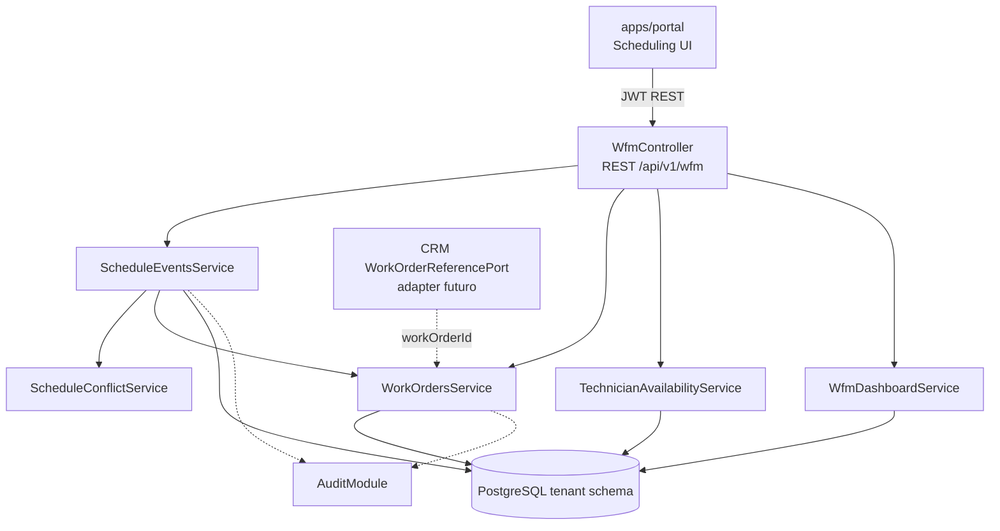

# HLD - MOD09 Programacion / WFM

**Version:** 1.0  
**Estado:** Aprobado  
**Fecha:** 2026-05-06  
**Modo activo:** Architect  
**Autor:** AI-EM-ARCH  
**PRD de referencia:** docs/prds/PRD-MOD09-PROGRAMACION-WFM-v1.0.md  
**Spec de origen:** docs/specs/SPEC-MOD09-PROGRAMACION-WFM-DISENO-v1.0.md  
**ADR aprobado:** docs/adrs/ADR-037-Bounded-Context-Programacion-WFM.md  
**Prompt de ejecucion:** docs/prompts/PROMPT-MOD09-PROGRAMACION-WFM-FASE-01-v1.0.md

> Aprobacion CTO registrada: este HLD adopta `WfmModule` como nuevo bounded context aprobado para ejecucion de MOD09 Fase 01.

---

## 1. Contexto de negocio

MOD09 cubre la agenda operativa del ISP: visitas, instalaciones, soporte, retiros y mantenimientos. Su objetivo es reducir friccion entre el cierre comercial y la ejecucion tecnica, permitiendo a coordinadores operativos programar trabajos por horas, dias, semanas y meses, y a tecnicos ejecutar una Work Order ligera desde el portal.

La Fase 01 prioriza la programacion y trazabilidad minima. Las capacidades completas de WFM del PRD maestro, como materiales, firma, evidencias fotograficas, inventario en campo, portal contratista dedicado y mapa de cuadrillas, quedan fuera de esta fase.

---

## 2. Bounded contexts afectados

| Bounded context | Impacto | Regla |
| --- | --- | --- |
| `WfmModule` | Principal | Owner de agenda, Work Orders ligeras, disponibilidad y reagendamientos |
| `UsersModule` | Upstream | Provee usuarios/roles; MOD09 referencia `assignedUserId` sin leer tablas directamente fuera de patron aprobado |
| `CrmModule` | Downstream/consumer | Consume referencia `workOrderId` por puerto/evento, sin leer tablas WFM |
| `AuthModule` | Upstream | JWT, RolesGuard y actor autenticado |
| `TenantModule` | Upstream | TenantContext y schema routing |
| `AuditModule` | Transversal | Auditoria CUD y eventos operativos relevantes |
| `apps/portal` | Consumer | UI de agenda, lista y detalle operativo |
| Service Assurance futuro | Upstream futuro | Emitira necesidad de visita tecnica |
| Provisioning futuro | Upstream futuro | Solicitara instalacion fisica o trabajo tecnico |
| Inventory futuro | Downstream futuro | Consumira eventos de materiales/equipos en fases posteriores |

### Boundary explicito

- WFM no consulta tablas de CRM, Assurance, Provisioning ni Inventory.
- CRM no consulta tablas de WFM; consume `workOrderId` por puerto tipado o evento.
- Las referencias cross-module son IDs logicos, no FKs cross-schema.
- La agenda no duplica PII sensible del suscriptor.

---

## 3. Componentes principales

### Backend

```
apps/api/src/modules/wfm/
├── wfm.module.ts
├── wfm.controller.ts
├── services/
│   ├── schedule-events.service.ts
│   ├── work-orders.service.ts
│   ├── technician-availability.service.ts
│   ├── wfm-dashboard.service.ts
│   └── schedule-conflict.service.ts
├── dto/
│   ├── create-schedule-event.dto.ts
│   ├── update-schedule-event.dto.ts
│   ├── transition-schedule-event.dto.ts
│   ├── reschedule-event.dto.ts
│   ├── transition-work-order.dto.ts
│   └── technician-availability.dto.ts
├── ports/
│   └── wfm-work-order-read.port.ts
└── tests/
    ├── schedule-conflict.service.spec.ts
    ├── schedule-events.service.spec.ts
    └── wfm.controller.spec.ts
```

### Shared contracts

```
packages/shared/src/enums/wfm/
├── wfm-work-type.enum.ts
├── schedule-event-status.enum.ts
├── work-order-status.enum.ts
├── work-order-task-status.enum.ts
├── work-order-priority.enum.ts
├── work-order-source-context.enum.ts
└── technician-availability-type.enum.ts
```

### Database

```
packages/database/src/entities/
├── schedule-event.entity.ts
├── work-order.entity.ts
├── work-order-task.entity.ts
├── schedule-reschedule-log.entity.ts
└── technician-availability.entity.ts

packages/database/src/migrations/tenant/
└── 030_create_wfm_module.ts
```

### Portal

```
apps/portal/src/app/dashboard/scheduling/page.tsx
apps/portal/src/components/scheduling/
├── SchedulingClient.tsx
├── SchedulingToolbar.tsx
├── ScheduleCalendar.tsx
├── ScheduleList.tsx
├── ScheduleEventDrawer.tsx
├── ScheduleEventForm.tsx
├── RescheduleEventDialog.tsx
└── TechnicianWorkList.tsx
```

---

## 4. Diagrama de arquitectura



---

## 5. Modelo de datos

Todas las entidades son tenant-aware y no declaran schema en `@Entity()`. PostgreSQL resuelve tablas por `SET LOCAL search_path` dentro de transacciones.

### `schedule_events`

Owner de bloques de agenda. Indices obligatorios:

- `idx_schedule_events_tenant_start`
- `idx_schedule_events_tenant_assigned_start`
- `idx_schedule_events_tenant_status_start`
- `idx_schedule_events_tenant_expediente`
- `idx_schedule_events_tenant_ticket`

### `work_orders`

Owner de Work Order ligera. Debe tener `code` unico por tenant y `sourceContext` para rastrear origen manual, CRM, Assurance o Provisioning.

### `work_order_tasks`

Permite una o varias tareas internas. Fase 01 crea al menos una tarea base al crear una Work Order.

### `schedule_reschedule_logs`

Append-only para cambios de fecha/hora. No debe editarse ni borrarse desde API funcional.

### `technician_availability`

Bloqueos puntuales y disponibilidad explicita. La recurrencia semanal se difiere a Fase 02 salvo necesidad confirmada.

---

## 6. Reglas de negocio y servicios

### ScheduleConflictService

Valida solapamientos por `assignedUserId` entre eventos activos. Estados activos para conflicto:

- `DRAFT`
- `SCHEDULED`
- `EN_ROUTE`
- `IN_PROGRESS`

Estados no conflictivos:

- `COMPLETED`
- `CANCELLED`
- `NO_SHOW`

`RESCHEDULED` no debe quedar como estado final activo para eventos nuevos; representa historial del evento anterior o marca transitoria segun implementacion aprobada.

### ScheduleEventsService

Responsable de crear, listar, actualizar, reagendar, cancelar y transicionar eventos.

### WorkOrdersService

Responsable de crear Work Orders ligeras, generar consecutivo `WO-YYYYMMDD-NNN`, transicionar estado y cerrar orden.

### TechnicianAvailabilityService

Gestiona bloqueos y disponibilidad puntual de tecnicos/contratistas.

### WfmDashboardService

Calcula summary operativo por tenant: hoy, atrasados, proximos y carga por tecnico.

---

## 7. Contratos REST

Base path recomendado: `/api/v1/wfm`.

| Metodo | Ruta | Servicio |
| --- | --- | --- |
| GET | `/events` | `ScheduleEventsService.list()` |
| POST | `/events` | `ScheduleEventsService.create()` |
| GET | `/events/:id` | `ScheduleEventsService.getById()` |
| PATCH | `/events/:id` | `ScheduleEventsService.update()` |
| PATCH | `/events/:id/status` | `ScheduleEventsService.transitionStatus()` |
| POST | `/events/:id/reschedule` | `ScheduleEventsService.reschedule()` |
| DELETE | `/events/:id` | `ScheduleEventsService.cancel()` |
| GET | `/work-orders` | `WorkOrdersService.list()` |
| GET | `/work-orders/:id` | `WorkOrdersService.getById()` |
| PATCH | `/work-orders/:id/status` | `WorkOrdersService.transitionStatus()` |
| GET | `/dashboard/summary` | `WfmDashboardService.getSummary()` |
| GET | `/technicians/availability` | `TechnicianAvailabilityService.list()` |
| POST | `/technicians/availability` | `TechnicianAvailabilityService.create()` |

---

## 8. Seguridad y privacidad

- Controllers con `JwtAuthGuard` y `RolesGuard`.
- Decoradores `@Roles()` usando `UserRole.*`, nunca strings.
- `TECHNICIAN` y `CONTRACTOR` aplican ownership: solo registros con `assignedUserId === actor.sub`.
- No persistir documento, telefono o email del suscriptor en WFM Fase 01.
- Errores de validacion semanticos sin exponer PII.
- Logs sin direccion completa cuando se considere sensible; preferir ID de evento/orden.
- Zod en create/update/status/reschedule/availability.

---

## 9. Frontend

La UI en `apps/portal` debe ser operativa y densa, no estilo landing.

Patrones:

- Server page en `app/dashboard/scheduling/page.tsx` con metadata.
- Client orchestrator `SchedulingClient.tsx`.
- Tabs para Dia, Semana, Mes y Lista.
- Tabla/lista con `align-middle` en celdas.
- Formulario con react-hook-form + Zod.
- Textos visibles en espanol y sentence case.
- Sin enums crudos en UI: usar labels de negocio.

---

## 10. Testing y validacion

### Backend

- Unit: `ScheduleConflictService`.
- Unit: transiciones validas e invalidas.
- Unit: ownership tecnico/contratista.
- Integration: aislamiento tenant en eventos y Work Orders.
- Controller: permisos por rol y validaciones Zod.

### Frontend

- Jest para helpers de calendario y formularios.
- Jest para labels de estados/tipos.
- Playwright portal: crear, reagendar y completar evento basico.

### Comandos esperados

```bash
pnpm --filter @iwana/api test -- wfm
pnpm --filter @iwana/api typecheck
pnpm --filter @iwana/portal test -- scheduling
pnpm --filter @iwana/portal typecheck
pnpm test:e2e:portal --grep "Programacion"
```

---

## 11. Observabilidad y auditoria

- Reagendamientos en `schedule_reschedule_logs` como evidencia funcional.
- CUD cubierto por AuditModule cuando aplique interceptor global.
- Eventos futuros documentados: `wfm.work-order-created`, `wfm.work-order-completed`, `wfm.event-rescheduled`.
- Dashboard summary preparado para metricas operativas sin dependencia de stack externo.

---

## 12. Riesgos tecnicos

| Riesgo | Impacto | Mitigacion |
| --- | --- | --- |
| Drift del boundary aprobado | Alto | Ejecutar estrictamente bajo ADR-037 y escalar cualquier cambio de boundary. |
| Acoplamiento con CRM | Alto | Integrar por puerto/evento; no imports circulares. |
| PII duplicada | Alto | Guardar referencias y direccion operativa minima; no documentos/telefonos. |
| Solapamientos por zona horaria | Medio | Persistir `timestamptz` y validar rangos absolutos. |
| UI calendario compleja | Medio | Fase 01 con calendario propio simple + lista operativa; no introducir libreria pesada sin decision. |
