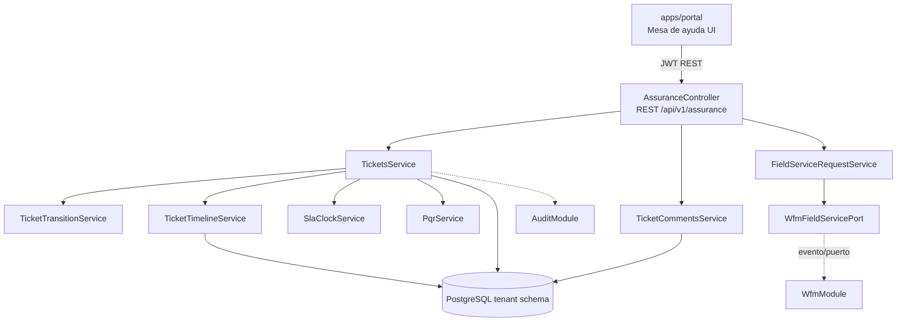

# HLD - MOD10 Service Assurance / Mesa de Ayuda

**Version:** 1.0  
**Estado:** En revisión  
**Fecha:** 2026-05-09  
**Modo activo:** Architect  
**Autor:** AI-EM-ARCH  
**PRD de referencia:** docs/prds/PRD-MOD10-SERVICE-ASSURANCE-v1.0.md  
**Spec de origen:** docs/specs/SPEC-MOD10-SERVICE-ASSURANCE-DISENO-v1.0.md  
**ADR propuesto:** docs/adrs/ADR-038-Bounded-Context-Service-Assurance.md  

---

## 1. Contexto de negocio

MOD10 centraliza la operación de soporte del ISP: tickets, SLA, PQR CRC, casos internos, escalamientos y solicitud de trabajos de campo. Debe servir como consola diaria de soporte y NOC, sin convertirse en CRM, Billing, NMS ni WFM.

La Fase 01 prioriza valor operativo medible: registrar casos, clasificarlos, asignarlos, medir SLA, preservar trazabilidad PQR y disparar necesidad de campo hacia WFM cuando aplique.

---

## 2. Bounded contexts afectados

| Bounded context | Impacto | Regla |
| --- | --- | --- |
| `AssuranceModule` | Principal | Owner de tickets, SLA, PQR, comentarios y timeline |
| `WfmModule` | Downstream | Recibe solicitud de campo; owner de Work Orders y agenda |
| `CrmModule` / Subscribers | Upstream lógico | Assurance referencia suscriptores/contratos por ID lógico, sin leer tablas |
| `UsersModule` | Upstream lógico | Assurance referencia usuarios asignados por ID y rol |
| `AuthModule` | Upstream | JWT, RBAC y actor autenticado |
| `TenantModule` | Upstream | TenantContext y schema routing |
| `AuditModule` | Transversal | CUD y eventos sensibles |
| `Mailer/Omnichannel` futuro | Downstream | Notificaciones por eventos |
| `NMSModule` futuro | Upstream | Alertas pueden crear tickets automáticos en Fase 02 |
| `apps/portal` | Consumer | UI Mesa de ayuda |

### Boundary explícito

- Assurance no consulta tablas de CRM, Billing, NMS, WFM ni Users.
- Otros módulos no consultan tablas de Assurance directamente.
- Las referencias cross-module son IDs lógicos y contratos tipados.
- No se guardan documentos, teléfonos, correos ni datos financieros del cliente en tablas Assurance.

---

## 3. Componentes principales

### Backend

```
apps/api/src/modules/assurance/
├── assurance.module.ts
├── assurance.controller.ts
├── dto/
│   ├── create-ticket.dto.ts
│   ├── update-ticket.dto.ts
│   ├── list-ticket-query.dto.ts
│   ├── transition-ticket.dto.ts
│   ├── assign-ticket.dto.ts
│   ├── create-ticket-comment.dto.ts
│   ├── request-field-service.dto.ts
│   └── create-sla-policy.dto.ts
├── services/
│   ├── tickets.service.ts
│   ├── ticket-comments.service.ts
│   ├── ticket-transition.service.ts
│   ├── ticket-timeline.service.ts
│   ├── sla-policy.service.ts
│   ├── sla-clock.service.ts
│   ├── pqr.service.ts
│   ├── assurance-dashboard.service.ts
│   └── field-service-request.service.ts
├── ports/
│   └── wfm-field-service.port.ts
└── tests/
    ├── ticket-transition.service.spec.ts
    ├── sla-clock.service.spec.ts
    ├── pqr.service.spec.ts
    └── assurance.controller.spec.ts
```

### Shared contracts

```
packages/shared/src/enums/assurance/
├── ticket-type.enum.ts
├── ticket-status.enum.ts
├── ticket-priority.enum.ts
├── ticket-source.enum.ts
├── ticket-requester-type.enum.ts
├── ticket-subject-type.enum.ts
├── ticket-queue.enum.ts
├── ticket-field-decision.enum.ts
├── ticket-comment-visibility.enum.ts
└── pqr-regulatory-status.enum.ts
```

### Database

```
packages/database/src/entities/
├── support-ticket.entity.ts
├── ticket-comment.entity.ts
├── ticket-timeline-event.entity.ts
├── ticket-sla-policy.entity.ts
├── ticket-pqr-record.entity.ts
└── ticket-work-order-link.entity.ts

packages/database/src/migrations/tenant/
└── 031_create_assurance_module.ts
```

### Portal

```
apps/portal/src/app/dashboard/assurance/page.tsx
apps/portal/src/components/assurance/
├── AssuranceClient.tsx
├── AssuranceToolbar.tsx
├── TicketsTable.tsx
├── TicketsKanban.tsx
├── TicketDetailDrawer.tsx
├── TicketForm.tsx
├── TicketCommentComposer.tsx
├── TicketTimeline.tsx
├── RequestFieldServiceDialog.tsx
└── SlaSummaryCards.tsx
```

---

## 4. Diagrama de arquitectura



---

## 5. Modelo de datos

Entidades tenant-aware sin schema en `@Entity()`. PostgreSQL resuelve por `SET LOCAL search_path`.

### `support_tickets`

Índices mínimos:

- `idx_support_tickets_tenant_status_created`
- `idx_support_tickets_tenant_queue_status`
- `idx_support_tickets_tenant_assigned_status`
- `idx_support_tickets_tenant_requester`
- `idx_support_tickets_tenant_subject`
- `idx_support_tickets_tenant_resolution_due`
- `uq_support_tickets_tenant_code`

### `ticket_comments`

Comentarios del ticket. Debe distinguir visibilidad interna vs solicitante. Fase 01 no publica comentarios al portal cliente, pero deja el contrato listo.

### `ticket_timeline_events`

Append-only. No debe editarse desde API funcional.

### `ticket_sla_policies`

Políticas por tenant para cálculo de primera respuesta y resolución.

### `ticket_pqr_records`

Registro regulatorio exclusivo para tickets tipo PQR.

### `ticket_work_order_links`

Historial de vínculos Assurance-WFM, sin FK cross-module.

---

## 6. Reglas de negocio

1. Un ticket cerrado o cancelado no puede cambiar de estado funcional.
2. Todo cambio de estado relevante crea timeline event.
3. `RESOLVED` requiere nota de resolución.
4. `PQR` requiere `ticket_pqr_records` antes de cierre.
5. `FIELD_SERVICE_REQUIRED` requiere emitir evento o registrar bloqueo de integración.
6. Técnicos/contratistas solo consultan tickets asignados o vinculados a trabajos propios.
7. `IWANA_SUPPORT` no accede a contenido sensible; solo metadatos técnicos permitidos.
8. El cálculo SLA se hace al crear o reclasificar el ticket.
9. Las pausas SLA en `WAITING_CUSTOMER` solo aplican si la política lo permite.
10. No se permite hardcodear tenant, schema ni IDs de usuario.

---

## 7. Contratos REST

Base path: `/api/v1/assurance`.

| Metodo | Ruta | Servicio |
| --- | --- | --- |
| GET | `/tickets` | `TicketsService.list()` |
| POST | `/tickets` | `TicketsService.create()` |
| GET | `/tickets/:id` | `TicketsService.getById()` |
| PATCH | `/tickets/:id` | `TicketsService.update()` |
| PATCH | `/tickets/:id/status` | `TicketsService.transitionStatus()` |
| POST | `/tickets/:id/comments` | `TicketCommentsService.create()` |
| POST | `/tickets/:id/assign` | `TicketsService.assign()` |
| POST | `/tickets/:id/request-field-service` | `FieldServiceRequestService.request()` |
| POST | `/tickets/:id/link-work-order` | `FieldServiceRequestService.linkWorkOrder()` |
| GET | `/dashboard/summary` | `AssuranceDashboardService.getSummary()` |
| GET | `/sla-policies` | `SlaPolicyService.list()` |
| POST | `/sla-policies` | `SlaPolicyService.create()` |

---

## 8. Seguridad y privacidad

- Controllers protegidos con `JwtAuthGuard` y `RolesGuard`.
- Decoradores `@Roles()` con `UserRole.*`.
- Zod en create/update/list/status/comment/assign/field-service.
- No almacenar documento, teléfono, email ni estado financiero del suscriptor.
- Sanitizar logs y errores; referenciar ticket por `id` o `code`.
- Timeline no debe incluir contenido sensible no necesario.
- PQR puede contener información sensible: no loguear descripción ni comentarios.
- Migraciones reversibles; nunca `synchronize: true`.

---

## 9. Frontend

UI operativa y densa en `apps/portal`.

Patrones:

- Server page `app/dashboard/assurance/page.tsx` con metadata.
- Client orchestrator `AssuranceClient.tsx`.
- Tabla y kanban simple; evitar UI decorativa.
- Drawer para detalle y acciones rápidas.
- Labels en español, sentence case.
- Sin enums crudos.
- Celdas de tabla con `align-middle`.

---

## 10. Testing y validacion

### Backend

- Unit tests de transiciones válidas e inválidas.
- Unit tests de SLA por política.
- Unit tests de PQR y reglas de cierre.
- Unit tests de emisión de solicitud de campo.
- Controller/integration tests con RBAC y ownership.
- Integration tenant-aware para aislamiento por schema.

### Frontend

- Tests de labels y filtros.
- Tests de formulario y validaciones.
- Tests de drawer, comentarios y acción solicitar campo.

### E2E

- Crear ticket interno.
- Crear ticket externo.
- Clasificar, asignar, comentar y resolver.
- Solicitar trabajo de campo desde un ticket.

Comandos esperados:

```bash
pnpm --filter @iwana/api test -- assurance
pnpm --filter @iwana/api typecheck
pnpm --filter @iwana/portal test -- assurance
pnpm --filter @iwana/portal typecheck
pnpm test:e2e:portal --grep "Mesa de ayuda"
```

---

## 11. Observabilidad y auditoria

- Timeline append-only por ticket.
- AuditModule para CUD.
- Métricas: abiertos, vencidos, en riesgo, primera respuesta, resolución, tickets por cola.
- Eventos documentados: `assurance.ticket-created`, `assurance.ticket-updated`, `assurance.field-service-needed`.

---

## 12. Riesgos tecnicos

| Riesgo | Impacto | Mitigacion |
| --- | --- | --- |
| Boundary no aprobado | Alto | ADR-038 debe aprobarse antes de ejecución productiva |
| Acoplamiento con WFM | Alto | Integrar solo por evento/puerto; sin FK ni lectura directa |
| PII en tickets | Alto | Validaciones, sanitización y reglas de logging |
| SLA/PQR incompleto | Alto | Tests de fechas y cierre PQR |
| UI sobrecargada | Medio | Lista + kanban simple + drawer |