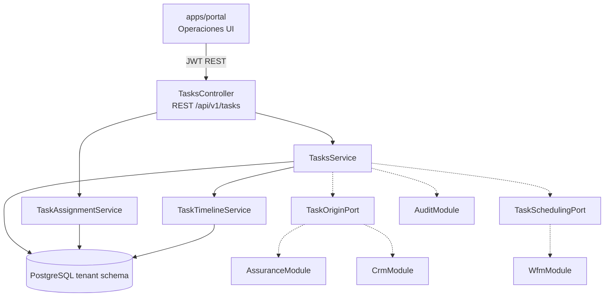

# HLD - MOD11 Ejecucion Operativa / Tareas

**Version:** 1.1  
**Estado:** En revision — baseline v1.0 aprobado; addendum v1.1 sujeto a ADR-068 (Aprobado)  
**Fecha:** 2026-07-27  
**Modo activo:** Architect  
**Autor:** AI-EM-ARCH  
**PRD de referencia:** docs/prds/PRD-MOD11-EJECUCION-OPERATIVA-TAREAS-v1.0.md  
**Spec de origen:** docs/specs/2026-06-22-mod11-operaciones-tareas-design.md  
**Spec UI complementario:** docs/specs/2026-06-23-mod11-crear-tarea-agenda-opcional-design.md  
**ADR aprobado:** docs/adrs/ADR-046-Bounded-Context-Tasks-Ejecucion-Operativa.md  
**ADR complementario aprobado:** docs/adrs/ADR-047-Separacion-Programacion-y-OT-Ejecucion.md

---

## 1. Contexto de negocio

MOD11 cubre la ejecucion operativa transversal del ISP: trabajo concreto originado por tickets, CRM, agenda, backoffice o procesos internos. Su objetivo es dar ownership claro al trabajo ejecutable sin absorber ticketing ni scheduling, y evolucionar hacia owner de la OT enriquecida de campo.

La Fase 01 prioriza valor estructural y operativo:

- una tarea con responsable activo;
- un destinatario explicito;
- agenda opcional;
- integracion por referencias logicas con MOD10 y MOD09;
- OT enriquecida separada de `Programacion` cuando la ejecucion ya esta comprometida.

---

## 2. Bounded contexts afectados

| Bounded context | Impacto | Regla |
| --- | --- | --- |
| `TasksModule` | Principal | Owner de tareas operativas, OT de ejecucion, timeline y handoff |
| `AssuranceModule` | Upstream/downstream | Puede originar tareas; sigue siendo owner de tickets, SLA y PQR |
| `WfmModule` | Downstream/upstream | Recibe o expone referencias de agenda; sigue siendo owner de scheduling |
| `CrmModule` | Upstream | Puede originar tareas de instalacion o backoffice, sin leer tablas MOD11 |
| `UsersModule` | Upstream | Provee responsables por ID logico y rol |
| `AuthModule` | Upstream | JWT, RBAC y actor autenticado |
| `TenantModule` | Upstream | TenantContext y schema routing |
| `AuditModule` | Transversal | Auditoria CUD y eventos sensibles |
| `apps/portal` | Consumer | UI visible de Operaciones |

### Boundary explicito

- MOD11 no consulta tablas de MOD10, MOD09 ni MOD05.
- MOD10 no es owner de tareas ejecutables transversales.
- MOD09 no reemplaza tareas con `WorkOrderTask`.
- MOD09 no es owner de la OT enriquecida de campo.
- Las referencias cross-module son IDs logicos y contratos tipados.

---

## 3. Componentes principales

### Backend

```text
apps/api/src/modules/tasks/
├── tasks.module.ts
├── tasks.controller.ts
├── dto/
│   ├── create-task.dto.ts
│   ├── update-task.dto.ts
│   ├── list-task-query.dto.ts
│   ├── assign-task.dto.ts
│   ├── transition-task.dto.ts
│   ├── link-schedule-event.dto.ts
│   └── link-work-order.dto.ts
├── services/
│   ├── tasks.service.ts
│   ├── task-timeline.service.ts
│   ├── task-assignment.service.ts
│   └── tasks-dashboard.service.ts
├── ports/
│   ├── task-origin.port.ts
│   └── task-scheduling.port.ts
├── execution-orders/
│   ├── execution-orders.module.ts
│   ├── execution-orders.controller.ts
│   ├── dto/
│   ├── services/
│   └── tests/
└── tests/
    ├── tasks.service.spec.ts
    ├── task-assignment.service.spec.ts
    └── tasks.controller.http.spec.ts
```

### Shared contracts

```text
packages/shared/src/enums/tasks/
├── task-type.enum.ts
├── task-status.enum.ts
├── task-priority.enum.ts
├── task-origin-context.enum.ts
├── task-recipient-type.enum.ts
├── task-responsible-type.enum.ts
└── task-execution-mode.enum.ts
```

### Database

```text
packages/database/src/entities/
├── operational-task.entity.ts
├── task-timeline-event.entity.ts
├── task-assignment-history.entity.ts
├── execution-order.entity.ts
├── execution-order-activity.entity.ts
├── execution-order-item-usage.entity.ts
└── execution-order-evidence.entity.ts

packages/database/src/migrations/tenant/
├── 045_create_tasks_module.ts
└── 046_create_execution_orders_module.ts
```

### Portal

```text
apps/portal/src/app/dashboard/operations/page.tsx
apps/portal/src/components/operations/
├── OperationsClient.tsx
├── TasksToolbar.tsx
├── TasksTable.tsx
├── TaskDetailDrawer.tsx
├── TaskForm.tsx
├── ExecutionOrderDrawer.tsx
├── ExecutionOrderFieldWorkStep.tsx
├── ExecutionOrderInventoryStep.tsx
├── ExecutionOrderCloseStep.tsx
├── TaskAssignmentHistory.tsx
└── TaskTimeline.tsx
```

---

## 4. Diagrama de arquitectura



---

## 5. Modelo de datos

Todas las entidades son tenant-aware y usan `SET LOCAL search_path`.

### `operational_tasks`

Indices minimos:

- `uq_operational_tasks_tenant_number`
- `idx_operational_tasks_tenant_status`
- `idx_operational_tasks_tenant_responsible`
- `idx_operational_tasks_tenant_recipient`
- `idx_operational_tasks_tenant_origin`
- `idx_operational_tasks_tenant_due_at`

### `execution_orders`

Entidad owner de ejecucion de campo.

Indices minimos:

- `uq_execution_orders_tenant_number`
- `idx_execution_orders_tenant_status`
- `idx_execution_orders_tenant_schedule_event`
- `idx_execution_orders_tenant_assigned_technician`

### `execution_order_item_usage`

Registra el consumo o instalacion de items desde custodia del tecnico/cuadrilla.

Campos minimos esperados:

- `execution_order_id`
- `item_id`
- `technician_custody_id`
- `quantity`
- `serial_number`
- `action`
- `final_disposition`
- `stock_movement_id`

### `task_timeline_events`

Append-only. No editable desde API funcional.

### `task_assignment_history`

Historial de handoff. Debe registrar responsable previo, nuevo, actor y motivo.

---

## 6. Reglas de negocio

1. Una tarea tiene un solo responsable activo.
2. Una tarea puede reasignarse multiples veces, siempre con historial.
3. El destinatario no es intercambiable con el responsable.
4. Una tarea puede existir sin ticket.
5. Una tarea puede existir sin agenda.
6. `schedule_event_id` y `work_order_id` son referencias logicas, no FKs cross-module.
7. El cierre de una tarea no cierra automaticamente el ticket origen salvo regla explicita del modulo origen.
8. `WorkOrderTask` sigue siendo interno a una OT y no sustituye `Task`.

---

## 7. Contratos REST

Base path: `/api/v1/tasks`.

| Metodo | Ruta | Servicio |
| --- | --- | --- |
| GET | `/tasks` | `TasksService.list()` |
| POST | `/tasks` | `TasksService.create()` |
| GET | `/tasks/:id` | `TasksService.getById()` |
| PATCH | `/tasks/:id` | `TasksService.update()` |
| POST | `/tasks/:id/assign` | `TaskAssignmentService.assign()` |
| POST | `/tasks/:id/transition` | `TasksService.transitionStatus()` |
| POST | `/tasks/:id/link-schedule-event` | `TasksService.linkScheduleEvent()` |
| POST | `/tasks/:id/link-work-order` | `TasksService.linkWorkOrder()` |

---

## 8. Seguridad y privacidad

- Controllers protegidos con `JwtAuthGuard` y `RolesGuard`.
- `@Roles()` usa `UserRole.*`.
- Zod en create, update, list, assign, transition y links.
- No almacenar PII sensible del cliente; usar referencia logica y label operativo minimo.
- Ownership estricto para tecnico y contratista.
- Logs sin descripcion sensible ni contenido libre del destinatario.

---

## 9. Frontend

La UI visible debe llamarse **Operaciones**.

Patrones:

- server page en `app/dashboard/operations/page.tsx`;
- client orchestrator `OperationsClient.tsx`;
- tabla densa como vista principal;
- drawer para detalle, timeline y handoff;
- textos visibles en espanol;
- sin enums crudos.

Para la superficie `Programacion`, el flujo objetivo deja de ser event-first y pasa a ser task-first:

- el modal crea primero `Task`;
- la agenda solo aparece cuando `executionMode` lo exige;
- la captura mantiene `responsable` y `destinatario` separados;
- la OT y el `Ticket` automatico se resuelven como continuidad operativa, no como campos nucleares del primer paso.

---

## 10. Testing y validacion

### Backend

- unit tests para creacion, reasignacion y transiciones;
- unit tests para ownership de tecnico/contratista;
- integration tenant-aware para aislamiento por schema;
- controller tests con RBAC y validaciones Zod.

### Frontend

- tests de labels y filtros;
- tests de formulario y reasignacion;
- tests de drawer e historial.

### E2E

- crear tarea manual;
- crear tarea desde ticket;
- reasignar responsable;
- vincular agenda existente;
- cerrar tarea.

---

## 11. Observabilidad y auditoria

- timeline append-only por tarea;
- historial de handoff;
- eventos sugeridos: `tasks.task-created`, `tasks.task-assigned`, `tasks.task-reassigned`, `tasks.task-scheduled`, `tasks.task-resolved`;
- integracion con AuditModule para CUD.

---

## 12. Riesgos tecnicos

| Riesgo | Impacto | Mitigacion |
| --- | --- | --- |
| Boundary duplicado con MOD10 | Alto | Mantener ticket como intake y task como ejecucion |
| Boundary duplicado con MOD09 | Alto | Mantener agenda/OT en WFM y `WorkOrderTask` como subtarea tecnica |
| Modelo demasiado generico | Medio | Usar `OperationalTask` y no una entidad `Task` sin contexto |
| PRD maestro sin MOD11 | Medio | Actualizar solo tras decision CTO |

---

## 13. Addendum 2026-07-27 — agregado ExecutionOrder e integracion

Este addendum supera cualquier frase anterior que mantenga la OT ejecutable en WFM. MOD09 conserva agenda y compatibilidad ligera; MOD11 conserva la OT enriquecida.

MOD11 es owner del agregado `ExecutionOrder`, incluyendo plantilla aplicada, estado/version, asignacion, actividades, evidencia, consumo referenciado, resultado y cierre.

La arquitectura objetivo agrega:

- permisos de capacidad y política de asignación/alcance;
- control optimista e idempotencia por comando;
- outbox dentro de la misma transacción tenant que cambia la OT;
- publicación tenant-aware y consumidores idempotentes;
- plantillas publicadas inmutables con snapshot por OT;
- evaluación determinista del gate de cierre;
- terminales append-only e inmutables;
- seguimiento mediante nueva OT vinculada;
- referencia a movimientos confirmados por MOD12, nunca escritura directa de inventario;
- reconciliador de OT, proyecciones y movimientos pendientes.

Persistencia minima:

- constraint único `(tenant_id, schedule_event_id)` y retry de colisión;
- `version` monotona para `If-Match`;
- numerador OT con constraint/retry o asignador transaccional;
- `followUpOfExecutionOrderId`/`supersedesExecutionOrderId` sin FK cross-module;
- snapshot de plantilla y requisitos aplicados;
- outbox owner, inbox/procesados por consumidor e idempotency record con hash;
- settlement de inventario append-only y estado derivado de conciliacion;
- evidencia con media ref, hash y metadata minimizada;
- índices tenant-aware para outbox pendiente, idempotencia, seguimiento y conciliacion;
- retención/limpieza aprobada para outbox, inbox e idempotency records.

El relay vive en `apps/worker`, enumera tenants activos desde `public`, usa lease y marca publicado despues del enqueue. El crash commit→enqueue deja la fila pendiente; enqueue→mark puede duplicar y el inbox neutraliza el efecto. DLQ/re-drive son auditados.

El endpoint actual `/api/v1/tasks/execution-orders` conserva compatibilidad durante la transición. El OpenAPI debe documentar version esperada, idempotencia, permisos y errores 403/404/409/422.

Toda evidencia conserva hash y metadata autorizada; URLs y payloads sensibles no se registran. La suficiencia jurídica de firma, consentimiento y geolocalización queda sujeta a concepto Legal/Regulatorio.

**ADR requerido:** `docs/adrs/ADR-068-Sincronizacion-OT-Ejecucion-Proyecciones-Operativas.md` (Aprobado).
