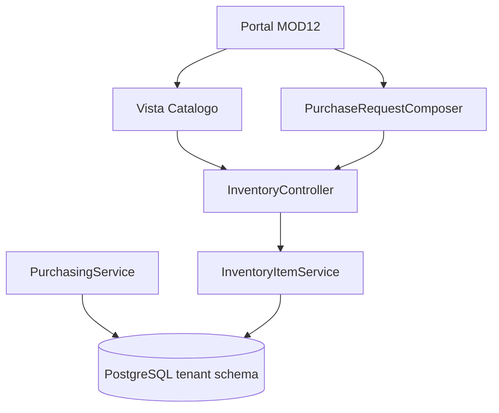

# HLD - MOD12 Catalogo Maestro de Articulos

**Version:** 1.0  
**Fecha:** 2026-06-25  
**Estado:** Aprobado  
**Modo activo:** Architect  
**Responsable:** AI-EM-ARCH  
**Aprobado por:** CTO  
**Modulo base:** MOD12 Inventario / SCM
**Addendum vigente:** docs/specs/2026-06-30-mod12-catalogo-productos-categorias-design.md

---

## 1. Contexto de negocio

Compras necesita un origen de productos consistente y operativo. Hoy MOD12 ya usa `inventory_items`, pero el maestro no alcanza para compra real ni para una experiencia rica de catalogo. La solucion es refinar el item master fisico de MOD12 y exponerlo como Catalogo Maestro de Articulos, sin sacar ownership hacia Comercial y sin crear un nuevo BC.

## 2. Boundaries afectados

| Contexto | Relacion | Regla |
| --- | --- | --- |
| MOD12 InventoryScm | Owner | Item master fisico, catalogo operativo, compras, stock y lifecycle |
| MOD08 Parties | Upstream | Proveedor preferido por referencia logica |
| MOD06 Commercial | Referencia eventual | `commercialReferenceId` solo informativo |
| MOD11 Tasks | Consumer indirecto | Sigue consumiendo movimientos, no elige ownership del catalogo |

No se propone nuevo bounded context ni nuevo ADR.

## 3. Componentes principales

### Backend

```text
apps/api/src/modules/inventory/
├── inventory.controller.ts
├── dto/index.ts
├── services/
│   ├── inventory-item.service.ts
│   └── inventory-dashboard.service.ts
└── tests/
    ├── inventory.controller.http.spec.ts
    └── inventory-item.service.spec.ts

packages/database/src/entities/
└── inventory-item.entity.ts
```

### Frontend

```text
apps/portal/src/components/inventory/
├── InventoryClient.tsx
├── InventoryItemsTable.tsx
├── PurchaseRequestComposer.tsx
├── InventoryCatalogFilters.tsx
├── InventoryCatalogDrawer.tsx
└── InventoryCatalogSummary.tsx
```

## 4. Modelo de datos

### Tabla refinada

- `inventory_items`

### Nuevos indices minimos sugeridos

- `(tenant_id, status, purchasable)`
- `(tenant_id, item_kind, status)`
- indice funcional o estrategia equivalente para busqueda por `sku` y `name`
- `(tenant_id, preferred_supplier_ref_id)`

### Migracion

Reservar `051_expand_inventory_item_master_catalog.ts`.

La migracion debe:

- agregar columnas nuevas con defaults seguros;
- backfillear `purchasable`, `inventory_controlled` y `asset_controlled` con reglas conservadoras;
- preservar rollback reversible.

## 5. Arquitectura de flujo



### Flujo principal

1. El usuario administra el maestro desde `Catalogo`.
2. El backend persiste y valida coherencia del item.
3. Compras consulta opciones optimizadas del catalogo.
4. El selector de lineas usa solo articulos activos y comprables.
5. La linea de solicitud puede heredar unidad y proveedor sugerido.

## 6. Contratos internos

### `InventoryItemService`

Debe ampliarse para soportar:

- `list(query)` con `search` y `purchasable`
- `getById(id)`
- `create(input)` con campos extendidos
- `update(id, input)`
- `listCatalogOptions(query)` para selector de compras

### DTOs

El schema de item debe incorporar:

- campos nuevos del maestro;
- validaciones cruzadas entre flags y tracking;
- query params para busqueda y filtros.

## 7. UI objetivo

### Pestañas o superficies

- `Resumen`: puede seguir mostrando la tabla compacta actual
- `Catalogo`: nueva vista dedicada de maestro
- `Compras`: sigue usando el maestro como origen

### Drawer de catalogo

Secciones:

- general,
- compras,
- inventario,
- activos,
- relacion comercial.

### Selector en compras

El selector debe mostrar al menos:

- SKU
- nombre
- etiqueta de tipo o categoria
- ayuda contextual de proveedor y UoM si existe

## 8. Testing

### Backend

- pruebas unitarias de validacion cruzada de item master;
- pruebas de listados con filtros y busqueda;
- pruebas HTTP para create, update y catalog options.

### Frontend

- tests de tabla, filtros y drawer de catalogo;
- tests de `PurchaseRequestComposer` consumiendo opciones filtradas;
- tests de autocompletado de unidad y proveedor sugerido.

### E2E

- alta de articulo comprable;
- busqueda y filtrado en catalogo;
- seleccion del articulo nuevo en solicitud de compra.

## 9. Observabilidad

Eventos sugeridos:

- `inventory.item-created`
- `inventory.item-updated`
- `inventory.catalog-option-requested`

Logs:

- `tenantId`
- `inventoryItemId`
- `actorUserId`
- `operation`

## 10. Riesgos tecnicos

| Riesgo | Impacto | Mitigacion |
| --- | --- | --- |
| Backfill agresivo de flags compra/inventario | Alto | Defaults conservadores y validacion manual de datos criticos |
| Selectores UI acoplados al contrato viejo | Medio | Agregar contrato nuevo antes de reemplazar componentes |
| Sobrecargar `inventory_items` con logica de procurement profunda | Medio | Limitar Fase 01 a atributos esenciales |
| Ambiguedad entre tipo de articulo y categoria actual | Medio | Mantener ambos conceptos y documentar su uso |

---

## 11. Addendum 2026-06-30 - Categorias administrables

**Estado:** Propuesto  
**Modo activo:** Mixto  
**Spec fuente:** docs/specs/2026-06-30-mod12-catalogo-productos-categorias-design.md

La Fase 02 propuesta refina la superficie `Inventario > Catalogo` para hacer explicito que el usuario administra **productos** y **categorias** dentro del mismo maestro operativo de MOD12.

### Decision

- `inventory_items` sigue siendo la entidad de producto operativo.
- Se introduce `inventory_categories` como entidad tenant-aware administrable.
- Cada producto debe pertenecer obligatoriamente a una categoria.
- La categoria enum historica se mantiene solo como compatibilidad durante la migracion.
- Subcategorias quedan fuera de esta fase.

### Impacto en componentes

Backend:

- agregar entidad `InventoryCategory`;
- agregar servicio de categorias dentro de `apps/api/src/modules/inventory`;
- exponer rutas `/inventory/categories`;
- extender contratos de productos con `categoryId`, `categoryName` y `categoryCode`;
- agregar migracion tenant `052_create_inventory_categories.ts`.

Frontend:

- mantener `Inventario > Catalogo` como superficie maestra;
- dividir internamente la vista en `Productos` y `Categorias`;
- reemplazar selector enum por selector dinamico de categorias activas;
- permitir crear y editar categorias sin abrir un modulo paralelo.

### Decision documental

No se requiere ADR nuevo en esta fase porque no cambia el boundary aprobado por ADR-048 ni introduce stack o patron transversal nuevo. Si una fase posterior elimina fisicamente el campo enum historico, se debe revisar nuevamente el impacto de migracion y compatibilidad.
