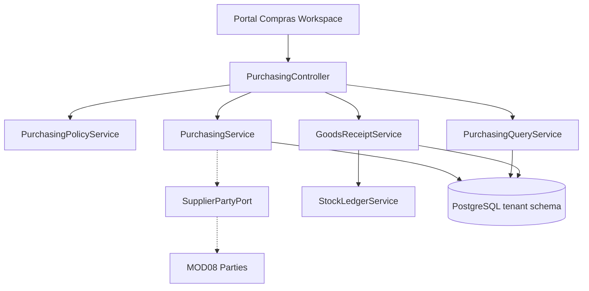

# HLD - MOD12 Compras Workspace Hibrido

**Version:** 1.0  
**Fecha:** 2026-06-25  
**Estado:** Aprobado  
**Modo activo:** Architect  
**Responsable:** AI-EM-ARCH  
**Aprobado por:** CTO  
**Modulo base:** MOD12 Inventario / SCM

---

## 1. Contexto de negocio

Compras necesita pasar de un flujo minimo a una mesa de trabajo que soporte reposicion, urgencias, proyectos y compras libres sin salir de MOD12. La solucion debe enriquecer el subdominio de Compras manteniendo a Inventario como owner de recepcion, stock, lotes, seriales y ledger.

## 2. Boundaries afectados

| Contexto | Relacion | Regla |
| --- | --- | --- |
| MOD12 InventoryScm | Owner | Compra, OC, recepcion y trazabilidad de abastecimiento |
| MOD08 Parties | Upstream | Maestro de proveedores y resumen de tercero |
| MOD06 Commercial | Referencia eventual | No entra como origen principal de lineas |
| MOD11 Tasks | Consumer indirecto | Sin cambios de ownership; solo usa inventario para movimientos |

No se propone nuevo bounded context ni nuevo ADR.

## 3. Componentes principales

### Backend

```text
apps/api/src/modules/inventory/
├── purchasing.controller.ts
├── dto/index.ts
├── services/
│   ├── purchasing.service.ts
│   ├── goods-receipt.service.ts
│   ├── purchasing-policy.service.ts
│   └── purchasing-query.service.ts
├── ports/
│   └── supplier-party.port.ts
└── tests/
    ├── purchasing.service.spec.ts
    ├── purchasing.http.integration.spec.ts
    └── purchasing.flow.integration.spec.ts
```

### Frontend

```text
apps/portal/src/components/inventory/
├── PurchaseWorkspaceSummary.tsx
├── PurchaseRequestsTable.tsx
├── PurchaseRequestWorkbenchDrawer.tsx
├── PurchaseRequestComposer.tsx
├── SupplierSummaryCard.tsx
├── QuoteComparisonPanel.tsx
├── PurchaseOrderDrawer.tsx
└── GoodsReceiptPanel.tsx
```

## 4. Modelo de datos

### Tablas nuevas

- `purchase_request_lines`
- `purchase_request_line_awards`

### Tablas refinadas

- `purchase_requests`
- `supplier_quotes`
- `purchase_order_lines`
- `goods_receipts`

### Indices minimos

- `purchase_requests`: `(tenant_id, status)`, `(tenant_id, request_type, priority)`, `(tenant_id, needed_by_date)`.
- `purchase_request_lines`: `(tenant_id, purchase_request_id)`, `(tenant_id, line_status)`, `(tenant_id, inventory_item_id)`.
- `purchase_request_line_awards`: `(tenant_id, purchase_request_line_id)`, `(tenant_id, awarded_party_ref_id)`.
- `supplier_quotes`: `(tenant_id, purchase_request_id, party_ref_id)`, `(tenant_id, valid_until)`.
- `purchase_order_lines`: `(tenant_id, purchase_order_id)`, `(tenant_id, purchase_request_line_id)`.

## 5. Arquitectura de flujo



## 6. Contratos internos

### `SupplierPartyPort`

Debe exponer al menos:

- `getSupplierSummary(partyRefId)`
- `searchSuppliers(query, page)`

La respuesta minima debe incluir:

- `partyRefId`
- `displayName`
- `primaryContact`
- `phone`
- `email`
- `city`
- `status`

La ficha ampliada para scoring queda preparada, pero fuera de esta fase.

## 7. Politica de aprobacion

Se recomienda un servicio dedicado `PurchasingPolicyService` para evitar reglas hardcodeadas en controller o UI.

Entradas minimas:

- tipo de solicitud,
- monto estimado,
- existe cotizacion,
- bandera de excepcion,
- motivo de excepcion.

Salidas minimas:

- `canApprove`
- `requiresException`
- `blockingReason`
- `approvalLevel`

## 8. UI objetivo

### Workspace

- resumen KPI arriba,
- filtros rapidos por etapa y tipo,
- tabla densa central,
- drawer lateral para trabajar solicitud.

### Drawer de trabajo

Secciones:

- resumen,
- lineas,
- cotizaciones,
- aprobaciones,
- OCs,
- recepciones,
- trazabilidad.

### Estados visuales requeridos

- pendiente de cotizacion,
- pendiente de aprobacion,
- lista para OC,
- ordenada,
- recepcion parcial,
- recibida,
- cancelada,
- con excepcion.

## 9. Testing

### Backend

- pruebas unitarias de politica tipo + monto;
- pruebas unitarias de creacion con lineas mixtas;
- pruebas de adjudicacion por linea;
- pruebas de recepcion parcial con faltantes;
- pruebas HTTP de filtros y detalle;
- pruebas tenant-aware con migracion nueva.

### Frontend

- tests de KPIs y filtros;
- tests de composer de solicitud;
- tests del drawer de trabajo;
- tests de proveedor seleccionado y ficha resumida;
- tests de gating por estado.

### E2E

- solicitud de reposicion con item de inventario;
- solicitud urgente con excepcion justificada;
- solicitud de proyecto con varias lineas;
- generacion de OC y recepcion parcial;
- consulta posterior en trazabilidad.

## 10. Observabilidad

Eventos sugeridos:

- `purchasing.request-created`
- `purchasing.quote-added`
- `purchasing.exception-approved`
- `purchasing.order-generated`
- `purchasing.receipt-recorded`
- `purchasing.receipt-discrepancy-detected`

Logs:

- `tenantId`
- `purchaseRequestId`
- `purchaseRequestLineId`
- `purchaseOrderId`
- `goodsReceiptId`
- `partyRefId`
- `actorUserId`

## 11. Riesgos tecnicos

| Riesgo | Impacto | Mitigacion |
| --- | --- | --- |
| Reglas mezcladas entre UI y backend | Alto | Centralizar en `PurchasingPolicyService` |
| Split de lineas hacia varias OCs | Medio | Modelar `purchase_request_line_awards` desde el inicio |
| Recepcion parcial inconsistente | Alto | Actualizar stock solo por cantidades recibidas |
| Dependencia fragil de proveedor | Medio | Puerto tipado y snapshot minimo controlado |
| Sobrecrecimiento de UX | Medio | Mantener tablero operativo, no suite de procurement completa |
