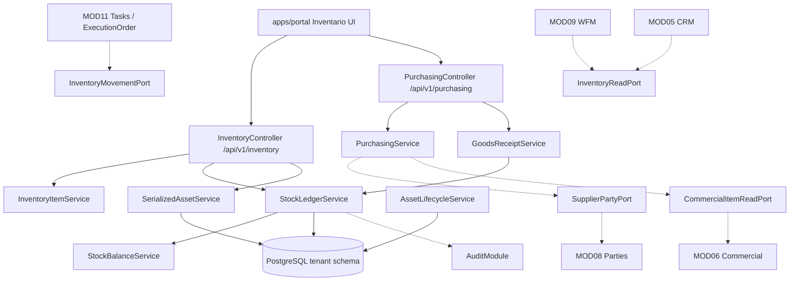

# HLD - MOD12 Inventario / SCM

**Version:** 1.0  
**Estado:** Aprobado  
**Fecha:** 2026-06-25  
**Modo activo:** Architect  
**Autor:** AI-EM-ARCH  
**Aprobado por:** CTO  
**PRD de referencia:** docs/prds/PRD-MOD12-INVENTARIO-SCM-v1.0.md  
**ADR relacionado:** docs/adrs/ADR-048-Bounded-Context-Inventario-SCM-Ciclo-Vida-Productos.md  
**Prompt de ejecucion:** docs/prompts/PROMPT-MOD12-INVENTARIO-SCM-FASE-01-v1.0.md

---

## 1. Contexto de negocio

MOD12 Inventario / SCM centraliza el control fisico-operativo de productos, materiales y activos del ISP. El modulo conecta compras, recepcion, bodegas, tecnicos, clientes, comodatos, vida util y bajas sin absorber agenda, OT, facturacion ni CRM.

El objetivo tecnico de Fase 01 es crear una fuente de verdad tenant-aware para:

- stock y saldos;
- seriales y MAC;
- ubicacion y responsable actual;
- movimientos inmutables;
- compras y recepciones;
- comodato y vida util operativa;
- salidas por venta, consumo interno, OT, retorno y baja.

## 2. Bounded contexts afectados

| Bounded context | Relacion | Regla |
| --- | --- | --- |
| `InventoryScmModule` | Principal | Owner de stock, seriales, compras, movimientos y vida util |
| `TasksModule` / MOD11 | Consumer / producer | Solicita movimientos desde OT y guarda `stockMovementId` |
| `WfmModule` / MOD09 | Consumer | Consulta disponibilidad; no captura materiales |
| `CommercialModule` / MOD06 | Upstream | Define producto comercial y `requiresInventory`; no mueve stock |
| `PartiesModule` / MOD08 | Upstream | Maestro de proveedores y terceros |
| `CrmModule` / MOD05 | Consumer | Consulta activos del cliente por puerto |
| Billing / ERP futuro | Consumer | Recibe eventos de venta, baja, costo o depreciacion futura |
| `AuditModule` | Transversal | Auditoria de CUD, ajustes, bajas y aprobaciones |

### Boundary explicito

- MOD12 no lee tablas de CRM, MOD11, MOD09, MOD06, MOD08 ni Billing.
- MOD11 no escribe stock ni balance; solo invoca puerto de Inventario.
- Las referencias externas son IDs logicos y contratos tipados.
- Dentro de MOD12 si se permiten FKs entre entidades propias.

## 3. Componentes principales

### Backend

```text
apps/api/src/modules/inventory/
├── inventory.module.ts
├── inventory.controller.ts
├── purchasing.controller.ts
├── dto/
│   ├── create-inventory-item.dto.ts
│   ├── create-stock-location.dto.ts
│   ├── create-purchase-request.dto.ts
│   ├── create-supplier-quote.dto.ts
│   ├── approve-purchase-request.dto.ts
│   ├── create-purchase-order.dto.ts
│   ├── receive-purchase-order.dto.ts
│   ├── transfer-stock.dto.ts
│   ├── execution-order-movement.dto.ts
│   ├── sale-movement.dto.ts
│   ├── internal-consumption.dto.ts
│   ├── return-asset.dto.ts
│   └── write-off-asset.dto.ts
├── services/
│   ├── inventory-item.service.ts
│   ├── stock-location.service.ts
│   ├── stock-ledger.service.ts
│   ├── stock-balance.service.ts
│   ├── serialized-asset.service.ts
│   ├── purchasing.service.ts
│   ├── goods-receipt.service.ts
│   ├── asset-lifecycle.service.ts
│   └── inventory-dashboard.service.ts
├── ports/
│   ├── inventory-movement.port.ts
│   ├── inventory-read.port.ts
│   ├── stock-availability.port.ts
│   ├── supplier-party.port.ts
│   └── commercial-item-read.port.ts
└── tests/
```

### Shared contracts

```text
packages/shared/src/enums/inventory/
├── inventory-item-category.enum.ts
├── inventory-tracking-mode.enum.ts
├── stock-location-type.enum.ts
├── stock-movement-origin.enum.ts
├── serialized-asset-status.enum.ts
├── asset-lifecycle-event-type.enum.ts
├── purchase-request-status.enum.ts
├── purchase-order-status.enum.ts
├── goods-receipt-status.enum.ts
└── write-off-reason.enum.ts
```

### Database

```text
packages/database/src/entities/
├── inventory-item.entity.ts
├── stock-location.entity.ts
├── stock-balance.entity.ts
├── stock-lot.entity.ts
├── serialized-asset.entity.ts
├── stock-movement.entity.ts
├── stock-movement-line.entity.ts
├── purchase-request.entity.ts
├── supplier-quote.entity.ts
├── purchase-order.entity.ts
├── purchase-order-line.entity.ts
├── goods-receipt.entity.ts
├── goods-receipt-line.entity.ts
├── asset-lifecycle-event.entity.ts
├── asset-loan-assignment.entity.ts
└── inventory-write-off.entity.ts

packages/database/src/migrations/tenant/
└── 047_create_inventory_scm_module.ts
```

### Portal

```text
apps/portal/src/app/dashboard/inventory/page.tsx
apps/portal/src/components/inventory/
├── InventoryClient.tsx
├── InventoryDashboard.tsx
├── InventoryItemsTable.tsx
├── PurchaseDesk.tsx
├── PurchaseOrderDrawer.tsx
├── GoodsReceiptPanel.tsx
├── StockLocationsMatrix.tsx
├── StockTransferDialog.tsx
├── SerializedAssetDetailDrawer.tsx
├── TechnicianCustodyPanel.tsx
├── AssetLifecycleTimeline.tsx
└── WriteOffApprovalPanel.tsx
```

## 4. Diagrama de arquitectura



## 5. Modelo de datos e indices

### Indices minimos

- `inventory_items`: unique `(tenant_id, sku)`, index `(tenant_id, category, status)`.
- `stock_locations`: index `(tenant_id, type, status)`, unique parcial para bodega movil activa por responsable.
- `stock_balances`: unique `(tenant_id, item_id, location_id, lot_id, condition)`, index `(tenant_id, location_id, item_id)`.
- `serialized_assets`: unique `(tenant_id, normalized_serial_number)` cuando no sea null, unique `(tenant_id, normalized_mac_address)` cuando no sea null, index por estado, ubicacion y responsable.
- `stock_movements`: unique `(tenant_id, idempotency_key)`, index `(tenant_id, created_at)`, index `(tenant_id, origin_context, origin_ref_id)`.
- `purchase_orders`: unique `(tenant_id, order_number)`, index por proveedor, estado y fecha esperada.
- `goods_receipts`: index por OC y fecha.

### Integridad

- Movimientos y balance se actualizan en una unica transaccion.
- `stock_movements` y `stock_movement_lines` son append-only.
- Para errores, crear movimiento reverso o ajuste aprobado.
- Seriales se bloquean por transaccion antes de transferir, instalar, vender, retornar o dar de baja.

## 6. Maquina de estados de activo serializado

| Estado actual | Trigger | Siguiente estado |
| --- | --- | --- |
| `ORDERED` | OC aprobada | `IN_RECEIVING` |
| `IN_RECEIVING` | Recepcion conforme | `AVAILABLE` |
| `AVAILABLE` | Transferencia a tecnico | `ASSIGNED_TO_TECHNICIAN` |
| `ASSIGNED_TO_TECHNICIAN` | Instalacion en OT | `INSTALLED_COMODATO` |
| `AVAILABLE` | Venta directa | `SOLD` |
| `AVAILABLE` | Consumo interno | `INTERNAL_CONSUMED` |
| `INSTALLED_COMODATO` | Churn/retiro | `IN_TRANSIT` |
| `IN_TRANSIT` | Recepcion bodega | `IN_TESTING` |
| `IN_TESTING` | Aprobacion control calidad | `AVAILABLE_REFURBISHED` |
| `IN_TESTING` | Requiere reparacion | `IN_REPAIR` |
| `IN_REPAIR` | Reparacion exitosa | `AVAILABLE_REFURBISHED` |
| `IN_TESTING` | Irrecuperable | `WRITTEN_OFF` |
| Cualquier no terminal | Perdida/robo aprobado | `LOST` |

Estados terminales: `SOLD`, `INTERNAL_CONSUMED`, `WRITTEN_OFF`, `LOST`.

## 7. Transacciones criticas

### Recepcion contra OC

1. Validar OC aprobada.
2. Crear `goods_receipt`.
3. Crear `stock_lot`.
4. Crear seriales cuando `trackingMode` lo exige.
5. Crear `stock_movement` `PURCHASE_RECEIPT`.
6. Actualizar `stock_balances`.
7. Emitir `ItemsReceived`.

### Transferencia bodega a tecnico

1. Validar saldo disponible o serial disponible.
2. Validar tope de bodega movil si existe.
3. Crear movimiento `TRANSFER`.
4. Actualizar saldos origen/destino.
5. Cambiar responsable actual del serial.
6. Registrar evento de ciclo de vida.

### Instalacion en comodato desde OT

1. MOD11 invoca `InventoryMovementPort.consumeFromExecutionOrder`.
2. MOD12 valida idempotency key.
3. MOD12 valida custodia tecnica.
4. MOD12 mueve consumibles a consumo o serial a cliente.
5. MOD12 crea `asset_loan_assignment`.
6. MOD12 devuelve `stockMovementId`.
7. MOD11 guarda `execution_order_item_usage.stockMovementId`.

### Venta directa

1. Validar referencia comercial.
2. Validar disponibilidad.
3. Crear movimiento `SALE`.
4. Marcar serial como `SOLD`.
5. Emitir `AssetSold`.

### Baja

1. Crear solicitud con motivo y evidencia.
2. Validar rol/permisos.
3. Aprobar segun regla de monto/categoria.
4. Crear movimiento `WRITE_OFF`.
5. Marcar activo `WRITTEN_OFF` o `LOST`.
6. Emitir `AssetWrittenOff`.

## 8. Seguridad y auditoria

- Controllers protegidos con `JwtAuthGuard` y `RolesGuard`.
- `@Roles()` usa `UserRole.*`.
- Permisos base: `inventory.stock.read`, `inventory.stock.manage`.
- Agregar permisos granulares si la fase lo requiere: compras, bajas, auditoria.
- Zod en todos los DTOs HTTP.
- No almacenar PII sensible; `subscriberRefId`, `contractRefId` y labels operativos minimos.
- Audit trail para compras, recepciones, transferencias, ventas, consumo interno, ajustes, retornos y bajas.

## 9. Frontend

La UI visible debe llamarse **Inventario**.

Patrones:

- pagina server en `app/dashboard/inventory/page.tsx`;
- orquestador cliente `InventoryClient.tsx`;
- dashboard denso con KPIs operativos;
- pestañas o segmentacion por `Resumen`, `Compras`, `Bodegas`, `Activos`, `Movimientos`, `Bajas`;
- drawers para OC, activo 360 y movimiento;
- formularios en espanol, sentence case;
- no renderizar enums crudos.

## 10. Testing y validacion

### Backend

- Unit tests de state machine, ledger, balance y seriales.
- Unit tests de compras: solicitud, cotizacion, aprobacion, OC y recepcion.
- Integration tests tenant-aware para recepcion, transferencia, instalacion y baja.
- Contract tests MOD11 -> Inventario con idempotencia.
- Controller tests de RBAC y validaciones Zod.

### Frontend

- Tests de labels, filtros, dashboard y formularios.
- Tests de recepcion con seriales.
- Tests de transferencia a tecnico.
- Tests de ficha de activo.

### E2E

- Crear solicitud, cotizacion, OC y recepcion.
- Transferir activo a tecnico.
- Consultar activo y stock desde la UI propia de Inventario.
- Retornar activo y clasificarlo.
- Dar de baja activo con aprobacion.

### E2E cross-module futuro

- Instalar en cliente desde MOD11 / Operaciones y verificar reflejo en Inventario.
- Confirmar `stockMovementId` persistido en la OT y movimiento reflejado en MOD12.

## 11. Observabilidad

Eventos sugeridos:

- `inventory.items-received`
- `inventory.stock-low`
- `inventory.asset-assigned-to-technician`
- `inventory.asset-installed-in-comodato`
- `inventory.asset-sold`
- `inventory.asset-returned`
- `inventory.asset-written-off`

Logs:

- incluir `tenantId`, `movementId`, `originContext`, `originRefId`, `actorUserId`;
- excluir PII, descripcion libre sensible y payloads completos.

## 12. Riesgos tecnicos

| Riesgo | Impacto | Mitigacion |
| --- | --- | --- |
| Doble fuente de verdad con MOD11 | Alto | MOD11 solo guarda referencia `stockMovementId` |
| Carreras de saldo | Alto | Transacciones y locks por balance/serial |
| Enums rigidos | Medio | Usar enums compartidos solo para estados estables; revisar text+check si evolucion esperada |
| PII en comodato | Alto | Referencias logicas y labels minimos |
| Compras sobrecrece | Medio | Dejar scoring, contratos marco y portal proveedor fuera de fase 1 |
