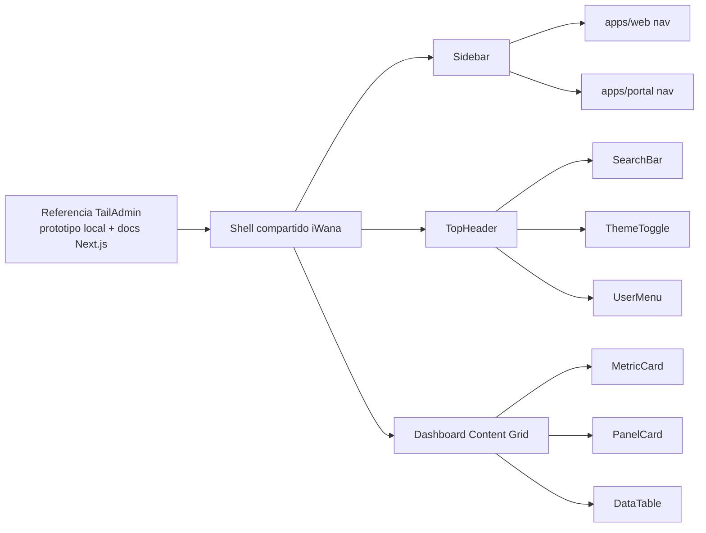

# HLD — Adopcion Transversal de TailAdmin para Dashboard Shell

**Version:** 1.0
**Estado:** En revision
**Fecha:** 2026-03-13
**Modo activo:** Architect
**Autor:** AI-EM-ARCH
**PRD de referencia:** `docs/prds/PRD_Sistema_ISP_Colombia_v2_2.md`
**Stack tecnologico:** `docs/prds/Stack_Tecnologico.md`
**ADR principal:** `docs/adrs/ADR-023-Referencia-TailAdmin-Shell-Dashboard.md`
**Politica de ejecucion:** `docs/adrs/ADR-022-Politica-Ejecucion-Modular-Por-Fases.md`
**Prompt arquitectonico origen:** `docs/prompts/PROMPT-ARCHITECT-TRANSVERSAL-ADOPCION-TAILADMIN.md`

---

## 1. Objetivo

Definir la arquitectura de alto nivel para adaptar el shell de dashboard de iWana neXt a la referencia de TailAdmin sin cambiar el stack aprobado y sin copiar codigo HTML + Alpine.js del prototipo local.

El resultado esperado es un shell consistente y reutilizable para `apps/web` y `apps/portal`, con identidad iWana, comportamiento responsive real y gobernanza documental trazable.

---

## 2. Alcance

### IN

- Shell de dashboard compartido entre `apps/web` y `apps/portal`
- Sidebar colapsable en desktop y drawer en mobile
- TopHeader sticky con buscador, dark mode, notificaciones y menu de usuario
- Primitivas de cards y paneles necesarias para dashboards iniciales
- Mapeo entre referencia TailAdmin y design system actual

### OUT

- Portal publico externo
- Nuevos modulos de negocio
- Integracion de charts productivos con datos reales
- Cambio de stack o migracion a repo oficial de TailAdmin

---

## 3. Drivers y restricciones

1. El PRD del sistema exige dashboards multirol y portal suscriptor dentro del stack vigente.
2. La identidad visual iWana ya fue definida y no debe reemplazarse por la marca default de TailAdmin.
3. El proyecto usa Tailwind 4 CSS-first; no se debe asumir `tailwind.config.js` como eje de customizacion.
4. `apps/web` y `apps/portal` deben compartir patron de shell y diferir solo en contenido de negocio.
5. Cualquier cambio transversal de patron debe conservar App Router, accesibilidad y mantenibilidad.

---

## 4. Arquitectura objetivo

### 4.1 Shell compartido

El shell se compone de una carcasa reutilizable con estos estados principales:

- `sidebarDesktopCollapsed`
- `sidebarMobileOpen`
- `theme`
- `userMenuOpen`

La recomendacion arquitectonica es desacoplar estado y presentacion:

- presentacion compartida en componentes reutilizables,
- adaptadores por app para nav items, labels y acciones de negocio.

### 4.2 Distribucion propuesta

| Capa | Responsabilidad | Ubicacion objetivo |
| --- | --- | --- |
| Shell compartido | layout, header, sidebar, toggles, menus | `packages/ui` o capa compartida equivalente |
| Adaptador admin | items, breadcrumbs, acciones de plataforma | `apps/web/src/components/layout/` |
| Adaptador portal | items, labels y contexto del suscriptor | `apps/portal/src/components/layout/` |
| Widgets admin | metricas, tablas, paneles | `apps/web/src/components/dashboard/` |
| Widgets portal | plan, facturacion, soporte, perfil | `apps/portal/src/components/dashboard/` |

---

## 5. Mapeo de referencia a componentes objetivo

| Referencia TailAdmin | Fuente | Componente objetivo iWana | Nota de adaptacion |
| --- | --- | --- | --- |
| Header principal | `docs/prototipo/tailadmin/src/partials/header.html` | `TopHeader`, `SearchBar`, `ThemeToggle`, `UserMenu` | Implementacion React; no copiar Alpine.js |
| Sidebar | `docs/prototipo/tailadmin/src/partials/sidebar.html` | `Sidebar`, `NavGroup`, `NavItem` | Mantener identidad iWana y colapso desktop real |
| Top cards / paneles | `docs/prototipo/tailadmin/src/partials/top-card-group.html` | `MetricCard`, `PanelCard`, `ActionMenu` | Reemplazar contenido demo por dominio iWana |

---

## 6. Modelo de interaccion

### Sidebar

- Desktop: colapsa a estado compacto persistido localmente.
- Mobile: abre como drawer overlay y cierra por click externo o `Escape`.
- El estado desktop y mobile no deben mezclarse en una sola bandera booleana.

### Header

- Sticky en la parte superior.
- Buscador con affordance visual clara aunque la busqueda global real no exista aun.
- Dark mode funcional, no decorativo.
- Menu de usuario con dropdown accesible.

### Tema

- El tema claro/oscuro se resuelve dentro del stack actual.
- Los tokens iWana prevalecen; TailAdmin aporta composicion y jerarquia visual.

---

## 7. Politica de estilos y tokens

1. No portar nombres de clase del HTML de TailAdmin cuando no existan en el tema real.
2. Preferir tokens iWana y clases validas de Tailwind 4.
3. Si se requiere soporte adicional de tema, debe resolverse en `packages/ui/src/styles/globals.css` y en el provider de tema de frontend.
4. La tipografia y colores de iWana definidos en `docs/plans/2026-03-12-frontend-prototype-design.md` siguen vigentes.

---

## 8. Riesgos y mitigaciones

| Riesgo | Impacto | Mitigacion |
| --- | --- | --- |
| Copia literal de HTML/Alpine | Alta | Implementar componentes React nativos y usar el prototipo solo como referencia |
| Divergencia entre admin y portal | Alta | Compartir shell y aislar diferencias en adaptadores |
| Dark mode decorativo | Media | Implementar provider real y validarlo en criterio de salida |
| Tokens inexistentes o clases fantasma | Alta | Normalizar estilos en la capa compartida antes de construir widgets |

---

## 9. Decision de stack

No se requiere actualizar el stack del proyecto para adoptar esta arquitectura.

La adopcion de TailAdmin se resuelve dentro del stack ya aprobado:

- Next.js 16
- React 19
- Tailwind CSS 4
- shadcn/ui
- `packages/ui`

Si en fases futuras se incorpora una dependencia nueva estructural para theming, charts o shell compartido, esa incorporacion se documentara en el baseline del sprint y, si cambia una decision estructural, mediante ADR adicional.

---

## 10. Criterio de salida arquitectonico

- Existe un shell comun claramente definido para `apps/web` y `apps/portal`.
- La estrategia de estados distingue desktop y mobile.
- El patron de header, sidebar y widgets base esta documentado y trazado a la referencia.
- Queda explicito que no hay cambio de stack requerido para la adopcion.