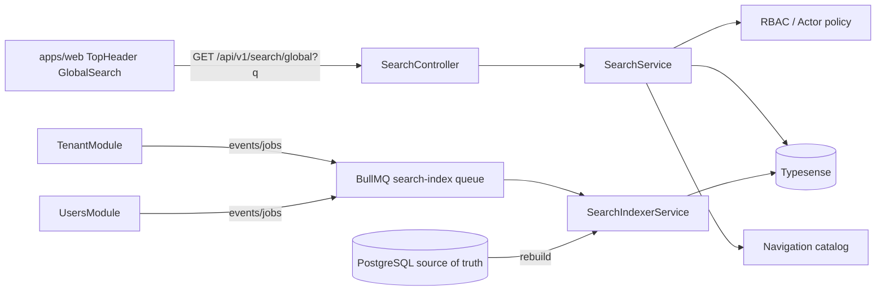

# HLD — Busqueda global indexada transversal

## iWana neXt Platform — ISP/OSS/BSS Colombia

**Version:** 1.0
**Estado:** En revision
**Fecha:** 2026-05-02
**Modo activo:** Architect
**Autor:** AI-EM-ARCH
**Aprobador requerido:** CTO Humano

---

## Trazabilidad

| Artefacto | Referencia |
|-----------|-----------|
| ADR Typesense | [docs/adrs/ADR-036-Typesense-Busqueda-Global.md](../adrs/ADR-036-Typesense-Busqueda-Global.md) |
| Stack Tecnologico | [docs/prds/Stack_Tecnologico.md](../prds/Stack_Tecnologico.md) |
| Spec de diseno | [docs/specs/2026-05-02-busqueda-global-typesense-design.md](../specs/2026-05-02-busqueda-global-typesense-design.md) |
| Plan de ejecucion | [docs/plans/PLAN-TRANSVERSAL-BUSQUEDA-GLOBAL-TYPESENSE-v1.0.md](../plans/PLAN-TRANSVERSAL-BUSQUEDA-GLOBAL-TYPESENSE-v1.0.md) |
| Prompt de ejecucion | [docs/prompts/PROMPT-TRANSVERSAL-BUSQUEDA-GLOBAL-TYPESENSE-v1.0.md](../prompts/PROMPT-TRANSVERSAL-BUSQUEDA-GLOBAL-TYPESENSE-v1.0.md) |

---

## 1. Contexto de negocio

La consola administrativa necesita encontrar rapidamente empresas, usuarios y modulos desde cualquier pantalla. El patron objetivo se inspira en UISP: una barra global que, mientras se escribe, muestra resultados agrupados, relevantes y navegables por teclado.

El comportamiento actual no cubre ese objetivo. La barra del header escribe `q` en la URL y solo el dashboard usa ese valor como filtro local de empresas. No existe busqueda cross-tenant, resultados agrupados ni atajo real `Cmd/Ctrl + K`.

## 2. Bounded contexts afectados

| Bounded context | Rol | Cambio |
|-----------------|-----|--------|
| SearchModule | Nuevo transversal | Orquesta Typesense, contrato de busqueda e indexacion. |
| TenantModule | Fuente de datos | Publica empresas al indice y eventos de actualizacion. |
| UsersModule | Fuente de datos | Publica usuarios cross-tenant al indice y eventos de actualizacion. |
| Auth/RBAC | Control de acceso | Protege endpoint y filtra resultados segun actor. |
| AuditModule | Observabilidad | Puede registrar eventos tecnicos no sensibles de busqueda/indexacion. |
| apps/web | Consumidor UI | Reemplaza buscador actual por overlay global tipo UISP. |

## 3. Arquitectura propuesta



### 3.1 Componentes backend

```
apps/api/src/modules/search/
├── search.module.ts
├── search.controller.ts              # GET /api/v1/search/global
├── search.service.ts                 # consulta y agrupa resultados
├── search-indexer.service.ts         # upsert/delete/rebuild de indices
├── search-catalog.service.ts         # modulos/rutas/acciones estaticas
├── dto/
│   ├── global-search-query.dto.ts
│   └── global-search-response.dto.ts
├── typesense/
│   ├── typesense.client.ts
│   ├── typesense.schemas.ts
│   └── typesense.health.ts
├── processors/
│   └── search-index.processor.ts     # BullMQ incremental
└── tests/
    ├── search.service.spec.ts
    ├── search.controller.http.spec.ts
    └── search-indexer.service.spec.ts
```

### 3.2 Componentes frontend

```
apps/web/src/components/search/
├── GlobalSearch.tsx                  # input + overlay orchestration
├── GlobalSearchOverlay.tsx           # grupos/resultados/estados
├── GlobalSearchResultItem.tsx
└── useGlobalSearch.ts                # debounce + api-client
```

`TopHeader.tsx` debe consumir `GlobalSearch` y dejar de manejar directamente `q` como busqueda global.

## 4. Modelo de indice

### 4.1 Coleccion `tenants`

| Campo | Tipo | Uso |
|-------|------|-----|
| `id` | string | Identificador estable. |
| `type` | string | `tenant`. |
| `name` | string | Buscable, peso alto. |
| `slug` | string | Buscable/facetable. |
| `legalName` | string optional | Buscable, peso medio. |
| `status` | string | Facetable y boost operativo. |
| `route` | string | Ruta destino en web. |
| `updatedAt` | int64 | Ranking/recientes. |

### 4.2 Coleccion `users`

| Campo | Tipo | Uso |
|-------|------|-----|
| `id` | string | Identificador estable. |
| `type` | string | `user`. |
| `tenantId` | string | Filtro/metadata. |
| `tenantSlug` | string | Buscable y metadata. |
| `tenantName` | string | Buscable y metadata. |
| `email` | string | Buscable, peso alto. |
| `firstName` | string optional | Buscable. |
| `lastName` | string optional | Buscable. |
| `jobTitle` | string optional | Buscable. |
| `role` | string | Facetable/metadata. |
| `status` | string | Facetable/boost. |
| `route` | string | Ruta destino. |
| `updatedAt` | int64 | Ranking/recientes. |

No entra en v1: documento, telefono, direccion, tokens, hashes, MFA secrets, password flags, PII sensible adicional.

### 4.3 Coleccion `navigation_modules`

| Campo | Tipo | Uso |
|-------|------|-----|
| `id` | string | Identificador estable. |
| `type` | string | `module`. |
| `title` | string | Buscable, peso alto. |
| `keywords` | string[] | Buscable. |
| `description` | string | Buscable, peso bajo. |
| `route` | string | Destino. |
| `order` | int32 | Ranking estable. |

## 5. Contrato API

### 5.1 Endpoint

`GET /api/v1/search/global?q={query}&limit={limit}`

Headers:

- `Authorization: Bearer ...`

Query:

- `q`: string, requerido para busqueda activa. Minimo recomendado: 2 caracteres.
- `limit`: number opcional. Default 5 por grupo, max 10 por grupo.

### 5.2 Respuesta

```json
{
  "data": {
    "query": "lili",
    "groups": [
      {
        "type": "tenants",
        "label": "Empresas",
        "total": 2,
        "items": [
          {
            "id": "tenant-id",
            "type": "tenant",
            "title": "Empresa Demo",
            "subtitle": "demo · ACTIVE",
            "meta": "Empresa",
            "route": "/tenants/tenant-id/settings",
            "highlights": ["Empresa <mark>Demo</mark>"]
          }
        ]
      }
    ],
    "tookMs": 12
  }
}
```

El frontend no recibe API keys ni detalles internos de Typesense.

## 6. Flujo de busqueda

1. Usuario enfoca la barra o presiona `Cmd/Ctrl + K`.
2. `GlobalSearch` abre overlay.
3. Al escribir 2+ caracteres, `useGlobalSearch` espera debounce de 150-250 ms.
4. `globalSearchApi.search(query)` llama al backend.
5. `SearchService` valida actor, consulta Typesense y transforma resultados a grupos.
6. Overlay muestra loading, grupos, seleccion activa y highlights.
7. Enter navega al resultado seleccionado.
8. Escape cierra y devuelve foco al trigger.

## 7. Indexacion

### 7.1 Rebuild inicial

Comando o servicio interno:

- Limpia/recrea schemas de Typesense si se solicita `force`.
- Indexa tenants activos y relevantes desde schema publico.
- Recorre schemas tenant aprobados para indexar usuarios.
- Indexa catalogo estatico de modulos.

### 7.2 Incremental

Jobs BullMQ idempotentes:

- `search.index.tenant.upsert`
- `search.index.tenant.delete`
- `search.index.user.upsert`
- `search.index.user.delete`
- `search.index.navigation.rebuild`

El job debe tolerar reintentos y validar que el dato aun existe antes de indexar.

## 8. Seguridad

- JWT obligatorio para `GET /search/global`.
- Ninguna API key de Typesense sale al navegador.
- RBAC en backend antes de responder.
- Para v1, la consola web de plataforma puede buscar cross-tenant si el actor tiene rol autorizado de plataforma.
- No indexar PII sensible adicional.
- No loguear query completa por defecto.
- Rate limit del endpoint para evitar abuso.
- OpenAPI debe documentar limites y respuesta.

## 9. Observabilidad

Eventos tecnicos no sensibles:

- `search.global.query.completed`: longitud de query, grupos devueltos, tookMs, userId, role.
- `search.global.query.failed`: codigo de error, tookMs, userId.
- `search.index.upsert.completed`: collection, entityType, tookMs.
- `search.index.rebuild.completed`: collections, counts, durationMs.

## 10. Riesgos tecnicos

| Riesgo | Impacto | Mitigacion |
|--------|---------|------------|
| Drift PostgreSQL vs Typesense | Medio | Jobs incrementales + rebuild manual. |
| PII en indice | Alto | Schema minimo y tests de payload. |
| Nueva dependencia operacional | Medio | ADR, Docker healthcheck, runbook. |
| Latencia en cada tecla | Medio | Debounce, limite por grupo, cache cliente ligera. |
| Cross-tenant no autorizado | Alto | RBAC backend y pruebas negativas. |

## 11. Decisiones pendientes

- CTO debe aprobar ADR-036 antes de implementar.
- Definir si la telemetria guarda query completa o solo longitud/hash. Recomendacion: longitud/hash en v1.
- Definir endpoint/admin command para rebuild: CLI interno, ruta protegida o job manual.
- Definir si `q` en URL de dashboard se conserva como filtro local o se retira para evitar doble semantica.

## 12. Criterios de listo del HLD

- [ ] ADR-036 aprobado.
- [ ] Plan de ejecucion aprobado.
- [ ] Prompt de ejecucion entregado al Sr. Dev Fullstack.
- [ ] Criterios de seguridad cross-tenant aceptados por CTO/Architect.
