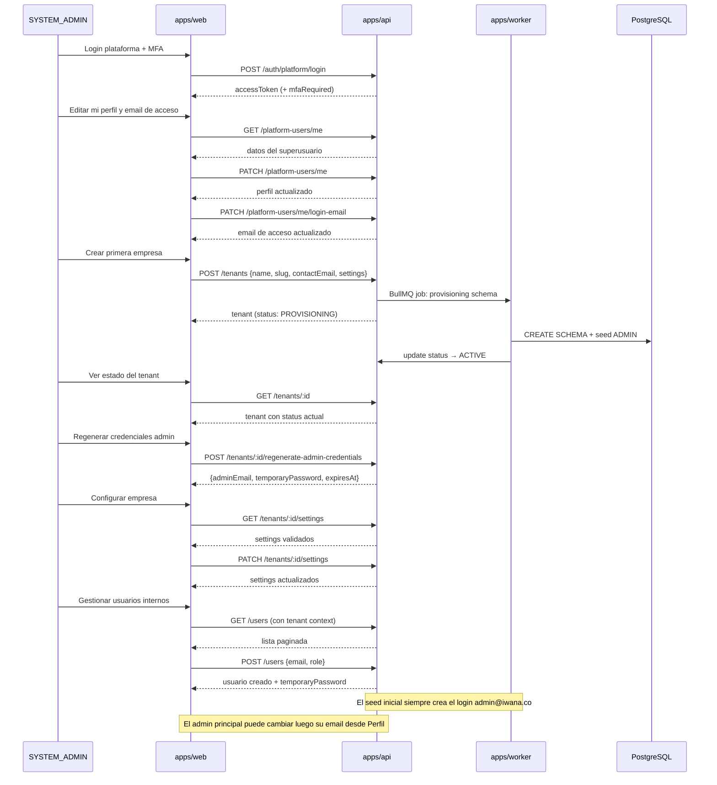

# HLD — Enablement Operativo: Perfil, Configuración y Alta de Primera Empresa

## iWana neXt Platform — ISP/OSS/BSS Colombia

**Versión:** 1.0
**Estado:** Borrador
**Fecha:** 2026-03-14
**Modo activo:** Mixto (EM + Architect)
**Autor:** AI-EM-ARCH
**Aprobador:** CTO Humano

---

## Trazabilidad

| Artefacto | Referencia |
|-----------|-----------|
| PRD del sistema | docs/prds/PRD_Sistema_ISP_Colombia_v2_2.md |
| PRD MOD01 | docs/prds/PRD-MOD01-Auth-Tenant-Audit-v1.0.md |
| HLD MOD01 | docs/hlds/HLD-MOD01-ARQUITECTURA-v1.0.md |
| ADR-016 Cierre MOD01 | docs/adrs/ADR-016-Cierre-MOD01-Produccion.md |
| ADR-023 TailAdmin | docs/adrs/ADR-023-Referencia-TailAdmin-Shell-Dashboard.md |
| Stack Tecnológico | docs/prds/Stack_Tecnologico.md |
| Informe TailAdmin | docs/informes/INFORME-TRANSVERSAL-ADOPCION-TAILADMIN-v1.0.md |

---

## 1. Contexto y Motivación

MOD01 (Auth + Tenant + Audit + Users) fue cerrado y aprobado para producción (ADR-016, CTO 2026-03-12). El shell TailAdmin fue adoptado como referencia UX (ADR-023) y su integración completada en 6 fases.

Sin embargo, el sistema no es operable aún porque:

1. **El superusuario de plataforma no puede editar su propio perfil** — no existe endpoint ni pantalla para datos propios.
2. **La configuración de empresa carece de contrato explícito** — el JSONB `settings` del tenant se actualiza vía PATCH genérico sin validación de schema.
3. **El alta de la primera empresa real no tiene feedback operativo** — el provisioning es asíncrono pero la UI no muestra estado ni permite continuidad.
4. **La gestión de usuarios internos no tiene pantalla** — el CRUD backend existe pero no está conectado a ninguna UI.
5. **El shell TailAdmin contiene rutas muertas** — `/profile`, `/settings` y `/support` están hardcodeados en DropdownUser y Sidebar sin destino real.

Este HLD define la arquitectura funcional para convertir lo ya construido en una plataforma operable.

---

## 2. Alcance

### IN (lo que construimos)

| Pieza | Descripción |
|-------|-------------|
| **Perfil del superusuario** | Endpoint `GET/PATCH /api/v1/platform-users/me` + `PATCH /api/v1/platform-users/me/login-email` + pantalla `/profile` en web |
| **Seguridad del superusuario** | Pantalla `/settings` con acceso a cambio de contraseña y gestión MFA (reutiliza endpoints existentes de auth) |
| **Configuración de empresa** | Endpoint `GET/PATCH /api/v1/tenants/:id/settings` con DTO validado + pantalla `/tenants/:id/settings` |
| **Alta de primera empresa** | Pantalla `/tenants/new` que reutiliza `POST /api/v1/tenants` + feedback de provisioning + credenciales del admin principal con login genérico |
| **Estado de provisioning** | Enriquecer `GET /api/v1/tenants/:id` con metadata de provisioning (o endpoint dedicado si ya devuelve status) |
| **Gestión de usuarios internos** | Pantalla `/users` (listar, crear, editar status/rol) que consume el CRUD existente de UsersController |
| **Navegación real** | Actualizar Sidebar y DropdownUser para que `/profile`, `/settings`, `/tenants` y `/users` apunten a pantallas funcionales |
| **api-client completado** | Agregar métodos faltantes: `platformUsersApi.me()`, `platformUsersApi.updateMe()`, `tenantApi.create()`, `tenantApi.getOne()`, `tenantApi.updateSettings()`, `tenantApi.regenerateCredentials()`, `usersApi.*` |

### OUT (no entra)

- Perfil enriquecido de suscriptores (CRM, contrato, estrato, IVA) → MOD02
- Billing, facturación, métodos de pago → MOD03+
- PQR / Soporte funcional → módulo futuro
- Portal público comercial → proyecto externo
- Upload de avatar / foto de perfil → fase posterior
- Notificaciones en tiempo real → Sprint 3+
- Email transaccional (nodemailer) → fase posterior

---

## 3. Arquitectura Funcional

### 3.1 Diagrama de flujo operativo



### 3.2 Contratos de API nuevos y modificados

#### 3.2.1 `GET /api/v1/platform-users/me` (NUEVO)

**Guard:** JwtAuthGuard + rol SYSTEM_ADMIN o IWANA_SUPPORT
**Response 200:**

```typescript
{
  data: {
    id: string;
    role: PlatformRole;
    status: UserStatus;
    mfaEnabled: boolean;
    email: string;               // solo en perfil propio
    phone: string | null;        // campo nuevo en entidad
    timezone: string;            // campo nuevo, default 'America/Bogota'
    language: string;            // campo nuevo, default 'es-CO'
    lastLoginAt: Date | null;
    createdAt: Date;
    updatedAt: Date;
  }
}
```

#### 3.2.2 `PATCH /api/v1/platform-users/me` (NUEVO)

**Guard:** JwtAuthGuard + rol SYSTEM_ADMIN o IWANA_SUPPORT
**Body (todos opcionales):**

```typescript
{
  firstName?: string;     // max 100 chars
  lastName?: string;      // max 100 chars
  phone?: string;         // max 20 chars, regex E.164
  timezone?: string;      // IANA timezone válido
  language?: string;      // 'es-CO' | 'en-US' (extensible)
}
```

**Response 200:** mismo formato que GET `/platform-users/me`

#### 3.2.2.b `PATCH /api/v1/platform-users/me/login-email` (NUEVO)

**Guard:** JwtAuthGuard + rol SYSTEM_ADMIN o IWANA_SUPPORT
**Body:**

```typescript
{
  email: string;
  currentPassword: string;
}
```

**Response 200:** mismo formato que GET `/platform-users/me`

#### 3.2.3 `GET /api/v1/tenants/:id/settings` (NUEVO)

**Guard:** JwtAuthGuard + SYSTEM_ADMIN
**Response 200:**

```typescript
{
  data: {
    tenantId: string;
    timezone: string;        // default 'America/Bogota'
    currency: string;        // default 'COP', ISO 4217
    language: string;        // default 'es-CO'
    country: string;         // default 'CO', ISO 3166-1 alpha-2
    maxSubscribers: number;
    features: {
      billing: boolean;
      mfa_required_all: boolean;
      // extensible
    };
  }
}
```

#### 3.2.4 `PATCH /api/v1/tenants/:id/settings` (NUEVO)

**Guard:** JwtAuthGuard + SYSTEM_ADMIN
**Body (todos opcionales):**

```typescript
{
  timezone?: string;        // IANA timezone
  currency?: string;        // ISO 4217
  language?: string;        // 'es-CO' | 'en-US'
  country?: string;         // ISO 3166-1 alpha-2
  maxSubscribers?: number;  // >= 0
  features?: {
    billing?: boolean;
    mfa_required_all?: boolean;
  };
}
```

**Response 200:** mismo formato que GET

### 3.3 Cambios en entidades

#### PlatformUser — agregar campos de perfil

```typescript
// Nuevos campos (migración requerida)
@Column({ name: 'display_name', length: 150, nullable: true })
displayName: string | null;

@Column({ length: 20, nullable: true })
phone: string | null;

@Column({ length: 50, default: 'America/Bogota' })
timezone: string;

@Column({ length: 10, default: 'es-CO' })
language: string;
```

#### Tenant — sin cambios estructurales

El campo `settings: JSONB` ya existe. Lo que cambia es que se aplica validación explícita en el DTO nuevo.

### 3.4 Módulos backend afectados

| Módulo | Cambio | Tipo |
|--------|--------|------|
| **Nuevo: PlatformUsersModule** | Controller + Service para `GET/PATCH /platform-users/me`. Inyecta `PlatformUser` repo y `AuditService` | Nuevo módulo |
| **TenantModule** | Agregar 2 endpoints en controller: `GET/PATCH /:id/settings`. Agregar DTOs `TenantSettingsResponseDto` y `UpdateTenantSettingsDto` | Extensión |
| **AuthModule** | Sin cambios — se reutilizan los endpoints de cambio de contraseña y MFA ya existentes | Sin cambios |
| **UsersModule** | Sin cambios backend — ya exporta CRUD completo, solo se consume desde frontend | Sin cambios |

### 3.5 Estructura de rutas frontend (apps/web)

```
apps/web/src/app/
├── dashboard/
│   ├── layout.tsx            ← Shell TailAdmin existente (sin cambios)
│   └── page.tsx              ← Dashboard existente
├── profile/
│   └── page.tsx              ← NUEVO: Edición de perfil del superusuario
├── settings/
│   └── page.tsx              ← NUEVO: Seguridad (password + MFA)
├── tenants/
│   ├── page.tsx              ← NUEVO: Lista de empresas (reutiliza TenantsTable)
│   ├── new/
│   │   └── page.tsx          ← NUEVO: Crear empresa
│   └── [id]/
│       └── settings/
│           └── page.tsx      ← NUEVO: Configuración de empresa
├── users/
│   └── page.tsx              ← NUEVO: Gestión de usuarios internos
└── auth/                     ← Existente sin cambios
```

**Decisión de layout:** Todas las rutas nuevas (`/profile`, `/settings`, `/tenants/*`, `/users`) viven bajo el layout existente de `/dashboard` para heredar el shell TailAdmin (sidebar + header + dark mode). Esto se logra colocándolas como hermanas de `/dashboard` dentro del layout group, o moviendo el layout a nivel raíz del árbol protegido.

**Alternativa recomendada:** Crear un layout group `(protected)` que encapsule dashboard, profile, settings, tenants y users con el shell TailAdmin, evitando duplicar el layout.

### 3.6 Componentes a crear

| Componente | Ubicación | Responsabilidad |
|-----------|-----------|-----------------|
| `ProfileForm` | `apps/web/src/components/profile/ProfileForm.tsx` | Formulario edición de datos propios del superusuario |
| `SecuritySettings` | `apps/web/src/components/settings/SecuritySettings.tsx` | Panel cambio contraseña + estado MFA |
| `TenantCreateForm` | `apps/web/src/components/tenants/TenantCreateForm.tsx` | Formulario de alta de empresa |
| `TenantSettingsForm` | `apps/web/src/components/tenants/TenantSettingsForm.tsx` | Configuración funcional del tenant |
| `TenantStatusBadge` | `apps/web/src/components/tenants/TenantStatusBadge.tsx` | Badge visual del estado de provisioning |
| `CredentialsModal` | `apps/web/src/components/tenants/CredentialsModal.tsx` | Modal con credenciales temporales del admin principal |
| `UsersTable` | `apps/web/src/components/users/UsersTable.tsx` | Tabla paginada de usuarios del tenant |
| `UserCreateModal` | `apps/web/src/components/users/UserCreateModal.tsx` | Modal de alta de usuario con credenciales temporales |

---

## 4. Decisiones Arquitectónicas

| # | Decisión | Justificación |
|---|----------|---------------|
| D1 | Se crea `PlatformUsersModule` separado de `AuthModule` | Auth maneja identidad y sesiones; perfil de usuario es CRUD de datos propios. Separar evita inflar AuthService y respeta boundaries |
| D2 | Settings del tenant se valida con DTO explícito, no JSONB libre | El PATCH genérico con `Record<string, unknown>` no protege contra payloads arbitrarios. Validar en DTO con class-validator/Zod |
| D3 | La UI de gestión de usuarios opera en contexto de plataforma, no de tenant | El SYSTEM_ADMIN puede gestionar usuarios de cualquier tenant. El contexto de tenant se pasa vía query param o path, no por JWT claim. En esta fase se implementa la gestión desde la perspectiva de plataforma |
| D4 | El layout TailAdmin se reorganiza en layout group `(protected)` | Evita duplicar el shell en cada ruta. Todas las rutas protegidas heredan sidebar + header + dark mode |
| D5 | No se implementa upload de avatar en esta fase | Requiere storage (MinIO/S3), resize, CDN. Es mejora cosmética, no bloqueante para operación |
| D6 | No se reabren tests ni informe de cierre de MOD01 | ADR-016 declara MOD01 cerrado. Este trabajo se documenta como enablement transversal independiente |

---

## 5. Migración de Base de Datos

### 5.1 Migración requerida: `AddPlatformUserProfile`

```sql
-- UP
ALTER TABLE public.platform_users
  ADD COLUMN display_name VARCHAR(150),
  ADD COLUMN phone VARCHAR(20),
  ADD COLUMN timezone VARCHAR(50) NOT NULL DEFAULT 'America/Bogota',
  ADD COLUMN language VARCHAR(10) NOT NULL DEFAULT 'es-CO';

-- DOWN
ALTER TABLE public.platform_users
  DROP COLUMN IF EXISTS display_name,
  DROP COLUMN IF EXISTS phone,
  DROP COLUMN IF EXISTS timezone,
  DROP COLUMN IF EXISTS language;
```

No se requieren migraciones adicionales para tenants ni users — la estructura existente es suficiente.

---

## 6. Seguridad

| Aspecto | Tratamiento |
|---------|-------------|
| Datos del perfil | `firstName`, `lastName`, `phone` y email de acceso propio se auditan. El email solo se expone en endpoints de perfil propio y regeneración controlada |
| Cambio de contraseña | Reutiliza `POST /auth/change-password` existente — invalida todos los refresh tokens |
| MFA | Reutiliza `POST /auth/mfa/setup`, `/mfa/verify`, `/mfa/disable` existentes |
| Settings del tenant | Solo SYSTEM_ADMIN puede escribir. Se audita cada cambio |
| Credenciales temporales | Se muestran una sola vez en modal, no se persisten en frontend. El login inicial del admin principal es genérico (`admin@iwana.co`) y luego se rota desde Perfil |
| Audit trail | Todas las operaciones CUD de perfil y settings pasan por AuditInterceptor existente |

---

## 7. Riesgos

| # | Riesgo | Severidad | Mitigación |
|---|--------|-----------|-----------|
| R1 | El layout group `(protected)` puede romper rutas actuales si se reorganiza mal | Media | Mover archivos con cuidado, verificar que `/dashboard` sigue funcionando |
| R2 | El SYSTEM_ADMIN gestiona usuarios de tenant sin tener JWT de ese tenant | Media | El endpoint de users ya soporta contexto vía `X-Tenant-Slug` header; la pantalla debe enviarlo |
| R3 | Settings JSONB sin schema puede tener datos legacy incompatibles | Baja | El DTO de lectura normaliza el JSONB y aplica defaults para campos faltantes |
| R4 | Si el provisioning falla, la UI debe mostrar estado claro y acción de retry | Media | El campo `status: PROVISIONING_FAILED` ya existe en el enum. La pantalla muestra badge y botón de re-provisioning |

---

## 8. Testing

| Capa | Alcance | Herramienta |
|------|---------|-------------|
| Unit backend | PlatformUsersService, TenantService.getSettings/updateSettings, DTOs | Jest |
| Integration backend | GET/PATCH /platform-users/me, GET/PATCH /tenants/:id/settings | Jest + Supertest |
| Unit frontend | ProfileForm validation, TenantCreateForm validation | Jest |
| E2E | Login → perfil → crear empresa → ver estado → gestionar usuarios | Playwright |

**Cobertura esperada:** >= 80% en los contratos nuevos del backend.

---

## 9. Fases de Implementación

| Fase | Entregable | Dependencia |
|------|-----------|-------------|
| F1 | Migración DB + entidad PlatformUser ampliada | Ninguna |
| F2 | PlatformUsersModule backend (GET/PATCH /me) + tests | F1 |
| F3 | Endpoints settings del tenant (GET/PATCH) + DTOs + tests | Ninguna (paralela con F2) |
| F4 | Layout group `(protected)` + reorganización de rutas | Ninguna (paralela con F2/F3) |
| F5 | api-client ampliado + Sidebar/DropdownUser corregidos | F2 + F3 |
| F6 | Pantalla de perfil + seguridad | F4 + F5 |
| F7 | Pantallas de tenants (lista, crear, settings, credenciales) | F4 + F5 |
| F8 | Pantalla de gestión de usuarios internos | F7 |
| F9 | Test E2E + informe documental | F6 + F7 + F8 |
