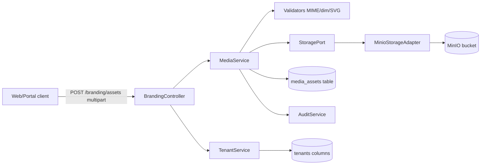

# HLD — Media/Assets transversal

## iWana neXt Platform — ISP/OSS/BSS Colombia

**Version:** 1.0
**Estado:** Aprobado
**Fecha:** 2026-04-30
**Modo activo:** Architect
**Autor:** AI-EM-ARCH
**Aprobador requerido:** CTO Humano

---

## Trazabilidad

| Artefacto | Referencia |
|-----------|-----------|
| ADR Storage MinIO | [docs/adrs/ADR-035-Storage-MinIO-StoragePort.md](../adrs/ADR-035-Storage-MinIO-StoragePort.md) |
| ADR Bounded Context Media | [docs/adrs/ADR-034-Bounded-Context-Media-Assets.md](../adrs/ADR-034-Bounded-Context-Media-Assets.md) |
| PRD Branding v2 (consumidor v1) | [docs/prds/PRD-MOD03-BRANDING-EMPRESARIAL-v2.0.md](../prds/PRD-MOD03-BRANDING-EMPRESARIAL-v2.0.md) |
| PRD MOD03 origen | [docs/prds/PRD-MOD03-CONFIGURACION-EMPRESA-v1.0.md](../prds/PRD-MOD03-CONFIGURACION-EMPRESA-v1.0.md) |
| Stack Tecnologico | [docs/prds/Stack_Tecnologico.md](../prds/Stack_Tecnologico.md) |
| Perfil unificado | [docs/roles/Perfil_IA_EM_Architect_Unificado_v1.md](../roles/Perfil_IA_EM_Architect_Unificado_v1.md) |

---

## 1. Contexto de Negocio

iWana neXt requiere persistir y servir archivos binarios de forma segura, multi-tenant y auditable. El primer consumidor productivo es Branding Empresarial v2 (favicon, logo, sello, fondo de login). Los siguientes consumidores previsibles son CRM expedientes (hoy en filesystem local), avatares de usuario, FURAT SG-SST y comprobantes de pago.

Sin un modulo transversal, cada dominio reinventaria la rueda con riesgos de seguridad y multi-tenant. El brainstorming cerro Opcion C: modulo transversal con Branding como primer consumidor.

## 2. Bounded Contexts Afectados

| Bounded Context | Rol | Cambio |
|-----------------|-----|--------|
| **MediaModule** | Nuevo, transversal | Se crea desde cero |
| **TenantModule (MOD03 Branding)** | Consumidor v1 | Inyecta `MediaService`; deja de gestionar URLs en aislamiento |
| **AuditModule** | Auxiliar | Recibe eventos de mutacion de `media_assets` |
| **AuthModule** | Auxiliar | `JwtAuthGuard` y `AbacGuard` aplican a `MediaController` |
| **CRM Expedientes (futuro)** | Consumidor F2 | No entra en v1 — queda como deuda registrada |

## 3. Componentes Principales

```
apps/api/src/modules/media/
├── media.module.ts
├── media.service.ts                  # MediaService implementation
├── media.controller.ts               # POST /api/v1/media/uploads (interno, JWT-only)
├── dto/
│   ├── register-upload.dto.ts        # Zod + class-validator
│   └── register-external-url.dto.ts
├── entities/
│   └── media-asset.entity.ts
├── validators/
│   ├── mime-validator.ts             # magic bytes via 'file-type'
│   ├── dimension-validator.ts        # opcional via 'image-size'
│   └── svg-sanitizer.ts              # DOMPurify server-side
├── policies/
│   └── usage-policy.ts               # mapping usage -> {mimes, max bytes, max dims, sanitize?}
└── tests/
    └── media.service.spec.ts
```

```
packages/storage/
├── src/
│   ├── index.ts
│   ├── ports/
│   │   └── storage.port.ts           # interface StoragePort
│   ├── adapters/
│   │   ├── minio-storage.adapter.ts  # primary
│   │   └── local-fs-storage.adapter.ts  # dev only
│   └── factory.ts                    # selecciona adapter segun STORAGE_DRIVER
└── package.json
```

```
packages/database/src/migrations/public/
└── CreateMediaAssetsTable.ts
```

### Diagrama de componentes



### Flujo de upload (modo upload)

1. Cliente envia `multipart/form-data` a endpoint del consumidor (ej. `POST /api/v1/tenants/me/branding/assets`).
2. Consumidor valida permisos (`@Roles`, AbacGuard).
3. Consumidor llama `MediaService.registerUpload({ tenantSchema, usage, file, createdBy })`.
4. `MediaService` valida policy de `usage` (MIME, tamano, dimensiones), sanitiza SVG si aplica, calcula checksum, genera `assetId` ULID, calcula `objectKey`.
5. `MediaService` invoca `StoragePort.putObject(...)`.
6. `MediaService` persiste fila en `media_assets` y emite evento de auditoria.
7. `MediaService` retorna `MediaAsset` con `publicUrl` resuelto por el adapter.
8. Consumidor (BrandingService) actualiza la columna correspondiente del tenant con `publicUrl` y `assetId`.

### Flujo de URL externa

1. Cliente envia JSON con `{ usage, url }`.
2. Consumidor valida permisos.
3. `MediaService.registerExternalUrl(...)` valida HTTPS, allowlist opcional, longitud.
4. Persiste `media_assets` con `origin='external_url'` y `external_url=url`. Sin `objectKey`, sin checksum.
5. Auditoria.
6. Retorna `MediaAsset` con `publicUrl = external_url`.

### Flujo de servido publico (login no autenticado)

1. Login portal hace `GET /api/v1/tenants/public-branding?slug=...`.
2. Endpoint resuelve tenant por slug y retorna `{ logoLight, logoDark, sealLight, sealDark, faviconLight, faviconDark, loginBgLight, loginBgDark, displayName }`.
3. URLs son servibles directamente desde el navegador (publicas en MinIO o externas HTTPS).
4. Endpoint con rate limit por IP, cache HTTP `Cache-Control: public, max-age=60`.

## 4. Integraciones Externas

| Sistema | Tipo | Notas |
|---------|------|-------|
| MinIO | Storage S3-compatible | Red interna Docker. TLS en staging/prod. |
| MediaService internos | Interfaz tipada | Solo via inyeccion NestJS. |
| URL externa HTTPS | Pasiva | El navegador del cliente final hace la request. API no proxa. |

## 5. Riesgos Tecnicos

| Riesgo | Impacto | Mitigacion |
|--------|---------|-----------|
| Fuga cross-tenant | Alto | Prefijo `tenantSchema/` obligatorio en `objectKey`; AbacGuard; tests de aislamiento |
| SVG malicioso | Alto | DOMPurify en server; SVG solo en `branding.logo` |
| Bucket publico mal configurado | Alto | Default privado; signed URLs; assets publicos solo via flag explicito en policy |
| MIME spoofing | Medio | Validacion por magic bytes con `file-type`, no por extension |
| Crecimiento descontrolado del bucket | Medio | Soft delete + job futuro de limpieza fisica |
| SSRF si la API hace fetch de URL externa | Alto | API NO hace fetch; URL se sirve al cliente final |
| Drift de configuracion entre adapters | Medio | Validacion Joi al boot; tests del factory |

## 6. Despliegue

### Entornos

- **Dev:** MinIO en `docker-compose.dev.yml` (ya presente). Bucket auto-creado por script de bootstrap.
- **Staging:** MinIO dedicado en stack on-premise. TLS habilitado.
- **Prod:** MinIO con replicacion erasure coding (configuracion infra fuera de scope de este HLD); credenciales en secret store; respaldo nocturno documentado en runbook.

### Bootstrap

Script `scripts/bootstrap-minio.sh` que:
1. Espera salud de MinIO.
2. Crea bucket si no existe.
3. Aplica policy privada por defecto.
4. Aplica policy publica de lectura solo a prefijos `*/branding.logo/*`, `*/branding.seal/*`, `*/branding.favicon/*`, `*/branding.login_background/*`.

### Migraciones

`CreateMediaAssetsTable` en `packages/database/src/migrations/public/`. Reversible.

## 7. Seguridad

- JWT obligatorio en todos los endpoints internos.
- AbacGuard valida cross-tenant (rol plataforma puede operar sobre cualquier tenant; TENANT_ADMIN solo sobre el suyo).
- Allowlist MIME por `usage` (ej. logo: png, webp, jpg, svg sanitizado; favicon: png, ico, webp).
- Tamanos maximos por `usage` (logo 1MB, favicon 256KB, sello 512KB, login_background 5MB).
- Sin PII en filenames, metadata ni logs.
- Rate limit en `POST /uploads` (ej. 10 por minuto por usuario).
- Audit trail con `oldValue/newValue` cuando un consumidor reemplaza un asset.

## 8. Observabilidad

- Logs estructurados: `media.upload.success`, `media.upload.rejected`, `media.external_url.registered`, `media.delete`. Incluye `tenantSchema`, `usage`, `mimeType`, `bytes`, `userId` (id, no email).
- Metricas (futuro): contador de uploads por tenant, tamano promedio, tasa de rechazo.
- Trazabilidad: cada operacion incluye `request-id` propagado desde middleware.

## 9. Decisiones Pendientes

- Politica de cuotas por tenant (no aplica en v1, registrar como deuda).
- Procesamiento de imagenes (resize, optimizacion) — no v1.
- Limpieza fisica de soft deletes — no v1.
- Migracion CRM expedientes a `MediaService` — no v1.

## 10. Criterios de Listo (HLD)

- [ ] ADR-033 y ADR-034 aprobados por CTO.
- [ ] PRD Branding v2 aprobado.
- [ ] Plan de fases aprobado.
- [ ] Bootstrap de MinIO documentado en runbook on-premise.
