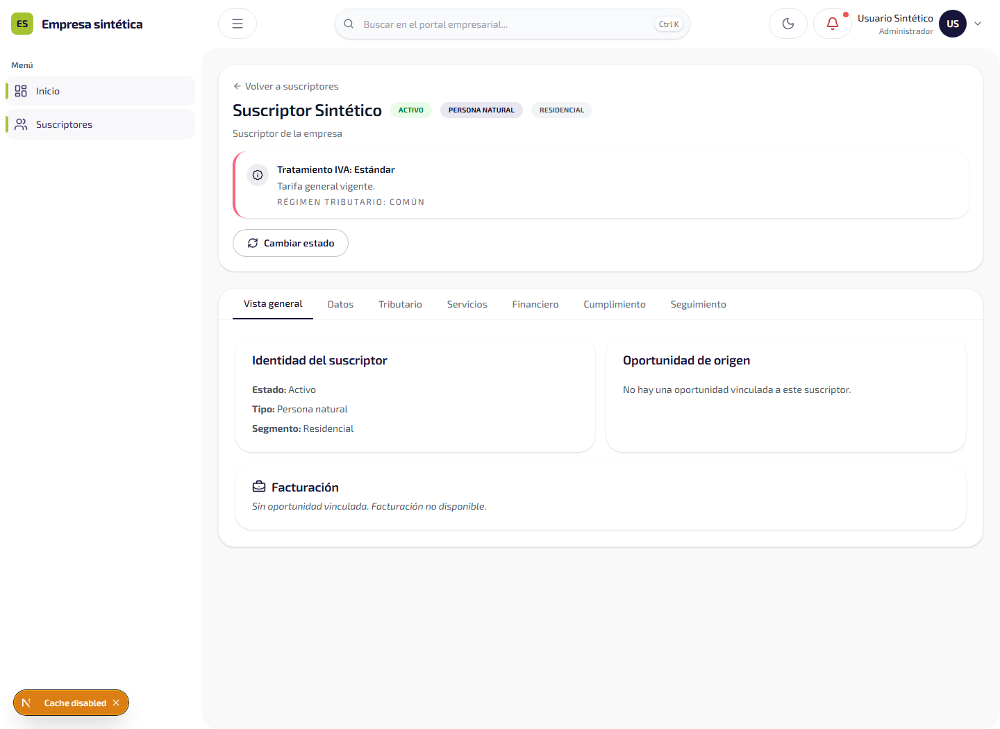
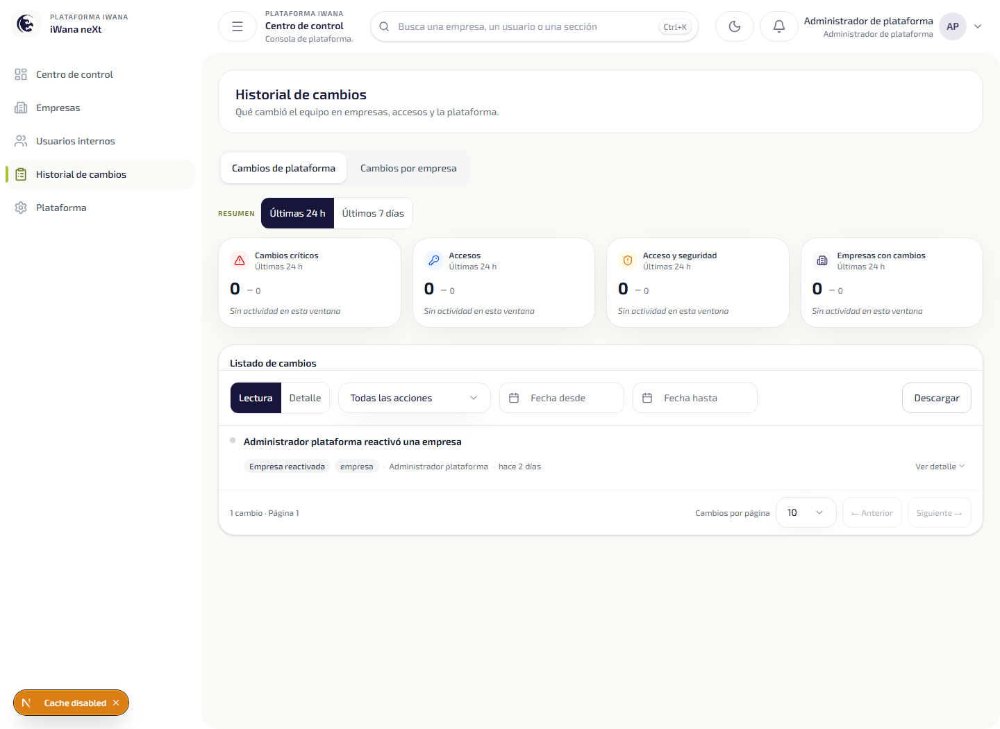

# Informe — variante cursiva local de Exo 2

- **Fecha:** 2026-10-10
- **Responsable:** fe-platform
- **Alcance:** corrección del hallazgo P2 del informe `INFORME-DS-OWNER-FUENTES-LOCALES-v1.0.md` y verificación visual en portal y web.
- **Dictamen de implementación:** **GO**
- **Commit:** ninguno, según el encargo.

## Cambio

Se añadió `packages/ui/src/styles/fonts/exo2-italic-latin.woff2`, el subconjunto Latin de la variante cursiva variable de Exo 2 publicada por Google Fonts. Se verificó en los metadatos oficiales de la familia que el eje `wght` de la variante cursiva va de 100 a 900; la hoja CSS oficial identifica este archivo como cursiva y subconjunto `latin`. El archivo local mide 43.048 bytes y su firma es WOFF2 (`wOF2`). La licencia OFL existente queda en `packages/ui/src/styles/fonts/exo2-OFL.txt`.

Referencias de origen: [metadatos oficiales de Exo 2](https://github.com/google/fonts/tree/main/ofl/exo2) y [archivo WOFF2 Latin cursivo, versión 26](https://fonts.gstatic.com/s/exo2/v26/7cHov4okm5zmbtYtG-wc5Q.woff2).

Los layouts de portal y web ahora declaran en `localFont` las dos caras: la fuente recta local en pesos 100–800 y la cursiva local en pesos 100–900, cada una con su `style`. Se conservaron los tokens, variables CSS, fuentes de respaldo y estrategia local existentes; no se añadió carga en tiempo de ejecución desde Google Fonts.

## Verificación visual

Playwright recorrió pantallas locales con datos sintéticos. El portal usa una cookie JWT sintética y respuestas API interceptadas; web usa el helper de autenticación sintética y mocks del API del proyecto. No se usaron credenciales ni datos reales.

En ambas pantallas, el texto de muestra reportó `fontStyle: italic`, `fontFamily` comenzando por `exo2` y una cara `italic` cargada en `document.fonts`. El navegador descargó el WOFF2 local con estado 200 y tamaño 43.048 bytes. Las capturas se revisaron visualmente.

### Portal — detalle de suscriptor sintético

### Web — resumen del historial de cambios

## Gates

| Gate | Resultado |
| --- | --- |
| `pnpm --filter @iwana/portal typecheck` | **PASS** |
| `pnpm --filter @iwana/web typecheck` | **PASS** |
| `pnpm --filter @iwana/portal build` | **PASS** |
| `pnpm --filter @iwana/web build` | **PASS** |
| Playwright local, portal y web | **PASS**, 1 caso por aplicación; cara cursiva local y capturas verificadas |
| `node .agents/skills/iwana-identity-ui-review/scripts/audit-ui.mjs` | **PASS**, código de salida 0; 0 bloqueos deterministas. El inventario también reporta hallazgos heurísticos que requieren revisión manual: P1 4, P2 52 y P3 31. |

## Archivos

- `packages/ui/src/styles/fonts/exo2-italic-latin.woff2`
- `apps/portal/src/app/layout.tsx`
- `apps/web/src/app/layout.tsx`
- `docs/informes/assets/exo2-italic-portal.png`
- `docs/informes/assets/exo2-italic-web.png`
