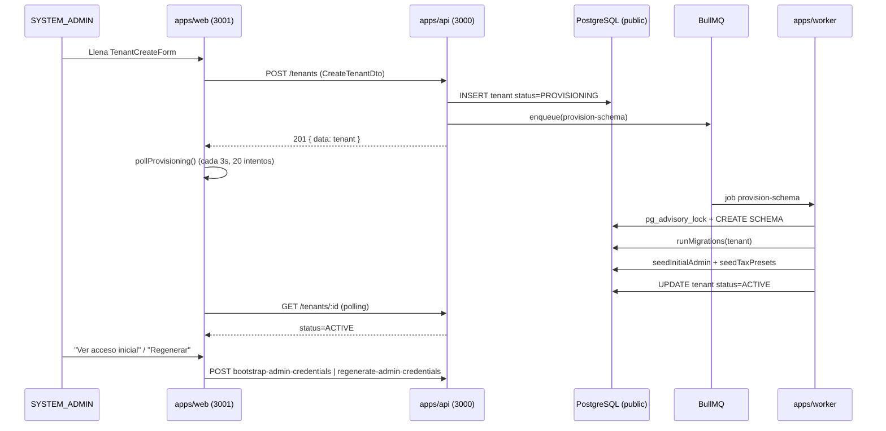

# INFORME DE AUDITORÍA — Creación de empresas (`localhost:3001/tenants`)

**Tipo:** INFORME
**Módulo:** MOD01 (Tenants / Plataforma)
**Fase:** AUDIT
**Versión:** 1.0
**Estado:** Sprint correctivo ejecutado → pendiente de revisión CTO para decisiones residuales
**Fecha:** 2026-04-30
**Modo activo:** Mixto (EM + Architect)
**Identidad:** AI-EM-ARCH

---

## 1. Resumen ejecutivo

Se auditó el flujo end-to-end de **creación de empresas** desde la consola de plataforma `apps/web` (puerto 3001) hasta el provisioning multi-tenant del worker. El flujo es funcional y respeta la arquitectura Modulith + multi-tenant por schema, pero presenta **deuda crítica acotada (1)**, **deuda alta (4)**, **deuda media (7)** y **mejoras de DX/consistencia (6)**, además de **duplicación de código relevante** entre el formulario de creación y el de configuración.

**Veredicto:**
- No bloquea producción para el MVP de plataforma.
- Bloquea cierre limpio de MOD01 si no se resuelve la **deuda crítica DC-01** (idempotencia rota en regeneración de credenciales) y la **deuda alta DA-01** (validación parcial de `settings` en el DTO de creación).
- Recomendación: ejecutar el plan de mejora en **un solo sprint correctivo** antes de avanzar al cierre del módulo.

---

## 2. Alcance auditado

| Capa | Artefactos revisados |
|---|---|
| Frontend `apps/web` | [tenants/page.tsx](apps/web/src/app/(protected)/tenants/page.tsx), [tenants/new/page.tsx](apps/web/src/app/(protected)/tenants/new/page.tsx), [TenantCreateForm.tsx](apps/web/src/components/tenants/TenantCreateForm.tsx), [TenantCreateSummary.tsx](apps/web/src/components/tenants/TenantCreateSummary.tsx), [TenantSettingsForm.tsx](apps/web/src/components/tenants/TenantSettingsForm.tsx), [CredentialsModal.tsx](apps/web/src/components/tenants/CredentialsModal.tsx), [api-client.ts](apps/web/src/lib/api-client.ts) |
| Backend `apps/api` | [tenant.controller.ts](apps/api/src/modules/tenant/tenant.controller.ts), [tenant.service.ts](apps/api/src/modules/tenant/tenant.service.ts), [tenant-provisioning.service.ts](apps/api/src/modules/tenant/tenant-provisioning.service.ts), [tenant.dto.ts](apps/api/src/modules/tenant/dto/tenant.dto.ts) |
| Worker | [tenant-provisioning.processor.ts](apps/worker/src/processors/tenant-provisioning.processor.ts) |

Fuera de alcance: dashboard empresarial (`/me/*`), MOD03 cobertura comercial, planes y productos adicionales (revisados solo para detectar acoplamiento indebido con el flujo de creación).

---

## 3. Mapa del flujo actual



---

## 4. Hallazgos

### 4.1 Deuda crítica (bloquea merge / cierre de módulo)

#### DC-01 — Idempotency-Key mal generada en regeneración de credenciales
**Archivo:** [TenantCreateForm.tsx](apps/web/src/components/tenants/TenantCreateForm.tsx#L437)

```ts
const creds = await tenantApi.regenerateCredentials(createdTenant.id, crypto.randomUUID());
```

Cada clic genera una `Idempotency-Key` nueva. El backend ([tenant.controller.ts](apps/api/src/modules/tenant/tenant.controller.ts#L674-L703)) valida solo presencia, pero el contrato declara explícitamente que reintentos deben producir el mismo password. Si un SYSTEM_ADMIN hace doble clic o pierde la red, **se generan passwords distintos sin trazabilidad**, ambos válidos hasta expiración → riesgo operativo y de auditoría.

**Severidad:** Crítica (rompe contrato de seguridad declarado en el endpoint).

---

### 4.2 Deuda alta

#### DA-01 — `CreateTenantDto.settings` sin validación profunda en boundary
**Archivo:** [tenant.dto.ts](apps/api/src/modules/tenant/dto/tenant.dto.ts#L52-L57)

```ts
@IsOptional()
settings?: Record<string, unknown>;
```

`settings` se acepta como JSON arbitrario. La `ValidationPipe` global con `whitelist: true` **no recursa** dentro de `Record<string, unknown>`, por lo que cualquier clave extra se persiste tal cual en `tenants.settings`. La validación profunda se hace después en el servicio con `validateSync()`, que no se aplica si `dto.settings` no contiene `features`. Esto viola la regla de **"Zod / class-validator en boundaries externos"** del baseline.

**Severidad:** Alta (riesgo de polución de JSON, exposición a inyección de flags futuros).

#### DA-02 — Race condition en `refreshAccessToken()` para llamadas paralelas
**Archivo:** [api-client.ts](apps/web/src/lib/api-client.ts#L122-L135)

No hay singleton de refresh en vuelo. En la página `/tenants` se disparan llamadas paralelas (`list`, `me`, `dashboard summary`); si dos retornan 401 simultáneo, ambas invocan `/auth/refresh`, generando rotación doble de refresh token y posible logout espurio según política RS256 del ADR-019.

**Severidad:** Alta (impacta UX y trazabilidad de sesiones).

#### DA-03 — Validación de formulario reentrante y stale (UX rota en submit)
**Archivo:** [TenantCreateForm.tsx](apps/web/src/components/tenants/TenantCreateForm.tsx#L221-L259)

`handleFormSubmit` hace `await trigger()` y luego lee `errors[field]` síncronamente. `errors` es estado de React y **no se actualiza inmediatamente tras `trigger()`**, por lo que el `Set` de `validationErrors` puede quedar vacío en el primer submit con errores. Para forzarlo el efecto reasigna `activeSection` con `setTimeout(...,0)`. Esto:

1. Duplica el flujo natural de `handleSubmit(onSubmit)` (`react-hook-form` ya valida).
2. Introduce función muerta `getFirstErrorSectionFromErrors` (nunca invocada).
3. Hace que el primer click sobre "Crear empresa" no salte al tab con error en algunos navegadores.

**Severidad:** Alta (falla intermitente de UX en formulario crítico de plataforma).

#### DA-04 — Polling sin cancelación ni backoff
**Archivo:** [TenantCreateForm.tsx](apps/web/src/components/tenants/TenantCreateForm.tsx#L408-L427)

`pollProvisioning` usa `while (attempts < 20)` con `setTimeout` sin `AbortController` ni cleanup en unmount. Si el usuario navega antes de que termine, la promesa sigue corriendo y mutando estado → warning de React + leak. Tampoco hace backoff: 20×3s fijos. Si el provisioning toma 65s (no anómalo en cold start), termina con mensaje "está tomando más tiempo del esperado" aunque el job haya finalizado correctamente.

**Severidad:** Alta (memory/state leak + UX inconsistente).

---

### 4.3 Deuda media

#### DM-01 — Duplicación masiva entre `TenantCreateForm` y `TenantSettingsForm`
Las constantes `TIMEZONE_OPTIONS`, `CURRENCY_OPTIONS`, `LANGUAGE_OPTIONS`, `COUNTRY_OPTIONS`, `COMPANY_TYPE_OPTIONS`, los regex de NIT/DV/coordenadas y la helper `fieldError` están **copiados literalmente** en ambos componentes. Cualquier cambio futuro (ej. agregar `MX` o ajustar regex de NIT) duplica el riesgo de drift.

**Acción:** mover a `apps/web/src/lib/tenant-options.ts` y a `apps/web/src/lib/tenant-validators.ts` (no a `@iwana/shared` salvo que el portal lo necesite también).

#### DM-02 — Esquemas Zod inconsistentes con DTO backend
- `phone`: en `TenantCreateForm` `optionalPhone.max(50)`; en `TenantSettingsForm` `phone.max(20)`; en backend `MaxLength(50)`. Inconsistencia entre formularios y un campo válido al crear deja de serlo al editar.
- `economicSector`: regex CIIU no se valida en frontend (solo `max(10)`); el backend tampoco lo restringe. El placeholder "6110" sugiere formato pero no se exige.

#### DM-03 — Constante `DEFAULT_TENANT_SETTINGS` duplicada con defaults inline
**Archivo:** [tenant.service.ts](apps/api/src/modules/tenant/tenant.service.ts#L55-L64)

`DEFAULT_TENANT_SETTINGS` se define una vez pero los defaults también están escritos a mano dentro de `create()` (`timezone: 'America/Bogota', currency: 'COP'` líneas 117-119). Drift latente.

#### DM-04 — `tenantApi.create` no envuelve la respuesta de provisioning
**Archivo:** [api-client.ts](apps/web/src/lib/api-client.ts#L422-L426)

El cliente desempaqueta `body.data` global, pero no sabe que el tenant recién creado siempre viene en `PROVISIONING`. El componente lo descubre por su cuenta y arranca polling ad-hoc. Sería preferible exponer `tenantApi.createAndWaitForProvisioning(payload, { signal, timeoutMs, onTick })` en la lib y dejar el componente sin lógica de control de tiempo.

#### DM-05 — Inconsistencia semántica de `maxSubscribers = 0`
UI muestra "0 = sin límite", pero la entidad y el DTO usan `@Min(0)` sin diferenciar. Si en el futuro se agrega un plan que prohíba creación, `0` quedará ambiguo. Sugerencia: usar `null` para "sin límite" y reservar `0` para "bloqueado".

#### DM-06 — `findAll` sin filtros operativos
**Archivo:** [tenant.controller.ts](apps/api/src/modules/tenant/tenant.controller.ts#L516-L528)

Solo soporta `limit/offset`. La tabla en `/tenants` ya pide acciones por `status` (suspender, reactivar, retry). No hay filtro `?status=PROVISIONING_FAILED` ni `?search=slug`. Para bases con cientos de tenants será imposible operar.

#### DM-07 — `delete()` ejecuta `DROP SCHEMA CASCADE` sin soft-delete previo
**Archivo:** [tenant.service.ts](apps/api/src/modules/tenant/tenant.service.ts#L1513-L1535)

A pesar de validar `isValidSchemaName`, no existe un estado intermedio `DELETED` ni periodo de retención. Cualquier error de UI o doble clic borra datos productivos. Para Colombia (Habeas Data + retención DIAN) el borrado debe ser **lógico primero, físico tras ventana**. Este endpoint no debería estar disponible en MVP sin ventana de gracia (mínimo 7 días).

---

### 4.4 Mejoras / DX

| ID | Tema | Acción |
|---|---|---|
| MJ-01 | `TenantCreateForm` mide >1100 líneas | Extraer `TenantCreateBasicTab`, `TenantCreateBusinessTab`, `TenantCreateContactTab`, `TenantPostCreatedActions` |
| MJ-02 | `notification` toast manual con `setTimeout` en [tenants/page.tsx](apps/web/src/app/(protected)/tenants/page.tsx#L21) | Usar `Toast` de `@iwana/ui` (ya existe sistema en MOD02) |
| MJ-03 | `confirm()` nativo para suspender/eliminar | Reemplazar por `ConfirmDialog` accesible (WCAG 2.2) |
| MJ-04 | Logs sin `correlationId` en `TenantService.create` | Agregar `traceId` propagado desde el request |
| MJ-05 | `regenerateCredentials` sin trazabilidad de actor en audit | Pasar `userId` del SYSTEM_ADMIN al `AuthService` y registrar `AuditAction.REGENERATE_CREDENTIALS` |
| MJ-06 | Falta test E2E `web-tenant-create-happy-path` | Cubrir creación + polling + ver acceso inicial |

---

### 4.5 Seguridad

| Ítem | Estado | Comentario |
|---|---|---|
| `isValidSchemaName` antes de DDL | OK | Aplicado en worker y en `delete()` |
| `pg_advisory_lock` por tenant | OK | Previene provisioning concurrente |
| Idempotencia provisioning | OK | `jobId = provision-${tenantId}` |
| Throttling endpoint creación | OK | `@Throttle({ limit: 10, ttl: 60000 })` |
| Idempotencia regenerate-credentials | **FALLO** | DC-01 |
| Logs sin PII | OK | Solo `slug`, `id`, `schemaName` |
| Validación `settings` boundary | **PARCIAL** | DA-01 |
| Borrado controlado | **FALLO** | DM-07 |
| Token rotation en paralelo | **FALLO** | DA-02 |

---

## 5. Plan de mejora — propuesta de ejecución

### Sprint correctivo (1 sprint, modo EM+Architect)

**Objetivo:** cerrar deuda crítica y alta antes de cerrar MOD01 conforme a ADR-016.

#### Paquete P1 — Seguridad y contratos (Crítico/Alto)
1. **DC-01:** introducir state `idempotencyKey` en `TenantCreateForm` que se genere **una sola vez por tenant creado**, persistido en `useRef`. Reset al cambiar `createdTenant.id`. Agregar test unitario.
2. **DA-01:** definir `CreateTenantSettingsDto` como `@ValidateNested() @Type(() => CreateTenantSettingsDto)` en `CreateTenantDto`. Eliminar `Record<string, unknown>` y `validateSync()` redundante en el servicio.
3. **DA-02:** convertir `refreshAccessToken()` en singleton de promesa en vuelo (`let refreshPromise: Promise<string> | null`). Documentar en `auth-implementation-patterns`.

#### Paquete P2 — UX y robustez (Alto)
4. **DA-03:** simplificar `handleFormSubmit` → usar solo `handleSubmit(onSubmit, onInvalid)`. Mover salto de tab a `onInvalid` que recibe `errors` directos. Eliminar `validationErrors` state, `getFirstErrorSectionFromErrors`, y el `useEffect` con `setTimeout`.
5. **DA-04:** envolver `pollProvisioning` con `AbortController`; cleanup en `useEffect` al desmontar; backoff incremental hasta 90s; estado `TIMEOUT` distinto de `PROVISIONING_FAILED`.

#### Paquete P3 — Refactor de duplicación (Medio)
6. **DM-01:** crear `apps/web/src/lib/tenant-options.ts` y `apps/web/src/lib/tenant-validators.ts`. Importar desde ambos formularios.
7. **DM-02:** unificar `phone` a `max(50)` y publicar regex CIIU compartido (`/^\d{4,6}$/`).
8. **DM-03:** todos los defaults de `create()` deben leer de `DEFAULT_TENANT_SETTINGS`.

#### Paquete P4 — API y datos (Medio)
9. **DM-04:** exponer `tenantApi.waitForProvisioning(id, { signal, onTick })` desacoplado del componente.
10. **DM-05:** modelar `maxSubscribers: number | null`. Migración aditiva no destructiva (nullable column con default 0).
11. **DM-06:** agregar `?status=` y `?search=` a `findAll` (`ILIKE` sobre `slug`/`name`/`nit`).
12. **DM-07:** introducir status `MARKED_FOR_DELETION` con timestamp; mover el `DROP SCHEMA` al worker tras 7 días. Endpoint `DELETE` queda como soft-delete.

#### Paquete P5 — Observabilidad y DX (Mejoras)
13. **MJ-01:** dividir `TenantCreateForm` en 4 archivos.
14. **MJ-02 / MJ-03:** reemplazar `confirm()` y toasts manuales.
15. **MJ-04 / MJ-05:** trazabilidad audit + correlationId.
16. **MJ-06:** test E2E `e2e/tests/web-tenant-create-happy-path.spec.ts`.

### Definition of Done del sprint correctivo
- [ ] DC-01, DA-01..04 cerrados con test que reproduzca el bug previo.
- [ ] Sin duplicación de constantes entre `TenantCreateForm` y `TenantSettingsForm`.
- [ ] `pnpm lint` y `pnpm typecheck` verdes.
- [ ] Cobertura `apps/api/src/modules/tenant/**` ≥ 80%.
- [ ] E2E `web-tenant-create-happy-path` corriendo en CI.
- [ ] OpenAPI actualizada para `findAll` filtros y `DELETE` con soft-delete.
- [ ] Migración reversible para `maxSubscribers nullable` + `MARKED_FOR_DELETION`.
- [ ] Informe vivo `INFORME-MOD01-AUDIT-CREACION-EMPRESAS-v1.0.md` actualizado a estado **Aprobado** o con sub-versión `v1.1` registrando hallazgos residuales.

### Estimación relativa
- P1: pequeño (1–2 días equivalentes).
- P2: pequeño (1 día).
- P3: pequeño (0.5 día).
- P4: mediano (2–3 días, requiere migración).
- P5: mediano (2 días, mayor parte UI + E2E).

---

## 6. Decisiones que requieren CTO

| Tema | Decisión necesaria |
|---|---|
| Soft-delete con ventana de 7 días (DM-07) | ¿Aprobado como política de plataforma? Requiere ADR (probable extensión de ADR-018 — Ciclo de vida tenant). |
| Cambio de tipo `maxSubscribers` a nullable (DM-05) | Confirmar semántica `null = sin límite` antes de migrar tabla. |
| Persistencia de `Idempotency-Key` en cliente (DC-01) | Validar si debe vivir solo en memoria (`useRef`) o también en `sessionStorage` para resistir reload accidental. |

---

## 7. Riesgos residuales no cubiertos por este plan

- Recuperación cuando worker queda colgado mid-migration tras `pg_advisory_lock` (timeout no acotado).
- Falta de mecanismo para listar tenants `MARKED_FOR_DELETION` y cancelar el borrado.
- Auditoría no diferencia "regenerar por sospecha" de "regenerar por reset operativo" → considerar `reason` opcional en payload.

Estos riesgos se documentan aquí pero no se incorporan al sprint correctivo salvo decisión explícita del CTO.

---

## 8. Referencias

- [PRD Sistema](docs/prds/PRD_Sistema_ISP_Colombia_v2_2.md)
- [HLD MOD01](docs/hlds/) — `HLD-MOD01-ARQUITECTURA-v1.0` Sección 1 (@iwana/tenant)
- [ADR-017 Provisioning Schema BullMQ](docs/adrs/ADR-017-Provisioning-Schema-BullMQ.md)
- [ADR-018 Ciclo de Vida Tenant](docs/adrs/ADR-018-Ciclo-Vida-Tenant.md)
- [ADR-019 JWT RS256 Refresh Rotation](docs/adrs/ADR-019-JWT-RS256-Refresh-Rotation.md)
- [ADR-020 Seed Inicial Credenciales Temporales](docs/adrs/ADR-020-Seed-Inicial-Credenciales-Temporales.md)
- [Stack Tecnológico](docs/prds/Stack_Tecnologico.md)

---

## 9. Addendum de ejecución Fullstack — 2026-04-30

**Modo activo:** Sr. Developer Fullstack

Se ejecutó el sprint correctivo aprobado para cerrar los hallazgos bloqueantes de MOD01 en el flujo de creación y administración de empresas. El alcance se mantuvo dentro del stack existente y sin cambio de boundary Modulith.

### 9.1 Hallazgos cerrados

| Hallazgo | Estado | Evidencia |
|---|---|---|
| DC-01 — Idempotency-Key inestable | Cerrado | `TenantCreateForm` usa estado estable por tenant mediante `getTenantCredentialIdempotencyKey`; prueba unitaria en [tenant-idempotency.spec.ts](apps/web/src/lib/tenant-idempotency.spec.ts). |
| DA-01 — `settings` sin validación profunda | Cerrado | `CreateTenantDto.settings` ahora usa `@ValidateNested()` + `@Type(() => CreateTenantSettingsDto)` y `TenantService.create()` normaliza contra `DEFAULT_TENANT_SETTINGS`. |
| DA-02 — refresh token race condition | Cerrado | `api-client` reutiliza una promesa única de refresh en vuelo; prueba en [api-client.spec.ts](apps/web/src/lib/api-client.spec.ts). |
| DA-03 — validación stale del formulario | Cerrado | `TenantCreateForm` usa `handleSubmit(onSubmit, onInvalid)` y elimina `trigger()` + lectura stale de `errors`. |
| DA-04 — polling sin cancelación/backoff | Cerrado | `tenantApi.waitForProvisioning()` centraliza polling con backoff y `AbortSignal`; el componente cancela en unmount. |
| DM-01 — duplicación de opciones/validadores | Cerrado | Opciones y validadores movidos a [tenant-form-options.ts](apps/web/src/lib/tenant-form-options.ts) y [tenant-form-validation.ts](apps/web/src/lib/tenant-form-validation.ts). |
| DM-02 — validadores inconsistentes | Cerrado parcial | `phone` unificado a 50 caracteres y CIIU validado en frontend; backend mantiene `MaxLength(10)` para `economicSector` y debe endurecer regex si CTO lo exige. |
| DM-03 — defaults duplicados | Cerrado | `TenantService.create()` usa `DEFAULT_TENANT_SETTINGS` para timezone, currency, language, country y features. |
| DM-04 — polling acoplado al componente | Cerrado | Nueva API cliente `tenantApi.waitForProvisioning()`. |
| DM-06 — listado sin filtros | Cerrado | `GET /tenants` soporta `status` y `search`; OpenAPI documentada con `@ApiQuery`. |
| DM-07 — borrado físico inmediato | Cerrado parcial | `delete()` ya no ejecuta `DROP SCHEMA`; marca `status=INACTIVE` y `deletedAt`, con auditoría. Falta política CTO para purga diferida. |

### 9.2 Cambios principales entregados

- Frontend `apps/web`: idempotencia de credenciales, polling cancelable, refresh singleton, validadores compartidos, opciones compartidas, mejoras de primitives UI (`Alert`, `Tabs`, `DropdownMenu`, `CheckboxCard`, `FormPanel`, `FormFieldset`) y formularios migrados a componentes del sistema.
- Backend `apps/api`: DTO de creación endurecido, defaults consistentes, filtros operativos de listado, OpenAPI actualizada, soft-delete lógico de tenants y auditoría de eliminación.
- Base de datos `packages/database`: `Tenant.deletedAt`, `phone VARCHAR(50)` y migración pública reversible [006_soft_delete_tenants_and_phone_length.ts](packages/database/src/migrations/public/006_soft_delete_tenants_and_phone_length.ts).
- Tests: unitarios focalizados para `TenantService`, `TenantController`, `api-client` e idempotencia de credenciales.

### 9.3 Evidencia de verificación

Comandos ejecutados desde raíz del monorepo:

```bash
pnpm --filter @iwana/api test -- tenant.service.spec.ts tenant.controller.spec.ts
pnpm --filter @iwana/web test -- api-client.spec.ts tenant-idempotency.spec.ts
pnpm --filter @iwana/api typecheck
pnpm --filter @iwana/web typecheck
pnpm --filter @iwana/db typecheck
pnpm --filter @iwana/ui typecheck
pnpm --filter @iwana/api lint
pnpm --filter @iwana/web lint
pnpm --filter @iwana/db lint
pnpm --filter @iwana/ui lint
```

Resultado:

- API tenant: **42 tests passing**.
- Web lib: **3 tests passing**.
- Typecheck: **verde** en `@iwana/api`, `@iwana/web`, `@iwana/db`, `@iwana/ui`.
- Lint: **verde** en `@iwana/api`, `@iwana/web`, `@iwana/db`, `@iwana/ui`.

### 9.4 Deuda residual y decisiones pendientes

| Tema | Estado | Acción requerida |
|---|---|---|
| `maxSubscribers: null = sin límite` | No implementado | Requiere decisión CTO/Architect porque cambia semántica pública y migración de datos. Se mantiene `0 = sin límite`. |
| Purga física tras soft-delete | Pendiente | Requiere ADR/política: ventana de retención, cancelación de borrado y job de purga. |
| E2E Playwright de creación de empresa | Pendiente | No se ejecutó ni agregó en esta tanda; requiere ambiente dev con API/worker/PostgreSQL/Redis levantados. |
| ConfirmDialog/Toast global | Pendiente parcial | Persisten `confirm()` y toast local en [tenants/page.tsx](apps/web/src/app/(protected)/tenants/page.tsx); no bloquea DC/DA pero queda como mejora UX. |
| Auditoría específica de regeneración de credenciales | Pendiente | El cliente ya estabiliza idempotencia; falta extender `AuthService`/audit trail con `reason` y actor si CTO lo prioriza. |

### 9.5 Decisión de salida

El flujo queda **apto para cierre técnico de hallazgos críticos y altos** del sistema de creación de empresas. Para cierre completo de MOD01 siguen pendientes las decisiones CTO de semántica `maxSubscribers`, purga física de tenants eliminados y evidencia E2E con infraestructura levantada.

---

## 10. Addendum de cierre de pendientes Architect/CTO — 2026-04-30

**Modo activo:** Mixto (Architect + Sr. Developer Fullstack)

Se ejecutó el cierre de los tres pendientes residuales mediante [ADR-033](../adrs/ADR-033-Ciclo-Vida-Tenant-Purga-Diferida-Limites-Nullable.md) y [PLAN-MOD01-CIERRE-PENDIENTES-CTO-v1.0](../plans/PLAN-MOD01-CIERRE-PENDIENTES-CTO-v1.0.md).

### 10.1 Fases ejecutadas

| Fase | Estado | Resultado |
|---|---|---|
| Fase 1 — `maxSubscribers` nullable | Ejecutada | `null = sin límite`, `0 = bloqueado`, `>0 = límite explícito`; migración pública 007 y contratos actualizados. |
| Fase 2 — purga física diferida | Ejecutada | Nuevo estado `MARKED_FOR_DELETION`, `DELETE` lógico con retención y worker BullMQ `tenant-schema-purge`. |
| Fase 3 — E2E Playwright real | Implementada | Nuevo spec real sin mocks para login plataforma, creación, polling de provisioning y consulta de acceso inicial. |

### 10.2 Nuevos artefactos

- [ADR-033-Ciclo-Vida-Tenant-Purga-Diferida-Limites-Nullable.md](../adrs/ADR-033-Ciclo-Vida-Tenant-Purga-Diferida-Limites-Nullable.md)
- [PLAN-MOD01-CIERRE-PENDIENTES-CTO-v1.0.md](../plans/PLAN-MOD01-CIERRE-PENDIENTES-CTO-v1.0.md)
- [007_tenant_lifecycle_purge_and_nullable_limits.ts](../../packages/database/src/migrations/public/007_tenant_lifecycle_purge_and_nullable_limits.ts)
- [tenant-schema-purge.processor.ts](../../apps/worker/src/processors/tenant-schema-purge.processor.ts)
- [tenant-provisioning.processor.ts](../../apps/worker/src/processors/tenant-provisioning.processor.ts)
- [web-tenant-create-happy-path.spec.ts](../../e2e/tests/web-tenant-create-happy-path.spec.ts)
- [playwright.web.config.ts](../../e2e/playwright.web.config.ts)

### 10.3 Variables operativas

| Variable | Uso | Default |
|---|---|---|
| `TENANT_PURGE_RETENTION_DAYS` | Ventana de retención antes de `DROP SCHEMA` | `30` |
| `TENANT_PURGE_BATCH_SIZE` | Máximo de tenants purgados por corrida | `20` |
| `E2E_PLATFORM_EMAIL` | Usuario de plataforma para E2E real | Sin default |
| `E2E_PLATFORM_PASSWORD` | Contraseña de plataforma para E2E real | Sin default |
| `PLAYWRIGHT_CHROMIUM_EXECUTABLE_PATH` | Ejecutable Chromium externo cuando la cache de Playwright no tiene browser propio | Sin default |

### 10.4 Evidencia de verificación

Comandos ejecutados desde raíz del monorepo:

```bash
pnpm --filter @iwana/api test -- tenant.service.spec.ts tenant.middleware.spec.ts tenant.controller.spec.ts
pnpm --filter @iwana/worker test -- tenant-provisioning.processor.migration.spec.ts tenant-schema-purge.processor.spec.ts
pnpm --filter @iwana/web test -- api-client.spec.ts tenant-idempotency.spec.ts
pnpm --filter @iwana/shared typecheck && pnpm --filter @iwana/db typecheck && pnpm --filter @iwana/api typecheck && pnpm --filter @iwana/worker typecheck && pnpm --filter @iwana/web typecheck && pnpm --filter @iwana/portal typecheck
pnpm --filter @iwana/shared lint && pnpm --filter @iwana/db lint && pnpm --filter @iwana/api lint && pnpm --filter @iwana/worker lint && pnpm --filter @iwana/web lint && pnpm --filter @iwana/portal lint
TMPDIR="$PWD/.tmp" PLAYWRIGHT_CHROMIUM_EXECUTABLE_PATH=/snap/chromium/3423/usr/lib/chromium-browser/chrome pnpm exec playwright test --config e2e/playwright.web.config.ts e2e/tests/web-tenant-create-happy-path.spec.ts --project=chromium
```

Resultado:

- API tenant: **49 tests passing**.
- Worker provisioning + purge: **18 tests passing**.
- Web lib: **3 tests passing**.
- Typecheck: **verde** en `@iwana/shared`, `@iwana/db`, `@iwana/api`, `@iwana/worker`, `@iwana/web`, `@iwana/portal`.
- Lint: **verde** en `@iwana/shared`, `@iwana/db`, `@iwana/api`, `@iwana/worker`, `@iwana/web`, `@iwana/portal`.
- Playwright CLI real: **1 test passing** con Chromium del sistema y `video=off` cuando se usa `PLAYWRIGHT_CHROMIUM_EXECUTABLE_PATH`.

### 10.5 Evidencia E2E real con MCP — 2026-04-30

Se ejecutó el flujo real con infraestructura local levantada (`pnpm dev`) usando Chrome DevTools MCP y Playwright MCP:

| Paso | Resultado |
|---|---|
| Login plataforma | OK, redirige a `/dashboard`. |
| Creación empresa E2E | OK, `POST /tenants` creó `Empresa E2E MCP 20260430 1153`. |
| Contrato `maxSubscribers` | OK, API devuelve `maxSubscribers: null`. |
| Provisioning worker | Falló inicialmente por advisory lock fuera de rango (`3108884640`), se corrigió y el job reintentado terminó `completed`. |
| Estado final tenant | OK, API devuelve `status: ACTIVE`. |
| Acceso inicial bootstrap | OK, `POST /tenants/:id/bootstrap-admin-credentials` devuelve `200`, email bootstrap vigente y contraseña temporal presente. |

El bug encontrado en E2E fue corregido convirtiendo el hash FNV usado para `pg_advisory_lock(int,int)` a entero firmado de 32 bits (`hash | 0`) en provisioning y purga diferida. La regresión quedó cubierta para el schema real que falló.
