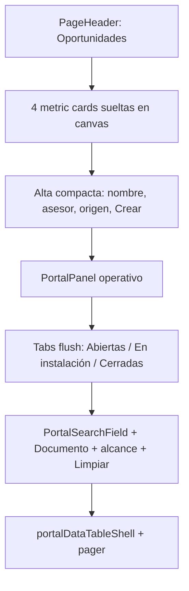

# INFORME-MOD05-CRM-LANDING-AUDITORIA-UIUX-v1.0

## Auditoría de identidad, accesibilidad, copy y UX — landing CRM «Oportunidades»

**Versión:** 1.0  
**Estado:** Vigente  
**Fecha:** 2026-08-19  
**Modo activo:** Ejecutor  
**Autor de consolidación:** Cursor  
**Módulo:** MOD05 — CRM (landing de listado)  
**Superficie:** `/dashboard/crm/` (redirect) y `/dashboard/crm/expedientes`  
**Skills aplicadas:** `iwana-identity-ui-review` · `senior-ui-systems-designer` · `ui-ux-pro-max` · `system-vocabulary-review` · `docs-architect`

**Artefactos relacionados:**

- [PRD-MOD05-CRM-DEFINICION-v2.0](../prds/PRD-MOD05-CRM-DEFINICION-v2.0.md)
- [ADR-065 — Paginación numerada y orden por columna](../adrs/ADR-065-Paginacion-Numerada-Tablas-Operativas.md)
- [Diseño — Dirección visual "Firma iWana"](../specs/2026-07-12-firma-iwana-diseno-visual-design.md)
- Vocabulario de producto: `Expediente*` → **oportunidad** (`apps/portal/src/lib/audit-vocabulary.ts`)

---

# Review UI — Oportunidades / listado CRM (MOD05)

## Resumen ejecutivo

La landing de CRM es un **listado operativo** cuya tarea principal es encontrar o crear una oportunidad y abrirla. El diagnóstico previo (código + captura) midió **59/100**: cuatro `Card` apilados, hueco estructural entre pestañas y filtros, copy mezclado (potencial / expediente / CRM / pipeline) y listado sin contrato ADR-065. La remediación recompone la pantalla (opción C): `PageHeader`, KPIs sueltos, alta compacta y un `PortalPanel` con pestañas al borde, toolbar y tabla paginada.

**Modo:** código + screenshot (fase de diagnóstico) y código post-remediación.  
**Script:** 0 deterministas · 0 heurísticos confirmados · 0 descartados (post-remediación).  
**Puntaje inicial:** 59/100 (P0: 0, P1: 2, P2: 6, P3: 3).  
**Puntaje post-remediación:** 100/100 (P0: 0, P1: 0, P2: 0, P3: 0).

---

## 1. Alcance y método

### 1.1 Alcance

- Listado de oportunidades en `apps/portal/src/app/dashboard/crm/expedientes/page.tsx` y `ExpedientesLandingClient`.
- Composición visual: header, KPIs, alta mínima, pestañas, filtros, tabla, pager y estados.
- Copy visible de la landing (tabs, labels, vacíos, CTAs).
- Contrato de listado (`page` / `limit` / `meta`) y filtros en URL.

**Fuera de alcance:** detalle `/expedientes/[id]`, suscriptores, backend de `findAll` (ya emitía `meta` con `randomAccess: true`).

### 1.2 Fuentes de evidencia

| Fuente | Resultado |
| --- | --- |
| `node .agents/skills/iwana-identity-ui-review/scripts/audit-ui.mjs` sobre landing + page | 0 P0 · 0 P1 · 0 P2 · 0 P3 |
| `ExpedientesLandingClient.tsx` | Panel operativo, tabs flush, toolbar, tabla, pager ADR-065 |
| `expediente-list-view.ts` | Labels de vista y vacíos en vocabulario «oportunidad» |
| `crmApi.listExpedientes` | Dual-emit `ListResponse` + `total` requerido; `page`/`limit` en query |
| Jest landing | 11/11 PASS (`ExpedientesLandingClient.spec.tsx` + `expediente-list-view.spec.ts`) |
| Playwright (grep listado/filtros) | 2/2 PASS |
| Typecheck portal | `tsc --noEmit` exit 0 |

---

## Hallazgos críticos (P0)

Ninguno.

---

## Hallazgos (diagnóstico previo — todos remediados)

### [P1][Ingeniería] Listado sin contrato ADR-065

- **Evidencia (antes):** `listExpedientes({ limit: 100 })`; `page`/`search`/`documentNumber` no vivían en la URL (solo `view`).
- **Impacto:** el comercial no paginaba ni recuperaba filtros con Atrás; extracción amplia de PII en un solo fetch.
- **Remediación:** `useTableQueryState` con `view`, `search`, `documentNumber`, `allViews`; debounce 350 ms; `normalizeListMeta` + `PortalTablePager` / `PortalPageSizeSelect`; default `PORTAL_DEFAULT_PAGE_SIZE` (20). Cliente tipado `ListResponse<ExpedienteRecord> & { total: number }` (`api-client.ts`).
- **Esfuerzo:** M
- **Estado:** cerrado.

### [P1][Accesibilidad] Búsqueda sin label asociado

- **Evidencia (antes):** `Input` de nombre sin `label` ni `sr-only` (placeholder-only, WCAG 3.3.2).
- **Impacto:** lectores de pantalla y zoom no tenían nombre persistente del control principal.
- **Remediación:** `PortalSearchField` con `label="Buscar oportunidad"` (sr-only en la primitive). Documento con `aria-label="Documento"`.
- **Esfuerzo:** S
- **Estado:** cerrado.

### [P2][Diseño] Hueco estructural tabs + filtros

- **Evidencia (antes):** `CardContent` `pt-6` + tabs `mb-4` + `lg:items-end` con un campo con label visible y otro sin él. El input de búsqueda bajaba y dejaba un rectángulo blanco bajo el subrayado de «Abiertas».
- **Remediación:** un `PortalPanel` `p-0`; tablist flush al borde (`border-b`, sin margen inferior extra); toolbar `lg:items-center` con labels sr-only / `aria-label` en ambos campos.
- **Esfuerzo:** M
- **Estado:** cerrado.

### [P2][Identidad] Cuatro Cards en lugar de primitivas

- **Evidencia (antes):** KPIs envueltos, alta, tabs+filtros y tabla cada uno en `Card`.
- **Remediación:** 4 `PortalMetricCard` sueltos en canvas; alta en `PortalPanel` compacto; listado en un panel operativo con `portalDataTableShellClassName`.
- **Esfuerzo:** M
- **Estado:** cerrado.

### [P2][Copy] Vocabulario mezclado

- **Evidencia (antes):** CRM operativo, potencial, expediente, pipeline, Convertidas, Archivo, Originador, UUID recortado.
- **Remediación:** título «Oportunidades»; tabs Abiertas / En instalación / Cerradas; columna «Nombre»; «Asesor de origen»; vacíos con `getExpedienteEmptyCopy()`. «CRM» queda en navegación, no en CTAs ni vacíos.

| Antes | Ahora |
| --- | --- |
| CRM operativo / Pipeline de oportunidades | Oportunidades |
| potencial (columna) | Nombre |
| Convertidas | En instalación |
| Archivo | Cerradas |
| Documento exacto | Documento |
| Buscar en todo CRM | Incluir todas las vistas |
| Originador | Asesor de origen |
| ID + UUID recortado | Oculto |

- **Estado:** cerrado en la landing.

### [P2][UX] «Buscar en todo CRM» parecía Submit

- **Evidencia (antes):** botón `variant="secondary"` que solo activaba búsqueda global; escritura disparaba fetch sin debounce.
- **Remediación:** checkbox `portalCheckboxClassName` «Incluir todas las vistas» (deshabilitado sin texto); `view=all` solo con texto de búsqueda o documento; debounce en drafts.
- **Estado:** cerrado.

### [P2][UX] Vacío sin acción + spinner de página + error duplicado

- **Remediación:** `PortalSkeletonBlock` en filas de tabla; `PortalEmptyState` con CTA (crear o limpiar filtros); `PortalAlert` de listado separado del de alta.
- **Estado:** cerrado.

### [P3] Alta inline competía con el listado

- **Remediación:** el alta queda como fila compacta bajo los KPIs, con «Crear» en el formulario. El título de página no lleva botón ni badge de conteo.
- **Estado:** cerrado (alta en página conservada por volumen comercial, según plan).

---

## Quick wins

Ejecutados en esta entrega: label de búsqueda (S), copy de tabs (S), checkbox de alcance (S), empty/skeleton/alert (S–M).

## Mejoras estratégicas

Ninguna primitive nueva. Se reutilizan `PortalPanel`, `PortalSearchField`, `PortalMetricCard`, `portalDataTable*`, `PortalTablePager` y `useTableQueryState`, alineado a Usuarios/Suscriptores.

## Por verificar

1. Contraste computado en navegador (no medido en esta fase).
2. Detalle `/expedientes/[id]` conserva copy interno («expediente» en rutas/API); fuera de alcance.
3. Advertencias `act(...)` en Jest del landing: no bloquean; no son hallazgo de UI.

## Veredicto

**Aprobada** tras remediación. La landing usa primitivas del portal, vocabulario «oportunidad», pestañas al borde del panel y paginación ADR-065. El hueco de la captura se elimina por composición (labels alineados + tabs flush), no recortando padding a ciegas.

---

## 2. Composición objetivo (opción C)

---

## 3. Veredicto por criterio (post-remediación)

| Criterio | Veredicto | Evidencia principal |
| --- | --- | --- |
| Identidad iWana | Cumple | `PageHeader`, `PortalMetricCard`, `PortalPanel`, underline navy (`portalTabActiveClassName`) |
| Hueco tabs/filtros | Cumple | tablist flush + toolbar `lg:items-center` (`ExpedientesLandingClient.tsx:586-656`) |
| Estados de carga | Cumple | `PortalSkeletonBlock` en filas (`:688-695`); Suspense de ruta con bloques |
| Empty states | Cumple | `PortalEmptyState` + CTA crear o limpiar (`:704-730`) |
| Copy de producto | Cumple | `expediente-list-view.ts:23-61`; título «Oportunidades» |
| Accesibilidad estructural | Cumple | `role="tablist"`, `aria-selected`, labels sr-only / `aria-label`, `aria-live` de carga |
| Paginación y filtros | Cumple | `useTableQueryState` (`:144-148`); pager `Mostrando x–y de n oportunidades` |

---

## 4. Evidencia de cumplimiento

### 4.1 Identidad y composición

- El route file es Server Component con metadata «Oportunidades»; el dashboard vive en `ExpedientesLandingClient`.
- CTA de alta: formulario compacto «Crear» bajo los KPIs; vacío de primera vez con «Nueva oportunidad». El `PageHeader` no lleva acciones.
- KPIs sueltos, sin card padre «Resumen ejecutivo» (`:457-469`).
- Tabs con `interactiveFocusClassName` y badge `bg-iwana-primary/10 text-iwana-primary` (`:603-613`).

### 4.2 Listado ADR-065

- Filtros y página en URL; `replace` en filtros, `push` en página (hook compartido).
- `effectiveView = 'all'` solo si `allViews=1` **y** hay search o documento (`:173-174`).
- Pager con `resource` singular/plural «oportunidad(es)» (`:800-820`).
- `total` del cliente permanece **requerido** para no romper consumidores dual-emit (p. ej. operaciones).

### 4.3 Copy y vacíos

- Abiertas / En instalación / Cerradas; «Todas las vistas» solo como alcance de búsqueda.
- Vacío filtrado: «No se encontraron resultados» + limpiar. Primera vez: «Aún no hay oportunidades abiertas» + crear.

---

## 5. Verificación ejecutada

| Comando | Resultado |
| --- | --- |
| `audit-ui.mjs` (landing + page + list-view) | `{ P0:0, P1:0, P2:0, P3:0 }` |
| `pnpm --filter @iwana/portal exec jest …ExpedientesLandingClient.spec.tsx …expediente-list-view.spec.ts` | 11 passed |
| `pnpm --filter @iwana/portal exec tsc --noEmit -p tsconfig.json` | exit 0 |
| `playwright test portal-crm-expedientes.spec.ts --grep "crear, listar\|envía filtros"` | 2 passed |

---

## 6. Decisión y disposición

**Decisión:** aprobar la landing CRM de oportunidades tras la recomposición.

**Disposición:**

- Mantener el listado extraído en `apps/portal/src/components/crm/expedientes/`.
- No reintroducir `Card` envolviendo tabs + tabla.
- No usar «CRM», «pipeline» ni UUID en CTAs o vacíos de esta superficie.
- El detalle de oportunidad y suscriptores no se reabren en este informe.

---

## 7. Límites y deuda no bloqueante

- Esta revisión no sustituye una auditoría de seguridad backend ni una medición de contraste en navegador.
- Los tests E2E del detalle (instalación, consentimiento, viabilidad) no forman parte del puntaje de esta landing; el grep de listado/filtros sí se ejecutó en verde.
- Las advertencias Jest `act(...)` al hidratar el listado son ruido de test, no defecto de producto.

---

## 8. Cierre

La landing cumple la dirección visual Firma iWana y los patrones operativos del portal (Usuarios/Suscriptores). El comercial ve en el primer viewport el título, el estado del embudo, el alta de un renglón y las primeras filas, con pestañas pegadas al panel y filtros sin hueco estructural.

**Veredicto final:** **Aprobada — 0 P0 · 0 P1 · 0 P2 · 0 P3 accionables** (post-remediación).

No se incluyen PII, secretos, credenciales ni tokens en este informe.
