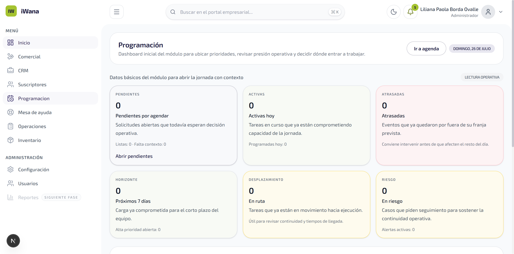
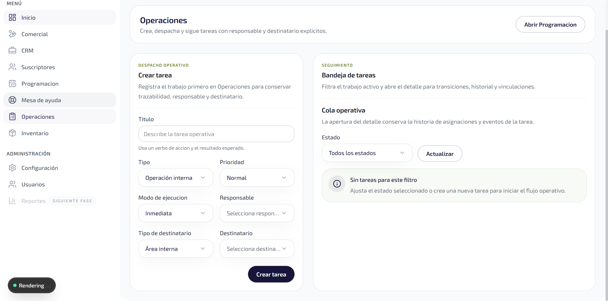

# INFORME - MOD09 Bugfix: Columna `sector` faltante en `schedule_events`

**Version:** 1.1
**Estado:** Cerrado — Verificado en vivo
**Fecha:** 2026-07-26
**Modo activo:** Ejecutor
**Autor:** AI-EM-ARCH (ejecutor)
**Modulo:** MOD09 Programacion / WFM
**Severidad:** P0 (500 en endpoint productivo)
**Impacto colateral:** Bloqueaba renderizado de Programacion y Operaciones en el portal

---

## 1. Sintoma

El endpoint `GET /api/v1/wfm/events` devolvia **500 Internal Server Error** en el portal (`localhost:3002/dashboard/scheduling`). El resto de endpoints WFM (`work-orders`, `visit-requests`, `dashboard/summary`, `eligible-assignees`) respondian correctamente.

**Request que fallaba:**
```
GET http://localhost:3002/api/v1/wfm/events?from=2026-07-26T05:00:00.000Z&to=2026-07-27T04:59:59.999Z&page=1&limit=100
HTTP 500
```

**Error PostgreSQL en el response body:**
```
QueryFailedError: column se.sector does not exist
    at PostgresQueryRunner.query
    at async SelectQueryBuilder.getManyAndCount
    at async schedule-events.service.ts:140:29
```

---

## 2. Causa raiz

La entidad `ScheduleEvent` (`packages/database/src/entities/schedule-event.entity.ts:100-101`) declara la columna `sector`:

```typescript
@Column({ type: 'varchar', length: 120, nullable: true })
sector: string | null;
```

La migracion que agrega esta columna existe como archivo: `packages/database/src/migrations/tenant/033_add_schedule_event_sector.ts`. Sin embargo, **nunca fue registrada en el runner** de migraciones tenant (`packages/database/src/migrations/tenant/runner.ts`). El array `TENANT_MIGRATIONS` saltaba de `032` a `034`, omitiendo la `033`:

```
// runner.ts — ANTES (bug)
AddExpedienteToTicketSubjectType1700000000032,   // 032
CreateVisitRequests1700000000034,                // 034 ← salto
```

Al hacer el SELECT, TypeORM generaba la query incluyendo la columna fantasma `se.sector` desde los metadatos de la entidad, pero PostgreSQL no la encontraba en la tabla real.

---

## 3. Correccion aplicada

### 3.1 Registro de migracion en runner.ts

**Archivo:** `packages/database/src/migrations/tenant/runner.ts`

- Se agrego el import (linea entre 032 y 034):
  ```typescript
  import { AddScheduleEventSector1700000000033 } from './033_add_schedule_event_sector';
  ```

- Se agrego la entrada en el array `TENANT_MIGRATIONS`:
  ```typescript
  AddScheduleEventSector1700000000033,  // ← nueva entrada
  ```

### 3.2 Ejecucion de migracion

```bash
pnpm --filter @iwana/db build
pnpm --filter @iwana/db migration:tenant:run
```

Resultado: `Done tenant_iwana in 43ms`. La migracion aplico:
- `ALTER TABLE schedule_events ADD COLUMN IF NOT EXISTS sector VARCHAR(120)`
- `CREATE INDEX IF NOT EXISTS idx_schedule_events_tenant_location ON schedule_events (tenant_id, municipality, sector) WHERE deleted_at IS NULL`

---

## 4. Evidencia de verificacion

### 4.1 Network — Programacion (scheduling) POST-FIX

Todos los endpoints WFM responden 200/304. El endpoint `/wfm/events` que antes fallaba con 500 ahora responde correctamente:

| ReqID | Endpoint | Status |
|-------|----------|--------|
| 552 | `/api/v1/wfm/dashboard/summary` | **304** |
| 553 | `/api/v1/wfm/work-orders?page=1&limit=100` | **304** |
| 554 | `/api/v1/wfm/visit-requests?page=1&limit=12` | **304** |
| **555** | **`/api/v1/wfm/events?from=...&to=...&page=1&limit=100`** | **304** ← corregido |
| 556 | `/api/v1/wfm/eligible-assignees` | **304** |



### 4.2 Network — Operaciones POST-FIX

Sin errores en consola, todos los endpoints responden correctamente:

| ReqID | Endpoint | Status |
|-------|----------|--------|
| 509 | `/api/v1/tasks?page=1&limit=20` | **304** |
| 510 | `/api/v1/users?limit=100` | **304** |



### 4.3 Typecheck

```bash
pnpm --filter @iwana/db typecheck  # → Verde, sin errores
```

### 4.4 Response body (antes vs despues)

| Estado | Response |
|--------|----------|
| Antes | `<pre>QueryFailedError: column se.sector does not exist</pre>` |
| Despues | `{ "data": [], "meta": { "total": 0, "page": 1, "limit": 100, ... } }` |

### 4.5 Consola del navegador POST-FIX

Cero errores de red o JavaScript en Programacion y Operaciones.

---

## 5. Archivos modificados

| Archivo | Cambio |
|---------|--------|
| `packages/database/src/migrations/tenant/runner.ts` | +2 lineas (import + entrada en array) |

No se modificaron entidades, servicios, controladores ni DTOs. La migracion `033_add_schedule_event_sector.ts` no fue alterada (ya existia correctamente).
