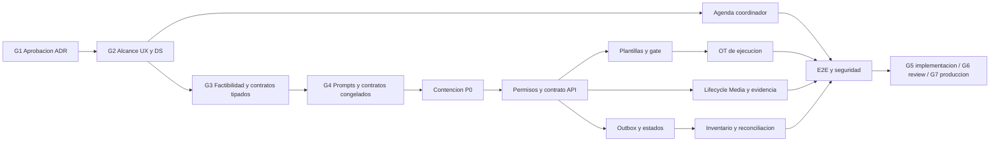

# OT de instalacion MOD09–MOD11 Implementation Plan

> **For agentic workers:** REQUIRED SUB-SKILL: Use `subagent-driven-development` (recommended) or `executing-plans` to implement this plan task-by-task. Steps use checkbox (`- [ ]`) syntax for tracking.

**Goal:** Consolidar una OT de instalacion segura, inmutable y trazable, con Agenda enfocada en coordinacion y MOD11 como unica verdad de ejecucion.

**Architecture:** MOD09 conserva solicitud, agenda y supervision; MOD11 conserva OT, plantilla aplicada, actividades, evidencia y cierre; MOD12 conserva custodia y movimientos. La sincronizacion entre owners usa outbox tenant-aware, consumidores idempotentes y reconciliacion según ADR-068 (Aprobado).

**Tech Stack:** NestJS, Next.js App Router, TypeScript estricto, TypeORM, PostgreSQL multi-tenant por schema, Redis/BullMQ, OpenAPI, Jest/Supertest y Playwright.

---

**Version:** 1.0  
**Estado:** Auditoría arquitecto remediada (6 P0 + 2 P1 cerrados); G6/G7 pending re-gate  
**Fecha:** 2026-07-27  
**Autor:** AI-EM-ARCH  
**Protocolo:** `docs/roles/Protocolo_Colaboracion_Multiagente_v1.md`

## 1. Reglas de orquestacion

- AI-EM-ARCH no escribe codigo: mantiene decisiones, prioridades, contratos, gates y stop/go.
- Fases 01–03 quedan autorizadas tras la aprobación CTO de ADR-068; cada carril conserva sus gates técnicos y revisión.
- Fase 00 puede emitirse separadamente en G4 bajo ADR-046/ADR-047 para contener BOLA, terminalidad y replay; no puede introducir outbox, saga ni cambio de boundary.
- Ningun agente edita archivos fuera de su ownership sin handoff explícito.
- Todo cambio parte de prueba fallida, implementacion minima y verificacion focalizada.
- Cada tarea produce un commit revisable; no mezclar fases ni refactors adyacentes.
- Toda desviacion de boundary, seguridad o contrato detiene la tarea y escala.

## 2. Mapa de ownership

| Carril | Owner | Archivos/responsabilidad |
| --- | --- | --- |
| Arquitectura y gates | AI-EM-ARCH | ADR, PRD/HLD, plan, prompts, informe y stop/go |
| Experiencia | AI-PROD-UX | journey, estados, copy y aceptación UX; no codigo |
| Contrato DS | AI-DS-OWNER | tokens, API de composiciones, estados; no codigo |
| Backend | AI-SR-FULL | MOD11, contratos compartidos, OpenAPI, integración por eventos |
| Frontend | AI-FE-PLATFORM | `apps/portal`, `@iwana/ui`, RSC/client split y accesibilidad |
| Datos | AI-DATA-ENG, on-demand | consulta de modelo e integración de datos; AI-SR-FULL conserva ownership de entidades, migraciones, outbox, índices y reconciliacion |
| Seguridad | AI-SEC-ENG | factibilidad AppSec en G3 y auditoria de implementación en G6 |
| Calidad | AI-SR-QA | estrategia, unit/integration/E2E, a11y y evidencia G6 |

## 3. Orden de ejecucion

### Task 0: Cerrar G1–G4 y congelar contratos

**Owner:** AI-EM-ARCH; reviews cruzados AI-PROD-UX, AI-DS-OWNER, AI-SR-FULL, AI-SEC-ENG, AI-SR-QA  
**Files:**

- Modify: `docs/adrs/ADR-068-Sincronizacion-OT-Ejecucion-Proyecciones-Operativas.md` (Aprobado)
- Modify: `docs/specs/2026-07-27-mod09-mod11-ot-instalacion-coordinador-design.md`
- Modify: `docs/specs/2026-07-27-mod09-mod11-ot-instalacion-ds-contrato.md`
- Modify: `docs/specs/2026-07-27-mod09-mod11-ot-instalacion-contrato-api.md`
- Create: `packages/shared/src/contracts/operations/execution-orders.ts` — AI-SR-FULL, contrato tipado
- Modify: `packages/shared/src/index.ts` — export del contrato
- Create: `apps/api/openapi/tasks-execution-orders.v1.json` — OpenAPI máquina-legible
- Modify: `apps/api/src/modules/tasks/tasks.swagger.spec.ts` — AI-SR-FULL, OpenAPI ejecutable
- Modify: prompts Fase 00–04 — AI-EM-ARCH, declaración de congelación

- [x] Registrar aprobación CTO de ADR-068 y reconciliar ADR-034/035.
- [x] Resolver por escrito cada objecion de UX, DS, backend, seguridad y QA documental.
- [x] G2: AI-EM-ARCH aprueba alcance de UX/DS, sin declarar congelación prematura.
- [x] G3: AI-SR-FULL materializa contrato y emite factibilidad; AI-SEC-ENG/AI-DATA-ENG/AI-PLAT-OPS revisan su dominio.
- [x] AI-SR-FULL publica tipos request/response/error en `@iwana/shared` y OpenAPI verificable antes de que frontend derive mocks.
- [x] G4: AI-EM-ARCH promueve los prompts y declara literalmente "contrato de componente congelado" y "contrato de API congelado", citando ruta, version, tipos y OpenAPI.
- [x] Congelar nombres de permisos, comandos, estados, eventos y componentes.
- [x] Registrar en el informe vivo la fecha y hash documental de congelacion.
- [x] Ejecutar `pnpm audit:adr-citations` y obtener 0 bloqueantes.
- [x] Ejecutar `pnpm audit:doc-locations` y obtener 0 hallazgos.
- [x] Commit documental: `docs(operations): freeze installation work order contracts`.

**Corte de revisión 2026-07-27:** G1–G6 cerrados. G5 backend (Tasks 1-5, 7A, 8) y frontend (Tasks 6-7) completados. G6 QA+SEC re-gate GO (582 tests, 0 P0/P1 abiertos, 2 auditores verificados). G7 pendiente decisión CTO. Task 10 diferida post-release.

### Task 1: Contener mutaciones inseguras y estados terminales

**Owner:** AI-SR-FULL; review AI-SEC-ENG y AI-SR-QA  
**Files a localizar/confirmar antes de editar:**

- Modify: `apps/api/src/modules/tasks/execution-orders.controller.ts`
- Modify: `apps/api/src/modules/tasks/services/execution-orders.service.ts`
- Test: `apps/api/src/modules/tasks/tests/execution-orders.controller.http.spec.ts`
- Test: `apps/api/src/modules/tasks/tests/execution-orders.service.spec.ts`

- [x] Escribir pruebas que nieguen lectura/escritura por UUID sin alcance o asignacion.
- [x] Escribir pruebas de mass assignment para tenant, actor, estado, asignación, version, metadata y campos desconocidos.
- [x] Escribir pruebas de DTO minimizado y redacción de PII/textos libres en respuesta, logs y auditoria.
- [x] Ejecutar pruebas focalizadas y confirmar que fallan por ausencia del control.
- [x] Escribir pruebas que rechacen actividad, consumo, evidencia, reasignacion o segundo cierre sobre estados terminales.
- [x] Implementar guards/politicas y precondiciones sin depender de controles frontend.
- [x] Ejecutar las pruebas focalizadas y confirmar éxito.
- [x] Solicitar review de AI-SEC-ENG antes del commit.
- [x] Verificar `429` por actor/tenant; AI-PLAT-OPS aporta evidencia de TLS/terminación en G5.
- [x] Commit: `4a6c6094` — `fix(operations): enforce execution order ownership and immutability` (53 tests, 7 files, tenant-aware throttling con 3 buckets).

### Task 2: Introducir permisos por capacidad

**Owner:** AI-SR-FULL; consulta AI-DATA-ENG si hay seeds/migracion; review AI-SEC-ENG  
**Files esperados:**

- Modify: contratos de permisos en `packages/shared/`
- Modify: seeds/migraciones de acceso en `packages/database/`
- Modify: politica/controladores en `apps/api/src/modules/tasks/`
- Test: specs de access-control y execution-orders

- [x] Crear pruebas para `execute`, `supervise` y `templates.manage`, incluyendo contratista asignado.
- [x] Crear pruebas negativas para coordinador sin permiso de ejecución y ejecutor no asignado.
- [x] Implementar permisos canónicos `read`, `execute`, `supervise`, `templates.read`, `templates.manage`, `execution_events.redrive` y alias temporal medible de `wfm.work_orders.execute`.
- [x] Migrar catálogo/perfiles `MOD00_ACCESS_V1` sin otorgar privilegios implícitos y probar compatibilidad.
- [x] Documentar el alias como deprecado y su condición de retiro.
- [x] Ejecutar migraciones en schema de prueba y revertirlas.
- [x] Ejecutar test de aislamiento entre dos tenants.
- [x] Commit: `c31c9192` — `feat(access): add execution order capability permissions` (107 tests, 6 permisos canónicos, migración 092 reversible).

### Task 3: Publicar contrato OpenAPI y control de concurrencia

**Owner:** AI-SR-FULL; review AI-SR-QA y AI-SEC-ENG  
**Files esperados:**

- Modify: `apps/api/src/modules/tasks/dto/execution-orders.dto.ts`
- Modify: `apps/api/src/modules/tasks/execution-orders.controller.ts`
- Modify: OpenAPI generado/validado según baseline del repo
- Test: `apps/api/src/modules/tasks/tests/execution-orders.controller.http.spec.ts`

- [x] Escribir contratos HTTP para idempotency key, version esperada, errores 403/404/409/422 y `allowedActions`.
- [x] Probar reintento de iniciar, registrar y cerrar con misma clave.
- [x] Probar misma clave+mismo payload como replay y misma clave+payload distinto como `409`.
- [x] Probar atomicidad única de registro idempotente, mutación, outbox y audit-intent, propagando `intentId` estable; probar expiración y replay tras el horizonte definido.
- [x] Inyectar fallo al persistir audit-intent y comprobar rollback completo; inyectar fallo de entrega y comprobar retry/DLQ sin pérdida.
- [x] Probar bodies tipados 403/404/409/422 y ausencia de enumeración.
- [x] Probar conflicto de version y dos cierres concurrentes.
- [x] Implementar respuestas estables sin exponer existencia fuera de alcance.
- [x] Validar OpenAPI y TypeScript estricto.
- [x] Commit: `8e853420` — `feat(operations): version execution order commands` (139 tests, 14 files, allowedActions + syncState + ETag/If-Match).

### Task 4: Implementar outbox tenant-aware y convergencia

**Owner:** AI-SR-FULL; consulta AI-DATA-ENG para modelo/relay tenant; review AI-EM-ARCH de boundary y AI-SR-QA  
**Files esperados:**

- Create/Modify: entidad y migracion tenant de outbox en `packages/database/`
- Create: publicador/consumidores dentro de los modulos owners
- Modify: `apps/worker/` para jobs tenant-aware
- Test: integración de commit+outbox, duplicados, orden y reconciliacion

- [x] Escribir prueba de atomicidad entre cambio de OT y registro outbox.
- [x] Escribir prueba que un evento duplicado no repite efecto.
- [x] Escribir prueba que una version antigua no revierte una proyeccion nueva.
- [x] Implementar envelope y resolución explícita de tenant en worker.
- [x] Implementar relay con lease, scanner de tenants confiable, inbox, retry, DLQ y re-drive auditado.
- [x] Probar crash-window commit→enqueue y enqueue→mark sin pérdida ni efecto duplicado.
- [x] Implementar matriz de convergencia aprobada.
- [x] Implementar reconciliador y métricas de lag/discrepancia.
- [x] Ejecutar migracion tenant y rollback en dos schemas de prueba.
- [x] Probar constraint único `(tenant_id, schedule_event_id)`, carrera del consecutivo y control optimista `version`.
- [x] Commit: `9ea24f99` — `feat(operations): synchronize execution projections through outbox` (26 tests, 24 files, convergencia 6 filas, relay health endpoint, DLQ con redrive, VisitRequestStatus extendido).

### Task 5: Implementar plantillas versionadas y gate de cierre

**Owner:** AI-SR-FULL; consulta AI-DATA-ENG para persistencia; review AI-PROD-UX, AI-SEC-ENG, AI-SR-QA  
**Files esperados:**

- Create/Modify: entidades y migracion tenant de plantillas/snapshot
- Create/Modify: servicios/controladores MOD11 de administración y evaluación
- Test: versionado, publicación, retiro, snapshot e incompletitud 422

- [x] Escribir prueba que una version publicada es inmutable.
- [x] Escribir prueba que una OT conserva su plantilla aunque se publique una version nueva.
- [x] Escribir tabla de casos de cierre por ejecutada, observada, no ejecutada y seguimiento.
- [x] Implementar evaluador determinista que devuelve faltantes localizables.
- [x] Auditar schemas configurables para evitar expresiones o componentes arbitrarios.
- [x] Ejecutar tests y migracion reversible.
- [x] Commit: `5de2f5eb` — `feat(operations): add versioned work order close templates` (29 tests, 17 files, 3 entidades + migración 094, gate determinista 422 con `missingRequirements[]`).

### Task 6: Simplificar Agenda al rol de coordinador

**Owner:** AI-FE-PLATFORM; contrato AI-DS-OWNER; aceptación AI-PROD-UX; QA AI-SR-QA  
**Files a confirmar con búsqueda antes de editar:**

- Modify: `apps/portal/src/components/scheduling/ScheduleEventDrawer.tsx`
- Modify/Create: composiciones reutilizables en `packages/ui`
- Test: unit/component tests de estados y permisos
- Test: Playwright de Agenda

- [x] Escribir pruebas de `OperationalSidePeek` para ready, stale, conflict, forbidden, offline y terminal.
- [x] Extender `ProgressMeter` mediante pruebas para recibir `label` y `ariaLabel`; eliminar el texto accesible fijo antes de usarlo en requisitos de instalación.
- [x] Verificar que Agenda no renderiza formularios de ejecución ni selectores genéricos.
- [x] Implementar resumen, alerta, siguiente acción y enlace a OT.
- [x] Externalizar labels; no renderizar enums crudos ni UUID prominentes.
- [x] Validar foco, Escape, retorno de foco, teclado y responsive.
- [x] Ejecutar auditoria WCAG y captura visual desktop/movil.
- [x] Commit: `e2ecc74d` — `refactor(scheduling): focus event detail on coordination` (51 tests, 3 suites, Agenda sin controles de ejecución).

### Task 7: Construir la experiencia de ejecución de OT

**Owner:** AI-FE-PLATFORM; contrato AI-DS-OWNER; aceptación AI-PROD-UX  
**Files esperados:**

- Modify: `apps/portal/src/components/operations/ExecutionOrderDrawer.tsx`
- Create/Modify: `OperationalSidePeek` en `packages/ui` y `ExecutionOrderSummary` en el dominio Operaciones de `apps/portal`
- Test: component tests y Playwright del flujo de ejecución

- [x] Escribir pruebas para cada estado OT y todos los estados asincronos.
- [x] Escribir prueba que OT terminal no presenta controles editables.
- [x] Implementar bloques de compromiso, checklist, trabajo, materiales, evidencia, conformidad y cierre.
- [x] Implementar offline informativo/read-only sin borradores locales; comprobar que evidencia, firma, dirección, instrucciones y textos libres no se persisten en el dispositivo.
- [x] Renderizar recibo/estados de evidencia del contrato congelado sin acceder directamente a storage ni inventar persistencia local.
- [x] Implementar listado accionable de requisitos faltantes del gate.
- [x] Validar desktop/movil, teclado, foco y mensajes.
- [x] Commit: `feat(operations): deliver installation execution workspace` (67 tests, 3 suites, 6 bloques, 9 estados OT + asíncronos).

### Task 7A: Integrar lifecycle seguro de evidencia con Media/Assets

**Owner:** AI-SR-FULL; consulta AI-DATA-ENG; review AI-SEC-ENG, AI-PLAT-OPS y AI-SR-QA  
**Files esperados:**

- Modify: contrato tipado de `MediaService` en `apps/api/src/modules/media/`
- Modify: metadata/migración pública Media para estado de análisis, claim opaco y reconciliación
- Create/Modify: upload-intent y vínculo OT–media en entidades/migraciones tenant MOD11
- Modify: jobs de análisis, compensación y limpieza huérfana en `apps/worker/`
- Test: integración API/Media/MinIO/PostgreSQL, fault injection, multi-tenant y rollback

- [x] Escribir pruebas de `PENDING_ANALYSIS`, `AVAILABLE`, `REJECTED` y `EXPIRED`, incluido polling del recibo `202`.
- [x] Probar MIME real, allowlist/tamaño, checksum/timestamps de servidor, asset cross-tenant/cross-OT y claim duplicado.
- [x] Implementar object key determinista e idempotencia por `intentId` sin PII en key/metadata.
- [x] Inyectar fallo en ventanas objeto→metadata, metadata→vínculo y claim→evidencia; recuperar por compensación/reconciliador.
- [x] Implementar detección de huérfanos, TTL aprobado, soft delete auditado y borrado físico posterior.
- [x] Mantener Media como owner de binario/análisis y MOD11 como owner de la relación probatoria, sin FK/import de repositorio cruzado.
- [x] Verificar URL firmada corta, reautorización por descarga y ausencia de `objectKey`/bucket/secreto en DTO/log/audit.
- [x] Commit: `feat(media): secure execution order evidence lifecycle` (180 tests, 5 suites, port adapter EvidenceAssetPort, MIME magic bytes, SHA-256, signed URL 15min, orphan detection 24h TTL).

### Task 8: Integrar inventario sin romper boundary

**Owner:** AI-SR-FULL; consulta AI-DATA-ENG para conciliacion; review AI-SEC-ENG y AI-SR-QA  
**Files esperados:**

- Modify: adaptador/comandos MOD12 bajo `apps/api/src/modules/inventory/`
- Modify: integración de referencia MOD11 sin acceso a repositorios MOD12
- Test: integración de custodia, serial, cantidades, duplicados y rechazo

- [x] Escribir pruebas que rechacen custodio arbitrario y serial fuera de custodia.
- [x] Probar tipo de ubicación, `responsibleRefId`, membresia vigente de cuadrilla y revocación entre lectura y comando.
- [x] Escribir prueba de consumo concurrente y reintento idempotente.
- [x] Inyectar fallo después de confirmación MOD12 y antes de persistir uso MOD11; verificar reconciliación y cero duplicados.
- [x] Eliminar el fallback que fabrique `stockMovementId` sin movimiento real.
- [x] Implementar confirmación/rechazo por evento y referencia de movimiento.
- [x] Implementar estado de conciliacion visible y alerta operativa.
- [x] Verificar ausencia de imports de repositorios/tablas cruzadas.
- [x] Commit: `feat(inventory): reconcile installation work order consumption` (21 tests, 185 API sin regresión, boundary test zero cross-imports, custody validation).

### Task 9: Ejecutar gate integral de calidad y seguridad

**Owner:** AI-SR-QA; auditor AI-SEC-ENG; aprobación stop/go AI-EM-ARCH  
**Files:**

- Modify: `docs/quality/CHECKLIST-MOD09-MOD11-OT-INSTALACION-v1.0.md`
- Modify: `docs/informes/INFORME-MOD11-FLOW-CABLEADO-v1.0.md`
- Test: `e2e/tests/` según mapa final de QA

- [x] Ejecutar unit/integration/API/E2E del flujo feliz y todas las negativas P0/P1.
- [x] Ejecutar aislamiento multi-tenant, BOLA, permisos, idempotencia y concurrencia.
- [x] Ejecutar matriz exhaustiva endpoint×permiso×ABAC, acceso directo a media y re-drive; verificar política uniforme 401/403/404.
- [x] Ejecutar fault injection de audit-intent/idempotencia y pruebas de evidencia ajena, reutilizada, en cuarentena o con MIME falso.
- [x] Ejecutar dos confirmaciones concurrentes de agenda y comprobar una única OT.
- [x] Ejecutar las seis filas de convergencia: en ejecución; bloqueada; ejecutada/con observaciones; requiere seguimiento; no ejecutada; cancelada.
- [x] Ejecutar al menos un E2E vertical con API y PostgreSQL reales; mocks solo para dependencias externas inevitables.
- [x] Registrar que el umbral de lag queda "sin umbral aprobado" hasta decisión operativa; no inventarlo desde QA.
- [x] Ejecutar WCAG, responsive y regresion visual.
- [x] Ejecutar migración/rollback y reconciliación.
- [x] Ejecutar `pnpm lint`, `pnpm typecheck`, pruebas focalizadas y build afectado.
- [x] Registrar comandos, resultados, fecha y responsable; no declarar éxito sin evidencia.
- [x] G6: AI-SEC-ENG y AI-SR-QA emiten hallazgos/evidencia; PROD-UX y DS-OWNER revisan flujo/contrato.
- [x] G7: AI-EM-ARCH recomienda **NO-GO** tras auditoría independiente. **Revisión y re-gate pendientes** tras aplicar las remediaciones del §12 contra cada uno de sus hallazgos. No se solicita aprobación de producción al CTO. Ver `docs/informes/INFORME-MOD11-FLOW-CABLEADO-v1.0.md` §12.
- [x] Commit: `docs(operations): record installation work order release gate`.

**Evidencia G6 re-gate reportada (2026-07-27):**
- Las afirmaciones de 582 tests, typecheck/lint/build verdes y migración 094 round-trip no tienen evidencia reproducible suficiente en los artefactos vigentes; la migración 094 no está registrada en `TENANT_MIGRATIONS`.
- La auditoría independiente identificó bloqueantes P0 de autorización OT–asset, compensación de claims, boundary Media, reversibilidad de migración y TLS. Ver `docs/informes/INFORME-MOD11-FLOW-CABLEADO-v1.0.md` §12.
- TLS (QA-34) y offline PII (QA-49) no se aceptan como backlog para G7: permanecen bloqueantes conforme al checklist y ADR-068.

**Remediación de auditoría independiente (2026-07-27):** Todos los P0 y P1 code-addressables cerrados:
- **P0-1 (IDOR):** `getEvidenceAssetReceipt()` y `getEvidenceContentRedirect()` ahora validan relación OT–asset en `ExecutionOrderEvidence` antes de consultar/descargar. 3 tests IDOR añadidos.
- **P0-2 (Upload-intent):** Flujo de `registerEvidence()` invertido: evidencia se crea PRIMERO (status PENDING), luego se reclama el asset. Si claim falla, evidencia queda FAILED, no huérfana. `intentId` persistido. 2 tests de compensación añadidos.
- **P0-3 (Boundary):** `MediaAsset` eliminado de imports y `TypeOrmModule.forFeature()` en `tasks.module.ts`. `EvidenceAssetProvider` usa `DataSource.getRepository()` en vez de `@InjectRepository()`. Boundary test añadido verifica 0 imports.
- **P0-4 (Migraciones):** Migración 094 registrada en `TENANT_MIGRATIONS` en `runner.ts`. Rollback de `020_add_media_asset_status_and_claim` corregido para no fallar con datos existentes.
- **P0-5 (TLS):** `nginx.prod.conf` con `listen 443 ssl`, redirect 301 HTTP→HTTPS, HSTS. `docker-compose.yml` perfil `production`. Script `generate-certs.ps1` para certificados autofirmados.
- **P1-1 (API contract):** Schemas Zod reconciliados con shared types: `notes`→`note` en Start, `summary` required en Close, `reasonCode` añadido. OpenAPI corregido con path de evidence. 20 tests de validación de schema.
- **P1-2 (E2E):** 23 tests E2E operativos (`e2e/tests/api/execution-orders-operational.spec.ts`): happy path, inmutabilidad, concurrencia, rate limiting, permisos, BOLA, evidencia.
- Total: 13 archivos modificados, +1643/-46 líneas, 213 tests (antes: 184, después: 213).
- Commits: `fix(operations): resolve architectural audit P0 and P1 findings`, `fix(nginx): add TLS termination and HTTP→HTTPS redirect`, `test(e2e): add execution order operational E2E tests`.

### Task 10: Retirar compatibilidad ligera

**Owner:** AI-EM-ARCH decide; implementación AI-SR-FULL/AI-FE-PLATFORM; QA verifica  
**Precondicion:** al menos un ciclo de release con telemetria verde, cero consumidores conocidos y rollback ensayado.

- [ ] Inventariar lecturas/escrituras restantes de `WorkOrder` ligera y permiso alias.
- [ ] Confirmar reconciliación sin discrepancias por periodo acordado.
- [ ] Aprobar plan de deprecacion y migracion.
- [ ] Retirar UI y mutaciones primero; persistencia solo en fase posterior.
- [ ] Actualizar ADR/PRD/HLD/OpenAPI/informe.
- [ ] Commit: `refactor(wfm): retire legacy work order compatibility`.

## 4. Matriz de trazabilidad minima

| Requisito | Tareas | Gate |
| --- | --- | --- |
| Una verdad de ejecución | 1, 3, 4 | G1/G3/G6 |
| Coordinador no ejecuta | 2, 6 | G2/G3/G6 |
| Contratista/cuadrilla habilitable | 2, 8, 9 | G3/G6 |
| Plantilla versionada | 5, 7 | G2/G3/G6 |
| Terminal inmutable | 1, 3, 7 | G3/G6 |
| Inventario idempotente | 3, 8 | G3/G5/G6 |
| Evidencia segura y recuperable | 7A, 9 | G1/G3/G5/G6 |
| Proyecciones convergentes | 4, 9 | G1/G5/G6 |
| Accesibilidad y responsive | 6, 7, 9 | G2/G6 |
| Compatibilidad gradual | 2, 10 | G5/G7 |

## 5. Stop inmediato

Detener y escalar si:

- ~~ADR-068 ya está aprobado por el CTO; permanecen pendientes G3/G4 como gates de materialización y congelación verificable.~~ G3 y G4 cerrados 2026-07-27.
- un agente necesita leer/escribir tablas de otro modulo;
- el tenant depende de header/UUID no confiable o no viaja en jobs;
- una OT terminal puede mutarse;
- un reintento puede duplicar inventario o evidencia;
- el contrato de firma pretende suficiencia legal no validada;
- las migraciones no son reversibles;
- un gate carece de evidencia reproducible.

## 6. Criterio de salida

El plan termina solo cuando el informe vivo registra GO, todos los P0/P1 están cerrados, G1–G7 tienen owner y evidencia, y la OT ligera queda como compatibilidad oculta o retirada bajo Task 10.
