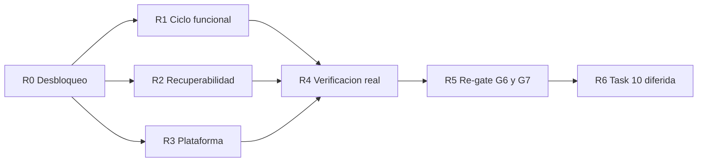

# Remediacion G6 — OT de instalacion MOD09–MOD11 Implementation Plan

> **For agentic workers:** REQUIRED SUB-SKILL: Use `subagent-driven-development` (recommended) or `executing-plans` to implement this plan task-by-task. Steps use checkbox (`- [ ]`) syntax for tracking.

**Goal:** Llevar la OT de instalacion desde "compila y pasa tests unitarios" hasta "ejecuta un comando real contra infraestructura real", cerrando los defectos que el metodo de verificacion anterior no podia detectar.

**Architecture:** Sin cambios de arquitectura. ADR-068 (Aprobado) sigue vigente y ninguna tarea de este plan lo modifica: MOD11 unica verdad de ejecucion, MOD09 coordinacion, MOD12 custodia, sincronizacion por outbox tenant-aware con consumidores idempotentes.

**Tech Stack:** NestJS, Next.js App Router, TypeScript estricto, TypeORM, PostgreSQL multi-tenant por schema, Redis/BullMQ, OpenAPI, Jest/Supertest y Playwright.

---

**Version:** 1.0
**Estado:** Emitido — G6 re-gate NO-GO consolidado; habilita implementacion de R0–R4
**Fecha:** 2026-07-28
**Autor:** AI-EM-ARCH
**Modo:** EM + Architect + Orchestrator
**Protocolo:** `docs/roles/Protocolo_Colaboracion_Multiagente_v1.md`
**Plan antecesor:** `docs/plans/2026-07-27-mod09-mod11-ot-instalacion-redesign.md` (Tasks 0–9 ejecutadas; este plan corrige lo que quedo abierto)
**Informe vivo:** `docs/informes/INFORME-MOD11-FLOW-CABLEADO-v1.0.md` §14
**Checklist:** `docs/quality/CHECKLIST-MOD09-MOD11-OT-INSTALACION-v1.0.md`

## 1. Por que existe este plan

La auditoria multiagente del 2026-07-28 (seis carriles, evidencia `archivo:linea`) establecio que el plan antecesor declara un GO que no es reproducible. No se trata de una remediacion falsa: cuatro de los siete P0 del re-gate tienen correcciones reales y verificables, y el trabajo de las Tasks 1, 2, 3 y 5 es solido. El problema es de **metodo de verificacion**.

Los cuatro defectos mas graves encontrados comparten una firma: **son invisibles a un test unitario con mocks y letales en el primer contacto con infraestructura real.**

| Defecto | Efecto en un despliegue real | Por que la suite verde no lo vio |
| --- | --- | --- |
| `092_seed_execution_order_permissions.ts:56` consulta `tenant_settings`, relacion que no existe en el repo | `42P01` aborta la cadena tenant en 092; **093, 094 y 095 nunca se aplican en ningun schema** | El spec afirma sobre la cadena SQL con `query` mockeado |
| `EXECUTION_ORDER_IDEMPOTENCY_SECRET` no esta en Joi, ni en `.env*`, ni en el perfil prod | `requireIdempotency` es fijo → **todo comando POST de OT responde 500** | Los tests inyectan el secreto por config de prueba |
| `execution-order-relay.service.ts:202` emite `SET LOCAL` despues del `COMMIT` de `:172` | El `UPDATE ... published_at` falla con `42P01`, lo traga el `catch`; **el outbox nunca drena y reencola cada 5 s** | Ningun test ejercita el relay contra PostgreSQL |
| No existe ninguna transicion `QUARANTINED → AVAILABLE` en todo el repo | `registerEvidence` exige `AVAILABLE`; **ninguna evidencia puede registrarse jamas** | Los 25 tests de evidencia mockean `getAssetStatus` devolviendo `AVAILABLE` |

A esto se suma el carril frontend: tres de las cinco mutaciones del workspace de ejecucion fallan con 4xx en el primer intento porque sus payloads no cumplen el contrato congelado, y tres `as any` en `OperationsClient.tsx:605-608` impiden que `pnpm typecheck` lo detecte.

**Conclusion operativa:** el modulo compila, tipa, lintea y pasa 270 tests, y aun asi ningun comando de OT devolveria 200 en un entorno desplegado. La correccion no es escribir mas tests unitarios: es **ejecutar el flujo una vez contra infraestructura real**, que es la unica evidencia ausente en todo el expediente.

## 1bis. Decisiones del CTO — 2026-07-28

Las tres escalaciones del informe vivo §14.7 quedaron resueltas el mismo dia. Ningun agente las reabre.

| # | Decision | Donde se ejecuta |
| --- | --- | --- |
| 1 | **Umbral de lag:** se aprueba instrumentar primero y fijar el umbral despues, sobre datos reales. Hasta entonces se reporta "sin umbral aprobado" y no se deriva de el ningun criterio de abort | R3.3 |
| 2 | **TLS:** certificado emitido por CA reconocida para produccion. El autofirmado queda restringido a desarrollo y staging cerrado | R3.5 |
| 3 | **Datos personales:** amparados por Ley 1581, pero **el sistema no oculta datos**; la responsabilidad del buen uso recae en el usuario | R2.4 §Politica de datos personales |

Dos precisiones que los agentes deben leer antes de invocar la decision 3, desarrolladas en R2.4:

- **No habilita relajar control de acceso.** Autorizacion, aislamiento por tenant y minimizacion por rol no son "ocultar datos" y se conservan intactos.
- **No responde la retencion.** Cuanto tiempo guardamos una copia es una pregunta distinta de quien puede verla. R2.4 lleva una recomendacion decidida, y el derecho de supresion queda anotado como dependencia con Legal.

## 2. Reglas de orquestacion

- AI-EM-ARCH no escribe codigo: mantiene decisiones, prioridades, contratos, gates y stop/go.
- **Los contratos de G4 siguen congelados.** Ninguna tarea de este plan altera tipos de `@iwana/shared`, OpenAPI, nombres de permisos, estados, eventos ni componentes. Donde frontend y backend divergen, **manda el contrato congelado y se corrige el consumidor** — salvo la excepcion declarada en R1.4, que es la unica divergencia contrato-vs-implementacion que requiere decision de AI-EM-ARCH.
- **Regla de gate nueva, vinculante desde hoy:** el registro de un gate no puede viajar en el mismo commit que su remediacion. El commit `d91313a8` escribio a la vez el veredicto NO-GO (§12–§13 del informe), las siete correcciones y la reescritura del plan a "GO", citando una seccion §14 que ese mismo commit no creo. Esa es la causa raiz documental del expediente contradictorio. En adelante: primero el commit de codigo, despues la verificacion por un agente distinto, y solo entonces el commit que registra el gate.
- Ningun agente edita archivos fuera de su ownership sin handoff explicito.
- Todo cambio parte de prueba fallida, implementacion minima y verificacion focalizada.
- **Ninguna evidencia de test cuenta si no demuestra `Cached: 0`** o se ejecuta con `--force` / jest directo. Un `pnpm test` verde puede no haber ejecutado nada.
- **Ningun comando de verificacion puede ir filtrado.** La evidencia del re-gate anterior uso `test -- execution-orders`, filtro que excluye precisamente los dos artefactos que fallan.
- Toda desviacion de boundary, seguridad o contrato detiene la tarea y escala.

## 3. Mapa de ownership

| Carril | Owner | Archivos/responsabilidad |
| --- | --- | --- |
| Arquitectura y gates | AI-EM-ARCH | ADR, plan, prompts, informe y stop/go |
| Backend | AI-SR-FULL | `apps/api/src/modules/tasks`, `apps/api/src/modules/media`, contratos compartidos, integracion por eventos |
| Datos | AI-DATA-ENG | migraciones, politica de retencion e indices; AI-SR-FULL conserva ownership de entidades |
| Frontend | AI-FE-PLATFORM | `apps/portal`, `@iwana/ui` |
| Plataforma | AI-PLAT-OPS | `docker-compose.yml`, Dockerfiles, `nginx/`, CI, runbooks |
| Seguridad | AI-SEC-ENG | auditoria de implementacion en R5; no implementa |
| Calidad | AI-SR-QA | estrategia, E2E vertical, evidencia archivada y re-gate G6 |
| Experiencia | AI-PROD-UX | aceptacion UX de R1.5; no codigo |
| Contrato DS | AI-DS-OWNER | decision del control de custodia en R1.4; no codigo |

## 4. Orden de ejecucion

**R0 es bloqueante absoluto.** Mientras 092 aborte la cadena tenant, no existe base de datos donde verificar nada de R1–R3. Sus cinco tareas son de bajo volumen y alto apalancamiento: ejecutarlas primero y en un solo commit por tarea.

---

### R0.1: Reparar el seed del catalogo de permisos

**Owner:** AI-DATA-ENG; review AI-SR-FULL y AI-SEC-ENG
**Severidad:** P0 — bloquea toda la cadena tenant 092→095
**Files:**

- Modify: `packages/database/src/migrations/tenant/092_seed_execution_order_permissions.ts`
- Modify: `packages/database/src/migrations/tenant/092_seed_execution_order_permissions.spec.ts`
- Create: `packages/database/src/migrations/tenant/092_seed_execution_order_permissions.integration.spec.ts`
- Consultar: `apps/api/src/modules/access-control/access-control.constants.ts` (`MOD00_ACCESS_V1_CATALOG`)

- [ ] Escribir test de integracion real (molde: `089_pagination_ordering_indexes.integration.spec.ts`) que aplique 092 contra un schema tenant de prueba y falle hoy con `42P01`.
- [ ] Sustituir `CROSS JOIN LATERAL (SELECT id AS tenant_id FROM tenant_settings LIMIT 1)` (`:55-57`) por una fuente de `tenant_id` que exista en el schema tenant. Decidir con AI-SR-FULL cual es la fuente canonica y documentarla en el encabezado de la migracion.
- [ ] Añadir verificacion post-insert: `RAISE EXCEPTION` si se insertan 0 filas. Una migracion que siembra nada no puede registrarse como aplicada.
- [ ] Consolidar la fuente de verdad del catalogo: las 6 claves canonicas + el alias deben existir en `MOD00_ACCESS_V1_CATALOG` o derivarse de el. Hoy hay dos fuentes que divergen (migracion y constante de codigo).
- [ ] Acotar el `down()` (`:66-74`) para que no borre entradas que sembro el seeder autocurativo de runtime (`access-control.service.ts:536-577`).
- [ ] Ejecutar la cadena tenant completa 089→095 contra dos schemas de prueba y archivar la salida.
- [ ] Commit: `fix(db): repair execution order permission catalog seed`

**Stop:** si la fuente de `tenant_id` correcta no es evidente, es consulta bloqueante a AI-SR-FULL. No inventar una tabla.

### R0.2: Proveer y validar el secreto de idempotencia

**Owner:** AI-SR-FULL; review AI-SEC-ENG y AI-PLAT-OPS
**Severidad:** P0 — todo comando POST de OT responde 500 en cualquier despliegue
**Files:**

- Modify: `apps/api/src/app.module.ts` (esquema Joi, ~`:132-190`)
- Modify: `.env.example` y el perfil de produccion de `docker-compose.yml`
- Modify: `apps/api/src/modules/tasks/services/execution-order-reliability.service.ts:198-200`

- [ ] Escribir test que arranque el modulo sin `EXECUTION_ORDER_IDEMPOTENCY_SECRET` y exija fallo **al arrancar**, no en la primera peticion.
- [ ] Añadir la variable al Joi de `app.module.ts` como `required()` con longitud minima, junto a las demas claves criticas.
- [ ] Documentarla en `.env.example` con valor de ejemplo no valido (nunca un secreto real).
- [ ] Reemplazar el `throw new Error` generico (`:199`) — hoy produce HTTP 500 — por fallo de arranque; el servicio no debe poder construirse sin secreto.
- [ ] Verificar en el mismo paso que `JWT_PRIVATE_KEY` y `JWT_PUBLIC_KEY` estan presentes en el perfil de produccion: hoy define `JWT_SECRET`, que RS256 no usa, y ambos son `Joi.required()`.
- [ ] Commit: `fix(operations): fail fast on missing execution order idempotency secret`

### R0.3: Reparar el marcado de publicacion del relay outbox

**Owner:** AI-SR-FULL; consulta AI-DATA-ENG; review AI-SR-QA
**Severidad:** P0 — el outbox nunca drena; reencola indefinidamente cada 5 s
**Files:**

- Modify: `apps/worker/src/services/execution-order-relay.service.ts`
- Modify: `apps/worker/src/services/execution-order-relay.service.spec.ts`

- [ ] Escribir prueba de integracion contra PostgreSQL real que publique un evento, ejecute un ciclo del relay y exija `published_at IS NOT NULL`. Debe fallar hoy.
- [ ] Corregir la ventana: el `SET LOCAL search_path` de `:202` esta despues del `COMMIT` de `:172`, donde PostgreSQL lo ignora. El `UPDATE` de `:204-209` debe ejecutarse dentro de una transaccion con `search_path` establecido.
- [ ] Corregir el mismo defecto en `getPendingEventsPerTenant` (`:264`), cuyo `catch {}` (`:287`) deja el health del relay siempre vacio.
- [ ] Dejar de tragar el error: el `catch` de `:211-218` reporta "no se pudo encolar" cuando el encolado si ocurrio. Distinguir fallo de enqueue de fallo de marcado, y registrar ambos.
- [ ] Acotar la concurrencia del scanner: `Promise.allSettled` sobre el censo completo de tenants (`:108-110`) contra un pool de `max: 10` cada 5 s no termina un ciclo antes del siguiente disparo con miles de tenants. Usar limite de concurrencia acorde al pool.
- [ ] Commit: `fix(operations): mark outbox events published inside tenant transaction`

### R0.4: Restablecer los gates de merge en verde

**Owner:** AI-SR-FULL; verificacion AI-SR-QA
**Severidad:** P0 — `pnpm typecheck` y `pnpm --filter @iwana/api test` estan rojos en HEAD
**Files:**

- Modify: `apps/worker/src/processors/evidence-orphan-detection.processor.ts:188-193`
- Modify: `apps/api/src/modules/tasks/tests/tasks.boundary.spec.ts`
- Modify: `apps/worker/jest.config.js`

- [ ] Estrechar `parts[0]` en `:188` antes de su uso en `:193`. Es el propio guard SEC-01 que el re-gate anterior declaro "corregido in-situ" y que rompe `@iwana/worker#typecheck` con TS2345 y TS18048.
- [ ] Actualizar la ruta de `tasks.boundary.spec.ts:22` a `../../media/evidence-asset.provider.ts`: el fix P0-4 movio el provider y dejo su propio test de boundary leyendo la ruta antigua (ENOENT).
- [ ] Reescribir los dos casos vacuos de ese spec: `:14` es `expect(true).toBe(true)` y ninguno verifica imports cruzados de MOD12, que es la afirmacion central de Task 8. Debe fallar si aparece un import de repositorio o entidad de `inventory/`.
- [ ] Alinear `apps/worker/jest.config.js` con `tsconfig.typecheck.json`: hoy sobreescribe el tsconfig inline y pierde la strictness del proyecto, por lo que la suite verde no puede detectar errores de tipos. Este es el defecto de infraestructura que permitio commitear R0.4 en rojo.
- [ ] Ejecutar `pnpm typecheck` y `pnpm lint` con `Cached: 0` y `pnpm --filter @iwana/api test` **sin filtro**; archivar las tres salidas.
- [ ] Commit: `fix(operations): restore typecheck and boundary test to green`

### R0.5: Dejar el spec de la migracion 094 en verde

**Owner:** AI-DATA-ENG; review AI-SR-FULL
**Severidad:** P0 — 6 de 16 tests fallan; el spec nacio rojo en `d91313a8`
**Files:**

- Modify: `packages/database/src/migrations/tenant/094_template_versioning_and_closure_gate.ts:185-213`

- [ ] Corregir `assertTableEmpty`/`assertColumnEmpty`: asumen que `queryRunner.query()` devuelve un array y lanzan `TypeError: Cannot read properties of undefined` en `:189`. Usar acceso defensivo al resultado.
- [ ] Ejecutar `pnpm --filter @iwana/db test` con `Cached: 0` y archivar la salida.
- [ ] Commit: `fix(db): repair migration 094 emptiness guards`

**Nota:** el criterio de fondo sobre si un guard que aborta el rollback satisface el gate "migraciones reversibles" se resuelve en R2.4, no aqui. R0.5 solo devuelve el spec a verde.

---

### R1.1: Implementar la promocion de evidencia fuera de cuarentena

**Owner:** AI-SR-FULL; review AI-SEC-ENG y AI-SR-QA
**Severidad:** P0 — sin esta transicion ninguna evidencia puede registrarse jamas
**Files:**

- Modify: `apps/api/src/modules/media/evidence-asset.provider.ts`
- Create: procesador de analisis de Media en `apps/worker/src/processors/`
- Modify: `apps/worker/src/processors/evidence-orphan-detection.processor.ts:180,196,215,226`

- [ ] Escribir prueba **sin mockear `getAssetStatus`** que recorra crear intent → subir → analizar → registrar evidencia. Debe fallar hoy: el asset nace `QUARANTINED` (`evidence-asset.provider.ts:185`) y `registerEvidence` exige `AVAILABLE` (`execution-orders.service.ts:764`), y no existe ningun productor de esa transicion en el repo.
- [ ] Implementar el analisis asincrono que promueve `QUARANTINED → AVAILABLE` o `→ REJECTED`, como exige ADR-068 §Lifecycle de evidencia. Media es owner de esta transicion, no MOD11.
- [ ] Corregir el reconciliador de huerfanos: hoy fuerza `SET asset_status='AVAILABLE'` incondicional (`:180,196,215,226`), lo que **saca de cuarentena assets nunca analizados** y los habilita para claim y descarga firmada. La liberacion de claim debe preservar el estado previo, no promoverlo.
- [ ] Reconciliar las filas `CLAIM_FAILED`: hoy solo existe la escritura (`execution-orders.service.ts:800`), ningun proceso las lee.
- [ ] Commit: `feat(media): promote evidence assets out of quarantine after analysis`

**Stop:** si el analisis requiere una dependencia externa no aprobada, detener y escalar. El baseline es Redis/BullMQ.

### R1.2: Alinear los payloads del portal con el contrato congelado

**Owner:** AI-FE-PLATFORM; review AI-SR-FULL
**Severidad:** P0 — tres de cinco mutaciones fallan con 4xx en el primer intento
**Files:**

- Modify: `apps/portal/src/components/operations/OperationsClient.tsx`
- Modify: `apps/portal/src/components/operations/ExecutionOrderDrawer.tsx`
- Modify: `apps/portal/src/lib/api-client.ts` (DTO legacy de OT)

- [ ] Escribir tests de comportamiento que asserten la **forma exacta** del payload enviado en inicio, inventario, evidencia y cierre. Deben fallar hoy.
- [ ] Inicio: `OperationsClient.tsx:343` envia `{ notes }`; `StartExecutionOrderSchema` es `.strict()` y admite `note` → 400.
- [ ] Inventario: `ExecutionOrderDrawer.tsx:321-328` envia `serial` y omite `technicianCustodyId`; el schema es `.strict()`, nombra `serialNumber` y exige la custodia con `min(1)` → 400.
- [ ] Evidencia: `OperationsClient.tsx:421` envia `requirementKey: ''` contra `z.string().trim().min(1)` → 422. El parametro llega como `_requirementKey` y se descarta (`:390`).
- [ ] Autorizacion: los dos `fetch` crudos de evidencia (`:399-425`) pasan solo `credentials: 'include'` y ningun header `Authorization`, contra un endpoint con `@Permissions` → 401. Enrutar por `tasksApi` con su transporte de auth; si `request()` no soporta multipart, es consulta a AI-SR-FULL.
- [ ] **Eliminar los tres `as any` de `OperationsClient.tsx:605-608`.** Son la causa de que `pnpm typecheck` no detecte ninguno de los defectos anteriores; mientras existan, el typecheck no es evidencia valida para este carril.
- [ ] Actualizar los DTO legacy de `api-client.ts` para que deriven del contrato congelado de `@iwana/shared`. `CloseExecutionOrderDto` ni siquiera declara el `summary` obligatorio.
- [ ] Commit: `fix(operations): align portal execution payloads with frozen contract`

### R1.3: Poblar evidencia y plantilla en el workspace de ejecucion

**Owner:** AI-FE-PLATFORM; aceptacion AI-PROD-UX
**Severidad:** P0 — dos de los seis bloques estan permanentemente vacios
**Files:**

- Modify: `apps/portal/src/components/operations/OperationsClient.tsx`
- Modify: `apps/portal/src/components/operations/ExecutionOrderDrawer.tsx`

- [ ] Escribir prueba que exija que al abrir una OT se carguen evidencia y plantilla. Debe fallar hoy: `setExecutionOrderEvidence` solo se invoca con `[]` (`:240,599`) y `setExecutionOrderTemplate` solo con `null` (`:601`).
- [ ] Extender `openExecutionOrder` (`:227-234`) para traer tambien evidencia y version de plantilla.
- [ ] Implementar el listado accionable de `missingRequirements[]` del gate de cierre: hoy no hay ninguna ocurrencia del campo en el dominio, y `mapOperationsError` (`:57-66`) descarta el cuerpo del 422 que lo transporta. El backend ya lo emite.
- [ ] Refrescar la lista de evidencia tras una subida exitosa.
- [ ] Corregir el mapeo de badges de `ExecutionOrderSummary.tsx:125-135`, que pinta `CREATED`, `ASSIGNED`, `EN_ROUTE`, `IN_PROGRESS` y `NOT_EXECUTED` como `success`. `ExecutionOrderDrawer.tsx:141-151` ya lo implementa bien: unificar en una sola fuente.
- [ ] Retirar enums crudos y UUID del workspace: `ExecutionOrderDrawer.tsx:721` usa `usage.itemId` como etiqueta principal, `:842` muestra `requirementKey` crudo y `:622` cae al `activityType` crudo.
- [ ] Commit: `feat(operations): load evidence, template and closure gaps in execution workspace`

### R1.4: Resolver la divergencia de custodia y entregar los selectores

**Owner:** AI-DS-OWNER decide el control; AI-FE-PLATFORM implementa; consulta AI-SR-FULL
**Severidad:** P1 — con decision previa bloqueante
**Files:**

- Modify: `docs/specs/2026-07-27-mod09-mod11-ot-instalacion-ds-contrato.md`
- Modify: `apps/portal/src/components/operations/ExecutionOrderDrawer.tsx`

- [ ] **Decision previa (AI-EM-ARCH + AI-DS-OWNER):** el contrato DS congelado define `custodySelection`; el schema Zod del backend valida `technicianCustodyId`. Es la unica divergencia real entre contrato congelado e implementacion. Resolverla explicitamente y registrar el desempate antes de que frontend implemente contra la forma equivocada. Recomendacion de AI-EM-ARCH: **manda el schema del backend** (`technicianCustodyId`), y se corrige la spec DS — el contrato de API es el que ya tiene consumidores.
- [ ] Renderizar el selector de accion: `actionOptions` esta definido en `ExecutionOrderDrawer.tsx:276-284` y nunca se renderiza; `setItemAction` nunca se invoca, por lo que `itemAction` queda fijo en `'INSTALL'` (`:238`).
- [ ] Implementar el selector de custodia segun la decision anterior. Hoy `custodySelection` solo aparece en el tipo de props (`:51`).
- [ ] Usar `reasonCatalogs` en lugar de los codigos fijos de bloqueo/desbloqueo (`:526,537`).
- [ ] Commit: `feat(operations): add material action and custody selectors`

### R1.5: Completar el bloque de conformidad

**Owner:** AI-FE-PLATFORM; aceptacion AI-PROD-UX; review AI-SEC-ENG
**Severidad:** P1
**Files:**

- Modify: `apps/portal/src/components/operations/ExecutionOrderDrawer.tsx`

- [ ] El contrato define `customerAcceptance: {artifactId, method}` y el backend lo acepta (`execution-orders.dto.ts:135-140`), pero el drawer no ofrece captura de aceptacion. Implementarlo.
- [ ] Mantener la restriccion verificada: **cero persistencia local**. La auditoria confirmo que no hay `localStorage`, `sessionStorage` ni IndexedDB en `components/operations` ni `components/scheduling`; no introducirlos.
- [ ] Hacer alcanzable el modo offline: `offline={false}` esta cableado fijo en `OperationsClient.tsx:594`, por lo que el estado read-only informativo es inalcanzable en produccion.
- [ ] Implementar `onCreateFollowUp`, hoy stub vacio (`:609-611`), o retirar el boton hasta que R2.2 habilite el backend. No dejar un control que no hace nada.
- [ ] Commit: `feat(operations): capture customer acceptance in execution workspace`

---

### R2.1: Endurecer el pipeline de evidencia y su retencion

**Owner:** AI-SR-FULL; review AI-SEC-ENG
**Severidad:** P1
**Files:**

- Modify: `apps/api/src/modules/tasks/services/execution-orders.service.ts`
- Modify: `apps/api/src/modules/media/media.service.ts`, `apps/api/src/modules/media/dto/upload-media.dto.ts`
- Modify: `apps/worker/src/processors/evidence-orphan-detection.processor.ts:250-270`

- [ ] Validar el vinculo intent–OT en `registerEvidence` (`:752-796`): hoy un asset subido para OT-A y aun sin claim puede registrarse como evidencia de OT-B del mismo tenant. El rechazo cross-OT que Task 7A declara probado no existe en esa ruta.
- [ ] Cerrar el bypass del pipeline endurecido: `UploadMediaDto` acepta `EXECUTION_EVIDENCE` via `@IsEnum(MediaUsage)` y `MediaService.uploadAsset` no fija `assetStatus`, que por defecto es `AVAILABLE`. Un ADMIN puede crear un asset de evidencia reclamable sin magic bytes, checksum ni cuarentena.
- [ ] Implementar el borrado fisico del objeto tras el TTL: la fase 3 solo marca `DELETED` (`:250-253`) y el binario permanece indefinidamente.
- [ ] Registrar el soft-delete en auditoria, no solo en `Logger` — el plan antecesor declara "soft delete auditado".
- [ ] Añadir `ParseUUIDPipe` a `mediaAssetId` (`execution-orders.controller.ts:293,305`): hoy un id malformado produce 500 y uno valido-no-vinculado 404, lo que es una señal de enumeracion y rompe la politica uniforme 401/403/404.
- [ ] Minimizar el DTO de `POST :id/evidence` (`:326-331`), que devuelve la entidad cruda con `tenantId` y `actorUserId` mientras los GET si los eliminan.
- [ ] Commit: `fix(media): harden evidence pipeline and complete retention lifecycle`

### R2.2: Implementar re-drive y seguimiento

**Owner:** AI-SR-FULL; review AI-SEC-ENG y AI-SR-QA
**Severidad:** P1 — `allowedActions` ofrece acciones que siempre fallan
**Files:**

- Modify: `apps/api/src/modules/tasks/services/execution-orders.service.ts:993-1019`
- Modify: `apps/api/src/modules/tasks/execution-orders.controller.ts:402-408`

- [ ] Implementar `redriveEvent`, hoy stub que siempre lanza 503, pese a que Task 4 lo declara hecho y existe el permiso `execution_events.redrive`. Sin el no hay recuperacion de DLQ por API.
- [ ] Propagar la `Idempotency-Key` que el endpoint exige (`:402-407`) y luego no pasa al servicio (`:408`).
- [ ] Implementar `createFollowUp` (`:993-1007`) o retirarlo de `computeAllowedActions` (`:1042,1078,1082`). El contrato no puede publicar una accion permitida que siempre devuelve 503.
- [ ] Preservar `eventId` y `correlationId` en el re-drive, con auditoria, segun ADR-068 §Relay outbox.
- [ ] Commit: `feat(operations): implement event redrive and follow-up creation`

### R2.3: Cerrar el gate de cierre en fail-closed

**Owner:** AI-SR-FULL; review AI-PROD-UX y AI-SR-QA
**Severidad:** P1
**Files:**

- Modify: `apps/api/src/modules/tasks/services/closure-gate-evaluator.service.ts`
- Modify: `apps/api/src/modules/tasks/services/execution-order-templates.service.ts`

- [ ] El gate es fail-open por partida doble: sin snapshot no se evalua (`execution-orders.service.ts:495`, y la creacion tolera ausencia de plantilla en `:216-218`), y un `kind` desconocido pasa (`closure-gate-evaluator.service.ts:122`). Invertir ambos a fail-closed.
- [ ] `evaluateMaterial` (`:150-158`) acepta cualquier consumo para cualquier requisito de material. Implementar la correspondencia real.
- [ ] Retirar los `as any` de `:135,178,182,186,199`.
- [ ] Añadir lock o reintento al `MAX(version)+1` de plantillas (`execution-order-templates.service.ts:150-157`) y al consecutivo de OT (`execution-orders.service.ts:1461-1470`), que hoy leen e incrementan sin proteccion y no reintentan el 23505.
- [ ] Commit: `fix(operations): make closure gate fail closed`

### R2.4: Fijar la politica de reversibilidad y retencion de datos

**Owner:** AI-DATA-ENG; decision de politica AI-EM-ARCH; review AI-SR-FULL
**Severidad:** P1 — con una decision de arquitectura previa
**Files:**

- Modify: `packages/database/src/migrations/tenant/090`, `091`, `093`, `094`, `095`
- Modify: `packages/database/src/migrations/public/020_add_media_asset_status_and_claim.ts`
- Modify: `packages/database/src/migrations/tenant/revert.ts`

- [ ] **Decision de AI-EM-ARCH, vinculante para este bloque:** un `down()` que aborta ante datos **no** satisface el gate "migraciones reversibles" de `AGENTS.md`; solo cambia el modo de fallo. La politica adoptada es el patron que este repo ya tiene: guard + `DESTRUCTIVE_DOWN_ENV_VAR` (`revert.ts:31`) + registro en `MIGRATIONS_REQUIRING_DESTRUCTIVE_FLAG` (`revert.ts:41-43`), de modo que el dry-run anuncie el bloqueo al operador en lugar de que lo descubra en un stacktrace.
- [ ] Aplicar esa politica de forma **coherente**: hoy 094 bloquea el rollback ante datos mientras 090, 093, 095 y la publica 020 destruyen datos sin guard alguno, todo en el mismo commit. Registrar 094 en la lista de flag destructivo.
- [ ] Rehacer el `down()` de la publica 020: eliminar el `UPDATE usage='general'` (`:105-109`) y sustituirlo por un guard que aborte si existe alguna fila `usage='execution_evidence'`. Retirar las dos escrituras muertas de `:80-92`, que reescriben la tabla justo antes de dropear las columnas.
- [ ] **Riesgo en cascada que debe quedar cerrado:** un revert de 020 pone todos los `claim_ref` a NULL; el detector de huerfanos barre por `claim_ref IS NULL` y expira, luego borra. Un revert seguido de un ciclo del barrendero destruiria toda la evidencia legitima del sistema. Verificarlo con una prueba.
- [ ] Resolver la propiedad del indice `uq_execution_orders_tenant_schedule_event`: lo crean 090 (`:15`) y 091 (`:8`), y lo dropean 090 (`:83`) y 091 (`:12`). Revertir solo 091 elimina un indice de 090, dejando el registro `typeorm_migrations` mintiendo sobre el schema real. Que lo cree una sola migracion, con deduplicacion previa, y retirar el indice redundante de `046:99-102`.
- [ ] Corregir el backfill muerto de 093: la columna se crea `NOT NULL DEFAULT NOW()` (`:31`), asi que el `UPDATE ... WHERE occurred_at IS NULL` (`:35-39`) no toca ninguna fila y todo evento previo queda con `occurredAt` falso, que el relay propaga al envelope.
- [ ] Añadir spec a 095 y a la publica 020, y `CHECK` sobre `status` en 095 — hoy es la unica de 089–095 sin prueba.
- [ ] **Politica de retencion** para las cinco tablas de crecimiento lineal ilimitado (`idempotency_records`, `outbox_events`, `inbox_events`, `audit_intents`, `evidence_upload_intents`): `DELETE` por lotes con `LIMIT`, no solo tombstone; indices parciales que soporten cada barrido; y un camino para las filas `PENDING` huerfanas, que hoy son inmortales y **bloquean permanentemente la reutilizacion de su clave de idempotencia**.
- [ ] Commit: `fix(db): unify migration reversibility policy and data retention`

#### Politica de datos personales aplicable a esta tarea

**Decision CTO 2026-07-28 (registrada, literal):** los datos estan amparados por la Ley 1581, pero **el sistema no puede ocultar datos**; los usuarios son responsables del buen uso de esos datos.

Alcance operativo que AI-EM-ARCH deriva de esa decision, vinculante para los agentes:

1. **No se añade enmascaramiento de presentacion.** Un usuario autorizado ve el dato real. Ningun agente introduce ofuscacion parcial (`CC ***456`), truncamiento ni "ver completo" tras segunda confirmacion en las superficies de OT. Si algo asi existe en el camino de esta remediacion, se retira.
2. **Autorizacion no es ocultamiento.** La minimizacion de DTO por rol, el aislamiento por tenant y la comprobacion de asignacion **se conservan intactos**. Que un contratista no vea la OT de otro tenant no es ocultar un dato: es que ese dato no es suyo. La decision del CTO no habilita a relajar ningun control de acceso, y cualquier agente que la invoque para hacerlo esta fuera de alcance — R2.1 y R2.5 siguen vigentes sin cambio.
3. **La redaccion del log de auditoria se conserva.** `audit.interceptor.ts` no oculta nada a nadie: evita **duplicar** datos personales en un segundo almacen de solo-escritura que nadie consulta en la operacion diaria. El dato sigue integro en su tabla de origen y visible para quien tiene permiso. Retirarla no daria visibilidad a ningun usuario; solo multiplicaria las copias a proteger.
4. **`noColombianPII` en texto libre se conserva, y por la misma razon.** No oculta: impide que una cedula tecleada en un campo de observaciones acabe replicada en el `payload` del outbox, en el inbox de cada consumidor y en el intent de auditoria — cinco tablas que hoy crecen sin techo. Mantenerlo **reduce** el problema de retencion en lugar de agravarlo. Lo que si debe corregirse es el mensaje de error, hoy opaco para un tecnico en campo: debe decir en que campo estructurado va ese dato.

#### Ventana de retencion — recomendacion decidida

La decision del CTO responde a **visibilidad**; la escalacion abierta era de **retencion**. Son cuestiones distintas y no se resuelven la una con la otra: cuanto tiempo conservamos una copia no cambia quien puede verla.

Recomendacion de AI-EM-ARCH, que los agentes implementan salvo objecion del CTO, apoyada en una distincion que el modelo ya permite:

| Clase | Tablas | Retencion propuesta | Razon |
| --- | --- | --- | --- |
| **Transporte** | `outbox_events`, `inbox_events`, `audit_intents` | Borrado por lotes a los **30 dias** de publicado/consumido | No son registro de verdad: son el medio por el que un hecho viaja. El hecho canonico ya esta en la OT |
| **Control de reintento** | `idempotency_records` | Borrado tras el horizonte de replay ya definido en el contrato | El tombstone actual redacta pero conserva la fila y su `key_hmac`, que sigue ocupando el indice unico |
| **Intents de evidencia** | `evidence_upload_intents` | Borrado tras el TTL de huerfanos de R2.1 | Su unico proposito es autorizar y reconciliar una carga |
| **Registro de verdad** | OT, actividades, evidencia, settlement, `audit_logs` | **Sin cambio en esta tarea** | Su retencion la fija la obligacion de negocio y regulatoria, no este plan |

El efecto es que las tablas con datos personales de vida corta dejan de crecer sin techo, y el expediente probatorio de la instalacion no se toca.

**Requiere verificacion con fuente oficial:** el derecho de supresion (ARCO) que `AGENTS.md` lista para el dominio CRM/Portal implica que el sistema debe poder **eliminar** el dato de un titular a peticion. La responsabilidad del usuario sobre el buen uso no traslada esa obligacion, que recae en el responsable del tratamiento. Este plan **no** implementa un flujo de supresion y ninguno de sus agentes debe improvisarlo; queda anotado como dependencia a resolver con Legal antes del cierre del modulo, no antes de R5.

### R2.5: Rate limiting por actor y tenant

**Owner:** AI-SR-FULL con AI-PLAT-OPS; review AI-SEC-ENG
**Severidad:** P1 — QA-33 sigue en FAIL
**Files:**

- Modify: `apps/api/src/modules/tasks/guards/tenant-aware-throttler.guard.ts`
- Modify: `apps/api/src/modules/tasks/tests/execution-orders.controller.http.spec.ts:508-574`

- [ ] El test actual es tautologico: sustituye el guard real por un mock que lanza 429 incondicionalmente y luego assertea 429. No hay rafaga, ni bucket, ni throttler real. Reescribirlo **sin override del guard**, con rafaga controlada y asercion separada por bucket de actor y de tenant.
- [ ] Agrupar por actor **y** tenant: hoy la clave es `bucket:tenantId` (`:83`), solo por tenant.
- [ ] Sustituir el store en memoria (`:31`, con el propio comentario "debe reemplazarse por Redis" en `:28-29`) por store compartido: con N replicas el limite efectivo se multiplica por N.
- [ ] Evaluar el guard **antes** de los guards que consultan base de datos (`execution-orders.controller.ts:62-68`): hoy el rate limit corre despues de JWT/RBAC/ABAC y sus queries, lo que anula su proposito como proteccion de carga.
- [ ] Commit: `fix(operations): enforce rate limit per actor and tenant`

---

### R3.1: Hacer desplegable el perfil de produccion

**Owner:** AI-PLAT-OPS; review AI-SEC-ENG y AI-SR-FULL
**Severidad:** P0 — el perfil no arranca; `docker compose config` falla con el `.env` del repo
**Files:**

- Modify: `docker-compose.yml`
- Create: `.env.production.example`
- Modify: `nginx/nginx.prod.conf`

- [ ] **Corregir primero el defecto de mayor gravedad de todo el expediente:** `migrator-prod` (`:295-300`) descarta stderr y encadena un `console.log("Migraciones completas")` incondicional, ademas de invocar `runAllMigrations()`, funcion que no existe en el repo. Un despliegue reporta migraciones aplicadas sin haber ejecutado ninguna. Reescribirlo sobre `packages/database/Dockerfile.migrator`, que si funciona, con el codigo de salida propagado.
- [ ] Ejecutar publicas **y tenant**: `migrationsRun` solo cubre el glob publico, y el migrator esta roto — hoy **las migraciones tenant no se ejecutan en produccion por ningun camino**.
- [ ] Desacoplar la configuracion productiva del `.env` de desarrollo: hoy `DB_HOST=localhost` y `REDIS_HOST=localhost` (`.env:7-8,18-19`) sobreescriben los defaults `${DB_HOST:-postgres}`, de modo que ningun contenedor alcanza Postgres ni Redis.
- [ ] Declarar el orden: `api-prod.depends_on.migrator-prod` con `condition: service_completed_successfully`. Y decidir si `migrationsRun` sigue activo en la API — recomendacion de AI-EM-ARCH: **desactivarlo** y dejar el DDL solo al migrator; dos actores con DDL en arranque concurrente es una carrera contra el esquema.
- [ ] Retirar los puertos de aplicacion publicados al host en el perfil produccion (`:185,227,244`): hoy `api-prod`, `web-prod` y `portal-prod` son alcanzables en claro, sorteando la terminacion TLS.
- [ ] Aislar la superficie de desarrollo: `adminer`, `nginx` dev, la consola de MinIO y la publicacion de `postgres` no tienen `profiles:`, por lo que un `up` productivo los levanta. Adminer es acceso directo a la base multi-tenant.
- [ ] Enrutar el portal en `nginx.prod.conf`: `nginx-prod` declara `depends_on: portal-prod` pero no hay upstream ni `location` para el, de modo que el portal tenant queda fuera del ingress TLS.
- [ ] Añadir `healthcheck` a `worker-prod` y `build.args` con `NEXT_PUBLIC_API_URL` a `web-prod`/`portal-prod`; retirar o cablear `API_INTERNAL_URL`, hoy variable muerta.
- [ ] Provisionar certificado segun **R3.5**: `secrets/` solo contiene `.gitkeep`, por lo que `nginx-prod` no puede arrancar hoy.
- [ ] Prohibir `STORAGE_DRIVER=local` con `NODE_ENV=production` en el Joi y no montar `/storage/*` fuera de desarrollo: el driver por defecto ignora el TTL y sirve URLs publicas permanentes sin verificacion de tenant.
- [ ] Commit: `fix(platform): make production profile deployable`

**Escalacion:** el certificado de CA para produccion real y su politica de rotacion son decision del CTO. Un autofirmado cifra pero no autentica al servidor; para operacion con datos de suscriptores no basta.

### R3.2: Construir y verificar las imagenes en CI

**Owner:** AI-PLAT-OPS; review AI-SR-QA
**Severidad:** P1
**Files:**

- Modify: `.github/workflows/ci.yml`

- [ ] Los cuatro Dockerfiles **nunca se construyen en CI** (cero cobertura de Docker en workflows). Pueden fallar en el primer build el dia del release. Añadir job que los construya.
- [ ] Añadir `docker compose --profile production config --quiet` contra `.env.production.example` como gate.
- [ ] Commit: `ci(platform): build and validate production images`

### R3.3: Instrumentar la telemetria del relay

**Owner:** AI-PLAT-OPS con AI-SR-FULL; review AI-EM-ARCH
**Severidad:** P1 — bloquea la precondicion de Task 10
**Files:**

- Modify: `apps/api/src/modules/health/health.controller.ts`
- Modify: `apps/worker/src/services/execution-order-relay.service.ts`

- [ ] ADR-068 §Controles obligatorios exige "metricas de lag, reintentos, dead letters, discrepancias de estado y conciliaciones". Hoy el health solo verifica DB y Redis, y no hay ningun exporter en el repo.
- [ ] Exponer: profundidad del outbox, edad del evento pendiente mas antiguo, tamaño de la DLQ y discrepancias de reconciliacion.
- [ ] **Retirar los umbrales inventados en codigo**: `execution-order-projection-convergence.service.ts:89,92` fija 120 s / 600 s, contra la casilla explicita de Task 9 "sin umbral aprobado; no inventarlo desde QA".
- [ ] Sustituirlos por **configuracion sin valor por defecto silencioso**: mientras no exista umbral aprobado, la metrica se expone y **no** se emite veredicto de salud derivado de ella. Un panel que dice "lag: 43 s" es correcto; uno que dice "lag: OK" sin umbral aprobado es una afirmacion inventada.
- [ ] Corregir `lastScanAt`, siempre `null` por un `MAX(published_at)` filtrado por `published_at IS NULL` (`:69-73`).
- [ ] Recolectar la distribucion real de lag durante al menos un ciclo de operacion en staging y adjuntarla al informe. **De esa medicion, no antes, sale la propuesta de umbral.**
- [ ] Commit: `feat(platform): instrument outbox relay telemetry`

**Decision CTO 2026-07-28 (registrada):** se aprueba la recomendacion de AI-EM-ARCH — **instrumentar primero, fijar el umbral despues sobre datos reales**. Hasta que exista medicion, el umbral se reporta como "sin umbral aprobado" y ningun agente puede derivar de el un criterio de abort. La propuesta formal de umbral la emite AI-PLAT-OPS con la distribucion medida, y la aprueba el CTO antes de abrir R5.

### R3.4: Runbook de release y rollback

**Owner:** AI-PLAT-OPS; review AI-EM-ARCH
**Severidad:** P1
**Files:**

- Create: `docs/runbooks/RUNBOOK-RELEASE-ROLLBACK-v1.0.md`

- [ ] No existe runbook de release ni de rollback en `docs/runbooks/`. Escribirlo: orden de arranque, ventana, criterios de abort, procedimiento por componente.
- [ ] Ensayar el rollback y archivar la evidencia. Un rollback no ensayado no cuenta.
- [ ] Documentar backup/restore por tenant y global. Un backup no probado no existe.
- [ ] Incorporar la seccion de certificados de R3.5: emision, renovacion, recarga de nginx y procedimiento ante certificado caducado.
- [ ] Commit: `docs(platform): add release and rollback runbook`

### R3.5: Certificado TLS emitido por una CA reconocida

**Owner:** AI-PLAT-OPS; review AI-SEC-ENG; decision de dominio y proveedor: CTO
**Severidad:** P0 para produccion — `nginx-prod` no arranca sin certificado
**Files:**

- Modify: `docker-compose.yml`, `nginx/nginx.prod.conf`
- Modify: `scripts/generate-certs.ps1` (solo para desarrollo/staging)
- Create: seccion de certificados en `docs/runbooks/RUNBOOK-RELEASE-ROLLBACK-v1.0.md`

**Decision CTO 2026-07-28 (registrada):** se adopta certificado de CA reconocida para produccion.

#### Que es una CA y por que no se "crea" para produccion

Una **CA (Certificate Authority, autoridad certificadora)** es una entidad en la que los navegadores y sistemas operativos ya confian de fabrica. Firma tu certificado y esa firma es lo que hace que el navegador acepte tu dominio sin advertencia. La lista de CA de confianza viene preinstalada en el equipo del usuario: **no es algo que el proyecto pueda añadir**.

De ahi la distincion que decide esta tarea:

| | CA publica | CA propia (privada/interna) |
| --- | --- | --- |
| Quien confia | Todo navegador y SO del mundo, sin configuracion | Solo los equipos donde tu instalaste manualmente el certificado raiz |
| Sirve para | Portal de tenants, consola web, cualquier superficie con usuarios reales | Servicios internos entre contenedores, laboratorio, staging cerrado |
| Como se obtiene | Se **solicita** un certificado; la CA valida que controlas el dominio | Se **genera** con `openssl` y se distribuye el raiz a cada cliente |

**"Crear una CA" solo tiene sentido en el segundo caso**, y ese caso no resuelve el problema de esta tarea: si emites tu propio raiz, cada suscriptor tendria que instalarlo en su equipo para no ver un error de seguridad. Inviable. Para produccion la accion correcta es **obtener** un certificado de una CA publica, no crear una.

Un certificado autofirmado —el actual, `CN=localhost`— **cifra el trafico pero no autentica al servidor**: nadie garantiza que el servidor al otro lado sea el tuyo, lo que deja la puerta abierta a un intermediario en la red del cliente. Cifrado sin autenticacion no es TLS efectivo.

#### Instrucciones para AI-PLAT-OPS

**Regla dura, sin excepcion:** la clave privada **nunca** entra al repositorio, ni cifrada, ni en un `.env` versionado, ni en un ejemplo. `secrets/` permanece en `.gitignore` con solo su `.gitkeep`. Un commit que contenga una clave privada obliga a revocar el certificado y reemitirlo.

- [ ] **Confirmar con el CTO el dominio de produccion.** Sin dominio registrado y con DNS bajo control no hay emision posible: la CA valida precisamente ese control.
- [ ] **Adoptar Let's Encrypt via ACME** como emisor. Es gratuito, automatizable, y su certificado dura 90 dias, lo que convierte la rotacion en una propiedad del sistema en vez de una tarea manual que se olvida. Si el CTO prefiere una CA comercial, el resto de la tarea no cambia: solo el origen del par de archivos.
- [ ] **Elegir el metodo de validacion** y dejarlo escrito:
  - **HTTP-01** — la CA pide un archivo en `http://<dominio>/.well-known/acme-challenge/`. Requiere el puerto 80 abierto. Es el camino simple y el recomendado hoy, porque `nginx.prod.conf:26` ya escucha en 80 para el redirect: basta con servir esa ruta **antes** del `return 301`.
  - **DNS-01** — la CA pide un registro TXT. Es mas complejo pero es el **unico** que emite comodines (`*.iwana.co`). Hoy no hace falta: `server_name _` y la resolucion de tenant va por JWT, no por subdominio. **Si en algun momento se adopta un subdominio por tenant, esta decision cambia a DNS-01 obligatorio** — anotarlo como dependencia.
- [ ] **Añadir un servicio `certbot` al perfil de produccion** que comparta con `nginx-prod` dos volumenes: uno para `/etc/letsencrypt` (certificados) y otro para el webroot del challenge. Programar la renovacion y **recargar nginx tras renovar** (`nginx -s reload`); un certificado renovado que nginx no relee sigue sirviendo el caducado.
- [ ] **Apuntar `ssl_certificate` y `ssl_certificate_key`** (`nginx.prod.conf:37-38`) a `fullchain.pem` y `privkey.pem` de Let's Encrypt. Usar `fullchain`, no `cert`: sin la cadena intermedia, algunos clientes moviles rechazan la conexion aunque el navegador de escritorio la acepte.
- [ ] **Conservar el autofirmado solo para desarrollo y staging cerrado.** `scripts/generate-certs.ps1` sigue siendo valido para eso; documentar explicitamente que su salida no debe usarse en produccion.
- [ ] **Gestionar el HSTS por entorno.** `nginx.prod.conf:54` fija `max-age=31536000`. Ese valor solo es seguro **con certificado de CA valido**. Mientras se opere con autofirmado —desarrollo, staging o cualquier ventana previa a la emision— debe bajarse a `300`: un año de HSTS sobre un certificado que no valida deja al usuario ante un error de seguridad no evitable, sin posibilidad de continuar ni de volver a HTTP, durante 365 dias. Subirlo a un año solo despues de verificar la cadena en produccion.
- [ ] **Verificar la emision de extremo a extremo** y archivar la evidencia: handshake real contra el dominio publico, cadena completa validada, fecha de expiracion y ensayo de una renovacion forzada.
- [ ] Commit: `feat(platform): issue production TLS certificate from public CA`

**Stop:** si el dominio de produccion no esta definido, la tarea se detiene y se escala. No sustituir por un autofirmado "temporal" en produccion: el HSTS lo convierte en un fallo persistente.

---

### R4.1: Cablear y ejecutar el E2E vertical

**Owner:** AI-SR-QA; soporte AI-PLAT-OPS
**Severidad:** P0 — **esta es la evidencia ausente en todo el expediente**
**Files:**

- Modify: `e2e/tests/api/execution-orders-operational.spec.ts`
- Modify: `e2e/playwright.api.config.ts`, `package.json`, `.github/workflows/ci.yml`

- [ ] El spec existe (24 tests, commit `e9b9dee9`) pero **no esta cableado a ningun script ni a CI**: `playwright.api.config.ts` tiene cero referencias en el repo y `pnpm test:e2e:all` nunca lo ejecuta.
- [ ] Eliminar el skip silencioso: `:300` hace `test.skip(!!setupFailed)` tras un `beforeAll` con `catch { return; }`, de modo que sin API arriba el resultado es "skipped", no "failed". Un log sin conteo explicito de *passed* no distingue verde de no-ejecutado.
- [ ] Añadir script `test:e2e:api` y job de CI con Postgres y Redis reales.
- [ ] **Ejecutar el flujo completo contra infraestructura real y archivar la salida con conteo explicito de passed:** crear OT → iniciar → registrar trabajo → consumir material → subir y registrar evidencia → cerrar. Esta sola corrida habria detectado los cuatro P0 de R0–R1.
- [ ] Commit: `test(e2e): wire vertical execution order suite to CI`

**Stop/go:** si esta corrida no pasa, R5 no se abre. Ningun volumen de tests unitarios la sustituye.

### R4.2: Cerrar los huecos de cobertura nombrados

**Owner:** AI-SR-QA; soporte del owner de cada superficie
**Severidad:** P1
**Files:**

- Create: `apps/worker/src/processors/evidence-orphan-detection.processor.spec.ts`
- Create: spec de `apps/api/src/modules/media/evidence-asset.provider.ts`
- Modify: `apps/worker/src/processors/execution-order-events.processor.spec.ts`
- Modify: specs de portal en `components/operations`

- [ ] `evidence-orphan-detection.processor.ts` (287 lineas, compensacion de claims) tiene **cero tests**. Cubrir sus tres fases y el guard de schema.
- [ ] `evidence-asset.provider.ts` no tiene spec pese a concentrar magic bytes, allowlist, checksum y firma. Cubrir el caso **MIME declarado ≠ magic bytes reales**, hoy sin cobertura.
- [ ] Carrera del consecutivo: cero tests de `(tenant_id, schedule_event_id)`. Dos confirmaciones concurrentes de agenda deben producir **una unica OT** con `23505` manejado. Reetiquetar la evidencia de QA-26, hoy mal atribuida a un test de dos cierres concurrentes.
- [ ] Completar la matriz de convergencia: faltan `EXECUTED_WITH_OBSERVATIONS` y `REQUIRES_FOLLOW_UP` como filas propias. El servicio ya las trata distinto; ninguna prueba las ejerce. Son 2 de las 6 filas que Task 9 declara cubiertas.
- [ ] Test de comportamiento para la subida de evidencia: hoy `onUploadEvidence` se pasa como `jest.fn()` y **nunca se assertea invocado**; los tests actuales habrian pasado igual con el no-op anterior.
- [ ] Cubrir `OperationalSidePeek` con los seis estados que Task 6 declara probados: no existe el spec y `packages/ui` no tiene runner. Añadir la infraestructura de test al paquete.
- [ ] Fault injection de entrega con retry/DLQ, hoy limitado a un unico caso de audit-intent.
- [ ] Ejecutar `--coverage` sobre modulos core y archivar el reporte, o declarar la cobertura como no medida. Hoy no esta medida y ninguna afirmacion de ≥80% tiene respaldo.
- [ ] Commit: `test(operations): close named coverage gaps`

---

### R5: Re-gate G6 y decision G7

**Owner:** AI-SR-QA (calidad) y AI-SEC-ENG (seguridad) emiten; AI-EM-ARCH consolida; CTO decide produccion
**Files:**

- Modify: `docs/quality/CHECKLIST-MOD09-MOD11-OT-INSTALACION-v1.0.md`
- Modify: `docs/informes/INFORME-MOD11-FLOW-CABLEADO-v1.0.md`

- [ ] Reejecutar QA-01 a QA-50 completos. El checklist sigue en v1.0 del 2026-07-27 con 8 FAIL y no fue tocado por la remediacion; ninguno de sus cinco P0 fue cerrado por ella, porque atacaba un conjunto distinto de hallazgos.
- [ ] AI-SEC-ENG reaudita los 19 hallazgos de la auditoria del 2026-07-28 y emite veredicto propio. **La atribucion de un "G6 SEC: GO" a AI-SEC-ENG en el plan antecesor no fue emitida por ese rol y no esta respaldada.**
- [ ] AI-PROD-UX y AI-DS-OWNER revisan flujo y contrato sobre la implementacion corregida.
- [ ] Verificar los gates de merge de `AGENTS.md` uno por uno, con salidas archivadas y `Cached: 0`, y **sin filtros de comando**.
- [ ] AI-EM-ARCH consolida en §15 del informe vivo y emite recomendacion G7.
- [ ] Commit del gate, **separado** del commit de la ultima remediacion.

### R6: Task 10 — retiro de compatibilidad ligera

**Estado:** diferida, sin cambios. Su precondicion (un ciclo de release con telemetria verde, cero consumidores conocidos y rollback ensayado) depende de R3.3, R3.4 y R5. El inventario de consumidores activos del informe §11 sigue vigente: API y servicio WFM, creacion desde agenda, portal de Programacion, referencias persistidas y el alias deprecado. Ademas, el alias `wfm.work_orders.execute` se declaro "medible" en Task 2 y no tiene telemetria, por lo que la condicion de cero consumidores no es verificable hoy.

## 5. Matriz de trazabilidad

| Requisito | Tareas | Gate |
| --- | --- | --- |
| Cadena de migraciones aplicable | R0.1, R0.5, R2.4 | G5/G6 |
| Comando de OT operable | R0.2, R0.4, R4.1 | G5/G6 |
| Outbox convergente | R0.3, R2.2, R3.3, R4.2 | G5/G6 |
| Evidencia con ciclo completo | R1.1, R2.1, R4.2 | G5/G6 |
| Flujo de ejecucion usable | R1.2, R1.3, R1.4, R1.5 | G6 |
| Terminal inmutable | verificado, sin trabajo pendiente | G6 |
| Inventario idempotente | R1.2, R1.4, R2.3 | G6 |
| Plataforma desplegable | R3.1, R3.2, R3.4 | G6/G7 |
| Rate limit y TLS efectivos | R2.5, R3.1, R3.5 | G6/G7 |
| Datos personales y retencion | R2.1, R2.4 | G6/G7 |
| Evidencia reproducible de gate | R4.1, R4.2, R5 | G6/G7 |

## 6. Stop inmediato

Detener y escalar si:

- una tarea de R1–R4 se intenta antes de cerrar R0 (no hay base donde verificar);
- un agente necesita modificar un contrato congelado de G4 — salvo la divergencia de custodia de R1.4, ya asignada;
- una correccion exige leer o escribir tablas de otro modulo;
- el tenant depende de header o UUID no confiable, o no viaja en jobs;
- una OT terminal puede mutarse;
- un reintento puede duplicar inventario o evidencia;
- las migraciones no son reversibles bajo la politica de R2.4;
- un gate se declara con evidencia filtrada, cacheada o no archivada;
- se propone registrar un gate en el mismo commit que su remediacion.

## 7. Criterio de salida

Este plan termina cuando: R0 esta cerrado y la cadena tenant aplica en dos schemas; el E2E vertical de R4.1 corre en CI con salida archivada y conteo explicito de passed; el checklist tiene 0 FAIL; AI-SR-QA y AI-SEC-ENG emiten veredicto propio y trazable en artefactos que ellos poseen; el informe vivo registra una unica verdad sin secciones contradictorias; y AI-EM-ARCH eleva al CTO una recomendacion G7 sostenida por evidencia reproducible.
