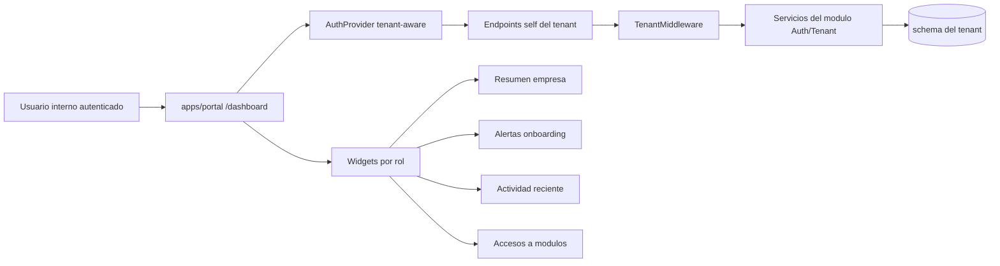

# PRD — MOD02 Dashboard Empresa

**Versión:** 1.0
**Fecha:** 2026-03-17
**Estado:** En revisión
**Modo activo:** Architect
**Autor:** AI-EM-ARCH
**Trazabilidad base:** docs/prds/PRD-MOD02-DEFINICION-v1.0.md
**HLDs relacionados:** docs/hlds/HLD-MOD02-ARQUITECTURA-v1.0.md, docs/hlds/HLD-MOD02-FRONTEND-v1.0.md
**Informes relacionados:** docs/informes/INFORME-MOD02-SPRINT-01-v1.0.md, docs/informes/INFORME-MOD02-FRONTEND-FASE-01-v1.0.md
**ADRs aplicables:** ADR-016, ADR-018, ADR-019, ADR-022, ADR-023

> Nota de gobernanza: este PRD no crea un bounded context nuevo. Formaliza la superficie protegida del tenant ya autenticado dentro de MOD02 para corregir el desalineamiento actual entre el login tenant-aware y el destino funcional posterior al acceso.

---

## 1. Contexto y problema

El estado actual del repositorio deja resuelto el acceso tenant-aware, el primer acceso del ADMIN y el enforcement de MFA de MOD02, pero el destino posterior al login sigue inconsistente con el objetivo del módulo.

La evidencia encontrada es la siguiente:

- `apps/portal` autentica usuarios de tenant y los redirige a `/dashboard`.
- El dashboard actual de `apps/portal` representa un portal de suscriptor con datos estáticos de plan, facturación y soporte, no una consola de administración de empresa ya creada.
- `apps/web` sí contiene el dashboard de plataforma y la gestión de tenants, pero ese boundary corresponde a gobierno de plataforma, no a operación diaria de una empresa autenticada.
- El informe `docs/informes/INFORME-MOD02-SPRINT-01-v1.0.md` dejó explícita la deuda `DT-MOD02-04`: habilitar un dashboard para roles operativos del tenant tras completar MFA.

Problema de negocio:

Una empresa ya creada y aprovisionada puede autenticarse, pero no aterriza en una superficie que le permita operar su tenant, revisar estado base, navegar a módulos empresariales futuros ni administrar su configuración inicial.

Problema funcional:

El sistema hoy mezcla tres superficies distintas:

- dashboard de plataforma en `apps/web`,
- dashboard de suscriptor en `apps/portal`,
- necesidad real de dashboard empresarial para usuarios internos del tenant.

Este PRD define la tercera superficie y corrige esa ambigüedad.

---

## 2. Objetivo del PRD

Definir el dashboard empresarial del tenant ya creado como la pantalla protegida principal de `apps/portal` para roles internos de la empresa autenticada.

El dashboard debe:

- mostrar el estado operativo básico de la empresa autenticada,
- servir como punto de entrada a los módulos empresariales que se irán habilitando por fases,
- separar con claridad la experiencia del tenant respecto al dashboard de plataforma y al portal de suscriptor,
- respetar el aislamiento por tenant, el modelo RBAC y la gobernanza documental vigente.

Resultado esperado:

Después de login exitoso en `apps/portal`, un usuario interno del tenant debe llegar a un dashboard coherente con su rol y con el estado real de la empresa ya provisionada, sin ver widgets de suscriptor ni información de plataforma global.

---

## 3. Alcance

### IN

- Dashboard principal del tenant autenticado en la ruta protegida `/dashboard` de `apps/portal`.
- Experiencia base para roles internos del tenant: `ADMIN`, `NOC`, `ACCOUNTANT`, `SUPPORT` y extensibles según RBAC vigente.
- Tarjetas de resumen operativo de la empresa autenticada.
- Paneles de alertas, actividad reciente y accesos rápidos a módulos empresariales.
- Navegación lateral y encabezado coherentes con una consola empresarial.
- Reglas de visibilidad por rol para widgets y accesos.
- Estados vacíos y placeholders gobernados para módulos aún no construidos.
- Contratos mínimos backend/frontend para consultar información del propio tenant y de la propia sesión.

### OUT

- Dashboard de plataforma en `apps/web`.
- Portal del suscriptor final.
- CRUD completo de usuarios, billing, CRM, tickets, inventario o provisioning avanzado.
- Analytics financieros definitivos o KPIs dependientes de módulos no construidos.
- Cambio de stack, cambio de tenancy o cambio de boundary entre plataforma y tenant.

Decisión de boundary:

- `apps/web` permanece como consola de plataforma.
- `apps/portal` pasa a ser la consola empresarial tenant-aware para usuarios internos del tenant.
- El portal de suscriptor queda fuera de este alcance y no debe seguir usando el dashboard empresarial como sustituto ambiguo.

---

## 4. Usuarios y casos de uso

### Usuarios primarios

| Usuario | Rol | Necesidad principal |
| --- | --- | --- |
| Administrador de empresa | ADMIN | Ver estado general del tenant, completar configuración base y entrar a módulos administrativos |
| Operador NOC | NOC | Ver estado operativo, alertas y accesos directos a capacidades técnicas habilitadas |
| Responsable financiero | ACCOUNTANT | Ver estado administrativo y accesos a configuración y módulos financieros cuando existan |
| Soporte interno | SUPPORT | Ver actividad reciente y navegar a módulos operativos autorizados |

### Casos de uso prioritarios

**CU-01: Entrar al dashboard correcto tras login**

- Usuario interno del tenant completa login.
- El sistema lo redirige a un dashboard empresarial, no a un portal de suscriptor ni a una consola de plataforma.

**CU-02: Entender el estado inicial de la empresa ya creada**

- El ADMIN ve nombre comercial, slug, estado del tenant, timezone, moneda, idioma y controles base de seguridad/configuración.

**CU-03: Identificar tareas pendientes de habilitación**

- El dashboard muestra pendientes base del tenant: MFA organizacional, configuración operativa, usuarios, auditoría, módulos aún no activados.

**CU-04: Navegar a módulos empresariales**

- El usuario ve accesos rápidos solo a los módulos disponibles para su rol.
- Los módulos no implementados aparecen como próximos o no disponibles, sin romper navegación.

**CU-05: Revisar actividad reciente del tenant**

- El usuario autorizado ve eventos recientes relevantes del propio tenant, sin visibilidad cross-tenant.

---

## 5. Requerimientos funcionales

### 5.1 Dashboard y navegación

| ID | Requerimiento | Prioridad |
| --- | --- | --- |
| RF-DE-01 | `apps/portal` debe usar `/dashboard` como home protegida del tenant interno. | MVP |
| RF-DE-02 | El dashboard no debe renderizar widgets de suscriptor ni copy orientado a cliente final. | MVP |
| RF-DE-03 | La navegación lateral debe exponer secciones empresariales alineadas al roadmap y al rol autenticado. | MVP |
| RF-DE-04 | Los accesos a módulos no implementados deben mostrarse en estado deshabilitado o “próximamente”, sin rutas rotas. | MVP |

### 5.2 Resumen operativo del tenant

| ID | Requerimiento | Prioridad |
| --- | --- | --- |
| RF-DE-05 | El dashboard debe mostrar nombre de empresa, slug, estado del tenant y metadatos operativos básicos del tenant autenticado. | MVP |
| RF-DE-06 | Debe mostrar al menos un panel de configuración base con timezone, moneda, idioma y país. | MVP |
| RF-DE-07 | Debe mostrar indicadores iniciales que no dependan de módulos futuros, por ejemplo estado de provisioning, MFA, usuarios activos configurados y salud documental/operativa básica si existe fuente. | MVP |

### 5.3 Alertas y actividad

| ID | Requerimiento | Prioridad |
| --- | --- | --- |
| RF-DE-08 | El dashboard debe exponer alertas de onboarding del tenant cuando falten configuraciones críticas. | MVP |
| RF-DE-09 | Debe mostrar actividad reciente del tenant a partir de eventos auditables del propio tenant o una fuente equivalente aprobada. | MVP |
| RF-DE-10 | El contenido de actividad debe estar filtrado por tenant y por permisos del usuario. | MVP |

### 5.4 Roles y personalización

| ID | Requerimiento | Prioridad |
| --- | --- | --- |
| RF-DE-11 | ADMIN debe ver la vista más completa del dashboard. | MVP |
| RF-DE-12 | NOC, ACCOUNTANT y SUPPORT deben ver variantes de widgets y accesos según permisos. | MVP |
| RF-DE-13 | Si un rol no tiene módulos habilitados aún, debe ver una vista vacía guiada con próximos pasos permitidos. | MVP |

### 5.5 Integración con módulos siguientes

| ID | Requerimiento | Prioridad |
| --- | --- | --- |
| RF-DE-14 | El dashboard debe quedar preparado para enlazar futuros módulos empresariales sin requerir rediseño del shell. | MVP |
| RF-DE-15 | El dashboard debe funcionar como capa de entrada a configuración de empresa, usuarios, auditoría y seguridad. | MVP |

---

## 6. Requerimientos no funcionales y seguridad

| Categoría | Requerimiento |
| --- | --- |
| Seguridad | Todo dato mostrado debe resolverse desde el tenant autenticado y nunca desde listados globales de plataforma. |
| Seguridad | Los boundaries externos deben validarse con Zod y las respuestas UI no deben exponer PII real ni secretos. |
| Seguridad | No se deben registrar tokens, slugs sensibles, credenciales ni datos empresariales completos en logs de cliente. |
| Tenancy | El dashboard solo puede consumir endpoints self-scoped del tenant o endpoints ya protegidos por TenantMiddleware. |
| UX | El dashboard debe reutilizar el shell aprobado por ADR-023 sin replicar la consola de plataforma. |
| Accesibilidad | Debe cumplir WCAG AA en contraste, foco visible, navegación por teclado y estados vacíos legibles. |
| Mantenibilidad | La solución debe permitir agregar widgets por módulo sin reescribir el layout principal. |
| Observabilidad | Deben quedar evidencias de carga y errores de dashboard sin incluir PII. |

Regla explícita:

El dashboard empresarial no debe consumir endpoints de administración global de tenants como sustituto rápido. Si falta un contrato self-service del tenant, debe definirse y construirse de forma explícita.

---

## 7. Arquitectura funcional propuesta

### Decisiones funcionales

- La ruta protegida continúa siendo `/dashboard` para no romper el flujo de auth ya implementado.
- El contenido del dashboard cambia de “portal de suscriptor” a “dashboard empresarial del tenant”.
- La UI debe ser role-aware sobre un mismo shell, evitando forks innecesarios por rol.
- La actividad reciente debe usar una fuente auditable del tenant y no el activity feed de plataforma.

### Contratos mínimos requeridos

El frontend necesita consultar, como mínimo, los siguientes datos del tenant autenticado:

- perfil de sesión actual,
- información base del tenant actual,
- configuración operativa del tenant actual,
- actividad reciente del tenant actual,
- contadores iniciales disponibles sin depender de módulos no construidos.

Si esos contratos no existen todavía, se deben definir como endpoints self-service del tenant, por ejemplo:

- `GET /api/v1/tenants/me`
- `GET /api/v1/tenants/me/settings`
- `GET /api/v1/dashboard/summary`
- `GET /api/v1/audit-logs/me/recent`

Estos nombres son borrador contractual y deben confirmarse en HLD/ejecución, pero el principio arquitectónico es obligatorio: consumo self-scoped, nunca global.

---

## 8. UX y contenido del MVP

El MVP del dashboard empresarial debe contener cinco bloques visibles y útiles desde el primer día:

1. Encabezado empresarial.
   Debe mostrar nombre de empresa, slug, estado y contexto operativo mínimo.

2. Métricas iniciales no ficticias.
   Deben provenir de datos reales disponibles. Si un dato aún no existe, se muestra como no disponible y no como número inventado.

3. Alertas y siguientes pasos.
   Debe indicar brechas como configuración operativa pendiente, MFA organizacional, usuarios por crear o módulos no habilitados.

4. Actividad reciente del tenant.
   Debe resumir eventos relevantes como accesos, cambios de configuración o hitos auditables autorizados.

5. Accesos rápidos a módulos empresariales.
   Debe incluir, al menos, accesos a empresa/configuración, usuarios, seguridad/auditoría y módulos futuros en estado controlado.

Contenido que debe eliminarse del dashboard actual:

- plan hogar,
- velocidad de conexión de un suscriptor,
- próxima factura de cliente final,
- accesos rápidos de portal de suscriptor,
- copy “Bienvenido, suscriptor iWana”.

---

## 9. Criterios de aceptación

1. Un usuario `ADMIN` del tenant autenticado entra a `apps/portal` y aterriza en un dashboard empresarial, no en un portal de suscriptor.
2. El dashboard no muestra métricas ni copy de cliente final.
3. El dashboard muestra información real del tenant autenticado sin usar listados globales de plataforma.
4. La navegación lateral y los accesos rápidos reflejan una consola empresarial y no un portal residencial.
5. Los widgets visibles cambian según rol o permisos sin exponer opciones no autorizadas.
6. Los módulos aún no construidos se muestran con estado controlado y sin errores de navegación.
7. La actividad reciente, si se presenta, está filtrada por tenant y permisos.
8. No se exponen PII, secretos ni datos cross-tenant en UI, logs ni respuestas del dashboard.
9. El flujo login tenant-aware → dashboard queda validado con pruebas unitarias y E2E del portal.
10. La documentación de ejecución posterior debe derivar de este PRD y mantener trazabilidad con MOD02.

---

## 10. Fases recomendadas y dependencias

### Fase 1 — Corrección de superficie

- Reemplazar el dashboard de suscriptor actual en `apps/portal` por el dashboard empresarial.
- Ajustar sidebar, top header y copy general del shell.
- Resolver datos mínimos del tenant autenticado.

### Fase 2 — Role awareness y actividad

- Variantes por rol.
- Feed reciente del tenant.
- Estados vacíos y acciones guiadas.

### Fase 3 — Integración con módulos empresariales

- Conectar accesos a usuarios, configuración, auditoría y siguientes módulos cuando estén implementados.

### Dependencias

- Base auth tenant-aware ya cerrada en MOD02.
- Endpoints self-service del tenant existentes o por crear.
- Validación de boundary plataforma vs tenant mantenida.
- Tests de portal y documentación de ejecución derivados de este PRD.

### Stop/Go

- **Go:** si se mantiene la separación entre `apps/web` plataforma y `apps/portal` tenant.
- **Stop:** si la implementación intenta reutilizar endpoints globales de tenants o volver a mezclar portal de suscriptor con dashboard empresarial sin decisión arquitectónica formal.
