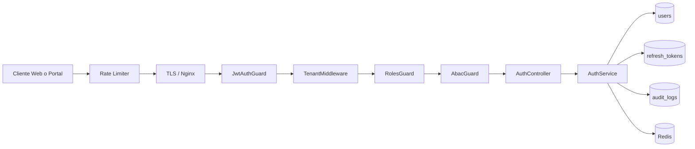

# PRD — Módulo 2: Auth Empresarial de Tenant Activo

## iWana neXt Platform — ISP/OSS/BSS Colombia

**Versión:** 1.1
**Fecha:** 2026-03-16
**Estado:** Aprobado para ejecución
**Modo activo:** Mixto
**Autor:** AI-EM-ARCH (Lead Software Architect Senior)
**Solicitado por:** CTO / continuidad posterior al cierre de MOD01
**Trazabilidad base:** docs/prds/PRD_Sistema_ISP_Colombia_v2_2.md
**PRD heredado:** docs/prds/PRD-MOD01-Auth-Tenant-Audit-v1.0.md
**HLD heredado:** docs/hlds/HLD-MOD01-ARQUITECTURA-v1.0.md
**ADRs aplicables:** ADR-016, ADR-017, ADR-018, ADR-019, ADR-020, ADR-022, ADR-023, ADR-025, ADR-026

> Nota de gobernanza: este documento separa el alcance operativo del Auth empresarial para una empresa ya creada sobre una base técnica aprobada en MOD01. No reemplaza ni invalida MOD01. Si se decide mover el ownership arquitectónico del bounded context Auth fuera del módulo fundacional, se requiere validación de boundary y ADR adicional antes de aprobar este PRD.

---

## Delta respecto a MOD01

### Lo que se hereda de MOD01 (no se reimplementa)

| Componente | Estado en MOD01 | Uso en MOD02 |
|---|---|---|
| AuthModule completo (AuthService, AuthController, guards) | ✅ Implementado | Heredado — se extiende, no se reemplaza |
| JWT RS256 (signAccessToken, verifyToken, refresh rotation) | ✅ Implementado | Heredado con extensión de scope |
| TenantMiddleware + TenantContext AsyncLocalStorage | ✅ Implementado | Heredado sin cambios |
| JwtAuthGuard, RolesGuard, AbacGuard | ✅ Implementados | JwtAuthGuard extendido para scope check |
| Entidades TypeORM: User, RefreshToken, AuditLog | ✅ Implementadas | Heredadas sin cambios de schema |
| AuditModule + AuditInterceptor | ✅ Implementado | Heredado — se agregan nuevos AuditAction values |
| Redis JTI blacklist + MFA pending setup | ✅ Implementado | Heredado sin cambios |
| 13 endpoints /auth/** funcionales | ✅ Implementados | Heredados con hardening puntual |
| Flujo passwordResetRequired | ✅ Implementado | Heredado sin cambios |
| MFA verify en login | ✅ Implementado | Heredado sin cambios |

### Lo nuevo en MOD02 (brechas funcionales a implementar)

| Brecha | Impacto | Tarea |
|---|---|---|
| Login emite tokens completos a ADMIN/NOC/ACCOUNTANT sin MFA configurado | Viola RF-AUTH-04, RF-MFA-04 | Fase 2.1 — token scope `mfa-setup` |
| `refreshTokens()` no emite audit event | Viola RF-AUD-02 | Fase 2.2a — `AuditAction.REFRESH` |
| `resetPassword()` no emite audit event al completar | Viola RF-AUD-02 | Fase 2.2b — `AuditAction.PASSWORD_RESET_COMPLETED` |
| `registerFailedAttempt()` no emite ACCOUNT_LOCKED al bloquear | Viola RF-AUD-02 | Fase 2.2c — `AuditAction.ACCOUNT_LOCKED` |
| `verifyEmail()` usa `AuditAction.UPDATE` genérico | Viola RF-AUD-02 (semántica) | Fase 2.2d — `AuditAction.EMAIL_VERIFIED` |
| Portal no tiene página MFA setup | Bloquea flujo de primer acceso ADMIN | Fase 3.1 — `/auth/mfa/setup/page.tsx` |

### Decisión de diseño: token de alcance limitado `scope: 'mfa-setup'`

Cuando un usuario con rol ADMIN, NOC o ACCOUNTANT completa login exitoso pero no tiene MFA configurado (`mfaEnabled === false`), el backend emite un **access token de alcance limitado** con `scope: 'mfa-setup'` en el payload JWT. Este token:

- Solo permite acceder a `POST /auth/mfa/setup` y `POST /auth/mfa/verify`.
- No incluye refresh token.
- El JwtAuthGuard lo verifica y rechaza cualquier otra ruta con HTTP 403.
- Es suficiente para autenticar las llamadas de setup/verify (endpoints protegidos).
- El frontend lo almacena temporalmente en localStorage y lo descarta tras activar MFA.

---

## 1. Contexto y motivación

### 1.1 Problema de negocio

Una vez creada y aprovisionada la primera empresa, la plataforma necesita un módulo de identidad operativo que permita a los usuarios del tenant autenticarse, operar con permisos granulares, mantener aislamiento por schema y dejar trazabilidad de accesos y cambios sensibles. Este módulo debe servir como capacidad transversal consumible por CRM, Billing, NMS, Provisioning, Portal del Suscriptor y los demás bounded contexts del roadmap.

### 1.2 Problema técnico

La autenticación ya fue implementada como parte de MOD01 junto con Tenant y Audit. Sin embargo, para la continuidad del roadmap conviene aislar documentalmente el Auth empresarial como módulo operacional independiente del bootstrap del tenant. El objetivo es permitir ejecución, trazabilidad y evolución funcional del dominio de identidad sin volver a mezclarlo con provisioning y gobierno de plataforma.

### 1.3 Objetivo del módulo

MOD02 define la capacidad de Auth empresarial para empresas ya creadas y en estado operativo, incluyendo:

- autenticación tenant-aware por email y password,
- MFA TOTP según política por rol,
- sesiones seguras con JWT RS256 y refresh token rotation,
- autorización RBAC/ABAC sobre recursos del tenant,
- primer acceso del ADMIN sembrado durante el provisioning,
- auditoría de eventos de identidad y acceso.

### 1.4 Resultado esperado

El módulo debe ofrecer una superficie de autenticación reutilizable, auditable y consistente con el stack aprobado del proyecto: NestJS, PostgreSQL multi-tenant por schema, TypeORM, Redis, BullMQ, Next.js App Router, OpenAPI y testing con Jest/Supertest/Playwright.

---

## 2. Alcance

### IN — Lo que sí cubre MOD02

- Login tenant-aware con email + password.
- MFA TOTP: setup, verify, disable y enforcement por rol.
- Refresh token rotation con detección de reuse attack.
- Logout con revocación inmediata de access token vía JTI blacklist en Redis.
- Endpoints de sesión del usuario autenticado: me, change-password, forgot-password, reset-password.
- Verificación de email y reenvío de verificación como parte del ciclo de vida del usuario del tenant.
- Política RBAC y ABAC aplicable a recursos del tenant.
- Primer acceso del ADMIN del tenant ya aprovisionado con password temporal y cambio obligatorio.
- Auditoría de eventos de identidad, sesiones, MFA, cambios de password y verificaciones.
- Integración de frontend con apps/web y apps/portal para login, MFA y cambio forzado de password.

### OUT — Lo que no cubre MOD02

- Creación de tenant en public.tenants.
- Provisioning de schema PostgreSQL ni retry-provisioning.
- Ciclo de vida administrativo del tenant: PROVISIONING, SUSPENDED, INACTIVE.
- Bootstrap del primer SYSTEM_ADMIN de plataforma.
- Gobierno de platform users como capacidad principal.
- CRUD completo de usuarios de negocio ajenos al dominio de autenticación.
- Gestión de perfil comercial, contractual o financiero del usuario.
- Integraciones omnicanal, WhatsApp o notificaciones transaccionales fuera del contexto de identidad.

### Dependencias upstream

- El tenant ya debe existir y estar en estado operable según ADR-018.
- El ADMIN inicial debe haber sido sembrado por el proceso de provisioning definido en ADR-020.
- El schema del tenant debe existir y ser resoluble vía TenantMiddleware.

---

## 3. Personas y casos de uso

### 3.1 Personas primarias

| Persona | Rol principal | Necesidad clave |
| --- | --- | --- |
| ADMIN del tenant | ADMIN | Acceder por primera vez, cambiar password temporal, activar MFA y administrar su sesión |
| Operador crítico | NOC / ACCOUNTANT | Autenticarse con MFA obligatorio y operar con acceso controlado |
| Usuario operativo | SUPPORT / SALES / TECHNICIAN / HR | Iniciar sesión y trabajar dentro de sus permisos |
| Suscriptor o tercero autenticado | SUBSCRIBER / CONTRACTOR / PARTNER / AUDITOR / INVESTOR | Acceder al portal correcto con aislamiento por tenant |
| Auditor del tenant | AUDITOR | Consultar trazas de eventos de identidad y acceso |
| Frontend de plataforma | apps/web / apps/portal | Consumir contratos consistentes de auth y responder a estados de sesión |

### 3.2 Casos de uso prioritarios

**UC-01: Login regular del tenant**

- Actor: usuario del tenant.
- Flujo: envía email + password + X-Tenant-Slug → sistema valida credenciales → si MFA aplica, exige TOTP → emite access token y refresh token.

**UC-02: Primer acceso del ADMIN del tenant**

- Actor: ADMIN sembrado durante provisioning.
- Flujo: inicia con credencial temporal → sistema detecta passwordResetRequired → obliga cambio de password → obliga setup MFA → habilita acceso al dashboard.

**UC-03: Rotación de sesión**

- Actor: cualquier usuario autenticado.
- Flujo: cliente invoca refresh con cookie httpOnly → sistema rota refresh token → emite nuevo access token → si detecta reuse attack, revoca la familia completa.

**UC-04: Recuperación de contraseña**

- Actor: usuario que olvidó su password.
- Flujo: solicita recuperación → sistema responde genéricamente → si el usuario existe, genera token temporal → usuario redefine password → se revocan sesiones anteriores.

**UC-05: Consulta de eventos de identidad**

- Actor: auditor o ADMIN con permisos.
- Flujo: consulta audit logs de identidad por filtros de usuario, acción y rango de fechas → sistema retorna eventos paginados.

---

## 4. Requerimientos funcionales

### 4.1 RF-AUTH

| ID | Requerimiento | Prioridad | Referencia |
| --- | --- | --- | --- |
| RF-AUTH-01 | Login con email + password y mensaje de error genérico. | MVP | OWASP ASVS L2 |
| RF-AUTH-02 | Los endpoints públicos de auth tenant-aware deben resolver el tenant por X-Tenant-Slug cuando no exista JWT de tenant. | MVP | HLD MOD01 §2 |
| RF-AUTH-03 | Bloqueo temporal de cuenta tras 5 intentos fallidos por 15 minutos. | MVP | PRD sistema RF-SEC |
| RF-AUTH-04 | Los roles ADMIN, NOC y ACCOUNTANT del tenant deben operar con MFA obligatorio. | MVP | PRD sistema §5.7 |
| RF-AUTH-05 | El módulo debe emitir access tokens RS256 de 15 minutos con tenantId, schemaName, role y jti. | MVP | ADR-019 |
| RF-AUTH-06 | El módulo debe operar refresh token rotation con duración de 7 días y cookie httpOnly. | MVP | ADR-019 |
| RF-AUTH-07 | Debe detectarse reuse attack sobre refresh tokens y revocar toda la familia. | MVP | ADR-019 |
| RF-AUTH-08 | Logout debe invalidar el jti en Redis y revocar el refresh token activo. | MVP | ADR-019 |
| RF-AUTH-09 | Forgot-password debe responder siempre HTTP 200 sin revelar si la cuenta existe. | MVP | OWASP |
| RF-AUTH-10 | Change-password y reset-password deben revocar todas las sesiones persistentes del usuario. | MVP | Seguridad repo |
| RF-AUTH-11 | Email verification y resend verification forman parte del ciclo de vida del usuario del tenant. | MVP | PRD heredado |

### 4.2 RF-MFA

| ID | Requerimiento | Prioridad | Referencia |
| --- | --- | --- | --- |
| RF-MFA-01 | Setup MFA debe generar secret TOTP y QR para activación posterior. | MVP | Código actual |
| RF-MFA-02 | Verify MFA debe persistir el secret solo después de validar el primer código TOTP. | MVP | AuthService |
| RF-MFA-03 | Disable MFA debe requerir password actual más código TOTP vigente. | MVP | AuthService |
| RF-MFA-04 | El ADMIN de primer acceso no puede completar onboarding sin MFA activo. | MVP | ADR-020 |

### 4.3 RF-RBAC y RF-ABAC

| ID | Requerimiento | Prioridad | Referencia |
| --- | --- | --- | --- |
| RF-ACC-01 | El módulo debe exponer guardas reutilizables para autorización por rol. | MVP | HLD MOD01 |
| RF-ACC-02 | El módulo debe impedir acceso a recursos de otro tenant mediante ABAC y TenantMiddleware. | MVP | ADR-018 |
| RF-ACC-03 | El usuario solo puede operar sobre su propio tenant y recursos autorizados por contexto. | MVP | PRD sistema |
| RF-ACC-04 | El módulo debe diferenciar claramente auth de tenant y auth de plataforma. | MVP | Boundary MOD02 |

### 4.4 RF-AUDIT

| ID | Requerimiento | Prioridad | Referencia |
| --- | --- | --- | --- |
| RF-AUD-01 | Todo evento sensible de identidad debe dejar traza auditable. | MVP | Ley 1581 / PRD sistema |
| RF-AUD-02 | Deben auditarse login exitoso, login fallido, refresh, logout, MFA enable/disable, password change, password reset y email verification. | MVP | AuditAction |
| RF-AUD-03 | Los eventos de identidad deben consultarse con filtros y paginación cursor-based. | MVP | HLD MOD01 |
| RF-AUD-04 | La auditoría del tenant debe ser append-only y no participar en borrados ARCO. | MVP | Ley 1581 |

### 4.5 Arquitectura funcional del módulo

La arquitectura operativa del módulo es la siguiente:

#### Componentes principales

- AuthController: superficie HTTP de login, refresh, logout, MFA, password y verificación.
- AuthService: lógica de autenticación, hashing, emisión de tokens, rotación y revocación.
- JwtAuthGuard: enforcement de autenticación sobre endpoints protegidos.
- RolesGuard: autorización por rol en endpoints de negocio.
- AbacGuard: validación contextual por recurso y tenant.
- TenantMiddleware: resolución del tenant y validación de operabilidad.
- Redis: blacklist de jti y almacenamiento temporal de setup MFA.
- PostgreSQL schema del tenant: users, refresh_tokens y audit_logs.

---

## 5. Requerimientos no funcionales

| Categoría | Requerimiento | Meta |
| --- | --- | --- |
| Seguridad | Cumplir OWASP ASVS L2 para autenticación y sesión. | Obligatorio |
| Seguridad | No registrar PII, secretos, tokens ni refresh tokens en logs. | Obligatorio |
| Seguridad | Cifrar email, nombres sensibles, documento y secret MFA con AES-256-GCM. | Obligatorio |
| Seguridad | Hash de password con bcrypt 12 rounds o baseline vigente aprobado. | Obligatorio |
| Performance | Login p95 menor a 200 ms sin contar latencia de correo. | Objetivo MVP |
| Performance | Refresh p95 menor a 100 ms. | Objetivo MVP |
| Disponibilidad | Auth debe funcionar con tenants ACTIVE sin acoplarse a provisioning síncrono. | Obligatorio |
| Observabilidad | Logs estructurados y audit trail para eventos sensibles. | Obligatorio |
| Mantenibilidad | Cobertura de pruebas >= 85% lines/functions, >= 80% branches en capa core del módulo. | Gate de salida |
| Compatibilidad | OpenAPI actualizada para todo endpoint de auth expuesto. | Gate de salida |

---

## 6. Modelo de datos borrador

### 6.1 Entidades principales del tenant

**users**

- id
- email cifrado
- emailHash indexado
- passwordHash
- role
- status
- tenantId
- mfaEnabled
- mfaSecret cifrado
- passwordResetRequired
- passwordResetToken
- passwordResetExpiresAt
- failedLoginAttempts
- lockedUntil
- lastLoginAt
- emailVerified
- emailVerificationToken
- firstName / lastName / documentNumber cifrados cuando aplique
- timestamps y soft delete

**refresh_tokens**

- id
- userId
- tokenHash
- familyId
- expiresAt
- revokedAt
- revokeReason
- ipAddress
- userAgent
- createdAt

**audit_logs**

- id
- tenantId
- userId
- action
- entityType
- entityId
- oldValue
- newValue
- ipAddress
- userAgent
- requestId
- createdAt

### 6.2 Dependencias de datos fuera del módulo

- public.tenants: fuente de estado y resolución del tenant.
- public.platform_users: auth de plataforma fuera del foco principal de MOD02.
- platform_audit_logs: dependencia de plataforma, no parte del dominio central del módulo.

### 6.3 Reglas de modelado

- El schema del tenant no se hardcodea; se resuelve por request.
- No se almacenan refresh tokens en texto plano, solo tokenHash.
- No existen FKs referenciales cross-schema entre users y public.tenants.
- Audit logs son append-only.

---

## 7. Contratos de API borrador

### 7.1 Endpoints principales del módulo

| Método | Ruta | Descripción | Alcance |
| --- | --- | --- | --- |
| POST | /api/v1/auth/login | Login de usuario del tenant | Core MOD02 |
| POST | /api/v1/auth/refresh | Rotación de refresh token | Core MOD02 |
| POST | /api/v1/auth/logout | Cierre de sesión | Core MOD02 |
| GET | /api/v1/auth/me | Estado del usuario autenticado | Core MOD02 |
| POST | /api/v1/auth/mfa/setup | Generación de setup MFA | Core MOD02 |
| POST | /api/v1/auth/mfa/verify | Activación MFA | Core MOD02 |
| POST | /api/v1/auth/mfa/disable | Desactivación MFA | Core MOD02 |
| POST | /api/v1/auth/forgot-password | Solicitud de recuperación | Core MOD02 |
| POST | /api/v1/auth/reset-password | Ejecución de reset | Core MOD02 |
| POST | /api/v1/auth/change-password | Cambio de password autenticado | Core MOD02 |
| POST | /api/v1/auth/email/verify | Verificación de email | Core MOD02 |
| POST | /api/v1/auth/email/resend-verification | Reenvío de verificación | Core MOD02 |

### 7.2 Endpoint relacionado pero fuera del foco principal

| Método | Ruta | Descripción | Tratamiento documental |
| --- | --- | --- | --- |
| POST | /api/v1/auth/platform/login | Login de SYSTEM_ADMIN e IWANA_SUPPORT | Integración heredada de MOD01 |

### 7.3 Contratos y reglas de borde

- Login tenant-aware requiere X-Tenant-Slug cuando no existe JWT de tenant.
- Refresh token viaja por cookie httpOnly con SameSite strict.
- Todas las respuestas de error deben evitar filtración de existencia de cuenta.
- Cambios de contrato requieren actualización OpenAPI.

---

## 8. Criterios de aceptación

1. Un usuario de tenant ACTIVE puede iniciar sesión y obtener access token y refresh token según política vigente.
2. Los roles con MFA obligatorio (ADMIN, NOC, ACCOUNTANT) no pueden completar login sin TOTP válido; si MFA no está configurado, reciben token de alcance `mfa-setup` con `mfaSetupRequired: true`.
3. El ADMIN de primer acceso no puede operar sin completar el flujo completo: cambiar password temporal → activar MFA → login final con TOTP → dashboard.
4. Un refresh token revocado o reutilizado dispara revocación de la familia completa.
5. Logout invalida el access token por jti blacklist y revoca el refresh token asociado.
6. TenantMiddleware impide operar con tenant no resoluble o no operable.
7. Los eventos sensibles de identidad quedan trazados en audit_logs del tenant: LOGIN, LOGIN_FAILED, LOGOUT, REFRESH, MFA_ENABLED, MFA_DISABLED, PASSWORD_CHANGED, PASSWORD_RESET_COMPLETED, EMAIL_VERIFIED, ACCOUNT_LOCKED.
8. El contrato OpenAPI cubre todos los endpoints de auth del módulo.
9. No existen logs con credenciales, tokens ni PII en texto plano.
10. Backend, frontend, DB y evidencia documental quedan alineados al PRD.

### Flujos E2E requeridos para cierre

**Flujo A — Primer acceso ADMIN:**
1. Login con credenciales temporales → `passwordResetRequired: true` → redirect a `/auth/change-password`
2. Cambiar password → redirect a `/auth/login`
3. Re-login → `mfaSetupRequired: true` + token scope `mfa-setup` → redirect a `/auth/mfa/setup`
4. Configurar MFA con TOTP → activar → redirect a `/auth/login`
5. Login final con password + TOTP → tokens completos → dashboard

**Flujo B — Recuperación de contraseña:**
1. `/auth/forgot-password` → respuesta HTTP 200 genérica
2. Clic en enlace del email → `/auth/reset-password` con token temporal
3. Nueva password → sesiones revocadas → redirect a login

---

## 9. Dependencias y riesgos

### Dependencias

- MOD01 cerrado y productivo según docs/informes/INFORME-MOD01-CIERRE-v1.0.md.
- Tenant ACTIVE y schema aprovisionado según ADR-017 y ADR-018.
- Redis disponible para blacklist de jti y MFA pending setup.
- Mailer o integración equivalente para completar flujos de email verification y recuperación end-to-end.

### Riesgos

| ID | Riesgo | Impacto | Tratamiento |
| --- | --- | --- | --- |
| R-MOD02-01 | Confusión de boundary entre MOD01 y MOD02 | Alto | Mantener estado En revisión hasta validar separación documental |
| R-MOD02-02 | Integración de correo no cerrada end-to-end | Alto | Mantener backlog explícito y no marcar como aprobado sin evidencia |
| R-MOD02-03 | Acoplamiento indebido entre auth tenant y auth plataforma | Medio | Documentar auth plataforma como integración separada |
| R-MOD02-04 | Fuga cross-tenant por mala resolución de contexto | Crítico | Reforzar TenantMiddleware, guards y pruebas de aislamiento |

### Escalación

[ESCALACION AL CTO]
Prioridad: Alta
Contexto: si MOD02 pasa de ser separación documental a cambio real de bounded context respecto de MOD01.
Opciones evaluadas: mantener herencia documental, abrir ADR de boundary, rechazar separación.
Recomendación: aprobar primero la separación documental; escalar solo si cambia ownership real del dominio.
Decision requerida antes de: aprobación final del PRD y arranque del HLD-MOD02.

---

## 10. Definition of Done

- PRD aprobado o formalmente validado para ejecución.
- HLD-MOD02-ARQUITECTURA-v1.0.md emitido con el mismo boundary.
- OpenAPI actualizada para los endpoints cubiertos.
- Pruebas unitarias e integración del core de auth >= 85% lines/functions, >= 80% branches.
- E2E críticos implementados para login, MFA setup (flujo primer acceso ADMIN) y recuperación de contraseña.
- Validación de aislamiento multi-tenant y sesiones revocadas.
- Evidencia de auditoría de eventos de identidad disponible (audit_logs).
- Informe de sprint actualizado en docs/informes/INFORME-MOD02-SPRINT-01-v1.0.md.
- Sin secretos, PII real ni credenciales en código, logs o documentación.
