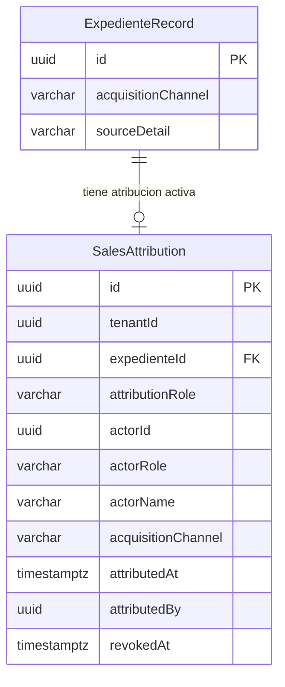

# PRD - MOD05 CRM — Origen Comercial y Atribucion

**Version:** 1.1  
**Estado:** Aprobado  
**Fecha:** 2026-04-02  
**Modo activo:** Architect  
**Autor:** AI-EM-ARCH (Lead Software Architect Senior)  
**Aprobación:** CTO  
**PRD base:** docs/prds/PRD-MOD05-CRM-DEFINICION-v2.0.md  
**HLD base:** docs/hlds/HLD-MOD05-ARQUITECTURA-v2.0.md  
**ADRs aplicables:** ADR-016, ADR-018, ADR-019, ADR-022, ADR-024  
**Precedencia documental:** AGENTS.md §Precedencia Documental

---

## 1. Contexto y problema

El CRM actual registra el campo `source` como texto libre dentro de la seccion de interes comercial del `ExpedienteRecord`. Ese modelo ya no es suficiente para el siguiente cierre funcional de MOD05 porque:

1. No distingue de forma confiable el canal de captacion del cliente potencial.
2. No deja trazabilidad clara de quien originó la oportunidad.
3. No permite reporteria consistente sobre origen comercial y referidos.

El objetivo inmediato del modulo no es liquidar incentivos ni modelar pagos. El objetivo es cerrar correctamente la captura del origen comercial para terminar el CRM con datos estructurados y auditables.

---

## 2. Objetivo del documento

Definir la evolucion de MOD05 para capturar de forma estructurada:

1. El canal de captacion del cliente potencial.
2. El actor que originó la oportunidad.
3. El historial de reatribucion cuando la oportunidad cambie de originador.

Este documento deja proyectado el sistema de incentivos y productividad como roadmap futuro, fuera del alcance operativo de esta fase.

---

## 3. Alcance de esta fase

### En scope

| Area | Descripcion |
|------|-------------|
| Canal de captacion | Reemplazo del `source` libre por un catalogo estructurado `AcquisitionChannel` |
| Detalle del origen | Campo complementario `sourceDetail` para conservar contexto libre cuando aplique |
| Atribucion comercial | Nueva entidad `SalesAttribution` vinculada al expediente |
| Historial | Re-atribucion con trazabilidad y conservacion del historial |
| Portal CRM | Ajustes en alta rapida, detalle de expediente y visualizacion del originador |
| API CRM | Endpoints y contratos para crear, consultar y revocar atribuciones |

### Fuera de scope

1. Politicas de incentivos.
2. Devengos por contrato.
3. Liquidaciones mensuales.
4. Pagos o beneficios automáticos.
5. Metas de productividad tecnica.
6. Dashboard economico de comisiones.
7. Integracion con nomina, contabilidad o facturacion.

---

## 4. Actores del sistema

| Actor | UserRole existente | Uso en esta fase |
|-------|-------------------|------------------|
| Vendedor interno | `SALES` | Puede originar oportunidades y quedar atribuido |
| Vendedor externo | `PARTNER` | Puede originar oportunidades y quedar atribuido |
| Tecnico referente | `TECHNICIAN` | Puede ser identificado como originador de un referido |
| Cliente referidor | `SUBSCRIBER` | Puede quedar registrado como origen de una recomendacion |
| Administrador | `ADMIN` | Puede revisar, corregir y reatribuir |

En esta fase todos los actores se modelan desde la perspectiva de origen comercial, no desde la perspectiva de incentivo economico.

---

## 5. Requisitos funcionales

### RF-OC-01: Catalogo de canales de captacion

- Reemplazar `source` como texto libre por un enum controlado `AcquisitionChannel`.
- Valores iniciales:

| Valor enum | Label UI |
| --- | --- |
| OFICINA | Visita a oficina |
| WHATSAPP | WhatsApp |
| LLAMADA_ENTRANTE | Llamada entrante |
| LLAMADA_SALIENTE | Llamada saliente |
| REDES_SOCIALES | Redes sociales |
| REFERIDO_CLIENTE | Referido por cliente |
| REFERIDO_VENDEDOR | Referido por vendedor |
| REFERIDO_TECNICO | Referido por tecnico |
| PUERTA_A_PUERTA | Puerta a puerta |
| EVENTO | Evento / feria |
| WEB | Formulario web |
| OTRO | Otro |

- Agregar `sourceDetail` como texto opcional para conservar detalle libre de campana, observacion o referencia contextual.
- La migracion debe copiar el valor historico de `source` a `sourceDetail` y asignar `OTRO` a `acquisitionChannel` cuando no exista equivalencia estructurada.

### RF-OC-02: Atribucion comercial del originador

- Crear la entidad `SalesAttribution` como registro de la atribucion comercial activa del expediente.
- Cada expediente puede tener una unica atribucion activa.
- Campos requeridos:

| Campo | Tipo | Descripcion |
| --- | --- | --- |
| id | uuid PK | — |
| tenantId | uuid | Aislamiento multi-tenant |
| expedienteId | uuid FK | → expediente_records |
| attributionRole | varchar(30) | ORIGINATOR |
| actorId | uuid | Identificador del actor originador |
| actorRole | varchar(30) | Rol del actor al momento de la atribucion |
| actorName | varchar(160) | Nombre denormalizado para trazabilidad |
| acquisitionChannel | varchar(30) | Canal asociado a la atribucion |
| notes | varchar(500) | Observaciones opcionales |
| attributedAt | timestamptz | Fecha/hora de atribucion |
| attributedBy | uuid | Actor que registra la atribucion |
| revokedAt | timestamptz | Nullable |
| revokedBy | uuid | Nullable |
| revokedReason | varchar(255) | Nullable |
| createdAt | timestamptz | — |

### RF-OC-03: Reglas de autoatribucion y referidos

- Si el expediente es creado por un actor con rol `SALES` o `PARTNER`, el sistema puede proponer autoatribucion por defecto.
- Si el canal corresponde a `REFERIDO_CLIENTE`, `REFERIDO_VENDEDOR` o `REFERIDO_TECNICO`, el usuario debe poder registrar explicitamente al originador.
- La atribucion debe quedar desacoplada de `assignedTo`; originador y responsable operativo pueden ser distintos.

### RF-OC-04: Re-atribucion con historial

- El sistema debe permitir revocar la atribucion activa y crear una nueva.
- El historial se conserva con patron insert-only audit trail.
- La revocacion exige motivo cuando la realiza un ADMIN.

### RF-OC-05: Visualizacion y consulta

- El listado y el detalle del expediente deben mostrar el canal de captacion y el originador actual.
- El detalle debe exponer el historial de atribuciones cuando exista.
- La reporteria de esta fase es operativa y basica: por canal y por actor originador. No incluye montos ni payout.

---

## 6. Modelo de datos

### 6.1 Cambios a `expediente_records`

| Campo | Tipo | Regla |
|-------|------|-------|
| acquisition_channel | varchar(30) | NOT NULL, default `OTRO` |
| source_detail | varchar(255) | Nullable |

La columna legacy `source` se conserva temporalmente por compatibilidad y trazabilidad de migracion, marcada como deprecada.

### 6.2 Nueva tabla `sales_attributions`

| Indice | Columnas |
| --- | --- |
| idx_sales_attr_tenant_expediente | tenantId, expedienteId |
| idx_sales_attr_actor | tenantId, actorId |
| uq_sales_attr_active | expedienteId WHERE revokedAt IS NULL |

### 6.3 Diagrama entidad-relacion

---

## 7. Contratos API

| Metodo | Endpoint | Body | Response |
| --- | --- | --- | --- |
| PATCH | /api/v1/crm/expedientes/:id | `{ acquisitionChannel, sourceDetail? }` | 200 ExpedienteRecord |
| POST | /api/v1/crm/expedientes/:id/attribution | `{ actorId, actorRole, acquisitionChannel, notes? }` | 201 SalesAttribution |
| GET | /api/v1/crm/expedientes/:id/attribution | — | 200 SalesAttribution \| null |
| DELETE | /api/v1/crm/expedientes/:id/attribution | `{ reason }` | 200 |
| GET | /api/v1/crm/expedientes/:id/attribution/history | — | 200 SalesAttribution[] |

### Guards

Todos los endpoints requieren `JwtAuthGuard`.

| Grupo | Roles permitidos |
| --- | --- |
| Atribucion lectura | ADMIN, SALES, PARTNER, SUPPORT, SYSTEM_ADMIN |
| Atribucion escritura | ADMIN, SYSTEM_ADMIN |

---

## 8. Seguridad y restricciones

| Requisito | Aplicacion |
| --- | --- |
| Multi-tenant | `tenantId` en la tabla nueva y `SET LOCAL search_path` por transaccion |
| Autorizacion | `@Roles(UserRole.*)`; nunca strings literales |
| Validacion | Zod en todos los DTOs de entrada |
| Trazabilidad | `actorName` denormalizado y reatribucion con historial |
| PII | No introducir PII adicional; no registrar datos sensibles en logs |
| Boundaries | No agregar logica economica ni tablas de incentivos dentro de MOD05 |

---

## 9. Criterios de aceptacion

| CA | Descripcion |
| --- | --- |
| CA-OC-01 | Crear expediente con `AcquisitionChannel` seleccionado desde catalogo estructurado |
| CA-OC-02 | Los valores historicos de `source` quedan preservados en `sourceDetail` tras la migracion |
| CA-OC-03 | Crear atribucion devuelve 201 con actor, rol y canal correctos |
| CA-OC-04 | Solo puede existir una atribucion activa por expediente |
| CA-OC-05 | Re-atribucion conserva el historial de la atribucion anterior |
| CA-OC-06 | En canales `REFERIDO_*` se puede registrar explicitamente al originador |
| CA-OC-07 | El portal muestra canal, originador actual e historial de atribucion |
| CA-OC-08 | La solucion no introduce politicas, devengos ni liquidaciones |
| CA-OC-09 | OpenAPI y validaciones Zod quedan alineadas al nuevo contrato |
| CA-OC-10 | Tests de servicios y endpoints nuevos cumplen la cobertura objetivo del modulo |

---

## 10. Roadmap futuro

El sistema de incentivos y productividad queda explicitamente proyectado para un modulo posterior, fuera de MOD05.

### Linea futura 1: Incentivos comerciales

- Politicas por tipo de actor.
- Devengo por evento de contrato activo.
- Beneficios monetarios o no monetarios.
- Liquidacion y aprobacion mensual.

### Linea futura 2: Productividad operativa

- Metas mensuales para tecnicos.
- Bonos por volumen, calidad o cumplimiento de SLA.
- Indicadores construidos a partir de eventos operativos, no desde `ExpedienteRecord`.

### Restriccion arquitectonica futura

Ese subsistema debe vivir como bounded context separado y consumir eventos del CRM y de contratos, sin contaminar `ExpedienteRecord` ni el flujo operativo actual del modulo.

---

*Documento aprobado por CTO para cierre funcional de MOD05. El archivo reemplaza el refinamiento previo y fija el alcance operativo de origen comercial y atribucion.*
| CA-AI-17 | Migracion preserva datos historicos: `source` existente → `sourceDetail` |
| CA-AI-18 | Tests >= 80% cobertura en servicios de atribucion, devengo y liquidacion |
| CA-AI-19 | OpenAPI actualizado con todos los endpoints nuevos |
| CA-AI-20 | Validacion Zod en todos los DTOs de entrada |

---

## 11. Riesgos

| Riesgo | Severidad | Mitigacion |
| --- | --- | --- |
| Complejidad del threshold recalculation al liquidar | Media | Algoritmo simple: contar devengos del periodo, aplicar regla. Unit tests exhaustivos. |
| Contrato activado sin Quote.expedienteId | Media | Validar FK chain: Contract → Quote → ExpedienteRecord. Si falta, log warning y no devengar. |
| Volumen de devengos en tenants grandes | Baja | Indices optimizados por actor+periodo. Query plan verificado. |
| Politicas retroactivas | Baja | effectiveFrom/To evaluado contra fecha del contrato, no del devengo. Regla explicita: no retroactividad. |
| Concurrencia en liquidacion | Media | Lock por tenant+periodo (SELECT FOR UPDATE) al crear liquidacion. |

---

## 12. Fases de implementacion

### Fase 1 (Sprint actual)
- Backend: entidades, migraciones, enums, DTOs, servicios, endpoints.
- Devengo automatico al activar contrato.
- Portal: formulario de atribucion, seccion §4 actualizada.
- Tests unitarios y de integracion.

### Fase 2 (Sprint siguiente)
- Portal: dashboard de incentivos, liquidacion, aprobacion/pago.
- Perfil "Mis comisiones" para actores.
- E2E tests del flujo completo.

### Fase 3 (Posterior)
- Integracion con modulo de facturacion para FREE_MONTH.
- Notificaciones al alcanzar umbrales.
- Exportacion de reportes.

---

*Documento generado por AI-EM-ARCH en modo Architect. Requiere revision y aprobacion por CTO antes de iniciar implementacion.*
