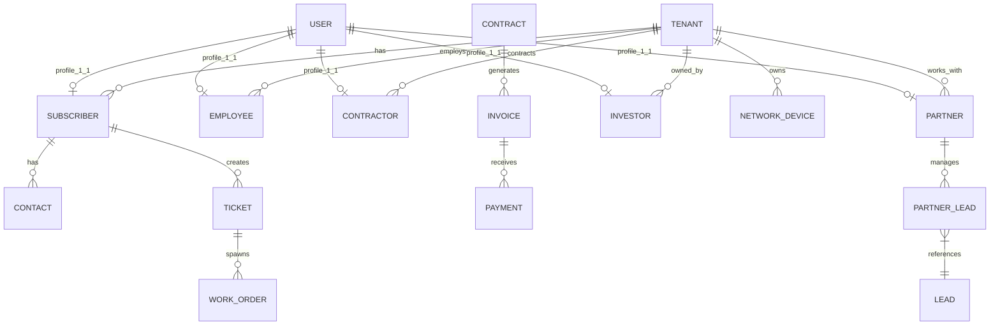
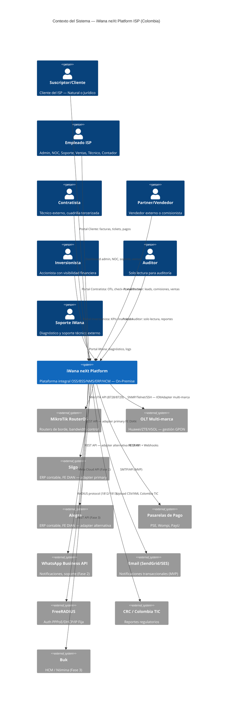
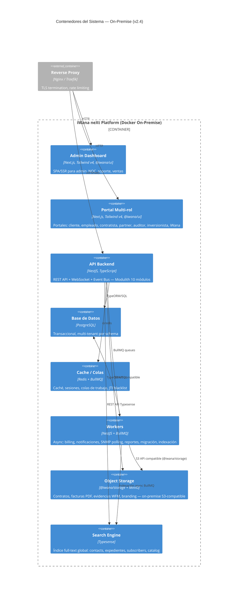
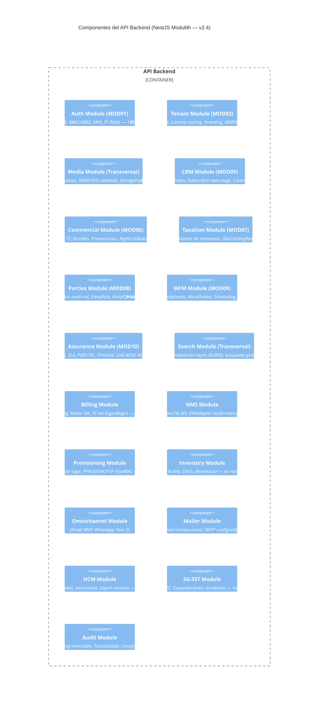
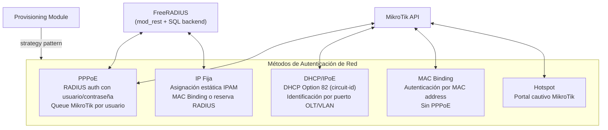
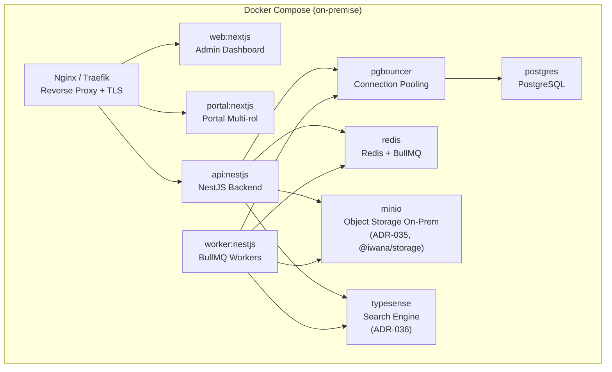
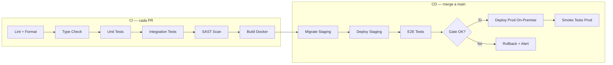
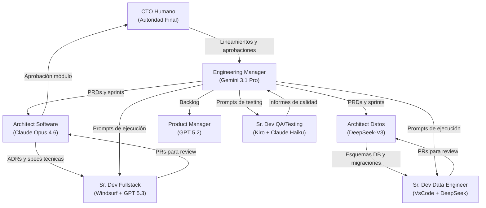

# PRD & Documento de Arquitectura — Plataforma Integral ISP Colombia

**Version:** 2.5  
**Estado:** Propuesto — requiere **G1 del CTO**  
**Fecha:** 2026-08-09  
**Modo activo:** Product Architect + Architect + Orchestrator  
**Autor:** AI-EM-ARCH  
**Clasificación:** Confidencial — Uso interno  
**Versión anterior:** 2.4 (2026-05-19, Aprobada)  
**Changelog v2.5:** incorpora **ADR-040 a ADR-079**; corrige el estado real de ejecución (nada está en producción — ADR-070 (superado)); añade MOD00, MOD04, MOD11 y MOD12 al roadmap; adopta la taxonomía de gates **G6 / G6.5 / G7**; incorpora las políticas de seguridad de audiencias JWT, PII en listados, credenciales iniciales y cifrado — detalle en [Historial de Cambios](#historial-de-cambios)  
**Nombre de archivo:** el sufijo `_v2_4` del nombre es un **identificador estable**, no la versión del contenido. La versión autoritativa es el campo `Version` de esta cabecera. *(Misma convención que `Protocolo_Colaboracion_Multiagente_v1.md`. Renombrar el archivo rompería 46 documentos que lo citan; el corpus ya arrastra una cita colgante a `PRD_Sistema_ISP_Colombia_v2_3.md` por haberlo hecho antes.)*  
**Stack validado:** [Stack_Tecnologico.md](Stack_Tecnologico.md)  
**Gobernanza:** [AGENTS.md](../../AGENTS.md) · [Protocolo multiagente](../roles/Protocolo_Colaboracion_Multiagente_v1.md)

---

> ## ⚠ Nota de vigencia — 2026-08-09
>
> **Esta versión 2.5 está Propuesta y requiere la firma del CTO (G1).** Hasta entonces, la base aprobada sigue siendo la v2.4 — **con una excepción que no depende de esta firma**: allí donde el texto de la v2.4 contradecía un ADR **Aprobado**, el ADR ya prevalecía por la cadena de precedencia documental (`AGENTS.md` → CTO y ADRs aprobados → PRD). Esas contradicciones se corrigen aquí; no se introducen.
>
> **Qué motivó la revisión.** La v2.4 se fechó el 2026-05-19 y su changelog llegaba hasta ADR-039. Entre esa fecha y hoy se aprobaron **37 ADRs nuevos** (ADR-040…ADR-079, menos los cuatro aún propuestos), cerraron dos módulos con informe firmado, nacieron dos bounded contexts y se formalizó la taxonomía de gates. La §14.2 se titulaba *"Estado Real"* y llevaba **82 días** sin reflejar la realidad.
>
> **La corrección más grave.** La v2.4 declaraba MOD01 y MOD02 *"✅ Producción"*. **Nada de este sistema está desplegado en producción.** [ADR-070](../adrs/ADR-070-Diferimiento-Dominio-Productivo.md) (superado) (Aprobado por el CTO el 2026-08-02) lo dice sin ambigüedad y difiere formalmente el dominio productivo; **G7 permanece NO-GO por diseño**. Leer el PRD anterior podía llevar a creer que había un sistema vivo con suscriptores reales.
>
> **Qué NO cambia esta versión.** Ninguna decisión de producto aprobada: arquitectura Modulith, multi-tenancy por schema, despliegue on-premise, stack, alcance funcional del MVP y objetivos de negocio se conservan. Lo que cambia es el **estado**, las **decisiones nuevas ya aprobadas por ADR** y la **gobernanza de cierre**.
>
> **Marcadores de cita.** Los ADR **no aprobados** que se citan llevan su marcador obligatorio: [ADR-072](../adrs/ADR-072-Destino-de-pgBouncer.md) *(propuesto)*, [ADR-073](../adrs/ADR-073-Cadena-de-Suministro-de-Imagenes.md) *(propuesto)*, [ADR-074](../adrs/ADR-074-Autenticacion-de-Redis.md) *(propuesto)*, [ADR-078](../adrs/ADR-078-Reapertura-Dominio-Productivo-Por-PII-Real.md) *(propuesto)*. No confieren autoridad normativa.

---

## Tabla de Contenidos

- **[PARTE 1 — FUNDAMENTOS](#parte-1-fundamentos)**
  1. [Resumen Ejecutivo](#1-resumen-ejecutivo)
  2. [Supuestos y Restricciones](#2-supuestos-y-restricciones)
  3. [Contexto y Antecedentes](#3-contexto-y-antecedentes)
  4. [Personas y Casos de Uso (Jobs-to-be-Done)](#4-personas-y-casos-de-uso-jobs-to-be-done)
  5. [Requerimientos Funcionales (por dominios)](#5-requerimientos-funcionales-por-dominios)

- **[PARTE 2 — ARQUITECTURA](#parte-2-arquitectura)**
  6. [Modelo de Datos](#6-modelo-de-datos)
  7. [Arquitectura C4 — Diagramas Mermaid](#7-arquitectura-c4-diagramas-mermaid)
  8. [Arquitectura Lógica y DDD](#8-arquitectura-logica-y-ddd)
  9. [Arquitectura Técnica](#9-arquitectura-tecnica)

- **[PARTE 3 — IMPLEMENTACIÓN](#parte-3-implementacion)**
  10. [Arquitectura de Despliegue — On-Premise](#10-arquitectura-de-despliegue-on-premise)
  11. [Integraciones Prioritarias](#11-integraciones-prioritarias)
  12. [DevEx — Monorepo, CI/CD, Estándares](#12-devex-monorepo-cicd-estandares)
  13. [Calidad, Seguridad y Operación (NFRs)](#13-calidad-seguridad-y-operacion-nfrs)
  14. [Roadmap — Orden de Módulos por Prioridad](#14-roadmap-orden-de-modulos-por-prioridad)

- **[PARTE 4 — GESTIÓN DEL PROYECTO](#parte-4-gestion-del-proyecto)**
  15. [Plan de Migración de Datos](#15-plan-de-migracion-de-datos)
  16. [Matriz de Riesgos](#16-matriz-de-riesgos)
  17. [KPIs y Métricas](#17-kpis-y-metricas)
  18. [Costeo ROM](#18-costeo-rom)
  19. [Anexos](#19-anexos)

- **[PARTE 5 — GOBERNANZA](#parte-5-gobernanza)**
  20. [Framework de Gobernanza Multi-IA](#20-framework-de-gobernanza-multi-ia)

---

## PARTE 1 — FUNDAMENTOS

---

## 1. Resumen Ejecutivo

### 1.1 Qué vamos a construir

Una plataforma unificada de gestión para ISPs colombianos que consolida OSS/BSS/NMS/EMS, aprovisionamiento, facturación electrónica DIAN, CRM omnicanal, inventario de red, helpdesk con SLA, WFM, ERP (integración), HCM, SG-SST y reportes regulatorios CRC/MinTIC en un solo sistema.

La plataforma va a **producción real** desde el primer módulo habilitado. No es un piloto. Cada módulo se construye y cierra completo: PRD del módulo, HLD, prompts de ejecución por fase, Backend, Frontend, Base de Datos, Tests, documentación operativa y evidencia funcional. El cierre real del módulo ocurre únicamente cuando está desplegado y verificado en producción.

### 1.2 Problema a resolver

Los ISPs en Colombia operan con herramientas fragmentadas: WispHub para red, AdminOLT para OLTs, Alegra/Siigo para contabilidad, UISP para equipos Ubiquiti, hojas de cálculo para inventario y WhatsApp personal para soporte. Esto genera silos de datos, incumplimientos regulatorios (CRC, DIAN, MinTrabajo), fricción operativa, baja visibilidad del suscriptor y errores de facturación.

**Sistemas actuales a reemplazar:** WispHub · AdminOLT · UISP (Ubiquiti) · Siigo · Excel

### 1.3 Para quién

ISPs colombianos con 500–50,000 suscriptores, redes GPON multi-marca (Huawei · ZTE · VSOL · otras) y/o inalámbricas (MikroTik · Ubiquiti), que buscan consolidar operaciones y cumplir normativa.

### 1.4 Decisiones principales

| Decisión                     | Elección                                                | Justificación                                                     |
| ---------------------------- | ------------------------------------------------------- | ----------------------------------------------------------------- |
| Arquitectura                 | Modulith (monolito modular) NestJS                      | Equipo pequeño, time-to-market, ACID nativo. Ref: ADR-001         |
| Multi-tenant                 | Schema por tenant en PostgreSQL desde el inicio         | Escalabilidad sin refactorización futura. Ref: ADR-002            |
| Frontend                     | Next.js + Tailwind v4 CSS-first + design system iWana   | Identidad iWana, SSR/SSG, design system. Sin tailwind.config.js   |
| Comunicación inter-módulo    | Domain Events (EventEmitter + BullMQ)                   | Desacoplamiento, retry, DLQ, observabilidad. Ref: ADR-003         |
| ERP contable MVP             | Adapter Siigo (primary) o Alegra (alternativa)          | No tiene sentido construir motor contable NIIF en MVP             |
| Facturación electrónica DIAN | MVP: vía Siigo/Alegra adapter. Futuro: módulo propio    | Reduce riesgo regulatorio en MVP. Ref: ADR-006                    |
| NMS multi-marca OLT          | IOltAdapter genérico + Factory Pattern                  | El ISP trabaja con Huawei, ZTE, VSOL y otras marcas. Ref: ADR-014 |
| Despliegue                   | On-premise en servidores del ISP (Docker autocontenido) | Decisión del ISP. Sin dependencia de cloud. Ref: ADR-013          |
| Nómina                       | Integración (Buk/Siigo Nómina) — no build               | Liquidación CO extremadamente compleja                            |
| Monorepo                     | Turborepo                                               | Caching, builds paralelos, shared packages                        |
| Object Storage               | MinIO (S3-compatible) + patrón StoragePort              | On-premise seguro, replicable, API S3 estándar. Ref: ADR-035      |
| Búsqueda global              | Typesense (motor de búsqueda indexada)                  | Full-text fuzzy, ranking, multi-tenant, as-you-type. Ref: ADR-036 |
| Identidad multi-rol          | PartiesModule (MOD08) — Party como maestro              | Un solo registro por persona/empresa con múltiples roles. Ref: ADR-030 |
| Catálogo fiscal              | TaxationModule (MOD07) — catálogo centralizado          | Transversal para SALES, PURCHASE, BOTH. Sin duplicación. Ref: ADR-029 |

**Decisiones incorporadas en v2.5** (ADR-040…ADR-079, todos Aprobados salvo indicación):

| Decisión | Elección | Justificación |
| --- | --- | --- |
| Puerta administrativa del tenant | MOD00 Configuración como **control plane federado** | Centraliza la experiencia (organización, sedes, acceso, módulos activos) sin absorber el ownership de los datos operativos. Ref: [ADR-040](../adrs/ADR-040-Configuracion-Control-Plane-Organizacion-Acceso.md) |
| Frontera sede física ↔ nodo de red | `OrganizationSite` maestro administrativo; `NmsNode` entidad propia del futuro NMS | Evita el "módulo dios" y deja el NMS libre de heredar semántica administrativa. Ref: [ADR-044](../adrs/ADR-044-Separacion-OrganizationSite-NmsNode.md) |
| Coordinación de visita ↔ ejecución de campo | MOD09 dueño de agenda y despacho; **MOD11 dueño de la OT enriquecida** | Separar "cuándo y quién" de "qué se hizo en terreno". Ref: [ADR-046](../adrs/ADR-046-Bounded-Context-Tasks-Ejecucion-Operativa.md), [ADR-047](../adrs/ADR-047-Separacion-Programacion-y-OT-Ejecucion.md) |
| Fuente canónica de la orden de ejecución | `ExecutionOrder` (MOD11) es única fuente; agenda y tareas son **proyecciones** sincronizadas por **outbox transaccional** | Elimina la doble verdad entre agenda y ejecución; entrega al menos una vez con idempotencia y sin imports cruzados. Ref: [ADR-068](../adrs/ADR-068-Sincronizacion-OT-Ejecucion-Proyecciones-Operativas.md) |
| Inventario y cadena de suministro | MOD12 como bounded context propio (existencias, compras, RFQ, proveedores, activos, bajas, conteo, costeo) | El inventario de materiales es dominio propio, no un anexo de provisioning. **MOD11 no descuenta stock directamente.** Ref: [ADR-048](../adrs/ADR-048-Bounded-Context-Inventario-SCM-Ciclo-Vida-Productos.md) |
| Valoración de inventario | **Costeo promedio móvil** por ítem | Suficiente para operación y KPI de valor; FIFO y efectos contables DIAN quedan fuera del MVP. Ref: [ADR-059](../adrs/ADR-059-Costeo-Promedio-Movil-Valoracion-Inventario.md) |
| Disponibilidad de stock | `disponible = on_hand − reserved`, con invariante `0 ≤ reserved ≤ on_hand` | El número que ve el operador descuenta lo comprometido. Ref: [ADR-055](../adrs/ADR-055-Reservas-Efectivas-Disponible-Comprometido.md) |
| Escritura cross-módulo | **Puerto de comando** `IPartyWritePort`, dual del puerto de lectura; referencias lógicas sin FK cross-module | Permite altas atómicas entre módulos sin acoplar esquemas. Ref: [ADR-052](../adrs/ADR-052-Alta-Proveedores-SupplierProfile-Puerto-Comando-Parties.md) |
| Unicidad de trabajo de campo | Clave `(tenant, origin_context, origin_ref, work_type)` — **la unidad de origen, nunca el suscriptor** | Impide duplicar trabajo sobre el mismo expediente o ticket sin bloquear atenciones legítimas distintas. Ref: [ADR-076](../adrs/ADR-076-Unicidad-Trabajo-Campo-Activo-Por-Origen.md) |
| Visita que no se realiza | Taxonomía de 8 causas, límite de 3 intentos imputables al cliente, **SLA que nunca se reinicia** | Convierte el "no se pudo" en dato operativo y protege el compromiso con el suscriptor. Ref: [ADR-077](../adrs/ADR-077-Ciclo-Vida-Visita-No-Realizada.md) |
| Tablas operativas | **Paginación numerada en servidor** por defecto; la degradación la declara el servidor | Ninguna pantalla materializa el universo de datos del tenant en memoria. Ref: [ADR-064](../adrs/ADR-064-Paginacion-Tablas-Operativas-Portal.md), [ADR-065](../adrs/ADR-065-Paginacion-Numerada-Tablas-Operativas.md) |
| Consultas de listado | **Ninguna consulta carga el conjunto completo de una entidad para filtrar o paginar en memoria** | Regla normativa verificable en revisión, con bloqueo en G5. Ref: [ADR-060](../adrs/ADR-060-Control-Bajas-y-Consultas-Operativas-Inventario.md) |
| Superposición visual | Escala semántica de tokens `--z-*` de siete capas; prohibido escribir valores de z literales | Un componente que no encaja propone una capa, no inventa un número. Ref: [ADR-075](../adrs/ADR-075-Contrato-Capas-Z-Portal.md) |
| Dominio productivo | **Diferido formalmente** hasta el cierre del roadmap modular; G7 NO-GO por diseño | Definir topología productiva hoy congelaría opciones que dependen de módulos que aún no existen. Ref: [ADR-070](../adrs/ADR-070-Diferimiento-Dominio-Productivo.md) (superado) · reapertura en curso: [ADR-078](../adrs/ADR-078-Reapertura-Dominio-Productivo-Por-PII-Real.md) *(propuesto)* |
| Experiencia de arranque | Contrato único de estado con dos productores; la pantalla la sirve el proxy, no el framework | El operador debe ver qué se descarga y qué se levanta, en terminal y navegador. Ref: [ADR-079](../adrs/ADR-079-Superficie-Publica-Estado-Arranque.md) |

### 1.5 Riesgos clave

1. Complejidad de integración OLT multi-marca (mitigación: IOltAdapter genérico, AdminOLT como bridge en Fase 2).
2. Cambios regulatorios CRC/DIAN durante desarrollo (mitigación: adapters modulares, monitoring normativo mensual).
3. Migración de datos desde múltiples sistemas (mitigación: ETL por módulo, operación paralela, corte gradual).
4. Dependencias de instalación on-premise (mitigación: Docker autocontenido, runbooks, VPN soporte remoto).

### 1.6 MVP (90 días)

Auth + RBAC multi-tenant (14 roles RBAC iniciales agrupados en 8 categorías de actor autenticado), CRM core (suscriptores Natural/Jurídico con estrato, contratos, Expediente Único con pipeline de 8 estados, conversión two-stage Expediente→Subscriber), Billing + FE DIAN (vía Siigo/Alegra adapter) con Motor IVA por estrato, NMS MikroTik, Provisioning básico (PPPoE + IP Fija + DHCP), RADIUS, Portal suscriptor, Notificaciones Email, ETL migración WispHub/AdminOLT/Excel.

**Estado de construcción al 2026-08-09.**

> **Ningún módulo está desplegado en producción.** "Construido" significa código entregado y aceptado en calidad; **no** significa que exista una instancia productiva atendiendo suscriptores reales. El gate que autoriza despliegue es **G7**, y está **NO-GO por diseño** ([ADR-070](../adrs/ADR-070-Diferimiento-Dominio-Productivo.md) (superado), aprobado). La distinción entre construido, mergeable y desplegable es la taxonomía de [ADR-069](../adrs/ADR-069-Gates-G6.5-Merge-Readiness.md) — ver §12.3.

| Módulo | Código | Construido | Gate más avanzado alcanzado | Evidencia |
|--------|--------|-----------|------------------------------|-----------|
| Auth + Users + Tenant + Audit | MOD01 | ✅ | Cierre de módulo (previo a la taxonomía de gates) | `INFORME-MOD01-CIERRE-v1.0.md` |
| Dashboard / Portal de empresa | MOD02 | 🔶 Parcial | **G6 NO-GO condicionado** (2026-08-04) — fase reabierta | `INFORME-MOD02-DASHBOARD-PORTAL-AUDITORIA-UIUX-v1.0.md` |
| Configuración — Control Plane federado | MOD00 | ✅ | Fases 01–06 cerradas; **sin informe de cierre de módulo** | [ADR-040](../adrs/ADR-040-Configuracion-Control-Plane-Organizacion-Acceso.md) |
| Usuarios internos | MOD04 | ✅ | **Cierre sin condiciones** (2026-07-22) | `INFORME-MOD04-CIERRE-MODULO-v1.0.md` |
| CRM + Expedientes + Subscribers | MOD05 | ✅ | Fase 03 completada; sin informe de cierre de módulo | — |
| Módulo Comercial (Catálogo, Bundles, Precios) | MOD06 | ✅ | Fase 01; sin informe de cierre de módulo | ADR-028 |
| Tributación (catálogo centralizado de impuestos) | MOD07 | ✅ | Programa Taxation/Parties cerrado | ADR-029 |
| Parties (identidad multi-rol) | MOD08 | ✅ | Programa Taxation/Parties cerrado | ADR-030 |
| WFM / Programación de técnicos | MOD09 | ✅ | **G6 GO · G6.5 suspendido · G7 no evaluado**; H1/H2/V3 reabiertos | `INFORME-MOD09-CICLO-VIDA-VISITA-CAMPO-v1.0.md` |
| Service Assurance / Mesa de ayuda | MOD10 | ✅ | Fase 01 **En revisión** | ADR-038 |
| Ejecución operativa / Tareas | MOD11 | ✅ | **G6 GO · G6.5 GO · G7 NO-GO** (diferido) | `INFORME-MOD11-FLOW-CABLEADO-v1.0.md` §15.13 |
| Inventario / SCM + Compras + Activos | MOD12 | ✅ | **G7 GO técnico de módulo** (CTO, 2026-07-21), alcance MVP | `INFORME-MOD12-CIERRE-MODULO-v1.0.md` |
| Media + Object Storage (MinIO) | Transversal | ✅ | — | ADR-034, ADR-035 |
| Búsqueda global (Typesense) | Transversal | ✅ | — | ADR-036 |
| Notificaciones Email | Transversal | 🔶 Base | — | — |
| **NMS · Billing · Provisioning · Portal Cliente · ETL** | — | 🔲 | **No iniciados** | §14.2 |

**Lectura honesta del MVP.** De los diez bloques del párrafo anterior, están construidos **Auth+RBAC** y **CRM core**. **Billing, FE DIAN, NMS MikroTik, Provisioning, RADIUS, Portal suscriptor y ETL de migración no se han iniciado** — son cinco de los seis módulos que la §14.2 numera del 3 al 6 y del 9 al 11. En su lugar se construyeron MOD00, MOD04, MOD11 y MOD12, que no figuraban en el MVP original. El plazo de 90 días de la restricción C01 está **excedido** y el alcance real ejecutado divergió del planificado; §14.3 lo registra.

### 1.7 Medidas de éxito (KPI)

| KPI                             | Target                | Fuente              |
| ------------------------------- | --------------------- | ------------------- |
| Tiempo aprovisionamiento (MTTI) | Reducción 40% (< 48h) | Provisioning + WFM  |
| NPS                             | Mejora +15 puntos     | Encuestas omnicanal |
| Churn rate                      | < 2% mensual          | CRM                 |
| Collection rate                 | > 95%                 | Billing             |
| SLA compliance tickets          | > 95%                 | Assurance           |
| Network availability            | > 99.9%               | NMS                 |

---

## 2. Supuestos y Restricciones

### 2.1 Supuestos (confirmados)

| #   | Supuesto                                                                            | Estado     | Fuente               |
| --- | ----------------------------------------------------------------------------------- | ---------- | -------------------- |
| S01 | ISP objetivo: 500–50,000 suscriptores                                               | Confirmado | Investigación        |
| S02 | Tecnologías de acceso: GPON (Huawei/ZTE/VSOL/otras), EPON, WISP (MikroTik/Ubiquiti) | Confirmado | ISP                  |
| S03 | Pasarelas de pago: PSE, Wompi, PayU, PlacetoPay                                     | Confirmado | Investigación        |
| S04 | ERP contable: Siigo (primary) y/o Alegra (alternativa)                              | Confirmado | ISP                  |
| S05 | Canales omnicanal MVP: Email. WhatsApp disponible pero no es prioridad MVP          | Confirmado | ISP                  |
| S06 | Cuadrillas WFM: 2–20 técnicos de campo                                              | Confirmado | ISP                  |
| S07 | Multi-tenant por schema PostgreSQL desde inicio aunque haya 1 tenant                | Confirmado | ADR-002              |
| S08 | OLTs multi-marca (Huawei, ZTE, VSOL, otras). IOltAdapter genérico desde inicio      | Confirmado | ISP                  |
| S09 | WhatsApp Business API disponible; no es prioridad MVP                               | Confirmado | ISP                  |
| S10 | Hosting on-premise en servidores del ISP. Docker autocontenido                      | Confirmado | ISP                  |
| S11 | Una sola empresa inicial. Arquitectura multi-tenant para escalar a SaaS multi-ISP   | Confirmado | Decisión negocio     |
| S12 | Equipo apalancado con IA según Framework de Gobernanza Multi-IA v2.0                | Confirmado | Framework gobernanza |
| S13 | Migración de datos desde: WispHub, AdminOLT, UISP, Siigo, Excel                     | Confirmado | ISP                  |
| S14 | Métodos de autenticación de red: PPPoE, DHCP/IPoE, IP Fija, MAC Binding, Hotspot    | Confirmado | ISP                  |

### 2.2 Restricciones

| #   | Restricción                                                                                                                                                                    | Impacto                                                  |
| --- | ------------------------------------------------------------------------------------------------------------------------------------------------------------------------------ | -------------------------------------------------------- |
| C01 | MVP en 90 días (sprints de ~1 semana)                                                                                                                                          | Scope agresivo; priorización estricta                    |
| C02 | Presupuesto herramientas IA: $610–1,020 USD/mes                                                                                                                                | Limita licencias de modelos según matrix de gobernanza   |
| C03 | Infraestructura on-premise (servidores del ISP). Requisitos de hardware documentados                                                                                           | Hardware adecuado es responsabilidad del ISP             |
| C04 | Equipo humano mínimo + IA                                                                                                                                                      | Apalancamiento en Claude Code, Windsurf, Kiro            |
| C05 | TypeORM como ORM (decisión de stack fija)                                                                                                                                      | Limita algunas optimizaciones vs Prisma/Drizzle          |
| C06 | Cumplimiento regulatorio obligatorio: DIAN (FE), CRC, Habeas Data (Ley 1581), SG-SST (Decreto 1072)                                                                            | No negociable                                            |
| C07 | Cada módulo va a producción cuando Backend + Frontend + BD + Tests están completos. No big bang                                                                                | Calidad sobre velocidad de despliegue                    |
| C08 | Módulos anteriores no pueden requerir refactorización mayor al agregar nuevos                                                                                                  | Diseñar para extensibilidad desde el inicio              |
| C09 | Si un módulo queda técnicamente bloqueado, el equipo debe detener avance, documentar causa raíz, opciones y recomendación, y escalar decisión antes de continuar o repriorizar | Evita ocultar bloqueos y mover deuda crítica aguas abajo |
| **C10** | **El dominio productivo está formalmente diferido** hasta el cierre del roadmap modular: no se decide FQDN, hosting, autoridad certificadora ni método de emisión de certificados, ventana operativa ni objetivos de recuperación. Ref: [ADR-070](../adrs/ADR-070-Diferimiento-Dominio-Productivo.md) (superado) | **G7 permanece NO-GO por diseño, no por defecto.** Ningún módulo se despliega. Prohibido producir evidencia de despliegue que no exista: los marcadores de dominio y de imagen pendientes de aprobación se conservan intactos, y la integración continua bloquea un archivo de entorno productivo que aún los contenga |
| **C11** | **No existe entorno de staging.** El programa opera con desarrollo local y verificación en integración continua | Los criterios de Done que exigen staging (§14.3, S12) no son evaluables hoy |
| **C12** | El sistema **procesa datos personales reales** aunque no esté en producción | Obliga a tratar la protección de PII como control activo y no como requisito de despliegue. Expediente de reapertura en curso: [ADR-078](../adrs/ADR-078-Reapertura-Dominio-Productivo-Por-PII-Real.md) *(propuesto)* |

---

## 3. Contexto y Antecedentes

### 3.1 Situación actual

Los ISPs colombianos medianos operan con la combinación de sistemas que el ISP cliente usa actualmente:

- **WispHub:** Gestión de clientes + MikroTik + facturación básica. Sin ERP/HCM/SG-SST.
- **AdminOLT:** Gestión de OLTs Huawei/ZTE con zero-touch provisioning. Sin CRM/billing.
- **UISP (Ubiquiti):** Solo para equipos Ubiquiti.
- **Siigo:** Contabilidad NIIF. Sin entender dominio ISP.
- **Excel:** Para todo lo demás (inventarios manuales, listados, datos varios).
- **WhatsApp personal:** Soporte informal, sin tracking ni SLA.

### 3.2 Oportunidades

Ninguna plataforma existente cubre el ciclo completo Lead→Cash + Trouble→Resolve + ERP + HCM + SG-SST. La plataforma iWana neXt tiene la oportunidad de ser la primera solución integral para ISPs colombianos.

### 3.3 Competencia y alternativas

| Plataforma | Fortaleza                          | Debilidad vs nuestro scope             |
| ---------- | ---------------------------------- | -------------------------------------- |
| WispHub    | MikroTik API, firma digital MinTIC | Sin ERP/HCM/SG-SST, OLT indirecto      |
| AdminOLT   | Zero-touch ONU multi-marca         | Sin CRM, billing, helpdesk             |
| Wispro     | CRM + billing + FE DIAN + TR-069   | Sin ERP/HCM/SG-SST, ecosistema cerrado |
| UISP       | API REST limpia, device discovery  | Solo Ubiquiti, sin dominio CO          |
| Zendesk    | Tickets SLA avanzados, omnicanal   | Sin dominio telecom                    |

---

## 4. Personas y Casos de Uso (Jobs-to-be-Done)

### 4.1 Tipos de usuarios del sistema

El sistema soporta **14 roles RBAC iniciales**, agrupados en **8 categorías de actor autenticado**, cada una con portal o superficie de acceso diferenciada:

| #   | Tipo                                | Subtipo                                  | Descripción                                                                                    | Portal               |
| --- | ----------------------------------- | ---------------------------------------- | ---------------------------------------------------------------------------------------------- | -------------------- |
| 1   | **Empleados**                       | Persona Natural                          | Personal interno: Admin, NOC, Soporte, Ventas, Técnico, Contador, RRHH, etc. Acceso según RBAC | Dashboard según rol  |
| 2   | **Clientes (Suscriptores)**         | Natural o Jurídica                       | Contratantes del servicio. Estratificación socioeconómica para tratamiento IVA                 | Portal Cliente       |
| 3   | **Contratistas**                    | Natural o Jurídica                       | Técnicos externos, cuadrillas tercerizadas. Acceso limitado a WFM                              | Portal Contratista   |
| 4   | **Partners / Vendedores externos**  | Natural o Jurídica                       | Vendedores externos, comisionistas que generan ventas                                          | Portal Partner       |
| 5   | **Auditores**                       | Persona Natural                          | Acceso de solo lectura. Logs de acceso especiales                                              | Portal Auditor       |
| 6   | **Inversionistas / Accionistas**    | Natural o Jurídica                       | Visibilidad financiera del negocio (KPIs). Sin datos operativos ni PII                         | Portal Inversionista |
| 7   | **Administradores del sistema**     | Persona Natural (usuarios de plataforma) | Acceso completo a tenants, configuración global y gobierno técnico                             | Dashboard Admin      |
| 8   | **Soporte Técnico Externo (iWana)** | Persona Natural (equipo iWana)           | Acceso remoto para diagnóstico: logs, métricas. Sin acceso a financiero ni PII                 | Portal Soporte iWana |

> **Nota portal público:** El portal público (landing comercial, consulta de cobertura, registro de leads) se desarrolla como proyecto **externo separado**. En este sistema solo se incluye enlace externo hacia dicho portal.
> **Nota sobre proveedores:** Los proveedores se modelan en el baseline actual como terceros del módulo de Compras/Inventario, no como usuarios autenticados del sistema. Un portal de proveedor requeriría ADR y extensión del modelo de identidad.

### 4.2 Personas operativas

| Persona               | Rol                                  | Job principal                                                       |
| --------------------- | ------------------------------------ | ------------------------------------------------------------------- |
| **Administrador ISP** | Gerente/dueño                        | Visibilidad 360° del negocio, toma de decisiones, cumplimiento      |
| **Vendedor**          | Agente comercial                     | Convertir leads en suscriptores, cotizar, cerrar contratos          |
| **Agente de soporte** | Mesa de ayuda                        | Resolver tickets rápido, ver ficha 360° suscriptor, cumplir SLA PQR |
| **Técnico de campo**  | Instalador/reparador                 | Ejecutar OTs eficientemente, registrar asistencia, reportar         |
| **NOC Operator**      | Monitoreo de red                     | Detectar fallas proactivamente, diagnosticar ONUs, mantener SLA red |
| **Contador/RRHH**     | Administración financiera y personas | Facturar DIAN, conciliar pagos, gestionar nómina, SG-SST            |
| **Suscriptor**        | Cliente final                        | Pagar facturas, reportar fallas, ver consumo, firmar contratos      |

### 4.3 Portales personalizados por tipo de usuario

#### Portal del Cliente (Suscriptor)

- Consultar y descargar facturas
- Ver y firmar contratos digitalmente
- Estado de cuenta y pagos
- Historial de consumo (bandwidth)
- Crear y seguir tickets
- Actualizar datos personales (derechos ARCO)
- Ver plan actual y notificaciones
- Pagar facturas online (pasarelas integradas)
- Programa de referidos (Fase 2)
- Historial de equipos ONT/router asignados

#### Portal del Empleado

- Dashboard según rol
- Gestión de tareas asignadas
- Ver nómina y certificados laborales
- Solicitar vacaciones y permisos
- Registrar asistencia
- Ver capacitaciones SG-SST
- Documentos personales y directorio interno

#### Portal del Contratista

- Órdenes de trabajo asignadas
- Registro de asistencia y check-in/out
- Subir evidencias de trabajo (fotos, reportes)
- Ver pagos y anticipos
- Documentos contractuales e historial de trabajos

#### Portal del Partner / Vendedor Externo

- Leads asignados y pipeline de ventas
- Dashboard de ventas realizadas
- Estado de comisiones
- Reportes de rendimiento personal
- Materiales de venta (brochures, promociones)
- Registro de nuevos leads

#### Portal del Auditor

- Acceso de solo lectura a módulos autorizados
- Exportar reportes de auditoría
- Ver logs de actividad y trazabilidad de cambios
- Generar informes de cumplimiento

#### Portal del Inversionista / Accionista

- Dashboard financiero: MRR, ARR, Churn, NPS, rentabilidad
- Reportes de ingresos y gastos
- KPIs de negocio y crecimiento
- **Sin acceso a datos operativos sensibles ni PII de clientes**

#### Portal de Soporte Técnico Externo (iWana)

- Diagnóstico del sistema (health checks, estado servicios)
- Logs de aplicación y errores
- Métricas de rendimiento
- **Sin acceso a datos financieros ni PII**

### 4.4 Principales casos de uso

#### Lead-to-Cash (L2C)

1. Vendedor registra lead con geolocalización → verifica cobertura automática
2. Convierte lead en oportunidad → genera cotización con plan y precio
3. Suscriptor firma contrato digitalmente (cumple MinTIC)
4. Sistema crea orden de provisioning automática
5. Dispatcher asigna cuadrilla por proximidad
6. Técnico ejecuta instalación, autoriza ONU en OLT (si aplica), crea queue MikroTik, cuenta RADIUS
7. Verifica QoS (speed test > 80% plan contratado)
8. Activa contrato → inicia billing → genera primera factura FE DIAN (vía Siigo/Alegra)

#### Trouble-to-Resolve (T2R)

1. Alerta NMS (ONU Rx power fuera de rango) / Reporte suscriptor / PQR CRC → crea ticket
2. Clasifica: incidente / PQR / consulta → asigna SLA
3. Diagnóstico automático: ping ONU, check Rx power, check RADIUS, check bandwidth
4. Si resuelto remoto → reboot ONU / reset RADIUS / adjust queue
5. Si requiere campo → genera OT WFM → técnico resuelve
6. Verifica resolución → cierra ticket → notifica suscriptor

---

## 5. Requerimientos Funcionales (por dominios)

### 5.1 BSS / CRM / Omnicanal

#### CRM

| ID        | Requerimiento                                                                                                   | Prioridad |
| --------- | --------------------------------------------------------------------------------------------------------------- | --------- |
| RF-CRM-01 | Pipeline de ventas: Lead → Oportunidad → Cotización → Contrato                                                  | MVP       |
| RF-CRM-02 | Ficha 360° del suscriptor: datos, contratos, facturas, tickets, consumo, dispositivos, historial contacto       | MVP       |
| RF-CRM-03 | Verificación de cobertura automática por geolocalización (polígonos/radio)                                      | MVP       |
| RF-CRM-04 | Firma digital de contratos con cláusulas CRC obligatorias (permanencia, velocidad mínima, compensaciones)       | MVP       |
| RF-CRM-05 | Consentimiento Habeas Data con fecha, canal, versión política, revocabilidad                                    | MVP       |
| RF-CRM-06 | Derechos ARCO: consulta, rectificación, cancelación de datos personales ≤15 días hábiles                        | MVP       |
| RF-CRM-07 | Gestión de tipos de persona: Natural (con estrato, doc identidad) y Jurídica (NIT+DV, razón social, rep. legal) | MVP       |
| RF-CRM-08 | Gestión de múltiples contactos para personas jurídicas (sucursales, contactos adicionales)                      | MVP       |
| RF-CRM-09 | Aplicación automática del tratamiento IVA según tipo de cliente y estrato socioeconómico                        | MVP       |
| RF-CRM-10 | Dashboard pipeline de ventas: funnel, conversion rates, MRR proyectado                                          | Fase 2    |
| RF-CRM-11 | Segmentación de suscriptores por zona, plan, mora, NPS                                                          | Fase 2    |
| RF-CRM-12 | Gestión de Partners/Vendedores externos: leads asignados, comisiones, reportes                                  | Fase 2    |
| RF-CRM-13 | Programa de referidos para suscriptores                                                                         | Fase 2    |
| RF-CRM-14 | **Modelo Suscriptor dos dimensiones ortogonales:** `personType` (NATURAL\|JURIDICA — dimensión fiscal, determina IVA y régimen) y `customerSegment` (RESIDENTIAL\|SOHO\|PYME\|CORPORATE\|GOVERNMENT\|WHOLESALE — dimensión comercial, determina tarifas). Reemplaza enum `SubscriberType` que mezclaba ambas dimensiones. Ref: ADR-025 | MVP |
| RF-CRM-15 | **Pipeline CRM de 8 estados consolidados:** `NUEVO_POTENCIAL → PRECALIFICADO → VALIDANDO_COBERTURA → EN_COTIZACION → LISTO_PARA_INSTALACION → INSTALACION_AGENDADA → CLIENTE_ACTIVO → DESCARTADO`. Transiciones con reglas de negocio validadas (avance/retroceso explícito). Ref: ADR-026 | MVP |
| RF-CRM-16 | **Conversión Expediente→Subscriber en dos etapas vía domain events:** Etapa 1 en `LISTO_PARA_INSTALACION` → crea Subscriber con status `PROSPECT` (idempotente); Etapa 2 en `CLIENTE_ACTIVO` → promueve a status `ACTIVE`. Via EventEmitter2. No reversible. Subscriber adquiere: `expedienteId`, `convertedAt`, `activatedAt`. Ref: ADR-027 | MVP |

#### Omnicanal

| ID        | Requerimiento                                                                | Prioridad  |
| --------- | ---------------------------------------------------------------------------- | ---------- |
| RF-OMN-01 | Notificaciones transaccionales: Email (factura, pago, ticket)                | MVP        |
| RF-OMN-02 | Notificaciones WhatsApp Business API: factura, recordatorio pago, bienvenida | **Fase 2** |
| RF-OMN-03 | SMS masivo para avisos de mantenimiento/corte                                | Fase 2     |
| RF-OMN-04 | Chat en vivo (portal suscriptor) con routing a agente                        | Fase 2     |
| RF-OMN-05 | Bot WhatsApp para autogestión (consulta saldo, reporte falla)                | Fase 2     |
| RF-OMN-06 | Base de conocimiento para autoservicio                                       | Fase 2     |

### 5.2 Billing / Rating / Cobranza

| ID        | Requerimiento                                                                                                                    | Prioridad |
| --------- | -------------------------------------------------------------------------------------------------------------------------------- | --------- |
| RF-BIL-01 | Configuración de planes: nombre, velocidad DL/UL, precio base, IVA (según tipo cliente y estrato), descuentos, cargo instalación | MVP       |
| RF-BIL-02 | Generación automática de facturas al inicio del ciclo con cálculo de prorrata                                                    | MVP       |
| RF-BIL-03 | Facturación electrónica DIAN vía adapter Siigo (primary) o Alegra (alternativa): XML UBL 2.1 + CUFE + firma digital              | MVP       |
| RF-BIL-04 | Notas crédito/débito electrónicas con referencia a factura original                                                              | MVP       |
| RF-BIL-05 | Integración pasarela de pago: checkout Wompi, confirmación webhook, actualización saldo                                          | MVP       |
| RF-BIL-06 | Corte automático por mora: X días → suspensión (bandwidth reducido) → Y días → corte (RADIUS reject)                             | MVP       |
| RF-BIL-07 | Reconexión automática al registrar pago                                                                                          | MVP       |
| RF-BIL-08 | Exportación a Siigo/Alegra para contabilización con mapeo de cuentas configurable                                                | MVP       |
| RF-BIL-09 | Motor IVA: EXENTO (estratos 1-2), EXCLUIDO (estrato 3), IVA 19% (estratos 4-6 y personas jurídicas)                              | MVP       |
| RF-BIL-10 | Pasarelas adicionales: PayU, PlacetoPay, PSE                                                                                     | Fase 2    |
| RF-BIL-11 | Conciliación automática de pagos (banco vs facturado)                                                                            | Fase 2    |
| RF-BIL-12 | Cobro vía Efecty / puntos de pago presencial                                                                                     | Fase 2    |
| RF-BIL-13 | Motor de FE DIAN propio (sin intermediario Alegra/Siigo)                                                                         | Fase 3    |

### 5.3 Provisioning / Order Management

| ID        | Requerimiento                                                                                                                                         | Prioridad |
| --------- | ----------------------------------------------------------------------------------------------------------------------------------------------------- | --------- |
| RF-PRV-01 | Flujo Order-to-Activate: contrato firmado → verificar cobertura → reservar recursos → crear OT → instalar → activar → verificar QoS → iniciar billing | MVP       |
| RF-PRV-02 | Reserva de recursos: VLAN, IP, puerto OLT, ONU de inventario                                                                                          | MVP       |
| RF-PRV-03 | Activación en red: autorizar ONU en OLT (si aplica), crear Queue en MikroTik, crear cuenta RADIUS                                                     | MVP       |
| RF-PRV-04 | Soporte múltiples métodos de autenticación de red: PPPoE, DHCP/IPoE, IP Fija, MAC Binding, Hotspot                                                    | MVP       |
| RF-PRV-05 | Verificación QoS post-instalación: speed test > 80% plan contratado                                                                                   | MVP       |
| RF-PRV-06 | State machine para órdenes con orquestación de sub-tareas (Saga Pattern)                                                                              | MVP       |
| RF-PRV-07 | DHCP Option 82 para identificación de suscriptores en redes DHCP                                                                                      | MVP       |
| RF-PRV-08 | Gestión de IP Fija: asignación, reserva y desasignación de IPs estáticas                                                                              | MVP       |
| RF-PRV-09 | Zero-touch provisioning ONU (Tcont + Gemport + ServicePort) para Huawei                                                                               | Fase 2    |
| RF-PRV-10 | Zero-touch provisioning ONU para ZTE                                                                                                                  | Fase 2    |
| RF-PRV-11 | Zero-touch provisioning ONU para VSOL                                                                                                                 | Fase 3    |

### 5.4 Inventory / Resource Management

#### 5.4.1 IPAM y Recursos de Red

| ID        | Requerimiento                                                                        | Prioridad |
| --------- | ------------------------------------------------------------------------------------ | --------- |
| RF-INV-01 | IPAM: pools IPv4/v6, asignación/liberación, detección de conflictos, soporte IP Fija | MVP       |
| RF-INV-02 | Inventario de dispositivos de red: OLT, ONU, Router, Switch con serial tracking      | MVP       |
| RF-INV-03 | VLAN Pool management con asignación automática                                       | MVP       |
| RF-INV-04 | Perfiles QoS / Queue Templates MikroTik                                              | MVP       |
| RF-INV-05 | Georreferenciación de infraestructura: cajas NAP, splitters, rutas de fibra          | Fase 2    |
| RF-INV-06 | Conciliación inventario lógico vs físico                                             | Fase 2    |

#### 5.4.2 Ciclo de Vida de Activos (Bodega → Técnico → Cliente → Retorno → Baja)

El sistema gestiona el ciclo de vida completo de todo activo físico de la empresa: equipos de red (ONUs, rosetas, cable), herramientas, dotación, vehículos y elementos de seguridad. La **responsabilidad del ítem es siempre visible** en el inventario, con actas de entrega en cada transferencia.

```text
COMPRA → BODEGA → TÉCNICO → CLIENTE / TRABAJO → RETORNO / BAJA
```

**Estados del ciclo de vida:**

| Estado              | Descripción                                 | Responsable visible                         |
| ------------------- | ------------------------------------------- | ------------------------------------------- |
| `DISPONIBLE`        | En bodega, listo para asignar               | Almacenista / Bodega                        |
| `ASIGNADO_TECNICO`  | En posesión del técnico, pendiente instalar | Técnico (por nombre)                        |
| `INSTALADO_CLIENTE` | Instalado en sitio del cliente              | Cliente (por contrato)                      |
| `EN_TRANSITO`       | Retornando al técnico o a bodega            | Técnico (en tránsito)                       |
| `EN_REPARACION`     | En taller / garantía                        | Área de soporte                             |
| `DADO_DE_BAJA`      | Fuera de servicio definitivo                | Registro histórico                          |
| `PERDIDO`           | Reportado como pérdida                      | Técnico responsable (hasta esclarecimiento) |

**Categorías de inventario:**

| Categoría                 | Ejemplos                                   | Tipo contable            |
| ------------------------- | ------------------------------------------ | ------------------------ |
| Equipos de red            | ONUs, rosetas, patch cord, ONTs            | Activo fijo / rotativo   |
| Materiales de instalación | Cable fibra drop, ducto, conector SC/APC   | Consumible               |
| Materiales generales      | Grapas, amarres, puntillas, silicona       | Consumible               |
| Herramientas              | OTDR, power meter, fusionadora, pelacables | Activo fijo              |
| Dotación personal         | Overol, casco, botas, guantes, gafas       | Activo fijo              |
| Vehículos                 | Moto, camioneta                            | Activo fijo              |
| EPP / Seguridad           | Arnés, cinta señalización, conos           | Activo fijo / consumible |

| ID        | Requerimiento                                                                                                                                              | Prioridad                                 |
| --------- | ---------------------------------------------------------------------------------------------------------------------------------------------------------- | ----------------------------------------- |
| RF-INV-10 | Categorización de ítems: equipos de red / consumibles / herramientas / dotación / vehículos / EPP                                                          | MVP                                       |
| RF-INV-11 | Registro de ítem con campos: serial/código, categoría, proveedor, factura de compra, valor unitario, vida útil estimada, ubicación inicial                 | MVP                                       |
| RF-INV-12 | Acta de entrega digital al asignar ítems a técnico: listado de ítems, firma de recibido, registro de quién autoriza (almacenista)                          | MVP                                       |
| RF-INV-13 | Dashboard de inventario por responsable: bodega / técnico (por nombre) / cliente (por contrato)                                                            | MVP                                       |
| RF-INV-14 | Transferencia técnico → cliente al cerrar Work Order de instalación (automática)                                                                           | MVP                                       |
| RF-INV-15 | Retorno de equipos: técnico registra retorno, almacenista verifica estado y define nuevo estado (DISPONIBLE / EN_REPARACION / DADO_DE_BAJA)                | MVP                                       |
| RF-INV-16 | Alerta automática de vida útil: notificación cuando ítem alcanza X% de vida útil estimada                                                                  | MVP                                       |
| RF-INV-17 | Flujo de baja de inventario con campo de justificación obligatorio (vida útil, daño, pérdida, obsolescencia) y aprobación por roles según monto            | MVP                                       |
| RF-INV-18 | Registro de pérdida por técnico: RRHH decide descuento o no — el sistema solo registra el evento y lo deja pendiente de decisión RRHH                      | MVP                                       |
| RF-INV-19 | KPI costo por cliente: suma acumulada de materiales consumidos + tiempo de técnico en todos los trabajos históricos del cliente                            | MVP                                       |
| RF-INV-20 | KPI inventario en campo: valor total de ítems asignados a técnicos y a clientes en tiempo real                                                             | MVP                                       |
| RF-INV-21 | Vehículos: asignación a técnico con fecha y kilometraje inicial. En fase futura: control de mantenimiento, SOAT, revisiones técnico-mecánicas, kilometraje | MVP (asignación) / Fase 3 (mantenimiento) |
| RF-INV-22 | Portal cliente muestra equipos activos bajo su responsabilidad (serial, modelo, fecha instalación)                                                         | MVP                                       |
| RF-INV-23 | CRM muestra historial completo de equipos del cliente: actuales e históricos con fechas y motivo de retiro                                                 | MVP                                       |
| RF-INV-24 | Warehouse management completo: múltiples bodegas, transferencias entre bodegas con acta                                                                    | Fase 2                                    |
| RF-INV-25 | Georreferenciación de infraestructura: cajas NAP, splitters, rutas de fibra                                                                                | Fase 2                                    |
| RF-INV-26 | Conciliación inventario lógico vs físico                                                                                                                   | Fase 2                                    |

#### 5.4.3 Módulo de Compras (Purchase Order Management)

Flujo completo desde la solicitud interna hasta el ingreso del material a bodega.

```text
Área Solicitante → Solicitud de Compra → Compras (Cotizaciones) →
Aprobación Dirección → Orden de Compra → Recepción en Bodega → Ingreso Inventario
```

| ID        | Requerimiento                                                                                                                                                   | Prioridad |
| --------- | --------------------------------------------------------------------------------------------------------------------------------------------------------------- | --------- |
| RF-PUR-01 | Solicitud de compra: área solicitante, descripción del ítem, cantidad, justificación técnica, urgencia                                                          | MVP       |
| RF-PUR-02 | Módulo de cotizaciones: registro de mínimo N cotizaciones por solicitud (N configurable, recomendado 3), con proveedor, precio, plazo de entrega, condiciones   | MVP       |
| RF-PUR-03 | Flujo de aprobación por monto: umbrales configurables (ej. < $500K aprueba supervisor, $500K–$5M aprueba gerencia, > $5M aprueba dirección)                     | MVP       |
| RF-PUR-04 | Orden de Compra (OC) generada automáticamente al aprobar: número consecutivo, proveedor seleccionado, ítems, cantidades, valor total, fecha de entrega esperada | MVP       |
| RF-PUR-05 | Recepción en bodega: confirmación de ítems recibidos vs OC, registro de diferencias (faltantes / dañados), ingreso automático al inventario al confirmar        | MVP       |
| RF-PUR-06 | Trazabilidad completa: cada ítem en inventario tiene vinculado su OC de origen, proveedor y factura de compra                                                   | MVP       |
| RF-PUR-07 | Notificaciones: al solicitante cuando su solicitud avanza de estado; al área de compras cuando hay solicitudes pendientes                                       | MVP       |
| RF-PUR-08 | Historial de proveedores: precio histórico por ítem, tiempo de entrega, calificación                                                                            | Fase 2    |

### 5.5 NMS/EMS / Service Assurance

#### NMS/EMS (Multi-marca desde diseño)

| ID        | Requerimiento                                                                                      | Prioridad    |
| --------- | -------------------------------------------------------------------------------------------------- | ------------ |
| RF-NMS-01 | SNMP v2c/v3 poller para métricas: tráfico, CPU, memoria, temperatura                               | MVP          |
| RF-NMS-02 | Integración MikroTik API (8728/8729): configuración, bandwidth control, PPPoE, queues              | MVP          |
| RF-NMS-03 | Alertas automáticas: link down, ONU Rx power fuera de rango (< -28 dBm o > -8 dBm)                 | MVP          |
| RF-NMS-04 | Arquitectura NMS multi-marca: IOltAdapter genérico desde diseño inicial. Implementar por prioridad | MVP (diseño) |
| RF-NMS-05 | Panel diagnóstico ONU: serial, Rx/Tx power, temperatura, MAC table, status, reboot remoto          | Fase 2       |
| RF-NMS-06 | Mapa topológico de red con estado en tiempo real (up/down/degraded)                                | Fase 2       |
| RF-NMS-07 | Device discovery automático (SNMP walk + LLDP)                                                     | Fase 2       |
| RF-NMS-08 | Integración OLT Huawei (SNMP + Telnet/SSH CLI)                                                     | Fase 2       |
| RF-NMS-09 | Integración OLT ZTE (SNMP + Telnet CLI)                                                            | Fase 2       |
| RF-NMS-10 | Integración OLT VSOL (SNMP + SSH CLI)                                                              | Fase 3       |
| RF-NMS-11 | Cálculo de disponibilidad por OLT para reportes CRC                                                | Fase 2       |

#### Service Assurance

| ID        | Requerimiento                                                                   | Prioridad |
| --------- | ------------------------------------------------------------------------------- | --------- |
| RF-ASS-01 | Ticketing con clasificación: Incidente, PQR, Consulta, Solicitud                | MVP       |
| RF-ASS-02 | SLA engine: prioridad → deadline, tracking, breach alert                        | MVP       |
| RF-ASS-03 | PQR CRC: timestamps recepción, respuesta ≤15 días hábiles, recursos ≤15 días    | MVP       |
| RF-ASS-04 | Diagnóstico automático: ping ONU, check Rx power, check RADIUS, check bandwidth | Fase 2    |
| RF-ASS-05 | Correlación alertas NMS → tickets automáticos                                   | Fase 2    |
| RF-ASS-06 | Macros y respuestas predefinidas para agentes                                   | Fase 2    |
| RF-ASS-07 | **Ciclo de vida completo del ticket (MOD10 AssuranceModule):** `OPEN → ASSIGNED → IN_PROGRESS → RESOLVED → CLOSED`. Escalamiento por incumplimiento SLA, integración con WFM para trabajo de campo via evento `FieldServiceNeeded`. Dashboard con KPIs de aseguramiento. Ref: ADR-038 | MVP |
| RF-ASS-08 | **Timeline de eventos inmutable por ticket:** registro de cada transición de estado, asignación, comentarios y acciones con actor y timestamp. | MVP |
| RF-ASS-09 | **Link Ticket→WorkOrder:** asociar tickets de campo a Work Orders de WFM sin acceso directo a tablas del módulo WFM. | MVP |

### 5.6 ERP / WFM / HCM / SG-SST

#### ERP

| ID        | Requerimiento                                                                      | Prioridad |
| --------- | ---------------------------------------------------------------------------------- | --------- |
| RF-ERP-01 | Módulo de compras (ver sección 5.4.3 — diseñado desde cero como parte del sistema) | MVP       |
| RF-ERP-02 | Integración bidireccional Siigo API: facturas, notas crédito, estado contable      | MVP       |
| RF-ERP-03 | Integración bidireccional Alegra API (como alternativa a Siigo)                    | MVP       |

#### WFM — Hoja de Trabajo Técnico (Work Order)

Cada técnico gestiona sus trabajos del día a través de **Work Orders** que registran tiempo, materiales consumidos, equipos instalados/retirados y firma del cliente. Este módulo es el puente entre el inventario del técnico y el historial del cliente.

**Estructura de una Work Order:**

```text
WORK ORDER #WO-20260224-001
├── Encabezado
│   ├── Fecha / Técnico asignado / Vehículo asignado
│   └── Tipo: Instalación | Soporte | Retiro | Mantenimiento preventivo
│
└── TAREA(S) del día (una WO puede tener múltiples tareas)
    ├── Cliente: [Nombre] — Contrato #[XXXXX]
    ├── Dirección y geolocalización
    ├── Tipo de trabajo: descripción
    ├── Hora llegada (registro en app)
    ├── Materiales consumidos (descuento de inventario técnico)
    │   ├── Ítem + cantidad + costo unitario + subtotal
    │   └── Total materiales cargado al cliente/trabajo
    ├── Equipos instalados/retirados (cambio de responsabilidad en inventario)
    ├── Descripción del trabajo realizado (texto libre + checklist por tipo)
    ├── Fotos de evidencia (adjunto desde app móvil)
    ├── Firma digital del cliente
    │   └── Excepción: cliente ausente → campo de justificación + aprobación
    │       por área de aprovisionamiento (nombre de quien autoriza, obligatorio)
    └── Hora salida (registro en app)
```

**Flujo de impacto en inventario al cerrar tarea:**

```text
Técnico cierra tarea en app →
  ├── Sistema descuenta materiales consumibles del inventario del técnico
  ├── Equipos instalados: estado ASIGNADO_TECNICO → INSTALADO_CLIENTE
  ├── Equipos retirados: estado INSTALADO_CLIENTE → EN_TRANSITO (hasta llegar a bodega)
  ├── Costo total trabajo = materiales + (horas técnico × tarifa configurada)
  └── CRM del cliente se actualiza automáticamente:
      ├── Equipos activos bajo su responsabilidad
      ├── Historial de trabajos con detalle de materiales y tiempo
      └── Costo acumulado invertido en el cliente
```

| ID        | Requerimiento                                                                                                                                                            | Prioridad |
| --------- | ------------------------------------------------------------------------------------------------------------------------------------------------------------------------ | --------- |
| RF-WFM-01 | Work Order: creación con encabezado (técnico, vehículo, fecha, tipo) y múltiples tareas                                                                                  | MVP       |
| RF-WFM-02 | Registro de materiales consumidos por tarea: selección de ítems del inventario del técnico, cantidad y descuento automático                                              | MVP       |
| RF-WFM-03 | Registro de equipos instalados/retirados por tarea: cambio automático de responsabilidad en inventario                                                                   | MVP       |
| RF-WFM-04 | Registro de hora de llegada y salida por tarea (desde app móvil con timestamp del servidor)                                                                              | MVP       |
| RF-WFM-05 | Firma digital del cliente al finalizar la tarea (captura en tablet/móvil)                                                                                                | MVP       |
| RF-WFM-06 | Excepción de firma: campo de justificación obligatorio (cliente ausente, emergencia, etc.) + aprobación de área de aprovisionamiento (nombre del autorizante registrado) | MVP       |
| RF-WFM-07 | Cálculo de costo total por trabajo: materiales consumidos + tiempo técnico × tarifa                                                                                      | MVP       |
| RF-WFM-08 | Portal Contratista: OTs del día, check-in/out, subida de evidencias fotográficas, historial                                                                              | MVP       |
| RF-WFM-09 | CRM actualizado automáticamente al cerrar cada tarea: equipos activos del cliente, historial de trabajos, costo acumulado                                                | MVP       |
| RF-WFM-10 | KPI tiempo promedio por tipo de trabajo (instalación, soporte, retiro) para planificación de capacidad                                                                   | MVP       |
| RF-WFM-11 | KPI productividad técnico: OTs cerradas por día, materiales consumidos, tiempo promedio                                                                                  | MVP       |
| RF-WFM-12 | Vista mapa de cuadrillas disponibles, asignación por proximidad geográfica                                                                                               | Fase 2    |
| RF-WFM-13 | App móvil técnico nativa (React Native): OTs del día, dirección, datos cliente, materiales, firma, fotos                                                                 | Fase 2    |
| RF-WFM-14 | Check-in/out geolocalizado con geofencing configurable por dirección de trabajo                                                                                          | Fase 2    |
| RF-WFM-15 | Control de mantenimiento de vehículos: kilometraje, SOAT, revisión técnico-mecánica, alertas vencimiento                                                                 | Fase 3    |
| RF-WFM-16 | **Scheduling avanzado (MOD09 WfmModule):** Gestión de disponibilidad de técnicos, ventanas de operación (empresa + sitio + técnico), resolución de conflictos de agenda, horarios especiales y días festivos por zona. Solicitudes de visita con recomendación automática de horario. Ref: ADR-037 | MVP |
| RF-WFM-17 | **Bandeja de visitas pendientes (Inbox operativo):** Vista consolidada de solicitudes de visita por estado, técnico y zona. Permite asignación, reprogramación y seguimiento sin salir del contexto operativo. Ref: ADR-039 | MVP |
| RF-WFM-18 | **VisitRequest lifecycle:** Estado de solicitud de visita con transiciones: `PENDING → RECOMMENDED → SCHEDULED → COMPLETED / CANCELLED`. Asociada a Expediente. Crea `ScheduleEvent` al confirmar. | MVP |
| RF-WFM-19 | **Sitios de operación:** Configuración de sitios con horarios laborales propios, permite resolver ventanas de operación específicas por ubicación geográfica. | MVP |

#### HCM

| ID        | Requerimiento                                                                             | Prioridad |
| --------- | ----------------------------------------------------------------------------------------- | --------- |
| RF-HCM-01 | Registro de empleados: datos personales, cargo, departamento, tipo contrato               | Fase 3    |
| RF-HCM-02 | Control asistencia con tolerancias configurables                                          | Fase 3    |
| RF-HCM-03 | Gestión de vacaciones y ausencias                                                         | Fase 3    |
| RF-HCM-04 | Exportación de novedades a Buk / Siigo Nómina                                             | Fase 3    |
| RF-HCM-05 | Control jornada 42h/semana (Ley 2101/2021)                                                | Fase 3    |
| RF-HCM-06 | Portal Empleado: nómina, certificados, vacaciones, asistencia, capacitaciones, directorio | Fase 3    |

#### SG-SST

| ID        | Requerimiento                                                                    | Prioridad |
| --------- | -------------------------------------------------------------------------------- | --------- |
| RF-SST-01 | Matriz IPERC: peligros por cargo, evaluación riesgos GTC 45, controles           | Fase 3    |
| RF-SST-02 | Plan de capacitaciones: calendario anual (mín. 4/año), registro asistencia       | Fase 3    |
| RF-SST-03 | Registro incidentes/accidentes: formato FURAT, notificación ARL ≤2 días hábiles  | Fase 3    |
| RF-SST-04 | Inspecciones: checklists configurables (vehículos, EPP), evidencia fotográfica   | Fase 3    |
| RF-SST-05 | Indicadores: tasa accidentalidad, severidad, frecuencia, cumplimiento plan anual | Fase 3    |

### 5.7 Seguridad, Auditoría y Cumplimiento

| ID        | Requerimiento                                                                                                                                          | Prioridad |
| --------- | ------------------------------------------------------------------------------------------------------------------------------------------------------ | --------- |
| RF-SEC-01 | Autenticación JWT RS256 + Refresh tokens                                                                                                               | MVP       |
| RF-SEC-02 | MFA (TOTP) para roles ADMIN, NOC, ACCOUNTANT, SYSTEM_ADMIN e IWANA_SUPPORT                                                                             | MVP       |
| RF-SEC-03 | RBAC granular: ADMIN, NOC, SUPPORT, SALES, TECHNICIAN, ACCOUNTANT, HR, SUBSCRIBER, CONTRACTOR, PARTNER, AUDITOR, INVESTOR, SYSTEM_ADMIN, IWANA_SUPPORT | MVP       |
| RF-SEC-04 | ABAC para multi-tenant: usuario solo ve datos de su tenant                                                                                             | MVP       |
| RF-SEC-05 | Audit log inmutable (append-only) con retención 7 años                                                                                                 | MVP       |
| RF-SEC-06 | Cifrado AES-256 en campos PII (documentNumber, phone, email, etc.)                                                                                     | MVP       |
| RF-SEC-07 | Rate limiting: 100 req/min general, 10 req/min auth                                                                                                    | MVP       |
| RF-SEC-08 | CSP headers, HSTS, Helmet, CORS restrictivo                                                                                                            | MVP       |
| RF-SEC-09 | Rotación de secrets cada 90 días                                                                                                                       | Fase 2    |
| RF-SEC-10 | Pentest trimestral                                                                                                                                     | Fase 2    |

### 5.9 Catálogo y Gestión Comercial (Módulo Comercial + Motor Tributario)

Se establece un módulo de primer nivel dedicado a la configuración centralizada de la oferta de valor del ISP. Actúa como fuente única de verdad para Planes, Productos, Servicios, Bundles, Promociones y aplicación de impuestos.

**Principios (actualizados v2.4 — ADR-028, ADR-029, ADR-031):**

- **Desacoplamiento:** El Catálogo maneja entidades abstractas (qué y a cuánto); Inventario maneja instancias físicas (dónde y cuál).
- **Inmutabilidad financiera:** SCD Tipo 2 — todo cambio de precio genera nuevo registro de vigencia, preservando histórico completo.
- **Motor tributario en dos capas:** (1) `TaxationModule` (MOD07) como catálogo centralizado de definiciones de impuesto (IVA, retenciones, estampillas, ICA); (2) `CommercialModule` como motor de reglas de aplicación (condiciones por segmento + personType + estrato + municipio + base mínima) con simulador de cómputo explicativo. Ref: ADR-029, ADR-031.
- **Retiro de feature flag:** El flag `TAXATION_USE_CATALOG` y el motor legacy fueron eliminados (ADR-032). Único motor vigente.
- **Pricing por segmento:** Precios diferenciados por `customerSegment` (RESIDENTIAL, SOHO, PYME, CORPORATE, GOVERNMENT, WHOLESALE).

| ID        | Requerimiento                                                                                                                               | Prioridad |
| --------- | ------------------------------------------------------------------------------------------------------------------------------------------- | --------- |
| RF-COM-01 | CRUD de Planes de servicio con velocidad (DL/UL), tecnología, regla de instalación y clasificación tributaria                               | MVP       |
| RF-COM-02 | CRUD de Productos tangibles con flag de comodato (propiedad ISP vs venta) y requerimiento de inventario físico                             | MVP       |
| RF-COM-03 | CRUD de Servicios Adicionales con tipo de cargo (único, bajo demanda, recurrente)                                                          | MVP       |
| RF-COM-04 | Motor de Precios SCD Tipo 2: historial inmutable de tarifas con vigencia automática (fecha inicio = NOW al guardar)                         | MVP       |
| RF-COM-05 | Pricing por segmento de cliente: cada ítem puede tener precios diferenciados por segmento (RESIDENTIAL, SOHO, PYME, CORPORATE, GOVERNMENT, WHOLESALE) | MVP |
| RF-COM-06 | Motor de Reglas de Aplicación Tributaria administrable por UI: condiciones (clasificación × segmento × personType × estrato × municipio × base mínima) → impuestos del catálogo centralizado (TaxationModule). Prioridad configurable. Ref: ADR-031 | MVP |
| RF-COM-07 | Simulador de impuestos: dado un ítem + perfil del suscriptor → devuelve lista de impuestos aplicables con monto calculado y regla ganadora. Explica el resultado. Ref: ADR-031 | MVP |
| RF-COM-08 | Bundles / Combos: agrupación de ítems (PLAN + PRODUCTO + SERVICIO) con descuento sobre total, vigencia temporal                            | MVP       |
| RF-COM-09 | Promociones temporales: descuentos sobre ítems, bundles o instalación con vigencia, límite de usos y código de tracking                    | MVP       |
| RF-COM-10 | Reglas de compatibilidad entre ítems: REQUIRES (prerequisito), EXCLUDES (incompatible), REPLACES (sustitución)                             | MVP       |
| RF-COM-11 | Historial de tarifas visible en UI: pestaña de historial en detalle de cada ítem con vigencias y responsable del cambio                    | MVP       |
| RF-COM-12 | RBAC estricto: CRUD para Gerencia Comercial, Facturación y SuperAdmin; Solo Lectura para SAC, Ventas, Técnicos                             | MVP       |
| RF-COM-13 | Integración con CRM: Expediente consume catálogo para cotización y selección de plan/productos                                             | MVP       |
| RF-COM-14 | Evento `PlanPriceUpdated`: Billing recalcula proyecciones próximo ciclo sin afectar facturas ya emitidas                                   | MVP       |
| RF-COM-15 | Evento `CatalogItemDeactivated`: CRM alerta cotizaciones pendientes con ítems desactivados                                                | Fase 2    |
| RF-COM-16 | Vigencia programada de precios: programar cambio de tarifa para fecha futura específica                                                    | Fase 2    |
| RF-COM-17 | Catálogo público para Portal Cliente: vista de planes y combos disponibles sin autenticación                                               | Fase 2    |
| RF-COM-18 | **Catálogo centralizado de impuestos (TaxationModule MOD07):** CRUD de definiciones de impuesto con código, tasa, contexto (SALES/PURCHASE/BOTH). Presets del sistema: IVA 19%, IVA excluido, Retefuente base, ReteICA, Estampillas municipales. Consumido por CommercialModule vía `ITaxCatalogReadPort`. Ref: ADR-029 | MVP |

**Ficha Suscriptor 360° (refinamiento):** Opera como Agregador de Dominios (BFF), consultando datos en tiempo real de cada Bounded Context:

- **Datos del Cliente:** Dominio CRM (básicos, contacto, consentimientos)
- **Servicios Activos:** Dominio Comercial + Contratos (plan asociado, características)
- **Activos Físicos:** Dominio Inventario (equipos instalados, MAC/Serial en comodato)
- **Estado Financiero:** Dominio Billing (saldo, facturas con snapshot inmutable del precio cobrado)
- **Soporte Técnico:** Tickets + Órdenes de Trabajo unificados en historial de "Casos"

### 5.8 Migración de Datos

| ID        | Requerimiento                                                                   | Prioridad |
| --------- | ------------------------------------------------------------------------------- | --------- |
| RF-MIG-01 | ETL: importación desde WispHub (clientes, planes, facturación, config MikroTik) | MVP       |
| RF-MIG-02 | ETL: importación desde AdminOLT (OLTs, ONUs, configuración GPON)                | MVP       |
| RF-MIG-03 | ETL: importación desde UISP/Ubiquiti (dispositivos, inventario)                 | MVP       |
| RF-MIG-04 | ETL: importación desde Siigo (contabilidad, nómina, terceros)                   | Fase 2    |
| RF-MIG-05 | ETL: importación desde Excel (datos varios, inventarios manuales)               | MVP       |
| RF-MIG-06 | Reportes de diferencias y validación post-migración para verificar integridad   | MVP       |
| RF-MIG-07 | Detección y resolución de duplicados durante migración                          | MVP       |
| RF-MIG-08 | Limpieza y normalización de datos (campos vacíos, formatos inconsistentes)      | MVP       |
| RF-MIG-09 | Soporte para operación paralela (sistema nuevo + sistema viejo simultáneamente) | MVP       |

---

## PARTE 2 — ARQUITECTURA

---

## 6. Modelo de Datos

### 6.1 Modelo USER + Perfil

El sistema usa una **tabla central de autenticación (USER)** con perfiles diferenciados por tipo de usuario. Relación 1:1 entre USER y su perfil correspondiente.

```text
USER (tabla central de autenticación)
├── uuid id PK
├── string email (único, cifrado AES-256)
├── string passwordHash (bcrypt)
├── enum role (ADMIN|NOC|SUPPORT|SALES|TECHNICIAN|ACCOUNTANT|HR|
│              SUBSCRIBER|CONTRACTOR|PARTNER|AUDITOR|INVESTOR|
│              SYSTEM_ADMIN|IWANA_SUPPORT)
├── enum status (ACTIVE|INACTIVE|SUSPENDED|PENDING_VERIFICATION)
├── uuid tenantId FK (nullable para roles de plataforma)
├── boolean mfaEnabled
├── string mfaSecret (cifrado)
├── timestamp lastLoginAt
├── timestamp createdAt
└── timestamp deletedAt (soft delete)

Perfiles (1:1 con USER según role):
USER.role = ADMIN|NOC|SUPPORT|SALES|TECHNICIAN|ACCOUNTANT|HR
  └─→ EMPLOYEE (datos laborales, cargo, departamento)
USER.role = SUBSCRIBER
  └─→ SUBSCRIBER (datos personales, tipo persona, estrato, IVA)
USER.role = CONTRACTOR
  └─→ CONTRACTOR (datos contractuales, tipo servicio)
USER.role = PARTNER
  └─→ PARTNER (comisiones, leads asignados)
USER.role = AUDITOR
  └─→ AUDITOR (módulos autorizados, nivel de acceso)
USER.role = INVESTOR
  └─→ INVESTOR (porcentaje propiedad, tipo persona)
USER.role = SYSTEM_ADMIN
  └─→ PLATFORM_ADMIN (gestión global de tenants y configuración)
USER.role = IWANA_SUPPORT
  └─→ IWANA_TECHNICIAN (sin perfil de negocio — solo acceso técnico)

Nota: `SYSTEM_ADMIN` e `IWANA_SUPPORT` operan como roles de plataforma en el schema público y no representan perfiles de negocio del tenant.
```

### 6.2 Tipos de Personas y Tratamiento Fiscal

#### Personas Naturales

| Campo            | Tipo                     | Descripción                                                                    |
| ---------------- | ------------------------ | ------------------------------------------------------------------------------ |
| `documentType`   | enum                     | CC, CE, Pasaporte, PEP, Permiso Temporal Protección (PTP), NIT persona natural |
| `documentNumber` | string (cifrado AES-256) | Número de documento                                                            |
| `firstName`      | string                   | Nombre(s)                                                                      |
| `lastName`       | string                   | Apellido(s)                                                                    |
| `stratum`        | enum(1..6)               | Estrato socioeconómico — **OBLIGATORIO** para personas naturales en Colombia   |
| `vatTreatment`   | enum                     | EXEMPT, EXCLUDED, STANDARD — calculado automáticamente según estrato           |
| `taxRegime`      | enum                     | SIMPLIFIED, COMMON                                                             |
| `birthDate`      | date                     | Fecha de nacimiento                                                            |

#### Personas Jurídicas

| Campo                  | Tipo                       | Descripción                                          |
| ---------------------- | -------------------------- | ---------------------------------------------------- |
| `nit`                  | string (cifrado AES-256)   | NIT sin dígito de verificación                       |
| `nitVerificationDigit` | string                     | Dígito de verificación                               |
| `businessName`         | string                     | Razón social                                         |
| `commercialName`       | string                     | Nombre comercial (si difiere de razón social)        |
| `legalRepresentative`  | FK → PersonNatural         | Representante legal (persona natural)                |
| `fiscalAddress`        | FK → Address               | Dirección fiscal principal                           |
| `vatTreatment`         | enum                       | Siempre `STANDARD` (IVA 19%) para personas jurídicas |
| `taxRegime`            | enum                       | Siempre `COMMON` para personas jurídicas             |
| `contacts`             | → PersonJuridicalContact[] | Múltiples contactos/sucursales                       |

> **Nota:** El campo `stratum` **NO aplica** para personas jurídicas.

### 6.3 Lógica de IVA para Servicios de Internet (Colombia — CONFIRMADO)

| Tipo Cliente     | Estrato            | Tratamiento IVA | Acción en Sistema                       | Base Legal                             |
| ---------------- | ------------------ | --------------- | --------------------------------------- | -------------------------------------- |
| Persona Natural  | 1                  | **EXENTO**      | No cobra IVA. Factura con tarifa 0%     | Art. 468-3 ET, Ley 1819/2016           |
| Persona Natural  | 2                  | **EXENTO**      | No cobra IVA. Factura con tarifa 0%     | Art. 468-3 ET, Ley 1819/2016           |
| Persona Natural  | 3                  | **EXCLUIDO**    | No cobra IVA. No aparece en declaración | Art. 468-3 ET — Confirmado por ISP     |
| Persona Natural  | 4                  | **IVA 19%**     | Cobra IVA tarifa general                | Tarifa general ET — Confirmado por ISP |
| Persona Natural  | 5                  | **IVA 19%**     | Cobra IVA tarifa general                | Tarifa general ET                      |
| Persona Natural  | 6                  | **IVA 19%**     | Cobra IVA tarifa general                | Tarifa general ET                      |
| Persona Natural  | Exento certificado | **EXENTO**      | Requiere carga de certificado           | Certificación especial                 |
| Persona Jurídica | Cualquiera         | **IVA 19%**     | Siempre cobra IVA 19%                   | Tarifa general ET                      |

**Definiciones clave:**

- **EXENTO:** Bien o servicio gravado a tarifa 0%. Se declara en la declaración de IVA.
- **EXCLUIDO:** Bien o servicio fuera del régimen del IVA. No se declara, no genera derecho a descuento.

> ✅ **Estado:** Confirmado por el ISP. El tratamiento de IVA para estratos 3 y 4 fue validado. Estrato 3 = EXCLUIDO, Estrato 4 = IVA 19%.

### 6.4 Entidad SUBSCRIBER (Unificada) — v2.4

> **Actualización v2.4 (ADR-025, ADR-027):** El modelo ahora separa dos dimensiones ortogonales en lugar del enum `SubscriberType` que las mezclaba. `personType` es la dimensión fiscal (determina IVA). `customerSegment` es la dimensión comercial (determina tarifas y políticas). Se agregan campos de conversión desde Expediente.

```text
SUBSCRIBER {
    uuid id PK
    uuid tenantId FK
    uuid userId FK → USER (1:1)

    -- Dimensión fiscal (ADR-025)
    enum personType (NATURAL | JURIDICA)       -- determina tratamiento IVA y régimen
    enum customerSegment (RESIDENTIAL | SOHO | PYME | CORPORATE | GOVERNMENT | WHOLESALE) -- dimensión comercial (precios, políticas)

    -- Persona Natural
    string documentType (CC|CE|PASSPORT|PEP|PTP|NIT_NATURAL)
    string documentNumber (cifrado AES-256)
    string firstName
    string lastName
    int stratum (1-6, null para jurídicas)
    date birthDate
    enum vatTreatment (EXEMPT|EXCLUDED|STANDARD) -- calculado automáticamente según personType + stratum

    -- Persona Jurídica
    string nit (cifrado AES-256)
    string nitVerificationDigit
    string businessName
    string commercialName
    uuid legalRepresentativeId FK → PersonNatural

    -- Compartido
    string email (cifrado AES-256)
    string phone (cifrado AES-256)
    string whatsapp
    enum taxRegime (SIMPLIFIED|COMMON)
    enum status (PROSPECT|NASCENT|INSTALLATION|ACTIVE|SUSPENSION|CHURN|ARCHIVED)

    -- Conversión two-stage desde Expediente (ADR-027)
    uuid expedienteId FK → ExpedienteRecord (nullable)
    timestamp convertedAt   -- timestamp de Etapa 1 (LISTO_PARA_INSTALACION)
    timestamp activatedAt   -- timestamp de Etapa 2 (CLIENTE_ACTIVO)

    point geolocation
    string externalId (id en sistema origen para migración)
    timestamp createdAt
    timestamp updatedAt
    timestamp deletedAt (soft delete)
}
```

### 6.5 Entidades de Usuarios (Tipos de Perfil)

```text
EMPLOYEE {
    uuid id PK, uuid tenantId FK, uuid userId FK → USER
    string documentType, string documentNumber (cifrado)
    string firstName, string lastName, string email (cifrado)
    enum role (ADMIN|NOC|SUPPORT|SALES|TECHNICIAN|ACCOUNTANT|HR|SGSST_OFFICER)
    uuid departmentId FK, date hireDate
    enum contractType (INDEFINITE|FIXED_TERM|SERVICE)
    boolean active, timestamp createdAt, timestamp deletedAt
}

CONTRACTOR {
    uuid id PK, uuid tenantId FK, uuid userId FK → USER
    enum personType (NATURAL | JURIDICAL)
    string documentNumber (cifrado), string name, string nit, string email
    enum serviceType (INSTALLATION|MAINTENANCE|OTHER)
    boolean active, timestamp createdAt, timestamp deletedAt
}

PARTNER {
    uuid id PK, uuid tenantId FK, uuid userId FK → USER
    enum personType (NATURAL | JURIDICAL)
    string name, string documentNumber (cifrado), string email
    decimal commissionRate
    enum status (ACTIVE|INACTIVE)
    timestamp createdAt, timestamp deletedAt
}

INVESTOR {
    uuid id PK, uuid tenantId FK, uuid userId FK → USER
    enum personType (NATURAL | JURIDICAL)
    string name, decimal ownershipPercentage
    boolean active, timestamp createdAt
}
```

### 6.6 ERD Extendido — Relaciones Multi-usuario



### 6.7 Estrategia Multi-Tenant — v2.4

```text
PostgreSQL Instance
├── public (schema compartido)
│   ├── tenants (tabla de tenants — status incluye MARKED_FOR_DELETION — ADR-033)
│   ├── platform_users
│   ├── platform_audit_log
│   ├── platform_branding_settings
│   ├── media_assets, media_usages (ADR-034, ADR-035)
│   ├── global_config
│   └── device_catalog
├── tenant_isp_alpha (schema tenant — dinámico vía SET LOCAL search_path)
│   ├── users, refresh_tokens, audit_logs
│   ├── subscribers, subscriber_tax_profile, expediente_records, consent_records
│   ├── catalog_items, plan_details, product_details, catalog_price_history
│   ├── catalog_bundles, catalog_promotions, compatibility_rules
│   ├── tax_definitions (MOD07 — ADR-029)
│   ├── tax_application_rules, tax_rule_applications (ADR-031)
│   ├── party, party_role, party_contact (MOD08 — ADR-030)
│   ├── work_orders, visit_requests, schedule_events, technician_availability
│   ├── wfm_operating_sites, wfm_business_hours, wfm_holiday_blackouts
│   ├── support_tickets, ticket_comments, ticket_sla_policies, ticket_pqr_records
│   ├── contracts, invoices, payments, tickets, work_orders
│   ├── network_devices, ip_pools, vlans
│   └── partner_leads, commissions
└── tenant_isp_beta (schema futuro — cuando sea SaaS multi-ISP)
    └── ...
```

**Estados del Tenant (actualizados — ADR-033):**

| Estado | Descripción |
|--------|-------------|
| `PROVISIONING` | Schema en proceso de creación (job BullMQ en curso) |
| `ACTIVE` | Operando normalmente |
| `SUSPENDED` | Cuenta suspendida (sin acceso usuario final) |
| `INACTIVE` | Desactivado temporalmente por el ISP |
| `MARKED_FOR_DELETION` | Marcado para eliminación; retención de 30 días antes de DROP SCHEMA |

**maxSubscribers (ADR-033):** `null` = sin límite; `0` = bloqueado (no puede crear nuevos suscriptores); `>0` = límite explícito.

> **Decisión crítica (ADR-002):** Aunque inicialmente habrá un solo tenant, la arquitectura multi-tenant por schema se implementa desde el primer sprint. El overhead es mínimo vs el costo de refactorizar después de tener datos en producción.

### 6.9 Entidades Nuevas en v2.4

#### Party (MOD08 — ADR-030)

```text
PARTY {
    uuid id PK
    uuid tenantId FK
    enum partyType (PERSON | ORGANIZATION)
    string legalName, string commercialName
    enum documentType, string documentNumber (cifrado AES-256)
    timestamp createdAt, timestamp deletedAt
}

PARTY_ROLE {
    uuid id PK
    uuid partyId FK → PARTY
    enum role (CUSTOMER | SUPPLIER | EMPLOYEE | CONTRACTOR | SALES_AGENT)
    date startDate, date endDate
}

PARTY_CONTACT {
    uuid id PK
    uuid partyId FK → PARTY
    enum contactType (EMAIL | PHONE | ADDRESS | WHATSAPP)
    string value (cifrado AES-256 si PII)
    boolean isPrimary
}
```

> **Nota:** `UserAccount` (antes User) puede vincularse opcionalmente a un Party. Los suscriptores existentes son Parties con rol `CUSTOMER`.

#### TaxDefinition (MOD07 — ADR-029)

```text
TAX_DEFINITION {
    uuid id PK
    uuid tenantId FK
    string code (ej: IVA_19, RETEIVA, ICA_BOGOTA)
    string name
    decimal rate
    enum context (SALES | PURCHASE | BOTH)
    boolean isSystemPreset (true = presets del sistema, no editables por UI)
    boolean active
    timestamp createdAt, timestamp updatedAt
}
```

Presets del sistema: `IVA_19` (19%), `IVA_EXCLUIDO` (0%), `RETEFUENTE_BASE` (3.5%), `RETEIVA` (15%), `ICA_BOGOTA` (municipal).

#### MediaAsset (Schema Público — ADR-034, ADR-035)

```text
MEDIA_ASSET {
    uuid id PK
    uuid uploadedByUserId FK (nullable — plataforma o tenant)
    string tenantSchema (nullable — null = plataforma)
    string filename, string mimeType, bigint sizeBytes
    string storageKey ({tenantSchema}/{usage}/{assetId}.{ext})
    string usage (BRANDING | CONTRACT | EVIDENCE | PROFILE | OTHER)
    boolean sanitized (SVG sanitizado)
    timestamp createdAt
}
```

#### VisitRequest (MOD09 — ADR-037, ADR-039)

```text
VISIT_REQUEST {
    uuid id PK
    uuid tenantId FK
    uuid expedienteId FK → ExpedienteRecord (nullable)
    uuid requestedByUserId FK
    uuid assignedTechnicianId FK → User (nullable)
    enum status (PENDING | RECOMMENDED | SCHEDULED | COMPLETED | CANCELLED)
    string description, string priority
    timestamp preferredDateFrom, timestamp preferredDateTo
    uuid scheduleEventId FK → ScheduleEvent (nullable — asignado al confirmar)
    timestamp createdAt, timestamp updatedAt
}
```

### 6.8 Políticas de Retención de Datos

| Entidad                | Retención                    | Base Legal                                  |
| ---------------------- | ---------------------------- | ------------------------------------------- |
| Subscriber (PII)       | Vigencia contrato + 5 años   | Habeas Data Ley 1581/2012                   |
| Invoice / Billing data | 10 años                      | Obligación tributaria y trazabilidad fiscal |
| Ticket                 | 3 años                       | Operacional                                 |
| Audit Log              | 7 años                       | Compliance                                  |
| Attendance             | 3 años                       | Laboral                                     |
| Network telemetry      | 90 días raw, 2 años agregado | Operacional                                 |
| SG-SST Incidents       | 20 años                      | Decreto 1072/2015                           |
| Partner commissions    | 5 años                       | Tributario                                  |
| MediaAsset             | Duración del contrato + 5a   | Operacional + Habeas Data                   |
| TaxDefinition          | Indefinida (catálogo fiscal) | Trazabilidad tributaria NIIF                |

---

## 7. Arquitectura C4 — Diagramas Mermaid

### 7.1 Nivel 1 — Contexto



### 7.2 Nivel 2 — Contenedores



### 7.3 Nivel 3 — Componentes (API Backend) — v2.4



---

## 8. Arquitectura Lógica y DDD

### 8.1 Bounded Contexts — v2.4

```mermaid
flowchart TB
    subgraph Core["Core Domain"]
        CRM["CRM / Subscriber Management\n(Natural + Jurídico, Estrato, IVA)\nExpediente 8 estados, Two-stage conversion"]
        COM["Commercial Catalog (MOD06)\n(Planes+Productos+Servicios+Bundles\nSCD Tipo 2, Reglas tributarias)"]
        BIL["Billing / Rating\n(Motor IVA EXENTO/EXCLUIDO/19%)"]
        PRV["Provisioning / Order Mgmt\n(PPPoE + DHCP + IP Fija + MAC)"]
        NMS["NMS/EMS\n(IOltAdapter multi-marca)"]
    end

    subgraph Supporting["Supporting Domain"]
        INV["Inventory / Resource Mgmt\n(Ciclo: Bodega→Técnico→Cliente→Baja)"]
        PUR["Purchasing / Compras\n(Solicitud→Cotización→OC→Recepción)"]
        ERP["ERP Integration\n(Siigo/Alegra + Compras)"]
        ASS["Service Assurance (MOD10)\n(Tickets + SLA + PQR CRC + Timeline)"]
        OMN["Omnichannel / Notifications\n(Email MVP, WA Fase 2)"]
        WFM["WFM Module (MOD09)\n(VisitRequests + WorkOrders + Scheduling)"]
        MIG["Migration / ETL\n(WispHub/AdminOLT/UISP/Siigo/Excel)"]
    end

    subgraph Generic["Generic Domain"]
        AUTH["Auth / Identity (MOD01)\n(JWT RS256, MFA, 14 roles RBAC)"]
        AUD["Audit / Compliance"]
        REP["Reporting / Analytics\n(+ Portal Inversionista)"]
        TNT["Tenant Management (MOD02)\n(multi-tenant por schema, MARKED_FOR_DELETION)"]
        TAX["Taxation / Catálogo Impuestos (MOD07)\n(ITaxCatalogReadPort)"]
        PARTY["Parties / Identidad Multi-rol (MOD08)\n(Party + PartyRole + PartyContact)"]
        MEDIA["Media / Object Storage\n(MediaModule + @iwana/storage + MinIO)"]
        SEARCH["Search / Typesense\n(SearchModule transversal — global indexado)"]
        PRT["Partner / Comisiones"]
    end

    subgraph Future["Future Domain (Fase 3)"]
        HCM["HCM / Empleados"]
        SST["SG-SST"]
    end

    CRM -->|"ContractSigned event"| PRV
    CRM -->|"QuoteRequested query"| COM
    COM -->|"PlanPriceUpdated event"| BIL
    COM -->|"CatalogItemDeactivated event"| CRM
    COM -->|"ITaxCatalogReadPort"| TAX
    CRM -->|"PartyPort (identidad)"| PARTY
    PRV -->|"OrderCompleted event"| BIL
    PRV -->|"ResourceReserved cmd"| INV
    PRV -->|"WorkOrderCreated event"| WFM
    WFM -->|"MaterialsConsumed event"| INV
    WFM -->|"EquipmentInstalled event"| INV
    INV -->|"StockLow event"| PUR
    PUR -->|"ItemsReceived event"| INV
    BIL -->|"InvoiceGenerated event"| OMN
    BIL -->|"PaymentOverdue event"| PRV
    BIL -->|"InvoiceSync event"| ERP
    NMS -->|"AlertTriggered event"| ASS
    ASS -->|"TicketCreated event"| OMN
    ASS -->|"FieldServiceNeeded event"| WFM
    CRM -->|"indexar expedientes/contacts"| SEARCH
    COM -->|"indexar catálogo"| SEARCH
```



### 8.1bis Bounded contexts incorporados en v2.5

El diagrama anterior es de la v2.4 y **no incluye tres contextos que hoy existen y están construidos**. Se documentan aquí en vez de redibujarlo, para que el contraste entre lo diseñado y lo construido quede visible.

| Contexto | Código | Ownership | Frontera que no cruza |
| --- | --- | --- | --- |
| **Configuración — Control Plane federado** | MOD00 | Organización, sedes y capacidades, acceso y perfiles, política MFA del tenant, módulos activos, calendario operativo | **Centraliza la experiencia, no el ownership.** WFM, Inventario, Billing, Comercial y Assurance conservan sus datos operativos. Ref: [ADR-040](../adrs/ADR-040-Configuracion-Control-Plane-Organizacion-Acceso.md), [ADR-042](../adrs/ADR-042-Calendario-Operativo-Jornadas.md) |
| **Ejecución operativa / Tareas** | MOD11 | `ExecutionOrder` como **fuente canónica**, actividades de campo, resultado técnico, consumo operativo, cierre técnico | No agenda ni despacha (eso es MOD09) y **no descuenta stock** (lo solicita a MOD12 por evento). La OT terminal es **inmutable**: una corrección crea OT de seguimiento. Ref: [ADR-046](../adrs/ADR-046-Bounded-Context-Tasks-Ejecucion-Operativa.md), [ADR-047](../adrs/ADR-047-Separacion-Programacion-y-OT-Ejecucion.md), [ADR-068](../adrs/ADR-068-Sincronizacion-OT-Ejecucion-Proyecciones-Operativas.md) |
| **Inventario / SCM** | MOD12 | Existencias y saldos, movimientos, activos serializados y comodato, compras y RFQ, proveedores, bajas, conteo físico, costeo | No aprovisiona servicio ni gestiona recursos de red (IPAM sigue sin construir). Las referencias a Parties son **lógicas, sin FK cross-module**. Ref: [ADR-048](../adrs/ADR-048-Bounded-Context-Inventario-SCM-Ciclo-Vida-Productos.md) |

**Corrección de una relación del diagrama.** El diagrama v2.4 muestra `WFM -->|"MaterialsConsumed event"| INV`. Con MOD11 ya construido, el consumo de materiales lo origina **la ejecución de campo, no la agenda**, y viaja como `InventoryConsumptionRequestedV1` que **MOD12 confirma o rechaza** — no como un hecho consumado. La relación vigente es `MOD11 → MOD12`, con MOD12 conservando la autoridad sobre su propio saldo ([ADR-068](../adrs/ADR-068-Sincronizacion-OT-Ejecucion-Proyecciones-Operativas.md)).

**Contextos del diagrama que todavía no existen como código:** `Billing / Rating`, `Provisioning / Order Mgmt`, `NMS`, `IPAM / recursos de red` y `Omnicanal`. Aparecen en el diagrama como diseño objetivo, no como sistema construido.

### 8.2 Mapa de contexto — Relaciones

| Upstream          | Downstream        | Relación              | Mecanismo                                                            |
| ----------------- | ----------------- | --------------------- | -------------------------------------------------------------------- |
| Commercial Catalog| Billing           | Customer-Supplier     | Domain Event `PlanPriceUpdated` + query `GetCurrentPrice`            |
| Commercial Catalog| CRM               | Customer-Supplier     | Query `GetCatalogItems`, Event `CatalogItemDeactivated`              |
| Commercial Catalog| Taxation (MOD07)  | Customer-Supplier     | Interface `ITaxCatalogReadPort` — consume impuestos sin acoplamiento |
| CRM               | Commercial Catalog| Customer-Supplier     | Query `QuoteRequested` → lectura de catálogo para cotización         |
| CRM               | Provisioning      | Customer-Supplier     | Domain Event `ContractSigned`                                        |
| CRM               | Parties (MOD08)   | Customer-Supplier     | `PartyPort` — identidad maestro multi-rol                            |
| CRM               | Assurance (MOD10) | Publisher-Subscriber  | EventEmitter2 → conversión Expediente→Subscriber (two-stage)        |
| Provisioning      | Billing           | Customer-Supplier     | Domain Event `ServiceActivated`                                      |
| Provisioning      | Inventory         | Customer-Supplier     | Sync command `ReserveResources`                                      |
| Provisioning      | WFM               | Customer-Supplier     | Domain Event `WorkOrderCreated`                                      |
| WFM               | Inventory         | Customer-Supplier     | Event `MaterialsConsumed`, `EquipmentInstalled`, `EquipmentReturned` |
| Inventory         | Purchasing        | Publisher-Subscriber  | Event `StockLow` → alerta de reabastecimiento                        |
| Purchasing        | Inventory         | Customer-Supplier     | Event `ItemsReceived` → ingreso automático a bodega                  |
| Billing           | Omnichannel       | Publisher-Subscriber  | Event `InvoiceGenerated`, `PaymentReceived`                          |
| Billing           | Provisioning      | Publisher-Subscriber  | Event `PaymentOverdue` → suspend/cut                                 |
| Billing           | ERP (external)    | Anti-Corruption Layer | Adapter Siigo/Alegra                                                 |
| NMS               | Service Assurance | Conformist            | Event `AlertTriggered`                                               |
| Service Assurance | Omnichannel       | Customer-Supplier     | Event `TicketUpdated`                                                |
| Search Module     | All indexable     | Publisher-Subscriber  | Indexación async BullMQ: contacts, expedientes, subscribers, catalog |
| Service Assurance | WFM               | Customer-Supplier     | Event `FieldServiceNeeded`                                           |
| Auth              | Todos             | Shared Kernel         | JWT + RBAC/ABAC guards                                               |
| Tenant            | Todos             | Shared Kernel         | Schema routing middleware                                            |
| Partner           | CRM               | Customer-Supplier     | `LeadConverted` event → comisión                                     |

### 8.3 Patrones de Autenticación de Red



---

## 9. Arquitectura Técnica

### 9.1 Stack Tecnológico (baseline objetivo alineado con latest stable)

> Verificar versiones actuales en `docs/prds/Stack_Tecnologico.md` antes de iniciar cada módulo.

| Tecnología   | Versión referencia                                                                                                                                   | Enlace docs                                |
| ------------ | ---------------------------------------------------------------------------------------------------------------------------------------------------- | ------------------------------------------ |
| NestJS       | Latest stable como baseline objetivo; versión exacta validada por sprint                                                                             | <https://docs.nestjs.com/>                 |
| Next.js      | Latest stable como baseline objetivo; versión exacta validada por sprint                                                                             | <https://nextjs.org/docs>                  |
| Tailwind CSS | v4 CSS-first (`@theme {}` — sin tailwind.config.js); versión exacta validada por sprint                                                             | <https://tailwindcss.com/docs>             |
| TypeORM      | Latest stable como baseline objetivo; versión exacta validada por sprint                                                                             | <https://typeorm.io/docs/getting-started>  |
| Turborepo    | Latest stable como baseline objetivo; versión exacta validada por sprint                                                                             | <https://turborepo.dev/docs>               |
| PostgreSQL   | Latest stable como baseline objetivo; versión exacta validada por sprint                                                                             | <https://www.postgresql.org/docs/current/> |
| Docker       | Latest stable como baseline objetivo; versión exacta validada por sprint                                                                             | <https://docs.docker.com/>                 |
| Redis        | Latest stable como baseline objetivo; versión exacta validada por sprint                                                                             | —                                          |
| BullMQ       | Latest stable como baseline objetivo; versión exacta validada por sprint                                                                             | —                                          |
| MinIO        | Latest stable. Object storage S3-compatible on-prem. SDK: `@aws-sdk/client-s3`. Paquete: `@iwana/storage` con patrón `StoragePort`. Ref: ADR-035 | <https://min.io/docs/minio/linux/index.html> |
| Typesense    | Latest stable. Motor de búsqueda full-text. `SearchModule` transversal, colecciones multi-tenant. Ref: ADR-036                                     | <https://typesense.org/docs/>              |
| pgBouncer    | Latest stable. Connection pooling para PostgreSQL. Modo transaction pooling: usar `SET LOCAL` por TX                                               | <https://www.pgbouncer.org/>               |

**Regla:** El proyecto adopta latest stable como baseline objetivo de trabajo, según `docs/prds/Stack_Tecnologico.md`. Cada sprint declara la versión exacta validada en conjunto y sus smoke tests asociados. Ninguna actualización con breaking changes entra sin validación arquitectónica.

**Excepción a la regla de "latest stable" — runtime de Node.** El runtime **no** sigue latest stable: [ADR-071](../adrs/ADR-071-Convergencia-Runtime-Node-24-LTS.md) fijó **Node 24 LTS** en las cinco imágenes desplegables y **descartó Node 26**, con punto de reevaluación el **2026-10-28**. La versión exacta de patch tiene **fuente única de verdad** en `useNodeVersion` de `pnpm-workspace.yaml`, referenciada por los Dockerfiles y por la integración continua; `engines.node` conserva `>=24.0.0` como contrato mínimo, no como pin. Un runtime de aplicación se elige por soporte a largo plazo, no por novedad.

**Adiciones de stack incorporadas en v2.5:**

| Tecnología | Alcance | Referencia |
| --- | --- | --- |
| `pg_trgm` (extensión PostgreSQL) | Búsqueda difusa de usuarios con índices GIN; **retira la implementación de Levenshtein en TypeScript** — la similitud se resuelve en el motor, no en la aplicación | [ADR-062](../adrs/ADR-062-Extension-pg-trgm-Busqueda-Usuarios.md) |
| `pdfkit` (`apps/api`) | Generación de PDF de RFQ **server-side**, sin navegador headless | [ADR-051](../adrs/ADR-051-RFQ-Solicitud-Cotizacion-Invitaciones.md) |
| Runner de migraciones tenant | Contrato extendido con `transactional = false` para habilitar `CREATE INDEX CONCURRENTLY` | [ADR-066](../adrs/ADR-066-Migraciones-No-Transaccionales-Runner.md) |
| nginx | Sirve la pantalla de arranque como estático **sin dependencias**; no puede importar el design system porque debe renderizar antes de que exista cualquier build | [ADR-079](../adrs/ADR-079-Superficie-Publica-Estado-Arranque.md) |

**Decisiones de stack abiertas, pendientes del CTO** — se listan porque su indefinición bloquea el despliegue real:

| Asunto | Estado | Consecuencia de no decidir |
| --- | --- | --- |
| Destino de **pgBouncer**: consumirlo o retirarlo | [ADR-072](../adrs/ADR-072-Destino-de-pgBouncer.md) *(propuesto)* | Hoy se levanta y **nadie lo consume**; la justificación arquitectónica de `SET LOCAL search_path` cita un pooler que no está en la ruta real |
| Escaneo CVE, SBOM y firma de imágenes como gate de merge | [ADR-073](../adrs/ADR-073-Cadena-de-Suministro-de-Imagenes.md) *(propuesto)* | Las cinco imágenes desplegables se publican sin verificación de cadena de suministro |
| Autenticación de Redis en todos los entornos | [ADR-074](../adrs/ADR-074-Autenticacion-de-Redis.md) *(propuesto)* | Redis sin contraseña fuera de E2E, transportando identificadores de tenant en los payloads de la cola |
| Versión exacta o digest de pgBouncer, MinIO y nginx | **Bloqueo abierto** | `Stack_Tecnologico.md` los registra como "latest stable" sin aprobar referencia exacta; el perfil de producción no es reproducible |

### 9.2 Estándares de API

| Aspecto       | Estándar                                            | Implementación                                       |
| ------------- | --------------------------------------------------- | ---------------------------------------------------- |
| Spec          | OpenAPI v3.1                                        | `@nestjs/swagger` auto-genera spec desde decoradores |
| Versionado    | URI-based: `/api/v1/...`                            | Prefijo global en NestJS                             |
| Validación    | class-validator + class-transformer                 | DTOs con decoradores tipados                         |
| Errores       | RFC 7807 Problem Details                            | Exception filter custom                              |
| Idempotencia  | Header `Idempotency-Key` en POST/PUT                | Middleware con Redis TTL 24h                         |
| Paginación    | Cursor-based (listas grandes) + offset (dashboards) | `?cursor=xxx&limit=20`                               |
| Rate limiting | nestjs/throttler                                    | 100 req/min general, 10 req/min auth                 |

### 9.3 Patrones Arquitectónicos Core

**Event-Driven:**

```text
In-process: EventEmitter2 (NestJS @OnEvent)
  └─ Síncrono dentro del proceso, sin durabilidad

Async/Durable: BullMQ (Redis-backed)
  └─ Retry, DLQ, observabilidad
  └─ Colas: billing.invoice-generate, notification.send, nms.snmp-poll,
            provisioning.activate, migration.import, partner.commission-calc
```

**Saga Pattern (Provisioning):**

```text
OrderSaga:
  1. ReserveResources → compensate: ReleaseResources
  2. CreateWorkOrder → compensate: CancelWorkOrder
  3. ActivateNetwork (método: PPPoE/DHCP/IP Fija/MAC) → compensate: DeactivateNetwork
  4. VerifyQoS → compensate: RollbackActivation
  5. ActivateContract → compensate: SuspendContract
  6. StartBilling → compensate: CancelBilling
```

**Outbox Pattern (integraciones externas):**

```text
1. Transaction: INSERT invoice + INSERT outbox_event (misma TX DB)
2. Worker: Poll outbox_event WHERE processed = false
3. Worker: Send to Siigo/Alegra/WhatsApp/Email
4. Worker: UPDATE outbox_event SET processed = true
5. Si falla: retry con backoff exponencial → DLQ después de N intentos
```

**IOltAdapter (Multi-marca):**

```typescript
interface IOltAdapter extends IIntegrationAdapter<OltConfig> {
  getOnus(oltId: string): Promise<OnuInfo[]>;
  authorizeOnu(oltId: string, onu: OnuAuthRequest): Promise<void>;
  deauthorizeOnu(oltId: string, onuSerial: string): Promise<void>;
  getOnuDiagnostics(oltId: string, onuSerial: string): Promise<OnuDiagnostics>;
  rebootOnu(oltId: string, onuSerial: string): Promise<void>;
  getOltStatus(): Promise<OltStatus>;
  getOpticalPower?(onuSerial: string): Promise<OpticalPowerInfo>;
}

@Injectable()
class OltAdapterFactory {
  create(config: OltConfig): IOltAdapter {
    switch (config.brand) {
      case "HUAWEI":
        return new HuaweiOltAdapter(config); // Fase 2
      case "ZTE":
        return new ZteOltAdapter(config); // Fase 2
      case "VSOL":
        return new VsolOltAdapter(config); // Fase 3
      default:
        return new GenericSnmpOltAdapter(config); // Fallback SNMP genérico
    }
  }
}
```

---

## PARTE 3 — IMPLEMENTACIÓN

---

## 10. Arquitectura de Despliegue — On-Premise

### 10.1 Decisión de despliegue

El sistema se despliega **on-premise en servidores del ISP**. No se asumen servicios cloud. Todo el stack funciona en servidores físicos o VMs del ISP con Docker. Ref: ADR-013.

> **Estado al 2026-08-09 — no hay despliegue.** La decisión on-premise se mantiene íntegra, pero **su ejecución está diferida**: no se ha definido dominio, hosting, autoridad certificadora ni objetivos de recuperación ([ADR-070](../adrs/ADR-070-Diferimiento-Dominio-Productivo.md) (superado), restricción C10). Esta sección describe la **arquitectura objetivo**, no una instalación existente.
>
> **Lo que sí está en construcción** es la experiencia de instalación y primer arranque, que hasta la v2.4 **no estaba definida en ningún artefacto del corpus** — ni en este PRD ni en un HLD. [ADR-079](../adrs/ADR-079-Superficie-Publica-Estado-Arranque.md) la formaliza:
>
> - **Instalador on-premise** que valida requisitos antes de empezar en lugar de fallar a mitad, muestra la descarga de imágenes y espera hasta que el sistema responde.
> - **Pantalla de arranque** servida por el proxy —no por el framework de aplicación— para que abrir el sistema durante las migraciones informe en vez de rechazar la conexión.
> - **Superficie pública de estado** diseñada como hostil: vocabulario genérico sin nombres de producto, estados de conjunto cerrado y **silencio en régimen estable**.
>
> **Limitación declarada del instalador v1:** todavía **no puede entregar la credencial del primer administrador** en un entorno productivo, porque la validación de configuración la rechaza por diseño y no existe camino alternativo. Es el precio correcto del invariante de [ADR-057](../adrs/ADR-057-Credenciales-Iniciales-Por-Tenant.md) —quien despliega no conoce la credencial— y está **escalado al CTO** con opciones y recomendación. Hasta que se resuelva, una instalación queda levantada y sin forma de entrar.

### 10.2 Requisitos de Hardware Mínimos

| Componente           | Mínimo MVP                             | Recomendado (>2,000 suscriptores) |
| -------------------- | -------------------------------------- | --------------------------------- |
| CPU                  | 4 cores                                | 8+ cores                          |
| RAM                  | 16 GB                                  | 32+ GB                            |
| Almacenamiento OS    | 100 GB SSD                             | 200 GB SSD                        |
| Almacenamiento datos | 500 GB                                 | 1 TB+ (expandible)                |
| Red                  | 100 Mbps                               | 1 Gbps                            |
| Servidores           | 1 servidor (dev/staging/prod para MVP) | 2+ servidores (separar DB)        |

### 10.3 Contenedores Docker — v2.4



### 10.4 Conectividad y Soporte Remoto

- VPN (WireGuard o OpenVPN) para acceso seguro al servidor del ISP
- Portal Soporte iWana con acceso a logs y métricas (sin acceso a datos de negocio ni PII)
- Runbooks documentados para procedimientos de mantenimiento
- Toda sesión de soporte se registra en audit_log

### 10.5 Backup y Recuperación

| Componente       | Estrategia                      | Frecuencia                | Retención                |
| ---------------- | ------------------------------- | ------------------------- | ------------------------ |
| PostgreSQL       | pgBackRest full + WAL archiving | Full diario, WAL continuo | 30 días full, 7 días WAL |
| MinIO (archivos) | Rsync a disco externo o NAS     | Diario                    | 30 días                  |
| Configuración    | Git repo de configuración       | Por cambio                | Indefinido               |
| Secrets          | Backup cifrado offline          | Semanal                   | Indefinido               |

> **Advertencia:** Para RPO < 1 hora y RTO < 4 horas, se requiere al menos un servidor secundario para restore. Documentar procedimiento de restauración.

---

## 11. Integraciones Prioritarias

### 11.1 Tabla de integraciones

| #   | Integración                                   | Protocolo                                | Prioridad |
| --- | --------------------------------------------- | ---------------------------------------- | --------- |
| I01 | MikroTik RouterOS                             | MikroTik API (TCP 8728/8729 TLS)         | MVP       |
| I02 | FreeRADIUS                                    | RADIUS (UDP 1812/1813) + REST (mod_rest) | MVP       |
| I03 | Siigo (FE DIAN + Contabilidad — primary)      | REST API                                 | MVP       |
| I04 | Alegra (FE DIAN + Contabilidad — alternativa) | REST API v1                              | MVP       |
| I05 | Wompi (Pasarela de pago)                      | REST API + Webhooks                      | MVP       |
| I06 | Email (SMTP configurable — MailerModule)      | SMTP/API                                 | MVP       |
| I07 | OLT Huawei MA58xx                             | SNMP v2c + Telnet/SSH CLI — IOltAdapter  | Fase 2    |
| I08 | OLT ZTE C300/C320                             | SNMP + Telnet CLI — IOltAdapter          | Fase 2    |
| I09 | OLT VSOL                                      | SNMP + SSH CLI — IOltAdapter             | Fase 3    |
| I10 | WhatsApp Business API                         | Meta Cloud API                           | Fase 2    |
| I11 | SMS Gateway                                   | REST API                                 | Fase 2    |
| I12 | PayU                                          | REST API + Webhooks                      | Fase 2    |
| I13 | PlacetoPay                                    | REST API + Webhooks                      | Fase 2    |
| I14 | Buk (HCM/Nómina)                              | REST API                                 | Fase 3    |
| I15 | WispHub (migración)                           | API + CSV export                         | MVP (ETL) |
| I16 | AdminOLT (migración)                          | API + export                             | MVP (ETL) |
| I17 | UISP/Ubiquiti (migración)                     | REST API                                 | MVP (ETL) |
| I18 | MinIO (Object Storage on-prem)                | S3-compatible REST API — `@iwana/storage` | MVP (implementado — ADR-035) |
| I19 | Typesense (Search Engine on-prem)             | REST API local Docker — `SearchModule`   | MVP (implementado — ADR-036) |

### 11.2 Detalle — Adapter Siigo/Alegra (FE DIAN)

```typescript
interface IErpFEAdapter {
  createInvoice(invoice: InvoiceDTO): Promise<FEResponse>;
  createCreditNote(creditNote: CreditNoteDTO): Promise<FEResponse>;
  getInvoiceStatus(externalId: string): Promise<FEStatus>;
  syncContacts(subscribers: SubscriberDTO[]): Promise<SyncResult>;
}

// Implementaciones
class SiigoAdapter implements IErpFEAdapter { ... }   // Primary — MVP
class AlegraAdapter implements IErpFEAdapter { ... }  // Alternativa — MVP
class DirecDIANAdapter implements IErpFEAdapter { ... } // Motor propio — Fase 3
```

---

## 12. DevEx — Monorepo, CI/CD, Estándares

### 12.1 Estructura del Monorepo Turborepo

```text
iwana-next/
├── turbo.json
├── package.json
├── apps/
│   ├── api/                # NestJS backend (Modulith)
│   ├── web/                # Next.js admin dashboard
│   ├── portal/             # Next.js portal multi-rol (cliente, empleado, contratista,
│   │                       #   partner, auditor, inversionista, iwana)
│   └── worker/             # NestJS BullMQ workers
├── packages/
│   ├── ui/                 # shadcn/ui + iwana design system
│   ├── shared/             # DTOs, enums, interfaces, utils (compartidos)
│   ├── database/           # TypeORM entities, migrations, seeds
│   └── config/             # ESLint, TS, Prettier configs compartidos
├── docker-compose.yml       # Infraestructura local única
├── nginx/
│   ├── nginx.dev.conf
│   └── nginx.prod.conf
├── docs/
│   ├── adrs/               # Architecture Decision Records
│   ├── api/                # OpenAPI specs generadas
│   ├── runbooks/           # Instalación, backup, restore, soporte on-premise
│   └── diagrams/
└── scripts/
    ├── seed.ts             # Seed inicial por tenant
    ├── migrate.ts          # Migración para tenant específico
    ├── migrate-all-tenants.ts
    └── install-on-premise.sh  # Script de instalación automatizada
```

### 12.2 Pipeline CI/CD



### 12.3 Flujo de Trabajo por Módulo — Gobernanza

El ciclo de desarrollo de cada módulo tiene 3 fases formales:

```text
FASE 1: DEFINICIÓN
├── Engineering Manager genera PROMPT para Architect Software
├── Architect Software (Claude Opus) estructura PRD del módulo + HLD + ADRs requeridos
├── CTO + Engineering Manager aprueban PRD/HLD
└── Se registra carpeta destino de artefactos dentro de docs/

FASE 2: EJECUCIÓN
├── Engineering Manager genera PROMPT de ejecución detallado por fase para Sr. Dev Fullstack
├── Sr. Dev Fullstack: Backend + Frontend + DB
├── Sr. Dev Data Engineer: Integraciones (OLT/MikroTik/RADIUS)
├── Sr. Dev QA/Testing: Tests (Unit/Integration/E2E)
└── Cada fase deja evidencia documental obligatoria en docs/

FASE 3: INFORME Y AUDITORÍA
├── Se genera informe por fase y reporte consolidado del módulo
├── Cada FASE es auditada por Engineering Manager
├── Módulo COMPLETO es auditado por Architect Software
├── Si existe bloqueo técnico, se emite decisión stop/go con justificación
└── Si aprobado → PRODUCCIÓN → Siguiente módulo o módulo repriorizado
```

> **Regla de completitud ([ADR-022](../adrs/ADR-022-Politica-Ejecucion-Modular-Por-Fases.md)):** No se inicia el módulo N+1 hasta cerrar el N. *(Corrección v2.5: hasta la v2.4 esta regla se atribuía a ADR-016. **La autoridad es ADR-022**; ADR-016 es el cierre de MOD01 y no establece la política. La atribución errónea llevaba a citar como norma un ADR de alcance puntual.)*
> **Excepción controlada de prioridad:** El orden objetivo de módulos es secuencial, pero CTO + Engineering Manager pueden repriorizar un módulo por necesidad de negocio o ventana operativa, siempre que las dependencias técnicas mínimas estén resueltas y la decisión quede documentada en ADR o artefacto formal de gobierno.
> **Regla de stop técnico:** Si un módulo no puede continuar por dependencia faltante, bloqueo arquitectónico, riesgo regulatorio, brecha de seguridad o imposibilidad operativa verificable, el equipo debe detener ejecución, explicar el porqué, documentar impacto, alternativas y recomendación, y esperar decisión explícita antes de retomar o mover prioridad.

#### 12.3.1 Artefactos obligatorios por fase

| Fase               | Artefacto obligatorio                            | Responsable primario                     | Carpeta destino en docs/       | Gate de salida                               |
| ------------------ | ------------------------------------------------ | ---------------------------------------- | ------------------------------ | -------------------------------------------- |
| Definición         | PRD del módulo                                   | Architect Software                       | `docs/prds/`                   | PRD aprobado por CTO + EM                    |
| Definición         | HLD del módulo                                   | Architect Software                       | `docs/hlds/`                   | HLD aprobado                                 |
| Definición         | ADRs requeridos                                  | Architect Software                       | `docs/adrs/`                   | ADR aprobado o marcado como pendiente formal |
| Ejecución          | Prompt detallado por fase para Sr. Dev Fullstack | Engineering Manager                      | `docs/prompts/`                | Prompt validado contra PRD/HLD               |
| Ejecución          | Informe de fase                                  | Sr. Dev Fullstack con apoyo EM           | `docs/informes/`               | Evidencia técnica y funcional completa       |
| Ejecución          | Evidencia de calidad y pruebas                   | Sr. Dev QA/Testing                       | `docs/quality/`                | Cobertura, hallazgos y estado de riesgos     |
| Auditoría y cierre | Informe de cierre del módulo                     | Engineering Manager                      | `docs/informes/`               | Revisión ejecutiva y técnica consolidada     |
| Auditoría y cierre | Checklist de salida a producción                 | Engineering Manager + Architect Software | `docs/quality/`                | 100% de ítems críticos en verde              |
| Auditoría y cierre | Decisión de bloqueo o repriorización, si aplica  | Engineering Manager + Architect Software | `docs/adrs/` o `docs/quality/` | Justificación aprobada por CTO               |

#### 12.3.2 Criterio de cierre de módulo

Un módulo se considera cerrado únicamente cuando cumple simultáneamente:

1. Backend funcionando con contratos y reglas de negocio verificadas.
2. Frontend operativo y usable para el flujo del módulo.
3. Base de datos versionada, migrada y validada para el módulo.
4. Tests unitarios, integración y E2E en verde según el gate del módulo.
5. Documentación de fase, runbooks y evidencias archivadas en `docs/`.
6. Despliegue realizado y validado en producción con datos de operación o consultas reales según corresponda al módulo. — **Criterio del cierre en producción, no del cierre en construcción.** Diferido mientras ADR-070 (superado) esté vigente; ver §12.3.3.

> **Estados de módulo (ADR-080, aprobado 2026-08-09).** Un módulo está en uno de estos tres, y el estado se declara explícitamente:
>
> - **`Abierto`** — en construcción activa.
> - **`Suspendido`** — interrumpido por una dependencia descubierta, **con causa y condición de retorno escritas**, checklist abierto y contratos congelados intactos. No es abandono: es deuda con nombre, dueño y fecha de regreso.
> - **`Cerrado en construcción`** — criterios 1 a 5 completos con **G6 y G6.5**. Habilita abrir el módulo siguiente. El criterio 6 queda pendiente del disparador que reabra el dominio productivo.
>
> **Cota vigente: dos módulos funcionales** en `Abierto` o `Suspendido` a la vez. Un tercero exige decisión explícita del CTO. Los frentes transversales no cuentan.

#### 12.3.3 Taxonomía de gates de cierre — G6 · G6.5 · G7 (v2.5)

El criterio 6 de §12.3.2 **exige un despliegue productivo que hoy ningún módulo puede realizar**, porque el dominio productivo está formalmente diferido ([ADR-070](../adrs/ADR-070-Diferimiento-Dominio-Productivo.md) (superado), aprobado por el CTO). Leído sin esta sección, ese criterio convertía a todo módulo en "no cerrado" o —peor— invitaba a declarar producción donde no la hay, que es exactamente el error que arrastraba la v2.4.

[ADR-069](../adrs/ADR-069-Gates-G6.5-Merge-Readiness.md) resuelve la ambigüedad separando tres preguntas distintas. **Ninguna se obtiene por cumplir la anterior:**

| Gate | Pregunta que responde | Quién aprueba | Qué autoriza |
| --- | --- | --- | --- |
| **G6** | ¿La calidad es aceptable? | AI-EM-ARCH, sobre evidencia de QA, seguridad, UX y design system | Nada por sí solo — habilita evaluar G6.5 |
| **G6.5** | ¿Se puede **mergear**? | AI-EM-ARCH consolida; la ejecuta plataforma | **El merge. Nunca el despliegue.** Exige corrida de integración continua en Linux identificada **por SHA**, con artefacto resumen sanitizado — conteos, plataforma, duración, limpieza; **nunca tokens ni payloads** |
| **G7** | ¿Se puede **desplegar**? | AI-EM-ARCH recomienda, **el CTO aprueba** | El despliegue productivo. Exige dominio productivo, TLS de autoridad reconocida, rollback por componente ensayado, y restauración global y por tenant |

**Consecuencia para el criterio 6 de §12.3.2.** Mientras ADR-070 (superado) esté vigente, **el criterio 6 no es exigible** y su ausencia **no constituye deuda**: es el estado correcto y deliberado del programa. Todo informe de cierre debe registrar **G6, G6.5 y G7 por separado**, y decir cuál no aplica y por qué.

**Los dos tipos de cierre.** [ADR-080](../adrs/ADR-080-Dependencia-Descubierta-y-Cierre-En-Construccion.md) separa lo que ADR-022 §Decisión 3 mezclaba:

| Cierre | Qué exige | Aprueba | Habilita |
| --- | --- | --- | --- |
| **En construcción** | Backend, frontend, datos, pruebas y documentación completos, con **G6 y G6.5** | AI-EM-ARCH | **Abrir el módulo siguiente.** Es el cierre exigible hoy |
| **En producción** | Lo anterior más **G7** | **CTO** | El despliegue. **Diferido** por ADR-070 (superado); su ausencia no es deuda |

**La Regla de Completitud se satisface con el cierre en construcción.** No se relaja: se hace alcanzable. ADR-022 §Decisión 3 exige *"despliegue en producción validados"* mientras ADR-070 (superado) lo prohíbe — **dos ADRs aprobados en contradicción**. Exigir lo imposible no es rigor: una regla incumplible se ignora, y eso es peor que no tenerla.

**Estado del programa al 2026-08-09:** ningún módulo tiene G7 de despliegue. **G7 está NO-GO por diseño en todo el programa.** El único G7 registrado —MOD12, 2026-07-21— es un **G7 técnico de módulo en alcance MVP** aprobado por el CTO, y el propio informe de cierre precisa que **no constituye cierre en producción**.

### 12.4 Estándares de Código

| Aspecto       | Estándar                                                                    | Herramienta       |
| ------------- | --------------------------------------------------------------------------- | ----------------- |
| TypeScript    | strict mode (noImplicitAny, strictNullChecks, strictPropertyInitialization) | tsconfig.json     |
| Linting       | ESLint + @typescript-eslint + nestjs rules                                  | ESLint            |
| Formateo      | Prettier (print width 100, single quotes, trailing commas)                  | Prettier          |
| Imports       | Paths absolutos con aliases (@iwana/shared, @iwana/db, etc.)                | tsconfig paths    |
| Git hooks     | Pre-commit: lint-staged + type-check                                        | Husky             |
| Commits       | Conventional Commits (feat/fix/chore/docs/refactor)                         | commitlint        |
| Cobertura     | ≥ 80% en módulos core                                                       | Jest coverage     |
| Testing       | Unit (Jest), Integration (Supertest), E2E (Playwright)                      | Jest + Playwright |
| Deuda técnica | < 20% del codebase                                                          | SonarQube         |

---

## 13. Calidad, Seguridad y Operación (NFRs)

### 13.1 Requerimientos No Funcionales

| Categoría      | NFR                     | Target                         |
| -------------- | ----------------------- | ------------------------------ |
| Performance    | Query p95               | < 250ms                        |
| Performance    | API response p99        | < 500ms                        |
| Performance    | Reporte financiero      | < 10 segundos                  |
| Disponibilidad | Uptime plataforma       | > 99.5% (excl. mantenimientos) |
| Escalabilidad  | Suscriptores por tenant | Hasta 50,000                   |
| Escalabilidad  | Usuarios concurrentes   | 200+ sin degradación           |
| Seguridad      | OWASP ASVS              | Level 2                        |
| Seguridad      | Cifrado datos en reposo | AES-256 campos PII             |
| Seguridad      | Cifrado en tránsito     | TLS 1.3                        |
| Observabilidad | Logs centralizados      | Pino → stdout → collector      |
| Observabilidad | Métricas                | Prometheus + Grafana           |
| Mantenibilidad | Cobertura de tests      | > 80% módulos core             |
| Mantenibilidad | Deuda técnica           | < 20% (SonarQube)              |

### 13.2 Pipeline de seguridad por request

```text
1. Rate Limiter (nestjs/throttler — por tipo de usuario y tenant)
2. TLS termination (Nginx — obligatorio incluso en on-premise)
3. JWT Validation (RS256, exp, iss, tipo de usuario)
4. Tenant Resolution (JWT → schema de PostgreSQL)
5. RBAC Guard (role check — 14 roles RBAC iniciales)
6. ABAC Guard (tenant ownership check — usuario ve solo sus datos)
7. Input Validation (class-validator + Zod en boundaries)
8. Business Logic
9. Audit Log (interceptor — 100% operaciones CUD)
```

### 13.3 Permisos por tipo de usuario

| Tipo de usuario | Módulos accesibles                                   | Nivel de acceso                      |
| --------------- | ---------------------------------------------------- | ------------------------------------ |
| Admin           | Todos                                                | Full CRUD + configuración            |
| NOC             | NMS, Provisioning, Inventory, Assurance              | CRUD operativo                       |
| Support         | Assurance, CRM (lectura), Omnichannel                | CRUD tickets                         |
| Sales           | CRM, Billing (solo lectura), Reporting ventas        | CRUD CRM                             |
| Technician      | WFM, Inventory (lectura), NMS (diagnóstico)          | CRUD OTs propias                     |
| Accountant      | Billing, ERP, Reporting financiero                   | CRUD financiero                      |
| HR              | HCM, Portal Empleado, SG-SST (según fase habilitada) | CRUD personas y cumplimiento laboral |
| Subscriber      | Portal propio únicamente                             | CRUD datos propios                   |
| Contractor      | Portal Contratista (OTs asignadas)                   | CRUD limitado                        |
| Partner         | Portal Partner (leads asignados, comisiones)         | Lectura + registro leads             |
| Auditor         | Todos los módulos                                    | Solo lectura                         |
| Investor        | Reporting KPIs financieros                           | Solo lectura — sin PII               |
| System Admin    | Auth, Tenant, configuración global                   | CRUD configuración                   |
| iWana Support   | Logs, métricas, health checks                        | Diagnóstico — sin datos sensibles    |

### 13.4 Controles regulatorios

| Regulación        | Control                                                   | Módulo       | Evidencia                   |
| ----------------- | --------------------------------------------------------- | ------------ | --------------------------- |
| CRC Res. 5050     | Reportes calidad Internet fijo trimestral                 | Reporting    | CSV/XML Colombia TIC        |
| CRC PQR           | Tickets con timestamps, respuesta ≤15 días hábiles        | Assurance    | Ticket history + SLA        |
| DIAN FE           | Adapter Siigo/Alegra: XML UBL 2.1 + CUFE + firma          | Billing      | Respuesta aceptación DIAN   |
| Habeas Data       | Consentimiento con fecha/canal/versión, derechos ARCO     | CRM          | Consent log + audit trail   |
| MinTrabajo SG-SST | IPERC, capacitaciones, FURAT                              | SG-SST       | Registros firmados (Fase 3) |
| Ley 1581/2012     | PII cifrada, acceso auditado, derechos ARCO ≤15 días      | CRM, Auth    | Audit log accesos PII       |
| IVA estratos      | Motor IVA correcto por estrato/tipo (EXENTO/EXCLUIDO/19%) | Billing, CRM | Facturas emitidas           |

### 13.5 Controles de seguridad incorporados en v2.5

Cinco decisiones aprobadas entre 2026-07 y 2026-08 endurecen la superficie de identidad y de datos personales. Son normativas: ninguna se relaja por conveniencia de módulo.

| # | Control | Qué establece | Referencia |
| --- | --- | --- | --- |
| **SEC-1** | **Frontera criptográfica de audiencias JWT** | Audiencias e *issuers* separados para plataforma y tenant, con coherencia obligatoria entre el par y el claim de tipo. `RolesGuard` exige **rol de plataforma ⇔ token de plataforma**. `SYSTEM_ADMIN` e `IWANA_SUPPORT` dejan de ser asignables desde el módulo de usuarios de tenant, validado en DTO **y** en servicio | [ADR-061](../adrs/ADR-061-Frontera-de-Audiencias-JWT-y-Procedencia-de-Roles.md) |
| **SEC-2** | **Credenciales iniciales por tenant** | El ADMIN inicial **nace bloqueado** con secreto aleatorio que nadie conoce; desaparece la contraseña compartida por entorno; la credencial se emite una sola vez por un camino explícito y **no viaja por la cola de trabajos** | [ADR-057](../adrs/ADR-057-Credenciales-Iniciales-Por-Tenant.md) |
| **SEC-3** | **Cifrado de PII y MFA con rotación** | Validación **fail-fast** de la clave AES en **todos los entornos, incluido desarrollo** — no hay excepción de conveniencia; rotación con clave previa y trabajo de recifrado idempotente y consciente del tenant | [ADR-058](../adrs/ADR-058-Rotacion-Clave-Cifrado-PII-MFA.md) |
| **SEC-4** | **Proyección de datos personales en listados** | Documento, correo y teléfono se muestran en el listado de suscriptores con **finalidad declarada por campo**; acceso masivo trazado en el registro de auditoría (actor, rol, filtros, tamaño de página); cota de paginación **no relajable**. *"La excepción es el listado, no la regla"*: **no generaliza a otros listados** y **la exportación no está cubierta** | [ADR-067](../adrs/ADR-067-Proyeccion-PII-Listados-Operativos.md) |
| **SEC-5** | **Admin principal explícito** | El administrador principal del tenant es una **columna explícita**, no un derivado del orden de creación; la transferencia es una operación auditada, nunca un efecto colateral de un borrado lógico; eliminar al principal falla sin sucesor | [ADR-063](../adrs/ADR-063-Admin-Principal-Explicito-MOD04.md) |

**Regulatorio.** SEC-4 se apoya en la **Ley 1581 de 2012** (Habeas Data). El propio ADR-067 marca esa cita como *"requiere verificación con fuente oficial"*, y ese estado se conserva aquí: **la calificación jurídica de la finalidad declarada por campo no ha sido validada por asesoría legal**. Es la única obligación regulatoria de esta sección que no está confirmada.

**Deuda de seguridad declarada y abierta** — se registra en el PRD porque condiciona el primer despliegue:

| Id | Asunto | Estado |
| --- | --- | --- |
| RR-01 | Las acciones de `SYSTEM_ADMIN` no quedaban registradas en el registro de auditoría de plataforma como exige el requisito de auditoría de MOD01 | Atacado parcialmente; **el marcador de escalación sigue sin cerrar**. Debe resolverse **antes del primer despliegue productivo** |
| RL-01 | El límite de tasa global del API **no está cableado**: el guard nunca se registra como guard global, y tres documentos afirmaban un control que no existía | Abierto |
| ~~CT-01~~ | ~~`apps/portal` no declara umbral de cobertura~~ · **RESUELTO el 2026-08-04**, el mismo día de la escalación. `apps/portal/jest.config.js` declara umbral global como **trinquete fijado en el suelo medido menos un punto** (statements 55, branches 47, functions 49, lines 57) sobre 169 suites y 1080 tests. El 80% es la meta y se sube cuando la cobertura suba, nunca al revés | **Cerrado** |
| SES-01 | La sesión usa almacenamiento local en lugar de cookie `httpOnly`; ningún componente de servidor puede autenticar | Deuda estructural declarada, sin dueño asignado |

---

## 14. Roadmap — Orden de Módulos por Prioridad

### 14.1 Principio de Priorización

El orden de creación de módulos lo define el **CTO con ayuda del Engineering Manager**, evaluando:

- Necesidad del negocio del ISP
- Urgencia operativa
- Dependencias técnicas
- Riesgo de refactorización futura

**Regla base:** se construye un módulo a la vez y se busca respetar el orden del roadmap.

**Excepción controlada:** el orden puede cambiar si un módulo distinto entrega valor urgente al negocio o desbloquea una salida a producción prioritaria, siempre que:

- no rompa dependencias fundacionales,
- no obligue a refactorización mayor de módulos anteriores,
- la decisión quede justificada documentalmente,
- y exista aceptación explícita del CTO.

**Módulos fundación (obligatorios primero, orden fijo):** Auth → Users → Tenant → Audit. Sin estos, todos los demás requerirían refactorización mayor.

### 14.1bis Corrección — "un módulo a la vez" es cadencia de gobierno, no de trabajo

La regla base de §14.1 se redactó antes de [ADR-049](../adrs/ADR-049-Split-Design-Layer-Frontend-Platform.md) (aprobado por el CTO el 2026-07-10), que adoptó la **ejecución paralela contract-first**. Leída literalmente hoy, esa regla describe una cadencia que el programa no sigue, y su desalineación es lo que hacía que cada corte del roadmap pareciera incumplimiento.

**Lectura vigente, que sustituye a la interpretación literal:**

1. **La secuencia modular gobierna el compromiso de alcance, no la agenda de trabajo.** Un módulo se abre y se cierra como unidad; la Regla de Completitud de [ADR-022](../adrs/ADR-022-Politica-Ejecucion-Modular-Por-Fases.md) —no iniciar N+1 sin cerrar N— sigue **íntegra y no se relaja**.
2. **Dentro de una fase, los tracks corren en paralelo contra contratos congelados** (protocolo §3bis). Congelar un contrato exige artefacto localizable en `docs/` y declaración explícita en el prompt de ejecución; un contrato verbal no cuenta.
3. **Un cambio de contrato es el único evento que fuerza re-sincronizar los tracks**, y se coordina vía AI-EM-ARCH: se versiona y se notifica, nunca se parchea en silencio.
4. **Los frentes transversales** (plataforma, seguridad, design system, herramienta de desarrollo) **no son módulos del roadmap** y por tanto **no disparan ADR-022**. Se gobiernan por su propio informe y su propio tablero de fases.

Lo que la regla sí prohíbe, y sigue prohibiendo: abrir un módulo funcional nuevo con el anterior sin cerrar.

**Dependencia descubierta — el caso que faltaba.** Lo anterior gobierna la ejecución paralela *dentro* de una fase, pero no cubre la situación más común del programa: construyendo el módulo N se constata que **N no puede terminar sin una capacidad M que no existe**. MOD00, MOD04, MOD11 y MOD12 nacieron exactamente así.

Eso **no es repriorización** —que se decide antes de abrir el módulo, y ya está permitida por §14.1— sino **interrupción**. [ADR-080](../adrs/ADR-080-Dependencia-Descubierta-y-Cierre-En-Construccion.md) la formaliza:

| Regla | Contenido |
| --- | --- |
| **Cuándo se invoca** | Solo si la dependencia es **bloqueante, no conveniente**, y M no cabe dentro del boundary de N |
| **Qué le pasa a N** | Pasa a estado **`Suspendido`**, con causa y condición de retorno escritas, checklist abierto y contratos congelados intactos. No "abandonado" |
| **Cómo se vuelve** | **Pila, no cola**: al cerrar M se retoma N **antes de abrir cualquier otro módulo**. Es la regla que impide que la flexibilidad degenere en profundidad sin cierre |
| **Cuántos a la vez** | **Máximo dos** módulos funcionales abiertos o suspendidos. Un tercero exige decisión explícita del CTO. Los frentes transversales no cuentan |

**Por qué existe la cota.** Al 2026-08-09 hay **seis módulos abiertos sin cierre** (MOD00, MOD02, MOD05, MOD06, MOD09, MOD10) frente a cuatro cerrados. Ninguno se abandonó por descuido: cada uno se interrumpió por una razón concreta. Pero nadie declaró la interrupción ni fijó la condición de retorno. **El problema nunca fue construir fuera de orden — fue interrumpir sin declarar y no volver.**

### 14.2 Tabla de implementación — Estado real (v2.5, corte 2026-08-09)

> **Cómo leer esta tabla.** La columna **Construido** dice si el código existe y fue aceptado en calidad. La columna **Gate** dice hasta dónde llegó en la taxonomía de [ADR-069](../adrs/ADR-069-Gates-G6.5-Merge-Readiness.md): **G6** calidad aceptable · **G6.5** mergeable · **G7** desplegable. **Ninguna fila alcanza despliegue productivo**: G7 está NO-GO por diseño en todo el programa ([ADR-070](../adrs/ADR-070-Diferimiento-Dominio-Productivo.md) (superado)).
>
> El **Orden** es el del roadmap planificado y **se conserva a propósito**, aunque el orden realmente ejecutado fue otro (§14.3bis). Conservarlo hace visible la divergencia en vez de esconderla reescribiendo el plan.
>
> **La secuencia vigente de trabajo no es esta columna, sino la de §14.3ter** — olas aprobadas por el CTO el 2026-08-09. Esta tabla dice **qué existe**; §14.3ter dice **en qué orden se ataca lo que falta**. Están separadas a propósito: mezclarlas fue lo que produjo la deriva que esta v2.5 corrige.

| Orden | Módulo | Construido | Gate | ADRs | Fase |
| ----- | ------ | ---------- | ---- | ---- | ---- |
| 1 | **Core: Auth + Usuarios + Tenant + Audit (MOD01)** | ✅ | Cierre de módulo previo a la taxonomía | ADR-016/018 · [057](../adrs/ADR-057-Credenciales-Iniciales-Por-Tenant.md) · [061](../adrs/ADR-061-Frontera-de-Audiencias-JWT-y-Procedencia-de-Roles.md) | MVP Obligatorio |
| 1-B | **Dashboard / Portal de empresa (MOD02)** | 🔶 Parcial | **G6 NO-GO condicionado** — fase reabierta 2026-08-04 | [064](../adrs/ADR-064-Paginacion-Tablas-Operativas-Portal.md) · [065](../adrs/ADR-065-Paginacion-Numerada-Tablas-Operativas.md) · [075](../adrs/ADR-075-Contrato-Capas-Z-Portal.md) | MVP Obligatorio |
| 1-C | **Configuración — Control Plane federado (MOD00)** | ✅ | Fases 01–06 cerradas; **sin informe de cierre de módulo** | [040](../adrs/ADR-040-Configuracion-Control-Plane-Organizacion-Acceso.md) · [042](../adrs/ADR-042-Calendario-Operativo-Jornadas.md) · [043](../adrs/ADR-043-Edicion-Atomica-Sede-Capacidades.md) · [044](../adrs/ADR-044-Separacion-OrganizationSite-NmsNode.md) · [045](../adrs/ADR-045-Consolidacion-Politica-MFA-Global-en-Access.md) | MVP Obligatorio |
| 1-D | **Usuarios internos (MOD04)** | ✅ | **Cierre sin condiciones** (2026-07-22) | [062](../adrs/ADR-062-Extension-pg-trgm-Busqueda-Usuarios.md) · [063](../adrs/ADR-063-Admin-Principal-Explicito-MOD04.md) | MVP Obligatorio |
| 2 | **CRM: Expedientes, Subscribers, Contacts, Habeas Data (MOD05)** — pipeline 8 estados, conversión two-stage | ✅ | Fase 03 completada; sin cierre de módulo | ADR-024/026/027 · [067](../adrs/ADR-067-Proyeccion-PII-Listados-Operativos.md) | MVP Obligatorio |
| 2-B | **Catálogo Comercial (MOD06):** planes, productos, bundles, promociones, reglas, SCD T2, pricing por segmento | ✅ | Fase 01; sin cierre de módulo | ADR-028/031 | MVP Obligatorio |
| 2-C | **TaxationModule (MOD07):** catálogo centralizado de impuestos, `ITaxCatalogReadPort`, presets fiscales | ✅ | Programa Taxation/Parties cerrado | ADR-029/032 | MVP Obligatorio |
| 2-D | **PartiesModule (MOD08):** Party maestro multi-rol, PartyRole, PartyContact | ✅ | Programa Taxation/Parties cerrado | ADR-030 · [052](../adrs/ADR-052-Alta-Proveedores-SupplierProfile-Puerto-Comando-Parties.md) | MVP Obligatorio |
| 2-E | **MediaModule + @iwana/storage:** upload, MIME/SVG validado, MinIO/StoragePort, `media_assets` | ✅ | — | ADR-034/035 · [068](../adrs/ADR-068-Sincronizacion-OT-Ejecucion-Proyecciones-Operativas.md) | MVP Obligatorio |
| 2-F | **SearchModule (Typesense):** búsqueda global indexada, colecciones multi-tenant, índice async BullMQ | ✅ | — | ADR-036 | MVP Obligatorio |
| 7 | **Service Assurance (MOD10):** tickets, SLA, PQR CRC, timeline, `TicketWorkOrderLink` | ✅ | Fase 01 **En revisión** | ADR-038 | MVP Obligatorio |
| 8 | **WFM / Programación (MOD09):** `VisitRequest`, agenda, capacidad, despacho, reprogramación | ✅ | **G6 GO · G6.5 suspendido · G7 no evaluado**; H1/H2/V3 reabiertos | ADR-037/039 · [041](../adrs/ADR-041-Retiro-Excepciones-Tecnico-WFM.md) · [047](../adrs/ADR-047-Separacion-Programacion-y-OT-Ejecucion.md) · [076](../adrs/ADR-076-Unicidad-Trabajo-Campo-Activo-Por-Origen.md) · [077](../adrs/ADR-077-Ciclo-Vida-Visita-No-Realizada.md) | MVP |
| 8-B | **Ejecución operativa / Tareas (MOD11):** `ExecutionOrder` como fuente canónica, OT enriquecida, cierre técnico | ✅ | **G6 GO · G6.5 GO · G7 NO-GO** (diferido) | [046](../adrs/ADR-046-Bounded-Context-Tasks-Ejecucion-Operativa.md) · [047](../adrs/ADR-047-Separacion-Programacion-y-OT-Ejecucion.md) · [068](../adrs/ADR-068-Sincronizacion-OT-Ejecucion-Proyecciones-Operativas.md) | MVP |
| 6 | **Inventario / SCM (MOD12):** existencias, compras, RFQ, proveedores, activos y comodato, bajas, conteo físico, costeo | ✅ | **G7 GO técnico de módulo** (CTO 2026-07-21), alcance MVP · **no desplegado** | [048](../adrs/ADR-048-Bounded-Context-Inventario-SCM-Ciclo-Vida-Productos.md) · [050](../adrs/ADR-050-Compra-Mostrador-Ingreso-Directo.md) · [051](../adrs/ADR-051-RFQ-Solicitud-Cotizacion-Invitaciones.md) · [053](../adrs/ADR-053-Supplier-Quote-Lines.md) · [054](../adrs/ADR-054-Conteo-Fisico-Inventario-Ciclico.md) · [055](../adrs/ADR-055-Reservas-Efectivas-Disponible-Comprometido.md) · [059](../adrs/ADR-059-Costeo-Promedio-Movil-Valoracion-Inventario.md) · [060](../adrs/ADR-060-Control-Bajas-y-Consultas-Operativas-Inventario.md) | MVP Obligatorio |
| 3 | **NMS: MikroTik + monitoreo básico + `IOltAdapter` (interfaz)** | 🔲 | **No iniciado** | [044](../adrs/ADR-044-Separacion-OrganizationSite-NmsNode.md) fija la frontera `OrganizationSite` ↔ `NmsNode` | MVP Obligatorio |
| 4 | **Billing: facturación + motor IVA + adapter Siigo/Alegra** | 🔲 | **No iniciado** | — | MVP Obligatorio |
| 5 | **Provisioning: activación multi-método (PPPoE/DHCP/IP fija/MAC)** | 🔲 | **No iniciado** | — | MVP Obligatorio |
| 6-B | **IPAM + recursos de red** — *separado de MOD12: el inventario de materiales y activos ya existe; los recursos de red (IP, VLAN, QoS) no* | 🔲 | **No iniciado** | — | MVP Obligatorio |
| 9 | **Portal Cliente** | 🔲 | **No iniciado** | — | MVP |
| 10 | **Notificaciones Email (MailerModule base)** | 🔶 Base | — | — | MVP |
| 11 | **ETL/Migración: WispHub + AdminOLT + UISP + Excel** | 🔲 | **No iniciado** | — | MVP |
| — | **Plataforma: experiencia de arranque e instalación** *(frente transversal, no módulo)* | 🔶 En curso | **G1 ✅ · G4 ✅**; ejecución habilitada | [079](../adrs/ADR-079-Superficie-Publica-Estado-Arranque.md) | Transversal |
| 12    | **OLT Adapters: Huawei + ZTE (zero-touch provisioning ONU)**                                                                   | 🔲 En roadmap            | —            | Fase 2          |
| 13    | **WFM avanzado (geofencing, app móvil técnico)**                                                                               | 🔲 En roadmap            | —            | Fase 2          |
| 14    | **Omnicanal: WhatsApp + SMS**                                                                                                  | 🔲 En roadmap            | —            | Fase 2          |
| 15    | **Portal Partner + Comisiones**                                                                                                | 🔲 En roadmap            | —            | Fase 2          |
| 16    | **Reportes CRC + Dashboard KPIs**                                                                                              | 🔲 En roadmap            | —            | Fase 2          |
| 17    | **Portal Inversionista + Portal Auditor**                                                                                      | 🔲 En roadmap            | —            | Fase 2          |
| 18    | **HCM + Portal Empleado**                                                                                                      | 🔲 En roadmap            | —            | Fase 3          |
| 19    | **SG-SST**                                                                                                                     | 🔲 En roadmap            | —            | Fase 3          |
| 20    | **Motor FE DIAN propio (sin intermediario)**                                                                                   | 🔲 En roadmap            | —            | Fase 3          |

### 14.3 MVP — 0 a 90 días (Sprints 1–12)

| Sprint | Semana | Entregable                                                                                                                                | Criterio de Done                                                    |
| ------ | ------ | ----------------------------------------------------------------------------------------------------------------------------------------- | ------------------------------------------------------------------- |
| S1     | 1      | Monorepo + CI/CD + Docker Compose on-premise + DB schemas multi-tenant + Auth JWT+RBAC (14 roles base, 8 categorías de actor autenticado) | Build + lint + test pasan; login funcional; multi-tenant verificado |
| S2     | 2      | Tenant management + schema routing + ADRs 001–016 aprobados por CTO                                                                       | 2 tenants test, schema isolation verificado                         |
| S3     | 3      | CRM core: Subscribers CRUD (Natural + Jurídico + Estrato + IVA automático)                                                                | API subscribers con tipos de persona y lógica IVA                   |
| S4     | 4      | CRM: Leads, Contracts, firma digital, consentimiento Habeas Data                                                                          | Flujo lead→contrato completo + Habeas Data                          |
| S5     | 5      | Billing: Plans (motor IVA por estrato), Billing Cycles, Invoice generation                                                                | Factura con IVA correcto por tipo de cliente                        |
| S6     | 6      | Billing: Siigo adapter FE DIAN (primary) + Alegra (alternativa) + Wompi pagos                                                             | Factura enviada a DIAN vía Siigo; pago Wompi funcional              |
| S7     | 7      | NMS: MikroTik adapter, SNMP poller básico, IOltAdapter genérico (estructura), device inventory                                            | MikroTik funcional; IOltAdapter interface implementada              |
| S8     | 8      | Provisioning: Order-to-Activate saga, multi-método (PPPoE + IP Fija + DHCP), RADIUS adapter                                               | Flujo completo contrato→activación→billing para 3 métodos           |
| S9     | 9      | Inventory: IPAM (con soporte IP Fija), VLAN pools, QoS profiles, recurso físico                                                           | IP Fija asignada automáticamente en provisioning                    |
| S10    | 10     | Service Assurance: Ticketing + SLA engine + PQR + WFM básico + Portal Contratista                                                         | Ticket con SLA tracking; OT asignada a contratista                  |
| S11    | 11     | Portal Cliente + Notificaciones Email + ETL migración (WispHub + AdminOLT + Excel)                                                        | Portal funcional E2E; datos migrados desde sistemas origen          |
| S12    | 12     | Testing E2E, hardening seguridad, runbooks on-premise, deploy staging, UAT                                                                | E2E >95%, security scan clean, staging on-premise funcional         |

**Resultado MVP:** ISP puede gestionar suscriptores (Natural + Jurídico), facturar electrónicamente vía Siigo/Alegra con motor IVA por estrato, monitorear red MikroTik, aprovisionar servicios (PPPoE + IP Fija + DHCP), ticketing con SLA, portal suscriptor con pagos, portal contratista, datos migrados.

> **Estado de este plan al 2026-08-09 — se conserva como referencia histórica, no como plan vigente.**
>
> El plan de doce sprints **no se ejecutó en el orden previsto y su ventana de 90 días está excedida**. Se conserva sin reescribir porque reescribirlo borraría la evidencia de la divergencia; §14.3bis registra lo que realmente ocurrió y §14.3ter propone la secuencia siguiente.
>
> Contraste sprint a sprint de los criterios de Done que hoy **no se cumplen**:
>
> - **S5–S6 (Billing, FE DIAN, Wompi):** no iniciados. Ninguna factura se ha emitido.
> - **S7 (NMS MikroTik), S8 (Provisioning, RADIUS), S9 (IPAM):** no iniciados.
> - **S11 (Portal Cliente, ETL de migración):** no iniciados.
> - **S12:** *"E2E >95%"* — la suite del portal está en torno al **80%** (≈29 fallos abiertos). *"Staging on-premise funcional"* — **no existe entorno de staging**. *"Security scan clean"* — el frente SEC-P1 alcanzó G6 pero **mergeó sin G6.5** por indisponibilidad de la integración continua.

### 14.3bis Lo que se ejecutó realmente

El orden ejecutado fue **MOD01 → MOD05 → MOD06 → MOD07 → MOD08 → MOD09 → MOD10 → MOD00 → MOD04 → MOD11 → MOD12**, más doce frentes transversales simultáneos (plataforma, seguridad, Docker, roles, UI).

Esto se aparta de §14.1 en dos puntos, y ambos deben quedar declarados en lugar de normalizarse en silencio:

| Regla de §14.1 | Qué ocurrió | Lectura |
| --- | --- | --- |
| *"se construye **un módulo a la vez**"* | Módulos y frentes transversales han corrido en paralelo de forma sostenida | La regla describe una cadencia que el programa **no sigue**. No es incumplimiento oculto: la ejecución paralela contract-first está aprobada por [ADR-049](../adrs/ADR-049-Split-Design-Layer-Frontend-Platform.md) y gobernada por el protocolo §3bis. **§14.1 quedó desalineada con esa decisión posterior y se corrige en §14.1bis** |
| *"se busca respetar el orden del roadmap"* | Se construyó primero el back-office (MOD00, MOD04, MOD11, MOD12) y no la cadena de ingreso del ISP (NMS, Billing, Provisioning) | Es un cambio de prioridad real. La **excepción controlada** de §14.1 lo permite, pero exige *"aceptación explícita del CTO"* y justificación documental: **existe por módulo** (ADR-040, 046, 048 aprobados por el CTO), **no existe como decisión de secuencia del programa**. Ver §14.3ter |

**Consecuencia de negocio, enunciada sin rodeos:** el sistema hoy sabe administrar la operación interna de un ISP —usuarios, catálogo, agenda de técnicos, órdenes de trabajo, inventario, compras— pero **todavía no puede facturar, ni aprovisionar un servicio, ni conectar un suscriptor a la red**. Los tres módulos que producen ingreso y activación (Billing, Provisioning, NMS) son los que siguen sin iniciar.

### 14.3ter Secuencia del programa — resuelta por el CTO el 2026-08-09

**Escalación cerrada.** El roadmap de §14.2 conservaba NMS, Billing y Provisioning como órdenes 3, 4 y 5, pero la ejecución real los pospuso tres meses sin que ningún artefacto registrara esa repriorización como decisión de programa. **El CTO aprobó el 2026-08-09 una secuencia por olas**, bajo el criterio explícito de *"pensar a futuro y sin tener que refactorizar"*.

#### El criterio que ordena las olas

No es la antigüedad de cada módulo ni el valor de negocio aislado, sino **qué decisiones sin tomar heredarán los seis módulos que faltan**. Una decisión pendiente no se queda quieta: se multiplica por cada módulo construido encima.

Dos fundaciones están sin decidir y las heredan **Billing, Provisioning, NMS, IPAM, Portal Cliente y ETL**:

| Fundación | Estado verificado | Coste de decidirla tarde |
| --- | --- | --- |
| **Topología de acceso a datos** | `api-prod`, `worker-prod` y `migrator-prod` apuntan **directo a PostgreSQL**; pgBouncer se levanta y nadie lo consume, mientras la arquitectura justifica `SET LOCAL search_path` citando un pooler que no está en la ruta real | Revisar manejo de transacciones y `search_path` en los dos módulos más intensivos en datos del programa |
| **Modelo de sesión** | El token vive en almacenamiento local del navegador; el propio código documenta que **ningún componente de servidor puede autenticar** | Reescribir el data-fetching de toda página construida en el intervalo |

#### Secuencia aprobada

| Ola | Contenido | Naturaleza |
| --- | --- | --- |
| **0 — Desbloqueo** | Restablecer la facturación de integración continua | **No es producto.** Sin ella no cierra ni lo ya construido: G6.5 exige corrida verde por SHA |
| **1 — Fundaciones que todo hereda** | (a) Decidir [ADR-072](../adrs/ADR-072-Destino-de-pgBouncer.md) *(propuesto)* · (b) Decidir el modelo de sesión · (c) Cerrar **MOD02** | Dos **decisiones**, no construcción. El único trabajo de construcción es MOD02, con cuatro bloqueantes de los que tres son de esfuerzo bajo |
| **2 — Cierre barato** | **MOD00** y **MOD05** | Solo consolidación y evidencia; **no requieren construir nada** |
| **3 — Cadena de ingreso** | **Billing → Provisioning → NMS**, en ese orden | Sobre fundación ya estable. Es la ola que convierte la plataforma en producto vendible |
| **4 — Intercaladas** | **MOD06** y **MOD10** (consolidación) · **MOD09** (tiene defecto funcional abierto) | Se abren en ventanas, respetando la cota |

**Encaje con la cota de [ADR-080](../adrs/ADR-080-Dependencia-Descubierta-y-Cierre-En-Construccion.md):** la Ola 1 deja **MOD02 abierto** y la Ola 2 **MOD00 en consolidación** — exactamente dos módulos funcionales. La secuencia converge a la cota sin forzarla.

#### Lo que esta decisión cuesta, declarado

**Retrasa Billing una ola más**, sobre tres meses ya transcurridos. El intercambio aceptado es **una ola de fundación contra rehacer la interfaz y revisar la capa de datos del módulo más grande que queda**.

**Contraargumento evaluado y descartado:** que Billing revelará requisitos que cambien el shell del portal de todos modos, y que arreglarlo antes es especular. No aplica: los cuatro bloqueantes de MOD02 **no son sobre qué páginas existen**, sino sobre que el shell no usa las primitivas del design system y que nueve de doce roles del tenant muestran *"Panel en preparación"*. Es infraestructura del shell, independiente de qué módulo añada páginas encima.

#### Dependencias abiertas de la Ola 1

Ambas decisiones se resolvieron el **2026-08-09**:

| Id | Decisión | Artefacto | Estado |
| --- | --- | --- | --- |
| **OLA1-a** | **Consumir pgBouncer — Opción A.** `api-prod` y `worker-prod` se encaminan por el pooler; el migrator queda directo a PostgreSQL, porque el DDL no debe pasar por un pooler en modo transacción | [ADR-072](../adrs/ADR-072-Destino-de-pgBouncer.md) | **Aprobado por el CTO**, con validación bajo carga como **condición de entrada, no como trabajo posterior** |
| **OLA1-b** | **Migrar el access token a cookie `httpOnly`** y habilitar autenticación en componentes de servidor, en dos pasos desacoplados | [ADR-081](../adrs/ADR-081-Modelo-de-Sesion-Cookie-HttpOnly.md) | **Aprobado por el CTO el 2026-08-09** |

**El dictamen de seguridad descartó la alternativa de conservar el patrón actual** —token en almacenamiento local— **como decisión permanente**, por tres hechos verificados: existe hoy una cadena de robo del token de plataforma sin política de seguridad de contenido que la contenga; la consola de plataforma **no tiene ciclo de refresco** y su sesión muere cada quince minutos sin renovación; y conservarlo cerraría los componentes de servidor de forma definitiva, dejando que los seis módulos pendientes hereden todo el data-fetching en cliente.

**Hallazgo crítico independiente.** La misma auditoría encontró un **XSS almacenado en la búsqueda global de la consola de plataforma** que permite a un administrador de tenant robar el token de un usuario de plataforma, cruzando la frontera de audiencias que [ADR-061](../adrs/ADR-061-Frontera-de-Audiencias-JWT-y-Procedencia-de-Roles.md) protege. **No depende de OLA1-b y no espera a ella**: tiene [artefacto propio](../security/SECURITY-REVIEW-TRANSVERSAL-XSS-BUSQUEDA-GLOBAL-v1.0.md) y corrección inmediata. **Resuelto el 2026-08-09:** C-7 corregido por AI-FE-PLATFORM, PoC C-7b por AI-SR-QA y **cierre formal por AI-SEC-ENG** ([informe](../informes/INFORME-TRANSVERSAL-XSS-BUSQUEDA-GLOBAL-v1.0.md)). Queda abierta la CSP (**C-8**, con dueño) como segunda capa.

### 14.4 Fase 2 — 90 a 180 días

| Entregable                                                    | Prioridad |
| ------------------------------------------------------------- | --------- |
| OLT Adapter Huawei + ZTE (zero-touch provisioning ONU)        | Alta      |
| WhatsApp Business API (ya disponible, solo implementar)       | Alta      |
| WFM completo (app móvil técnico, geofencing)                  | Alta      |
| Ticketing avanzado: diagnóstico auto, correlación NMS→tickets | Alta      |
| Dashboard KPIs, reportes CRC automatizados, Colombia TIC      | Alta      |
| Pasarelas adicionales: PayU, PlacetoPay                       | Media     |
| Portal Partner + módulo comisiones                            | Media     |
| Portal Inversionista + Portal Auditor                         | Media     |
| Inventory: warehouse management, georreferenciación NAPs      | Media     |
| ETL Siigo (migración histórica contabilidad)                  | Media     |

### 14.5 Fase 3 — 6 a 12 meses

| Entregable                                                   | Prioridad |
| ------------------------------------------------------------ | --------- |
| HCM (empleados, asistencia, vacaciones, export nómina a Buk) | Media     |
| Portal Empleado completo                                     | Media     |
| SG-SST completo (IPERC, capacitaciones, FURAT, inspecciones) | Media     |
| Motor FE DIAN propio (sin intermediario Alegra/Siigo)        | Media     |
| App móvil suscriptor (React Native)                          | Media     |
| OLT adapters adicionales (VSOL, C-Data, otros)               | Baja      |
| Analytics predictivo (churn prediction, proactive assurance) | Baja      |
| NFV básico (vCGNAT, vFirewall en Docker)                     | Baja      |
| TR-069 (GenieACS) para gestión CPE remota                    | Baja      |

### 14.6 ADRs — Decisiones Arquitectónicas

> **⚠️ Espacio de numeración histórico (nota de [ADR-056](../adrs/ADR-056-Integridad-Base-Normativa-Diseno.md), 2026-07-19).** Las entradas ADR-001…ADR-016 de esta sección **son un registro propio de este PRD**: no existen como archivo en `docs/adrs/`, no tienen cabecera de estado y **no son los ADR del mismo número** de ese directorio (que empieza en ADR-016 y colisiona). Bajo el protocolo §7.4, una entrada sin estado declarado **no confiere autoridad normativa**: cítese como sección de este PRD (`PRD §14.6 ADR-0NN`), nunca como `docs/adrs/`. Las que siguen vigentes como decisión real están recogidas o superadas por ADRs formales; ver la nota de cada entrada superada.

#### ADR-001: Modulith vs Microservicios _(Confirmado)_

- **Decisión:** Modulith (monolito modular) con NestJS modules como bounded contexts.
- **Razones:** Transacciones ACID locales, un solo deployment, latencia inter-módulo in-process (ns vs ms), costo infra bajo con equipo pequeño.
- **Anti-pattern evitado:** Microservicios prematuros — requiere 10–20+ devs, 6–9 meses, infra compleja.

#### ADR-002: Multi-tenant por Schema — Desde el Inicio _(Crítico — reforzado)_

- **Decisión:** Un schema de PostgreSQL por tenant desde el primer sprint, aunque haya 1 solo tenant inicial.
- **Razones:** Aislamiento fuerte, backup granular, Habeas Data. **El overhead es mínimo vs el costo de refactorizar después de tener datos en producción.**
- **Anti-pattern evitado:** Simplificar para single-tenant "por ahora" — este es el error más costoso posible.

#### ADR-003: Eventos de Dominio con EventEmitter + BullMQ _(Confirmado)_

- **Decisión:** EventEmitter2 para eventos síncronos in-process; BullMQ para eventos asincrónos durables con retry y DLQ.

#### ADR-004: Soft Delete + Auditoría Universal _(Confirmado)_

- **Decisión:** Todo entity con `deletedAt` (soft delete). Interceptor global de audit log en 100% operaciones CUD.

#### ADR-005: Patrón Adapter/Factory para Pasarelas de Pago _(Confirmado)_

- **Decisión:** Interface `IPaymentGateway` con implementaciones Wompi, PayU, PlacetoPay, PSE.

#### ADR-006: FE DIAN vía Siigo (Primary) o Alegra (Alternativa) en MVP _(Actualizado)_

- **Decisión:** MVP vía Siigo API (primary — ISP ya lo usa) o Alegra API (alternativa). Fase 3: adapter propio.
- **Interfaz:** `IErpFEAdapter` permite swap sin cambios en Billing core.

#### ADR-007: TypeORM como ORM _(Confirmado)_

- **Decisión:** TypeORM con strict mode, migraciones versionadas, schema por tenant.

#### ADR-008: Outbox Pattern para Integraciones Externas _(Confirmado)_

- **Decisión:** Outbox pattern garantiza entrega at-least-once a sistemas externos.

#### ADR-009: Saga Orquestada para Provisioning _(Confirmado)_

- **Decisión:** Saga orquestada con transacciones compensadoras para Order-to-Activate.

#### ADR-010: Design System iWana en packages/ui _(Confirmado)_

- **Decisión:** Componentes React sobre shadcn/ui con tokens de diseño iWana (azul #17163A, verde #A5C330).

#### ADR-011: SNMP Polling via BullMQ Repeatable Jobs _(Confirmado)_

- **Decisión:** Jobs repetibles de BullMQ para polling SNMP. Intervalo configurable por dispositivo.

#### ADR-012: i18n con es-CO como Locale Principal _(Confirmado)_

- **Decisión:** Español colombiano (es-CO) como locale principal. Formato de fechas y moneda localizados.

#### ADR-013: Despliegue On-Premise con Docker Autocontenido _(Nuevo — v2.1)_

- **Contexto:** El ISP requiere instalación en sus propios servidores, sin dependencia de cloud.
- **Decisión:** Stack completamente autocontenido en Docker Compose. MinIO en lugar de S3. pgBackRest local.
- **Soporte remoto:** VPN (WireGuard) + Portal iWana Support con logs/métricas.
- **Riesgos:** Hardware deficiente. Mitigación: runbooks sizing, monitoreo hardware, backup automático.

#### ADR-014: NMS Multi-marca con IOltAdapter Genérico Desde Diseño _(Nuevo — v2.1)_

- **Contexto:** ISP trabaja con Huawei, ZTE, VSOL y otras marcas.
- **Decisión:** Interfaz `IOltAdapter` genérica + `OltAdapterFactory` desde diseño inicial.
- **MVP:** Solo MikroTik (SNMP genérico). Huawei/ZTE en Fase 2. VSOL en Fase 3.

#### ADR-015: Soporte Multi-método de Autenticación de Red _(Nuevo — v2.1)_

- **Contexto:** ISP usa PPPoE, DHCP/IPoE, IP Fija, MAC Binding y Hotspot.
- **Decisión:** Strategy Pattern en el módulo de Provisioning. La orden incluye el método y el sistema selecciona la estrategia correcta.

#### ADR-016: Estrategia de Construcción Modular Incremental _(Nuevo — v2.1)_ — ⚠️ SUPERADO

> **Superado por [ADR-022](../adrs/ADR-022-Politica-Ejecucion-Modular-Por-Fases.md) (Aprobado 2026-07-19 vía [ADR-056](../adrs/ADR-056-Integridad-Base-Normativa-Diseno.md)).** Este número colisionaba con `docs/adrs/ADR-016-Cierre-MOD01-Produccion.md`, que es un artefacto distinto (el cierre de un módulo concreto, no la regla). **La "regla de completitud" que citan los PRDs, prompts y perfiles se ancla desde ahora en ADR-022**, que la formaliza con estado Aprobado. Esta entrada se conserva por trazabilidad histórica; no confiere autoridad.

- **Decisión:** Cada módulo completo (Backend + Frontend + BD + Tests) antes de pasar al siguiente. Deploy a producción independiente por módulo.
- **Principios:** No empezar siguiente módulo hasta que anterior esté production-ready; no forzar refactorizaciones destructivas; diseñar para extensibilidad, implementar mínimo viable.

---

#### ADR-017: Provisioning Schema vía BullMQ

- **Decisión:** El aprovisionamiento del schema PostgreSQL del tenant se ejecuta de forma asíncrona vía job BullMQ. Estado del tenant: `PROVISIONING → ACTIVE` al finalizar el job.
- **Razones:** No bloquear el request HTTP de creación de tenant. Job idempotente con retry.

#### ADR-018: Ciclo de Vida de Tenant

- **Decisión:** TenantStatus: `PROVISIONING → ACTIVE ↔ SUSPENDED ↔ INACTIVE → MARKED_FOR_DELETION`. Ver también ADR-033.
- **Razones:** Claridad en transiciones de estado y soporte para operaciones de desactivación progresiva.

#### ADR-019: JWT RS256 con Refresh Rotation

- **Decisión:** Access token RS256 (15 min) + Refresh token httpOnly cookie (7 días) con rotación automática. JTI blacklist en Redis.
- **Razones:** Revocación instantánea sin estado compartido en API, resistente a robo de refresh.

#### ADR-020: Seed Inicial con Credenciales Temporales

- **Decisión:** El primer usuario de un tenant se crea con contraseña temporal aleatoria enviada por email. Obligado a cambiarla en el primer login.
- **Razones:** Evitar credenciales hardcoded; cumplir principio de credenciales de un solo uso.

#### ADR-021 (superado): Perfil Unificado EM + Architect

- **Decisión:** El rol de Architect y Engineering Manager se unifica en un único perfil para el equipo actual. Responsabilidades: diseño técnico + gobernanza de módulos + code review.
- **Tipo:** Gobernanza de equipo — no afecta codebase directamente.

#### ADR-022: Política de Ejecución Modular Por Fases

- **Decisión:** Cada sprint se ejecuta en dos fases: (1) Diseño + prueba de concepto, (2) Implementación production-ready. No se avanza a la siguiente fase sin aprobación del CTO.
- **Razones:** Control de calidad y evitar deuda técnica acumulada.

#### ADR-023: Referencia TailAdmin Shell Dashboard

- **Decisión:** La shell visual del dashboard administrativo (`apps/web`) se basa en patrones de TailAdmin como referencia visual. Componentes propios en `@iwana/ui` con tokens iWana. Sin copiar código de TailAdmin.
- **Razones:** Aceleración de UX, consistencia visual SaaS, propiedad intelectual propia.

#### ADR-024: Migración CRM — Expediente Único

- **Decisión:** El módulo CRM usa `ExpedienteRecord` como entidad central del ciclo de venta (antes disperso entre múltiples entidades). Un expediente por prospecto desde el primer contacto.
- **Razones:** Trazabilidad completa del journey de venta; base para conversión two-stage (ver ADR-027).

#### ADR-025: Modelo Suscriptor Dos Dimensiones _(Estado: 🔷 Propuesto — pendiente aprobación CTO)_

- **Decisión:** Separar `personType` (NATURAL|JURIDICA — dimensión fiscal) de `customerSegment` (RESIDENTIAL|SOHO|PYME|CORPORATE|GOVERNMENT|WHOLESALE — dimensión comercial) en la entidad Subscriber.
- **Razones:** El enum `SubscriberType` anterior mezclaba ambas dimensiones, imposibilitando reglas tributarias correctas para PYME Natural vs PYME Jurídica.

#### ADR-026: Pipeline CRM — 8 Estados

- **Decisión:** El pipeline de ventas/expediente tiene exactamente 8 estados: `NUEVO_POTENCIAL → PRECALIFICADO → VALIDANDO_COBERTURA → EN_COTIZACION → LISTO_PARA_INSTALACION → INSTALACION_AGENDADA → CLIENTE_ACTIVO → DESCARTADO`.
- **Razones:** Reducción de 12 estados a 8 elimina ambigüedad. Cada estado tiene semántica y transiciones explícitas.

#### ADR-027: Conversión Expediente → Subscriber en Dos Etapas

- **Decisión:** La conversión es un proceso de dos etapas vía EventEmitter2: Etapa 1 (`LISTO_PARA_INSTALACION`) crea Subscriber con status `PROSPECT` (idempotente). Etapa 2 (`CLIENTE_ACTIVO`) promueve a `ACTIVE`.
- **Razones:** Permite pre-aprovisionar el suscriptor antes de la instalación. La conversión no es reversible. El Subscriber obtiene `expedienteId`, `convertedAt`, `activatedAt`.

#### ADR-028: Extracción CommercialModule (MOD06) de TenantModule

- **Decisión:** El catálogo comercial (Planes, Productos, Servicios, Bundles, Promociones, Reglas de compatibilidad, Price History) se extrae a `CommercialModule` independiente.
- **Razones:** TenantModule estaba creciendo fuera de su bounded context. Catálogo es un dominio propio.

#### ADR-029: Bounded Context Taxation — Catálogo Unificado de Impuestos (MOD07)

- **Decisión:** `TaxationModule` es el único dueño de `tax_definitions`. El resto de módulos (Commercial, Billing) consumen impuestos vía interfaz `ITaxCatalogReadPort` únicamente.
- **Presets del sistema:** IVA 19%, IVA excluido, Retefuente base, ReteICA, Estampillas municipales.
- **Razones:** Single Source of Truth para definiciones fiscales. Evitar duplicación de lógica tributaria por módulo.

#### ADR-030: Modelo Party Multi-Rol (MOD08)

- **Decisión:** `PartiesModule` introduce la entidad `Party` como maestro de identidad con soporte multi-rol (`CUSTOMER | SUPPLIER | EMPLOYEE | CONTRACTOR | SALES_AGENT`). `UserAccount` puede vincularse opcionalmente a un Party.
- **Razones:** Evitar duplicación de datos de persona en múltiples entidades. Un Party puede ser cliente y proveedor simultáneamente.

#### ADR-031: Rediseño Motor Tributario en CommercialModule

- **Decisión:** CommercialModule implementa motor de reglas de aplicación tributaria con: (1) Reglas con condiciones (segmento + personType + estrato + municipio + base mínima), (2) Prioridad configurable, (3) Simulador explicativo. UI: `TaxCatalogManager`, `TaxApplicationRulesManager`, `TaxSimulatorPanel`.
- **Razones:** Reemplaza tabla estática de clasificaciones por motor flexible sin código.

#### ADR-032: Retiro Flag TAXATION_USE_CATALOG

- **Decisión:** Se elimina el feature flag `TAXATION_USE_CATALOG`, el servicio `TaxClassificationService`, la tabla `tax_classifications` y los endpoints legacy asociados.
- **Razones:** Un único motor tributario activo. Simplificación. Reduce superficie de bugs.

#### ADR-033: Ciclo de Vida Tenant — Purga Diferida + Límites Nullables

- **Decisión:** Nuevo estado `MARKED_FOR_DELETION` con retención de 30 días antes de ejecutar `DROP SCHEMA`. `maxSubscribers: null` = sin límite; `0` = bloqueado; `>0` = límite explícito.
- **Razones:** Protección contra eliminaciones accidentales. Flexibilidad en modelos de pricing (sin límite para planes premium).

#### ADR-034: MediaModule Transversal

- **Decisión:** `MediaModule` es el único punto de entrada para subir archivos al sistema. Responsabilidades: validación MIME por magic bytes, sanitización SVG, metadata en tablas públicas `media_assets` + `media_usages`.
- **Razones:** Evitar uploads dispersos por módulo. Seguridad centralizada. Ref: OWASP file upload.

#### ADR-035: MinIO S3-Compatible + Patrón StoragePort

- **Decisión:** Nuevo paquete `@iwana/storage` con interfaz `StoragePort` y adaptador `MinioStorageAdapter` (SDK: `@aws-sdk/client-s3`). Object key: `{tenantSchema}/{usage}/{assetId}.{ext}`. URLs prefirmadas TTL 15 min.
- **Razones:** Portabilidad a cualquier proveedor S3-compatible. Testabilidad. On-premise con MinIO.

#### ADR-036: Typesense para Búsqueda Global Indexada

- **Decisión:** `SearchModule` transversal usa Typesense para indexación full-text. Colecciones: contacts, expedientes, subscribers, catalog. Endpoint: `GET /api/v1/search/global?q=&limit=`. Indexación async BullMQ. Frontend: overlay Cmd/K con debounce.
- **Razones:** PostgreSQL full-text search no escala para búsqueda multi-tenant en tiempo real. Typesense es on-premise y rápido.

#### ADR-037: WfmModule (MOD09) — Scheduling Avanzado

- **Decisión:** `WfmModule` implementa gestión completa de agenda técnica: `ScheduleEvent`, `WorkOrder`, `WorkOrderTask`, `TechnicianAvailability`, `VisitRequest`, `OperatingSite`, `BusinessHours`, `HolidayBlackout`, `OperatingWindowResolver`, `ScheduleConflict`.
- **Razones:** El WFM base (Work Orders simples) no era suficiente para operaciones de campo reales con múltiples restricciones de agenda.

#### ADR-038: AssuranceModule (MOD10) — Módulo de Aseguramiento de Servicio

- **Decisión:** `AssuranceModule` implementa ciclo de vida de tickets: `OPEN → ASSIGNED → IN_PROGRESS → RESOLVED → CLOSED`. Entidades: `SupportTicket`, `TicketComment`, `TicketTimelineEvent`, `TicketSlaPolicy`, `TicketPqrRecord`, `TicketWorkOrderLink`. API: `/api/v1/assurance`.
- **Razones:** Separación clara entre CRM (ventas) y Assurance (posventa). Integración directa con WFM vía `TicketWorkOrderLink`.

#### ADR-039: WFM Inbox — Bandeja de Visitas Pendientes

- **Decisión:** Se agrega vista de inbox operativo para gestión de solicitudes de visita (`VisitRequest`) pendientes en el módulo WFM. Permite filtrar por técnico, estado y zona. Flujo: `PENDING → RECOMMENDED → SCHEDULED → COMPLETED/CANCELLED`.
- **Razones:** Requerimiento operacional crítico: sin bandeja los técnicos pierden visitas no asignadas.

---

## PARTE 4 — GESTIÓN DEL PROYECTO

---

## 15. Plan de Migración de Datos

### 15.1 Fuentes de datos existentes

| Sistema         | Datos principales                                              | Tipo de fuente          | Complejidad migración |
| --------------- | -------------------------------------------------------------- | ----------------------- | --------------------- |
| WispHub         | Clientes, planes, facturación, configuración MikroTik          | SaaS (API + export CSV) | Media                 |
| AdminOLT        | OLTs, ONUs, configuración GPON, histórico                      | SaaS (API + export)     | Media                 |
| UISP (Ubiquiti) | Dispositivos Ubiquiti, inventario de red                       | SaaS (REST API)         | Baja                  |
| Siigo           | Contabilidad, nómina, terceros (clientes/proveedores)          | SaaS (REST API)         | Media                 |
| Excel           | Inventarios manuales, listados varios, datos no sistematizados | Archivos XLS/XLSX/CSV   | Alta (normalización)  |

### 15.2 Mapeo de entidades por sistema fuente

| Entidad destino                     | WispHub              | AdminOLT   | UISP            | Siigo       | Excel      |
| ----------------------------------- | -------------------- | ---------- | --------------- | ----------- | ---------- |
| Subscribers                         | ✅ Clientes          | —          | —               | ✅ Terceros | ✅ Posible |
| Contracts                           | ✅ Servicios activos | —          | —               | —           | ✅ Posible |
| Plans                               | ✅ Planes            | —          | —               | —           | ✅ Posible |
| Network Devices (OLT)               | —                    | ✅ OLTs    | —               | —           | ✅ Posible |
| ONU Devices                         | —                    | ✅ ONUs    | —               | —           | —          |
| Network Devices (MikroTik/Ubiquiti) | ✅ Parcial           | —          | ✅ Dispositivos | —           | ✅ Posible |
| IP Pools / IPAM                     | ✅ Parcial           | ✅ Parcial | ✅ Parcial      | —           | ✅ Posible |
| Invoices históricas                 | ✅ Facturas          | —          | —               | ✅ Facturas | ✅ Posible |
| Employees                           | —                    | —          | —               | ✅ Nómina   | ✅ Posible |

### 15.3 Fases de migración

**La migración es por módulo, no big bang.**

| Fase                                 | Duración estimada             | Descripción                                                                                  | Criterio de éxito                                |
| ------------------------------------ | ----------------------------- | -------------------------------------------------------------------------------------------- | ------------------------------------------------ |
| **Fase A: Análisis y mapeo**         | Semana 0 (pre-MVP)            | Inventariar entidades en cada sistema fuente. Identificar campos, formatos, inconsistencias  | Mapa completo documentado                        |
| **Fase B: Limpieza**                 | Semana 0-1                    | Detección de duplicados, campos vacíos, formatos inconsistentes. Normalización previa        | Dataset limpio validado                          |
| **Fase C: ETL por módulo**           | Con cada módulo en producción | Migrar datos del módulo al activarse en producción. CRM primero, luego Billing, luego NMS    | Diferencia < 0.1% entre sistema origen y destino |
| **Fase D: Operación paralela**       | 2-4 semanas por módulo        | Ambos sistemas operando simultáneamente. ISP valida datos en el nuevo sistema antes de corte | El ISP aprueba corte del sistema viejo           |
| **Fase E: Corte definitivo**         | Al finalizar validación       | Desactivación del sistema antiguo para el módulo migrado                                     | Sistema viejo desactivado, sin regresión         |
| **Fase F: Auditoría post-migración** | 1 semana post-corte           | Verificación de integridad, reportes de diferencias, reconciliación final                    | Cero inconsistencias críticas                    |

### 15.4 Arquitectura ETL

```text
Migration Module (@iwana/migration)
├── extractors/
│   ├── WispHubExtractor     (API REST + CSV export)
│   ├── AdminOltExtractor    (API + CSV export)
│   ├── UispExtractor        (REST API)
│   ├── SiigoExtractor       (REST API)
│   └── ExcelExtractor       (XLSX parsing)
├── transformers/
│   ├── SubscriberTransformer   (normalización, deduplication, estrato)
│   ├── ContractTransformer
│   ├── NetworkDeviceTransformer
│   └── InvoiceTransformer
├── loaders/
│   └── PostgresLoader       (TypeORM bulk insert con validación)
└── validators/
    └── ReconciliationReport  (diff origen vs destino)
```

### 15.5 Consideraciones críticas

- Los IDs del sistema origen se preservan en campo `externalId` para trazabilidad durante operación paralela.
- Los datos históricos (facturas antiguas, tickets) se migran como registros de solo lectura, sin activar procesos de negocio (no generar FE DIAN para facturas históricas).
- Los contratos activos se migran con su fecha de inicio real para que el ciclo de facturación sea correcto desde el día 1.
- Las credenciales de red (RADIUS passwords) se migran cifradas. Puede requerir reset de contraseñas masivo.
- El **estrato socioeconómico** de cada suscriptor debe mapearse desde WispHub/Siigo o capturarse manualmente si no existe en el sistema origen. ⚠️ Sin estrato, el motor IVA no puede calcular correctamente.

---

## 16. Matriz de Riesgos

| #   | Riesgo                                               | Prob. | Impacto | Score | Mitigación                                                                 |
| --- | ---------------------------------------------------- | ----- | ------- | ----- | -------------------------------------------------------------------------- |
| R01 | Complejidad integración OLT multi-marca              | Alta  | Alto    | 🔴    | IOltAdapter genérico desde MVP; AdminOLT como bridge Fase 2                |
| R02 | Cambios regulatorios CRC/DIAN                        | Media | Alto    | 🟡    | Adapters modulares; monitoring normativo mensual                           |
| R03 | Migración de datos (inconsistencias, duplicados)     | Alta  | Medio   | 🟡    | ETL por módulo, operación paralela, validación post-migración              |
| R04 | Hardware on-premise insuficiente                     | Media | Alto    | 🟡    | Runbooks sizing, monitoreo hardware, alertas proactivas                    |
| R05 | Datos sin estrato (IVA incorrecto en facturación)    | Media | Crítico | 🔴    | Validación obligatoria en ETL; alerta si falta estrato; bloqueo en billing |
| R06 | Incumplimiento SLA FE DIAN                           | Baja  | Crítico | 🟡    | Siigo primary; Alegra alternativa; mock DIAN para desarrollo               |
| R07 | Brecha de seguridad / fuga PII                       | Baja  | Crítico | 🟡    | OWASP ASVS L2, cifrado PII, pentest trimestral                             |
| R08 | Resistencia al cambio del ISP                        | Alta  | Medio   | 🟡    | Migración gradual por módulo, capacitación, operación paralela             |
| R09 | Performance degradada (hardware on-premise limitado) | Media | Medio   | 🟢    | Caching agresivo, connection pooling, monitoreo recursos                   |
| R10 | Dependencias APIs externas (Siigo, Wompi) inestables | Media | Medio   | 🟢    | Circuit breaker, colas retry, fallback Alegra para FE                      |

---

## 17. KPIs y Métricas

### 17.1 KPIs de Producto

| KPI                | Definición                       | Target               | Fuente             |
| ------------------ | -------------------------------- | -------------------- | ------------------ |
| ARPU               | Ingreso promedio por usuario/mes | > $60,000 COP        | Billing            |
| Churn Rate         | % suscriptores que cancelan/mes  | < 2%                 | CRM                |
| MRR                | Monthly Recurring Revenue        | Crecimiento > 5% MoM | Billing            |
| Collection Rate    | % facturas cobradas en periodo   | > 95%                | Billing            |
| MTTD               | Mean Time To Detect incidente    | < 5 min              | NMS                |
| MTTR               | Mean Time To Resolve             | < 4h P1, < 24h P2    | Assurance          |
| MTTI               | Mean Time To Install             | < 48 horas           | Provisioning + WFM |
| FCR                | First Contact Resolution         | > 70%                | Assurance          |
| FE Acceptance Rate | % facturas aceptadas por DIAN    | > 99.5%              | Billing            |
| Partner Conversion | % leads de partners convertidos  | > 15%                | CRM + Partner      |

### 17.2 KPIs de Ingeniería (DORA)

| KPI                   | Definición                         | Target     |
| --------------------- | ---------------------------------- | ---------- |
| Deployment Frequency  | Frecuencia de deploys a producción | ≥ 2/semana |
| Lead Time for Changes | Desde commit hasta producción      | < 2 días   |
| Change Failure Rate   | % deploys que causan incidente     | < 5%       |
| MTTR (plataforma)     | Tiempo de recuperación ante falla  | < 1 hora   |
| Test Coverage         | Cobertura de tests módulos core    | > 80%      |
| Technical Debt        | Deuda técnica medida en SonarQube  | < 20%      |

---

## 18. Costeo ROM

> **ROM = Rough Order of Magnitude.** Estimaciones aproximadas (±40%) sujetas a revisión por el CTO. No son compromisos de precio.

### 18.1 Herramientas IA (por mes)

| Herramienta              | Rol                              | Plan                | Costo estimado USD/mes |
| ------------------------ | -------------------------------- | ------------------- | ---------------------- |
| Claude Opus (Anthropic)  | Architect Software               | API / Claude.ai Pro | ~$100–200              |
| Gemini 3.1 Pro (Google)  | Engineering Manager              | API                 | ~$50–150               |
| GPT 5.2 (OpenAI)         | Product Manager + Staff Engineer | API                 | ~$100–200              |
| DeepSeek-V3              | Architect Datos                  | API                 | ~$30–80                |
| Claude Haiku 4.5 (Kiro)  | Sr. Dev QA                       | Kiro                | ~$20–50                |
| Windsurf + GPT 5.3 Codex | Sr. Dev Fullstack                | Windsurf            | ~$30–60                |
| VsCode + DeepSeek-V3     | Sr. Dev Data Engineer            | API                 | ~$30–60                |
| **Total estimado**       |                                  |                     | **$360–800/mes**       |

### 18.2 Infraestructura On-Premise (costo único)

| Componente                  | Especificación               | Costo estimado COP |
| --------------------------- | ---------------------------- | ------------------ |
| Servidor (mínimo MVP)       | 8 cores, 32 GB RAM, 1 TB SSD | $8M – $15M COP     |
| UPS                         | 1000 VA                      | $500K – $1M COP    |
| Red (switch, patch cables)  | —                            | $200K – $500K COP  |
| **Total hardware estimado** |                              | **$9M – $17M COP** |

### 18.3 Servicios Externos (por mes)

| Servicio       | Uso estimado             | Costo estimado                       |
| -------------- | ------------------------ | ------------------------------------ |
| Siigo API      | FE DIAN + contabilidad   | Plan mensual Siigo actual del ISP    |
| SendGrid / SES | Emails transaccionales   | $10–50 USD/mes                       |
| Wompi          | % por transacción        | Sin costo fijo (% comisión por pago) |
| Dominio + SSL  | Let's Encrypt (gratuito) | ~$50K COP/año (dominio)              |

### 18.4 Costo total estimado MVP (90 días)

| Concepto                     | Estimado                             |
| ---------------------------- | ------------------------------------ |
| Herramientas IA (3 meses)    | $1,080 – $2,400 USD                  |
| Hardware on-premise          | $9M – $17M COP (costo único del ISP) |
| Servicios externos (3 meses) | $30 – $150 USD                       |
| **Total inversión MVP**      | **~$1,200 – $2,600 USD + hardware**  |

> ⚠️ **Nota:** El costo de tiempo humano del CTO y equipo no está incluido. El ROM puede variar significativamente según el alcance real de cada módulo.

---

## 19. Anexos

### 19.1 Glosario ISP/ERP/Fiscal

| Término        | Definición                                                                                   |
| -------------- | -------------------------------------------------------------------------------------------- |
| OLT            | Optical Line Terminal — equipo central de red GPON                                           |
| ONU/ONT        | Optical Network Unit/Terminal — equipo en premisa del cliente                                |
| GPON           | Gigabit Passive Optical Network (ITU-T G.984)                                                |
| PPPoE          | Point-to-Point Protocol over Ethernet — autenticación suscriptores                           |
| DHCP Option 82 | Información de relay DHCP para identificar suscriptor por puerto                             |
| IPoE           | IP over Ethernet — acceso IP sin PPPoE                                                       |
| IP Fija        | Dirección IP estática asignada permanentemente al suscriptor                                 |
| MAC Binding    | Autenticación por dirección MAC del dispositivo                                              |
| RADIUS         | Remote Authentication Dial-In User Service — protocolo AAA                                   |
| CUFE           | Código Único de Factura Electrónica (DIAN)                                                   |
| PQR            | Petición, Queja, Recurso (CRC)                                                               |
| SG-SST         | Sistema de Gestión de Seguridad y Salud en el Trabajo                                        |
| IPERC          | Identificación Peligros, Evaluación Riesgos, Controles                                       |
| FURAT          | Formato Único Reporte Accidente Trabajo                                                      |
| NIIF           | Normas Internacionales de Información Financiera                                             |
| MRR            | Monthly Recurring Revenue                                                                    |
| ARPU           | Average Revenue Per User                                                                     |
| Estrato        | Estratificación socioeconómica en Colombia (1-6) — determina tratamiento IVA                 |
| IVA            | Impuesto al Valor Agregado (19% tarifa general en Colombia)                                  |
| EXENTO         | Gravado a tarifa 0%. Se declara en la declaración de IVA (estratos 1-2 Internet)             |
| EXCLUIDO       | Fuera del régimen del IVA. No se declara, no genera derecho a descuento (estrato 3 Internet) |
| PEP            | Permiso Especial de Permanencia (documento migratorio Colombia)                              |
| IOltAdapter    | Interfaz genérica para gestión de OLTs multi-marca                                           |
| ETL            | Extract, Transform, Load — proceso de migración de datos                                     |
| ROM            | Rough Order of Magnitude — estimación de orden de magnitud                                   |
| MTTD           | Mean Time To Detect — tiempo promedio en detectar un incidente                               |
| MTTR           | Mean Time To Resolve — tiempo promedio en resolver un incidente                              |
| MTTI           | Mean Time To Install — tiempo promedio en instalar un servicio                               |
| FCR            | First Contact Resolution — resolución en el primer contacto                                  |
| DORA           | DevOps Research & Assessment — métricas de madurez de ingeniería                             |

### 19.2 Supuestos que requieren validación

| Supuesto                                                            | Área            | Responsable    | Fecha límite       |
| ------------------------------------------------------------------- | --------------- | -------------- | ------------------ |
| Hardware disponible para instalación on-premise (specs verificadas) | Infraestructura | Sistemas ISP   | Antes de Sprint 1  |
| Configuración específica de roles RBAC para cada empleado           | Auth            | Admin ISP      | Sprint 1           |
| Tipos de documentos adicionales para extranjeros residentes         | CRM             | Legal/RRHH ISP | Antes de Sprint 3  |
| Credenciales de acceso a WispHub/AdminOLT/UISP para ETL             | Migración       | Admin ISP      | Antes de Sprint 11 |
| Política exacta de comisiones para Partners                         | CRM / Partner   | Gerencia ISP   | Antes de Fase 2    |

### 19.3 Cumplimiento Regulatorio — Checklist

| #   | Requisito                                                | Módulo            | Estado |
| --- | -------------------------------------------------------- | ----------------- | ------ |
| R01 | Reporte calidad Internet CRC (trimestral)                | NMS, Reporting    | Fase 2 |
| R02 | PQR CRC — tiempos respuesta ≤15 días hábiles             | Assurance         | MVP    |
| R03 | Contrato servicios CRC (cláusulas obligatorias)          | CRM               | MVP    |
| R04 | FE DIAN (vía Siigo/Alegra MVP)                           | Billing           | MVP    |
| R05 | NC/ND electrónicas DIAN                                  | Billing           | MVP    |
| R06 | Habeas Data — Consentimiento explícito                   | CRM, Auth         | MVP    |
| R07 | Habeas Data — Derechos ARCO (≤15 días)                   | CRM               | MVP    |
| R08 | IVA servicios Internet por estrato (EXENTO/EXCLUIDO/19%) | Billing, CRM      | MVP    |
| R09 | SG-SST — IPERC                                           | SG-SST            | Fase 3 |
| R10 | SG-SST — Capacitaciones (mín. 4/año)                     | SG-SST, HCM       | Fase 3 |
| R11 | SG-SST — FURAT (notificación ARL ≤2 días)                | SG-SST            | Fase 3 |
| R12 | Control jornada 42h/sem (Ley 2101/2021)                  | WFM, HCM          | Fase 3 |
| R13 | Reporte Colombia TIC (MinTIC — trimestral)               | Billing, CRM, NMS | Fase 2 |
| R14 | Reporte interrupciones CRC (>60 min)                     | NMS               | Fase 2 |

### 19.4 Referencias a documentos del proyecto

| Documento                                        | Contenido principal                                                                                          |
| ------------------------------------------------ | ------------------------------------------------------------------------------------------------------------ |
| `ISP_Platform_Colombia_Investigacion_Diseño.md`  | Investigación exhaustiva, benchmark, regulatorio, arquitectura, modelo datos                                 |
| `PRD_Sistema_ISP_Colombia_v2_0.md`               | PRD versión 2.0 — antecedente directo                                                                        |
| `Perfil_IA_Lead_Software_Architect_Senior_v1.md` | Perfil del agente arquitecto, gobernanza multi-IA                                                            |
| `Framework_Gobernanza_Multi-IA_v2.md`            | Framework de gobernanza, roles, KPIs por capa                                                                |
| `docs/prds/Stack_Tecnologico.md`                 | Stack con versiones latest verificadas (Feb 2026), notas de breaking changes y links a documentación oficial |
| `Manual_de_Identidad_Iwana.pdf`                  | Identidad corporativa: logo, colorimetría, tipografía                                                        |

**Artefactos de gobernanza vigentes incorporados en v2.5** — sustituyen la referencia genérica al framework de gobernanza como fuente operativa:

| Documento | Qué gobierna | Precedencia |
| --- | --- | --- |
| `AGENTS.md` | Gobernanza maestra del workspace: dispatch de capacidades, comandos, convención documental | **Nivel 1** — por encima de este PRD |
| `docs/adrs/` | Decisiones aprobadas por el CTO | **Nivel 2** — por encima de este PRD |
| **Este PRD** y los HLD de módulo | Definición de producto y arquitectura | Nivel 3 |
| `docs/roles/Protocolo_Colaboracion_Multiagente_v1.md` | Workflow de 7 etapas y 8 gates, RACI, red de consulta, ejecución paralela contract-first | Nivel 5 |
| `docs/roles/Perfil_IA_EM_Architect_Unificado_v2.md` | Autoridad técnico-funcional delegada del CTO | Nivel 7 |

> **Regla de precedencia, y por qué importa aquí.** Cuando este PRD contradice un ADR **aprobado**, **prevalece el ADR** — no por jerarquía formal abstracta, sino porque un ADR aprobado es una decisión del CTO posterior y más específica. Esta v2.5 existe precisamente porque la v2.4 había acumulado contradicciones de ese tipo. Un PRD desactualizado no es neutro: se cita como norma y propaga el error.

**Fuentes de diseño ("Estrella Polar"), con tres dominios de autoridad distintos:** los tokens reales de `packages/ui/src/styles/globals.css` mandan sobre *qué existe*; la spec de la firma visual iWana sobre *qué construir*; `docs/identity/` y el prototipo sobre *qué es la marca*. Ref: [ADR-056](../adrs/ADR-056-Integridad-Base-Normativa-Diseno.md), [ADR-049](../adrs/ADR-049-Split-Design-Layer-Frontend-Platform.md).

**Hueco documental declarado.** El corpus **no tiene PRD de instalación de producto** — empaquetado, licenciamiento, actualización asistida y migración entre versiones. [ADR-079](../adrs/ADR-079-Superficie-Publica-Estado-Arranque.md) cubre la experiencia de arranque para su frente, pero deja este hueco registrado como residual de severidad baja. No se cierra en esta versión.

---

## PARTE 5 — GOBERNANZA

---

## 20. Framework de Gobernanza Multi-IA

**Proyecto:** iWana neXt Platform (ISP/SaaS/ERP Colombia)
**Versión del Framework:** 2.0 — Actualización Consolidada
**Clasificación:** Estratégico — Confidencial

### 20.1 Objetivo

Diseñar un marco de gobierno integral para iWana neXt operando múltiples modelos de IA simultáneamente, asignados a distintos roles (estratégicos, operativos y técnicos). El objetivo es garantizar el control estratégico, la seguridad del código (OWASP ASVS L2), el estricto cumplimiento regulatorio (CRC, DIAN, MinTrabajo), la alineación arquitectónica Modulith y la resiliencia mediante contingencia multi-modelo.

### 20.2 Principios Rectores

| Principio                           | Descripción                                                                                      |
| ----------------------------------- | ------------------------------------------------------------------------------------------------ |
| **Autoridad Humana (CTO)**          | El líder humano mantiene la decisión final, visión de negocio y aprobación de ADRs/presupuestos. |
| **Especialización por Rol**         | Cada IA cumple una función técnica definida explotando sus mejores capacidades de inferencia.    |
| **Separación de Responsabilidades** | Estrategia (Diseño) ≠ Ejecución (Coding) ≠ Validación (Review).                                  |
| **Redundancia Controlada**          | Todo rol crítico cuenta con un Plan A y un Plan B (evitar lock-in).                              |
| **Observabilidad Total**            | Las decisiones técnicas son documentadas (PRDs/ADRs) y 100% auditables.                          |

### 20.3 Matriz de Roles y Gobernanza IA (Organigrama)

> **Actualizado:** 24 Feb 2026. Se amplió el catálogo de modelos disponibles incluyendo GLM-5 (Z.ai, Feb 2026), MiniMax-M2.5/Text-01 (MiniMax, Feb 2026) y Grok 4.1/4.2 (xAI, Nov 2025 / Feb 2026). Se incorporan como Plan C (alternativas adicionales) y se actualiza la evaluación de capacidades.

#### Inventario de Modelos Evaluados (24 Feb 2026)

| Modelo                | Empresa      | Fecha       | Parámetros               | Contexto      | Fortaleza Principal                                                                           | Precio API (input/output /1M) | Licencia    |
| --------------------- | ------------ | ----------- | ------------------------ | ------------- | --------------------------------------------------------------------------------------------- | ----------------------------- | ----------- |
| **Claude Opus 4.6**   | Anthropic    | Jul 2025    | Cerrado                  | 200K          | Arquitectura, razonamiento largo, cumplimiento de instrucciones complejas                     | $5 / $25                      | Propietario |
| **Claude Sonnet 4.6** | Anthropic    | Jul 2025    | Cerrado                  | 200K          | Balance inteligencia/velocidad, coding full-stack                                             | $3 / $15                      | Propietario |
| **Claude Haiku 4.5**  | Anthropic    | 2025        | Cerrado                  | 200K          | Velocidad alta, costo bajo, ideal QA/testing masivo                                           | $0.80 / $4                    | Propietario |
| **GPT-5.2**           | OpenAI       | 2025        | Cerrado                  | 128K          | Generalista premium, excelente para product management y análisis                             | $5 / $20                      | Propietario |
| **GPT-5.3 Codex**     | OpenAI       | 2025        | Cerrado                  | 128K          | Coding especializado, refactoring multi-archivo, pull requests reales                         | $3 / $15                      | Propietario |
| **Gemini 3.1 Pro**    | Google       | 2025        | Cerrado                  | 1M            | Orquestación multi-agente, contexto largo, coordinación de sprints                            | $2 / $8                       | Propietario |
| **Gemini 3 Flash**    | Google       | 2025        | Cerrado                  | 1M            | Velocidad muy alta, costo ultra-bajo, QA en volumen                                           | $0.35 / $1.40                 | Propietario |
| **DeepSeek-V3.2**     | DeepSeek     | 2025        | 671B MoE                 | 128K          | SQL avanzado, razonamiento técnico de datos, schemas, NIIF                                    | $0.27 / $1.10                 | Open-weight |
| **GLM-5**             | Z.ai (Zhipu) | 11 Feb 2026 | 744B MoE (40B activos)   | 205K          | Engineering agentic, SWE-bench SOTA open-source ≈ Claude Opus 4.5, entrenado en Huawei Ascend | $1.00 / $3.20                 | MIT         |
| **MiniMax-M2.5**      | MiniMax      | 13 Feb 2026 | 230B MoE (10B activos)   | 197K          | Coding agentic multilingual, 49.4% Multi-SWE-Bench, ultra bajo costo, latencia mínima         | $0.27 / $0.95                 | MIT         |
| **MiniMax-Text-01**   | MiniMax      | Ene 2025    | 456B MoE (45.9B activos) | **4M tokens** | Contexto ultra-largo (4M), ideal para orquestar PRDs extensos y sprints completos             | $0.20 / $1.10                 | Custom      |
| **Grok 4.1**          | xAI          | Nov 2025    | Cerrado                  | 2M            | #1 LMArena 1483 Elo, EQ alto, razonamiento real-time con X data                               | $3 / $15                      | Propietario |
| **Grok 4.2 Beta**     | xAI          | 17 Feb 2026 | Cerrado                  | 256K          | 4 agentes paralelos colaborativos, rapid-learning semanal — _API aún no pública_              | Beta — sin precio API         | Propietario |

> **Nota sobre GLM-5:** Entrenado completamente en hardware Huawei Ascend (sin NVIDIA), es la única alternativa de frontera sin dependencia de infraestructura occidental. Interesante para estrategia de soberanía tecnológica a largo plazo. Z.ai está en la lista de entidades del Departamento de Comercio de EE.UU. desde enero 2025; evaluar implicaciones según jurisdicción de despliegue.
> **Nota sobre Grok 4.2 Beta:** La arquitectura de 4 agentes paralelos colaborativos es técnicamente muy relevante para el rol de Staff Engineer (resolución de bloqueos complejos). Monitorear disponibilidad de API en Q2 2026.

---

#### Capa de Liderazgo y Arquitectura (Capa Estratégica)

_Roles que operan a nivel de diseño de alto nivel, orquestación de sprints, requerimientos y revisión técnica estructural._

| Rol                       | Titular (Plan A)    | Contingencia (Plan B) | Alternativa Adicional (Plan C)                                                                           | Responsabilidades Clave                                                               |
| ------------------------- | ------------------- | --------------------- | -------------------------------------------------------------------------------------------------------- | ------------------------------------------------------------------------------------- |
| **CTO / Decision Maker**  | **Humano (Tú)**     | N/A                   | N/A                                                                                                      | Autoridad final, dirección estratégica y validación regulatoria Colombia.             |
| **Engineering Manager**   | **Gemini 3.1 Pro**  | Gemini 3 Pro          | **MiniMax-Text-01** (4M tokens para orquestar contexto masivo de sprint)                                 | Orquestación de Sprints, redacción de PRDs, Code Review global y contexto de sistema. |
| **Architect Software**    | **Claude Opus 4.6** | GPT 5.2               | **GLM-5** (8x más barato en output, ≈ misma capacidad en SWE-bench)                                      | Diseño Modulith, seguridad OWASP y validación de escalabilidad general.               |
| **Architect Datos**       | **DeepSeek-V3.2**   | GPT 5.3 Codex         | **MiniMax-M2.5** (MIT, bajo costo, fuerte en SQL multilingual)                                           | Esquema multi-tenant PostgreSQL, particionamiento, consistencia de datos NIIF.        |
| **Product / Project Mgr** | **GPT 5.2**         | Gemini 3.1 Pro        | **Grok 4.1** (fuerte en análisis de negocio y EQ para stakeholders)                                      | Refinamiento del Backlog, User Stories y seguimiento de cronogramas.                  |
| **Staff Engineer**        | **GPT 5.2**         | Claude Opus 4.6       | **Grok 4.1 / Grok 4.2** cuando API esté disponible (4 agentes paralelos ideales para bloqueos complejos) | Resolución de bloqueos transversales, integraciones core y mentoría técnica.          |

#### Capa de Ejecución y Producción (Capa IDE/Desarrollo)

_Roles ejecutados en entornos de desarrollo (Vibe Coding/Copilots) para construcción de la plataforma._

| Perfil Técnico            | IDE + Modelo (Plan A)    | Contingencia (Plan B)        | Alternativa Costo-Eficiente (Plan C)                                           | Foco de Desarrollo                                                  |
| ------------------------- | ------------------------ | ---------------------------- | ------------------------------------------------------------------------------ | ------------------------------------------------------------------- |
| **Sr. Dev Fullstack**     | Windsurf + GPT 5.3 Codex | OpenCode + Claude Sonnet 4.6 | **MiniMax-M2.5** (MIT, 49.4% Multi-SWE-Bench, latencia baja, costo ~10x menor) | Inyección de dependencias, NestJS 11, Next.js 16, tipado estricto.  |
| **Sr. Dev Data Engineer** | VsCode + DeepSeek-V3.2   | Windsurf + GPT 5.3 Codex     | **GLM-5** (fuerte en sistemas complejos, integración OLT/RADIUS)               | SQL complejo, integración OLTs (Huawei/ZTE) y APIs MikroTik/RADIUS. |
| **Sr. Dev Testing & QA**  | Kiro + Claude Haiku 4.5  | VsCode + Gemini 3 Flash      | **MiniMax-M2.5** (MIT, bajo costo, velocidad alta para tests masivos)          | Generación de tests masivos (Jest/Playwright) y validación CI/CD.   |

#### Criterios de Selección entre Plan A / B / C

| Criterio                 | Plan A                        | Plan B                            | Plan C                                                      |
| ------------------------ | ----------------------------- | --------------------------------- | ----------------------------------------------------------- |
| **Prioridad**            | Calidad máxima, tarea crítica | Plan A no disponible o con falla  | Reducción de costos en tareas repetitivas o de alto volumen |
| **Cuándo rotar**         | —                             | Outage o degradación Plan A       | Presupuesto IA > 20% sobre estimado                         |
| **Autonomía para rotar** | —                             | EM puede rotar sin aprobación CTO | EM propone, CTO aprueba en revisión semanal                 |

### 20.4 Protocolo de Comunicación y Flujo de Trabajo



#### Flujo formal por módulo

#### FASE 1: DEFINICIÓN

1. El EM (Gemini 3.1 Pro) recibe lineamientos del CTO humano y genera el PROMPT para Architect Software.
2. El Architect Software (Claude Opus 4.6) genera el PRD del módulo con HLD, ADRs y contratos de API.
3. El CTO + Engineering Manager aprueban el PRD antes de iniciar ejecución.

#### FASE 2: EJECUCIÓN

1. El EM genera el PROMPT de ejecución para los Sr. Devs.
2. Sr. Dev Fullstack: Backend + Frontend + DB.
3. Sr. Dev Data Engineer: Integraciones (OLT/MikroTik/RADIUS/APIs externas).
4. Sr. Dev QA/Testing: Tests (Unit/Integration/E2E).

#### FASE 3: INFORME Y AUDITORÍA

1. Se genera Informe de Ejecución con métricas de cobertura y deuda técnica.
2. Cada fase es auditada por el Engineering Manager.
3. El módulo completo es auditado por el Architect Software (ADR de aprobación).
4. Si aprobado → **PRODUCCIÓN** → Iniciar siguiente módulo.

### 20.5 Modelo de KPI por Capa

| Capa            | KPIs                                                                                       | Target                                |
| --------------- | ------------------------------------------------------------------------------------------ | ------------------------------------- |
| **Estratégica** | Calidad del roadmap, cumplimiento requisitos legales (DIAN/CRC), adherencia arquitectónica | ADRs aprobados sin reescritura > 85%  |
| **Gestión**     | Entregas a tiempo, predictability del sprint, MTTR en bloqueos                             | Lead Time < 2 días                    |
| **Técnica**     | Defectos en CI/CD, métricas DORA (Deployment Frequency, Lead Time)                         | Change Failure Rate < 5%              |
| **Datos**       | Performance de queries (p95 < 250ms), confiabilidad transaccional                          | Zero data inconsistency en producción |

### 20.6 Modelo de Madurez Multi-IA

| Nivel       | Estado               | Descripción                                                                                        |
| ----------- | -------------------- | -------------------------------------------------------------------------------------------------- |
| Nivel 1     | Pasado               | Experimental (Uso aislado de una IA)                                                               |
| Nivel 2     | Pasado               | Coordinado (Routing manual entre IAs)                                                              |
| **Nivel 3** | **✅ Target actual** | **Gobernado: Orquestador automático formal (EM), políticas estrictas, especialización de modelos** |
| Nivel 4     | Futuro               | Autónomo Supervisado: Agentes auto-optimizados con CI/CD completamente end-to-end                  |

**iWana neXt opera en Nivel 3** — El Engineering Manager (Gemini 3.1 Pro) actúa como orquestador central con contexto de 2M tokens, coordinando todos los roles de IA según políticas estrictas definidas en este framework.

### 20.7 Protocolo de Seguridad del Framework

**Reglas absolutas de zero-trust:**

1. **Ningún modelo recibe PII real** — Datos personales de clientes (subscribers) nunca se incluyen en prompts de ningún agente IA. Solo se trabaja con datos de prueba o datos anonimizados.
2. **Sin credenciales hardcodeadas** — Ningún prompt ni respuesta de IA puede contener credenciales, tokens o passwords de producción.
3. **Prompts como código** — Todos los prompts de sistema se versionan en el repositorio como código, sujetos a code review.
4. **Auditoría de decisiones** — Toda ADR generada por el Architect Software debe ser aprobada por el CTO humano antes de implementarse.
5. **Separación de ambientes** — Los agentes de ejecución (Sr. Devs en IDE) nunca tienen acceso directo a producción; solo a entornos de desarrollo y staging.

### 20.8 Riesgos Sistémicos y Mitigaciones

| #        | Riesgo                                  | Mitigación                                                                          |
| -------- | --------------------------------------- | ----------------------------------------------------------------------------------- |
| R-GOV-01 | Dependencia excesiva de un proveedor IA | Matriz de contingencia (Plan A y Plan B garantizados para todos los roles)          |
| R-GOV-02 | Inconsistencias semánticas entre IAs    | Centralizar contexto (2M Tokens) en Engineering Manager; ADRs como fuente de verdad |
| R-GOV-03 | Fugas de privacidad / Ley 1581          | Regla absoluta zero-trust: ningún modelo recibe PII ni credenciales reales          |
| R-GOV-04 | Costos impredecibles                    | Evaluación trimestral por el CTO frente al budget de operación                      |
| R-GOV-05 | Drift arquitectónico en ejecución       | Architect Software revisa PRs con cambios en boundaries, schemas o integraciones    |

### 20.9 Conclusión Estratégica

Un sistema multi-IA sin gobernanza genera deuda técnica y riesgo operativo exponencial. Al implementar esta **separación de poderes**, donde:

- La **visión estratégica** la domina el humano (CTO),
- La **orquestación** el EM (Gemini),
- La **arquitectura** los modelos de alto razonamiento (Claude Opus / DeepSeek),
- La **ejecución** modelos ágiles de IDE (GPT 5.3 Codex, Claude Haiku, Claude Sonnet),

iWana neXt asegura el equilibrio perfecto entre **velocidad de entrega** y **solidez empresarial** (Enterprise Grade), cumpliendo con todos los requisitos regulatorios del mercado colombiano.

---

## Historial de Cambios

### 1.0 — 2026-02-11

Release inicial — Draft con preguntas abiertas.

### 2.0 — 2026-02-24

Base definitiva: respuestas a preguntas abiertas, on-premise, multi-tenant, 9 tipos de usuario, portales personalizados, tipos de persona Natural/Jurídica, estrategia de migración, ADRs 013–016.

### 2.1 — 2026-02-24

- IVA confirmado (EXENTO estratos 1–2, EXCLUIDO estrato 3, IVA 19% estratos 4–6 y jurídicas).
- Modelo USER + Perfil explícito.
- Flujo de trabajo por módulo (Fases 1–2–3).
- DevEx (sección 12), Costeo ROM (sección 18).
- Framework de Gobernanza Multi-IA como Parte 5 (sección 20).
- Reorganización en 5 partes / 20 secciones + tabla de contenidos.

### 2.2 — 2026-02-24

- Matriz de Roles IA ampliada (13 modelos evaluados).
- Sección 5.4 Inventory con ciclo de vida completo de activos.
- Nueva sección 5.4.3 Módulo de Compras.
- WFM ampliado con Hoja de Trabajo completa.
- Bounded Contexts actualizados; correcciones RBAC y metadatos.

### 2.3 — 2026-04-18

- Extracción CommercialModule (MOD06) de TenantModule (ADR-028).
- Catálogo SCD Tipo 2, bundles, promociones, reglas de compatibilidad.
- Pricing por segmento; Ficha Suscriptor 360° como BFF.
- Evento `PlanPriceUpdated`; referencia ADR-017 a ADR-028.

### 2.4 — 2026-05-19

Incorporación ADR-025 a ADR-039 (aprobados por CTO):

- Suscriptor bidimensional: `personType` + `customerSegment` (ADR-025).
- Pipeline CRM de 8 estados (ADR-026).
- Conversión Expediente→Subscriber en dos etapas (ADR-027).
- TaxationModule / PartiesModule (ADR-029, ADR-030).
- Motor tributario + retiro `TAXATION_USE_CATALOG` (ADR-031, ADR-032).
- Tenant `MARKED_FOR_DELETION` + purga diferida (ADR-033).
- MediaModule + `@iwana/storage` / MinIO (ADR-034, ADR-035).
- SearchModule Typesense (ADR-036).
- WfmModule + AssuranceModule + inbox WFM (ADR-037, ADR-038, ADR-039).
- Actualización C4, Bounded Contexts, stack, Docker, integraciones y roadmap.

### 2.5 — 2026-08-09

**Estado: Propuesto — requiere G1 del CTO.** Incorpora ADR-040 a ADR-079 y cierra 82 días de desfase entre el documento y el sistema.

**Correcciones de hecho** — el texto anterior contradecía ADRs ya aprobados, que prevalecían por precedencia:

- **§1.6 y §14.2:** se retira la declaración *"✅ Producción"* de MOD01 y MOD02. **Nada está desplegado**; G7 es NO-GO por diseño (ADR-070, superado). Es la corrección más grave de esta versión.
- **§14.2:** MOD12 pasa de *"en roadmap"* a **construido con G7 técnico de módulo**; se incorporan MOD00, MOD04 y MOD11, ausentes de la tabla pese a estar construidos.
- **§1.6:** se elimina la fila *"NMS / Provisioning / Billing — MOD03–05"*, cuya codificación era errónea: MOD03 es Configuración (legacy) y MOD05 es CRM, ambos ya declarados en la misma tabla.
- **§12.3:** la Regla de Completitud se reancla a **ADR-022**; la v2.4 la atribuía a ADR-016, que es el cierre de MOD01 y no establece política.
- **§12.3.2 criterio 6:** el despliegue productivo deja de ser exigible mientras ADR-070 (superado) esté vigente; su ausencia no es deuda.

**Incorporaciones normativas:**

- **§1.4:** quince decisiones nuevas — control plane federado, frontera sede/nodo, separación agenda↔ejecución, fuente canónica con outbox, inventario como contexto propio, costeo, reservas efectivas, puerto de comando, unicidad de trabajo de campo, visita no realizada, paginación, consultas acotadas, capas de superposición, diferimiento productivo y experiencia de arranque.
- **§8.1bis:** bounded contexts MOD00, MOD11 y MOD12, más la corrección de la relación de consumo de materiales, que va de MOD11 a MOD12 y **requiere confirmación**, no es un hecho consumado.
- **§9.1:** Node 24 LTS como **excepción declarada** a "latest stable"; adiciones `pg_trgm`, `pdfkit`, runner no transaccional; cuatro decisiones de stack abiertas que bloquean el despliegue.
- **§12.3.3:** taxonomía **G6 / G6.5 / G7**, con la regla de que ninguno se obtiene por cumplir el anterior.
- **§13.5:** cinco controles de seguridad —audiencias JWT, credenciales iniciales, cifrado con rotación, proyección de PII en listados, admin principal explícito— y cuatro deudas de seguridad abiertas.
- **§2.2:** restricciones C10 (dominio diferido), C11 (sin staging) y C12 (procesa PII real sin estar en producción).
- **§10.1:** estado real del despliegue y la limitación declarada del instalador.
- **§14.1bis:** *"un módulo a la vez"* se reinterpreta como cadencia de gobierno, alineada con la ejecución paralela de ADR-049; ADR-022 sigue íntegra.
- **§14.3bis y §14.3ter:** orden realmente ejecutado, su divergencia con el plan, y la **secuencia por olas aprobada por el CTO el 2026-08-09**, ordenada por herencia de fundaciones y no por coste de cierre.
- **§12.3.2 y §14.1bis:** estados de módulo `Abierto` / `Suspendido` / `Cerrado en construcción` y cota de dos, por [ADR-080](../adrs/ADR-080-Dependencia-Descubierta-y-Cierre-En-Construccion.md), que enmienda ADR-022 §Decisión 3 y 4.
- **§19.4:** cadena de precedencia documental y hueco declarado del PRD de instalación de producto.

**Lo que no cambia:** arquitectura Modulith, multi-tenancy por schema, despliegue on-premise, stack aprobado, alcance funcional del MVP, personas, requerimientos funcionales, modelo de datos y objetivos de negocio.

---

_Documento actualizado el 9 de agosto de 2026. Versión 2.5 — Propuesta, pendiente de G1 del CTO._  
_La versión 2.4 (2026-05-19) fue la última aprobada; permanece como base hasta la firma, salvo en los puntos donde contradecía ADRs aprobados._  
_Actualizado por: AI-EM-ARCH — modo Product Architect + Architect + Orchestrator_  
_Gobernanza: `AGENTS.md` · Protocolo de Colaboración Multiagente_

