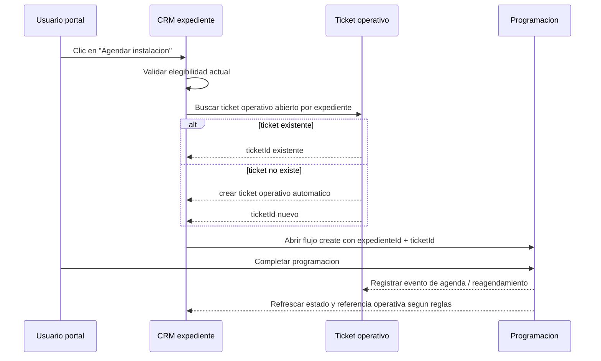

# CRM -> ticket operativo -> programacion de instalacion

- **Version:** v1.0
- **Estado:** En revision
- **Fecha:** 2026-05-09

## Referencias

- `apps/portal/src/app/dashboard/crm/expedientes/[id]/page.tsx`
- `apps/portal/src/components/crm/expedientes/expediente-scheduling.ts`
- `apps/portal/src/components/scheduling/scheduling-expediente-sync.ts`
- `docs/prds/PRD-MOD09-PROGRAMACION-WFM-v1.0.md`
- `docs/prds/PRD-MOD10-SERVICE-ASSURANCE-v1.0.md`
- `docs/adrs/ADR-037-Bounded-Context-Programacion-WFM.md`
- `docs/adrs/ADR-038-Bounded-Context-Service-Assurance.md`

## Contexto

En el portal, un expediente CRM con progreso suficiente ya puede abrir el flujo de `Agendar instalacion` hacia WFM. Hoy ese salto resuelve la programacion, pero no garantiza que la instalacion nazca desde un ticket de seguimiento. El resultado es una brecha de trazabilidad: la agenda existe, pero el caso operativo no siempre tiene una carpeta unica para seguimiento, reasignaciones, reagendamientos y cierre.

La necesidad aprobada es que la instalacion salga de un **ticket operativo** y que el usuario no pierda agilidad. El owner inicial de ese ticket sera **Operaciones / Programacion**, no Mesa de ayuda. La prioridad principal es la **trazabilidad completa expediente -> ticket -> agenda -> ejecucion**, manteniendo pocos clics.

## Objetivo

Definir un flujo donde:

1. el expediente siga siendo el origen comercial;
2. el ticket operativo sea la carpeta viva del seguimiento;
3. la programacion en WFM nunca se abra sin ticket raiz;
4. una misma instalacion reuse el mismo ticket durante reagendamientos y cambios operativos.

## Alternativas consideradas

### Opcion 1 - Ticket automatico como raiz del seguimiento

Al pulsar `Agendar instalacion`, el sistema busca un ticket operativo abierto para ese expediente; si no existe, lo crea automaticamente y luego abre Programacion/WFM con ese contexto.

**Ventajas**

- maximiza trazabilidad;
- mantiene pocos clics;
- evita instalaciones "huerfanas" sin ticket;
- permite reusar el mismo ticket en reagendamientos.

**Costo**

- requiere una pequena orquestacion entre CRM, Assurance y WFM;
- exige idempotencia para no duplicar tickets.

### Opcion 2 - Paso previo de ticket antes de programar

Antes de abrir Programacion, el usuario revisa o completa el ticket.

**Ventajas**

- mas control manual;
- captura inicial mas rica.

**Costo**

- agrega friccion al flujo principal;
- contradice la prioridad de pocos clics.

### Opcion 3 - Ticket derivado despues de programar

Primero se agenda y luego se crea o vincula el ticket.

**Ventajas**

- menor cambio aparente sobre el flujo actual.

**Costo**

- deja una ventana sin trazabilidad obligatoria;
- el ticket deja de ser raiz del proceso.

## Decision aprobada

Se adopta la **opcion 1**: la instalacion debe nacer desde un **ticket operativo automatico**, unico por instalacion, con owner inicial en **Operaciones / Programacion**, y luego abrir WFM ya con ese contexto.

## Modelo funcional

### Roles de cada modulo

- **CRM**: origen comercial del caso, mantiene elegibilidad y referencia de negocio.
- **Assurance / tickets**: owner del seguimiento operativo y del timeline transversal.
- **WFM / Programacion**: owner de la agenda, la visita y la ejecucion tecnica.

### Regla de ownership

El expediente **no** sera la carpeta viva del trabajo. Su papel es iniciar el caso y mostrar referencias. El **ticket operativo** concentra:

- estado operativo;
- responsable o cola;
- historial de reagendamientos;
- referencias a agenda y ejecucion.

### Requester y subject

No todos los tickets deben estar ligados a un cliente. El modelo se separa en:

1. **requester**: quien reporta o solicita;
2. **subject**: el objeto afectado.

Aplicacion del modelo:

- soporte al cliente: requester `SUBSCRIBER`, subject `SERVICE` / `CONTRACT` / `SUBSCRIBER`;
- casos internos: requester `EMPLOYEE` o `SYSTEM`; subject `NETWORK_NODE`, `DEVICE`, `INTERNAL_AREA` o similar;
- instalacion nacida desde CRM: requester `EMPLOYEE` o `SYSTEM`; subject **`EXPEDIENTE`**.

### Ajuste de contrato recomendado

Para trazabilidad fuerte, el modelo de Assurance debe agregar un `subjectType = EXPEDIENTE` en lugar de usar `GENERAL`. El `subjectRefId` almacenara el identificador logico del expediente sin FK cross-module.

## Flujo propuesto

## UX propuesta

### Desde expediente

- El CTA `Agendar instalacion` se mantiene simple para el usuario.
- Antes de abrir WFM, el sistema realiza la orquestacion de ticket en segundo plano.
- Si el ticket se crea o se reutiliza correctamente, WFM abre con:
  - `expedienteId`
  - `ticketId`
  - `type = INSTALLATION`

### Visibilidad en CRM

El expediente debe mostrar:

- codigo del ticket operativo;
- estado actual del ticket;
- responsable actual;
- ultimo movimiento o fecha de actualizacion;
- acceso directo al ticket y a la agenda asociada.

### Visibilidad en WFM

Programacion debe mostrar que el evento pertenece a:

- un expediente comercial origen;
- un ticket operativo concreto.

Esto permite navegar desde agenda a ticket y desde ticket a agenda sin perder contexto.

## Reglas operativas

1. No se abre Programacion si la creacion o recuperacion del ticket falla.
2. Si el usuario reintenta `Agendar instalacion`, el sistema debe reusar el ticket operativo abierto de esa instalacion.
3. Una misma instalacion no debe generar tickets duplicados por reintento de UI o doble clic.
4. Los reagendamientos deben vivir en el mismo ticket, no en tickets nuevos.
5. Si ya existe una agenda activa asociada, la UI debe advertirlo o redirigir al contexto existente.
6. Si el ticket se creo pero falla el alta del evento WFM, el ticket queda vivo para reintento y seguimiento.
7. El cierre operativo ideal es:
   - WFM completa o cancela la visita;
   - el ticket se actualiza con el resultado;
   - CRM o subscriber avanza segun el resultado real del trabajo.

## Integraciones y boundaries

- CRM no debe leer tablas de Assurance ni de WFM directamente.
- Assurance no debe leer tablas de CRM ni de WFM directamente.
- WFM no debe depender de tablas CRM o Assurance para existir.
- El acoplamiento debe resolverse por contratos tipados y referencias logicas:
  - `expedienteId`
  - `ticketId`
  - `workOrderId` cuando aplique

La orquestacion puede vivir en portal para el primer corte si reutiliza APIs existentes, pero el modelo funcional debe asumir que el ticket es parte obligatoria del flujo y no una mejora cosmetica.

## Casos especiales

### Ticket de cliente vs ticket interno

Este diseno separa claramente:

- **ticket de cliente**: originado por soporte, facturacion u otra solicitud del suscriptor;
- **ticket interno**: originado por un empleado, sistema o area operativa sobre un activo, nodo, area o expediente.

La instalacion desde CRM cae en la segunda categoria: **ticket interno operativo**.

### Incidencias internas de empresa

Ejemplos:

- caida de red: requester `SYSTEM` o `EMPLOYEE`, subject `NETWORK_NODE`;
- trabajo en nodo: requester `EMPLOYEE`, subject `NETWORK_NODE` o `DEVICE`;
- ajuste interno de una factura: requester `EMPLOYEE`, subject segun contrato o area afectada.

Esto evita forzar una relacion artificial con cliente cuando el caso real es interno.

## Validacion esperada

1. no es posible abrir Programacion sin ticket;
2. el mismo expediente no genera tickets duplicados por reintento;
3. el mismo ticket acumula reagendamientos;
4. CRM, ticket y agenda muestran referencias navegables entre si;
5. el contrato de tickets soporta `subjectType = EXPEDIENTE`.

## Alcance

### Incluye

- convertir el ticket operativo en requisito obligatorio del agendamiento;
- modelar la instalacion CRM como ticket interno operativo;
- introducir `EXPEDIENTE` como subject tipado recomendado;
- definir reuso de ticket y trazabilidad transversal.

### No incluye

- redisenar por completo Mesa de ayuda;
- definir todos los estados finales de cierre tecnico;
- automatizar toda la sincronizacion de cierre entre WFM, CRM y subscribers en esta misma decision.

## Riesgos y mitigacion

- **Riesgo:** duplicacion de tickets por doble clic o reintento.  
  **Mitigacion:** busqueda idempotente por expediente + ticket abierto antes de crear uno nuevo.

- **Riesgo:** modelar la instalacion como ticket de cliente cuando es un caso operativo interno.  
  **Mitigacion:** separar requester de subject y agregar `EXPEDIENTE` como tipo explicito.

- **Riesgo:** abrir agenda aunque falle el ticket.  
  **Mitigacion:** la creacion o recuperacion del ticket es gate obligatorio del flujo.

- **Riesgo:** que CRM siga actuando como owner operativo.  
  **Mitigacion:** dejar visible la referencia en CRM, pero concentrar seguimiento y timeline en el ticket.
