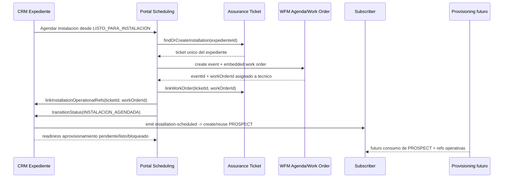

# Refinamiento CRM — agendamiento de instalacion, subscriber y readiness de aprovisionamiento

**Version:** v1.1
**Estado:** Aprobado para ejecucion Fullstack incremental
**Fecha:** 2026-05-11
**Modo activo:** Mixto
**Modulo:** MOD05 CRM / MOD09 WFM / MOD10 Service Assurance
**Owner funcional:** CRM como origen comercial; WFM como owner de agenda y Work Orders; Assurance como owner de tickets; Provisioning futuro como owner de ejecucion tecnica.

---

## 1. Contexto

El flujo actual de CRM permite llevar un expediente a `LISTO_PARA_INSTALACION` y luego abrir Programacion para crear el evento tecnico. La integracion ya asegura ticket operativo, evento WFM y work order, pero quedaron cuatro reglas de negocio por cerrar como fuente de verdad:

1. `Agendar instalacion` no debe volver a habilitarse cuando el expediente ya paso a `INSTALACION_AGENDADA`.
2. El subscriber `PROSPECT` debe crearse al quedar la instalacion agendada, no antes.
3. Debe existir un solo ticket de instalacion por expediente; cambios posteriores actualizan ese ticket.
4. Toda instalacion agendada debe generar una Work Order asignada a un tecnico.

Esta spec ajusta ADR-027 y el handoff CRM -> WFM -> Assurance sin cambiar stack, tenancy ni boundaries aprobados.

Actualizacion v1.1: se aprueba separar `Subscriber PROSPECT` de provisioning real. `INSTALACION_AGENDADA` crea identidad operativa y expone readiness de aprovisionamiento; no activa servicio, contrato ni facturacion.

## 2. Decision aprobada

Se adopta la politica **Subscriber on scheduled installation**:

- `LISTO_PARA_INSTALACION` queda como estado de readiness comercial-operativa.
- `INSTALACION_AGENDADA` se convierte en el hito que crea o reutiliza el subscriber `PROSPECT`.
- La transicion `LISTO_PARA_INSTALACION -> INSTALACION_AGENDADA` exige `ticketId` y `workOrderId` persistidos en el expediente.
- El ticket de instalacion es unico por expediente, incluso si se reagenda, se cambia tecnico o se agrega informacion.
- WFM mantiene ownership de agenda y Work Orders; CRM solo guarda referencias logicas.
- Assurance mantiene ownership de tickets; WFM/CRM no crean tickets por acceso directo a tablas.

Se adopta adicionalmente la politica **Subscriber PROSPECT + readiness de aprovisionamiento**:

- El subscriber `PROSPECT` creado en `INSTALACION_AGENDADA` es una identidad operativa pre-activacion.
- La preparacion para aprovisionamiento se expone como lectura operativa separada del estado del subscriber.
- CRM puede calcular o publicar readiness, pero no ejecuta provisioning real ni toma ownership del modulo futuro.
- `CLIENTE_ACTIVO` sigue siendo el hito de activacion del subscriber, no el cierre de Work Order por si solo.

## 3. Flujo objetivo

## 4. Reglas funcionales

| ID | Regla | Fuente de verdad |
| --- | --- | --- |
| RF-CRM-INST-01 | `Agendar instalacion` solo esta disponible si el expediente esta en `LISTO_PARA_INSTALACION`, readiness permite transicion y avance >= 75%. | Portal + backend de transicion |
| RF-CRM-INST-02 | Desde `INSTALACION_AGENDADA` no se permite volver a `LISTO_PARA_INSTALACION` por selector ni API. | `StatusTransitionService` |
| RF-CRM-INST-03 | `INSTALACION_AGENDADA` requiere `ticketId` y `workOrderId` no vacios en `ExpedienteRecord`. | `StatusTransitionService` |
| RF-CRM-INST-04 | Al entrar a `INSTALACION_AGENDADA`, CRM crea/reutiliza un subscriber `PROSPECT` idempotente por `expedienteId`. | `SubscriberCreationService` |
| RF-CRM-INST-05 | `LISTO_PARA_INSTALACION` no crea subscriber. | `ExpedienteService` + eventos |
| RF-CRM-INST-06 | Assurance debe retornar el mismo ticket de instalacion para un expediente aunque el ticket este cerrado o cancelado. | `TicketsService.findOrCreateInstallationTicket` |
| RF-CRM-INST-07 | Reagendar, cambiar tecnico o agregar informacion actualiza el evento/ticket existente; no crea un segundo ticket del expediente. | WFM + Assurance |
| RF-CRM-INST-08 | La Work Order de instalacion se crea como parte del evento WFM y queda asignada al tecnico seleccionado. | `ScheduleEventsService` / `WorkOrdersService` |
| RF-CRM-INST-09 | El subscriber `PROSPECT` creado en `INSTALACION_AGENDADA` debe distinguirse de cliente activo y no dispara contrato, facturacion, consumo ni provisioning real. | ADR-027 + Subscriber 360 |
| RF-CRM-INST-10 | El expediente/subscriber debe exponer readiness de aprovisionamiento separado del estado del subscriber. | CRM read model / Portal |
| RF-CRM-INST-11 | El readiness minimo distingue `PENDIENTE_DE_DATOS`, `LISTO_PARA_APROVISIONAR`, `BLOQUEADO` y `ERROR_REINTENTABLE`. | CRM read model / Portal |
| RF-CRM-INST-12 | Si falla la creacion automatica del subscriber, la transicion a `INSTALACION_AGENDADA` no se revierte; la condicion queda visible y reintentable. | `SubscriberCreationService` + Portal |
| RF-CRM-INST-13 | `LISTO_PARA_APROVISIONAR` requiere subscriber PROSPECT, documento/party, direccion de instalacion, contacto operativo, plan/servicio, tecnologia/cobertura, `ticketId`, `workOrderId`, tecnico asignado y consentimientos minimos. | CRM readiness |

## 5. Readiness de aprovisionamiento

El objetivo del punto 2 no es ejecutar provisioning al agendar, sino preparar una entidad operativa consistente para que Provisioning pueda actuar cuando el modulo owner exista. Por eso se aprueba el siguiente modelo:

| Estado | Uso operativo |
| --- | --- |
| `PENDIENTE_DE_DATOS` | El subscriber existe, pero faltan datos para preparar provisioning. |
| `LISTO_PARA_APROVISIONAR` | Subscriber y referencias operativas estan completas para que Provisioning futuro pueda iniciar. |
| `BLOQUEADO` | Existe una condicion funcional, documental o tecnica que impide avanzar. |
| `ERROR_REINTENTABLE` | Fallo la creacion/sincronizacion del subscriber o su lectura operativa; requiere reintento. |
| `APROVISIONADO` | Reservado para el modulo Provisioning real; no debe simularse en CRM. |

Reglas de interpretacion:

1. `SubscriberStatus.PROSPECT` + `LISTO_PARA_APROVISIONAR` no equivale a `SubscriberStatus.ACTIVE`.
2. La Work Order cerrada no activa por si sola subscriber ni contrato.
3. La UI debe mostrar mensajes operativos, no estados tecnicos internos ni UUID completos.
4. El error de creacion de subscriber debe ser recuperable por reintento operativo y trazable en timeline/auditoria.

## 6. Impacto tecnico esperado

### Backend CRM

- Endurecer `StatusTransitionService` para validar aristas permitidas del pipeline, no solo requisitos del estado destino.
- Mover la emision de evento de creacion de subscriber desde `LISTO_PARA_INSTALACION` hacia `INSTALACION_AGENDADA`.
- Preferir un evento semantico nuevo, por ejemplo `crm.expediente.installation-scheduled`, para evitar que `ready-for-installation` signifique dos cosas.
- Mantener idempotencia por `expedienteId` en `SubscriberCreationService`.
- Agregar una lectura de readiness de aprovisionamiento derivada de datos del expediente/subscriber, sin acceder a tablas de WFM, Assurance ni Provisioning.
- Registrar o exponer fallos de creacion automatica como estado reintentable; no revertir la transicion del expediente.

### Backend Assurance

- Ajustar `findOrCreateInstallationTicket` para buscar cualquier ticket de instalacion por `subjectType=EXPEDIENTE` + `subjectRefId=expedienteId`, sin filtrar solo estados abiertos.
- Si existe, retornar el ticket existente y `created=false`.
- Si no existe, crear uno `OPERATIONAL_TASK` en cola `OPERATIONS`.

### Backend WFM

- Mantener la restriccion de un evento activo por expediente.
- La creacion desde CRM debe exigir work order embebida y tecnico asignado.
- Reagendar o cambiar tecnico debe modificar el evento existente y conservar `ticketId`/`workOrderId`.

### Portal

- En detalle de expediente, ocultar o deshabilitar `Agendar instalacion` cuando el estado sea `INSTALACION_AGENDADA` o posterior.
- En Programacion, si ya existe evento activo para el expediente, abrir el existente en lugar de crear otro.
- Mostrar referencias de negocio, no UUID completos.
- Si falla la sincronizacion CRM posterior a la creacion WFM, mostrar aviso de operacion parcial y permitir reintento controlado.
- En detalle de expediente y Subscriber 360, mostrar readiness de aprovisionamiento con etiquetas de negocio: pendiente de datos, listo para aprovisionar, bloqueado o error reintentable.

## 7. Fuera de alcance

- Provisioning real del servicio.
- Activacion de contrato o facturacion.
- Estado `APROVISIONADO` real mientras no exista modulo Provisioning owner.
- App movil de tecnico.
- Inventario/materiales avanzados.
- Portal contratista dedicado.
- Cambios de schema salvo que la implementacion encuentre una constraint necesaria para unicidad fuerte.

## 8. Criterios de aceptacion

1. Un expediente en `LISTO_PARA_INSTALACION` puede abrir Programacion y crear evento con ticket unico y Work Order.
2. Al crear el evento WFM desde CRM, el expediente queda en `INSTALACION_AGENDADA` con `ticketId` y `workOrderId` persistidos.
3. La transicion a `INSTALACION_AGENDADA` crea o reutiliza subscriber `PROSPECT` vinculado por `expedienteId`.
4. La transicion a `LISTO_PARA_INSTALACION` no crea subscriber.
5. Un segundo intento de agendar el mismo expediente abre el evento existente o bloquea la duplicacion; no crea segundo ticket ni segundo evento activo.
6. `findOrCreateInstallationTicket` devuelve el mismo ticket aunque el ticket previo este cerrado o cancelado.
7. La API rechaza retroceder desde `INSTALACION_AGENDADA` a `LISTO_PARA_INSTALACION`.
8. Reagendar o cambiar tecnico actualiza el evento existente y conserva el mismo ticket.
9. El subscriber `PROSPECT` creado en `INSTALACION_AGENDADA` muestra readiness de aprovisionamiento sin activar servicio.
10. Si faltan datos minimos, la UI muestra pendiente/bloqueado en lugar de simular aprovisionamiento.
11. Si falla la creacion automatica del subscriber, el expediente conserva `INSTALACION_AGENDADA` y muestra error reintentable.
12. Las pruebas focalizadas de CRM, Assurance, WFM y Portal pasan con `pnpm`.
13. No hay PII real, secretos ni UUID completos expuestos innecesariamente en UI o mensajes de error.

## 9. Archivos probables para ejecucion Fullstack

| Area | Archivos |
| --- | --- |
| CRM backend | `apps/api/src/modules/crm/expedientes/status-transition.service.ts`, `apps/api/src/modules/crm/expedientes/expediente.service.ts`, `apps/api/src/modules/crm/subscribers/subscriber-creation.service.ts`, `apps/api/src/modules/crm/subscribers/subscribers.service.ts` |
| CRM tests | `apps/api/src/modules/crm/expedientes/tests/status-transition.service.spec.ts`, `apps/api/src/modules/crm/expedientes/tests/expediente.service.spec.ts`, `apps/api/src/modules/crm/subscribers/tests/subscriber-creation.service.spec.ts`, `apps/api/src/modules/crm/subscribers/tests/subscribers.service.spec.ts` |
| Assurance backend | `apps/api/src/modules/assurance/services/tickets.service.ts`, `apps/api/src/modules/assurance/tests/tickets.service.spec.ts` |
| WFM backend | `apps/api/src/modules/wfm/services/schedule-events.service.ts`, `apps/api/src/modules/wfm/tests/schedule-events.service.spec.ts` |
| Portal | `apps/portal/src/app/dashboard/crm/expedientes/[id]/page.tsx`, `apps/portal/src/components/crm/expedientes/expediente-scheduling.ts`, `apps/portal/src/components/scheduling/SchedulingClient.tsx`, `apps/portal/src/components/scheduling/ScheduleEventForm.tsx`, `apps/portal/src/app/dashboard/crm/subscribers/[id]/page.tsx` |
| Portal tests | `apps/portal/src/components/crm/expedientes/expediente-scheduling.spec.ts`, `apps/portal/src/components/scheduling/SchedulingClient.spec.tsx`, `apps/portal/src/components/scheduling/ScheduleEventForm.spec.tsx`, tests de Subscriber 360/readiness si existen en la fase |

## 10. Referencias

- `docs/adrs/ADR-027-Conversion-Expediente-Subscriber-Two-Stage.md`
- `docs/adrs/ADR-037-Bounded-Context-Programacion-WFM.md`
- `docs/adrs/ADR-038-Bounded-Context-Service-Assurance.md`
- `docs/hlds/HLD-MOD05-ARQUITECTURA-v2.0.md`
- `docs/prds/PRD-MOD05-CRM-SUBSCRIBERS-FASE-03-v1.0.md`
- `docs/specs/SPEC-MOD09-PROGRAMACION-WFM-DISENO-v1.0.md`
- `docs/specs/SPEC-MOD10-SERVICE-ASSURANCE-DISENO-v1.0.md`

## 11. Handoff

Esta spec queda lista para plan de implementacion Fullstack incremental. El plan debe ejecutar TDD por capas: primero reglas de transicion CRM, luego evento de subscriber, luego lectura de readiness de aprovisionamiento, luego unicidad de ticket Assurance, luego orquestacion portal/WFM y finalmente validaciones focalizadas CRM -> Programacion -> Subscriber 360.
