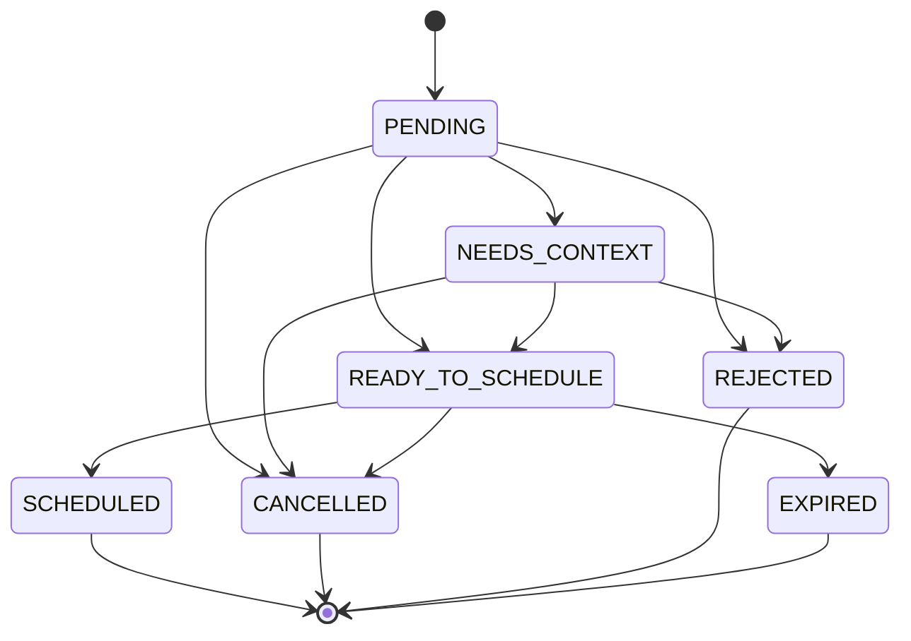

# Design — MOD09 bandeja de visitas pendientes

**Version:** 1.0
**Estado:** Aprobado
**Fecha:** 2026-05-15
**Modo activo:** Mixto
**Prompt de entrada:** `docs/prompts/PROMPT-MOD09-BANDEJA-VISITAS-PENDIENTES-v1.0.md`
**PRD rector:** `docs/prds/PRD-MOD09-PROGRAMACION-WFM-v1.0.md`
**HLD relacionado:** `docs/hlds/HLD-MOD09-PROGRAMACION-WFM-v1.0.md`
**ADR rector:** `docs/adrs/ADR-039-Bandeja-Visitas-Pendientes-WFM.md`
**ADRs relacionados:** `docs/adrs/ADR-037-Bounded-Context-Programacion-WFM.md`, `docs/adrs/ADR-038-Bounded-Context-Service-Assurance.md`

---

## 1. Problema

MOD09 ya tiene agenda, Work Orders ligeras, command center y recomendaciones territoriales, pero el flujo principal de decisión sigue demasiado concentrado en superficies de agenda ya existentes y no resuelve bien el ingreso unificado de trabajo desde CRM, Assurance y operación manual.

Eso deja cuatro fricciones:

1. CRM y Assurance no comparten un punto común de entrada antes del agendamiento.
2. El modal y la creación directa de eventos no escalan bien para una semana operativa con 10, 20 o más técnicos.
3. Assurance necesita originar trabajo de campo sin volverse owner de Work Orders ni leer tablas WFM.
4. `SALES` necesita un acceso acotado al flujo CRM sin abrir la bandeja global ni la matriz completa de despacho.

---

## 2. Decisión de diseño

Se adopta un **inbox nativo en WFM** basado en una nueva entidad owner `VisitRequest`.

La decisión aprobada es:

1. `VisitRequest` vive dentro de `WfmModule` y representa una solicitud programable antes de existir `ScheduleEvent`.
2. La superficie principal pasa a ser `pending-visits`, compuesta por bandeja, matriz semanal y panel de recomendaciones.
3. `ScheduleEventForm` queda como confirmación o fallback, no como superficie principal de decisión.
4. CRM, Assurance y el flujo manual solo envían referencias lógicas y snapshot operativo mínimo; WFM no lee tablas de otros bounded contexts.
5. Assurance materializa solicitudes hacia WFM mediante **BullMQ en `apps/worker`**.
6. `SALES` tiene acceso limitado a solicitudes CRM propias o abiertas por él; no accede a la bandeja operativa global.

Se descartan dos alternativas:

- **Prebandeja mínima sobre Scheduling actual:** reduce costo inicial, pero contradice el objetivo del prompt y mantiene deuda UX.
- **Integración asíncrona dominante para todo el flujo:** desacopla más, pero agrega complejidad innecesaria para este corte y empeora la trazabilidad inmediata.

---

## 3. Arquitectura y boundaries

### 3.1 Ownership

- **WFM** es owner de `VisitRequest`, `ScheduleEvent`, `WorkOrder`, disponibilidad y recomendaciones.
- **CRM** sigue siendo owner del expediente y solo conserva referencias lógicas a resultados WFM.
- **Assurance** sigue siendo owner del ticket y solo origina la necesidad de campo; no crea Work Orders.
- **Worker** materializa solicitudes originadas desde Assurance hacia WFM.

### 3.2 Regla de boundaries

1. WFM no lee tablas de CRM, Assurance, Contracts, Provisioning, Inventory ni Users fuera de patrones ya aprobados.
2. No se crean FKs cross-module ni cross-schema.
3. Toda referencia externa es lógica: `expedienteId`, `ticketId`, `subscriberId`, `contractId`.
4. El agendamiento final sucede solo dentro de WFM.

### 3.3 Permisos

| Rol | Alcance |
| --- | --- |
| `ADMIN`, `NOC`, `SUPPORT` | Bandeja global, matriz semanal, recomendaciones y agendamiento |
| `SALES` | Crear/abrir solicitudes CRM propias o abiertas por él; sin bandeja global ni matriz global |
| `TECHNICIAN`, `CONTRACTOR` | Sin acceso a la bandeja global |

---

## 4. Modelo de datos

### 4.1 Nueva tabla tenant-aware

Se crea `visit_requests` en schema tenant.

Campos funcionales principales:

- `status`
- `origin_context`
- `origin_ref`
- `origin_label`
- `work_type`
- `priority`
- `title`
- `description`
- `requested_window_start_at`
- `requested_window_end_at`
- `sla_due_at`
- `address`
- `municipality`
- `sector`
- `latitude`
- `longitude`
- `expediente_id`
- `subscriber_id`
- `ticket_id`
- `contract_id`
- `schedule_event_id`
- `work_order_id`
- `requested_by_user_id`
- `scheduled_by_user_id`
- `scheduled_at`
- `cancelled_at`
- `cancelled_by_user_id`
- `cancel_reason`
- `created_at`
- `updated_at`
- `deleted_at`

### 4.2 Reglas de datos

1. `origin_label` no puede contener nombre completo, documento, teléfono, email ni otra PII sensible.
2. `address` se permite como snapshot operativo mínimo para despacho.
3. `description` es operativa y no debe replicar notas sensibles completas.
4. Las refs de salida `schedule_event_id` y `work_order_id` solo se completan al agendar.

### 4.3 Índices

Índices mínimos:

1. `(tenant_id, status, created_at)`
2. `(tenant_id, origin_context, origin_ref)` cuando `origin_ref` exista
3. `(tenant_id, ticket_id)` cuando `ticket_id` exista
4. `(tenant_id, expediente_id)` cuando `expediente_id` exista
5. `(tenant_id, subscriber_id)` cuando `subscriber_id` exista
6. `(tenant_id, municipality, sector)`
7. `(tenant_id, sla_due_at)` cuando `sla_due_at` exista

---

## 5. Máquina de estados

Estados aprobados:

- `PENDING`
- `NEEDS_CONTEXT`
- `READY_TO_SCHEDULE`
- `SCHEDULED`
- `CANCELLED`
- `REJECTED`
- `EXPIRED`

Reglas:

1. `PENDING` representa ingreso inicial aún no clasificado del todo.
2. `NEEDS_CONTEXT` bloquea recomendaciones y agendamiento hasta completar datos mínimos.
3. `READY_TO_SCHEDULE` habilita recomendaciones y agendamiento.
4. `SCHEDULED`, `CANCELLED`, `REJECTED` y `EXPIRED` son terminales para este corte.
5. Una solicitud terminal no puede generar otro evento activo desde la misma fila.

Transiciones permitidas:

---

## 6. Flujo backend

### 6.1 Servicio orquestador

Se crea `VisitRequestsService` dentro de `WfmModule`.

Responsabilidades:

1. listar y obtener detalle;
2. crear solicitud y autoevaluar completitud;
3. completar contexto;
4. validar duplicidad e idempotencia;
5. pedir recomendaciones reutilizando `ScheduleRecommendationsService`;
6. agendar transaccionalmente;
7. cancelar o rechazar solicitud.

### 6.2 Idempotencia

Para solicitudes no terminales, se evita duplicidad por:

`(tenantId, originContext, originRef, workType)` cuando `originRef` exista.

Para el agendamiento:

1. solo `READY_TO_SCHEDULE` puede agendar;
2. si la solicitud ya quedó `SCHEDULED`, la operación debe comportarse de forma idempotente y no crear un segundo evento activo;
3. la transacción crea `ScheduleEvent`, crea `WorkOrder` si aplica, actualiza refs y cambia estado a `SCHEDULED`.

### 6.3 Reutilización obligatoria

Se reutilizan:

- `ScheduleRecommendationsService`
- `ScheduleConflictService`
- `ScheduleEventsService`
- `WorkOrdersService`

No se autoriza duplicar el algoritmo territorial ni reimplementar validaciones de solape ya existentes.

---

## 7. Contrato API

Base path: `/api/v1/wfm/visit-requests`

Operaciones aprobadas:

| Método | Ruta | Uso |
| --- | --- | --- |
| `GET` | `/` | Listar solicitudes |
| `POST` | `/` | Crear solicitud |
| `GET` | `/:id` | Obtener detalle |
| `PATCH` | `/:id` | Completar contexto |
| `POST` | `/:id/schedule-recommendations` | Obtener recomendaciones para la solicitud |
| `POST` | `/:id/schedule` | Agendar solicitud |
| `POST` | `/:id/cancel` | Cancelar |
| `POST` | `/:id/reject` | Rechazar |

Reglas:

1. DTOs validados con Zod en todos los boundaries externos.
2. Endpoints protegidos con `JwtAuthGuard`, `RolesGuard` y `@Roles(UserRole.*)`.
3. `TECHNICIAN` y `CONTRACTOR` no acceden a la bandeja global.
4. `SALES` no consume el listado global; su acceso queda acotado al flujo CRM permitido.

---

## 8. Integraciones

### 8.1 CRM → WFM

CRM deja de abrir directamente la decisión principal de agenda y primero crea o abre un `VisitRequest`.

Reglas:

1. CRM envía `originContext=CRM`, `originRef=expedienteId` y labels operativos sin PII.
2. CRM conserva sincronización posterior de refs lógicas (`scheduleEventId`, `workOrderId`).
3. Si ya existe una solicitud no terminal para el mismo expediente y tipo, el flujo debe reusar esa solicitud en lugar de crear otra.

### 8.2 Assurance → Worker → WFM

Assurance publica un job BullMQ. El worker materializa la solicitud hacia WFM.

Reglas:

1. Si faltan datos operativos mínimos, la solicitud se crea en `NEEDS_CONTEXT`.
2. Assurance no crea Work Orders.
3. Después del agendamiento, WFM habilita o dispara el enlace posterior de `workOrderId` hacia Assurance.
4. Si la sincronización posterior falla, la agenda WFM no se revierte; el fallo queda visible para retry/control.

### 8.3 Manual → WFM

Desde Programación se permite crear solicitudes manuales para soportes internos, mantenimiento o tareas operativas sin cliente directo.

El actor autenticado queda auditado como `requested_by_user_id`.

---

## 9. Diseño portal

### 9.1 Ruta y composición

La superficie principal queda en:

`/dashboard/scheduling/pending-visits`

Componentes esperados:

1. `PendingVisitRequestsView`
2. `PendingVisitRequestInbox`
3. `WeeklyTechnicianMatrix`
4. `VisitRequestRecommendationPanel`
5. `ScheduleVisitRequestConfirmDialog`

### 9.2 Reglas UX

1. Copy en español, denso y operativo.
2. No mostrar UUIDs como información principal.
3. Scroll estable y soporte para 10, 20 o más técnicos.
4. La matriz semanal es superficie de decisión; el modal queda como confirmación compacta.
5. Estados vacíos, loading y errores parciales deben estar resueltos explícitamente.

### 9.3 Gating visual

1. `ADMIN`, `NOC`, `SUPPORT` ven bandeja global y matriz global.
2. `SALES` ve solo el flujo limitado permitido.
3. `TECHNICIAN` y `CONTRACTOR` no ven la bandeja global.

---

## 10. Errores y resiliencia

1. Si faltan datos mínimos para recomendar, la API responde con faltantes concretos y la UI mantiene la solicitud en `NEEDS_CONTEXT`.
2. Si hay conflicto de agenda, el agendamiento falla sin dejar `ScheduleEvent` parcial.
3. Si falla la sincronización posterior con CRM o Assurance, WFM conserva la operación principal y expone el fallo como condición operativa reintentable.
4. No se silencian errores de validación ni de tenancy.

---

## 11. Testing

### 11.1 Backend

Cobertura mínima:

1. transiciones válidas e inválidas de estado;
2. duplicidad por origen y tipo;
3. idempotencia de agendamiento;
4. recomendaciones y validación de faltantes;
5. roles y tenant isolation;
6. rechazo de accesos globales a `TECHNICIAN` y `CONTRACTOR`.

### 11.2 Frontend

Cobertura mínima:

1. render de bandeja e inbox;
2. filtros y estados vacíos;
3. matriz semanal;
4. panel de recomendaciones;
5. confirmación de agenda;
6. gating visual por rol, incluido acceso limitado de `SALES`.

### 11.3 E2E

Flujos focales:

1. CRM → solicitud → recomendaciones → agenda;
2. Assurance → `NEEDS_CONTEXT` → completar → agenda;
3. Manual → solicitud → agenda;
4. rol restringido sin acceso a la bandeja global.

---

## 12. Fuera de alcance

- mapa operativo;
- realtime, WebSocket o SSE;
- drag-and-drop o resize de agenda;
- optimización de rutas con tráfico;
- IA predictiva;
- app móvil offline;
- lecturas directas de WFM hacia tablas de CRM o Assurance.

---

## 13. Criterios de aceptación del diseño

1. Existe una entidad owner `VisitRequest` en WFM sin romper boundaries.
2. CRM, Assurance y manual usan el mismo punto conceptual de entrada antes del agendamiento.
3. Assurance materializa por BullMQ en `apps/worker`.
4. `SALES` queda limitado a solicitudes CRM propias o abiertas por él.
5. El agendamiento final crea `ScheduleEvent` y `WorkOrder` en transacción tenant-aware e idempotente.
6. La UI principal de decisión deja de ser el modal actual.

---

## 14. Referencias

- `AGENTS.md`
- `docs/prompts/PROMPT-MOD09-BANDEJA-VISITAS-PENDIENTES-v1.0.md`
- `docs/prds/PRD-MOD09-PROGRAMACION-WFM-v1.0.md`
- `docs/hlds/HLD-MOD09-PROGRAMACION-WFM-v1.0.md`
- `docs/adrs/ADR-037-Bounded-Context-Programacion-WFM.md`
- `docs/adrs/ADR-038-Bounded-Context-Service-Assurance.md`
- `docs/adrs/ADR-039-Bandeja-Visitas-Pendientes-WFM.md`
- `docs/specs/SPEC-MOD09-BANDEJA-VISITAS-PENDIENTES-v1.0.md`
- `docs/plans/PLAN-MOD09-BANDEJA-VISITAS-PENDIENTES-v1.0.md`

## 15. Handoff

Esta spec queda lista para pasar a plan de implementación. El siguiente paso debe convertir este diseño en un plan por slices verticales: contratos + migración, servicio WFM, integraciones CRM/Assurance/manual, portal, pruebas y actualización del informe vivo.
