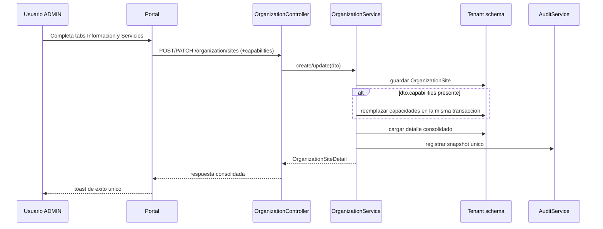

# Design — MOD00 modal unificado de sede y servicios

**Version:** 1.1
**Estado:** Aprobado
**Fecha:** 2026-05-25
**Modo activo:** Architect
**Origen:** Conversacion de refinamiento UX y contrato API para `/dashboard/settings/organization`
**ADR rector:** `docs/adrs/ADR-040-Configuracion-Control-Plane-Organizacion-Acceso.md`
**ADR relacionado:** `docs/adrs/ADR-043-Edicion-Atomica-Sede-Capacidades.md`
**PRD rector:** `docs/prds/PRD-MOD00-CONFIGURACION-CONTROL-PLANE-v1.0.md`
**HLD relacionado:** `docs/hlds/HLD-MOD00-CONFIGURACION-CONTROL-PLANE-v1.0.md`
**Spec antecedente:** `docs/specs/2026-05-21-mod00-configuracion-fase-01-design.md`
**Informe vivo:** `docs/informes/INFORME-MOD00-CONFIGURACION-CONTROL-PLANE-v1.0.md`

---

## 1. Objetivo

Reducir saturacion visual y friccion operativa en la seccion **Perfil empresarial y organizacion** unificando en un solo modal la configuracion de datos base de una sede y sus servicios activos.

La vista principal de `Sedes registradas` debe mantenerse como una superficie administrativa liviana: la sede se crea y se gestiona aqui, pero el detalle operativo profundo se reserva para los modulos que despues consumiran `OrganizationSite`.

El refinamiento debe cumplir estas metas al mismo tiempo:

1. eliminar la doble edicion actual entre modal y panel lateral;
2. guardar sede y servicios con una sola intencion de usuario;
3. mantener compatibilidad tenant-aware y auditabilidad completa;
4. no romper boundaries de MOD00 ni introducir dependencias cross-module.

---

## 2. Problema actual

El estado vigente en `apps/portal/src/components/settings/OrganizationSettingsClient.tsx` presenta esta secuencia:

1. el modal crea o edita solo los datos base de la sede;
2. la tabla principal obliga a seleccionar la sede;
3. un panel lateral separado muestra detalle y servicios;
4. los servicios se guardan con otra accion y otro endpoint.

Esto genera cuatro problemas concretos:

### 2.1 Saturacion visual

La vista principal muestra al mismo tiempo:

- perfil empresarial;
- configuracion operativa;
- tabla de sedes;
- detalle de sede;
- servicios de la sede.

El usuario ve demasiadas superficies compitiendo por prioridad en una sola pantalla operativa.

### 2.2 Doble guardado

Hoy existe una separacion artificial entre:

- `organizationApi.create()` / `organizationApi.update()` para la sede;
- `organizationApi.replaceCapabilities()` para los servicios.

La intencion real del usuario es una sola: dejar lista la sede.

### 2.3 Estado inconsistente

Si el usuario crea o edita una sede pero no completa el panel lateral, el sistema puede quedar con:

- sede creada sin servicios esperados;
- servicios desactualizados respecto a la edicion recien hecha;
- auditoria fragmentada en dos mutaciones separadas para una sola tarea de negocio.

### 2.4 Redundancia informativa

La tabla ya expone identidad y resumen de servicios. El panel `Detalle de sede` agrega poco valor permanente y ocupa espacio que deberia reservarse para acciones primarias.

---

## 3. Decision de diseño

Se aprueba como direccion de diseño la siguiente combinacion:

1. **modal unificado** para crear y editar sede;
2. **layout por tabs** dentro del modal: `Informacion de la sede` y `Servicios`;
3. **payload unico** desde portal para datos base y servicios;
4. **transaccion unica** en backend cuando el request incluya `capabilities`;
5. **tabla compacta unificada** como superficie principal de `Sedes registradas`;
6. **acciones por fila** para `Editar` y `Dar de baja`, sin seleccion previa obligatoria;
7. **retiro del endpoint separado** `PUT /organization/sites/:siteId/capabilities` una vez migrado el flujo del portal.

No se elige wizard de 2 pasos porque introduce una complejidad de estado innecesaria para una tarea de administracion frecuente. Tampoco se elige accordion como patron principal porque vuelve secundarios los servicios y mantiene el riesgo de que el usuario no los configure en la misma operacion.

Tampoco se elige una tabla densa o una fila expandible como patron base: para MOD00 la sede se administra aqui, pero horarios, recaudo, seguimiento y otros detalles operativos pertenecen a modulos posteriores y no deben forzar una superficie sobredimensionada en esta pantalla.

---

## 4. Alcance aprobado

### Entra en este refinamiento

- reestructuracion del modal de crear/editar sede;
- extension del contrato `CreateOrganizationSiteDto` y `UpdateOrganizationSiteDto` con `capabilities` opcional;
- persistencia atomica de sede + capacidades en `OrganizationService`;
- ajuste de auditoria para reflejar snapshot consolidado;
- simplificacion de la vista principal de Organizacion eliminando la edicion lateral permanente de servicios.

### No entra en este refinamiento

- cambios a horarios, asignaciones o responsables de sede;
- cambios de ownership entre MOD00 y WFM;
- rediseño completo de `CompanyProfileForm` o `OperationalSettingsForm`;
- nuevos permisos o cambios de seguridad fuera de `organization.sites.manage`;
- migraciones de consumidores externos fuera del slice validado de MOD00.

---

## 5. Estado actual anclado en codigo

### Frontend

En `apps/portal/src/components/settings/OrganizationSettingsClient.tsx`:

- `draftCapabilities` forma parte del submit principal del modal unificado;
- `openCreateDialog()` resetea servicios y `openEditDialog()` los hidrata desde el detalle de la sede;
- `onSubmit()` envia `CreateOrganizationSiteDto` o `UpdateOrganizationSiteDto` con `capabilities`;
- la gestion de capacidades ya no depende de un guardado lateral separado.

### API portal

En `apps/portal/src/lib/api-client.ts`:

- `CreateOrganizationSiteDto` y `UpdateOrganizationSiteDto` exponen `capabilities` opcional;
- `organizationApi.replaceCapabilities()` ya no forma parte del contrato tipado vigente.

### Backend

En `apps/api/src/modules/organization/organization.service.ts`:

- `create()` y `update()` persisten `OrganizationSite` y capacidades en la misma transaccion cuando aplica;
- el helper transaccional de capacidades se reutiliza desde create/update sin exponer una mutacion dedicada adicional;
- la auditoria registra un snapshot consolidado por cada accion principal.

---

## 6. Experiencia objetivo

### 6.1 Vista principal de Organizacion

La pantalla principal debe quedar concentrada en:

1. perfil empresarial;
2. configuracion operativa;
3. tabla compacta de sedes como superficie dominante.

Se retiran de la vista persistente:

- el panel `Detalle de sede` como bloque permanente;
- el panel `Servicios de la sede` como editor lateral siempre visible.

La tabla de sedes se mantiene como lista maestra. Las acciones primarias quedan asociadas a cada sede mediante el modal unificado.

Columnas visibles recomendadas para desktop:

- `Sede`: nombre y codigo;
- `Tipo`;
- `Ubicacion`: direccion resumida o municipio/departamento cuando aplique;
- `Servicios`: resumen de capacidades activas;
- `Estado`;
- `Acciones`.

No se muestran como columnas permanentes en esta superficie: coordenadas, contacto operativo local, horarios, responsables, recaudo ni seguimiento. Esos datos viven en el modal o en modulos posteriores cuando la sede ya alimente capacidades operativas concretas.

### 6.2 Modal unificado

El modal de sede se organiza en dos tabs:

#### Tab 1 — Informacion de la sede

- nombre;
- codigo;
- tipo;
- direccion;
- municipio;
- departamento;
- sede principal;
- activa.

#### Tab 2 — Servicios

- listado de capacidades con label amigable;
- contador visible de servicios seleccionados;
- estado vacio explicito cuando no hay ninguno;
- copy breve: `Selecciona los servicios que opera esta sede.`

### 6.3 Comportamiento esperado

- en creacion, el modal abre en `Informacion de la sede` con `Servicios` vacio;
- en edicion, el modal abre en `Informacion de la sede` y precarga `Servicios` desde el detalle;
- el usuario guarda una sola vez;
- el portal envia siempre el array de `capabilities` desde este modal, incluso cuando queda vacio;
- el modal no debe abrir un segundo dialog ni depender de un panel lateral para completar la sede.

---

## 7. Contrato API objetivo

### 7.1 DTOs

`CreateOrganizationSiteDto` y `UpdateOrganizationSiteDto` deben aceptar:

```ts
capabilities?: OrganizationSiteCapability[]
```

Reglas:

1. maximo 32 capacidades;
2. sin duplicados;
3. opcional para compatibilidad hacia atras;
4. si el portal modal unificado envia la propiedad, el backend la considera fuente de verdad.

### 7.2 Semantica de compatibilidad

- `capabilities` omitido en `PATCH`: actualizar solo datos base y conservar servicios actuales;
- `capabilities: []` en `PATCH`: limpiar todos los servicios activos de la sede;
- `capabilities` omitido en `POST`: crear la sede sin servicios;
- `capabilities` presente en `POST`: crear la sede con servicios atomicos.

### 7.3 Retiro del endpoint legacy

`PUT /organization/sites/:siteId/capabilities` se retira del backend y del cliente tipado una vez migrado el portal al payload unificado. Cualquier consumidor futuro debe usar `POST` o `PATCH /organization/sites` con `capabilities` dentro del mismo request.

---

## 8. Secuencia de persistencia



---

## 9. Reglas de backend

1. `OrganizationService.create()` y `OrganizationService.update()` deben absorber la logica de capacidades cuando `dto.capabilities` este presente.
2. La operacion debe seguir ejecutandose dentro de `runInTenantSchema()` y de una sola transaccion.
3. Si falla la persistencia de capacidades, debe revertirse la creacion o actualizacion de la sede.
4. La auditoria de create/update debe guardar un snapshot consolidado que incluya `capabilities`.
5. No debe existir una mutacion publica adicional para capacidades que fragmente la auditoria de una sola accion del usuario.

---

## 10. Reglas de frontend

1. `OrganizationSettingsClient` deja de tratar `draftCapabilities` como guardado lateral separado.
2. El modal debe hidratar y enviar el mismo `draftCapabilities` dentro del submit principal.
3. La interfaz debe conservar `Controller` para componentes de seleccion que dependan de `react-hook-form` y estado controlado.
4. El tab `Servicios` no debe ocultarse ni moverse a un segundo modal.
5. En responsive, los tabs deben seguir siendo legibles en anchos pequeños; si el componente visual del repo no responde bien, se debe usar una variante segmentada simple sin cambiar la decision estructural.
6. La tabla principal no debe obligar a seleccionar una sede para exponer acciones basicas; `Editar` y `Dar de baja` deben estar disponibles por fila.

---

## 11. Boundaries y ownership

Este refinamiento **no cambia ownership**:

- MOD00 sigue siendo owner de `OrganizationSite` y `organization_site_capabilities`;
- WFM no gana ni pierde ownership por esta decision;
- el cambio se limita a experiencia de edicion y consistencia transaccional dentro del mismo bounded context.

Por tanto, no se autoriza ningun acceso cross-module adicional ni se altera la estrategia de puertos aprobada en ADR-040.

---

## 12. Errores y estados limite

### 12.1 Validaciones funcionales

- codigo duplicado por tenant: rechazo normal vigente;
- capacidades duplicadas: rechazo 400;
- capacidad desconocida: rechazo 400;
- usuario sin permiso: 403 sin diferencias respecto al flujo actual.

### 12.2 UX de error

- un fallo de guardado debe mostrarse como un solo error de submit;
- no debe existir exito parcial visible en el portal;
- el modal debe conservar el estado del formulario si el request falla.

---

## 13. Testing requerido

### API

- create de sede con `capabilities`;
- create de sede sin `capabilities`;
- update de sede con `capabilities` presentes;
- update de sede con `capabilities: []`;
- update de sede sin `capabilities` para verificar compatibilidad hacia atras;
- rechazo de duplicados;
- evidencia de auditoria consolidada.

### Portal

- abrir modal de creacion con tabs visibles;
- abrir modal de edicion con servicios precargados;
- submit unico envia datos base + servicios;
- ya no aparece boton lateral `Guardar servicios` como accion primaria;
- regresion del listado de sedes y del dialog existente.

### E2E

- crear sede con servicios desde el mismo modal;
- editar sede y cambiar servicios en el mismo submit;
- verificar que la tabla refleja el resumen actualizado despues del guardado.

---

## 14. Impacto documental

Artefactos a mantener alineados:

- `docs/adrs/ADR-043-Edicion-Atomica-Sede-Capacidades.md`
- `docs/hlds/HLD-MOD00-CONFIGURACION-CONTROL-PLANE-v1.0.md`
- `docs/informes/INFORME-MOD00-CONFIGURACION-CONTROL-PLANE-v1.0.md`

No se requiere nuevo PRD, porque el cambio no altera stack, ownership macro ni alcance funcional de MOD00; refina la experiencia y el patron transaccional dentro de Organizacion.

No se requiere nuevo ADR: la decision no cambia boundaries, tenancy, seguridad ni contratos cross-module; solo acota mejor la superficie administrativa principal de `Sedes registradas`.

---

## 15. Criterio de salida

La implementacion futura de este spec se considerara correcta cuando:

1. la vista principal de Organizacion ya no dependa de un editor lateral persistente de servicios;
2. la vista principal de `Sedes registradas` se resuelva con una sola tabla compacta sin panel persistente de detalle;
3. el modal de sede permita crear o editar datos base y servicios sin salir del flujo;
4. el backend soporte `capabilities` opcional en create/update con transaccion unica;
5. el endpoint legacy de capacidades quede retirado del backend y del cliente tipado;
6. pruebas API, portal y E2E cubran el flujo unificado.
