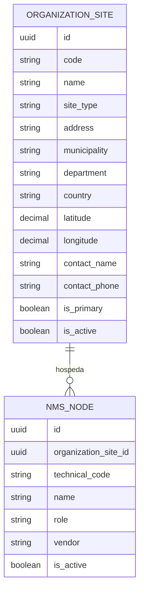

# Design - MOD00 sedes organizacionales y relacion futura con nodos NMS

**Version:** 1.0  
**Estado:** Aprobado  
**Fecha:** 2026-05-23  
**Modo activo:** Architect  
**Autor:** AI-EM-ARCH  
**ADR rector:** docs/adrs/ADR-040-Configuracion-Control-Plane-Organizacion-Acceso.md  
**ADR propuesto:** docs/adrs/ADR-044-Separacion-OrganizationSite-NmsNode.md  
**PRD rector:** docs/prds/PRD-MOD00-CONFIGURACION-CONTROL-PLANE-v1.0.md  
**HLD relacionado:** docs/hlds/HLD-MOD00-CONFIGURACION-CONTROL-PLANE-v1.0.md  
**Informe vivo:** docs/informes/INFORME-MOD00-CONFIGURACION-CONTROL-PLANE-v1.0.md

---

## 1. Objetivo

Definir el refinamiento documental de MOD00 para que:

1. la sede siga siendo el maestro fisico y administrativo del tenant;
2. el futuro nodo tecnico de NMS exista como entidad separada y relacionada;
3. el formulario de sedes capture coordenadas y contacto operativo del sitio;
4. el roadmap hacia NMS quede trazado sin deformar ownership ni contratos actuales.

---

## 2. Problema a resolver

Hoy MOD00 ya posee `OrganizationSite`, mientras que el repo conserva `CommercialNode` legacy para cobertura/comercial. Si se intentara modelar `Nodo` como tipo principal de sede, el sistema mezclaria tres conceptos distintos:

- sede fisica y administrativa;
- nodo comercial/cobertura legacy;
- nodo tecnico futuro consumido por NMS.

Esa mezcla haria mas fragil la evolucion del producto y volveria ambiguo el contrato de MOD00.

---

## 3. Decision de diseño

Se aprueba para diseno la siguiente direccion:

1. `OrganizationSite` sigue siendo el maestro del sitio.
2. `NmsNode` se modela despues como entidad propia de NMS.
3. una sede puede hospedar cero, uno o varios nodos tecnicos.
4. las coordenadas y el contacto operativo local pertenecen a la sede.
5. la UI de sedes no expone campos de nodo NMS en este corte.

---

## 4. Modelo conceptual objetivo

Reglas del modelo:

1. `organization_site_id` vive en NMS, no en MOD00.
2. `site_type` no incorpora `NODE`.
3. `CommercialNode` legacy no se convierte automaticamente en `NmsNode`.

---

## 5. Impacto en UX de MOD00

La pantalla de sedes en Configuracion mantiene el foco en el sitio y no en la red.

### 5.1 Campos objetivo del formulario de sede

- nombre
- codigo
- tipo principal de sede
- direccion
- municipio
- departamento
- pais
- latitud
- longitud
- nombre de contacto del sitio
- telefono de contacto del sitio
- sede principal
- activa
- capacidades

### 5.2 Regla UX

En este refinamiento no se agregan campos de nodo NMS en el modal de sede. Como maximo, una fase posterior podra mostrar un bloque informativo de solo lectura con nodos asociados cuando NMS exista.

### 5.3 Microcopy recomendado

- bloque: `Ubicacion y contacto del sitio`
- ayuda: `Completa estos datos para ubicar la sede y dejar un contacto operativo local.`
- label: `Nombre de contacto`
- label: `Telefono de contacto`

---

## 6. Contrato objetivo para MOD00

En el siguiente refinamiento de `OrganizationSite` se propone endurecer el contrato de create/update para exigir:

- `latitude`
- `longitude`
- `contactName`
- `contactPhone`

Los campos de contacto:

1. no reemplazan responsables ni asignaciones;
2. no implican relacion con `users.id`;
3. representan un contacto operativo local del sitio.

---

## 7. Integracion futura con NMS

Cuando MOD-NMS entre en scope:

1. NMS definira su propia tabla `nms_nodes` en schema tenant.
2. NMS consumira sedes por puerto tipado o API aprobada.
3. la relacion `organization_site_id` podra nacer nullable solo para migraciones o importaciones legacy.
4. NMS debera normalizar progresivamente sus nodos hacia sedes reales cuando aplique.

No se aprueba en este documento:

- unificar `CommercialNode` y `NmsNode`;
- convertir `OrganizationSite` en sustituto del nodo tecnico;
- llevar telemetria o atributos tecnicos de red a MOD00.

---

## 8. Impacto de datos y migracion

Para MOD00, el cambio documental anticipa una migracion aditiva futura sobre `organization_sites` para agregar contacto del sitio y endurecer validaciones de create/update.

Impactos esperados:

1. nuevas columnas nullable en una primera migracion para compatibilidad;
2. backfill manual o asistido donde falte contacto;
3. endurecimiento posterior de DTOs y UX cuando la base este preparada.

---

## 9. Pruebas y evidencia esperada

Cuando se implemente este refinamiento se debe validar como minimo:

1. pruebas unitarias o HTTP para create/update de sede con coordenadas y contacto;
2. pruebas de portal para el modal de sedes con los campos nuevos;
3. E2E ADMIN para alta y edicion de sede;
4. verificacion de que ningun contrato existente trate `NODE` como `siteType`.

---

## 10. Resultado esperado

MOD00 conserva un maestro estable de sedes y deja a NMS crecer con entidad propia. La organizacion administra sitios; NMS administra nodos. La relacion entre ambos existe, pero no colapsa los dos conceptos en un solo campo ni en un solo formulario.
