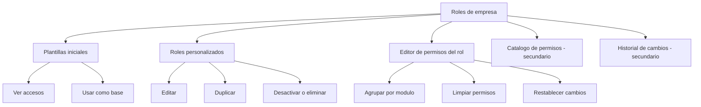

# Design - MOD00 roles de empresa en Access

**Version:** 1.1
**Estado:** Aprobado para ejecucion
**Fecha:** 2026-05-25
**Modo activo:** Mixto
**Origen:** refinamiento funcional y arquitectonico posterior a la inspeccion real de `/dashboard/settings/access` y a la aclaracion de producto sobre ownership entre Access y Users
**ADR rector:** `docs/adrs/ADR-040-Configuracion-Control-Plane-Organizacion-Acceso.md`
**PRD rector:** `docs/prds/PRD-MOD00-CONFIGURACION-CONTROL-PLANE-v1.0.md`
**HLD relacionado:** `docs/hlds/HLD-MOD00-CONFIGURACION-CONTROL-PLANE-v1.0.md`
**Plan relacionado:** `docs/plans/2026-05-25-mod00-roles-de-empresa-implementation.md`
**Informe vivo:** `docs/informes/INFORME-MOD00-CONFIGURACION-CONTROL-PLANE-v1.0.md`

---

## 1. Objetivo

Refinar la ruta `/dashboard/settings/access` para que funcione como una superficie clara de diseno y administracion de roles de empresa del tenant, sin mezclar en la misma vista la asignacion de roles a usuarios.

La pantalla debe quedar centrada en tres conceptos visibles y no ambiguos:

1. **Plantillas iniciales** del sistema como punto de partida.
2. **Roles de empresa** personalizados del tenant.
3. **Permisos** agrupados por modulo para crear, duplicar, editar y revisar esos roles.

---

## 2. Recomendacion aprobada

### 2.1 Decision principal

Se aprueba que la ruta `/dashboard/settings/access` quede limitada a gobierno de roles, plantillas y permisos.

La asignacion de roles de empresa a usuarios no desaparece del producto, pero se mantiene como responsabilidad de `/dashboard/users`, donde ya existe el contexto correcto de cuenta, categoria base, estado y MFA.

### 2.2 Decision de boundary UX

| Superficie | Owner funcional | Que administra |
| --- | --- | --- |
| `/dashboard/settings/access` | Access Control | Plantillas iniciales, roles de empresa, permisos, evidencia de cambios |
| `/dashboard/users` | Users | Cuentas, categoria base, estado, MFA y asignacion de roles de empresa |

### 2.3 Decision negativa explicita

No se debe volver a mostrar dentro de `/dashboard/settings/access` ninguno de estos bloques como parte del flujo principal:

1. Selector de usuario.
2. Reemplazo de roles para un usuario.
3. Permisos efectivos por usuario.

---

## 3. Problema que resuelve

La vista actual es densa y confusa porque mezcla en un mismo viewport tareas que pertenecen a momentos operativos distintos:

1. Entender plantillas iniciales.
2. Crear o editar roles del tenant.
3. Asignar roles a usuarios.
4. Revisar permisos efectivos por usuario.
5. Consultar auditoria y catalogo tecnico.

La consecuencia es perdida de jerarquia, riesgo operativo y una narrativa visual errada: la pantalla parece un centro general de acceso, cuando negocio la usa como taller de diseno de roles.

---

## 4. Alcance

### Entra en este refinamiento

- Reorganizar `/dashboard/settings/access` como modulo de roles de empresa.
- Hacer las plantillas iniciales visibles, entendibles y accionables.
- Permitir crear un rol desde una plantilla o desde cero mediante un selector inicial.
- Agrupar permisos por modulo y reducir la densidad cognitiva del editor.
- Relegar catalogo e historial a superficies secundarias.
- Mantener coherencia de copy con `categoria base`, `rol de empresa` y `plantilla inicial`.

### No entra en este refinamiento

- Cambiar ownership de asignaciones entre Users y Access Control.
- Mover contratos backend entre bounded contexts.
- Crear nuevos `UserRole` o roles backend dinamicos.
- Redisenar el flujo de alta o edicion de usuarios fuera de regresiones de coherencia.

---

## 5. UX objetivo

### 5.1 Jerarquia del primer viewport

El primer viewport debe responder estas tres preguntas sin scroll adicional:

1. Que administra esta pantalla.
2. Como se crea un nuevo rol.
3. Donde se consultan plantillas y roles ya existentes.

Estructura aprobada:

1. Encabezado breve con CTA principal `Crear rol`.
2. Bloque de plantillas iniciales.
3. Bloque de roles personalizados.
4. Editor del rol seleccionado.
5. Catalogo e historial como bloques secundarios.

### 5.2 Arquitectura de informacion aprobada

### 5.3 Reglas de copy

1. En Access se habla de `roles de empresa`, no de `usuarios y acceso`.
2. `UserRole` se presenta como `categoria base compatible`.
3. `AccessProfile.isSystem = true` se presenta como `plantilla inicial`.
4. El copy no debe sugerir que desde esta pantalla se asignan roles a usuarios.

Mensajes base aprobados:

- `Disena roles de empresa a partir de plantillas o desde cero.`
- `Las plantillas iniciales te sirven como punto de partida; no reemplazan tu categoria base.`
- `Los permisos se agrupan por modulo para reducir el esfuerzo de lectura.`

---

## 6. Plantillas iniciales del sistema

Se mantiene el set aprobado de plantillas iniciales:

| Plantilla inicial | Categoria base compatible | Intencion |
| --- | --- | --- |
| Administrador general | `ADMIN` | Gobierno total del tenant |
| NOC monitoreo | `NOC` | Lectura operativa y monitoreo |
| Soporte nivel 1 | `SUPPORT` | Atencion inicial y lectura transversal acotada |
| Tecnico instalador | `TECHNICIAN` | Agenda y ejecucion de work orders |
| Contratista tecnico | `CONTRACTOR` | Operacion de campo limitada |
| Auditor operativo | `AUDITOR` | Lectura de settings, usuarios y acceso |

Reglas UX obligatorias:

1. Cada plantilla debe mostrar nombre, categoria base compatible, resumen corto y conteo de permisos.
2. Cada plantilla debe tener accion `Ver accesos`.
3. Cada plantilla debe permitir `Usar como base` para abrir el flujo de creacion precargado.
4. Las plantillas no deben parecer simples tarjetas decorativas o lectura muerta.

---

## 7. Flujo operativo esperado

### 7.1 Crear rol

El boton `Crear rol` abre un selector inicial con dos opciones:

1. `Usar una plantilla`.
2. `Empezar desde cero`.

### 7.2 Crear desde plantilla

1. El admin abre el selector.
2. Elige `Usar una plantilla`.
3. Selecciona una plantilla inicial.
4. El sistema abre el editor con categoria base y permisos precargados.
5. El admin ajusta nombre, descripcion y permisos.
6. Guarda el nuevo rol.

### 7.3 Crear desde cero

1. El admin abre el selector.
2. Elige `Empezar desde cero`.
3. El sistema abre el editor vacio.
4. El admin define categoria base, nombre, descripcion y permisos.
5. Guarda el rol.

### 7.4 Editar rol existente

1. El admin selecciona un rol del tenant.
2. Revisa o modifica permisos agrupados por modulo.
3. Puede `Limpiar permisos` o `Restablecer cambios`.
4. Guarda cambios.

---

## 8. Diseño tecnico y contratos

### 8.1 Backend

No se requiere ADR nuevo ni contrato backend nuevo para materializar este refinamiento visual si el portal puede reutilizar:

1. `listProfiles()` para roles del tenant y plantillas iniciales.
2. `listPermissions()` para el catalogo versionado.
3. `createProfile()` / `updateProfile()`.
4. `replaceProfilePermissions()`.
5. `deleteProfile()` o la mutacion vigente equivalente.

### 8.2 Regla de implementacion

La opcion `Usar como base` debe resolverse en cliente como prefill del formulario mientras los contratos actuales lo soporten. Solo si se detecta una limitacion real del contrato vigente se debe escalar un ajuste backend menor.

### 8.3 Seguridad

Se mantiene sin cambios la validacion backend:

1. Un rol de empresa no puede usar permisos fuera de su `baseRoleConstraint`.
2. El tenant no puede crear valores nuevos de `UserRole`.
3. La categoria base sigue siendo el limitador estructural del modelo.

---

## 9. Diseño frontend aprobado

### 9.1 Bloque Plantillas iniciales

Cada card de plantilla debe incluir:

1. Nombre de la plantilla.
2. Badge `Plantilla del sistema`.
3. Categoria base compatible.
4. Conteo de permisos.
5. Resumen corto.
6. Accion `Ver accesos`.
7. Accion `Usar como base`.

### 9.2 Bloque Roles personalizados

La lista del tenant debe priorizar escaneo rapido con estas columnas o equivalentes:

1. Nombre.
2. Categoria base compatible.
3. Cantidad de permisos.
4. Estado.
5. Acciones: `Editar`, `Duplicar`, `Desactivar/Eliminar`.

### 9.3 Editor del rol

El editor debe mostrar:

1. Identidad del rol seleccionado.
2. Categoria base compatible.
3. Accion `Guardar cambios`.
4. Permisos agrupados por modulo.
5. Acciones secundarias `Limpiar permisos` y `Restablecer cambios`.

### 9.4 Bloques secundarios

`Catalogo de permisos` e `Historial de cambios` no deben competir con el flujo principal.

Reglas:

1. Deben quedar al final o en modo colapsado.
2. No deben aparecer como tarea primaria en el primer viewport.
3. El historial debe hablar de cambios en roles y permisos, no de usuarios seleccionados.

---

## 10. Work packages para fullstack

### WP1. Reencuadre de la pantalla de Access

- Eliminar del layout principal selector de usuario, asignacion a usuarios y permisos efectivos por usuario.
- Reescribir encabezado, subtitulo y ayudas para hablar solo de roles de empresa.
- Mantener el ownership de Users fuera de esta vista.

### WP2. Plantillas accionables

- Convertir plantillas en cards interactivas.
- Agregar `Ver accesos`.
- Agregar `Usar como base`.
- Mostrar conteo de permisos y categoria base compatible.

### WP3. Creacion de rol con selector inicial

- Hacer que `Crear rol` abra un selector con `Usar una plantilla` o `Empezar desde cero`.
- Prefill desde plantilla sin cambiar contrato si no hace falta.
- Abrir editor vacio cuando el usuario elige empezar desde cero.

### WP4. Editor de permisos con densidad controlada

- Agrupar permisos por modulo.
- Exponer `Limpiar permisos` y `Restablecer cambios`.
- Mantener guardado explicito y feedback claro.

### WP5. Bloques secundarios y validacion

- Relegar catalogo e historial a un rol secundario.
- Cubrir la nueva IA en tests unitarios y E2E.
- Ejecutar regresion focalizada sobre Access y Users para asegurar que la asignacion sigue viviendo en Users.

---

## 11. Pruebas requeridas

### Frontend Access

- Tests de render que confirmen ausencia de selector de usuario y panel de permisos efectivos por usuario en Access.
- Tests de cards de plantillas con acciones visibles.
- Tests del selector inicial de creacion con ambas rutas.
- Tests del editor agrupado por modulo.
- Tests de catalogo e historial como bloques secundarios.

### Frontend Users

- Regresion focalizada para confirmar que la asignacion de roles de empresa sigue en create/edit user.
- Sin nuevo alcance de UX en Users salvo coherencia semantica.

### E2E

- ADMIN entra a `/dashboard/settings/access` y ve una superficie centrada en roles.
- ADMIN puede abrir una plantilla y usarla como base.
- ADMIN puede iniciar un rol desde cero.
- Usuario sin permiso de Access no puede operar la ruta.

---

## 12. Criterios de aceptacion

1. `/dashboard/settings/access` deja de mezclar gestion de roles con asignacion de usuarios.
2. Las plantillas iniciales pueden inspeccionarse y reutilizarse sin ambiguedad.
3. El admin puede crear un rol desde plantilla o desde cero mediante un selector explicito.
4. El editor reduce la densidad agrupando permisos por modulo.
5. Catalogo e historial quedan disponibles sin competir con el flujo principal.
6. No se altera el boundary aprobado entre Access y Users.

---

## 13. Riesgos y mitigaciones

| Riesgo | Mitigacion |
| --- | --- |
| Repetir la misma pantalla con tabs pero sin cambiar jerarquia real | Forzar ausencia de bloques de usuario y redefinir primer viewport |
| Plantillas siguen siendo visualmente pasivas | Hacer obligatorias las acciones `Ver accesos` y `Usar como base` |
| El flujo desde cero queda oculto como hack de `desmarcar todo` | Exponer `Empezar desde cero` como opcion primaria del selector inicial |
| El catalogo vuelve a competir visualmente | Relegarlo a bloque secundario o colapsado |

---

## 14. Decision documental

Este refinamiento no requiere ADR nuevo porque:

1. No cambia stack.
2. No cambia boundary aprobado.
3. No mueve ownership de Users a Access ni viceversa.
4. Corrige una deriva de UX y handoff, no una decision arquitectonica de base.

Esta version 1.1 reemplaza para ejecucion la lectura previa del mismo dia que todavia dejaba elementos de asignacion de usuarios dentro de la pantalla de Roles.
