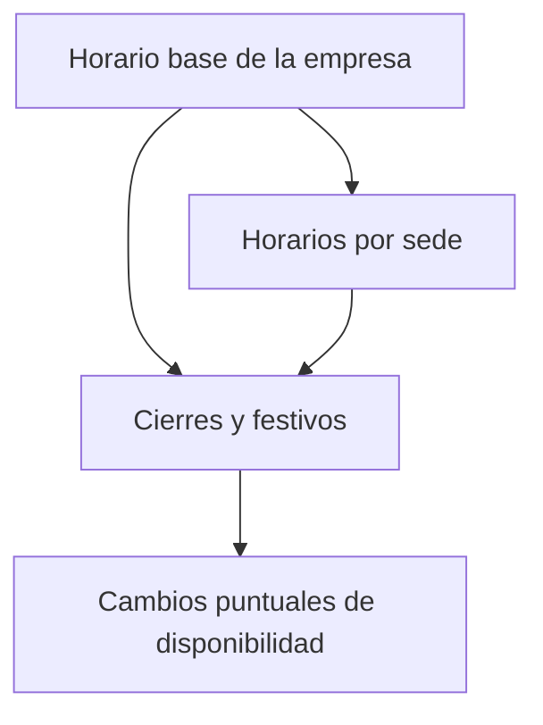

# Design - MOD00 rediseño de Calendario operativo y jornadas

**Version:** 1.4
**Estado:** Aprobado
**Fecha:** 2026-05-30
**Modo activo:** Refinamiento UX/UI con identidad iWana
**Origen:** auditoría visual y funcional de `/dashboard/settings/calendar` sobre la experiencia actual del portal
**ADR rector:** `docs/adrs/ADR-040-Configuracion-Control-Plane-Organizacion-Acceso.md`
**ADR relacionado:** `docs/adrs/ADR-042-Calendario-Operativo-Jornadas.md`
**PRD rector:** `docs/prds/PRD-MOD00-CONFIGURACION-CONTROL-PLANE-v1.0.md`
**HLD relacionado:** `docs/hlds/HLD-MOD00-CONFIGURACION-CONTROL-PLANE-v1.0.md`
**Spec base relacionada:** `docs/specs/2026-05-23-mod00-calendario-operativo-jornadas-design.md`
**Plan de ejecución:** `docs/plans/2026-05-29-mod00-refinamiento-calendario-operativo-jornadas.md`
**Plan complementario:** `docs/plans/2026-05-30-mod00-calendario-operativo-distribucion-contenedores-ui.md`
**Prompt operativo:** `docs/prompts/PROMPT-MOD00-CALENDARIO-OPERATIVO-REDISENO-UI-v1.0.md`
**Checklist:** `docs/quality/CHECKLIST-MOD00-CALENDARIO-OPERATIVO-REDISENO-UI-v1.0.md`
**Informe vivo:** `docs/informes/INFORME-MOD00-CONFIGURACION-CONTROL-PLANE-v1.0.md`

---

## 1. Objetivo

Refinar la experiencia de `/dashboard/settings/calendar` para que un administrador de empresa entienda con rapidez:

1. que capa del calendario esta editando;
2. que impacto operativo tiene cada cambio;
3. cuando una configuracion aplica a toda la empresa, a una sede, a programacion de visitas o a cambios puntuales.

El rediseño no cambia ownership funcional ni boundaries entre Organization, WFM y RR. HH. futuro. El objetivo es mejorar claridad visual, densidad operativa, responsive y consistencia con la identidad iWana.

---

## 2. Problemas observados

La auditoría de la vista actual confirma estos problemas principales:

1. la pantalla apila cinco dominios distintos con el mismo peso visual y sin explicar su relacion;
2. el editor semanal se repite para empresa y sede con una tabla poco amable para mobile;
3. WFM entra como un bloque mas, sin un marco que aclare que no modifica el horario comercial general;
4. los formularios de excepciones y eventualidades compiten demasiado por atencion incluso cuando el usuario solo quiere consultar;
5. el feedback de exito o error no usa de forma consistente los patrones accesibles ya existentes del portal.

---

## 3. Direccion aprobada

Se aprueba un rediseño de tipo **densidad inteligente en una sola ruta**.

La pantalla se mantiene en una unica URL, pero deja de sentirse como una pila uniforme de formularios. La experiencia debe reorganizarse como una consola operativa con capas claramente diferenciadas, cada una con contexto, prioridad visual y lenguaje propio.

Principios de la direccion:

1. una sola pantalla, pero con jerarquia real;
2. bloques agrupados por impacto operativo, no por conveniencia de implementacion;
3. formularios secundarios colapsables o subordinados;
4. mobile adaptado con patrones distintos para tablas densas;
5. identidad iWana visible desde estructura, tono, espaciado y estados, no desde decoracion excesiva.

---

## 4. Modelo mental objetivo

La pantalla debe comunicar cuatro capas de calendario:

1. **Horario base de la empresa**: la referencia general.
2. **Horarios por sede**: ajustes sobre la referencia general.
3. **Cierres, festivos y aperturas especiales**: cambios por fecha.
4. **Cambios puntuales de disponibilidad**: eventualidades operativas con inicio y fin.

La programacion de visitas no debe aparecer como calendario semanal paralelo dentro de esta pantalla. Esa agenda debe consumir el calendario operativo resuelto a partir del horario base, los horarios por sede y los cierres por fecha, para evitar fuentes de verdad duplicadas.

El usuario no debe deducir esta estructura por conocimiento previo del sistema. La UI debe hacerla evidente desde el primer pantallazo.

---

## 5. Estructura objetivo de la pantalla

### 5.1 Encabezado superior

El header debe pasar de ser solo descriptivo a ser operativo.

Debe incluir:

1. titulo y subtitulo cortos;
2. accion de actualizar;
3. resumen breve compacto, con texto o indicadores cuando realmente agreguen contexto, por ejemplo:
   - sedes con horario propio;
   - proximos cierres registrados;
   - eventualidades pendientes o recientes.

### 5.2 Bloques principales

La vista debe ordenarse asi:

1. **Bloque 1: Horario base de la empresa**
2. **Bloque 2: Horarios por sede**
3. **Bloque 3: Cierres, festivos y aperturas especiales**
4. **Bloque 4: Cambios puntuales de disponibilidad**

Cada bloque debe indicar con claridad:

1. que administra;
2. a quien afecta;
3. cual es la accion principal.

### 5.3 Peso visual diferenciado

No todos los bloques deben sentirse igual de importantes.

Regla:

1. horario base y horarios por sede son el eje principal;
2. cierres y festivos son un segundo nivel muy visible;
3. WFM y eventualidades deben verse como capas operativas especializadas, no como duplicados del horario general.

---

## 6. Reglas UX/UI

### 6.1 Jerarquia visual

1. usar eyebrows o labels breves por bloque: `Base empresarial`, `Por sede`, `Por fecha`, `Visitas`, `Cambios puntuales`;
2. mantener una sola accion principal visible por bloque;
3. evitar que tablas, formularios y mensajes compitan al mismo nivel visual.

### 6.2 Editor semanal

El editor semanal debe tener dos modos:

1. **desktop/tablet amplia**: tabla compacta y legible;
2. **mobile o ancho estrecho**: tarjetas por dia con toggle y horas debajo.

No se debe forzar una tabla de cuatro columnas en pantallas donde la prioridad es tap targets y lectura secuencial.

### 6.3 Formularios secundarios

Los formularios de:

1. nuevo festivo o cierre;
2. nueva eventualidad operativa;

deben abrirse bajo demanda o quedar claramente subordinados al listado principal. La vista por defecto debe privilegiar consulta y escaneo.

### 6.4 Feedback y estados

Todo feedback de exito, warning o error debe reutilizar patrones accesibles del portal:

1. `PortalAlert` cuando aplique;
2. `aria-live` consistente;
3. mensajes con contexto e impacto, no solo confirmaciones genericas.

### 6.5 Responsive

La version mobile no debe:

1. comprimir inputs de hora hasta volverlos fragiles;
2. esconder acciones frecuentes;
3. dejar tablas con scroll horizontal como solucion principal.

---

## 7. Reglas de identidad iWana

La pantalla debe sentirse iWana sin exagerar glass, blur o color.

Se aprueba este criterio visual:

1. superficies blancas para bloques principales;
2. `iwana-surface-soft` para apoyos, vacios y formularios secundarios;
3. `rounded-2xl` como radio dominante;
4. contraste y foco visibles como prioridad sobre cualquier gesto de marca;
5. acentos verdes solo cuando ayudan a orientar accion o estado;
6. cero sensacion de “cards dentro de cards” si no hay una razon operativa.

La identidad debe aparecer en:

1. claridad del layout;
2. espaciado generoso pero no flojo;
3. tipografia y tono sobrios;
4. microestados consistentes;
5. orden operacional reconocible desde el primer vistazo.

---

## 8. Reglas de copy

La pantalla debe hablar desde la accion de negocio y no desde la estructura tecnica.

### 8.1 Terminos preferidos

| Copy actual o ambiguo | Direccion preferida |
| --- | --- |
| Horario general de atención y recaudo | Horario base de la empresa |
| Horario por sede | Horarios por sede |
| Festivos y cierres especiales | Cierres, festivos y aperturas especiales |
| Cambios de disponibilidad | Cambios puntuales de disponibilidad |
| Usar horario base | Volver al horario base |

### 8.2 Regla de descripcion

Cada descripcion debe responder una sola pregunta principal:

1. que se configura aqui;
2. a quien afecta;
3. que pasa si no hago nada.

No se aprueban descripciones largas que intenten explicar arquitectura interna.

---

## 9. Quick wins propuestos

### 9.1 Bajo costo

1. introducir eyebrows y subtitulos mas precisos por bloque;
2. mejorar copy de titulos y descripciones;
3. reemplazar feedback textual suelto por alertas consistentes;
4. colapsar formularios secundarios;
5. reforzar estados como `horario propio activo` o `usa horario base`.

### 9.2 Costo medio

1. crear variante mobile del editor semanal;
2. evolucionar la franja superior compacta hacia indicadores operativos solo si agregan claridad real;
3. revisar el selector de sedes para hacerlo mas visible y rapido de usar.

---

## 10. Alcance

### Entra

1. reorganizacion visual de la pantalla;
2. jerarquia y copy de bloques;
3. estados vacios, alertas y feedback;
4. responsive del editor semanal;
5. subordinacion visual de formularios de alta frecuencia baja.

### No entra

1. cambios de ownership entre Organization y WFM;
2. renombre de contratos backend o entidades;
3. nueva logica de resolucion calendaria;
4. integracion nueva con RR. HH.;
5. cambios de ruta o creacion de un submodulo separado fuera de `/dashboard/settings/calendar`.

---

## 11. Criterios de calidad

El rediseño se considera correcto si cumple esto:

1. un administrador entiende en menos tiempo que bloque debe editar para su necesidad;
2. se reduce la sensacion de repeticion entre horario base, sede y WFM;
3. la pantalla es usable en mobile sin depender de scroll horizontal para el editor semanal;
4. los formularios secundarios dejan de dominar la lectura inicial;
5. el feedback es accesible, consistente y contextual;
6. la vista se reconoce como parte del portal iWana sin introducir ruido visual innecesario.

---

## 12. Estado de ejecucion y validacion

El refinamiento definido en esta spec fue implementado y validado sobre la ruta real `/dashboard/settings/calendar` sin reabrir ownership, contratos ni endpoints.

Resultado de la iteracion cerrada:

1. el shell de calendario ahora separa con claridad horarios estructurales y capas operativas complementarias, con un estado operativo compacto fuera del header;
2. horario base y horarios por sede priorizan el editor semanal y reducen el peso de contexto redundante;
3. los formularios secundarios de excepciones, cierres WFM y cambios puntuales quedan subordinados al listado principal con disclosures accesibles;
4. WFM se presenta como capa operativa de visitas con un solo framing dominante y mantiene operable la gestion global de cierres incluso cuando la carga de sedes degrada de forma parcial;
5. la degradacion por carga parcial mantiene la pantalla operable y comunica mejor los bloques no disponibles.

Validacion ejecutada para cerrar esta spec:

1. `pnpm --filter @iwana/portal typecheck` en verde;
2. Jest focalizado de portal para calendario en verde con 7 suites y 60 pruebas;
3. `pnpm exec playwright test --config e2e/playwright.portal.config.ts e2e/tests/portal-settings-calendar.spec.ts` en verde con 8 de 8 pruebas;
4. el E2E del calendario confirma la lectura por grupos primario y secundario usando identificadores estables del shell.

No quedan bloqueos abiertos dentro del alcance UI/UX de este refinamiento.

---

## 13. Recomendacion final

Implementar este refinamiento como una pasada coherente del modulo completo y no como microajustes aislados. El mayor riesgo del estado actual no es un bug puntual, sino una experiencia que mezcla capas operativas sin explicar su papel.

La mejor siguiente iteracion es atacar primero estructura, copy y responsive del editor semanal. Si eso queda bien resuelto, el resto del rediseño gana claridad de forma natural.
