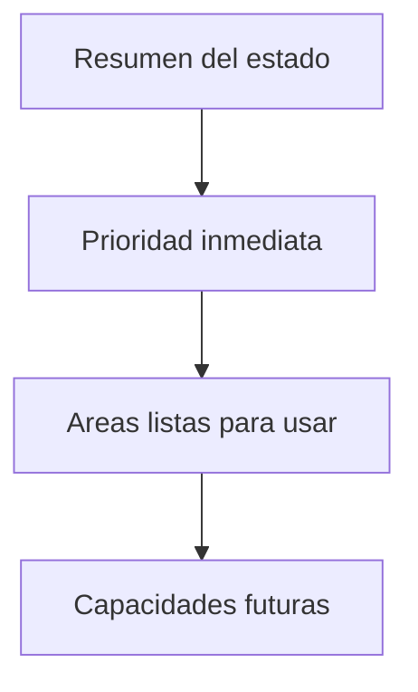

# Design - MOD00 rediseño del hub de Configuración empresarial

**Version:** 1.0
**Estado:** Aprobado
**Fecha:** 2026-05-30
**Modo activo:** Refinamiento UX/UI con identidad iWana
**Origen:** auditoría visual y operativa de `/dashboard/settings` en portal
**ADR rector:** `docs/adrs/ADR-040-Configuracion-Control-Plane-Organizacion-Acceso.md`
**PRD rector:** `docs/prds/PRD-MOD00-CONFIGURACION-CONTROL-PLANE-v1.0.md`
**HLD relacionado:** `docs/hlds/HLD-MOD00-CONFIGURACION-CONTROL-PLANE-v1.0.md`
**Plan de ejecución:** `docs/plans/2026-05-30-mod00-settings-hub-redesign.md`
**Informe vivo:** `docs/informes/INFORME-MOD00-CONFIGURACION-CONTROL-PLANE-v1.0.md`

---

## 1. Objetivo

Rediseñar el hub de `/dashboard/settings` para que deje de funcionar como un índice técnico y pase a comportarse como un centro de decisión operativa para administradores de empresa.

La pantalla debe ayudar a responder, en el primer vistazo:

1. que área requiere atención ahora;
2. que configuraciones ya están listas para usarse;
3. que áreas existen pero no están disponibles para este perfil;
4. que capacidades llegarán después sin contaminar la lectura principal.

---

## 2. Problemas observados

La auditoría sobre la implementación actual y la pantalla en vivo confirmó estos problemas:

1. el hub tiene jerarquía visual plana: todas las secciones compiten casi con el mismo peso;
2. el header describe la pantalla, pero no orienta sobre prioridad ni estado general;
3. la grilla solo aprovecha dos columnas en `xl`, lo que desperdicia escaneo en tablet y desktop intermedio;
4. las tarjetas `Próximamente` y `No configurado` ocupan demasiado protagonismo;
5. se filtra vocabulario técnico o legacy como `Billing`, `Inventory`, `tenant-aware`, `tenant autenticado` y `owner`;
6. el estado `Acceso restringido` informa bloqueo, pero no ofrece una salida operativa clara.

---

## 3. Dirección aprobada

Se aprueba un rediseño de tipo **hub operativo guiado**.

La pantalla mantendrá su naturaleza de centro de secciones, pero su composición cambiará para priorizar claridad de negocio, capacidad de escaneo y orientación de acciones. No se rediseñan en esta fase las subpantallas internas de Organización, Usuarios y acceso, Calendario o Marca.

Principios de la dirección:

1. primero orientar, luego listar;
2. priorizar lo operativo sobre lo futuro;
3. expresar acción de negocio, no navegación técnica;
4. subordinar visualmente capacidades no disponibles;
5. mantener identidad iWana desde jerarquía, ritmo, copy y estados, no desde decoración.

---

## 4. Modelo mental objetivo

La pantalla debe comunicar cuatro capas:

1. **Resumen del estado del hub**: contexto general corto.
2. **Prioridad inmediata**: una sola recomendación operativa cuando exista.
3. **Áreas listas para usar**: las secciones operables del portal.
4. **Capacidades futuras**: secciones aún no disponibles, subordinadas visualmente.

El usuario no debe necesitar conocer arquitectura, ownership interno ni contratos federados para entender la pantalla.

---

## 5. Estructura objetivo de la pantalla

### 5.1 Encabezado superior

El header conserva el título `Configuración empresarial`, pero el subtítulo deja de ser solo descriptivo y pasa a resumir estado o propósito operativo.

Debe incluir:

1. título principal;
2. subtítulo corto con foco operativo;
3. espacio compatible con un resumen breve o indicador contextual si existe valor real.

### 5.2 Tarjeta de prioridad inmediata

Debajo del header debe existir una tarjeta única para la recomendación principal del momento cuando haya una acción prioritaria clara.

Debe incluir:

1. label corto como `Recomendado ahora`;
2. título enfocado en acción;
3. descripción breve del impacto;
4. CTA directo hacia la sección correspondiente.

Si no hay prioridad real, este bloque no se renderiza.

### 5.3 Grilla principal

La grilla principal debe listar primero las áreas operables y ordenarlas por valor administrativo:

1. Perfil empresarial y organización;
2. Usuarios y acceso;
3. Calendario operativo y jornadas;
4. Marca.

Las tarjetas no deben sentirse idénticas si el negocio no las usa con la misma frecuencia. Organización y Usuarios y acceso deben comportarse como anclas del hub.

### 5.4 Banda de capacidades futuras

Las secciones `Próximamente` o `No configurado` deben ir en un bloque secundario claramente separado, con menos altura, menos énfasis y copy no técnico.

No deben competir con las secciones operables.

---

## 6. Reglas UX/UI

### 6.1 Jerarquía visual

1. el primer bloque debe decirle al usuario que hacer o que revisar;
2. las tarjetas operables deben tener CTA específicos, no un genérico `Abrir sección`;
3. las tarjetas futuras deben parecer informativas, no accionables;
4. el estado restringido debe verse como una limitación del perfil, no como un error del sistema.

### 6.2 Responsive

1. en mobile la pantalla usa una sola columna;
2. la tarjeta prioritaria aparece antes de la grilla principal;
3. la grilla debe pasar a dos columnas en un breakpoint intermedio, no esperar a `xl`;
4. las capacidades futuras deben seguir quedando subordinadas tanto en mobile como en desktop.

### 6.3 Estados

#### Disponible

Debe mostrar:

1. estado claro;
2. título y descripción de negocio;
3. CTA específico.

#### Recomendado

Debe compartir base visual con disponible, pero con mayor prioridad jerárquica.

#### Acceso restringido

Debe incluir:

1. explicación corta;
2. orientación sobre el siguiente paso;
3. ausencia de affordance de click principal.

#### Próximamente / No configurado

Debe usar menor peso visual y copy de producto, nunca lenguaje de arquitectura interna.

---

## 7. Reglas de identidad iWana

Se aprueba este criterio visual:

1. header y bloques operables con superficies limpias y jerarquía clara;
2. `iwana-surface-soft` para apoyos, prioridad inmediata y capacidades futuras cuando ayude a separar capas;
3. `rounded-2xl` como radio dominante;
4. contrastes accesibles y foco visible por encima de cualquier gesto cosmético;
5. cero sensación de parrilla genérica de tarjetas si una capa requiere más peso que otra.

La identidad debe aparecer en:

1. composición equilibrada;
2. copy profesional y directo;
3. densidad controlada;
4. estados consistentes;
5. affordance clara para tareas frecuentes.

---

## 8. Reglas de copy

### 8.1 Regla principal

La UI no debe exponer términos internos como `tenant`, `owner`, `contract`, `registry`, `tenant-aware`, `settings federados` o labels legacy como `Billing` e `Inventory`.

### 8.2 Copys aprobados

- `Configuración empresarial`
- `Revisa las áreas clave de tu empresa, prioriza pendientes y entra directo a la sección que necesitas.`
- `Recomendado ahora`
- `Revisar accesos`
- `Perfil empresarial y organización`
- `Usuarios y acceso`
- `Calendario operativo y jornadas`
- `Marca`
- `Facturación`
- `Inventario`
- `Integraciones`

### 8.3 Regla de descripción

Cada descripción debe responder principalmente: que se puede hacer aquí.

No se aprueban descripciones centradas en ownership interno, contratos o detalles de arquitectura.

---

## 9. Alcance

### Entra

1. rediseño del hub `/dashboard/settings`;
2. jerarquía de header, prioridad inmediata, grilla principal y bloque secundario;
3. copy visible del hub;
4. responsive y estados del hub;
5. normalización visual de labels y descripciones provenientes del registry.

### No entra

1. cambios a contratos backend;
2. refactor profundo del shell global del portal;
3. rediseño de las subpantallas internas;
4. nuevas métricas reales si no existen datos confiables.

---

## 10. Criterios de aceptación

1. el hub no expone vocabulario interno o legacy en la UI final;
2. el usuario entiende la prioridad principal sin leer toda la pantalla;
3. las secciones operables aparecen antes y con más peso que las futuras;
4. `Acceso restringido` ofrece orientación operativa;
5. la pantalla mejora lectura en tablet y desktop intermedio;
6. mobile mantiene una sola columna, orden lógico y CTA claros;
7. el resultado se percibe como iWana y como herramienta operativa, no como índice técnico.