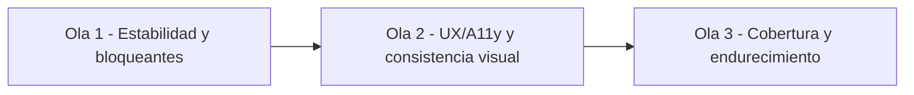

# SPEC: CRM Scheduling - Remediacion UI/UX/A11y

**Version:** 1.0  
**Estado:** Ejecutado  
**Fecha:** 2026-06-04  
**Modulo:** CRM Scheduling (Portal)  
**Responsable de ejecucion:** Sr. Dev Fullstack  
**Fuente de auditoria:** Revision visual, UX operativa, accesibilidad y riesgos funcionales del modulo `/dashboard/scheduling`.

---

## 1. Objetivo

Definir un plan ejecutable para corregir hallazgos criticos y mejorar la calidad del modulo Scheduling en `apps/portal`, priorizando:

1. Consistencia visual con identidad iWana.
2. Accesibilidad WCAG 2.2 AA en flujos operativos.
3. Robustez funcional en carga de datos y visibilidad de informacion.
4. Cobertura de pruebas enfocada en riesgos reales de operacion.

---

## 2. Alcance

### Incluye

1. Ruta principal de Scheduling y subflujo pending visits.
2. Correcciones de UI, UX, accesibilidad y manejo de errores en frontend portal.
3. Refactors acotados para estabilidad de carga y visibilidad de datos.
4. Pruebas unitarias y E2E de regresion de los flujos criticos.

### No incluye

1. Rediseno completo del modulo.
2. Cambios de arquitectura backend o contratos API fuera de ajustes menores requeridos por frontend.
3. Migraciones o cambios de esquema de datos.

---

## 3. Contexto De Implementacion

### Rutas y componentes clave

1. `apps/portal/src/app/dashboard/scheduling/page.tsx`
2. `apps/portal/src/app/dashboard/scheduling/pending-visits/page.tsx`
3. `apps/portal/src/components/scheduling/SchedulingClient.tsx`
4. `apps/portal/src/components/scheduling/ScheduleCalendar.tsx`
5. `apps/portal/src/components/scheduling/SchedulingOverview.tsx`
6. `apps/portal/src/components/scheduling/ScheduleList.tsx`
7. `apps/portal/src/components/scheduling/TechnicianWorkList.tsx`
8. `apps/portal/src/components/scheduling/ScheduleEventForm.tsx`
9. `apps/portal/src/components/scheduling/ScheduleEventDrawer.tsx`
10. `apps/portal/src/components/scheduling/TechnicianLoadStrip.tsx`
11. `apps/portal/src/components/shared/portal-ui.tsx`
12. `packages/ui/src/styles/globals.css`
13. `e2e/tests/portal-wfm-scheduling.spec.ts`

---

## 4. Problemas Priorizados

## P0 - Bloqueantes

1. Posibles inconsistencias de estado por orquestacion compleja de carga y sincronizacion de efectos en `SchedulingClient`.
2. Truncamiento silencioso de datos operativos (tecnicos y OT) en `TechnicianWorkList`.
3. Brechas de accesibilidad en foco/teclado/dialogos/tablas.

## P1 - Importantes

1. Hardcodes visuales (colores) fuera de tokens iWana.
2. Manejo de warnings y errores poco accionable para usuario operativo.
3. Falta de cobertura de pruebas en componentes criticos.

## P2 - Deuda

1. Limites hardcodeados no documentados.
2. Estilos inline evitables y baja trazabilidad visual.

---

## 5. Estrategia De Ejecucion (3 Olas)



### Ola 1 (Sprint actual) - Estabilidad y visibilidad operativa

1. Revisar ciclo de carga de `SchedulingClient` para evitar resultados obsoletos y estados inconsistentes.
2. Eliminar truncamiento silencioso en `TechnicianWorkList`:
   - Mostrar indicador `+N` cuando haya elementos ocultos.
   - Habilitar mecanismo de expansion o scroll controlado.
3. Mejorar degradacion parcial y mensajeria de errores/warnings:
   - No bloquear la vista completa si falla un bloque secundario.
   - Mostrar mensajes accionables, cortos y claros.

### Ola 2 (Sprint actual + 1) - Identidad visual y accesibilidad

1. Sustituir colores hardcodeados por tokens iWana.
2. Homologar estados `hover/focus/active/disabled/loading/empty/error` en vistas Scheduling.
3. A11y operativa:
   - Foco visible uniforme.
   - Navegacion por teclado en calendario/lista/dialogos.
   - Labels/ARIA en controles relevantes y barras de progreso.
   - Validacion de contraste AA.

### Ola 3 (Sprint actual + 1) - Pruebas y prevencion de regresiones

1. Cobertura unitaria de componentes sin spec o con cobertura minima.
2. Refuerzo E2E en flujos por rol y edge-cases.
3. Checklist de regresion visual/UX para PRs de Scheduling.

---

## 6. Tareas Tecnicas Por Archivo

| Archivo | Cambio esperado | Prioridad |
| --- | --- | --- |
| `apps/portal/src/components/scheduling/SchedulingClient.tsx` | Robustecer sincronizacion de carga y degradacion parcial | P0 |
| `apps/portal/src/components/scheduling/TechnicianWorkList.tsx` | Quitar truncamiento silencioso, exponer totalidad con patron controlado | P0 |
| `apps/portal/src/components/scheduling/ScheduleEventDrawer.tsx` | Mejorar estados de error y recuperacion | P0 |
| `apps/portal/src/components/scheduling/ScheduleCalendar.tsx` | Migrar hardcodes de color a tokens y reforzar foco | P1 |
| `apps/portal/src/components/scheduling/SchedulingOverview.tsx` | Migrar superficies a tokens canonicamente | P1 |
| `apps/portal/src/components/scheduling/ScheduleList.tsx` | Mejorar semantica de tabla y usabilidad en mobile | P1 |
| `apps/portal/src/components/scheduling/ScheduleEventForm.tsx` | Exponer errores operativos al usuario y evitar estados silenciosos | P1 |
| `apps/portal/src/components/scheduling/TechnicianLoadStrip.tsx` | A11y de barra de progreso y consistencia de estilos | P1 |
| `apps/portal/src/components/scheduling/*.spec.tsx` | Nuevos tests unitarios para riesgos detectados | P1 |
| `e2e/tests/portal-wfm-scheduling.spec.ts` | Casos E2E adicionales por rol/a11y/errores | P1 |

---

## 7. Criterios De Aceptacion

### Funcionales

1. El modulo mantiene operacion en degradacion parcial cuando fallan bloques no criticos.
2. La informacion operativa no se oculta silenciosamente en paneles de trabajo.
3. Mensajes de error y warning indican accion siguiente.

### Visuales e identidad

1. No quedan hardcodes de color en componentes priorizados de Scheduling.
2. Superficies y estados usan tokens del design system.
3. La jerarquia visual es consistente entre command center, calendario y lista.

### Accesibilidad

1. Navegacion completa por teclado en flujos criticos.
2. Foco visible en elementos interactivos.
3. Contraste de texto y controles cumple AA.
4. Dialogos y tablas exponen semantica accesible minima.

### Calidad

1. Se agregan pruebas para los riesgos P0/P1 definidos.
2. La suite de Scheduling E2E pasa en local con config portal.

---

## 8. Plan De Pruebas

### Unitarias/Integracion

1. `SchedulingClient`: estados de carga concurrente y fallback parcial.
2. `TechnicianWorkList`: render total/controlado de items, indicador `+N`, comportamiento en equipos grandes.
3. `ScheduleEventForm`: visibilidad de errores operativos.
4. `ScheduleEventDrawer`: recuperacion ante error de detalle.
5. `ScheduleList`: navegacion/semantica y comportamiento mobile.

### E2E

1. Flujo principal admin en scheduling.
2. Restricciones por rol (incluye tecnico).
3. Reagendamiento y transiciones de estado.
4. Escenario de error con recuperacion.
5. Validaciones a11y basicas de flujo (teclado/foco).

Comando de referencia:

```bash
pnpm exec playwright test --config e2e/playwright.portal.config.ts e2e/tests/portal-wfm-scheduling.spec.ts
```

---

## 9. Definition Of Done

1. Hallazgos P0 cerrados.
2. Hallazgos P1 mitigados o con deuda explicitamente registrada y aprobada.
3. Criterios de aceptacion funcional, visual y a11y cumplidos.
4. Pruebas nuevas integradas y pasando en CI local del modulo.
5. Informe de salida actualizado con estado final:
   - Apto con observaciones.
   - Apto condicionado.
   - No apto.

---

## 10. Riesgos y Mitigacion

1. **Riesgo:** Refactor de carga introduce regresion de datos.
   - **Mitigacion:** tests de estados concurrentes + validacion manual de filtros.
2. **Riesgo:** Ajustes visuales rompen consistencia en dark mode.
   - **Mitigacion:** checklist light/dark por vista y validacion responsive.
3. **Riesgo:** Cobertura incompleta por tiempo de sprint.
   - **Mitigacion:** ejecutar primero matriz P0/P1 y documentar deuda restante.

---

## 11. Entregables Esperados Del Sr. Fullstack

1. PR de Ola 1 con foco en estabilidad y visibilidad operativa.
2. PR de Ola 2 con identidad visual + a11y.
3. PR de Ola 3 con cobertura de pruebas y cierre de regresion.
4. Actualizacion del informe vivo con evidencias de cierre por hallazgo.

---

## 12. Referencias

1. `docs/identity/Manual_Implementacion_Identidad_Iwana.md`
2. `apps/portal/src/components/shared/portal-ui.tsx`
3. `packages/ui/src/styles/globals.css`
4. `AGENTS.md`

---

## 13. Estado De Ejecucion (2026-06-04)

### Ejecutado en esta iteracion (Ola 1 parcial)

1. **Estabilidad de carga y degradacion parcial** en `SchedulingClient`:
   - Fallos de `summary`, `availability`, `technicians` y `workOrders` ya no limpian estado previo.
   - Mensajes de cobertura parcial ahora son accionables y se autolimpian.
2. **Recuperacion de detalle en drawer** en `ScheduleEventDrawer` + `SchedulingClient`:
   - Se agrego accion de `Reintentar` cuando falla la carga de detalle.
   - Error de `workOrder` vinculada ahora reporta degradacion parcial sin bloquear el evento.
3. **Truncamiento silencioso mitigado** en `TechnicianWorkList`:
   - Indicadores visibles `+N` para tecnicos, work orders y franjas no renderizadas.
   - Ajuste de superficies a token `iwana-surface-soft` en secciones principales.

### Evidencia tecnica

1. `apps/portal/src/components/scheduling/SchedulingClient.tsx`
2. `apps/portal/src/components/scheduling/ScheduleEventDrawer.tsx`
3. `apps/portal/src/components/scheduling/TechnicianWorkList.tsx`
4. `apps/portal/src/components/scheduling/ScheduleEventDrawer.spec.tsx` (nuevo)
5. `apps/portal/src/components/scheduling/TechnicianWorkList.spec.tsx` (nuevo)

### Validacion ejecutada

1. Suite focalizada passing: `SchedulingClient.spec.tsx`, `ScheduleEventDrawer.spec.tsx`, `TechnicianWorkList.spec.tsx`.
2. Resultado agregado: **10 passed, 0 failed**.
3. Diagnostico de errores de TypeScript sobre archivos tocados: **sin errores**.

### Pendiente para siguiente iteracion

1. Completar robustez de concurrencia profunda en `loadData` (cancelacion/guardas por request).
2. Extender casos E2E por rol, teclado y escenarios de error recuperable en `e2e/tests/portal-wfm-scheduling.spec.ts`.
3. Homologar estados a11y y tokens restantes en vistas `ScheduleList`, `ScheduleCalendar` y `SchedulingOverview`.

### Cierre final de ejecucion (2026-06-04)

1. **Ola 1 completada:** degradacion parcial, visibilidad operativa y recuperacion de detalle aplicadas y verificadas.
2. **Ola 2 completada:** tokenizacion de superficies/estados prioritarios y mejoras de accesibilidad de teclado/foco en vistas clave.
3. **Ola 3 completada:** ampliacion de pruebas unitarias y endurecimiento de E2E en flujo de programacion y bandeja pendiente.

### Evidencia final

1. Comando ejecutado:

```bash
pnpm exec playwright test --config e2e/playwright.portal.config.ts e2e/tests/portal-wfm-scheduling.spec.ts
```

2. Resultado: **9 passed, 0 failed**.
3. Estado final del spec: **Apto con observaciones menores de deuda tecnica no bloqueante**.
