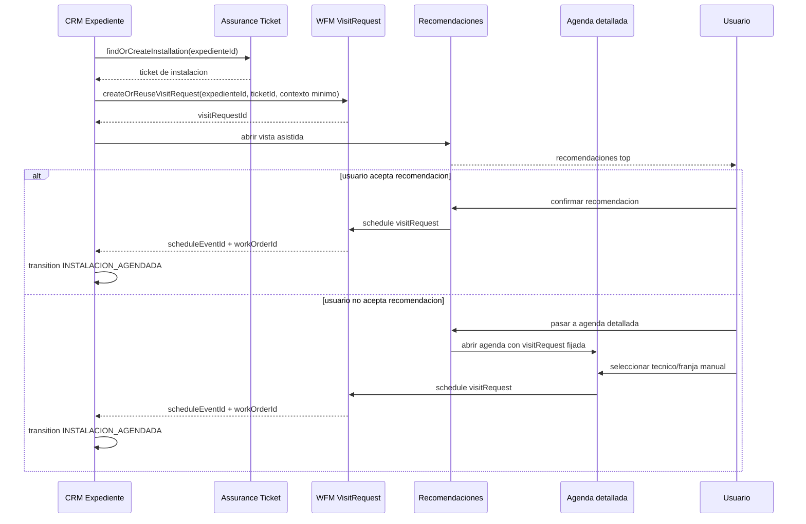

# Design - CRM -> WFM recommendation-first installation scheduling

**Version:** 1.0
**Estado:** Aprobado para ejecucion Fullstack
**Fecha:** 2026-06-18
**Modo activo:** Mixto
**Modulo:** MOD05 CRM / MOD09 Programacion-WFM / MOD10 Assurance
**Owner funcional:** CRM como origen comercial, WFM como owner de solicitud, recomendaciones, agenda y Work Orders
**Owner de ejecucion:** Sr. Dev Fullstack

## 1. Objetivo

Definir el flujo objetivo para agendar instalaciones desde un expediente CRM listo para instalacion, priorizando recomendaciones antes de abrir la agenda detallada.

El flujo aprobado es:

1. El expediente queda listo para instalacion.
2. CRM crea o reutiliza una `VisitRequest` en WFM.
3. El usuario entra primero a una vista asistida con recomendaciones.
4. Puede confirmar una recomendacion directamente.
5. Si ninguna sirve, puede pasar a una agenda detallada para buscar otra opcion manualmente.

## 2. Problema actual

Hoy el expediente CRM dispara un acceso directo a Programacion en modo agenda/create. Eso genera tres problemas:

1. El usuario entra demasiado pronto a una superficie tecnica de agenda.
2. El flujo bypassa la bandeja y el panel de recomendaciones ya aprobados en WFM.
3. El comportamiento actual mezcla ownership: CRM empuja al usuario a una decision que deberia vivir primero en WFM.

Adicionalmente, el CTA y el mensaje visible no son consistentes:

1. La UI promete llevar a una bandeja pendiente.
2. La navegacion real abre agenda directa.
3. Eso rompe claridad operativa y empeora la adopcion del flujo recomendado.

## 3. Decision aprobada

Se adopta la opcion **B: bandeja pendiente asistida + agenda detallada solo si hace falta**.

La regla principal es:

1. CRM no debe abrir la agenda detallada como primer paso.
2. CRM debe crear o reabrir la solicitud pendiente de instalacion en WFM.
3. La primera superficie de decision debe ser la vista asistida de recomendaciones.
4. La agenda detallada queda como salida explicita de segundo paso cuando ninguna recomendacion sirve.

## 4. Flujo objetivo end-to-end

## 5. Ownership y boundaries

### 5.1 Reglas de ownership

1. CRM sigue siendo owner del expediente, su pipeline y su readiness comercial-operativo.
2. WFM es owner de `VisitRequest`, recomendaciones, agenda, disponibilidad tecnica y Work Orders.
3. Assurance es owner del ticket operativo.
4. CRM no debe absorber logica de agenda, tecnicos, capacidad ni scoring territorial.

### 5.2 Reglas de boundary

1. CRM no lee tablas WFM.
2. WFM no lee tablas CRM para completar contexto faltante; recibe snapshot operativo minimo.
3. La integracion entre modulos se mantiene por APIs, contratos tipados y referencias logicas.
4. No se agregan FKs cross-module ni cross-schema.

## 6. Roles aprobados

### 6.1 Roles con confirmacion directa

Los siguientes roles pueden completar el flujo y confirmar agenda:

1. `SALES`
2. `ADMIN`
3. `NOC`
4. `SUPPORT`

### 6.2 Roles sin capacidad de despacho

Los siguientes roles quedan fuera de este flujo:

1. `TECHNICIAN`
2. `CONTRACTOR`

Ellos solo consumen trabajos ya asignados.

### 6.3 Regla funcional

Ventas y Operaciones deben poder confirmar directamente la agenda sin diferencia funcional en el resultado final del negocio.

## 7. Estados y sincronizacion

### 7.1 Estado del expediente CRM

1. El expediente permanece en `LISTO_PARA_INSTALACION` mientras solo exista una solicitud pendiente.
2. El expediente pasa a `INSTALACION_AGENDADA` solo cuando la agenda ya fue confirmada y existen refs operativas persistidas.
3. Si la solicitud existe pero aun no hay agenda, CRM no debe adelantarse al estado final.

### 7.2 Estado de VisitRequest en WFM

Estados relevantes:

1. `NEEDS_CONTEXT`
2. `READY_TO_SCHEDULE`
3. `SCHEDULED`

Reglas:

1. Si faltan datos minimos, la solicitud entra o permanece en `NEEDS_CONTEXT`.
2. Si el contexto es suficiente, la solicitud pasa a `READY_TO_SCHEDULE`.
3. Solo una solicitud `READY_TO_SCHEDULE` puede confirmarse para crear agenda.
4. Al confirmar, pasa a `SCHEDULED`.

### 7.3 Duplicidad e idempotencia

1. Un expediente no debe crear multiples `VisitRequest` activas para la misma instalacion.
2. Si el usuario vuelve a entrar desde CRM, el sistema debe reabrir la solicitud existente o el evento ya agendado.
3. Si ya existe un `ScheduleEvent` activo para ese expediente, el flujo no debe crear otro.

## 8. UX objetivo

### 8.1 CTA desde CRM

El CTA del expediente debe dejar de comportarse como acceso directo a agenda/create.

Comportamiento aprobado:

1. accion primaria: crear o reabrir solicitud pendiente
2. abrir vista asistida de WFM
3. mostrar recomendaciones primero

Copy recomendado:

1. `Buscar agenda de instalacion`
2. `Solicitar agendamiento`

Copy a evitar:

1. `Agendar instalacion` cuando aun falta pasar por recomendaciones

### 8.2 Vista asistida de primer paso

Debe mostrar:

1. resumen corto de la oportunidad o cliente
2. estado operativo de la solicitud
3. faltantes de contexto si existen
4. top de recomendaciones
5. accion primaria para confirmar recomendacion
6. accion secundaria `Pasar a agenda detallada`

### 8.3 Agenda detallada como segundo paso

La agenda detallada no se abre por defecto.

Solo se usa cuando:

1. ninguna recomendacion sirve
2. el usuario necesita explorar otra franja
3. el usuario quiere comparar disponibilidad manualmente

La agenda detallada debe abrir con:

1. `visitRequest` ya fijada
2. expediente contextualizado
3. fecha sugerida preseleccionada si aplica
4. resumen lateral o visible de la solicitud para no perder contexto

## 9. Recomendaciones y explicabilidad

Cada recomendacion debe mostrar, como minimo:

1. tecnico sugerido
2. fecha y hora
3. carga operativa
4. criterio o motivo principal

Motivos permitidos o recomendados:

1. `menor carga`
2. `misma zona`
3. `continuidad de ruta`
4. `cumple ventana del cliente`

La meta no es solo recomendar, sino hacer que ventas y operaciones confien en la recomendacion.

## 10. Reglas de negocio del flujo

1. El sistema solo puede abrir el flujo cuando el expediente cumple readiness para instalacion.
2. Si no cumple readiness, CRM debe mostrar por que aun no se puede buscar agenda.
3. Si la solicitud ya existe, el sistema debe reutilizarla.
4. Si el evento ya existe, el sistema debe mostrarlo y bloquear duplicados.
5. Confirmar una recomendacion y confirmar manualmente desde agenda deben producir el mismo resultado final:
   - `ScheduleEvent` creada
   - `WorkOrder` creada si aplica
   - refs operativas persistidas
   - expediente sincronizado a `INSTALACION_AGENDADA`

## 11. Impacto esperado por capa

### 11.1 CRM portal

1. cambiar CTA y handoff actual
2. dejar de navegar primero a `agenda?open=create&type=INSTALLATION`
3. navegar primero al flujo de solicitud asistida

### 11.2 WFM portal

1. consolidar la vista asistida como primer paso de decision
2. mantener agenda detallada como fallback de segundo paso
3. conservar contexto del expediente al saltar a agenda

### 11.3 Backend WFM / Assurance / CRM

1. crear o reutilizar ticket de instalacion
2. crear o reutilizar `VisitRequest`
3. impedir duplicados por expediente/evento activo
4. sincronizar refs y estado final del expediente solo al confirmar agenda

## 12. Criterios de aceptacion

1. Desde un expediente listo para instalacion, el usuario entra primero a una vista asistida de recomendaciones y no a agenda directa.
2. `SALES`, `ADMIN`, `NOC` y `SUPPORT` pueden confirmar recomendacion o pasar a agenda detallada.
3. Si ninguna recomendacion sirve, existe una accion explicita `Pasar a agenda detallada`.
4. Al abrir agenda detallada, la solicitud queda fijada y no se pierde el contexto del expediente.
5. Si el usuario confirma recomendacion o agenda manualmente, el resultado funcional final es el mismo.
6. No se crean solicitudes ni eventos duplicados para el mismo expediente.
7. CRM solo pasa a `INSTALACION_AGENDADA` cuando la agenda ya fue confirmada.
8. La UI explica por que una recomendacion fue priorizada.

## 13. Fuera de alcance

1. redisenar todo el modulo Scheduling
2. introducir mapa, drag-and-drop o optimizacion avanzada de rutas
3. cambiar boundaries aprobados entre CRM, WFM y Assurance
4. mover este flujo completo de vuelta dentro de CRM

## 14. Archivos probables para ejecucion

### Portal CRM

1. `apps/portal/src/app/dashboard/crm/expedientes/[id]/page.tsx`
2. `apps/portal/src/components/crm/expedientes/expediente-scheduling.ts`

### Portal WFM

1. `apps/portal/src/components/scheduling/PendingVisitRequestsView.tsx`
2. `apps/portal/src/components/scheduling/PendingVisitRequestDetailPanel.tsx`
3. `apps/portal/src/components/scheduling/VisitRequestRecommendationPanel.tsx`
4. `apps/portal/src/components/scheduling/SchedulingClient.tsx`
5. `apps/portal/src/components/scheduling/pending-visit-scheduling-handoff.ts`
6. `apps/portal/src/components/scheduling/pending-visits-ui.ts`

### API / contratos

1. `apps/portal/src/lib/api-client.ts`
2. `apps/api/src/modules/wfm/services/visit-requests.service.ts`
3. `apps/api/src/modules/wfm/services/schedule-events.service.ts`
4. `apps/api/src/modules/assurance/services/tickets.service.ts`

## 15. Referencias

1. `docs/adrs/ADR-037-Bounded-Context-Programacion-WFM.md`
2. `docs/adrs/ADR-039-Bandeja-Visitas-Pendientes-WFM.md`
3. `docs/prds/PRD-MOD09-PROGRAMACION-WFM-v1.0.md`
4. `docs/hlds/HLD-MOD09-PROGRAMACION-WFM-v1.0.md`
5. `docs/specs/2026-05-11-crm-agendamiento-instalacion-design.md`
6. `docs/specs/2026-05-15-mod09-pending-visits-design.md`

## 16. Handoff

Esta spec queda lista para ser ejecutada por Fullstack como ajuste de flujo y experiencia CRM -> WFM.

La implementacion recomendada debe priorizar:

1. handoff correcto desde CRM
2. reutilizacion de `VisitRequest`
3. recomendaciones explicables
4. salida limpia a agenda detallada
5. pruebas de no duplicidad y sincronizacion de estado final
