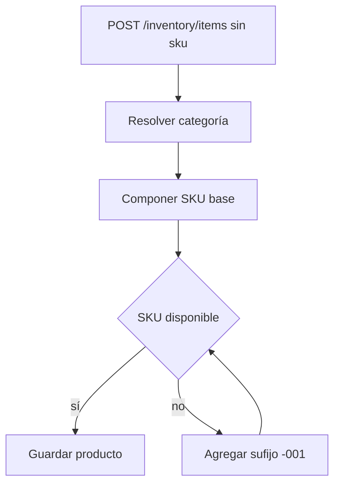

# SKU compuesto de producto y prefijo corto de categoría

## Contexto

El catálogo de inventario generaba SKUs con el patrón `{prefijo-categoria}-NNNNNN`.
Ese formato era seguro y corto, pero no expresaba los datos que los operadores usan para
identificar un producto: categoría, tipo de artículo, nombre, marca y modelo.

El nuevo diseño mantiene el límite actual de `sku varchar(60)` y conserva la inmutabilidad del
SKU tras la creación.

## Formato

```text
{CAT}-{TIPO}-{NOMBRE}-{MARCA}-{MODELO}
```

`MARCA` y `MODELO` son opcionales. Si alguno falta, se omite su segmento sin dejar guiones dobles.
Si el SKU semántico colisiona, se agrega un sufijo de tres dígitos: `-001`, `-002`, hasta `-999`.

## Presupuesto de Longitud

| Segmento | Máximo | Regla |
| --- | --- | --- |
| `CAT` | 3 | Prefijo de categoría `^[A-Z0-9]{2,3}$` |
| `TIPO` | 3 | Código fijo por `InventoryItemKind` |
| `NOMBRE` | 16 | Texto normalizado y truncado |
| `MARCA` | 8 | Opcional, normalizado y truncado |
| `MODELO` | 10 | Opcional, normalizado y truncado |
| Sufijo | 4 | Solo ante colisión, formato `-001` |

El SKU máximo esperado queda por debajo de 60 caracteres aun con separadores.

## Tipos de Artículo

| `InventoryItemKind` | Código |
| --- | --- |
| `STOCK` | `STK` |
| `CONSUMABLE` | `CON` |
| `SERIALIZED` | `SER` |
| `SERVICE` | `SVC` |

## Prefijo Corto de Categoría

El prefijo de categoría se acorta a 2-3 caracteres para dejar espacio al SKU compuesto:

| Categoría | Prefijo |
| --- | --- |
| Consumibles FO | `CFO` |
| Consumibles RD | `CRD` |
| Networking | `NET` |

El campo `codePrefix` sigue siendo único por tenant. La migración v2 puede acortar prefijos ya
creados para nuevas emisiones de SKU, pero no recalcula SKUs existentes.

## Compatibilidad

- Los productos existentes conservan su SKU actual.
- El nuevo formato solo aplica a productos creados sin SKU explícito.
- Si el cliente envía un SKU explícito, se respeta la regla híbrida existente: validar unicidad y guardar.
- Las categorías existentes migran su prefijo al formato corto para nuevas emisiones.
- No se hace migración masiva de SKUs v1 a v2.

## Flujo de Generación



## Pruebas Requeridas

- Generación con todos los segmentos.
- Generación sin marca o sin modelo.
- Truncado dentro de 60 caracteres.
- Sufijo ante colisión.
- Respeto de SKU explícito.
- Inmutabilidad en update.
