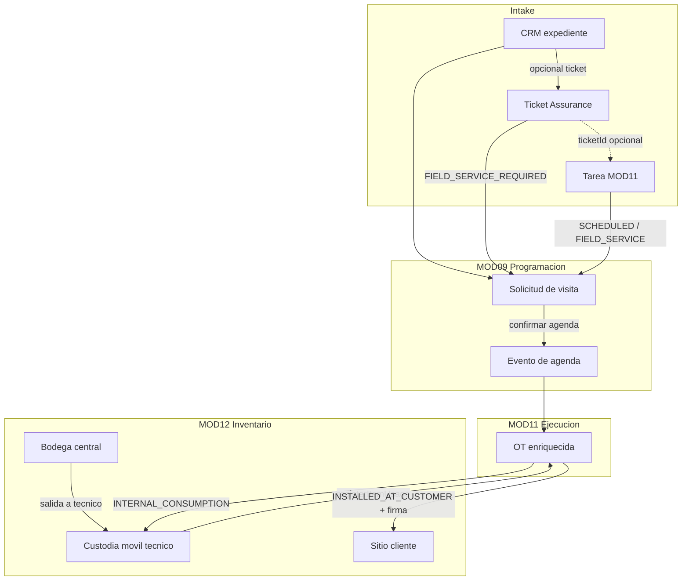

# Diseño — Flujo operativo cableado Ticket → Tarea → Visita → OT → Inventario

**Versión:** 1.0  
**Estado:** Aprobado  
**Fecha:** 2026-07-07  
**Fecha de aprobación:** 2026-07-07  
**Aprobado por:** CTO  
**Modo activo:** Mixto  
**Autor:** AI-EM-ARCH  
**Clasificación:** Uso interno  

**Trazabilidad principal:**  
- docs/prds/PRD-MOD10-SERVICE-ASSURANCE-v1.0.md  
- docs/prds/PRD-MOD11-EJECUCION-OPERATIVA-TAREAS-v1.0.md  
- docs/prds/PRD-MOD09-PROGRAMACION-WFM-v1.0.md  
- docs/prds/PRD-MOD12-INVENTARIO-SCM-v1.0.md  

**HLD relacionado:**  
- docs/hlds/HLD-MOD10-SERVICE-ASSURANCE-v1.0.md  
- docs/hlds/HLD-MOD11-EJECUCION-OPERATIVA-TAREAS-v1.0.md  
- docs/hlds/HLD-MOD09-PROGRAMACION-WFM-v1.0.md  

**ADRs relacionados:**  
- docs/adrs/ADR-037-Bounded-Context-Programacion-WFM.md  
- docs/adrs/ADR-038-Bounded-Context-Service-Assurance.md  
- docs/adrs/ADR-046-Bounded-Context-Tasks-Ejecucion-Operativa.md  
- docs/adrs/ADR-047-Separacion-Programacion-y-OT-Ejecucion.md  
- docs/adrs/ADR-048-Bounded-Context-Inventario-SCM-Ciclo-Vida-Productos.md  

**Specs base:**  
- docs/specs/2026-06-24-mod09-mod11-programacion-centro-agendamiento-ot-ejecucion-design.md  
- docs/specs/2026-06-23-programacion-solicitud-visita-unificada-design.md  
- docs/specs/2026-06-23-mod11-crear-tarea-agenda-opcional-design.md  

---

## 1. Objetivo

Congelar la política operativa y el cableado técnico para cerrar el flujo end-to-end:

**Caso → (opcional Ticket) → Tarea ejecutable → Solicitud de visita → Agenda → OT enriquecida → Inventario en destino final**

sin romper boundaries Modulith ni ADR-047.

---

## 2. Decisión central (confirmada)

| Principio | Regla |
| --- | --- |
| Programación coordina | Owner de `visit_requests`, `schedule_events`, despacho y capacidad |
| La OT ejecuta | Owner MOD11 de `execution_orders`, actividades, consumo y cierre técnico |
| Inventario custodia y traza | Owner MOD12 de stock, seriales y ubicaciones; no agenda ni cierra OT |
| El ticket gestiona el caso | Owner MOD10 de SLA, cola y trazabilidad; no ejecuta campo |
| La tarea gestiona el trabajo | Owner MOD11 de responsable, destinatario y estado operativo del trabajo |

**Regla no negociable (ADR-047):** la OT enriquecida **no** se crea en el intake del caso. Solo al **confirmar agenda** con técnico/cuadrilla y ventana horaria.

---

## 3. Matriz por tipo de caso

Leyenda: **A** = automático, **O** = opcional / política tenant, **M** = manual, **—** = no aplica.

| Tipo de caso | Entrada típica | Ticket | Tarea MOD11 | Solicitud visita | OT enriquecida | Movimiento inventario |
| --- | --- | --- | --- | --- | --- | --- |
| **Instalación nueva** | CRM expediente | O (findOrCreate instalación) | O (RF-TSK-16) | **A** al solicitar agenda | **A** al agendar | Salida técnico → consumo OT → sitio cliente |
| **Soporte en campo** | Ticket incidente / solicitud | **A** | **O** vinculada (`ticketId`) | **A** si `FIELD_SERVICE_REQUIRED` | **A** al agendar | Idem |
| **Visita técnica planificada** | Tarea `FIELD_VISIT` / `FIELD_SERVICE` | — | **A** | **A** post-creación si usuario elige | **A** al agendar | Según disposición |
| **Mantenimiento preventivo** | Tarea o ticket | O | **A** o **O** | **A** | **A** al agendar | Consumo interno o comodato según ítem |
| **Retiro de equipo** | Ticket o tarea | O | O | **A** (`RETIREMENT`) | **A** al agendar | Cliente → técnico → bodega (RF-INV-16) |
| **Backoffice / cobranza / revisión** | Tarea interna | — | **A** | — | — | — |
| **Consulta / PQR administrativo** | Ticket | **A** | — | — | — | — |
| **Incidente resuelto en mesa** | Ticket (`NOT_REQUIRED`) | **A** | — | — | — | — |

### 3.1 Qué **no** debe ocurrir

| Anti-patrón | Motivo |
| --- | --- |
| Tarea → Ticket automático | Invierte la política de intake; solo CRM instalación puede tener ticket opcional |
| Ticket → Tarea automática siempre | Duplica estado; el puente correcto es visita cuando hay campo |
| OT al crear ticket o tarea | Viola ADR-047; genera OT sin compromiso operativo |
| Transferencia manual a `CUSTOMER_SITE` | El destino cliente se registra vía OT + disposición, no por transferencia libre |
| Dos solicitudes de visita activas por mismo origen | Duplicidad operativa (portal vs worker) |

---

## 4. Reglas de creación automática vs manual

### 4.1 Ticket (MOD10)

| Evento | Automático | Manual / UI |
| --- | --- | --- |
| Crear ticket desde Assurance | **A** | Clasificación, prioridad, `fieldDecision` |
| `findOrCreateInstallation` desde CRM | **A** | Política tenant RF-TSK-16 |
| Vincular `workOrderId` en ticket | **A** al agendar (referencia lógica) | — |
| Crear tarea desde ticket | **M** (RF-TSK-11) | Botón / acción explícita cuando el caso requiere trabajo persistente además de visita |

### 4.2 Tarea (MOD11)

| Evento | Automático | Manual / UI |
| --- | --- | --- |
| Crear tarea manual | — | **M** Operaciones |
| Vincular `ticketId` existente | — | **M** en formulario |
| Crear solicitud de visita | **A** si `executionMode ∈ {SCHEDULED, FIELD_SERVICE}` y usuario elige seguimiento | **M** si modo inmediato o solo fecha objetivo |
| Transición a `SCHEDULED` | **A** al confirmar evento de agenda vinculado | — |
| Crear OT | — | Nunca en intake; **A** solo desde Programación |

### 4.3 Solicitud de visita (MOD09)

| Origen (`originContext`) | `workType` esperado | Disparador |
| --- | --- | --- |
| `ASSURANCE` | `SUPPORT` o `TECHNICAL_VISIT` (unificado) | `requestFieldService` + orquestación portal **o** worker (uno solo) |
| `CRM` | `INSTALLATION` | Agendar desde expediente |
| `TASKS` | Según `TaskType` (ver §5) | Post-creación tarea con agenda |

### 4.4 OT enriquecida (MOD11)

Se crea en `ExecutionOrdersService.createFromScheduling` cuando:

- existe `scheduleEventId` confirmado;
- hay `assignedTechnicianId` o `assignedCrewId`;
- ventana `plannedWindowStartAt` / `plannedWindowEndAt` definida;
- contexto mínimo de cliente/dirección/resumen de trabajo.

---

## 5. Mapeo `TaskType` → `WfmWorkType`

| `TaskType` | `WfmWorkType` en solicitud de visita | Notas |
| --- | --- | --- |
| `INSTALLATION` | `INSTALLATION` | Alineado a CRM |
| `FIELD_VISIT` | `TECHNICAL_VISIT` | Visita técnica genérica |
| `CUSTOMER_SUPPORT` | `SUPPORT` | Soporte en sitio |
| `INTERNAL_OPERATION` | `MAINTENANCE` | Mantenimiento interno en campo |
| `COLLECTION` | — | Sin visita por defecto |
| `BACKOFFICE` | — | Sin visita |
| `REVIEW` | — | Sin visita |

Hoy `createTaskVisitRequestAndRoute` fija `TECHNICAL_VISIT` para todas las tareas; el cableado debe usar esta tabla.

---

## 6. Reglas de inventario post-OT

### 6.1 Secuencia obligatoria

```text
Bodega central
  → Salida a técnico (transferencia / custodia móvil MOD12)
  → Consumo en OT (descuento custodia técnico)
  → Destino final según disposición
```

### 6.2 Disposición por tipo de material

| Disposición (`InventoryDisposition`) | Uso | Destino físico | Estado serial |
| --- | --- | --- | --- |
| `INSTALLED_AT_CUSTOMER` | Equipo en comodato (RF-INV-12) | `CUSTOMER_SITE` del suscriptor | `INSTALLED_COMODATO` |
| `INTERNAL_CONSUMPTION` | Insumo consumido en sitio (cable, conector) | Sin saldo en cliente; baja lógica | `INTERNAL_CONSUMED` |
| `RETURNED_TO_TECHNICIAN_STOCK` | No usado / devolución parcial | Custodia móvil técnico | `ASSIGNED_TO_TECHNICIAN` |
| `RETURNED_TO_WAREHOUSE` | Retorno a central | Bodega principal | `AVAILABLE` |
| `DAMAGED_OR_LOST` | Pérdida o daño | — | `LOST` |

### 6.3 Gap actual a cerrar

`recordExecutionOrderMovement` hoy:

- descuenta custodia del técnico;
- para `INSTALLED_AT_CUSTOMER` **no** acredita línea positiva en `CUSTOMER_SITE`;
- `mapExecutionOrderDispositionToLocation` devuelve `null` para instalación en cliente.

**Regla objetivo:** al registrar uso con `INSTALLED_AT_CUSTOMER`, el ledger debe:

1. Descontar custodia técnico (ya existe).
2. Acreditar `CUSTOMER_SITE` resuelto por `subscriberId` / `customerRef` de la OT (nuevo).
3. Vincular comodato a suscriptor por referencia lógica (RF-INV-13).

### 6.4 Comodato vs consumo — decisión operativa

| Tipo de ítem (`tracking`) | Disposición por defecto en OT | Override |
| --- | --- | --- |
| Serializado (`SERIAL`) | `INSTALLED_AT_CUSTOMER` en instalación/soporte con equipo | Técnico puede marcar retiro/devolución |
| Consumible (`NONE` / lote) | `INTERNAL_CONSUMPTION` | No aplica comodato |
| Mixto en misma OT | Por línea de `registerItemUsage` | UI obliga elegir disposición |

La firma del cliente en cierre de OT es **requisito** para disposiciones que afecten `CUSTOMER_SITE` (instalación y retiro).

---

## 7. Sincronización de estados (resumen)

| Evento | Ticket | Tarea | Visita | OT | Inventario |
| --- | --- | --- | --- | --- | --- |
| Solicitud de visita creada | `FIELD_SERVICE_REQUESTED` si Assurance | `READY` o sin cambio | `PENDING` / `NEEDS_CONTEXT` | — | — |
| Agenda confirmada | Referencia `workOrderId` opcional | → `SCHEDULED` si `taskId` vinculado | → `SCHEDULED` | `CREATED` / `ASSIGNED` | — |
| OT iniciada | Sin cambio automático | → `IN_PROGRESS` | → `IN_EXECUTION` (resumen WFM) | → `IN_PROGRESS` | — |
| OT cerrada con éxito | Cierre o nota según política Assurance | → `RESOLVED` | → `CLOSED` | → `COMPLETED` | Movimientos finales aplicados |
| OT no ejecutada | Reapertura caso según política | → `READY` o `BLOCKED` | → `REQUIRES_RESCHEDULE` | → `NOT_EXECUTED` | Reversión custodia si aplica |

Referencias cruzadas solo por IDs lógicos (`ticketId`, `taskId`, `visitRequestId`, `scheduleEventId`); sin FK cross-module.

---

## 8. Diagrama end-to-end



---

## 9. Gaps de implementación detectados

| ID | Gap | Severidad | Owner |
| --- | --- | --- | --- |
| GAP-FLOW-01 | Portal crea visita `TECHNICAL_VISIT`; worker crea `SUPPORT` → riesgo de duplicados | Alta | MOD09 + MOD10 |
| GAP-FLOW-02 | Ticket no origina tarea MOD11 automática ni acción UI estándar (RF-TSK-11) | Media | MOD11 + Portal |
| GAP-FLOW-03 | `createTaskVisitRequestAndRoute` no mapea `TaskType` → `WfmWorkType` | Media | Portal |
| GAP-FLOW-04 | OT sin `taskId` / `ticketId` / `subscriberId` en entidad para trazabilidad | Media | MOD11 DB |
| GAP-FLOW-05 | `recordExecutionOrderMovement` sin acreditación `CUSTOMER_SITE` | Alta | MOD12 |
| GAP-FLOW-06 | Cierre OT no exige firma ni sincroniza estados ticket/tarea | Media | MOD11 + Portal |
| GAP-FLOW-07 | Sin E2E feliz ticket → visita → OT → inventario cliente | Media | E2E |

---

## 10. Criterios de aceptación

1. Un ticket con `FIELD_SERVICE_REQUIRED` genera **como máximo una** solicitud de visita activa por origen Assurance.
2. Una tarea `FIELD_SERVICE` puede generar solicitud de visita con `workType` coherente a su `TaskType`.
3. Ningún endpoint de intake (ticket, tarea) crea `execution_orders` directamente.
4. Al agendar, existe exactamente una OT por `scheduleEventId` (idempotencia actual preservada).
5. Registrar ítem en OT con `INSTALLED_AT_CUSTOMER` produce movimiento ledger con saldo en `CUSTOMER_SITE` del suscriptor.
6. Transferencia manual portal bloquea destino `CUSTOMER_SITE` (ya implementado); inventario cliente solo vía OT.
7. Cierre OT con resultado ejecutado transiciona tarea vinculada a `RESOLVED` cuando `taskId` presente.
8. Suite E2E cubre instalación CRM y soporte Assurance con mocks stateful de inventario.

---

## 11. Fuera de alcance de este spec

- Portal cliente de autogestión.
- Compensaciones SLA automáticas.
- Correlación NMS → ticket.
- Política tenant configurable vía UI para RF-TSK-16 (solo se documenta contrato).
- IPAM / recursos lógicos (RF-INV-25).

---

## 12. Referencia de implementación

Plan de ejecución: `docs/plans/2026-07-07-mod10-mod11-mod09-mod12-flujo-operativo-cableado.md`
