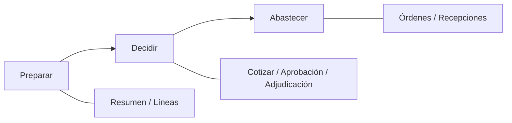

# SPEC — MOD12 Compras · Journey shell + Cotizar progressive disclosure — Fase 24

**Versión:** 1.0  
**Estado:** Diseño aprobado e implementado — GO CTO 2026-07-17  
**Fecha:** 2026-07-17  
**Autor:** AI-EM-ARCH  
**Aprobación:** CTO (D1–D3 congelados)  
**Entrada:** [Auditoría UX/UI](../informes/INFORME-MOD12-COMPRAS-UX-UI-VOCABULARIO-AUDITORIA-v1.0.md) · [Informe Fase 23](../informes/INFORME-MOD12-COMPRAS-PULIDO-UX-VOCABULARIO-FASE-23-v1.0.md)  
**Prompt:** [PROMPT Fase 24](../prompts/PROMPT-MOD12-COMPRAS-JOURNEY-SHELL-COTIZAR-FASE-24-v1.0.md)

## Objetivo

Reducir fricción de journey en el workbench de Compras: sustituir la gramática plana de **7 tabs** por un **shell de 3 fases**, y aliviar la pestaña **Cotizar** con **progressive disclosure** (un camino dominante + secundarios colapsados). Sin cambiar contratos de API ni vocabulario congelado en Fase 23.

## Problema

| Hallazgo | Evidencia actual | Impacto |
| --- | --- | --- |
| Tabs planos sin workflow | `PurchaseRequestWorkbenchDrawer` + `PURCHASE_WORKBENCH_TAB_LABELS` (7 valores) | Usuario no ve etapa; CTAs y contenido de otras etapas compiten |
| Cotizar sobrecargado | Misma pestaña: ronda + comparación + alta manual | Escaneo alto; riesgo de elegir el camino equivocado |

Fase 23 ya entregó: copy humano, proveedor en comparación, foco, CTA next-action en footer, un solo Dialog OC, primitives. **No** resuelve la arquitectura de navegación.

## Decisiones de diseño

### D1 — Shell de 3 fases (no eliminar tabs internos)

Mantener los 7 contenidos como **paneles internos**, agrupados bajo tres fases de UI:

| Fase UI | Etiqueta visible | Paneles internos (tabs legacy) |
| --- | --- | --- |
| `prepare` | Preparar | `summary`, `lines` |
| `decide` | Decidir | `cotizar`, `approval`, `awards` |
| `fulfill` | Abastecer | `orders`, `receipts` |

Reglas:

1. El shell muestra **solo las 3 fases** como navegación primaria (stepper / segmented control Firma iWana).
2. Dentro de la fase activa, se muestran **sub-tabs o anclas** solo para los paneles de esa fase (máx. 3).
3. La fase activa por defecto se deriva de `getPurchaseNextAction(detail).suggestedTab` mapeado a fase.
4. Fases **futuras** (posteriores a la etapa operativa) se muestran deshabilitadas o con estilo “pendiente”, salvo que el usuario tenga permiso de revisión (siempre se puede volver a fases **pasadas**).
5. El CTA primario del footer sigue siendo next-action (F23); en F24 se alinea visualmente al shell (una sola primaria dominante).
6. **No** renombrar enums de dominio ni cambiar rutas API. El tipo `PurchaseWorkbenchTab` puede permanecer; añadir helper `getPurchaseWorkbenchPhase(tab)`.



### D2 — Mapa estado → fase sugerida

Reutilizar `getPurchaseNextAction` (sin reescribir la lógica de negocio):

| `suggestedTab` | Fase shell |
| --- | --- |
| `summary`, `lines` | `prepare` |
| `cotizar`, `approval`, `awards` | `decide` |
| `orders`, `receipts` | `fulfill` |

Estados terminales (`terminal: true`): fase `prepare` o fase del último tab sugerido en modo solo lectura; CTA primaria oculta (ya F23).

### D3 — Progressive disclosure en Cotizar

Dentro del panel `cotizar`, **una sección expandida por defecto** según estado; las demás colapsadas (`details`/`Accordion` del sistema o patrón portal existente — sin tokens nuevos en `@iwana/ui` salvo reutilizar primitives).

| Condición | Primario (expandido) | Secundario (colapsado) |
| --- | --- | --- |
| Sin ronda y `DRAFT` / `PENDING_QUOTES` | Alta de cotización manual **o** CTA «Abrir ronda de cotización» (elegir **un** dominante: si nunca hubo ronda, priorizar ronda formal como CTA secundaria colapsada y manual como primario **solo** si el empty state histórico aplica; ver matriz abajo) | Comparación si hay cotizaciones |
| Ronda activa (`DRAFT`/`SENT`/`RECEIVING` de RFQ) | Invitaciones + registro por invitación | Comparación; alta manual **bloqueada** (C1, ya F10/F23) |
| Ronda cerrada o sin ronda con ≥1 cotización | Comparación de cotizaciones | Alta manual (si `canAddQuote`); historial de ronda |
| Empty histórico `PENDING_QUOTES` sin ronda | Empty «Cotización sin ronda formal» + alta manual | Bloque «Abrir ronda» colapsado (opcional) |

**Matriz dominante (congelar en implementación):**

1. `hasActiveRfq` → primario = invitaciones.  
2. Else if `quotes.length > 0` → primario = comparación.  
3. Else if `canAddQuote` → primario = nueva cotización.  
4. Else → empty / info (sin ronda formal / bloqueado).

El bloque no primario se renderiza colapsado con título claro (ej. «Ronda de cotización», «Comparación», «Nueva cotización»).

### D4 — Vocabulario y a11y (herencia F23)

- Sin «RFQ», «OC», «oferta», «landed», `partyRefId` en UI.  
- Foco visible en controles nuevos del shell.  
- No dos overlays workbench+órdenes (ya F23).

## Fuera de alcance

- Cambios de backend / OpenAPI / migraciones.  
- Side-peek Firma iWana completo como primitive de `@iwana/ui` (solo layout del drawer existente).  
- Promoción de «fila operativa» a design system.  
- Multi-ronda RFQ, envío real de correo, comparación por ítem avanzada.  
- Reabrir copy P0 de F23 (ya cerrado).

## Archivos previstos

| Archivo | Rol |
| --- | --- |
| `purchase-workbench.ts` | `PurchaseWorkbenchPhase`, mapeo tab↔fase, helpers de fase sugerida |
| `PurchaseRequestWorkbenchDrawer.tsx` | Shell 3 fases + sub-nav + footer alineado |
| `RfqInvitationsPanel.tsx` / zona Cotizar del drawer | Progressive disclosure (o wrapper local) |
| Specs RTL workbench / Cotizar / purchase-workbench | CA-24 |
| Informe vivo F24 | Cierre G6 shell |

## Criterios de aceptación (CA-24)

| ID | Criterio |
| --- | --- |
| CA-24-01 | Navegación primaria del workbench muestra **exactamente 3 fases** (Preparar / Decidir / Abastecer), no 7 tabs de primer nivel. |
| CA-24-02 | Al abrir una solicitud, la fase activa coincide con el mapeo de `getPurchaseNextAction().suggestedTab`. |
| CA-24-03 | Dentro de una fase solo se listan los sub-paneles de esa fase; el contenido de otras fases no aparece como tab de primer nivel. |
| CA-24-04 | Fases futuras no ejecutables están deshabilitadas o no accionables; fases pasadas siguen visitables. |
| CA-24-05 | En Cotizar, con ronda activa, el bloque de invitaciones está expandido y el alta manual no está expandida como camino paralelo (sigue bloqueada C1). |
| CA-24-06 | En Cotizar sin ronda y con cotizaciones, la comparación es el bloque primario expandido. |
| CA-24-07 | En Cotizar sin ronda ni cotizaciones (y `canAddQuote`), el alta manual es el bloque primario; la ronda formal, si se ofrece, está colapsada. |
| CA-24-08 | CTA next-action F23 sigue visible fuera del sub-panel sugerido; sin regresión de overlay único OC. |
| CA-24-09 | RTL workbench + Cotizar + purchase-workbench actualizados; `tsc` portal OK; sin regresión F20–F23. |
| CA-24-10 | Copy visible cumple convención F23. |

## Verificación sugerida

```bash
pnpm --filter @iwana/portal exec jest --testPathPattern="purchase-workbench|PurchaseRequestWorkbenchDrawer|RfqInvitationsPanel" --no-coverage
pnpm --filter @iwana/portal exec tsc --noEmit
```

## Protocolo multiagente

| Track | Rol | Entregable |
| --- | --- | --- |
| Gobernanza | AI-EM-ARCH | Esta spec + prompt G4 |
| UX | AI-PROD-UX | Validar etiquetas de fase y matriz disclosure |
| DS | AI-DS-OWNER | Aprobar composición con tokens/primitives existentes |
| Frontend | AI-FE-PLATFORM | Implementación |
| QA | AI-SR-QA | CA-24 + informe vivo |

## Siguiente paso

GO CTO recibido. Ejecutar [PROMPT Fase 24](../prompts/PROMPT-MOD12-COMPRAS-JOURNEY-SHELL-COTIZAR-FASE-24-v1.0.md) (G5 FE).
