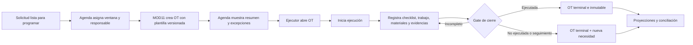

# Diseño de OT de instalación para coordinación y ejecución

**Version:** 1.1  
**Estado:** G2 aprobado — listo para congelación G4  
**Fecha:** 2026-07-27  
**Autor:** AI-PROD-UX  
**Roles consultados:** AI-EM-ARCH, AI-DS-OWNER, AI-FE-PLATFORM, AI-SR-FULL, AI-SR-QA, AI-SEC-ENG  
**Ruta observada:** `/dashboard/scheduling/agenda` → detalle de tarea → OT de ejecución  
**ADR rector:** `docs/adrs/ADR-068-Sincronizacion-OT-Ejecucion-Proyecciones-Operativas.md` (Aprobado por CTO el 2026-07-27)  
**Contrato de componente:** `docs/specs/2026-07-27-mod09-mod11-ot-instalacion-ds-contrato.md` (v1.0 en revisión por AI-DS-OWNER; G2 global se cierra al aprobarse)  
**Contrato API:** `docs/specs/2026-07-27-mod09-mod11-ot-instalacion-contrato-api.md` (materializa AI-SR-FULL en G3)  
**Dirección visual:** `docs/specs/2026-07-12-firma-iwana-diseno-visual-design.md`  

---

## 1. Objetivo y veredicto de auditoría

Definir el flujo objetivo de una instalación desde la perspectiva del coordinador y del ejecutor de campo. Este documento es la **UX spec congelada para la fase de ejecución**: gobierna qué ven los usuarios, qué pueden hacer y en qué orden, sin definir tokens, API de componentes ni contratos de datos.

El submódulo actual queda en **NO-GO para producción hasta G7**, pero el alcance de experiencia (G2) se considera **aprobado**: los flujos de coordinación y ejecución están cerrados, los estados de interfaz obligatorios están declarados, el vocabulario visible está validado y los criterios de aceptación pueden ser consumidos por AI-FE-PLATFORM y AI-SR-QA sin aclaraciones de flujo.

La “tarea a realizar” no es una ruta independiente: es el detalle lateral del evento en Agenda. Su función debe ser supervisar contexto y excepciones; no convertirse en una segunda pantalla de ejecución.

---

## 2. Principios de experiencia

1. Una visita/sitio genera una OT de ejecución.
2. El coordinador programa, supervisa y resuelve excepciones.
3. El técnico o contratista asignado ejecuta si su perfil contiene el permiso correspondiente.
4. MOD11 muestra y conserva la verdad técnica; Agenda consume un resumen.
5. Las acciones se habilitan por estado, permiso y asignación, no solo por rol nominal.
6. Una OT terminal se consulta; no se edita.
7. La corrección posterior se expresa como seguimiento, nueva visita o nueva OT vinculada.
8. Los requisitos de cierre provienen de una plantilla versionada por tipo de trabajo.
9. La Agenda nunca registra trabajo de campo, consumo de inventario ni cierre técnico.
10. Los estados asincrónicos se comunican con franqueza; no se disfrazan de definitivos.

---

## 3. Arquitectura de información

### 3.1 Agenda: panel de supervisión

El panel lateral contiene:

- **Encabezado:** tipo de visita, estado operativo, prioridad y alerta.
- **Contexto:** ventana programada, cliente/sitio, responsable, dirección de servicio y enlace de mapa seguro.
- **Progreso de OT:** número, estado, plantilla aplicada, porcentaje de requisitos y última sincronización.
- **Siguiente acción de coordinación:** asignar, reprogramar, cancelar, escalar o abrir OT.
- **Excepciones:** bloqueo, falta de material, rechazo, retraso de sincronización.
- **Historial compacto de cambios relevantes.**

No contiene:

- formularios de actividad de campo;
- consumo de inventario;
- captura de firma o evidencias;
- selectores genéricos de transición;
- dos juegos de botones para evento y OT;
- identificadores técnicos largos como contenido principal;
- controles para mutar una OT cerrada.

### 3.2 OT: espacio de ejecución

La OT se organiza en seis bloques:

1. **Compromiso:** número, tipo, sitio, ventana, responsable, prioridad, origen y alcance.
2. **Checklist de instalación:** requisitos de plantilla y progreso.
3. **Trabajo realizado:** actividad tipada, descripción, mediciones y novedades.
4. **Equipos y materiales:** custodio validado, ítem, cantidad, serial/lote y destino.
5. **Evidencia y conformidad:** fotos/documentos, georreferencia cuando aplique, aceptación y firma.
6. **Cierre:** resultado, causa cuando no se ejecuta, seguimiento, resumen y confirmación.

La bitácora es cronológica, de solo lectura, con actor visible de forma apropiada, fecha local, acción y correlación; los payloads internos y UUID no se exponen salvo vista de soporte autorizada.

> **Nota de composición:** el bloque 5 agrupa evidencia y conformidad porque ambos dependen de la plantilla versionada y se capturan durante la ejecución. Si la plantilla exige firma, el ejecutor la registra aquí; si no la exige, el bloque se reduce a evidencia y georreferencia. No se despliega una séptima sección permanente.

---

## 4. Contenido obligatorio de una OT de instalación

| Grupo | Campo o evidencia | Regla |
| --- | --- | --- |
| Identidad | número, versión de plantilla, origen, referencias de tarea/visita/evento | Siempre |
| Cliente/sitio | identificador funcional, dirección de servicio, contacto operativo mínimo | PII minimizada y acceso autorizado |
| Programación | ventana, zona, coordenadas si están permitidas, técnico/cuadrilla | Siempre |
| Alcance | servicio/producto, tecnología, instrucciones, riesgo/precondiciones | Siempre |
| Red | punto de conexión, puerto/recurso, niveles o mediciones aplicables | Según plantilla |
| CPE/equipos | SKU/tipo, serial/MAC cuando aplique, custodio y destino | Validación contra inventario |
| Materiales | ítem, unidad, cantidad usada/devuelta/averiada | Movimiento idempotente |
| Ejecución | actividades, tiempos, bloqueos, observaciones | Registro append-only |
| Evidencia | tipo, archivo, hash, timestamp, metadata permitida | Según plantilla |
| Validación | pruebas de conectividad/calidad y resultado | Según tecnología |
| Conformidad | nombre/rol del receptor, consentimiento, firma o causa de ausencia | Sujeto a validación legal |
| Cierre | resultado, causa tipada, resumen, siguiente acción | Gate obligatorio |
| Auditoría | actor, permiso, fechas, idempotency key/correlation id | No visible como ruido al usuario |

La suficiencia probatoria de firma, geolocalización o consentimiento requiere validación de Legal/Regulatorio. Esta spec no afirma que una firma dibujada por sí sola tenga validez jurídica.

---

## 5. Plantillas versionadas

Un administrador con `operations.execution_order_templates.manage` mantiene plantillas por tipo de trabajo. Cada versión define:

- campos y evidencias obligatorias;
- actividades y mediciones permitidas;
- reglas de serial, cantidad y custodia;
- motivos de bloqueo, no ejecución y cancelación;
- condiciones de firma/conformidad;
- reglas de cierre y seguimiento;
- fecha de vigencia y compatibilidad.

Una OT conserva la versión asignada al crearse. Publicar una nueva versión no modifica órdenes existentes. Desactivar una plantilla impide nuevas asignaciones, no invalida históricos.

---

## 6. Estados y acciones

| Estado OT | Acción primaria | Acciones permitidas | Prohibiciones |
| --- | --- | --- | --- |
| Creada | Asignar | cancelar bajo política, reprogramar desde Agenda | ejecutar sin responsable |
| Asignada | Iniciar ejecución | reasignar/reprogramar antes del inicio | registrar cierre |
| En progreso | Continuar trabajo | registrar actividad, evidencia, consumo, bloquear, cerrar | reasignar silenciosamente |
| Bloqueada | Resolver bloqueo | documentar novedad, reprogramar, crear seguimiento | cerrar “ejecutada” sin resolver gate |
| Completada | Consultar acta | crear seguimiento | editar, agregar consumo o evidencia |
| Completada con observaciones | Consultar acta | crear seguimiento | editar |
| No ejecutada | Consultar causa | reprogramar/crear seguimiento | reabrir |
| Cancelada | Consultar causa | crear nueva OT si procede | reabrir |

No se ofrece un selector genérico de estados. Cada comando representa intención de negocio y muestra sus consecuencias antes de confirmar.

> **Nota de dominio vs. interfaz:** los estados de la tabla son los estados de negocio de ADR-068. Estados adicionales de interfaz (carga, vacío, error, sin permiso, no asignado, sin conexión, sincronización pendiente, conflicto de versión, OT terminal e inconsistencia detectada) se declaran en §9 y no mutan la OT.

---

## 7. Flujo end-to-end

---

## 8. Permisos y alcance

| Permiso | Capacidad |
| --- | --- |
| `operations.execution_orders.read` | Consultar OT dentro de asignación o alcance autorizado |
| `operations.execution_orders.execute` | Ejecutar OT asignada; aplica a técnico o contratista habilitado |
| `operations.execution_orders.supervise` | Consultar todas las OT operativas del alcance autorizado y resolver excepciones de coordinación |
| `operations.execution_order_templates.read` | Consultar plantillas publicadas del tenant |
| `operations.execution_order_templates.manage` | Crear, versionar, publicar y retirar plantillas |
| `operations.execution_events.redrive` | Reprocesar de forma excepcional un evento OT en DLQ dentro del tenant y con auditoría |

Reglas adicionales:

- pertenencia al tenant y alcance operativo son obligatorios;
- el permiso de ejecución no concede acceso a una OT ajena;
- supervisar no concede registrar trabajo ni falsear firma/evidencia;
- el alias `wfm.work_orders.execute` puede mantenerse temporalmente y debe retirarse con telemetría.

---

## 9. Estados de interfaz obligatorios

Cada superficie cubre los siguientes estados. El consumidor de componentes (`OperationalSidePeek`, `ExecutionOrderSummary` y las vistas de MOD11) implementa las variantes que apliquen a su contexto; esta spec no define tokens ni API de componentes.

| Estado de interfaz | Cuándo aparece | Copy/mensaje visible | Acción ofrecida | Qué no debe hacer |
| --- | --- | --- | --- | --- |
| **Carga** | Primera carga o refresco de datos | — | — | No mostrar spinners genéricos en el contenido principal; usar skeleton con forma de contenido si la carga supera ~300 ms. |
| **Vacío** | No hay eventos/OT para el filtro o la fecha seleccionada | “No hay visitas programadas para este período.” | Crear visita / limpiar filtros | No decir “No data” ni mostrar enums crudos. |
| **Error recuperable** | Fallo de red o servidor al cargar | “No pudimos cargar la información. Intenta de nuevo.” | Reintentar / volver a Agenda | No exponer stack trace, UUID ni mensajes técnicos. |
| **Sin permiso** | El usuario autenticado no tiene permiso para ver la OT | “No tienes permiso para ver esta orden.” | Volver a Agenda / contactar al coordinador | No simular datos vacíos ni ofrecer acciones bloqueadas. |
| **No asignado** | La OT existe pero el usuario no es el ejecutor asignado | “Esta orden está asignada a otro responsable.” | Ver resumen (solo supervisión) / Escalar | No ofrecer “Iniciar ejecución” ni “Cerrar”. |
| **Sin conexión** | Navegador sin red mientras se consulta la OT | “Sin conexión. Vuelve a intentar cuando recuperes la red.” | Reintentar | No guardar localmente evidencia, firma, dirección, instrucciones ni textos libres. Bloquear comandos; mantener solo lectura de lo ya recibido. |
| **Sincronización pendiente** | Proyección de Agenda atrasada respecto a MOD11 | “Actualización pendiente. Última sincronización: {hora}.” | Refrescar | No habilitar decisiones terminales (asignar, cancelar, cerrar) hasta que el estado se actualice. |
| **Conflicto de versión** | La OT cambió en servidor mientras el usuario la editaba | “La orden cambió; revisa la versión vigente antes de continuar.” | Recargar / descartar borrador | No sobreescribir silenciosamente; no perder el trabajo del usuario sin aviso. |
| **OT terminal** | OT en Completada, Completada con observaciones, No ejecutada o Cancelada | “Esta orden está cerrada. Solo puedes consultarla.” | Crear seguimiento / nueva visita | No mostrar controles editables, selectores de estado ni campos de entrada. |
| **Inconsistencia detectada** | Discrepancia entre proyección de Agenda y estado canónico de MOD11 | “Encontramos diferencias entre la agenda y la orden. Refresca o contacta al coordinador.” | Refrescar / escalar | No ocultar la discrepancia ni permitir acciones sobre datos contradictorios. |

En esta fase no se habilitan borradores offline. Ante red inestable, la UI conserva el estado ya recibido solo para consulta, bloquea comandos y muestra “Sin conexión; vuelve a intentar cuando recuperes la red”. No persiste localmente evidencia, firma, dirección, instrucciones ni textos libres. Una capacidad offline futura requiere política propia congelada en G4.

---

## 10. Vocabulario visible

El texto visible usa sentence case en español. No se muestran enums crudos ni UUID como etiquetas principales.

| Término interno / enum | Texto visible |
| --- | --- |
| `ExecutionOrder` | Orden de trabajo |
| `INSTALLATION` | Instalación |
| `FIELD_NOTE` | Nota de campo |
| `CREATED` | Creada |
| `ASSIGNED` | Asignada |
| `IN_PROGRESS` | En progreso |
| `BLOCKED` | Bloqueada |
| `EXECUTED` / `COMPLETED` | Ejecutada |
| `COMPLETED_WITH_OBSERVATIONS` | Completada con observaciones |
| `NOT_EXECUTED` | No ejecutada |
| `CANCELLED` | Cancelada |
| `stale` | Actualización pendiente |
| `conflict` | La orden cambió; revisa la versión vigente |
| `offline` | Sin conexión |
| `forbidden` | No tienes permiso |
| `unassigned` | Asignada a otro responsable |
| `unavailable` | No disponible |
| `inconsistency` | Diferencias entre agenda y orden |
| UUID / `scheduleEventId` | No se muestra; solo referencia funcional de visita si aplica |
| `workTypeLabel` | Tipo de trabajo localizado |
| `templateLabel` | Plantilla + versión (p. ej., “Instalación fibra — v3”) |
| `assigneeLabel` | Nombre o alias del responsable; sin PII innecesaria |
| `siteLabel` | Sitio o dirección de servicio autorizada |

Las labels se externalizan para i18n y pasan revisión de vocabulario (`system-vocabulary-review`).

---

## 11. Criterios de aceptación UX

- **CA-UX-01:** Agenda nunca permite ejecutar o cerrar la OT desde el resumen.
- **CA-UX-02:** El coordinador identifica estado, responsable, ventana, progreso y excepción sin desplegar formularios extensos.
- **CA-UX-03:** No se muestran enums crudos ni UUID como labels principales.
- **CA-UX-04:** Toda acción destructiva o terminal explica impacto y exige confirmación.
- **CA-UX-05:** Una OT terminal no presenta controles editables.
- **CA-UX-06:** El gate de cierre enumera faltantes accionables.
- **CA-UX-07:** El flujo funciona por teclado, conserva foco y cumple contraste AA.
- **CA-UX-08:** Móvil prioriza una columna, acción primaria persistente y carga de evidencia tolerante a red.
- **CA-UX-09:** Se informa lag de proyección; no se disfraza como estado definitivo.
- **CA-UX-10:** Las correcciones crean seguimiento trazable.
- **CA-UX-11:** El side peek de Agenda cierra con `Escape`, atrapa el foco y lo restaura al origen.
- **CA-UX-12:** Los estados asíncronos (sincronización pendiente, conflicto de versión, sin conexión) se anuncian sin interrumpir la tarea principal.
- **CA-UX-13:** El progreso del checklist es visible como porcentaje completado y lista de requisitos faltantes accionables.
- **CA-UX-14:** Los errores de servidor no exponen UUID, stack traces ni mensajes técnicos al usuario final.
- **CA-UX-15:** La OT terminal muestra resumen de cierre, resultado y, si aplica, botón para crear seguimiento; no muestra “Guardar” ni selectores de estado.
- **CA-UX-16:** La acción primaria de cada estado es la única CTA destacada; las acciones secundarias usan variantes ghost/outline y las destructivas usan `softDestructive` según contrato DS.
- **CA-UX-17:** La evidencia visual incluye descripción alternativa y estado de análisis (`PENDING_ANALYSIS`, `AVAILABLE`, `REJECTED`, `EXPIRED`) traducido a lenguaje humano sin exponer enums.
- **CA-UX-18:** El flujo respeta WCAG 2.2 AA: contraste mínimo AA en claro y oscuro, foco visible, orden de tabulación lógico, targets táctiles ≥44 × 44 px y estados no comunicados solo por color.

---

## 12. Qué se resuelve en G2, qué mejora y qué sobra

### Resuelto en G2

- Agenda es solo supervisión/coordinación; no ejecuta ni cierra OT.
- Workspace de OT con 6 bloques: compromiso, checklist, trabajo, materiales, evidencia/conformidad, cierre.
- Estados de interfaz obligatorios declarados y copy validado.
- Vocabulario visible sin enums crudos ni UUID prominentes.
- Criterios de aceptación UX-01..UX-18 verificables por FE-PLATFORM y SR-QA.

### Mejora respecto al baseline

- Panel de Agenda compacto, vocabulario humano, jerarquía de acciones, progreso por checklist, historial legible, resumen de consumo y alertas por excepción.

### Sobra / prohibido

- Dos máquinas de estados manipulables en una misma vista, selectores genéricos, mutaciones de la OT ligera, campos de inventario sin picker/validación, firma como texto, IDs técnicos prominentes y edición posterior al cierre.

---

## 13. Gates del protocolo

- **G1 Definición:** ADR-068 aprobado por CTO el 2026-07-27.
- **G2 Solución UX/UI:** AI-PROD-UX aprueba el alcance de esta UX spec. El cierre total de G2 requiere que AI-DS-OWNER confirme el contrato de componente (`docs/specs/2026-07-27-mod09-mod11-ot-instalacion-ds-contrato.md`).
- **G3 Factibilidad:** AI-SR-FULL y AI-FE-PLATFORM emiten dictamen; AI-SEC-ENG, AI-DATA-ENG y AI-PLAT-OPS revisan su dominio.
- **G4 Diseño:** AI-EM-ARCH emite prompts y declara contratos DS/API congelados con artefactos reales.
- **G5 Implementación:** código, tests, migraciones, OpenAPI, observabilidad y rollback cumplen gates técnicos.
- **G6 Experiencia/calidad:** PROD-UX, DS-OWNER, SR-QA y SEC-ENG emiten evidencia y pueden bloquear.
- **G7 Producción:** AI-EM-ARCH recomienda GO/NO-GO y CTO decide.

La implementación contract-first está autorizada tras G1; G3/G4 permanecen en materialización y congelación verificable. Mientras G5–G6 no estén aprobados, el veredicto de producción sigue siendo **NO-GO**.

---

## Bloqueos / dependencias pendientes

- Ningún bloqueo de contenido en la UX spec.
- **Dependencia G2 global:** AI-DS-OWNER debe aprobar `docs/specs/2026-07-27-mod09-mod11-ot-instalacion-ds-contrato.md` para que G2 quede cerrado en su totalidad.
- **Dependencia G3/G4:** AI-SR-FULL debe materializar el contrato API tipado y AI-FE-PLATFORM debe emitir dictamen de factibilidad antes de la congelación de contratos.
