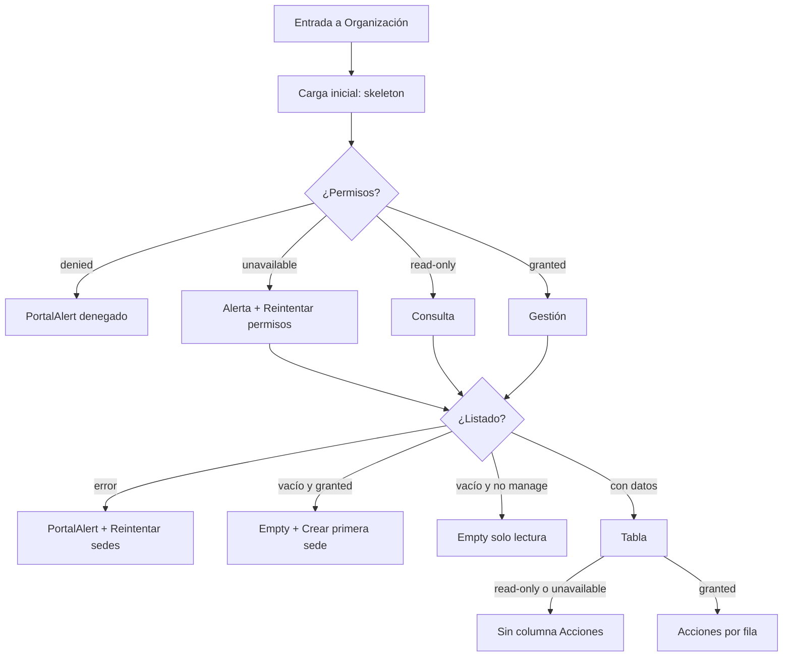

# Design — MOD00 Organización — Remediación UI/UX

**Version:** 1.1
**Estado:** Aprobado
**Fecha:** 2026-08-15
**Autor:** AI-PROD-UX
**Superficie:** `apps/portal` → `/dashboard/settings/organization`
**Congela para:** AI-FE-PLATFORM y AI-SR-QA (protocolo §3bis, track UX)
**ADR rector:** `docs/adrs/ADR-040-Configuracion-Control-Plane-Organizacion-Acceso.md`
**ADR relacionado:** `docs/adrs/ADR-043-Edicion-Atomica-Sede-Capacidades.md`
**PRD:** `docs/prds/PRD-MOD00-CONFIGURACION-CONTROL-PLANE-v1.0.md`  
**HLD:** `docs/hlds/HLD-MOD00-CONFIGURACION-CONTROL-PLANE-v1.0.md`  
**Specs antecedentes:** `docs/specs/2026-05-23-mod00-organization-site-modal-unificado-design.md` y `docs/specs/2026-05-23-mod00-sedes-nodos-nms-design.md`  
**Plan:** `docs/plans/2026-08-15-mod00-organizacion-ui-remediation.md`  
**Informe vivo:** `docs/informes/INFORME-MOD00-CONFIGURACION-CONTROL-PLANE-v1.0.md`  
**Identidad:** `docs/specs/2026-07-12-firma-iwana-diseno-visual-design.md`  
**Vocabulario:** skill `system-vocabulary-review`

**Qué es este documento.** Contrato correctivo de experiencia, copy y estados para la pantalla de Organización. Corrige hallazgos P1–P3 sin cambiar alcance funcional, contratos de API ni tokens. Donde esta spec y las specs de mayo discrepen en estados, copy, accesibilidad o superficies de esta ruta, **prevalece este documento**. Donde discrepen en la decisión del modal unificado (tabs Información / Servicios, un solo submit, payload atómico), prevalece `2026-05-23-mod00-organization-site-modal-unificado-design.md`.

**Qué no es.** No redefine tokens, paleta ni API de componentes (AI-DS-OWNER). No escribe código (AI-FE-PLATFORM). No pide endpoints, migraciones ni cambios de permisos (AI-SR-FULL). No contiene PII ni datos reales; los nombres de ejemplo son ilustrativos (`Sede centro`, `Sede norte`).

---

## 1. Objetivo

Corregir la experiencia de `/dashboard/settings/organization` para que una persona administradora o consultora de la empresa pueda revisar perfil, preferencias regionales y sedes **sin ambigüedad de estado**: carga, vacío, solo lectura, permiso denegado, error recuperable y error de submit quedan diferenciados, con copy controlado y superficies Firma iWana ya existentes.

Metas simultáneas:

1. no mostrar un vacío falso antes de terminar la carga inicial;
2. no filtrar un fallo de permisos como si fuera un listado vacío o una denegación;
3. conservar el modal unificado de sede y hacer operable la validación entre tabs;
4. hidratar y enviar `country` desde el cliente tipado ya existente;
5. sustituir `window.confirm` por el `Dialog` de iWana al dar de baja;
6. cumplir WCAG 2.2 AA en claro y oscuro, con objetivos táctiles de al menos 44 px.

No se añaden endpoints, migraciones, paquetes ni tokens. El alcance es **solo portal**.

---

## 2. Alcance

### 2.1 Entra

- Estados de carga, vacío, error, recuperación y permisos de esta pantalla.
- Copy visible de página, paneles, formulario de sede, servicios, errores y diálogo de baja.
- Formulario unificado de sede, incluido el campo `country` ya soportado por el cliente tipado.
- Validación accesible entre tabs e error de submit **dentro** del diálogo.
- Tabla de sedes: columna Acciones condicional, badges, contraste, foco, scroll interno en móvil.
- Diálogo iWana para dar de baja una sede activa.
- Contrato visual de primitivas existentes (sección 10). Criterios de aceptación UX/DS (sección 13).

### 2.2 No entra

- API, OpenAPI, PostgreSQL, migraciones, tenancy o permisos.
- Reactivación de sedes.
- Navegación global, componente `PageHeader` (sí cambia el subtítulo que se le pasa en esta pantalla) u otras subsecciones de Configuración.
- Cambios globales en `PortalDataTableShell` o primitivas de `@iwana/ui`.
- Rediseño de horarios, asignaciones, responsables o consumidores WFM/NMS.

---

## 3. Persona y tarea

**Persona principal:** administradora de la empresa (`ADMIN` con `organization.sites.manage`).

**Tarea en un ciclo:** revisar los datos de su empresa, ajustar preferencias regionales si le corresponde y dejar las sedes listas (crear, editar servicios o dar de baja) sin salir de esta pantalla.

**Persona secundaria:** consultora con `organization.sites.read` y sin manage. Su tarea es **consultar** sedes y perfil; no crear, editar ni dar de baja.

Si un bloque no sirve a una de esas dos tareas, no se añade en esta remediación.

---

## 4. Arquitectura de información

La jerarquía vigente de las specs de mayo se conserva. Esta remediación no reordena bandas ni introduce paneles nuevos.

Orden de lectura, de arriba hacia abajo:

1. Encabezado de página (título existente + subtítulo congelado en §6).
2. Panel de perfil empresarial.
3. Panel `Preferencias regionales`.
4. Panel `Sedes registradas` (tabla compacta o empty state; nunca ambos a la vez).

El CTA de listado con datos (`Crear sede`) vive en `PortalPanel.actions` del panel `Sedes registradas`, no en `PageHeader.actions`; el empty editable conserva `Crear primera sede` solo en `PortalEmptyState`.

El detalle operativo profundo (horarios, responsables, NMS) sigue fuera de esta superficie. Las acciones de sede viven en la fila y en el modal unificado, no en un panel lateral permanente.

Columnas de la tabla (desktop):

| Columna | Visible cuando |
| --- | --- |
| Sede | Siempre que hay listado |
| Tipo | Siempre que hay listado |
| Ubicación | Siempre que hay listado |
| Servicios | Siempre que hay listado |
| Estado | Siempre que hay listado |
| Acciones | Solo si la persona puede gestionar sedes |

En solo lectura **no** se renderiza la columna Acciones ni el CTA `Crear sede` / `Crear primera sede`.

---

## 5. Matriz de estados (congelada)

Esta matriz es el contrato. Copy y superficie se usan **literalmente**. No se fusionan estados. Un fallo de permisos no se pinta como vacío; un vacío no se pinta durante la carga.

| Estado | Superficie | Copy / acción |
| --- | --- | --- |
| Carga inicial | Skeleton de dos paneles y tabla | `Cargando información de la empresa y sus sedes.` |
| Actualización | Contenido conservado con `aria-busy=true` | Sin reemplazar por vacío |
| Vacío editable | `PortalEmptyState` | `Aún no hay sedes registradas. Crea la primera para organizar la operación de tu empresa.` + `Crear primera sede` |
| Vacío solo lectura | `PortalEmptyState` | `Aún no hay sedes registradas. Una persona administradora puede crear la primera.` |
| Solo lectura | Aviso informativo | `Puedes consultar las sedes, pero no modificarlas.` |
| Permiso denegado | `PortalAlert` controlado | `No tienes permisos para consultar las sedes.` |
| Permisos no disponibles | `PortalAlert` + reintento | `No pudimos confirmar tus permisos para gestionar sedes.` |
| Error de listado | `PortalAlert` + reintento | `No pudimos cargar las sedes. Intenta nuevamente.` |
| Error de submit | `PortalAlert` dentro del diálogo | Conservar datos y foco dentro del diálogo |

### 5.1 Reglas de composición de estados

1. **Carga inicial.** Skeleton con forma de contenido: panel de empresa, panel de preferencias regionales y tabla de sedes. `role="status"`, `aria-live="polite"`, `aria-label="Cargando sedes"`. El texto de la matriz va en `sr-only`. **Prohibido** mostrar `PortalEmptyState`, aviso de solo lectura o error de listado antes de que la primera petición de sedes termine.
2. **Actualización (refresh).** El contenido ya pintado permanece. El shell de la tabla lleva `aria-busy=true`. No se vacía la lista ni se sustituye por skeleton de pantalla completa.
3. **Vacío editable.** Primera vez (Firma §2.6): explicación + CTA primario `Crear primera sede`. No es un «sin resultados de filtro».
4. **Vacío solo lectura.** Misma superficie `PortalEmptyState`, **sin** CTA de creación. El aviso de solo lectura de la matriz convive cuando hay listado consultable; si no hay sedes, basta el empty de solo lectura.
5. **Solo lectura con datos.** Tabla visible, sin columna Acciones, sin `Crear sede`. El aviso informativo de la matriz es visible.
6. **Permiso denegado.** No se pide el listado como superficie accionable. `PortalAlert` controlado. Sin tabla, sin empty, sin CTA de sede.
7. **Permisos no disponibles.** El fallo de la API de permisos **no** se traduce en denegación. Se muestra `PortalAlert` + `Reintentar permisos`. Las sedes pueden cargarse en consulta; las mutaciones permanecen apagadas.
8. **Error de listado.** `PortalAlert` + `Reintentar sedes`. Copy controlado; nunca el mensaje interno de API.
9. **Error de submit.** El diálogo de sede **permanece abierto**. Datos, tabs y foco se conservan. El `PortalAlert` vive **dentro** del diálogo. El diálogo no se cierra ni se resetea.

---

## 6. Copy congelado

Todo el copy de esta sección es literal. Sentence case. Español. Sin enums crudos, sin `tenant`, sin mensajes de backend.

### 6.1 Página y paneles

| Pieza | Copy |
| --- | --- |
| Page subtitle | `Revisa los datos de tu empresa, sus preferencias regionales y las sedes registradas.` |
| Panel | `Preferencias regionales` |
| Panel description | `Zona horaria, país, idioma y moneda usados en el portal.` |
| Company field | `Dígito de verificación (DV)` |
| Company field | `País de registro` |

El título de página `Perfil empresarial y organización` y el panel `Sedes registradas` se conservan. Esta remediación no rediseña el `PageHeader`; solo sustituye el subtítulo que la pantalla le pasa.

### 6.2 Formulario de sede (modal unificado)

| Pieza | Copy |
| --- | --- |
| Form group | `Ubicación y contacto del sitio` |
| Form help | `Completa estos datos para ubicar la sede y dejar un contacto operativo local.` |
| Services help | `Selecciona los servicios que opera esta sede.` |
| Services count | `{seleccionados} de {total} servicios seleccionados` |
| Empty services | `Aún no has seleccionado servicios para esta sede.` |

Grupos del tab Información, en este orden: `Datos básicos`, `Ubicación y contacto del sitio`, `Estado de la sede`.

Label del campo de sede `country`: `País`. No se confunde con `País de registro` del perfil empresarial.

Selección de sede principal:

- Label: `Marcar como sede principal`
- Descripción: `Identifica esta sede como referencia principal de la empresa.`

Tabs vigentes (spec de mayo, no se renombran): `Información de la sede`, `Servicios`.

Acciones del modal: `Crear sede` / `Guardar cambios` según creación o edición. CTA de listado con datos: `Crear sede`. CTA de vacío editable: `Crear primera sede`.

### 6.3 Reintentos

| Pieza | Copy |
| --- | --- |
| Retry permissions button | `Reintentar permisos` |
| Retry sites button | `Reintentar sedes` |

### 6.4 Solo lectura y acciones de fila

- Solo lectura **no** renderiza la columna Acciones ni `Crear sede` / `Crear primera sede`.
- Sedes inactivas **no** ofrecen `Dar de baja`.
- Acción de fila activa: `Editar sede` (nombre de la sede en `sr-only`).
- Acción de baja en fila activa: `Dar de baja sede` (nombre de la sede en `sr-only`).
- Badges de estado: `Activa` / `Inactiva`.

### 6.5 Diálogo de baja

| Pieza | Copy |
| --- | --- |
| Título | `¿Dar de baja «{nombre}»?` |
| Confirmar | `Dar de baja` |
| Cancelar | `Cancelar` |
| Cuerpo | `La sede dejará de estar disponible para la operación. La información histórica se conservará.` |

El cuerpo **debe** mencionar que la información histórica se conserva. `{nombre}` es el nombre visible de la sede, no un identificador interno.

### 6.6 Errores sanitizados (nunca el mensaje interno)

Ningún `error.message`, payload, SQL, nombre de schema o traza llega a la UI.

| Caso | Copy visible |
| --- | --- |
| Listado de sedes, genérico | `No pudimos cargar las sedes. Intenta nuevamente.` |
| Listado de sedes, 403 | `No tienes permisos para consultar las sedes.` |
| Permisos no disponibles | `No pudimos confirmar tus permisos para gestionar sedes.` |
| Empresa, sesión expirada (401) | `Tu sesión expiró. Inicia sesión nuevamente.` |
| Empresa, 403 | `No tienes permisos para consultar esta sección.` |
| Empresa, genérico | `No pudimos cargar la información de la empresa. Intenta nuevamente.` |
| Submit, conflicto de código (409) | `Ya existe una sede con ese código. Usa uno diferente.` |
| Submit, crear | `No pudimos crear la sede. Revisa la información e intenta nuevamente.` |
| Submit, editar | `No pudimos actualizar la sede. Revisa la información e intenta nuevamente.` |
| Título del alerta dentro del diálogo | `No fue posible guardar la sede` |

El alerta de submit usa `live="assertive"` y se limpia al abrir o cerrar el diálogo, no al perder el foco.

---

## 7. Modal unificado y validación entre tabs

El modal unificado **permanece**. Un solo diálogo, dos tabs, un submit, payload de datos base + `capabilities`. No se reabre el panel lateral ni un segundo diálogo para servicios.

### 7.1 Apertura

- Crear: abre en `Información de la sede`; servicios vacíos; `country` por defecto = país de la empresa (`profile.countryCode` o settings de país) o `CO` si no hay valor.
- Editar: abre en `Información de la sede`; hidrata datos y servicios desde el detalle; `País` muestra el `country` de la sede.

### 7.2 Submit inválido desde Servicios

Si la persona está en `Servicios` y envía con campos de Información inválidos:

1. el tab activo pasa a `Información de la sede`;
2. el foco va al **primer** campo inválido, en este orden: `name`, `code`, `siteType`, `country`, `coordinates`, `contactName`, `contactPhone`;
3. ese campo queda `aria-invalid="true"` y usa la API de error de `Input` / `Select` (sin `<label>` ni `
` duplicados alrededor).

No se muestra un toast de validación fuera del diálogo. El error de campo es suficiente.

### 7.3 Submit de red fallido

- El diálogo no se cierra.
- El formulario no se resetea.
- El `PortalAlert` de §6.6 aparece dentro del diálogo.
- El foco permanece en el diálogo (no salta a la página).

---

## 8. Campo `country`

El campo `country` **ya** está soportado por el cliente tipado: `OrganizationSiteDetail`, `CreateOrganizationSiteDto`, `UpdateOrganizationSiteDto`. Esta spec **no** pide cambio de backend, OpenAPI, entidad ni migración.

Reglas de experiencia:

1. El formulario de sede expone `País` como `Select` requerido.
2. En edición, el valor se hidrata desde `site.country`.
3. En creación y edición, el payload envía `country` en mayúsculas (código ISO de dos letras).
4. Si la sede trae un código que no está en el catálogo local, el `Select` debe poder mostrarlo (opción de compatibilidad); no se borra el valor al abrir.
5. `País de registro` del perfil empresarial es **otro** campo; no se reutiliza su label en el modal de sede.

---

## 9. Dar de baja

Se reemplaza `window.confirm` por el `Dialog` de iWana.

Reglas:

1. Solo una sede **activa** ofrece la acción de fila `Dar de baja sede`.
2. Una sede **inactiva** no ofrece dar de baja ni un control deshabilitado equivalente: la acción no se renderiza.
3. Confirmar llama a la baja existente (`organizationApi.delete`) **solo** después de `Dar de baja` en el diálogo.
4. Cancelar cierra el diálogo y no dispara la baja.
5. El título interpola el nombre visible: `¿Dar de baja «Sede centro»?`.
6. No hay flujo de reactivación en esta spec (fuera de alcance).

---

## 10. Contrato visual (AI-DS-OWNER — sin tokens nuevos)

Contrato congelado. Se usan primitivas y clases **ya existentes**. Prohibido crear tokens, primitivas globales o cambiar el shell de tabla del portal.

- CTA principal: `Button size="lg"`.
- Reintentos: `Button variant="link"` con `min-h-11`.
- Acciones de fila: `Button size="sm"` con `min-h-11`.
- Selecciones: `CheckboxCard`.
- Estado activo: `Badge variant="success"`.
- Estado inactivo y servicios: `Badge variant="neutral"`.
- Encabezados de tabla: `PortalDataTableHead`.
- Contraste secundario: `text-gray-500 dark:text-gray-400`.
- Error: `text-red-600 dark:text-red-400`.
- Superficies: `shadow-iwana-card` o `PortalPanel`.
- Eyebrows: `portal-eyebrow` o `portal-eyebrow-muted`.
- Tabla móvil: scroll horizontal local; no cambiar el shell global.

### 10.1 Mapeo a superficies de esta pantalla

| Superficie | Aplicación |
| --- | --- |
| `Crear sede` / `Crear primera sede` / guardar perfil o preferencias | `Button size="lg"` |

| `Reintentar permisos` / `Reintentar sedes` | `Button variant="link"` + `min-h-11`; no `<button>` local |
| `Editar sede` / `Dar de baja sede` | `Button size="sm"` + `min-h-11` |
| Sede principal y capacidades | `CheckboxCard` |
| Badge `Activa` | `Badge variant="success"` |
| Badge `Inactiva` y cada servicio en tabla | `Badge variant="neutral"` |
| Encabezados Sede, Tipo, Ubicación, Servicios, Estado, Acciones | `PortalDataTableHead` |
| Ayudas, empty de servicios, texto de apoyo | `text-gray-500 dark:text-gray-400` |
| Mensaje de error de campo (si no lo cubre la primitive) | `text-red-600 dark:text-red-400` |
| Perfil empresarial y preferencias regionales | `shadow-iwana-card` o `PortalPanel` |
| Eyebrows de sección | `portal-eyebrow` o `portal-eyebrow-muted` |
| Tabla | wrapper local `overflow-x-auto`; la página no hace overflow-x |

`Crear sede` de listado con datos usa el slot `actions` de `PortalPanel`; no se coloca en `PageHeader`. El empty editable conserva `Crear primera sede` solo en `PortalEmptyState`.

La tabla puede desplazarse **dentro** de su wrapper. El `body` de la página no debe quedar en `overflow-x: scroll`. No se modifica `PortalDataTableShell` ni `@iwana/ui` para lograrlo.

Objetivos táctiles: todo control interactivo de esta pantalla alcanza **al menos 44 px** de alto (o `min-h-11`).

---

## 11. Accesibilidad (WCAG 2.2 AA)

1. Contraste AA en claro y oscuro con las clases de §10. Si identidad y contraste chocan, prevalece contraste y se documenta en el informe vivo.
2. Foco visible en todos los controles del listado, reintentos y diálogo.
3. El flujo es operable por teclado: abrir crear/editar, cambiar de tab, enviar, cancelar, dar de baja, reintentar.
4. Carga inicial anunciada (`role="status"` + copy de §5). Refresh con `aria-busy=true` sin perder el contenido.
5. Errores de campo con `aria-invalid` y `error` de la primitive; error de submit con `PortalAlert` `live="assertive"` dentro del diálogo.
6. Nombre accesible de acciones de fila incluye el nombre de la sede (`sr-only`), sin exponer identificadores internos.
7. No se usa el color como única señal: `Activa` / `Inactiva` llevan texto + `Badge`.
8. El empty de primera vez y el de solo lectura se distinguen por copy y por presencia o ausencia de CTA; no por color solo.

Viewports de verificación (plan): 390×844, 1024×768, 1440×900, en claro y oscuro.

---

## 12. Fuera de alcance (cierre explícito)

No forma parte de esta remediación:

- cambios de API, OpenAPI, PostgreSQL, migraciones, tenancy o matriz de permisos;
- reactivación de sedes;
- navegación global, rediseño de `PageHeader` u otras subsecciones de Configuración;
- cambios globales a `PortalDataTableShell` o primitivas de `@iwana/ui`;
- rediseño de horarios, asignaciones, responsables o consumidores WFM/NMS.

Cualquier necesidad nueva de patrón o token se escala a AI-DS-OWNER; no se inventa aquí. Cualquier dato o contrato nuevo se escala al orquestador.

---

## 13. Criterios de aceptación (UX/DS)

Verificables por AI-FE-PLATFORM y AI-SR-QA contra esta spec. Criterios de cobertura, lint y gate G6 viven en el plan y no se duplican aquí.

| ID | Criterio |
| --- | --- |
| CA-ORG-UX-01 | No aparece un empty state antes de terminar la carga inicial. |
| CA-ORG-UX-02 | Los errores internos nunca se muestran al usuario. |
| CA-ORG-UX-03 | Los errores de submit permanecen dentro del diálogo y conservan datos. |
| CA-ORG-UX-04 | Guardar desde Servicios lleva al primer error de Información y lo enfoca. |
| CA-ORG-UX-05 | País se hidrata y se envía en creación/edición. |
| CA-ORG-UX-06 | Solo lectura no renderiza la columna Acciones ni `Crear sede`. |
| CA-ORG-UX-07 | Sedes inactivas no ofrecen Dar de baja. |
| CA-ORG-UX-08 | Tabla móvil usa scroll interno sin overflow de página. |
| CA-ORG-UX-09 | Todos los controles interactivos alcanzan al menos 44 px. |
| CA-ORG-UX-10 | Claro y oscuro cumplen WCAG AA. |

Criterios de copy asociados (misma verificación):

- subtítulo de página, panel de preferencias regionales, grupos y ayudas del formulario, contador y empty de servicios, DV y país de registro coinciden con §6;
- reintentos usan `Reintentar permisos` y `Reintentar sedes`;
- el diálogo de baja usa el título, el cuerpo y el confirmar de §6.5.

---

## 14. Relación con artefactos vigentes

| Artefacto | Efecto de esta spec |
| --- | --- |
| ADR-040 | Sin cambio. Configuración sigue siendo control plane federado; no se tocan permisos ni ownership. |
| ADR-043 | Sin cambio. La edición de sede + capacidades sigue siendo atómica y unificada. |
| Spec modal unificado (2026-05-23) | Se conserva el modal de dos tabs y un submit. Se **añaden** estados de permiso, `country` en el formulario, validación entre tabs, error localizado y diálogo de baja. La columna Acciones deja de ser permanente: solo si hay gestión. |
| Spec sedes / NMS (2026-05-23) | Coordenadas y contacto operativo siguen en la sede. Esta spec nombra el grupo `Ubicación y contacto del sitio` y no expone campos NMS. |
| Firma iWana (2026-07-12) | Empty de primera vez vs consulta; skeleton con forma; contraste AA; primitivas existentes. |

No se requiere PRD, HLD ni ADR nuevos: no cambia stack, boundary, tenancy ni alcance funcional de MOD00.

---

## 15. Desbloqueo de tracks

Esta spec v1.0 queda **aprobada y congelada** el 2026-08-15.

- AI-DS-OWNER verifica el §10 (sin escribir componentes). Cualquier desvío de primitive se reporta; no se parchea el contrato en silencio.
- AI-FE-PLATFORM implementa contra §5–§11.
- AI-SR-QA escribe RED y E2E contra copy literal, matriz de estados y CA-ORG-UX-01…10.
- Un cambio posterior de flujo o copy se versiona (v1.1+) y se notifica a FE y QA; no se corrige solo en código.
