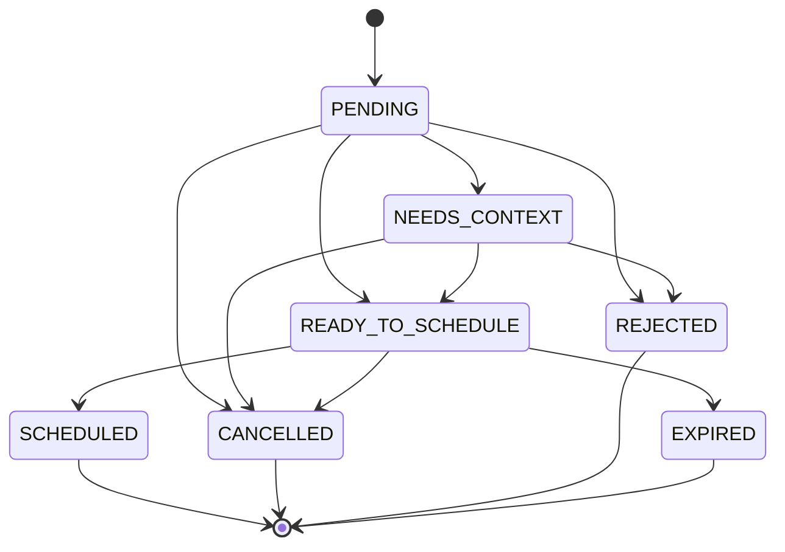
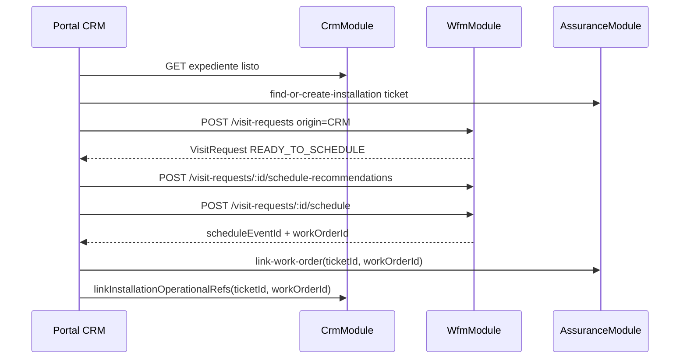
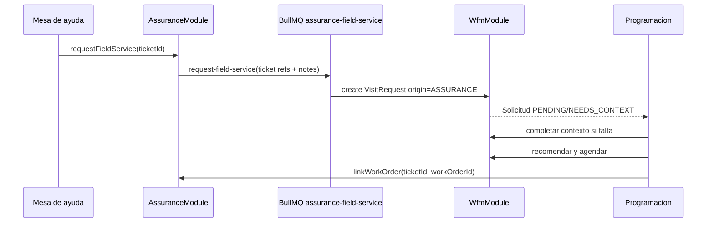

# SPEC - MOD09 Bandeja de visitas pendientes

**Version:** 1.0  
**Estado:** Aprobado  
**Fecha:** 2026-05-15  
**Modo activo:** Mixto  
**Autor:** AI-EM-ARCH  
**Modulo:** MOD09 Programacion / WFM  
**PRD base:** docs/prds/PRD-MOD09-PROGRAMACION-WFM-v1.0.md  
**HLD vigente:** docs/hlds/HLD-MOD09-PROGRAMACION-WFM-v1.0.md  
**ADR aprobado:** docs/adrs/ADR-039-Bandeja-Visitas-Pendientes-WFM.md  
**ADRs relacionados:** docs/adrs/ADR-037-Bounded-Context-Programacion-WFM.md, docs/adrs/ADR-038-Bounded-Context-Service-Assurance.md  
**Spec relacionada:** docs/specs/SPEC-MOD09-PROGRAMACION-WFM-COMMAND-CENTER-v1.0.md  
**Idea base:** docs/ideas/módulo_WFM.md

---

## 1. Proposito

Definir el diseno formal de la bandeja de visitas pendientes para MOD09. La bandeja convierte WFM en un centro de despacho operativo: primero se decide que visita debe programarse y luego se elige tecnico + franja semanal con apoyo de recomendaciones territoriales.

Esta spec evita continuar ampliando el modal de creacion de eventos. El modal pasa a ser superficie de confirmacion o fallback, mientras la decision principal vive en una pantalla amplia de Programacion.

## 2. Objetivos y no objetivos

### Objetivos

- Unificar solicitudes de visita desde CRM, Assurance y flujos manuales.
- Persistir solicitudes pendientes antes de crear `ScheduleEvent` y `WorkOrder`.
- Mostrar una bandeja priorizada por origen, SLA, prioridad, zona y antiguedad.
- Mostrar una matriz semanal de disponibilidad para 10, 20 o mas tecnicos.
- Reutilizar `POST /wfm/schedule-recommendations` como motor de sugerencias.
- Crear evento + Work Order desde una solicitud en una transaccion WFM.
- Dejar trazabilidad para sincronizar referencias con CRM o Assurance.

### No objetivos de este corte

- Mapa operativo.
- GPS realtime.
- Drag-and-drop o resize de eventos.
- Optimizacion de rutas con trafico.
- IA predictiva.
- App movil offline para tecnicos.
- Lecturas directas de WFM hacia tablas CRM o Assurance.

## 3. Modelo funcional

### 3.1 Concepto

Una solicitud de visita es un trabajo programable que aun no tiene fecha, tecnico ni evento de agenda confirmado.

No reemplaza a `ScheduleEvent` ni a `WorkOrder`:

- `VisitRequest`: intencion programable, priorizacion y contexto de origen.
- `ScheduleEvent`: bloque horario confirmado.
- `WorkOrder`: orden ejecutable por tecnico/cuadrilla.

### 3.2 Estados de solicitud

| Estado              | Significado                                                                | Terminal                                         |
| ------------------- | -------------------------------------------------------------------------- | ------------------------------------------------ |
| `PENDING`           | Solicitud recibida y pendiente de revision operativa.                      | No                                               |
| `NEEDS_CONTEXT`     | Falta ubicacion, tipo, ventana o referencia minima para recomendar agenda. | No                                               |
| `READY_TO_SCHEDULE` | Tiene datos suficientes para recomendar tecnico/franja.                    | No                                               |
| `SCHEDULED`         | Ya genero `ScheduleEvent` y, si aplica, `WorkOrder`.                       | Si                                               |
| `CANCELLED`         | Cancelada por usuario autorizado u origen.                                 | Si                                               |
| `REJECTED`          | Rechazada por duplicidad, invalidez o decision operativa.                  | Si                                               |
| `EXPIRED`           | La ventana o SLA operativo vencio antes de programar.                      | Si, reactivable solo con accion explicita futura |

### 3.3 Transiciones permitidas



Reglas:

- Solo `READY_TO_SCHEDULE` puede agendarse.
- `PENDING` puede autoevaluarse a `READY_TO_SCHEDULE` si trae ubicacion, tipo y ventana suficiente.
- `NEEDS_CONTEXT` exige completar datos desde WFM antes de recomendar.
- `SCHEDULED` debe guardar `scheduleEventId` y `workOrderId` cuando exista.
- Estados terminales bloquean creacion de nuevos eventos desde la misma solicitud.

## 4. Modelo de datos

### 4.1 Nueva entidad WFM

Tabla tenant-aware: `visit_requests`.

| Campo                                    | Tipo                          | Reglas                                                   |
| ---------------------------------------- | ----------------------------- | -------------------------------------------------------- |
| `id`                                     | uuid                          | PK                                                       |
| `tenant_id`                              | uuid                          | FK logica a tenant publico                               |
| `status`                                 | enum `VisitRequestStatus`     | Estado funcional                                         |
| `origin_context`                         | enum `WorkOrderSourceContext` | `CRM`, `ASSURANCE`, `PROVISIONING`, `MANUAL`             |
| `origin_ref`                             | varchar(160) nullable         | ID logico del origen                                     |
| `origin_label`                           | varchar(160) nullable         | Referencia legible sin PII, ej. `Oportunidad EXP-AB12CD` |
| `work_type`                              | enum `WfmWorkType`            | Tipo de trabajo requerido                                |
| `priority`                               | enum `WorkOrderPriority`      | Prioridad operativa                                      |
| `title`                                  | varchar(160)                  | Resumen corto para bandeja                               |
| `description`                            | text nullable                 | Nota operativa sin PII sensible                          |
| `requested_window_start_at`              | timestamptz nullable          | Inicio de ventana deseada                                |
| `requested_window_end_at`                | timestamptz nullable          | Fin de ventana deseada                                   |
| `sla_due_at`                             | timestamptz nullable          | Fecha limite operativa si aplica                         |
| `address`                                | varchar(255) nullable         | Direccion operativa minima                               |
| `municipality`                           | varchar(120) nullable         | Municipio                                                |
| `sector`                                 | varchar(120) nullable         | Sector, barrio o vereda                                  |
| `latitude`                               | numeric(10,7) nullable        | Latitud                                                  |
| `longitude`                              | numeric(10,7) nullable        | Longitud                                                 |
| `expediente_id`                          | uuid nullable                 | Referencia CRM                                           |
| `subscriber_id`                          | uuid nullable                 | Referencia suscriptor                                    |
| `ticket_id`                              | varchar(160) nullable         | Referencia Assurance                                     |
| `contract_id`                            | uuid nullable                 | Referencia contrato                                      |
| `schedule_event_id`                      | uuid nullable                 | Evento creado por WFM                                    |
| `work_order_id`                          | uuid nullable                 | Work Order creada por WFM                                |
| `requested_by_user_id`                   | uuid                          | Actor que origina o materializa solicitud                |
| `scheduled_by_user_id`                   | uuid nullable                 | Actor que agenda                                         |
| `scheduled_at`                           | timestamptz nullable          | Momento de agendamiento                                  |
| `cancelled_at`                           | timestamptz nullable          | Momento de cancelacion                                   |
| `cancelled_by_user_id`                   | uuid nullable                 | Actor cancelador                                         |
| `cancel_reason`                          | varchar(200) nullable         | Motivo controlado                                        |
| `created_at`, `updated_at`, `deleted_at` | timestamptz                   | Auditoria tecnica                                        |

### 4.2 Indices recomendados

- `idx_visit_requests_tenant_status_created` sobre `(tenant_id, status, created_at)`.
- `idx_visit_requests_tenant_origin` sobre `(tenant_id, origin_context, origin_ref)` donde `origin_ref IS NOT NULL`.
- `idx_visit_requests_tenant_ticket` sobre `(tenant_id, ticket_id)` donde `ticket_id IS NOT NULL`.
- `idx_visit_requests_tenant_expediente` sobre `(tenant_id, expediente_id)` donde `expediente_id IS NOT NULL`.
- `idx_visit_requests_tenant_subscriber` sobre `(tenant_id, subscriber_id)` donde `subscriber_id IS NOT NULL`.
- `idx_visit_requests_tenant_location` sobre `(tenant_id, municipality, sector)`.
- `idx_visit_requests_tenant_sla` sobre `(tenant_id, sla_due_at)` donde `sla_due_at IS NOT NULL`.

### 4.3 Restricciones

- No FK fisica hacia CRM, Assurance, Users ni Contracts.
- `origin_label` no debe guardar nombre completo, documento, telefono, email ni direccion completa.
- `address` se permite como snapshot operativo WFM porque `schedule_events` ya lo usa para ejecucion tecnica.
- Duplicidad: para solicitudes no terminales debe evitarse repetir `(tenant_id, origin_context, origin_ref, work_type)` cuando `origin_ref` exista.

## 5. Contrato backend WFM

Base path: `/api/v1/wfm`.

### 5.1 Listar solicitudes

`GET /visit-requests`

Query:

| Campo            | Tipo                              | Notas                                |
| ---------------- | --------------------------------- | ------------------------------------ |
| `status`         | `VisitRequestStatus` opcional     | Filtro principal                     |
| `originContext`  | `WorkOrderSourceContext` opcional | CRM, Assurance, Manual               |
| `workType`       | `WfmWorkType` opcional            | Instalacion, soporte, visita tecnica |
| `priority`       | `WorkOrderPriority` opcional      | Prioridad                            |
| `municipality`   | string opcional                   | Filtro territorial                   |
| `sector`         | string opcional                   | Filtro territorial                   |
| `from` / `to`    | ISO datetime opcional             | Ventana solicitada o creacion        |
| `page` / `limit` | number                            | Paginacion                           |

Respuesta: lista paginada ordenada por severidad calculada: SLA vencido, SLA proximo, prioridad, fecha de creacion.

### 5.2 Crear solicitud

`POST /visit-requests`

Uso: flujos manuales, CRM desde portal o integraciones internas autorizadas.

Payload minimo:

```json
{
  "originContext": "CRM",
  "originRef": "uuid-o-ref-logica",
  "originLabel": "Oportunidad EXP-AB12CD",
  "workType": "INSTALLATION",
  "priority": "NORMAL",
  "title": "Instalacion de servicio",
  "requestedWindowStartAt": "2026-05-18T13:00:00.000Z",
  "requestedWindowEndAt": "2026-05-23T23:00:00.000Z",
  "address": "Direccion operativa",
  "municipality": "Municipio",
  "sector": "Vereda o barrio",
  "latitude": 4.6097,
  "longitude": -74.0817,
  "expedienteId": "uuid"
}
```

Reglas:

- Si falta ubicacion o tipo, crear en `NEEDS_CONTEXT`.
- Si trae ubicacion, tipo y ventana minima, crear en `READY_TO_SCHEDULE`.
- Validar ventana maxima de 14 dias para alinear recomendaciones existentes.

### 5.3 Actualizar contexto

`PATCH /visit-requests/:id`

Permite completar datos faltantes antes de programar:

- `workType`
- `priority`
- `requestedWindowStartAt`
- `requestedWindowEndAt`
- `address`
- `municipality`
- `sector`
- `latitude`
- `longitude`
- `description`

Solo permitido en `PENDING` o `NEEDS_CONTEXT`.

### 5.4 Recomendaciones para una solicitud

`POST /visit-requests/:id/schedule-recommendations`

Reutiliza internamente `ScheduleRecommendationsService` con los datos de la solicitud. Acepta overrides controlados:

```json
{
  "candidateUserIds": ["uuid-tecnico"],
  "durationMinutes": 120,
  "windowStartAt": "2026-05-18T13:00:00.000Z",
  "windowEndAt": "2026-05-23T23:00:00.000Z",
  "maxResults": 12
}
```

Si la solicitud no esta `READY_TO_SCHEDULE`, debe responder `400` con faltantes concretos.

### 5.5 Agendar solicitud

`POST /visit-requests/:id/schedule`

Payload:

```json
{
  "assignedUserId": "uuid-tecnico",
  "scheduledStartAt": "2026-05-18T14:00:00.000Z",
  "scheduledEndAt": "2026-05-18T16:00:00.000Z",
  "createWorkOrder": true,
  "workOrderSummary": "Instalacion de servicio",
  "workOrderNotes": "Notas internas para campo"
}
```

Efecto transaccional:

1. Bloquea o verifica la solicitud por `id` y `tenantId`.
2. Rechaza si estado terminal o no listo.
3. Valida conflictos de agenda para el tecnico.
4. Crea `ScheduleEvent` con referencias de la solicitud.
5. Crea `WorkOrder` embebida si `createWorkOrder` es true.
6. Actualiza `VisitRequest` a `SCHEDULED`.
7. Retorna solicitud + evento + work order.

### 5.6 Cancelar o rechazar

- `POST /visit-requests/:id/cancel`
- `POST /visit-requests/:id/reject`

Requiere motivo controlado. No elimina fisicamente la solicitud.

## 6. Integracion por origen

### 6.1 CRM: instalaciones nuevas

Flujo deseado:



Reglas:

- El expediente debe estar habilitado para instalacion antes de crear solicitud.
- CRM no crea evento ni Work Order; WFM lo hace.
- La UI deja de abrir el modal como primer paso y abre la solicitud en la bandeja.

### 6.2 Assurance: tickets con trabajo de campo

Flujo deseado:



Reglas:

- Assurance no lee WFM ni crea Work Orders.
- Si el ticket no trae ubicacion operativa, WFM crea `NEEDS_CONTEXT`.
- En una iteracion posterior, el contrato `FieldServiceRequest` puede incluir `subjectType`, `subjectRefId`, `workType`, `requestedWindow`, `municipality`, `sector` y coordenadas cuando el origen las tenga de forma aprobada.

### 6.3 Manual / red

Uso para NOC o administradores de red:

- Crear solicitud manual directamente en WFM.
- `originContext = MANUAL`.
- `originRef` opcional.
- Debe incluir motivo, tipo, prioridad y ubicacion o zona operativa.
- Si no hay cliente, `subscriberId`, `ticketId` y `contractId` quedan nulos.

## 7. UI: bandeja + matriz semanal

### 7.1 Ruta y navegacion

Ruta principal: `/dashboard/scheduling`.

Nueva vista dentro de Programacion:

- `command-center`: supervision diaria existente.
- `pending-visits`: bandeja de visitas pendientes + matriz semanal.
- `calendar`: calendario actual.
- `list`: lista actual.

Para roles `ADMIN`, `NOC` y `SUPPORT`, `pending-visits` puede ser la vista recomendada cuando existan solicitudes sin agendar.

### 7.2 Layout

```text
HEADER / filtros globales
--------------------------------------------------------------------------------
KPIs de visitas pendientes: listas, necesitan datos, SLA proximo, agendadas semana
--------------------------------------------------------------------------------
| Bandeja pendientes                    | Matriz semanal de disponibilidad           |
| - filtros origen/estado/zona/SLA      | tecnicos x dias/franjas                    |
| - cards compactas                     | huecos disponibles + eventos activos       |
| - prioridad visual                    | recomendaciones resaltadas                 |
--------------------------------------------------------------------------------
| Panel detalle / recomendacion         | Confirmacion compacta                      |
--------------------------------------------------------------------------------
```

### 7.3 Bandeja de pendientes

Cada card debe mostrar:

- origen: CRM, Mesa de ayuda, Manual.
- tipo de trabajo.
- prioridad.
- estado de solicitud.
- municipio y sector.
- SLA o fecha objetivo si existe.
- edad de la solicitud.
- faltantes si `NEEDS_CONTEXT`.

No mostrar telefono, documento, correo ni nombre completo como dato principal.

### 7.4 Matriz semanal

Dimension base:

- Filas: tecnicos/contratistas autorizados.
- Columnas: 7 dias desde fecha seleccionada.
- Dentro de cada celda: chips por franja recomendada o resumen de disponibilidad.

Estados visuales:

- Disponible.
- Carga media.
- Saturado.
- Bloqueado.
- Recomendado para solicitud seleccionada.

Reglas UX:

- Soportar scroll vertical para 20+ tecnicos con cabecera sticky.
- No usar modal como superficie principal.
- Seleccionar una solicitud recalcula o filtra recomendaciones.
- Click en una franja abre confirmacion compacta.
- Si no hay tecnicos disponibles, mostrar causa: conflictos, bloqueos, ventana invalida o falta de contexto.

### 7.5 Confirmacion

La confirmacion debe pedir solo:

- tecnico,
- fecha,
- hora,
- duracion,
- notas de Work Order,
- crear Work Order: activo por defecto salvo flujo manual diagnostico.

Todo lo demas viene de la solicitud.

## 8. Seguridad, privacidad y tenancy

- Endpoints protegidos con `JwtAuthGuard` y `RolesGuard`.
- Crear/listar/agendar: `ADMIN`, `NOC`, `SUPPORT`; `SALES` solo para solicitudes CRM autorizadas.
- Tecnicos/contratistas no ven bandeja global.
- Tenant resuelto por `TenantContext`; nunca hardcodear schema.
- No PII real en logs, timeline ni documentos.
- `description` y notas deben tratarse como contenido interno; no loguear texto completo.
- Todas las consultas por tenant y estado deben usar indices definidos.

## 9. Testing esperado

### Backend

- DTO create/update/list/schedule con validaciones Zod.
- Servicio crea `NEEDS_CONTEXT` si faltan datos.
- Servicio crea `READY_TO_SCHEDULE` si los datos son suficientes.
- Recomendaciones rechazan solicitudes no listas.
- Agendar crea `ScheduleEvent` + `WorkOrder` y cambia a `SCHEDULED` en transaccion.
- Doble submit no crea eventos duplicados.
- Ownership/gating por rol.
- Aislamiento tenant.

### Frontend

- Bandeja renderiza estados, faltantes y filtros.
- Seleccionar solicitud carga matriz/recomendaciones.
- Matriz semanal escala a 20 tecnicos sin romper layout.
- Confirmacion envia payload correcto.
- Estados vacios y errores parciales.

### E2E

- CRM crea solicitud y agenda instalacion.
- Assurance solicita trabajo de campo y aparece en bandeja.
- Manual crea mantenimiento y agenda.
- Tecnico no ve bandeja global.

## 10. Criterios de aceptacion

| CA        | Criterio                                                                                                                     |
| --------- | ---------------------------------------------------------------------------------------------------------------------------- |
| CA-BVP-01 | Un usuario autorizado ve bandeja de visitas pendientes con filtros por origen, estado, zona y prioridad.                     |
| CA-BVP-02 | Una solicitud CRM lista se agenda desde la matriz semanal y genera evento + Work Order.                                      |
| CA-BVP-03 | Una solicitud Assurance sin ubicacion suficiente aparece como `NEEDS_CONTEXT` y no permite recomendar hasta completar datos. |
| CA-BVP-04 | La matriz semanal muestra disponibilidad para 10, 20 o mas tecnicos sin depender de modal.                                   |
| CA-BVP-05 | El backend impide doble agenda desde la misma solicitud.                                                                     |
| CA-BVP-06 | Las referencias CRM/Assurance se preservan como IDs logicos, sin FKs cross-module.                                           |
| CA-BVP-07 | Roles `TECHNICIAN` y `CONTRACTOR` no acceden a la bandeja global.                                                            |
| CA-BVP-08 | OpenAPI, migracion reversible y pruebas focalizadas quedan actualizadas.                                                     |

## 11. Decision de salida

**Veredicto de diseno:** aprobado para ejecucion tras aprobacion de ADR-039.

**Requiere ADR:** Si.  
**Requiere CTO:** Aprobado el 2026-05-15 por cambio de patron de integracion y nueva entidad owner WFM.
