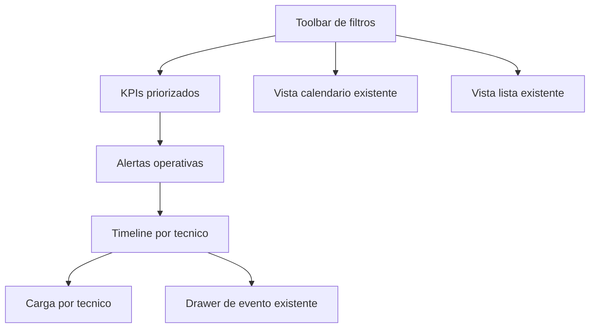

# SPEC - MOD09 Programacion / WFM Command Center

**Version:** 1.0  
**Estado:** Aprobado  
**Fecha:** 2026-05-09  
**Modo activo:** Mixto  
**Autor:** GitHub Copilot  
**PRD base:** docs/prds/PRD-MOD09-PROGRAMACION-WFM-v1.0.md  
**Addendum funcional:** docs/prds/PRD-MOD09-PROGRAMACION-WFM-ADDENDUM-COMMAND-CENTER-v1.1.md  
**HLD vigente:** docs/hlds/HLD-MOD09-PROGRAMACION-WFM-v1.0.md  
**ADR vigente:** docs/adrs/ADR-037-Bounded-Context-Programacion-WFM.md  
**Plan relacionado:** docs/plans/PLAN-MOD09-PROGRAMACION-WFM-FASE-02-v1.0.md

---

## 1. Proposito

Esta spec define el corte de Fase 02 para evolucionar MOD09 desde una agenda operativa funcional hacia un command center liviano de supervision. El objetivo es mejorar visibilidad y priorizacion sin reabrir la arquitectura ni introducir dependencias nuevas de tiempo real, geolocalizacion o IA.

La decision de diseno es preservar la ruta actual `/dashboard/scheduling` y superponer una nueva vista operacional para roles de coordinacion. Las vistas calendario y lista siguen existiendo como soporte transaccional y de consulta detallada.

---

## 2. Principios de diseno

1. **Overview first**: el usuario supervisor debe entender carga, riesgo y atrasos sin entrar primero a una tabla.
2. **Reuse before new surface**: se evoluciona la pantalla actual; no se abre modulo paralelo ni nueva ruta principal.
3. **Determinismo operativo**: alertas y saturacion se calculan con reglas visibles y explicables, no con heuristicas opacas.
4. **Fallback claro**: si una fuente falla, la pantalla cae a cobertura parcial y conserva la agenda util.
5. **Ownership intacto**: la vista de supervision no amplifica privilegios para tecnicos o contratistas.

---

## 3. Alcance visual y funcional

### 3.1 Nueva vista operacional

La pantalla de scheduling incorpora una vista adicional para supervision, preferiblemente como default para roles `ADMIN`, `NOC` y `SUPPORT`.

La composicion recomendada es:

1. Encabezado con KPIs priorizados.
2. Rail o panel de alertas operativas.
3. Timeline diario por tecnico.
4. Franja de carga por tecnico.
5. Accesos secundarios a calendario y lista ya existentes.

### 3.2 Roles

- `ADMIN`, `NOC`, `SUPPORT`: ven command center completo.
- `TECHNICIAN`, `CONTRACTOR`: conservan agenda filtrada por ownership y no reciben KPIs globales ni alertas agregadas.

---

## 4. Componentes de pantalla recomendados

### 4.1 `SchedulingOverview`

Componente contenedor para la nueva vista operacional. Consume summary, events y availability ya cargados por `SchedulingClient`.

Responsabilidades:

- presentar KPIs,
- renderizar alertas,
- renderizar timeline del dia,
- mostrar carga por tecnico,
- emitir callbacks hacia drawer, filtros y cambio de vista.

### 4.2 `SchedulingAlertRail`

Lista compacta de alertas ordenadas por severidad.

Tipos de alerta aprobados para Fase 02:

- evento atrasado,
- evento que inicia pronto y sigue en `DRAFT`,
- tecnico con saturacion alta,
- cruce entre disponibilidad bloqueada y evento activo.

Cada alerta debe incluir:

- severidad,
- label de negocio,
- referencia al evento o tecnico,
- CTA para abrir detalle o aplicar filtro.

### 4.3 `SchedulingTimelineBoard`

Vista diaria por tecnico. No incluye drag-and-drop ni resize.

Reglas:

- usar el dia filtrado actualmente,
- agrupar por tecnico asignado,
- ubicar bloques por `scheduledStartAt` y `scheduledEndAt`,
- resaltar estado del evento y severidad,
- permitir click sobre bloque para abrir drawer existente.

### 4.4 `TechnicianLoadStrip`

Visual resumido de carga por tecnico con banda de saturacion.

Debe mostrar:

- nombre del tecnico,
- cantidad de eventos activos del dia,
- cantidad atrasada,
- banda `LOW`, `MEDIUM`, `HIGH`,
- accion para filtrar agenda por ese tecnico.

### 4.5 Reuso de componentes existentes

- `ScheduleEventDrawer` sigue siendo la superficie de detalle y accion.
- `SchedulingToolbar` mantiene filtros de fecha, tecnico, tipo y estado.
- `ScheduleCalendar` y `ScheduleList` se conservan.

---

## 5. Reglas operativas de datos

### 5.1 KPIs priorizados

La vista operacional debe mostrar al menos:

- trabajos activos,
- atrasados,
- proximos 7 dias,
- en ruta,
- en riesgo.

`en riesgo` se define en Fase 02 como eventos con inicio en los proximos 60 minutos que siguen en `DRAFT`, o eventos bloqueados por disponibilidad incompatible.

### 5.2 Bandas de saturacion

Regla inicial aprobada:

- `LOW`: 0 a 49% de carga esperada del dia,
- `MEDIUM`: 50 a 79%,
- `HIGH`: 80% o mas.

La carga se calcula sobre cantidad y duracion total de eventos del dia seleccionado, sin usar modelos predictivos.

### 5.3 Reglas de alerta

Orden de severidad:

1. `critical`: evento atrasado o cruce de disponibilidad bloqueada con evento activo.
2. `warning`: evento que inicia pronto y sigue en `DRAFT`, o tecnico con saturacion `HIGH`.
3. `info`: cobertura parcial o condicion operativa informativa.

Las alertas son derivadas en backend o frontend, pero deben tener la misma semantica en pruebas.

---

## 6. Contratos y backend esperado

### 6.1 `GET /wfm/dashboard/summary`

Se recomienda ampliar el contrato existente con campos aditivos:

- `activeCount`
- `atRiskCount`
- `enRouteCount`
- `alerts`
- `technicianLoad[].riskLevel`
- `technicianLoad[].overdueCount`

No se autoriza crear una tabla de alertas ni una proyeccion persistente nueva.

### 6.2 `GET /wfm/events`

Sigue siendo la fuente del timeline. No requiere endpoint nuevo si el rango diario actual ya es suficiente.

Solo se aprueban extensiones aditivas de filtros si mejoran supervision diaria sin romper compatibilidad.

### 6.3 `GET /wfm/technicians/availability`

Se mantiene como fuente para detectar bloqueos y enriquecer visualmente la carga.

---

## 7. Frontend esperado

Archivos probables a tocar o crear:

- `apps/portal/src/components/scheduling/SchedulingClient.tsx`
- `apps/portal/src/components/scheduling/SchedulingToolbar.tsx`
- `apps/portal/src/components/scheduling/scheduling-ui.ts`
- `apps/portal/src/components/scheduling/SchedulingOverview.tsx`
- `apps/portal/src/components/scheduling/SchedulingAlertRail.tsx`
- `apps/portal/src/components/scheduling/SchedulingTimelineBoard.tsx`
- `apps/portal/src/components/scheduling/TechnicianLoadStrip.tsx`

Reglas UI:

- copy en espanol,
- densidad operativa, no landing,
- colores semanticos sobrios,
- accesibilidad de focus, alerts y estados vacios,
- degradacion clara ante datos parciales.

---

## 8. Testing esperado

### Backend

- pruebas de summary extendido,
- pruebas de generacion de alertas,
- pruebas de bandas de saturacion,
- pruebas de ownership sin exposicion global a tecnicos.

### Frontend

- render de KPIs y rail de alertas,
- timeline agrupado por tecnico,
- CTA de alerta o timeline que abre drawer,
- fallback de cobertura parcial,
- gating por rol.

### E2E

- admin visualiza command center,
- aplica filtros y abre detalle desde alerta o timeline,
- tecnico no ve command center global.

---

## 9. Riesgos y decisiones de no alcance

### Riesgos

- crecer demasiado `SchedulingClient`,
- mezclar supervision con edicion drag-and-drop,
- abrir dependencias nuevas por ambicion visual.

### Decisiones explicitas

- No mapa.
- No drag-and-drop.
- No realtime.
- No IA.
- No Kanban en esta fase.
- No capacity planning por zona.

---

## 10. Decision arquitectonica aplicada

**Requiere ADR:** No.  
**Requiere CTO:** No.

La Fase 02 es una evolucion funcional y de presentacion dentro del boundary ya aprobado de MOD09. Si durante la implementacion se detecta necesidad de infraestructura realtime, mapa o un nuevo patron de integracion, el fullstack debe detenerse y escalar segun el prompt de fase.