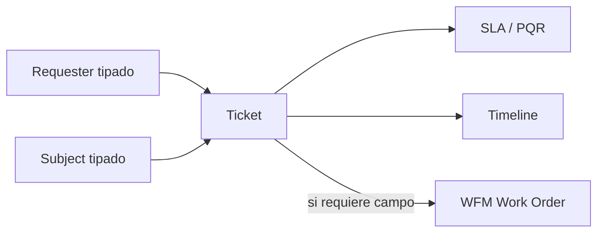
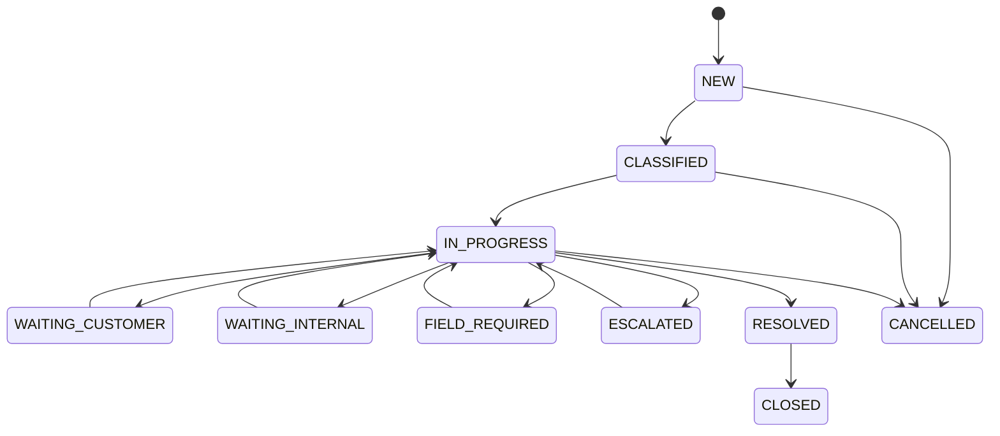

# SPEC - MOD10 Service Assurance / Mesa de Ayuda

**Version:** 1.0  
**Estado:** En revisión  
**Fecha:** 2026-05-09  
**Modo activo:** Mixto  
**Autor:** AI-EM-ARCH  
**PRD de referencia:** docs/prds/PRD-MOD10-SERVICE-ASSURANCE-v1.0.md  
**ADR propuesto:** docs/adrs/ADR-038-Bounded-Context-Service-Assurance.md  
**Referencias:** docs/ideas/mesa_de_ayuda.md, docs/hlds/HLD-MOD09-PROGRAMACION-WFM-v1.0.md, docs/adrs/ADR-037-Bounded-Context-Programacion-WFM.md

---

## 1. Decisión de diseño

MOD10 se diseña como `AssuranceModule`, bounded context dueño de tickets, SLA, PQR y escalamiento de casos. El nombre visible en UI será **Mesa de ayuda**.

La Fase 01 implementa tickets mixtos: externos ligados a cliente/suscriptor o servicio, e internos ligados a funcionarios, técnicos, contratistas, áreas internas o necesidades generales. El módulo no asume que todo ticket pertenece a un cliente.

---

## 2. Boundary funcional

### Assurance es owner de

- Ticket y su ciclo de vida.
- Comentarios y timeline de ticket.
- Clasificación, prioridad, cola y asignación actual.
- SLA de primera respuesta y resolución.
- Registro PQR CRC.
- Decisión de necesidad de campo.
- Eventos de ticket hacia Omnichannel/WFM futuros.

### Assurance no es owner de

- Agenda ni Work Orders: WFM.
- Datos maestros de suscriptor: CRM/Subscribers.
- Facturación o cartera: Billing.
- Diagnóstico de red real: NMS/Provisioning.
- Usuarios y roles: Users/Auth.
- Notificaciones: Omnichannel/Mailer.

---

## 3. Modelo de actor y objeto afectado

El ticket usa dos referencias separadas:

| Concepto | Proposito | Ejemplo |
| --- | --- | --- |
| Requester | Quien solicita o origina el caso | Suscriptor, empleado, técnico, sistema |
| Subject | Sobre qué trata el caso | Servicio, contrato, nodo, equipo, área interna |

Esta separación permite tickets internos como “fallo herramienta NOC” sin cliente, y tickets externos como “suscriptor reporta intermitencia en servicio”.



---

## 4. Flujo de estados

| Estado | Uso |
| --- | --- |
| `NEW` | Creado sin clasificación completa |
| `CLASSIFIED` | Tipo, prioridad y cola definidos |
| `IN_PROGRESS` | En atención por responsable |
| `WAITING_CUSTOMER` | Requiere respuesta del solicitante externo |
| `WAITING_INTERNAL` | Depende de otra área interna |
| `FIELD_REQUIRED` | Necesita trabajo de campo u OT |
| `ESCALATED` | Escalado funcional o jerárquico |
| `RESOLVED` | Solución registrada, pendiente cierre |
| `CLOSED` | Cerrado funcionalmente |
| `CANCELLED` | Cancelado con motivo |

Transiciones principales:



Reglas:

1. `CLOSED` y `CANCELLED` son terminales.
2. `PQR` no puede cerrarse sin registro PQR completo.
3. `FIELD_REQUIRED` requiere `fieldDecision = FIELD_SERVICE_REQUIRED` y evento emitido o bloqueo documentado.
4. `RESOLVED` requiere nota de resolución.

---

## 5. Decisión de campo y WFM

| Decisión | Resultado |
| --- | --- |
| `NOT_REQUIRED` | El ticket se atiende sin OT |
| `NEEDS_DIAGNOSIS` | Soporte/NOC debe ampliar diagnóstico antes de decidir |
| `FIELD_SERVICE_REQUIRED` | Assurance emite solicitud hacia WFM |

Evento propuesto:

```ts
type AssuranceFieldServiceNeededEvent = {
  tenantId: string;
  ticketId: string;
  ticketCode: string;
  priority: 'LOW' | 'NORMAL' | 'HIGH' | 'URGENT' | 'CRITICAL';
  requesterType: string;
  requesterRefId?: string;
  subjectType?: string;
  subjectRefId?: string;
  summary: string;
  requestedBy: string;
  requestedAt: string;
};
```

WFM decide si crea evento/OT, agenda técnico y devuelve o publica `workOrderId`. Assurance almacena solo la referencia.

---

## 6. SLA y PQR

### SLA operativo

La Fase 01 usa políticas por tipo, prioridad y cola. Campos mínimos:

- primera respuesta en minutos;
- resolución en minutos;
- si pausa o no en `WAITING_CUSTOMER`;
- si aplica calendario hábil o tiempo corrido.

### PQR CRC

PQR agrega registro regulatorio con:

- canal de recepción;
- fecha/hora de recepción;
- deadline de respuesta;
- deadline de recurso cuando aplique;
- timestamps de respuesta y cierre;
- estado regulatorio.

Si una regla CRC cambia o requiere interpretación legal, se marca como **requiere verificación con fuente oficial**.

---

## 7. UI Fase 01

Ruta sugerida: `/dashboard/assurance`.

Vistas:

- Header con KPIs: abiertos, en riesgo, vencidos, primera respuesta promedio.
- Tabs: Lista, Kanban, PQR, Internos, Mis asignados.
- Filtros: estado, tipo, prioridad, cola, responsable, requester, SLA.
- Tabla densa con celdas `align-middle`.
- Drawer de detalle con resumen, requester/subject, timeline, comentarios y acciones.
- Acción explícita: Solicitar trabajo de campo.

No se deben renderizar enums crudos; todo label visible va en español y sentence case.

---

## 8. Eventos de dominio

| Evento | Consumidor esperado | Fase |
| --- | --- | --- |
| `assurance.ticket-created` | Omnichannel/Mailer futuro | 01/02 |
| `assurance.ticket-updated` | Omnichannel/Mailer futuro | 01/02 |
| `assurance.field-service-needed` | WFM | 01 |
| `assurance.ticket-resolved` | Reporting futuro | 02 |
| `assurance.pqr-deadline-risk` | Dashboard/alertas futuro | 02 |

---

## 9. Riesgos de diseño

| Riesgo | Mitigación |
| --- | --- |
| Duplicar PII del cliente | Guardar IDs lógicos y contenido mínimo; no snapshots sensibles |
| Convertir Assurance en mini CRM | Requester/subject tipados sin ownership de datos maestros |
| Mezclar OT dentro de tickets | WFM conserva Work Orders; Assurance solo solicita/vincula |
| SLA demasiado complejo | Fase 01 con políticas simples; calendario avanzado en Fase 02 |
| PQR incompleta | Modelo separado `ticket_pqr_records` y criterios de cierre |

---

## 10. Criterio de ejecución

Este diseño puede pasar a ejecución cuando:

1. ADR-038 sea aprobado por CTO o quede autorización explícita de ejecución controlada.
2. PRD, HLD, plan y prompt estén en estado aprobado o aceptado para ejecución.
3. Fullstack confirme que MOD09/WFM expone o acepta el contrato mínimo de Work Order por evento/puerto, o documente el stub temporal.